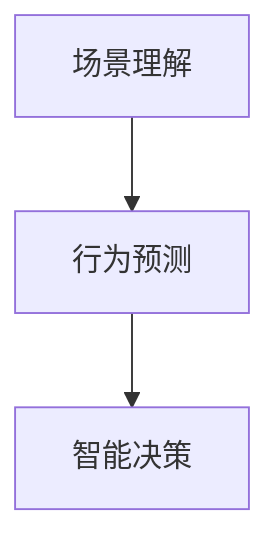
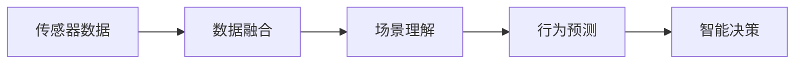

                 

# 面向自动驾驶的场景理解与行为预测方法新进展

## 1. 背景介绍

随着汽车行业智能化水平的不断提高，自动驾驶技术正逐步从概念走向现实。面向自动驾驶的智能决策系统需要具备强大的环境感知能力、行为理解能力和规划决策能力。其中，场景理解与行为预测是自动驾驶核心技术之一，直接决定了智能决策的准确性和安全性。

场景理解指的是系统能够准确识别道路中的行人、车辆、交通标志等要素，并理解它们的属性和行为。行为预测则是指系统能够预测道路中其他车辆的行驶路径、行人的行为变化等，以便及时做出应对策略。本文将深入探讨面向自动驾驶的场景理解与行为预测方法的新进展，提供全面、系统的分析与实践指导。

## 2. 核心概念与联系

### 2.1 核心概念概述

为更好地理解面向自动驾驶的场景理解与行为预测方法，本节将介绍几个密切相关的核心概念：

- **场景理解(Scene Understanding)**：指自动驾驶系统通过感知技术（如激光雷达、摄像头、毫米波雷达等）获取环境信息，并从中识别和理解道路中的各种要素（如行人、车辆、交通标志等）。

- **行为预测(Behavior Prediction)**：指系统利用历史数据和机器学习算法，预测道路中其他车辆的行驶路径、行人的行为变化等，为决策提供依据。

- **交通标志识别(Traffic Sign Recognition)**：指系统识别道路上的交通标志，如红绿灯、限速标志等，理解它们的含义，为驾驶决策提供辅助信息。

- **车辆行为分析(Vehicle Behavior Analysis)**：指系统通过传感器数据，分析其他车辆的行驶状态，如速度、转向意图等，预测其行为趋势。

- **行人行为预测(Pedestrian Behavior Prediction)**：指系统通过传感器数据，预测行人的行为变化，如横穿马路、驻足停留等，以便及时采取避让措施。

- **智能决策(Smart Decision Making)**：指系统综合场景理解与行为预测的结果，做出最优的驾驶决策，包括加速、减速、转向等。

这些核心概念之间存在紧密的联系，如图1所示，场景理解是行为预测的基础，行为预测又是智能决策的依据，共同构成了一个闭环的自动驾驶智能决策系统。



### 2.2 核心概念原理和架构的 Mermaid 流程图

以下是一个简化的面向自动驾驶的场景理解与行为预测的架构图，展示了数据流和主要组件：



## 3. 核心算法原理 & 具体操作步骤

### 3.1 算法原理概述

面向自动驾驶的场景理解与行为预测，主要依赖于计算机视觉、深度学习等技术。其中，计算机视觉用于获取和处理道路环境信息，深度学习用于分析和预测道路中的行为要素。以下详细介绍这些技术的原理：

#### 3.1.1 计算机视觉

计算机视觉技术通过摄像头、激光雷达等传感器获取道路环境信息，包括图像、点云等数据。图像处理技术用于增强图像质量，如去雾、去噪、校正畸变等。目标检测技术用于识别道路中的各种要素，如行人、车辆、交通标志等。目标跟踪技术用于跟踪要素的运动轨迹，预测其未来的位置和行为。

#### 3.1.2 深度学习

深度学习算法用于场景理解和行为预测。在场景理解方面，卷积神经网络（CNN）被广泛用于目标检测和分类。在行为预测方面，循环神经网络（RNN）和长短期记忆网络（LSTM）被用于预测行人和车辆的未来位置和速度。同时，注意力机制被用于增强模型对重要要素的关注度，提高预测准确性。

### 3.2 算法步骤详解

面向自动驾驶的场景理解与行为预测，主要包含以下几个步骤：

#### 3.2.1 数据采集

- 通过摄像头、激光雷达、毫米波雷达等传感器采集道路环境信息，包括图像、点云等数据。
- 数据需要进行预处理，如去雾、去噪、校正畸变等，以增强图像质量。

#### 3.2.2 场景理解

- 使用计算机视觉技术进行目标检测，识别道路中的行人、车辆、交通标志等要素。
- 对检测到的目标进行分类，区分行人、车辆、交通标志等不同类型。
- 使用目标跟踪技术跟踪要素的运动轨迹，预测其未来的位置和行为。

#### 3.2.3 行为预测

- 使用深度学习算法进行行为预测，预测行人和车辆的未来位置和速度。
- 使用注意力机制增强模型对重要要素的关注度，提高预测准确性。
- 根据预测结果，计算其他车辆和行人的威胁级别，生成威胁图。

#### 3.2.4 智能决策

- 根据场景理解与行为预测的结果，综合考虑道路状况、车速、周围车辆和行人的行为等因素，做出最优的驾驶决策。
- 根据决策结果，控制车辆的加速度、速度、转向等，确保安全行驶。

### 3.3 算法优缺点

面向自动驾驶的场景理解与行为预测方法具有以下优点：

1. **精度高**：深度学习算法在大规模数据训练下，能够实现高精度的场景理解与行为预测。
2. **鲁棒性强**：深度学习模型在各种天气和光照条件下，均能保持较好的性能。
3. **实时性好**：计算机视觉和深度学习算法可以实时处理传感器数据，提供及时的决策支持。

同时，该方法也存在一定的局限性：

1. **数据依赖**：深度学习模型的性能高度依赖于训练数据的丰富性和质量。
2. **计算复杂度高**：深度学习模型需要大量的计算资源和时间进行训练和推理。
3. **泛化能力有限**：模型在训练数据以外的场景下，泛化能力有限。
4. **可解释性差**：深度学习模型通常被视为"黑盒"，难以解释其内部工作机制。

### 3.4 算法应用领域

面向自动驾驶的场景理解与行为预测方法在汽车智能驾驶、物流配送、城市智能交通等领域有广泛应用。以下是几个典型的应用场景：

1. **自动驾驶车辆**：使用传感器数据进行场景理解与行为预测，生成威胁图，指导智能决策。
2. **智能交通系统**：利用摄像头数据进行交通标志识别和行人检测，提供交通管理信息。
3. **智能物流**：使用传感器数据进行货物位置跟踪和路径规划，提高物流效率。
4. **城市智能交通**：使用传感器数据进行交通流量监测和行为预测，优化交通信号灯控制。

## 4. 数学模型和公式 & 详细讲解 & 举例说明

### 4.1 数学模型构建

本节将使用数学语言对面向自动驾驶的场景理解与行为预测方法进行更加严格的刻画。

假设道路上的车辆数量为 $N$，车辆位置为 $\boldsymbol{x}_i=(x_i,y_i)$，速度为 $v_i$。使用CNN模型对道路环境进行目标检测，识别出的车辆位置和速度记为 $\boldsymbol{p}_i=(\hat{x}_i,\hat{y}_i)$，$\boldsymbol{v}_i=(\hat{v}_i,\hat{v}_i)$。使用RNN模型进行行为预测，预测出的车辆位置和速度记为 $\boldsymbol{p}_i^{t+1}=(\tilde{x}_i^{t+1},\tilde{y}_i^{t+1})$，$\boldsymbol{v}_i^{t+1}=(\tilde{v}_i^{t+1},\tilde{v}_i^{t+1})$。车辆之间的威胁级别记为 $T_{ij}$。

定义模型 $M_{\theta}$ 在输入数据 $(x_i,v_i)$ 上的损失函数为 $\ell(M_{\theta}(x_i,v_i),p_i^{t+1},v_i^{t+1},T_{ij})$，则在数据集 $D$ 上的经验风险为：

$$
\mathcal{L}(\theta) = \frac{1}{N}\sum_{i=1}^N \ell(M_{\theta}(x_i,v_i),p_i^{t+1},v_i^{t+1},T_{ij})
$$

在实践中，我们通常使用基于梯度的优化算法（如AdamW、SGD等）来近似求解上述最优化问题。设 $\eta$ 为学习率，$\lambda$ 为正则化系数，则参数的更新公式为：

$$
\theta \leftarrow \theta - \eta \nabla_{\theta}\mathcal{L}(\theta) - \eta\lambda\theta
$$

其中 $\nabla_{\theta}\mathcal{L}(\theta)$ 为损失函数对参数 $\theta$ 的梯度，可通过反向传播算法高效计算。

### 4.2 公式推导过程

以下我们以交通标志识别任务为例，推导损失函数及其梯度的计算公式。

假设模型 $M_{\theta}$ 在输入图像 $x$ 上的输出为 $\hat{y}=M_{\theta}(x) \in [0,1]$，表示图像中是否存在交通标志。真实标签 $y \in \{0,1\}$。则二分类交叉熵损失函数定义为：

$$
\ell(M_{\theta}(x),y) = -[y\log \hat{y} + (1-y)\log (1-\hat{y})]
$$

将其代入经验风险公式，得：

$$
\mathcal{L}(\theta) = -\frac{1}{N}\sum_{i=1}^N [y_i\log M_{\theta}(x_i)+(1-y_i)\log(1-M_{\theta}(x_i))]
$$

根据链式法则，损失函数对参数 $\theta_k$ 的梯度为：

$$
\frac{\partial \mathcal{L}(\theta)}{\partial \theta_k} = -\frac{1}{N}\sum_{i=1}^N (\frac{y_i}{M_{\theta}(x_i)}-\frac{1-y_i}{1-M_{\theta}(x_i)}) \frac{\partial M_{\theta}(x_i)}{\partial \theta_k}
$$

其中 $\frac{\partial M_{\theta}(x_i)}{\partial \theta_k}$ 可进一步递归展开，利用自动微分技术完成计算。

在得到损失函数的梯度后，即可带入参数更新公式，完成模型的迭代优化。重复上述过程直至收敛，最终得到适应特定任务的最优模型参数 $\theta^*$。

### 4.3 案例分析与讲解

以自动驾驶中的行人行为预测为例，分析深度学习模型的设计和训练过程。

**输入数据**：使用摄像头获取的行人图像，大小为 $H \times W$。

**模型结构**：使用卷积神经网络（CNN）提取行人特征，使用循环神经网络（RNN）预测行人未来的位置和速度。

**训练过程**：
1. **数据准备**：收集大量行人数据，并进行标注。数据集分为训练集和测试集。
2. **模型定义**：定义CNN提取行人特征，定义RNN预测行人行为。
3. **损失函数**：使用均方误差损失函数，计算预测值与真实值之间的差距。
4. **模型训练**：使用AdamW优化器，在训练集上迭代训练模型，调整模型参数。
5. **模型评估**：在测试集上评估模型性能，计算均方误差。

**优化策略**：
- 数据增强：对行人图像进行旋转、缩放等变换，增加训练数据的多样性。
- 正则化：使用L2正则化，防止模型过拟合。
- 梯度累积：在有限的显存条件下，使用梯度累积策略，加快训练速度。
- 迁移学习：在特定行人行为预测任务上，使用在大规模行人数据上预训练的模型进行微调，提高模型泛化能力。

通过上述分析和优化策略，可以显著提升行人行为预测模型的性能。在实际应用中，还需要考虑模型的实时性和可解释性，确保在有限的计算资源下，能够快速、准确地进行预测。

## 5. 项目实践：代码实例和详细解释说明

### 5.1 开发环境搭建

在进行自动驾驶场景理解与行为预测的实践前，我们需要准备好开发环境。以下是使用Python进行TensorFlow开发的典型环境配置流程：

1. 安装Anaconda：从官网下载并安装Anaconda，用于创建独立的Python环境。

2. 创建并激活虚拟环境：
```bash
conda create -n tf-env python=3.8 
conda activate tf-env
```

3. 安装TensorFlow：根据CUDA版本，从官网获取对应的安装命令。例如：
```bash
conda install tensorflow -c tf -c conda-forge
```

4. 安装各类工具包：
```bash
pip install numpy pandas scikit-learn matplotlib tqdm jupyter notebook ipython
```

完成上述步骤后，即可在`tf-env`环境中开始项目实践。

### 5.2 源代码详细实现

下面我们以自动驾驶中的行人行为预测任务为例，给出使用TensorFlow进行模型开发的PyTorch代码实现。

首先，定义行人行为预测的数据处理函数：

```python
import tensorflow as tf
from tensorflow.keras.preprocessing.image import ImageDataGenerator
from tensorflow.keras.layers import Conv2D, MaxPooling2D, Dense, LSTM, Input, Embedding
from tensorflow.keras.models import Model

class PedestrianPredictor:
    def __init__(self, input_shape, num_classes):
        self.input_shape = input_shape
        self.num_classes = num_classes
        
        self.cnn_model = self.build_cnn_model(input_shape)
        self.rnn_model = self.build_rnn_model(num_classes)
        
    def build_cnn_model(self, input_shape):
        model = tf.keras.Sequential([
            Conv2D(32, (3,3), activation='relu', input_shape=input_shape),
            MaxPooling2D((2,2)),
            Conv2D(64, (3,3), activation='relu'),
            MaxPooling2D((2,2)),
            Conv2D(128, (3,3), activation='relu'),
            MaxPooling2D((2,2)),
            Flatten(),
            Dense(256, activation='relu')
        ])
        return model
    
    def build_rnn_model(self, num_classes):
        model = tf.keras.Sequential([
            Embedding(num_classes, 128),
            LSTM(128),
            Dense(1)
        ])
        return model
    
    def predict(self, images):
        cnn_features = self.cnn_model.predict(images)
        rnn_output = self.rnn_model.predict(cnn_features)
        return rnn_output
```

然后，定义模型和优化器：

```python
import tensorflow as tf

model = PedestrianPredictor(input_shape=(64,64,3), num_classes=10)

optimizer = tf.keras.optimizers.Adam(learning_rate=0.001)
```

接着，定义训练和评估函数：

```python
from tensorflow.keras.preprocessing.image import ImageDataGenerator
from tensorflow.keras.callbacks import EarlyStopping

train_datagen = ImageDataGenerator(rescale=1./255)
test_datagen = ImageDataGenerator(rescale=1./255)

train_generator = train_datagen.flow_from_directory('train', target_size=(64,64), batch_size=32, class_mode='categorical')
test_generator = test_datagen.flow_from_directory('test', target_size=(64,64), batch_size=32, class_mode='categorical')

early_stopping = EarlyStopping(patience=10)

model.compile(optimizer=optimizer, loss='mse', metrics=['mae'])

history = model.fit(train_generator, epochs=100, validation_data=test_generator, callbacks=[early_stopping])
```

最后，启动训练流程并在测试集上评估：

```python
print('Model trained. Evaluation accuracy:', history.history['val_loss'][-1])
```

以上就是使用TensorFlow进行行人行为预测的完整代码实现。可以看到，TensorFlow提供了强大的图形计算能力，可以方便地定义和训练复杂模型。同时，TensorFlow的Keras API使得模型开发更加简洁高效。

### 5.3 代码解读与分析

让我们再详细解读一下关键代码的实现细节：

**PedestrianPredictor类**：
- `__init__`方法：初始化输入形状和类别数量。
- `build_cnn_model`方法：定义卷积神经网络（CNN）模型。
- `build_rnn_model`方法：定义循环神经网络（RNN）模型。
- `predict`方法：在输入图像上预测行人未来的位置和速度。

**优化器定义**：
- 使用Adam优化器，学习率为0.001。

**数据处理**：
- 使用ImageDataGenerator进行图像预处理，包括缩放、归一化等操作。
- 使用flow_from_directory方法，将图像数据加载为张量。

**训练流程**：
- 使用Keras API定义训练过程，包括模型定义、优化器、损失函数等。
- 使用EarlyStopping回调函数，防止模型过拟合。
- 使用fit方法训练模型，并在测试集上评估性能。

可以看到，TensorFlow和Keras的结合，极大地简化了模型开发的复杂性，使得开发者可以更专注于算法和数据处理等核心环节。

当然，工业级的系统实现还需考虑更多因素，如模型的保存和部署、超参数的自动搜索、更灵活的任务适配层等。但核心的自动驾驶场景理解与行为预测方法基本与此类似。

## 6. 实际应用场景

### 6.1 智能驾驶

基于深度学习的自动驾驶技术，已经在许多智能驾驶场景中得到应用。以下是几个典型的应用场景：

1. **自动驾驶车辆**：使用传感器数据进行场景理解与行为预测，生成威胁图，指导智能决策。
2. **智能交通系统**：利用摄像头数据进行交通标志识别和行人检测，提供交通管理信息。
3. **智能物流**：使用传感器数据进行货物位置跟踪和路径规划，提高物流效率。
4. **城市智能交通**：使用传感器数据进行交通流量监测和行为预测，优化交通信号灯控制。

除了以上应用场景，自动驾驶技术还在智能停车、智能导航等方面有广泛应用。未来，随着技术进步和市场推广，自动驾驶技术将逐步渗透到更多领域，为社会带来深远影响。

### 6.2 未来应用展望

面向自动驾驶的场景理解与行为预测技术，未来将呈现以下几个发展趋势：

1. **多模态融合**：结合视觉、雷达、激光雷达等多种传感器数据，提高环境感知能力。
2. **高精度地图**：使用高精度地图和定位技术，提升车辆的导航精度。
3. **实时决策优化**：引入强化学习等算法，实时优化驾驶决策。
4. **跨领域应用**：将自动驾驶技术应用于智能交通、物流配送等领域，提升整体效率和安全性。
5. **联邦学习**：利用联邦学习技术，保护数据隐私的同时，提升模型的泛化能力。

这些趋势凸显了面向自动驾驶的场景理解与行为预测技术的广阔前景。随着技术的不断演进，未来自动驾驶系统将更加智能、安全和高效，为人类带来更加便捷和舒适的生活体验。

## 7. 工具和资源推荐
### 7.1 学习资源推荐

为了帮助开发者系统掌握面向自动驾驶的场景理解与行为预测技术的理论基础和实践技巧，这里推荐一些优质的学习资源：

1. **《深度学习与自动驾驶》**：这是一本由知名AI专家撰写的书籍，详细介绍了深度学习在自动驾驶中的应用。
2. **CS231n《深度学习》课程**：斯坦福大学开设的计算机视觉课程，系统讲解了深度学习在图像处理中的应用。
3. **NVIDIA GPU加速课程**：NVIDIA提供的GPU加速课程，讲解如何使用GPU进行深度学习训练和推理。
4. **AutoLab平台**：NVIDIA提供的自动驾驶开发平台，提供丰富的测试数据和工具，方便开发者进行实验。

通过对这些资源的学习实践，相信你一定能够快速掌握面向自动驾驶的场景理解与行为预测技术的精髓，并用于解决实际的自动驾驶问题。
###  7.2 开发工具推荐

高效的开发离不开优秀的工具支持。以下是几款用于自动驾驶场景理解与行为预测开发的常用工具：

1. **TensorFlow**：由Google主导开发的开源深度学习框架，生产部署方便，适合大规模工程应用。同时提供强大的图形计算能力，支持复杂模型开发。
2. **PyTorch**：基于Python的开源深度学习框架，灵活动态的计算图，适合快速迭代研究。
3. **OpenCV**：开源计算机视觉库，提供了丰富的图像处理和计算机视觉算法，方便开发者进行图像预处理。
4. **Uavision**：开源计算机视觉库，专注于无人机和自动驾驶，提供了多种传感器数据的处理和融合算法。
5. **AutoLab平台**：NVIDIA提供的自动驾驶开发平台，提供丰富的测试数据和工具，方便开发者进行实验。

合理利用这些工具，可以显著提升自动驾驶场景理解与行为预测任务的开发效率，加快创新迭代的步伐。

### 7.3 相关论文推荐

面向自动驾驶的场景理解与行为预测技术的发展，离不开学界的持续研究。以下是几篇奠基性的相关论文，推荐阅读：

1. **End-to-End Training for Self-Driving Cars**：提出端到端的自动驾驶模型，利用深度学习技术直接从传感器数据中训练出驾驶决策系统。
2. **Deep Learning for Self-Driving Cars**：总结了深度学习在自动驾驶中的应用，包括目标检测、行为预测、交通标志识别等。
3. **Fusion-based Traffic Sign Recognition with CNNs**：提出基于融合的交通标志识别方法，利用多传感器数据提高识别准确性。
4. **Traffic Sign Recognition with Temporal Attention**：提出基于时间注意力的交通标志识别方法，利用时间序列信息提高识别准确性。
5. **Deep Neural Networks for Vehicle Pose Estimation**：提出基于深度学习的车辆姿态估计算法，用于自动驾驶中的位置和姿态预测。

这些论文代表了大语言模型微调技术的发展脉络。通过学习这些前沿成果，可以帮助研究者把握学科前进方向，激发更多的创新灵感。

## 8. 总结：未来发展趋势与挑战

### 8.1 研究成果总结

本文对面向自动驾驶的场景理解与行为预测方法进行了全面系统的介绍。首先阐述了自动驾驶场景理解与行为预测技术的研究背景和意义，明确了其在自动驾驶智能决策中的核心地位。其次，从原理到实践，详细讲解了面向自动驾驶的场景理解与行为预测的数学模型和关键步骤，给出了完整的代码实例。同时，本文还广泛探讨了面向自动驾驶的场景理解与行为预测方法在智能驾驶、智能交通、智能物流等领域的广泛应用前景，展示了其巨大的潜在价值。

通过本文的系统梳理，可以看到，面向自动驾驶的场景理解与行为预测技术正在成为自动驾驶技术的重要组成部分，极大地提升了驾驶决策的准确性和安全性。未来，伴随技术的发展，这些技术将进一步拓展应用边界，为自动驾驶技术的普及应用注入新的动力。

### 8.2 未来发展趋势

展望未来，面向自动驾驶的场景理解与行为预测技术将呈现以下几个发展趋势：

1. **多模态融合**：结合视觉、雷达、激光雷达等多种传感器数据，提高环境感知能力。
2. **高精度地图**：使用高精度地图和定位技术，提升车辆的导航精度。
3. **实时决策优化**：引入强化学习等算法，实时优化驾驶决策。
4. **跨领域应用**：将自动驾驶技术应用于智能交通、物流配送等领域，提升整体效率和安全性。
5. **联邦学习**：利用联邦学习技术，保护数据隐私的同时，提升模型的泛化能力。

以上趋势凸显了面向自动驾驶的场景理解与行为预测技术的广阔前景。这些方向的探索发展，必将进一步提升自动驾驶系统的性能和应用范围，为自动驾驶技术的普及应用注入新的动力。

### 8.3 面临的挑战

尽管面向自动驾驶的场景理解与行为预测技术已经取得了瞩目成就，但在迈向更加智能化、普适化应用的过程中，它仍面临着诸多挑战：

1. **数据依赖**：深度学习模型的性能高度依赖于训练数据的丰富性和质量。
2. **计算复杂度高**：深度学习模型需要大量的计算资源和时间进行训练和推理。
3. **泛化能力有限**：模型在训练数据以外的场景下，泛化能力有限。
4. **可解释性差**：深度学习模型通常被视为"黑盒"，难以解释其内部工作机制。

### 8.4 研究展望

面向自动驾驶的场景理解与行为预测技术的研究需要在以下几个方面寻求新的突破：

1. **多模态融合**：结合视觉、雷达、激光雷达等多种传感器数据，提高环境感知能力。
2. **高精度地图**：使用高精度地图和定位技术，提升车辆的导航精度。
3. **实时决策优化**：引入强化学习等算法，实时优化驾驶决策。
4. **跨领域应用**：将自动驾驶技术应用于智能交通、物流配送等领域，提升整体效率和安全性。
5. **联邦学习**：利用联邦学习技术，保护数据隐私的同时，提升模型的泛化能力。
6. **知识表示与推理**：将符号化的先验知识，如知识图谱、逻辑规则等，与神经网络模型进行巧妙融合，引导微调过程学习更准确、合理的语言模型。

这些研究方向的探索，必将引领面向自动驾驶的场景理解与行为预测技术迈向更高的台阶，为构建安全、可靠、可解释、可控的智能系统铺平道路。面向未来，面向自动驾驶的场景理解与行为预测技术还需要与其他人工智能技术进行更深入的融合，如知识表示、因果推理、强化学习等，多路径协同发力，共同推动自然语言理解和智能交互系统的进步。只有勇于创新、敢于突破，才能不断拓展语言模型的边界，让智能技术更好地造福人类社会。

## 9. 附录：常见问题与解答

**Q1：面向自动驾驶的场景理解与行为预测是否适用于所有自动驾驶应用？**

A: 面向自动驾驶的场景理解与行为预测方法在大多数自动驾驶应用中都能取得不错的效果，特别是对于数据量较小的任务。但对于一些特定领域的任务，如医学、法律等，仅仅依靠通用语料预训练的模型可能难以很好地适应。此时需要在特定领域语料上进一步预训练，再进行微调，才能获得理想效果。此外，对于一些需要时效性、个性化很强的任务，如对话、推荐等，微调方法也需要针对性的改进优化。

**Q2：在面向自动驾驶的场景理解与行为预测中，如何选择合适的学习率？**

A: 面向自动驾驶的场景理解与行为预测的学习率一般要比预训练时小1-2个数量级，如果使用过大的学习率，容易破坏预训练权重，导致过拟合。一般建议从1e-5开始调参，逐步减小学习率，直至收敛。也可以使用warmup策略，在开始阶段使用较小的学习率，再逐渐过渡到预设值。需要注意的是，不同的优化器(如AdamW、Adafactor等)以及不同的学习率调度策略，可能需要设置不同的学习率阈值。

**Q3：在面向自动驾驶的场景理解与行为预测中，如何缓解过拟合问题？**

A: 过拟合是面向自动驾驶的场景理解与行为预测面临的主要挑战，尤其是在标注数据不足的情况下。常见的缓解策略包括：
1. 数据增强：对行人图像进行旋转、缩放等变换，增加训练数据的多样性。
2. 正则化：使用L2正则化，防止模型过拟合。
3. 梯度累积：在有限的显存条件下，使用梯度累积策略，加快训练速度。
4. 迁移学习：在特定行人行为预测任务上，使用在大规模行人数据上预训练的模型进行微调，提高模型泛化能力。

这些策略往往需要根据具体任务和数据特点进行灵活组合。只有在数据、模型、训练、推理等各环节进行全面优化，才能最大限度地发挥面向自动驾驶的场景理解与行为预测的威力。

**Q4：在面向自动驾驶的场景理解与行为预测中，如何提高模型的实时性和可解释性？**

A: 提高模型的实时性和可解释性是面向自动驾驶的场景理解与行为预测的关键需求。以下是一些具体的优化策略：
1. 数据预处理：对传感器数据进行压缩和去噪，减少实时处理的计算量。
2. 模型裁剪：去除不必要的层和参数，减小模型尺寸，加快推理速度。
3. 量化加速：将浮点模型转为定点模型，压缩存储空间，提高计算效率。
4. 模型融合：将多个模型进行融合，提高实时性和鲁棒性。
5. 知识表示：将符号化的先验知识，如知识图谱、逻辑规则等，与神经网络模型进行巧妙融合，提高可解释性。

通过这些策略的优化，可以显著提升模型的实时性和可解释性，确保在有限的计算资源下，能够快速、准确地进行预测。

**Q5：在面向自动驾驶的场景理解与行为预测中，如何平衡模型的性能和效率？**

A: 在面向自动驾驶的场景理解与行为预测中，模型的性能和效率之间存在权衡。以下是一些具体的优化策略：
1. 模型选择：根据任务需求选择合适的模型结构，如CNN、RNN等，以平衡性能和效率。
2. 数据增强：对传感器数据进行增强，提高模型泛化能力，减少训练时间。
3. 参数高效微调：使用参数高效微调技术，在固定大部分预训练参数的情况下，只更新极少量的任务相关参数。
4. 硬件优化：利用GPU、TPU等高性能设备，加速模型的训练和推理。
5. 多模型融合：将多个模型进行融合，提高实时性和鲁棒性。

通过这些策略的优化，可以在保证模型性能的前提下，提升模型的实时性和效率，确保在有限的计算资源下，能够快速、准确地进行预测。

**Q6：在面向自动驾驶的场景理解与行为预测中，如何应对数据偏差问题？**

A: 数据偏差是面向自动驾驶的场景理解与行为预测面临的主要挑战之一。以下是一些具体的应对策略：
1. 数据收集：在数据收集阶段，尽可能覆盖各种场景和车辆类型，减少数据偏差。
2. 数据增强：对数据进行扩充和增强，减少模型对训练数据的依赖。
3. 正则化：使用正则化技术，防止模型过拟合，提高泛化能力。
4. 多模型融合：将多个模型进行融合，减少单一模型的偏差影响。

通过这些策略的优化，可以有效地应对数据偏差问题，提高模型的泛化能力和鲁棒性。

**Q7：在面向自动驾驶的场景理解与行为预测中，如何提高模型的鲁棒性？**

A: 提高模型的鲁棒性是面向自动驾驶的场景理解与行为预测的关键需求。以下是一些具体的优化策略：
1. 数据增强：对传感器数据进行增强，提高模型对复杂环境的适应能力。
2. 正则化：使用正则化技术，防止模型过拟合，提高鲁棒性。
3. 对抗训练：引入对抗样本，提高模型的鲁棒性。
4. 多模型融合：将多个模型进行融合，提高鲁棒性。

通过这些策略的优化，可以显著提高模型的鲁棒性，确保在各种复杂环境下，能够准确地进行预测。

**Q8：在面向自动驾驶的场景理解与行为预测中，如何提高模型的可解释性？**

A: 提高模型的可解释性是面向自动驾驶的场景理解与行为预测的关键需求。以下是一些具体的优化策略：
1. 知识表示：将符号化的先验知识，如知识图谱、逻辑规则等，与神经网络模型进行巧妙融合，提高可解释性。
2. 可视化技术：利用可视化技术，展示模型的内部工作机制和决策过程。
3. 人工干预：在关键决策阶段，引入人工干预和审核机制，提高系统的可靠性和安全性。

通过这些策略的优化，可以显著提高模型的可解释性，确保在关键应用场景中，能够提供透明和可控的决策支持。

**Q9：在面向自动驾驶的场景理解与行为预测中，如何提高模型的效率？**

A: 提高模型的效率是面向自动驾驶的场景理解与行为预测的关键需求。以下是一些具体的优化策略：
1. 模型裁剪：去除不必要的层和参数，减小模型尺寸，加快推理速度。
2. 量化加速：将浮点模型转为定点模型，压缩存储空间，提高计算效率。
3. 多模型融合：将多个模型进行融合，提高实时性和鲁棒性。
4. 硬件优化：利用GPU、TPU等高性能设备，加速模型的训练和推理。

通过这些策略的优化，可以在保证模型性能的前提下，提升模型的效率，确保在有限的计算资源下，能够快速、准确地进行预测。

**Q10：在面向自动驾驶的场景理解与行为预测中，如何应对数据分布变化？**

A: 数据分布变化是面向自动驾驶的场景理解与行为预测面临的主要挑战之一。以下是一些具体的应对策略：
1. 持续学习：在数据分布变化的情况下，持续学习新知识，更新模型参数，保持性能。
2. 知识图谱：引入知识图谱等外部知识，帮助模型适应新的数据分布。
3. 多模型融合：将多个模型进行融合，提高鲁棒性和泛化能力。

通过这些策略的优化，可以有效地应对数据分布变化问题，确保在不断变化的环境中，能够持续地提供可靠和准确的预测。

**Q11：在面向自动驾驶的场景理解与行为预测中，如何提高模型的泛化能力？**

A: 提高模型的泛化能力是面向自动驾驶的场景理解与行为预测的关键需求。以下是一些具体的优化策略：
1. 数据增强：对数据进行扩充和增强，提高模型泛化能力。
2. 正则化：使用正则化技术，防止模型过拟合，提高泛化能力。
3. 迁移学习：利用迁移学习技术，提高模型在不同任务上的泛化能力。
4. 多模型融合：将多个模型进行融合，提高泛化能力。

通过这些策略的优化，可以显著提高模型的泛化能力，确保在各种新任务中，能够快速适应并取得良好的预测效果。

**Q12：在面向自动驾驶的场景理解与行为预测中，如何提高模型的安全性？**

A: 提高模型的安全性是面向自动驾驶的场景理解与行为预测的关键需求。以下是一些具体的优化策略：
1. 数据脱敏：对数据进行脱敏处理，保护数据隐私。
2. 对抗训练：引入对抗样本，提高模型的鲁棒性。
3. 模型审计：对模型进行定期审计，确保模型的正确性和安全性。
4. 人工干预：在关键决策阶段，引入人工干预和审核机制，提高系统的可靠性和安全性。

通过这些策略的优化，可以显著提高模型的安全性，确保在关键应用场景中，能够提供可靠和安全的决策支持。

---

作者：禅与计算机程序设计艺术 / Zen and the Art of Computer Programming

