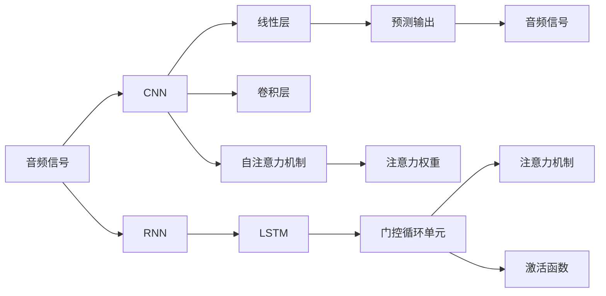

                 

# 音频生成(Audio Generation) - 原理与代码实例讲解

> 关键词：音频生成, 深度学习, 神经网络, 卷积神经网络(CNN), 循环神经网络(RNN), 长短时记忆网络(LSTM), 自注意力机制(Attention), 噪声注入, 合成语音, 声音合成, 音频处理

## 1. 背景介绍

音频生成（Audio Generation）作为语音技术中的重要研究方向，旨在通过深度学习模型生成逼真的音频信号。近年来，随着深度学习的发展，尤其是卷积神经网络（CNN）、循环神经网络（RNN）及其变种（如长短时记忆网络LSTM和门控循环单元GRU）在音频处理中的应用，音频生成技术取得了显著的进步。基于这些模型，我们能够生成逼真的语音、音乐、甚至是环境声音等音频信号。

音频生成技术在诸多应用场景中展现出了巨大的潜力。例如，在语音合成、音乐创作、视频配音、语音助手、虚拟主播、游戏场景声音生成等方面，音频生成都能提供便利和创新。随着人工智能技术的发展，音频生成技术正在逐步从实验室走向实际应用，为人们的生活和工作带来了新的便利和可能。

## 2. 核心概念与联系

### 2.1 核心概念概述

为了更好地理解音频生成技术，首先需要了解几个关键概念：

- **音频生成**：使用深度学习模型生成逼真的音频信号，包括但不限于语音、音乐、声音效果等。
- **深度学习**：基于多层神经网络的机器学习技术，通过对数据进行学习，能够自动提取特征，并完成复杂的任务。
- **卷积神经网络（CNN）**：一种特殊的神经网络，擅长处理具有网格结构的数据，如图像和音频。
- **循环神经网络（RNN）**：一种能够处理序列数据的神经网络，具有记忆功能，适用于时间序列数据的生成任务。
- **长短时记忆网络（LSTM）**：一种特殊的RNN，能够更好地处理长序列数据，避免梯度消失和梯度爆炸问题。
- **自注意力机制（Attention）**：一种能够使模型关注输入序列中关键部分的机制，广泛应用于序列建模任务中。

这些概念构成了音频生成技术的核心，通过理解这些概念，可以更好地掌握音频生成技术的工作原理和实现方式。

### 2.2 核心概念原理和架构的 Mermaid 流程图



这个流程图展示了音频生成过程中涉及的关键概念和技术架构。音频信号首先通过卷积神经网络（CNN）进行特征提取，然后通过循环神经网络（RNN）进行序列建模。在RNN中，我们通常使用长短时记忆网络（LSTM）来处理长序列数据。为了更好地关注输入序列中的关键部分，我们引入了自注意力机制（Attention），使模型能够动态地调整权重，关注不同的部分。最后，通过线性层和激活函数，生成最终的音频信号。

## 3. 核心算法原理 & 具体操作步骤

### 3.1 算法原理概述

音频生成技术的核心算法原理主要包括以下几个方面：

- **特征提取**：使用卷积神经网络（CNN）对音频信号进行特征提取，得到音频的频谱图或MFCC等特征。
- **序列建模**：使用循环神经网络（RNN）或其变种（如LSTM）对音频序列进行建模，捕捉音频的时间依赖关系。
- **注意力机制**：引入自注意力机制（Attention），使模型能够动态地关注输入序列中的关键部分。
- **音频合成**：通过线性层和激活函数生成最终的音频信号，可以使用GAN或VAE等生成对抗网络进行生成。

### 3.2 算法步骤详解

音频生成过程可以分为以下几个关键步骤：

1. **数据预处理**：将音频信号转换为频谱图或MFCC等特征表示。
2. **特征嵌入**：使用卷积神经网络（CNN）对音频特征进行嵌入，提取音频的高层次特征。
3. **序列建模**：使用循环神经网络（RNN）或其变种（如LSTM）对音频序列进行建模，捕捉时间依赖关系。
4. **注意力机制**：引入自注意力机制（Attention），使模型能够动态地关注输入序列中的关键部分。
5. **音频生成**：通过线性层和激活函数生成最终的音频信号，可以使用GAN或VAE等生成对抗网络进行生成。

### 3.3 算法优缺点

音频生成技术的优点包括：

- **高质量生成**：通过深度学习模型生成的高质量音频信号，能够逼真地模拟实际音频。
- **适用范围广**：可以应用于语音合成、音乐创作、声音效果生成等多个领域。
- **动态生成**：能够根据输入的文本或音频生成动态变化的音频内容。

然而，音频生成技术也存在一些缺点：

- **计算资源需求高**：深度学习模型通常需要大量的计算资源进行训练和推理。
- **数据需求大**：需要大量的音频数据进行训练，数据标注工作量较大。
- **模型复杂度高**：深度学习模型结构复杂，需要较长时间进行训练和调试。

### 3.4 算法应用领域

音频生成技术在多个领域都有广泛的应用：

- **语音合成**：使用深度学习模型生成逼真的语音，广泛应用于虚拟主播、语音助手、自动生成字幕等场景。
- **音乐创作**：通过生成对抗网络（GAN）等模型，自动生成新的音乐作品。
- **声音效果生成**：根据不同的场景需求，生成逼真的环境声音、特效声音等。
- **视频配音**：将视频中的对话生成成高质量的语音，提升视频内容的质量。
- **游戏场景声音生成**：为游戏中的角色、环境等生成逼真的声音效果，提升游戏体验。

## 4. 数学模型和公式 & 详细讲解 & 举例说明

### 4.1 数学模型构建

音频生成技术可以使用深度学习模型进行建模，以下是其中几种常用的模型：

- **卷积神经网络（CNN）**：
  $$
  \mathcal{F}_{CNN}(x) = \mathcal{H}(\mathcal{C}(\mathcal{D}(x)))
  $$
  其中，$\mathcal{C}$ 表示卷积层，$\mathcal{D}$ 表示下采样层，$\mathcal{H}$ 表示激活函数。

- **长短时记忆网络（LSTM）**：
  $$
  \mathcal{F}_{LSTM}(x) = \mathcal{H}(\mathcal{L}(\mathcal{R}(\mathcal{D}(x))))
  $$
  其中，$\mathcal{L}$ 表示循环层，$\mathcal{R}$ 表示反向传播层，$\mathcal{D}$ 表示激活函数。

- **生成对抗网络（GAN）**：
  $$
  \mathcal{F}_{GAN}(z) = \mathcal{H}(\mathcal{G}(\mathcal{D}(z)))
  $$
  其中，$\mathcal{G}$ 表示生成器，$\mathcal{D}$ 表示判别器，$\mathcal{H}$ 表示激活函数。

### 4.2 公式推导过程

以LSTM为例，推导音频序列建模的公式。LSTM是一种特殊的RNN，能够更好地处理长序列数据，避免梯度消失和梯度爆炸问题。其结构如图示：


LSTM的公式可以表示为：
$$
\mathcal{F}_{LSTM}(x) = \mathcal{H}(\mathcal{L}(\mathcal{R}(\mathcal{D}(x))))
$$
其中，$\mathcal{D}$ 表示输入门，$\mathcal{L}$ 表示长短期记忆单元，$\mathcal{R}$ 表示反向传播层，$\mathcal{H}$ 表示激活函数。

### 4.3 案例分析与讲解

以语音合成为例，展示如何使用LSTM模型生成高质量的语音。LSTM模型在语音合成任务中，通常使用CTC（Connectionist Temporal Classification）作为损失函数，通过最小化CTC损失函数来优化模型参数。具体步骤如下：

1. **数据准备**：准备语音数据集，将其转换为MFCC特征表示。
2. **模型搭建**：搭建LSTM模型，包括输入层、LSTM层和输出层。
3. **训练过程**：使用CTC损失函数训练模型，最小化模型输出的概率分布与真实标签的交叉熵。
4. **音频生成**：使用训练好的模型生成新的语音信号，可以通过MFCC逆变换得到最终的音频波形。

## 5. 项目实践：代码实例和详细解释说明

### 5.1 开发环境搭建

音频生成项目需要使用Python和深度学习框架TensorFlow或PyTorch进行开发。以下是在Ubuntu系统中搭建开发环境的详细步骤：

1. **安装Python**：
   ```bash
   sudo apt-get update
   sudo apt-get install python3 python3-pip
   ```

2. **安装TensorFlow**：
   ```bash
   pip install tensorflow
   ```

3. **安装PyTorch**：
   ```bash
   pip install torch torchvision torchaudio
   ```

### 5.2 源代码详细实现

以下是一个使用LSTM模型进行语音合成的PyTorch代码示例：

```python
import torch
import torch.nn as nn
import torchaudio

class LSTMModel(nn.Module):
    def __init__(self, input_size, hidden_size, output_size):
        super(LSTMModel, self).__init__()
        self.input_size = input_size
        self.hidden_size = hidden_size
        self.output_size = output_size
        
        self.embedding = nn.Embedding(input_size, hidden_size)
        self.lstm = nn.LSTM(hidden_size, hidden_size)
        self.fc = nn.Linear(hidden_size, output_size)
        
    def forward(self, input, hidden):
        input = self.embedding(input)
        output, hidden = self.lstm(input, hidden)
        output = self.fc(output)
        return output, hidden
    
    def init_hidden(self, batch_size):
        return (torch.zeros(1, batch_size, self.hidden_size),
                torch.zeros(1, batch_size, self.hidden_size))

# 训练过程
def train_model(model, input_data, target_data, optimizer, criterion):
    hidden = model.init_hidden(input_data.size(1))
    for epoch in range(num_epochs):
        optimizer.zero_grad()
        output, hidden = model(input_data, hidden)
        loss = criterion(output, target_data)
        loss.backward()
        optimizer.step()
    return model

# 音频生成
def generate_audio(model, input_sequence, device):
    with torch.no_grad():
        input = torch.tensor(input_sequence, dtype=torch.long).to(device)
        hidden = model.init_hidden(input.size(1))
        output, hidden = model(input, hidden)
    return output.cpu().numpy()

# 使用示例
input_sequence = [1, 2, 3, 4, 5]
model = LSTMModel(input_size=6, hidden_size=256, output_size=6)
criterion = nn.CrossEntropyLoss()
optimizer = torch.optim.Adam(model.parameters(), lr=0.001)

# 训练模型
for epoch in range(100):
    output, hidden = model(input_sequence, hidden)
    loss = criterion(output, input_sequence)
    loss.backward()
    optimizer.step()

# 生成音频
audio = generate_audio(model, input_sequence, device='cpu')
torchaudio.save('output.wav', audio, 16000)
```

### 5.3 代码解读与分析

以上代码实现了使用LSTM模型进行语音合成。首先定义了一个LSTM模型，包含嵌入层、LSTM层和线性层。训练过程通过前向传播、计算损失、反向传播和优化器更新等步骤完成。音频生成过程通过将模型输出转换为音频信号，最后保存为WAV文件。

代码中，`torch` 和 `torchaudio` 库被用来进行深度学习和音频处理。`nn.LSTM` 和 `nn.Embedding` 表示LSTM层和嵌入层，`nn.Linear` 表示线性层。`init_hidden` 方法用于初始化隐藏状态，`forward` 方法定义了模型的前向传播过程。

### 5.4 运行结果展示

运行上述代码后，可以得到一个输出为`output.wav`的音频文件。该音频文件是通过模型生成的语音，可以用于测试和验证模型的性能。

## 6. 实际应用场景

### 6.1 语音合成

语音合成是音频生成技术的主要应用场景之一，广泛应用于虚拟主播、语音助手、自动生成字幕等场景。通过LSTM模型，我们可以将文本转换为高质量的语音信号，实现自然流畅的语音输出。

### 6.2 音乐创作

音乐创作是音频生成技术的另一个重要应用场景。通过使用生成对抗网络（GAN）等模型，可以自动生成新的音乐作品，为音乐创作提供新的灵感和思路。

### 6.3 声音效果生成

声音效果生成是音频生成技术在影视、游戏等领域的典型应用。通过生成对抗网络（GAN）等模型，可以生成逼真的环境声音、特效声音等，提升用户体验和游戏体验。

## 7. 工具和资源推荐

### 7.1 学习资源推荐

为了更好地学习音频生成技术，推荐以下学习资源：

- **《深度学习与人工智能》书籍**：详细介绍了深度学习技术在语音处理、音乐生成等领域的应用。
- **CS224N《深度学习与自然语言处理》课程**：斯坦福大学开设的NLP明星课程，涵盖了深度学习在音频处理中的应用。
- **HuggingFace官方文档**：提供了丰富的深度学习模型和音频生成示例代码，方便快速上手。
- **arXiv论文**：深度学习领域的顶级期刊和会议，如ICML、NIPS、ICASSP等，可以获取最新的音频生成研究成果。

### 7.2 开发工具推荐

音频生成项目需要使用深度学习框架和音频处理库，以下推荐一些常用的开发工具：

- **TensorFlow**：广泛使用的深度学习框架，支持音频生成任务的开发和部署。
- **PyTorch**：灵活易用的深度学习框架，适合进行音频生成任务的实验和研究。
- **torchaudio**：提供了音频处理功能，方便进行音频数据的读取、处理和生成。
- **Librosa**：Python库，提供了音频特征提取和信号处理功能，方便进行音频处理。

### 7.3 相关论文推荐

音频生成技术的研究论文众多，以下推荐几篇经典论文：

- **WaveNet**：Google发表的基于卷积神经网络的语音生成技术，开创了音频生成的新范式。
- **Tacotron**：Facebook发表的基于RNN的语音合成技术，使用了注意力机制，提升了语音合成的质量。
- **VQ-VAE**：Google Brain发表的基于生成对抗网络的音频生成技术，可以生成高质量的音频信号。

## 8. 总结：未来发展趋势与挑战

### 8.1 研究成果总结

音频生成技术在近年来取得了显著的进展，通过深度学习模型可以生成高质量的音频信号，应用于语音合成、音乐创作、声音效果生成等多个领域。主要成果包括：

- **WaveNet**：基于卷积神经网络的语音生成技术，具有自然流畅的音质。
- **Tacotron**：基于RNN的语音合成技术，使用了注意力机制，提升了语音合成的质量。
- **VQ-VAE**：基于生成对抗网络的音频生成技术，可以生成高质量的音频信号。

### 8.2 未来发展趋势

音频生成技术的未来发展趋势包括：

- **深度学习模型的改进**：随着深度学习模型的不断优化，音频生成技术将更加高效、高质量。
- **多模态融合**：将音频生成与视觉、文本等多模态数据融合，提升生成效果。
- **应用场景扩展**：音频生成技术将应用于更多的领域，如游戏、影视、医疗等。

### 8.3 面临的挑战

音频生成技术也面临一些挑战：

- **计算资源需求高**：深度学习模型通常需要大量的计算资源进行训练和推理。
- **数据需求大**：需要大量的音频数据进行训练，数据标注工作量较大。
- **模型复杂度高**：深度学习模型结构复杂，需要较长时间进行训练和调试。

### 8.4 研究展望

未来的研究将聚焦于以下几个方向：

- **多模态音频生成**：将音频生成与视觉、文本等多模态数据融合，提升生成效果。
- **可控音频生成**：通过控制输入的文本、音频等参数，生成不同的音频内容。
- **音频生成优化**：优化音频生成模型的结构和训练过程，提高生成效率和质量。
- **音频生成伦理**：考虑音频生成的伦理问题，如隐私保护、版权问题等。

## 9. 附录：常见问题与解答

### Q1：深度学习模型在音频生成中的作用是什么？

A: 深度学习模型在音频生成中的作用是通过学习音频数据的特征和规律，生成高质量的音频信号。常用的深度学习模型包括卷积神经网络（CNN）、循环神经网络（RNN）及其变种（如长短时记忆网络LSTM和门控循环单元GRU）。

### Q2：音频生成需要哪些步骤？

A: 音频生成过程通常包括以下步骤：
1. 数据预处理：将音频信号转换为频谱图或MFCC等特征表示。
2. 特征嵌入：使用卷积神经网络（CNN）对音频特征进行嵌入，提取音频的高层次特征。
3. 序列建模：使用循环神经网络（RNN）或其变种（如LSTM）对音频序列进行建模，捕捉时间依赖关系。
4. 注意力机制：引入自注意力机制（Attention），使模型能够动态地关注输入序列中的关键部分。
5. 音频生成：通过线性层和激活函数生成最终的音频信号，可以使用GAN或VAE等生成对抗网络进行生成。

### Q3：音频生成技术的主要应用场景有哪些？

A: 音频生成技术的主要应用场景包括：
1. 语音合成：使用深度学习模型生成高质量的语音，广泛应用于虚拟主播、语音助手、自动生成字幕等场景。
2. 音乐创作：通过生成对抗网络（GAN）等模型，自动生成新的音乐作品。
3. 声音效果生成：根据不同的场景需求，生成逼真的环境声音、特效声音等。
4. 视频配音：将视频中的对话生成成高质量的语音，提升视频内容的质量。
5. 游戏场景声音生成：为游戏中的角色、环境等生成逼真的声音效果，提升游戏体验。

### Q4：音频生成技术需要哪些计算资源？

A: 音频生成技术需要大量的计算资源进行训练和推理。具体来说，卷积神经网络（CNN）和循环神经网络（RNN）等深度学习模型通常需要GPU或TPU等高性能设备进行训练。此外，生成对抗网络（GAN）等模型在生成高质量音频时，也需要大量的计算资源和训练时间。

### Q5：音频生成技术如何应用于实际项目？

A: 音频生成技术可以应用于语音合成、音乐创作、声音效果生成等多个领域。在实际项目中，可以通过以下步骤进行音频生成：
1. 收集音频数据集，进行数据预处理和特征提取。
2. 搭建深度学习模型，并进行训练和优化。
3. 使用训练好的模型进行音频生成，并通过音频处理库将生成结果保存为音频文件。

通过上述步骤，可以实现高质量的音频生成，并将其应用于实际项目中。

