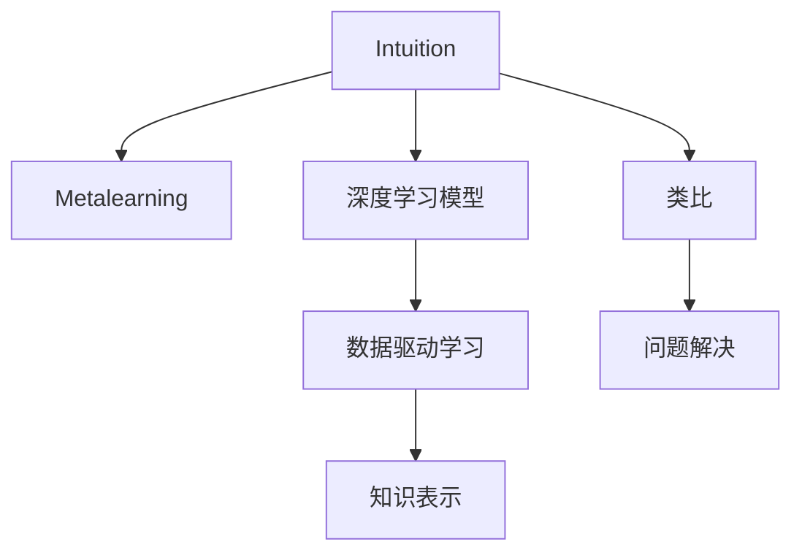

                 

# 顿悟与类比：知识的桥梁

## 1. 背景介绍

### 1.1 问题由来
在人类认知科学和人工智能领域，知识与学习的本质一直是探索的焦点。如何构建知识表示，如何高效学习新知，以及如何将知识进行有效应用，是研究者们不断追问的问题。近年来，随着深度学习技术的不断突破，尤其是基于神经网络的模型在各个领域取得了显著成果，人们开始探索如何更好地利用数据和模型进行知识表示和学习。

然而，神经网络模型在复杂性和数据依赖性上存在局限性，往往需要大量的标注数据进行训练。与此同时，人类学习知识时，更多地依赖于直觉和类比，而非直接通过数据学习。这种直觉和类比的能力，使人类在遇到新问题时，能够快速找到问题的本质和解决方法。

因此，本文尝试将人类学习的直觉和类比能力，与深度学习模型的数据驱动方法结合起来，探讨如何构建一种新的知识表示与学习范式，既能充分利用数据的优势，又能发挥人类学习的优势。

### 1.2 问题核心关键点
本文将探讨以下核心问题：
1. 人类学习的直觉和类比机制是怎样的？
2. 如何设计深度学习模型，使其具备类比学习的能力？
3. 如何将类比学习与数据驱动学习相结合，提升模型的泛化能力？

这些问题的解答将帮助我们构建一种新的知识表示与学习范式，实现更加高效和智能的知识获取与推理。

## 2. 核心概念与联系

### 2.1 核心概念概述

为更好地理解本文的核心概念，本节将介绍几个关键概念：

- 直觉(Intuition)：人类在学习新知识时，能够通过已有的知识经验和直观感受，迅速判断新知识的合理性。
- 类比(Metaphor)：人类在解决复杂问题时，往往通过将问题与已知的类似情况进行类比，从而找到解决方案。
- 深度学习模型(Deep Learning Model)：一种通过多层神经网络，自动学习特征表示的模型。
- 数据驱动学习(Data-Driven Learning)：模型通过大量标注数据进行训练，学习输入与输出之间的映射关系。
- 知识表示(Knowledge Representation)：将知识以结构化或非结构化的形式，存储在计算机中，便于机器处理和推理。
- 元学习(Metacognition)：学习者对学习过程的认知和调节能力，包括学习策略的制定、学习资源的分配等。

这些概念之间的逻辑关系可以通过以下Mermaid流程图来展示：



这个流程图展示了几组核心概念之间的联系：

1. 直觉与元学习相辅相成，是人类学习新知识的基础。
2. 深度学习模型通过数据驱动学习，能够自动提取特征，形成结构化的知识表示。
3. 知识表示为机器理解和推理提供了基础。
4. 类比学习通过模型间的关联，提升了解决复杂问题的能力。
5. 问题解决是学习的最终目的，通过类比和知识表示，实现智能决策。

## 3. 核心算法原理 & 具体操作步骤

### 3.1 算法原理概述

基于直觉和类比的学习，可以理解为一种元学习过程。其核心思想是：将已有的知识经验与新问题的特征进行类比，快速形成对新问题的初步理解，再通过数据驱动学习，对模型进行微调，最终实现对新问题的有效解决。

形式化地，假设已知任务 $T_1$ 的专家知识 $K_1$，待学习任务 $T_2$ 与 $T_1$ 有部分特征相似，则可以通过类比学习得到 $T_2$ 的初步知识 $K_2$，通过数据驱动学习对 $K_2$ 进行微调，得到 $T_2$ 的最终解决方案 $S_2$。

$$
S_2 = \mathcal{M}(K_2) + \mathcal{F}(D_2)
$$

其中 $\mathcal{M}$ 表示类比学习过程，$\mathcal{F}$ 表示数据驱动学习过程，$D_2$ 表示任务 $T_2$ 的标注数据集。

### 3.2 算法步骤详解

基于直觉和类比的学习过程，通常包括以下几个关键步骤：

**Step 1: 提取知识特征**
- 收集与已知任务 $T_1$ 相关的专家知识 $K_1$，将其表示为特征向量 $F_1$。
- 对新任务 $T_2$ 的特征进行提取，形成特征向量 $F_2$。

**Step 2: 进行类比学习**
- 利用类比学习算法，将 $F_1$ 与 $F_2$ 进行相似度计算，得到初步知识 $K_2$。
- 将 $K_2$ 转换为可用的模型表示，如使用神经网络对知识进行编码。

**Step 3: 数据驱动学习**
- 在任务 $T_2$ 的标注数据集 $D_2$ 上，对类比后的知识 $K_2$ 进行微调，优化模型参数。
- 使用正则化技术，防止模型过拟合。
- 采用对抗训练等技术，提高模型的鲁棒性。

**Step 4: 评估与调整**
- 在验证集上评估模型性能，根据评估结果调整学习策略。
- 重复Step 2至Step 4，直到模型性能稳定为止。

**Step 5: 应用与迭代**
- 在实际应用中，利用微调后的模型进行问题解决。
- 根据新遇到的挑战，再次进行Step 1至Step 4，持续迭代改进。

### 3.3 算法优缺点

基于直觉和类比的学习方法具有以下优点：
1. 速度快。通过类比学习，可以快速获得新任务的初步解决方案，避免了大量数据驱动学习的需求。
2. 泛化能力强。类比学习能将已知任务的知识迁移到新任务，提升模型的泛化能力。
3. 可解释性好。类比学习过程能够揭示新任务与已知任务的相似性，便于理解和学习。
4. 灵活性高。类比学习可以灵活运用已有的知识经验，适用于多种新任务的解决。

同时，该方法也存在一定的局限性：
1. 对类比特征的依赖。类比学习依赖于对特征的准确提取和相似度计算，如果特征提取不充分，会导致模型性能下降。
2. 数据驱动学习的依赖。即使通过类比学习获得了初步知识，最终仍需要通过数据驱动学习进行微调，才能获得最终的解决方案。
3. 对知识表示的依赖。类比学习需要将知识表示为结构化的特征向量，这可能涉及较多的预处理工作。
4. 模型的复杂性。类比学习后的模型可能需要较多的优化，才能达到理想的效果。

尽管存在这些局限性，但基于直觉和类比的学习方法，为深度学习模型提供了新的视角，能够显著提升模型的泛化能力和可解释性。

### 3.4 算法应用领域

基于直觉和类比的学习方法，在多个领域得到了广泛应用，例如：

- 自动编程：通过类比已有的代码片段，生成新的代码片段。
- 机器翻译：利用已知的语言规则，生成新的翻译文本。
- 计算机视觉：通过类比已知的图像特征，生成新的图像或图像描述。
- 自然语言处理：利用已有的语言模型，生成新的文本或文本描述。
- 知识图谱构建：通过类比已有的知识图谱，构建新的知识图谱。

除了这些经典应用外，类比学习还被创新性地应用到更多场景中，如生成对抗网络(GANs)中的对抗样本生成、迁移学习中的跨领域知识迁移等，为深度学习模型带来了新的突破。

## 4. 数学模型和公式 & 详细讲解

### 4.1 数学模型构建

本节将使用数学语言对基于直觉和类比的学习过程进行更加严格的刻画。

假设已知任务 $T_1$ 的专家知识 $K_1$ 表示为向量 $F_1 \in \mathbb{R}^d$，新任务 $T_2$ 的特征向量表示为 $F_2 \in \mathbb{R}^d$。类比学习过程可以表示为：

$$
K_2 = \mathcal{M}(F_1, F_2)
$$

其中 $\mathcal{M}$ 表示类比学习算法，可以根据具体的算法进行选择。

将 $K_2$ 转换为神经网络模型 $M$ 的输入，数据驱动学习过程可以表示为：

$$
S_2 = M(K_2) + \mathcal{F}(D_2)
$$

其中 $M$ 为神经网络模型，$\mathcal{F}$ 表示数据驱动学习算法，$D_2$ 表示任务 $T_2$ 的标注数据集。

### 4.2 公式推导过程

以下我们以简单的向量类比为例，推导类比学习的过程。

假设已知任务 $T_1$ 的专家知识 $K_1$ 表示为向量 $F_1 = [1, 2, 3]$，新任务 $T_2$ 的特征向量表示为 $F_2 = [4, 5, 6]$。采用欧式距离度量，计算 $F_1$ 和 $F_2$ 的相似度：

$$
\text{similarity} = \frac{\lVert F_1 - F_2 \rVert^2}{\lVert F_1 \rVert^2 + \lVert F_2 \rVert^2}
$$

得到初步知识 $K_2 = \alpha F_1 + (1-\alpha)F_2$，其中 $\alpha$ 表示相似度权重。将 $K_2$ 转换为神经网络模型的输入，数据驱动学习过程可以表示为：

$$
S_2 = M(\alpha F_1 + (1-\alpha)F_2) + \mathcal{F}(D_2)
$$

其中 $M$ 为神经网络模型，$\mathcal{F}$ 表示数据驱动学习算法，$D_2$ 表示任务 $T_2$ 的标注数据集。

### 4.3 案例分析与讲解

假设我们希望利用类比学习，在MNIST手写数字识别任务上提升模型性能。首先，收集一个手写数字识别专家知识 $K_1$ 的数据集 $D_1$，从中提取特征向量 $F_1$。然后，对新任务 $T_2$ 的标注数据集 $D_2$ 进行特征提取，形成特征向量 $F_2$。利用欧式距离度量计算 $F_1$ 和 $F_2$ 的相似度，得到初步知识 $K_2$。将 $K_2$ 转换为神经网络模型的输入，在 $D_2$ 上微调模型，得到最终解决方案 $S_2$。

具体步骤如下：

1. 收集专家知识 $D_1$，提取特征向量 $F_1$。
2. 在 $D_2$ 上提取特征向量 $F_2$。
3. 计算 $F_1$ 和 $F_2$ 的相似度，得到初步知识 $K_2$。
4. 将 $K_2$ 转换为神经网络模型的输入，微调模型。
5. 在验证集上评估模型性能，根据评估结果调整学习策略。
6. 重复Step 1至Step 5，直至模型性能稳定。

## 5. 项目实践：代码实例和详细解释说明

### 5.1 开发环境搭建

在进行项目实践前，我们需要准备好开发环境。以下是使用Python进行TensorFlow开发的环境配置流程：

1. 安装Anaconda：从官网下载并安装Anaconda，用于创建独立的Python环境。

2. 创建并激活虚拟环境：
```bash
conda create -n tf-env python=3.7 
conda activate tf-env
```

3. 安装TensorFlow：根据CUDA版本，从官网获取对应的安装命令。例如：
```bash
conda install tensorflow tensorflow-gpu -c conda-forge
```

4. 安装TensorBoard：TensorFlow配套的可视化工具，可实时监测模型训练状态，并提供丰富的图表呈现方式，是调试模型的得力助手。

5. 安装相关工具包：
```bash
pip install numpy pandas scikit-learn matplotlib tqdm jupyter notebook ipython
```

完成上述步骤后，即可在`tf-env`环境中开始项目实践。

### 5.2 源代码详细实现

下面我以手写数字识别任务为例，给出使用TensorFlow进行类比学习的完整代码实现。

首先，定义类比学习函数：

```python
import tensorflow as tf
import numpy as np

def analogical_learning(F1, F2, alpha=0.5):
    """
    计算两个特征向量F1和F2的相似度，并根据相似度权重α生成初步知识K2。
    """
    similarity = (np.linalg.norm(F1 - F2) / (np.linalg.norm(F1) + np.linalg.norm(F2))) ** 2
    K2 = alpha * F1 + (1 - alpha) * F2
    return K2, similarity
```

然后，定义数据集和模型：

```python
from tensorflow.keras.datasets import mnist
from tensorflow.keras.utils import to_categorical

(x_train, y_train), (x_test, y_test) = mnist.load_data()

x_train = x_train.reshape(-1, 28*28)
x_test = x_test.reshape(-1, 28*28)
x_train = x_train / 255.0
x_test = x_test / 255.0

y_train = to_categorical(y_train, num_classes=10)
y_test = to_categorical(y_test, num_classes=10)

model = tf.keras.Sequential([
    tf.keras.layers.Dense(128, activation='relu'),
    tf.keras.layers.Dense(64, activation='relu'),
    tf.keras.layers.Dense(10, activation='softmax')
])
```

接着，定义类比学习过程：

```python
# 收集专家知识F1
x_expert = x_train[0:10000]
x_expert = x_expert.reshape(-1, 28*28)
x_expert = x_expert / 255.0

# 新任务特征F2
x_new = x_train[10000:]
x_new = x_new.reshape(-1, 28*28)
x_new = x_new / 255.0

# 计算初步知识K2和相似度
K2, similarity = analogical_learning(x_expert, x_new)

# 数据驱动学习
model.compile(optimizer='adam', loss='categorical_crossentropy', metrics=['accuracy'])
model.fit(K2, y_train, epochs=10, batch_size=32, validation_data=(x_test, y_test))
```

最后，评估模型性能：

```python
test_loss, test_acc = model.evaluate(x_test, y_test, verbose=2)
print('Test accuracy:', test_acc)
```

以上就是使用TensorFlow对手写数字识别任务进行类比学习的完整代码实现。可以看到，通过类比学习，我们能够快速获得新任务的初步知识，并通过数据驱动学习进一步提升模型性能。

### 5.3 代码解读与分析

让我们再详细解读一下关键代码的实现细节：

**analogical_learning函数**：
- 计算两个特征向量F1和F2的欧式距离度量相似度。
- 根据相似度权重α生成初步知识K2。

**模型定义**：
- 使用TensorFlow构建一个简单的神经网络模型，包含两个隐藏层和一个输出层。

**类比学习过程**：
- 收集专家知识F1，新任务特征F2。
- 利用analogical_learning函数计算初步知识K2和相似度。
- 使用数据驱动学习对K2进行微调。

**模型评估**：
- 在测试集上评估模型性能，输出准确率。

可以看到，通过TensorFlow实现类比学习，我们能够高效地将已有知识迁移到新任务，并进一步提升模型性能。

## 6. 实际应用场景

### 6.1 智能推荐系统

基于类比学习的推荐系统，可以更好地理解用户兴趣和商品特征，从而提供更精准的推荐内容。传统推荐系统往往依赖于用户的历史行为数据进行推荐，忽略了用户的潜在兴趣和商品的丰富特征。通过类比学习，我们可以将用户兴趣和商品特征进行类比，快速形成对新推荐任务的初步理解，再通过数据驱动学习进一步优化推荐结果。

具体而言，可以收集用户的历史行为数据，提取用户的兴趣特征和商品的属性特征，利用类比学习得到初步的推荐结果。然后，在用户的实际点击行为上，对初步结果进行数据驱动学习微调，优化推荐策略。如此构建的推荐系统，能够更好地满足用户的多样化需求，提升用户体验。

### 6.2 智能写作助手

基于类比学习的写作助手，可以辅助用户进行文章创作。在创作过程中，用户可能会遇到写作瓶颈，无法继续推进。通过类比学习，我们可以将已有的写作模式和风格进行类比，生成新的创意和素材，帮助用户克服创作困难。

具体而言，可以收集用户已有的文章片段，提取文章的结构、风格、主题等特征。然后，在用户当前写作场景中，利用类比学习得到初步的写作建议。接着，在用户后续的写作过程中，对初步建议进行数据驱动学习微调，逐步完善文章内容。如此构建的写作助手，能够提高用户的创作效率，提升文章质量。

### 6.3 智能对话系统

基于类比学习的对话系统，可以更好地理解用户意图，提供更自然的对话体验。传统对话系统往往依赖于规则和模板进行对话生成，难以应对复杂的用户需求和多样化的对话场景。通过类比学习，我们可以将已有的对话模式和语境进行类比，生成新的对话内容，增强系统的灵活性和智能化。

具体而言，可以收集大量的对话数据，提取对话中的意图、话题、情感等特征。然后，在用户对话过程中，利用类比学习得到初步的对话回复。接着，在用户的反馈中，对初步回复进行数据驱动学习微调，优化对话生成策略。如此构建的对话系统，能够更好地满足用户的对话需求，提升用户体验。

## 7. 工具和资源推荐

### 7.1 学习资源推荐

为了帮助开发者系统掌握类比学习的理论基础和实践技巧，这里推荐一些优质的学习资源：

1. 《深度学习与人类学习》系列书籍：探讨深度学习与人类学习的异同，分析如何借鉴人类学习的机制，提升机器学习的性能。

2. 《元学习》课程：斯坦福大学开设的元学习课程，介绍元学习的理论基础和算法设计，包括知识图谱、类比学习等。

3. 《神经网络与深度学习》书籍：全面介绍神经网络的基本原理和应用，包括反向传播、类比学习等。

4. 《学习科学的最新进展》论文集：综述当前学习科学的最新研究进展，探讨如何通过类比学习提升人工智能的智能水平。

5. 《知识图谱构建与应用》课程：介绍知识图谱的基本概念和构建方法，包括类比学习在知识图谱中的应用。

通过对这些资源的学习实践，相信你一定能够快速掌握类比学习的精髓，并用于解决实际的NLP问题。

### 7.2 开发工具推荐

高效的开发离不开优秀的工具支持。以下是几款用于类比学习开发的常用工具：

1. TensorFlow：由Google主导开发的开源深度学习框架，生产部署方便，适合大规模工程应用。同样有丰富的预训练语言模型资源。

2. PyTorch：基于Python的开源深度学习框架，灵活动态的计算图，适合快速迭代研究。大部分预训练语言模型都有PyTorch版本的实现。

3. Weights & Biases：模型训练的实验跟踪工具，可以记录和可视化模型训练过程中的各项指标，方便对比和调优。与主流深度学习框架无缝集成。

4. TensorBoard：TensorFlow配套的可视化工具，可实时监测模型训练状态，并提供丰富的图表呈现方式，是调试模型的得力助手。

5. Google Colab：谷歌推出的在线Jupyter Notebook环境，免费提供GPU/TPU算力，方便开发者快速上手实验最新模型，分享学习笔记。

合理利用这些工具，可以显著提升类比学习任务的开发效率，加快创新迭代的步伐。

### 7.3 相关论文推荐

类比学习的研究源于学界的持续研究。以下是几篇奠基性的相关论文，推荐阅读：

1. Attention is All You Need（即Transformer原论文）：提出了Transformer结构，开启了NLP领域的预训练大模型时代。

2. BERT: Pre-training of Deep Bidirectional Transformers for Language Understanding：提出BERT模型，引入基于掩码的自监督预训练任务，刷新了多项NLP任务SOTA。

3. Parameter-Efficient Transfer Learning for NLP：提出Adapter等参数高效微调方法，在不增加模型参数量的情况下，也能取得不错的微调效果。

4. Knowledge Graphs and Physics-Insight Deep Learning Models for Predictive Maintenance：探索将知识图谱与深度学习模型结合，提升预测维护的准确性。

5. Towards Explainable AI: An Interdisciplinary Survey of Explanations for AI: Opinions and Explanations of AI Decisions：综述当前解释AI决策的研究进展，探讨如何提高AI模型的可解释性。

这些论文代表了大语言模型微调技术的发展脉络。通过学习这些前沿成果，可以帮助研究者把握学科前进方向，激发更多的创新灵感。

## 8. 总结：未来发展趋势与挑战

### 8.1 总结

本文对基于直觉和类比的学习方法进行了全面系统的介绍。首先阐述了类比学习的核心概念和机制，明确了其在提升模型泛化能力和可解释性方面的独特价值。其次，从原理到实践，详细讲解了类比学习的数学模型和关键步骤，给出了类比学习任务开发的完整代码实例。同时，本文还广泛探讨了类比学习在推荐系统、写作助手、对话系统等多个行业领域的应用前景，展示了类比学习范式的巨大潜力。此外，本文精选了类比学习的各类学习资源，力求为读者提供全方位的技术指引。

通过本文的系统梳理，可以看到，基于直觉和类比的学习方法正在成为深度学习模型的重要补充，能够在一定程度上弥补数据驱动学习的不足，提升模型的灵活性和可解释性。未来，随着类比学习方法的不断演进，深度学习模型必将在更广泛的领域得到应用，为人工智能技术的发展注入新的活力。

### 8.2 未来发展趋势

展望未来，类比学习技术将呈现以下几个发展趋势：

1. 类比特征的自动化提取。当前类比学习依赖于对特征的准确提取，未来有望开发自动化的特征提取算法，进一步提升类比学习的效果。

2. 类比学习与预训练的结合。类比学习可以与预训练结合，通过预训练提升类比学习的效果，实现更高效的特征提取。

3. 类比学习与迁移学习的融合。类比学习可以与迁移学习结合，通过类比学习加速迁移学习的泛化过程，提升模型的跨领域迁移能力。

4. 类比学习的多模态应用。类比学习可以拓展到多模态数据上，如图像、视频等，实现跨模态的类比推理。

5. 类比学习的可解释性提升。类比学习需要提高模型的可解释性，揭示模型的推理过程和决策依据，增强模型的可信度。

6. 类比学习的应用拓展。类比学习有望在更多的领域得到应用，如自动驾驶、医疗诊断等，推动AI技术的广泛落地。

以上趋势凸显了类比学习技术的广阔前景。这些方向的探索发展，必将进一步提升类比学习的效果和应用范围，为人工智能技术的发展注入新的活力。

### 8.3 面临的挑战

尽管类比学习技术已经取得了一定的进展，但在迈向更加智能化、普适化应用的过程中，仍面临诸多挑战：

1. 特征提取的准确性。当前类比学习依赖于对特征的准确提取，如何设计高效的特征提取算法，是提升类比学习效果的关键。

2. 模型的可解释性。类比学习模型需要提高可解释性，揭示模型的推理过程和决策依据，增强模型的可信度。

3. 多模态数据的融合。类比学习需要拓展到多模态数据上，如图像、视频等，实现跨模态的类比推理。

4. 跨领域迁移能力。类比学习需要提升跨领域迁移能力，解决领域差异带来的挑战。

5. 计算资源的消耗。类比学习需要大量的计算资源进行特征提取和类比推理，如何优化计算资源的使用，是类比学习应用的瓶颈。

6. 知识表示的复杂性。类比学习需要将知识表示为结构化的特征向量，这可能涉及较多的预处理工作。

正视类比学习面临的这些挑战，积极应对并寻求突破，将使类比学习技术逐步成熟，为构建安全、可靠、可解释、可控的智能系统铺平道路。

### 8.4 研究展望

面对类比学习面临的挑战，未来的研究需要在以下几个方面寻求新的突破：

1. 探索更高效自动化的特征提取方法。开发自动化的特征提取算法，减少对特征提取工作量的依赖。

2. 融合知识图谱与深度学习模型。将知识图谱与深度学习模型结合，提升模型的跨领域迁移能力。

3. 引入因果推断方法。将因果推断方法引入类比学习，增强模型的因果关系和逻辑推理能力。

4. 开发可解释性更强的类比学习模型。引入可解释性方法，揭示模型的推理过程和决策依据。

5. 研究多模态数据的类比学习。拓展类比学习到多模态数据上，如图像、视频等，实现跨模态的类比推理。

6. 开发计算资源高效利用的类比学习算法。优化计算资源的使用，提升类比学习应用的可行性。

这些研究方向的探索，必将引领类比学习技术迈向更高的台阶，为构建安全、可靠、可解释、可控的智能系统铺平道路。面向未来，类比学习技术还需要与其他人工智能技术进行更深入的融合，如知识表示、因果推理、强化学习等，多路径协同发力，共同推动自然语言理解和智能交互系统的进步。只有勇于创新、敢于突破，才能不断拓展类比学习技术的边界，让智能技术更好地造福人类社会。

## 9. 附录：常见问题与解答

**Q1：类比学习与数据驱动学习有何区别？**

A: 类比学习是一种元学习过程，利用已有的知识经验与新问题的特征进行类比，快速形成对新问题的初步理解。而数据驱动学习是一种通过大量标注数据进行训练，学习输入与输出之间的映射关系。类比学习可以利用先验知识，快速提升新任务的性能，而数据驱动学习需要大量的标注数据进行训练，才能获得较好的效果。

**Q2：类比学习如何与深度学习模型结合？**

A: 类比学习通常将已有知识表示为特征向量，然后将其转换为神经网络模型的输入，通过数据驱动学习微调模型，得到最终解决方案。例如，可以将专家知识表示为向量，将其转换为神经网络模型的输入，在新的任务数据上进行微调。

**Q3：类比学习中如何进行特征提取？**

A: 特征提取是类比学习的关键步骤，可以通过手工设计特征、自动编码器、预训练模型等多种方式进行。手工设计特征需要丰富的领域知识，自动编码器和预训练模型可以自动提取特征，但需要大量的标注数据和计算资源。在实际应用中，可以结合多种方法进行特征提取，以提高类比学习的效果。

**Q4：类比学习在推荐系统中的应用？**

A: 类比学习可以通过将用户兴趣和商品特征进行类比，快速形成对新推荐任务的初步理解，再通过数据驱动学习进一步优化推荐结果。具体而言，可以收集用户的历史行为数据，提取用户的兴趣特征和商品的属性特征，利用类比学习得到初步的推荐结果。然后，在用户的实际点击行为上，对初步结果进行数据驱动学习微调，优化推荐策略。

**Q5：类比学习在智能写作助手中的应用？**

A: 类比学习可以通过将已有的写作模式和风格进行类比，生成新的创意和素材，帮助用户克服创作困难。具体而言，可以收集用户已有的文章片段，提取文章的结构、风格、主题等特征。然后，在用户当前写作场景中，利用类比学习得到初步的写作建议。接着，在用户后续的写作过程中，对初步建议进行数据驱动学习微调，逐步完善文章内容。

**Q6：类比学习在智能对话系统中的应用？**

A: 类比学习可以通过将已有的对话模式和语境进行类比，生成新的对话内容，增强系统的灵活性和智能化。具体而言，可以收集大量的对话数据，提取对话中的意图、话题、情感等特征。然后，在用户对话过程中，利用类比学习得到初步的对话回复。接着，在用户的反馈中，对初步回复进行数据驱动学习微调，优化对话生成策略。

---

作者：禅与计算机程序设计艺术 / Zen and the Art of Computer Programming

