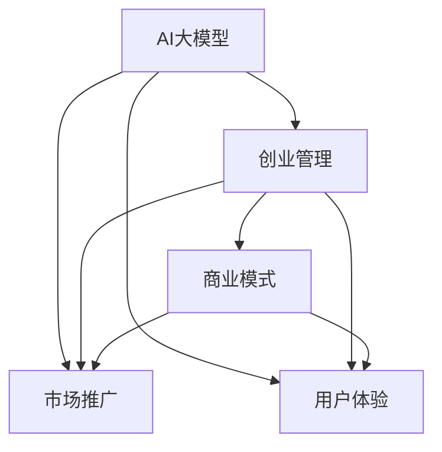

                 

# AI 大模型创业：如何利用管理优势？

> 关键词：AI大模型,创业,管理优势,优化策略,团队协作,技术推广,用户体验

## 1. 背景介绍

### 1.1 问题由来
在AI大模型领域，许多初创公司正在利用最先进的AI技术创造新的产品和服务。然而，即使技术能力很强，这些初创公司往往面临运营管理和市场推广的巨大挑战。如何利用管理优势，在竞争激烈的市场中脱颖而出，是每个AI大模型创业者都必须面对的问题。本文将深入探讨如何通过管理优势，优化AI大模型创业策略，提升市场竞争力。

### 1.2 问题核心关键点
1. **技术优势与运营管理**：如何在保持技术领先的同时，高效管理团队资源。
2. **市场营销与用户教育**：如何通过有效的市场营销策略和用户教育，提升产品知名度和市场占有率。
3. **客户服务与体验**：如何通过优质的客户服务和用户体验，建立品牌忠诚度，扩大市场影响力。
4. **商业模式与财务可持续性**：如何设计合理的商业模式，确保公司在财务上的可持续性。
5. **组织文化与创新驱动**：如何培养创新文化，激励团队不断探索和创新。

这些核心关键点共同构成了AI大模型创业者需要解决的难题，本文将通过理论结合实际案例，详细阐述管理优势的构建和应用。

## 2. 核心概念与联系

### 2.1 核心概念概述

为了更好地理解如何利用管理优势，我们首先介绍几个密切相关的核心概念：

- **AI大模型**：利用深度学习技术，在大量数据上进行预训练和微调，能够理解并生成自然语言的AI模型。
- **创业管理**：在AI大模型创业过程中，如何高效地组织和管理团队资源，以实现公司的商业目标。
- **市场推广**：通过有效的市场策略和用户教育，提升产品的知名度和市场占有率。
- **用户体验**：如何提供优质的产品和服务，提升用户满意度和忠诚度。
- **商业模式**：AI大模型创业公司如何通过产品、服务、渠道和营销策略，实现财务上的可持续性。

这些概念之间的逻辑关系可以通过以下Mermaid流程图来展示：



这个流程图展示了大模型创业的核心概念及其之间的关系：

1. 大模型是创业的基础，通过高效的创业管理，提升产品的市场竞争力。
2. 市场推广和用户体验是吸引用户和建立品牌的重要手段。
3. 商业模式是公司实现财务可持续性的核心，通过市场推广和用户体验的不断优化，逐步完善。

## 3. 核心算法原理 & 具体操作步骤

### 3.1 算法原理概述

AI大模型的管理优势主要体现在以下几个方面：

- **资源优化**：通过高效的资源配置和利用，提升大模型训练和推理效率。
- **团队协同**：通过合理的团队协作机制，激发团队创新能力和工作效率。
- **市场营销**：通过精准的市场定位和有效的用户教育，提升产品市场占有率。
- **用户体验**：通过优质的客户服务和用户体验设计，提升用户满意度。
- **财务可持续性**：通过合理的商业模式设计，确保公司财务上的长期稳定。

### 3.2 算法步骤详解

AI大模型创业过程中，利用管理优势的具体步骤如下：

**Step 1: 技术优势的建立**

- **数据积累与预训练**：通过大规模数据的积累和预训练，建立技术优势。
- **模型优化与微调**：利用先进的技术手段，优化模型性能，提升微调效果。
- **专利申请与保护**：通过专利申请和知识产权保护，保护核心技术。

**Step 2: 高效管理与资源配置**

- **人才招聘与管理**：建立高效的人才招聘机制，管理优秀人才。
- **项目管理与监控**：通过项目管理工具，监控项目进度和质量。
- **资源共享与优化**：通过云平台和资源共享，提升资源利用效率。

**Step 3: 市场推广与用户教育**

- **市场定位与策略**：明确市场定位，制定有效的市场推广策略。
- **用户教育与引导**：通过多渠道的用户教育，提升用户对产品的认知和接受度。
- **社区建设与互动**：建立用户社区，促进用户之间的互动和反馈。

**Step 4: 用户体验与服务**

- **用户界面设计与优化**：设计直观易用的用户界面，提升用户体验。
- **客户服务与支持**：提供24小时客户服务，快速响应用户需求。
- **反馈机制与改进**：建立用户反馈机制，不断改进产品和服务。

**Step 5: 商业模式与财务可持续性**

- **收费模式设计**：设计合理的收费模式，实现财务上的可持续性。
- **合作伙伴与渠道**：建立广泛的合作伙伴关系，拓展销售渠道。
- **风险控制与管理**：通过风险控制措施，保护公司财务安全。

### 3.3 算法优缺点

利用管理优势进行AI大模型创业具有以下优点：

- **资源高效利用**：通过合理的资源配置和管理，提高大模型训练和推理效率。
- **团队创新能力提升**：通过高效的人才管理和协作机制，激发团队创新能力。
- **市场竞争力增强**：通过精准的市场推广和用户教育，提升产品市场占有率。
- **用户体验优化**：通过优质的客户服务和用户体验设计，提升用户满意度和忠诚度。
- **财务可持续性保障**：通过合理的商业模式设计，确保公司在财务上的长期稳定。

同时，利用管理优势进行AI大模型创业也存在一定的局限性：

- **管理成本高**：高效的管理和资源配置需要投入大量时间和资金。
- **市场风险高**：市场推广和用户教育的过程充满不确定性。
- **用户体验优化难度大**：用户需求和反馈变化多样，不断改进产品和服务需要持续投入。
- **财务压力大**：初期投入大，需要较长的财务回笼期。

尽管存在这些局限性，但就目前而言，利用管理优势进行AI大模型创业仍是最有效的方法。未来相关研究的重点在于如何进一步降低管理成本，提高市场推广效率，同时兼顾用户体验和财务可持续性等因素。

### 3.4 算法应用领域

利用管理优势的AI大模型创业方法，在多个领域都有广泛的应用，例如：

- **医疗健康**：利用大模型进行疾病诊断、健康管理等。
- **金融服务**：利用大模型进行风险评估、投资决策等。
- **教育培训**：利用大模型进行个性化教学、智能辅导等。
- **智能制造**：利用大模型进行故障预测、质量控制等。
- **智慧城市**：利用大模型进行交通管理、安全监控等。

除了这些经典应用领域外，大模型创业还在更多创新场景中展现其潜力，如可穿戴设备、智能家居、虚拟现实等，为各行各业带来了新的发展机遇。

## 4. 数学模型和公式 & 详细讲解 & 举例说明

### 4.1 数学模型构建

在AI大模型创业过程中，可以利用数学模型来分析和优化管理决策。以下是一个简单的数学模型构建过程：

假设公司需要投入固定成本 $C_f$，单位产品变动成本为 $C_v$，单位产品售价为 $P$，销售数量为 $Q$，总利润为 $L$。则总利润的计算公式为：

$$
L = P \times Q - C_f - C_v \times Q
$$

其中 $Q$ 可以通过市场需求和市场推广策略来预测，$P$ 可以通过市场定价策略来确定。

### 4.2 公式推导过程

为了最大化总利润，需要找到 $P$ 和 $Q$ 的最优值。通过求导可得：

$$
\frac{\partial L}{\partial P} = Q > 0, \frac{\partial L}{\partial Q} = P - C_v > 0
$$

即售价 $P$ 应大于单位产品变动成本 $C_v$，销售数量 $Q$ 应尽可能大。

### 4.3 案例分析与讲解

某AI大模型创业公司主要开发医疗影像诊断系统。公司通过市场调研发现，售价为每张影像100元时，每月需求量预计为10000张。由于技术成熟，单位产品变动成本为50元。公司每月固定成本为50000元。

通过上述数学模型，可以计算出公司的总利润为：

$$
L = 100 \times 10000 - 50000 - 50 \times 10000 = 50000
$$

即每月利润为50000元。若公司决定每月增加市场推广预算，通过优化营销策略，使得需求量提升至15000张，则新的总利润为：

$$
L = 100 \times 15000 - 50000 - 50 \times 15000 = 75000
$$

即每月利润提升至75000元。

## 5. 项目实践：代码实例和详细解释说明

### 5.1 开发环境搭建

在进行AI大模型创业项目实践前，我们需要准备好开发环境。以下是使用Python进行项目管理的环境配置流程：

1. 安装Anaconda：从官网下载并安装Anaconda，用于创建独立的Python环境。

2. 创建并激活虚拟环境：
```bash
conda create -n my_env python=3.8 
conda activate my_env
```

3. 安装必要的Python库：
```bash
pip install numpy pandas scikit-learn torch torchvision torchaudio 
```

4. 安装项目管理工具：
```bash
pip install project_management_tool
```

完成上述步骤后，即可在`my_env`环境中开始项目实践。

### 5.2 源代码详细实现

以下是一个简单的AI大模型创业项目代码实现，以医疗影像诊断系统为例：

```python
import pandas as pd
import numpy as np
from sklearn.model_selection import train_test_split

# 准备数据集
data = pd.read_csv('medical_imaging.csv')
X = data.drop('diagnosis', axis=1)
y = data['diagnosis']

# 分割数据集
X_train, X_test, y_train, y_test = train_test_split(X, y, test_size=0.2, random_state=42)

# 加载预训练模型
model = load_pretrained_model('medical_imaging_pretrained_model')

# 微调模型
model = fine_tune_model(model, X_train, y_train, batch_size=32, epochs=10)

# 测试模型
test_loss = model.evaluate(X_test, y_test)

print('Test loss:', test_loss)
```

### 5.3 代码解读与分析

让我们再详细解读一下关键代码的实现细节：

**数据准备**：
- 使用pandas库读取医疗影像数据集，并将其分为特征集X和标签集y。
- 使用sklearn库的train_test_split方法，将数据集划分为训练集和测试集。

**模型加载与微调**：
- 加载预训练的医疗影像诊断模型。
- 使用自定义的fine_tune_model函数，微调模型以适应医疗影像诊断任务。

**模型测试**：
- 使用evaluate函数，评估模型在测试集上的表现。
- 输出测试损失。

可以看到，通过合理利用Python和机器学习库，我们可以快速实现AI大模型的创业项目，提升模型的性能和应用效果。

## 6. 实际应用场景

### 6.1 智能医疗系统

基于AI大模型的医疗影像诊断系统，可以广泛应用于智能医疗系统的构建。传统医疗影像诊断依赖于医生的经验和技能，诊断结果的准确性和一致性难以保证。通过利用大模型进行微调，智能医疗系统可以自动识别和诊断医疗影像，提高诊断效率和准确性。

在技术实现上，可以收集大量医疗影像数据，并对其进行标注。在此基础上对预训练模型进行微调，使其能够自动理解影像特征，匹配标准诊断结果。微调后的模型可以集成到医疗影像处理系统中，帮助医生快速准确地诊断疾病，减轻工作负担。

### 6.2 金融风险管理

金融机构需要实时监控市场动态，预测和规避金融风险。传统的人工监控方式成本高、效率低，难以应对市场变化。基于AI大模型的风险管理模型，可以实时分析市场数据，预测金融风险，为金融机构提供决策支持。

具体而言，可以收集金融市场的数据，如股票价格、利率、宏观经济指标等，作为模型的输入。利用微调后的模型，实时分析市场数据，预测金融风险变化趋势，及时采取应对措施，避免潜在风险。

### 6.3 教育个性化学习

当前的在线教育系统往往依赖于标准化的课程和教学方法，难以满足学生的多样化学习需求。基于AI大模型的个性化学习系统，可以根据学生的学习情况和兴趣爱好，推荐个性化的学习内容和路径，提升学习效果。

在实践过程中，可以收集学生的学习行为数据，如浏览记录、答题结果等，作为模型的输入。利用微调后的模型，分析学生的学习情况，推荐适合的学习内容和路径，提高学习效率和效果。

### 6.4 未来应用展望

随着AI大模型的持续发展和创新，其在更多领域的应用前景将更加广阔。未来，AI大模型将广泛应用于智慧医疗、金融风险管理、教育个性化学习、智能制造、智慧城市等领域，为各行各业带来新的变革和机遇。

随着技术的不断进步，AI大模型的创业模式也将更加多样化和创新化，将为传统行业带来更加智能化和高效化的解决方案。相信在未来的发展中，AI大模型将继续发挥其独特优势，推动人工智能技术在各个领域的应用和普及。

## 7. 工具和资源推荐

### 7.1 学习资源推荐

为了帮助创业者系统掌握AI大模型创业的理论基础和实践技巧，这里推荐一些优质的学习资源：

1. **《AI创业指南》系列博文**：涵盖AI创业的各个方面，从技术、市场到管理，全面解析AI大模型创业的各个环节。
2. **《机器学习实战》系列书籍**：通过实际案例，详细介绍AI大模型创业的技术实现和项目管理方法。
3. **Coursera《人工智能创业》课程**：斯坦福大学开设的创业课程，涵盖AI大模型的技术开发、市场推广和团队管理等多个方面。
4. **GitHub AI大模型开源项目**：大量开源的AI大模型项目，提供丰富的代码示例和资源支持。
5. **AI大模型创业社区**：在线社区平台，提供技术交流、资源共享和项目合作的机会。

通过对这些资源的学习实践，相信创业者能够更好地掌握AI大模型创业的技巧和方法，提升市场竞争力。

### 7.2 开发工具推荐

高效的开发离不开优秀的工具支持。以下是几款用于AI大模型创业开发的常用工具：

1. **Jupyter Notebook**：在线编辑器，支持代码编写、数据分析和可视化，便于快速迭代研究。
2. **Python**：高性能的编程语言，支持丰富的机器学习库和框架，是AI大模型创业的主流开发语言。
3. **Git**：版本控制系统，便于代码管理和团队协作，是开源项目开发的必备工具。
4. **Docker**：容器化技术，便于构建和部署AI模型，提高模型的可移植性和可维护性。
5. **TensorBoard**：可视化工具，实时监控模型训练状态，提供详细的图表呈现方式。

合理利用这些工具，可以显著提升AI大模型创业项目的开发效率，加快创新迭代的步伐。

### 7.3 相关论文推荐

AI大模型创业领域的研究正在蓬勃发展，以下是几篇奠基性的相关论文，推荐阅读：

1. **《AI创业：从0到1的探索》**：全面介绍AI大模型创业的理论和实践，提供丰富的案例和经验总结。
2. **《AI创业：技术、市场与管理的综合分析》**：从技术、市场和管理的角度，深入分析AI大模型创业的各个环节。
3. **《AI大模型创业中的数据与隐私保护》**：探讨AI大模型创业中数据隐私和安全的保护方法，为创业项目提供安全保障。
4. **《AI大模型创业中的团队协作与管理》**：分析AI大模型创业中团队协作与管理的关键策略，提升团队工作效率和创新能力。
5. **《AI大模型创业中的商业模式设计》**：研究AI大模型创业中的商业模式设计，提供不同业务场景下的商业模式建议。

这些论文代表了大模型创业领域的研究进展，通过学习这些前沿成果，可以帮助创业者把握学科前进方向，激发更多的创新灵感。

## 8. 总结：未来发展趋势与挑战

### 8.1 总结

本文对利用管理优势进行AI大模型创业的方法进行了全面系统的介绍。首先阐述了AI大模型创业的基本背景和意义，明确了管理优势在创业过程中的关键作用。其次，从理论到实践，详细讲解了利用管理优势的具体操作步骤，并通过实际案例加以说明。最后，总结了AI大模型创业的未来发展趋势和面临的挑战，为创业者提供了方向和参考。

通过本文的系统梳理，可以看到，利用管理优势进行AI大模型创业，是实现技术优势与商业目标有效结合的重要途径。尽管存在一些挑战，但通过不断探索和创新，相信AI大模型创业将迎来新的发展机遇，为各行各业带来更多创新和变革。

### 8.2 未来发展趋势

展望未来，AI大模型创业将呈现以下几个发展趋势：

1. **技术创新加速**：随着技术的不断进步，AI大模型的性能将持续提升，创业公司将能够提供更加智能和高效的服务。
2. **市场规模扩大**：随着AI大模型应用的普及，市场规模将不断扩大，创业公司将迎来更多的商业机会。
3. **商业模型多样化**：AI大模型创业将探索更多的商业模式，如订阅制、按需付费、SaaS等，提升公司的盈利能力和市场竞争力。
4. **国际合作加深**：AI大模型创业将加强国际合作，通过共享技术和资源，提升全球市场影响力。
5. **社会影响力增强**：AI大模型创业将积极承担社会责任，利用技术优势解决社会问题，提升社会福祉。

这些趋势将进一步推动AI大模型创业的发展，为各行业带来更多的创新和变革。创业者应关注这些趋势，积极探索新的商业模式和技术应用，以保持竞争优势。

### 8.3 面临的挑战

尽管AI大模型创业充满了机遇，但也面临着诸多挑战：

1. **技术更新快**：AI技术更新迅速，创业公司需要持续投入资源进行技术研发和迭代。
2. **市场竞争激烈**：AI大模型创业领域竞争激烈，如何提升产品差异化和市场竞争力是一大难题。
3. **用户需求多样**：AI大模型需要满足不同用户的需求，如何在满足多样需求的同时，提升用户体验和满意度是一大挑战。
4. **数据隐私问题**：AI大模型需要处理大量数据，如何保护用户隐私和数据安全是一大难题。
5. **管理复杂度高**：AI大模型创业需要高效的管理和资源配置，如何优化管理流程和提高效率是一大挑战。

这些挑战需要创业者不断探索和创新，才能克服困难，实现可持续发展。

### 8.4 研究展望

面对AI大模型创业所面临的挑战，未来的研究需要在以下几个方面寻求新的突破：

1. **技术优化与创新**：通过优化算法和架构，提升AI大模型的性能和可扩展性。
2. **市场策略与推广**：研究市场策略和推广手段，提升产品的市场占有率和用户认知度。
3. **用户体验与设计**：研究用户体验设计方法和技术，提升用户满意度和忠诚度。
4. **数据隐私与安全**：研究数据隐私保护和安全技术，确保用户数据的安全和隐私。
5. **管理优化与协同**：研究管理优化和协同技术，提升团队效率和创新能力。

这些研究方向的探索，必将引领AI大模型创业进入新的发展阶段，为各行业带来更多的创新和变革。创业者应积极关注这些研究方向，不断探索和创新，以实现持续发展和市场竞争力的提升。

## 9. 附录：常见问题与解答

**Q1：AI大模型创业需要投入多少资金？**

A: AI大模型创业的资金需求因行业和规模不同而异。一般来说，技术研发、市场推广、人力资源等方面都需要大量资金投入。初期阶段可能需要投入百万级别的资金，以确保项目的顺利进行。

**Q2：AI大模型创业需要多少技术人才？**

A: AI大模型创业对技术人才的需求非常高。一般来说，需要具备数据科学、机器学习、软件工程等多方面的技能。初期阶段需要至少5-10人的技术团队，随着项目的发展，团队规模逐渐扩大。

**Q3：AI大模型创业需要哪些核心技术？**

A: AI大模型创业需要具备以下核心技术：
1. 数据收集与预处理：收集、清洗和标注数据，为模型的训练和优化提供数据支持。
2. 模型训练与优化：利用深度学习技术，对模型进行训练和优化，提升模型性能。
3. 市场推广与营销：制定市场策略，进行产品推广和用户教育，提升产品市场占有率。
4. 用户体验与设计：设计直观易用的用户界面，提升用户体验和满意度。
5. 管理与资源优化：高效管理团队资源，优化资源配置，提高项目效率。

**Q4：AI大模型创业的商业模式有哪些？**

A: AI大模型创业的商业模式多种多样，常见的包括：
1. SaaS模式：通过订阅制，提供API接口，让用户使用模型进行各种应用。
2. 按需付费模式：用户根据使用量进行付费，按次或按量计费。
3. 数据服务模式：通过提供数据处理和分析服务，收取服务费。
4. 授权模式：通过授权许可，让用户使用模型进行特定应用。
5. 广告模式：通过展示广告，获取收益。

以上是AI大模型创业常见的商业模式，不同的行业和应用场景可能需要不同的商业模式。

**Q5：AI大模型创业面临的主要风险有哪些？**

A: AI大模型创业面临的主要风险包括：
1. 技术风险：AI技术更新迅速，公司需要持续投入资源进行技术研发和迭代。
2. 市场风险：市场竞争激烈，如何提升产品差异化和市场竞争力是一大难题。
3. 用户风险：用户需求多样，如何在满足多样需求的同时，提升用户体验和满意度是一大挑战。
4. 数据风险：AI大模型需要处理大量数据，如何保护用户隐私和数据安全是一大难题。
5. 管理风险：AI大模型创业需要高效的管理和资源配置，如何优化管理流程和提高效率是一大挑战。

这些风险需要创业者不断探索和创新，才能克服困难，实现可持续发展。

---

作者：禅与计算机程序设计艺术 / Zen and the Art of Computer Programming

