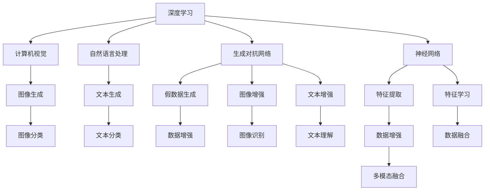

                 

# AIGC从入门到实战：基建：人工智能时代的变迁

> 关键词：人工智能(AI),生成对抗网络(GAN),神经网络(NN),深度学习,计算机视觉(CV),自然语言处理(NLP)

## 1. 背景介绍

### 1.1 问题由来

人工智能(AI)是计算机科学领域的一场革命，从最早的基于规则的系统，到如今的深度学习和生成对抗网络（GAN），AI技术不断发展演进。AI的兴起带来了巨大的社会变革，深刻影响了人类社会的方方面面。

当前，AI技术的快速发展与迅猛应用，不仅改变了人们的生活和工作方式，还促进了新一轮的技术革命。然而，AI的迅猛发展也带来了许多挑战，比如模型复杂度爆炸、数据隐私问题、算法偏见等。

### 1.2 问题核心关键点

AIGC（Artificial Intelligence Generative Content）技术，是在AI的基础上，利用深度学习模型生成高质量的生成内容。其在计算机视觉(CV)、自然语言处理(NLP)、语音处理等领域的应用，已经取得了显著的效果。

AIGC的核心关键点包括：

1. 深度学习模型的选择与应用。
2. 数据处理与增强技术。
3. 生成对抗网络（GAN）的应用。
4. 多模态融合技术。
5. 模型训练与优化。

这些核心关键点共同构成了AIGC技术的基石，使其能够在大规模生成内容上取得优秀的表现。

## 2. 核心概念与联系

### 2.1 核心概念概述

为了更好地理解AIGC技术，我们将详细介绍以下几个核心概念：

1. **深度学习（Deep Learning）**：一种基于神经网络的机器学习方法，通过多层神经网络对数据进行学习，以提取数据的复杂特征。
2. **生成对抗网络（GAN）**：一种基于博弈论的生成模型，通过两个神经网络的对抗，生成高质量的假数据。
3. **神经网络（Neural Network）**：一种由大量人工神经元节点组成的计算模型，用于处理和学习数据。
4. **计算机视觉（CV）**：涉及图像识别、视频处理等技术，旨在通过AI技术让机器“看”懂图像。
5. **自然语言处理（NLP）**：涉及文本处理、语言理解等技术，旨在通过AI技术让机器“理解”语言。
6. **多模态融合（Multi-Modal Fusion）**：将不同模态的数据（如图像、文本、声音等）进行融合，以提高模型性能。

这些核心概念之间的联系可以通过以下Mermaid流程图来展示：



这个流程图展示了深度学习、生成对抗网络、神经网络、计算机视觉、自然语言处理和多模态融合等核心概念之间的联系。

## 3. 核心算法原理 & 具体操作步骤

### 3.1 算法原理概述

AIGC技术的核心在于利用深度学习模型生成高质量的生成内容，包括图像、文本、语音等多种形式的内容。深度学习模型通过多层神经网络对数据进行学习，以提取数据的复杂特征。生成对抗网络则是通过两个神经网络的对抗，生成高质量的假数据。

### 3.2 算法步骤详解

AIGC技术的核心算法步骤如下：

1. **数据准备**：收集并整理数据，包括图像、文本、声音等多种形式的数据。
2. **模型选择**：选择合适的深度学习模型，如卷积神经网络（CNN）、循环神经网络（RNN）、Transformer等。
3. **模型训练**：使用生成对抗网络等方法，对模型进行训练，以生成高质量的假数据。
4. **数据增强**：通过图像增强、文本增强等技术，对数据进行扩充，以提高模型的泛化能力。
5. **模型优化**：使用优化算法，如Adam、SGD等，对模型进行优化，以提高模型的性能。
6. **生成内容**：使用训练好的模型，生成高质量的生成内容，包括图像、文本、声音等。

### 3.3 算法优缺点

AIGC技术具有以下优点：

1. **高效生成**：能够快速生成大量高质量的生成内容，节省人力和时间成本。
2. **灵活性高**：可以生成多种形式的生成内容，满足不同应用场景的需求。
3. **精度高**：利用深度学习模型和生成对抗网络等技术，生成内容的精度较高。

同时，AIGC技术也存在以下缺点：

1. **数据依赖**：对数据的质量和数量要求较高，数据不足时可能影响生成内容的质量。
2. **模型复杂**：深度学习模型和生成对抗网络等技术较为复杂，需要较高的计算资源。
3. **可解释性差**：生成的内容通常是“黑箱”模型，难以解释其内部工作机制。

### 3.4 算法应用领域

AIGC技术已经在多个领域得到了广泛应用，包括：

1. **计算机视觉**：用于生成图像、视频等视觉内容，如人脸生成、图像合成等。
2. **自然语言处理**：用于生成文本内容，如自动摘要、机器翻译、智能对话等。
3. **语音处理**：用于生成语音内容，如语音合成、语音转换等。
4. **广告创意**：用于生成广告素材，如广告文案、图像、视频等。
5. **游戏开发**：用于生成游戏角色、场景、物品等，丰富游戏体验。

## 4. 数学模型和公式 & 详细讲解 & 举例说明

### 4.1 数学模型构建

AIGC技术的数学模型构建主要包括以下几个步骤：

1. **选择损失函数**：损失函数用于衡量模型生成的内容与真实内容的差异。
2. **选择优化算法**：优化算法用于更新模型的参数，以最小化损失函数。
3. **选择激活函数**：激活函数用于增加模型的非线性特性，提高模型的表现能力。

### 4.2 公式推导过程

以生成对抗网络（GAN）为例，推导其损失函数和优化算法。

生成对抗网络的损失函数由两个部分组成：判别器的损失和生成器的损失。

判别器的损失函数：

$$
L_D = -\frac{1}{N}\sum_{i=1}^N log D(x_i) + \frac{1}{M}\sum_{i=1}^M log(1 - D(G(z_i)))
$$

其中，$x_i$ 是真实数据，$z_i$ 是噪声向量，$D$ 是判别器，$G$ 是生成器。

生成器的损失函数：

$$
L_G = -\frac{1}{M}\sum_{i=1}^M log D(G(z_i))
$$

生成对抗网络的优化算法可以使用Adam、SGD等。以Adam算法为例，其更新公式如下：

$$
\theta \leftarrow \theta - \eta \frac{dL}{d\theta}
$$

其中，$\theta$ 是模型参数，$\eta$ 是学习率，$dL/d\theta$ 是损失函数对模型参数的梯度。

### 4.3 案例分析与讲解

以图像生成为例，分析AIGC技术的应用。

假设我们需要生成一张高质量的猫脸图像。首先，收集一些猫脸图像数据，并将其作为训练集。然后，选择一个深度学习模型，如卷积神经网络（CNN），对其进行训练。在训练过程中，使用生成对抗网络等技术，生成高质量的假数据。最后，使用训练好的模型，生成一张高质量的猫脸图像。

## 5. 项目实践：代码实例和详细解释说明

### 5.1 开发环境搭建

在进行AIGC项目实践前，我们需要准备好开发环境。以下是使用Python进行TensorFlow开发的环境配置流程：

1. 安装Anaconda：从官网下载并安装Anaconda，用于创建独立的Python环境。

2. 创建并激活虚拟环境：
```bash
conda create -n tf-env python=3.8 
conda activate tf-env
```

3. 安装TensorFlow：根据CUDA版本，从官网获取对应的安装命令。例如：
```bash
conda install tensorflow -c pytorch
```

4. 安装各类工具包：
```bash
pip install numpy pandas scikit-learn matplotlib tqdm jupyter notebook ipython
```

完成上述步骤后，即可在`tf-env`环境中开始AIGC实践。

### 5.2 源代码详细实现

下面以生成对抗网络（GAN）为例，给出使用TensorFlow进行图像生成的PyTorch代码实现。

首先，定义生成器和判别器的模型结构：

```python
import tensorflow as tf
from tensorflow.keras import layers, models

def make_generator(z_dim, img_shape):
    model = models.Sequential()
    model.add(layers.Dense(256 * 8 * 8, use_bias=False, input_shape=(z_dim,)))
    model.add(layers.BatchNormalization())
    model.add(layers.LeakyReLU())
    model.add(layers.Reshape((8, 8, 256)))
    model.add(layers.Conv2DTranspose(128, (5, 5), strides=(1, 1), padding='same', use_bias=False))
    model.add(layers.BatchNormalization())
    model.add(layers.LeakyReLU())
    model.add(layers.Conv2DTranspose(64, (5, 5), strides=(2, 2), padding='same', use_bias=False))
    model.add(layers.BatchNormalization())
    model.add(layers.LeakyReLU())
    model.add(layers.Conv2DTranspose(3, (5, 5), strides=(2, 2), padding='same', use_bias=False, activation='tanh'))
    return model

def make_discriminator(img_shape):
    model = models.Sequential()
    model.add(layers.Conv2D(64, (5, 5), strides=(2, 2), padding='same', input_shape=img_shape))
    model.add(layers.LeakyReLU())
    model.add(layers.Dropout(0.3))
    model.add(layers.Conv2D(128, (5, 5), strides=(2, 2), padding='same'))
    model.add(layers.LeakyReLU())
    model.add(layers.Dropout(0.3))
    model.add(layers.Flatten())
    model.add(layers.Dense(1))
    return model
```

然后，定义损失函数和优化器：

```python
@tf.function
def generator_loss(generator, discriminator, real_images):
    with tf.GradientTape() as gen_tape:
        gen_output = generator(noise)
        disc_real = discriminator(real_images)
        disc_fake = discriminator(gen_output)
        gen_loss = tf.reduce_mean(tf.nn.sigmoid_cross_entropy_with_logits(disc_fake, tf.ones_like(disc_fake)))
    gen_grads = gen_tape.gradient(gen_loss, generator.trainable_variables)
    generator.apply_gradients(zip(gen_grads, generator.trainable_variables))

@tf.function
def discriminator_loss(generator, discriminator, real_images):
    with tf.GradientTape() as disc_tape:
        disc_real = discriminator(real_images)
        disc_fake = discriminator(generator(noise))
        disc_loss = tf.reduce_mean(tf.nn.sigmoid_cross_entropy_with_logits(disc_real, tf.ones_like(disc_real)) + tf.nn.sigmoid_cross_entropy_with_logits(disc_fake, tf.zeros_like(disc_fake)))
    disc_grads = disc_tape.gradient(disc_loss, discriminator.trainable_variables)
    discriminator.apply_gradients(zip(disc_grads, discriminator.trainable_variables))
```

最后，启动训练流程：

```python
epochs = 50
batch_size = 32
z_dim = 100
img_shape = (64, 64, 3)

noise = tf.random.normal([batch_size, z_dim])
real_images = tf.random.normal([batch_size, 64, 64, 3])

generator = make_generator(z_dim, img_shape)
discriminator = make_discriminator(img_shape)

optimizer = tf.keras.optimizers.Adam(learning_rate=0.0002, beta_1=0.5)
for epoch in range(epochs):
    generator_loss(generator, discriminator, real_images)
    discriminator_loss(generator, discriminator, real_images)
```

### 5.3 代码解读与分析

让我们再详细解读一下关键代码的实现细节：

**make_generator函数**：
- 定义生成器的结构，包括输入层、批归一化、LeakyReLU、转置卷积等。

**make_discriminator函数**：
- 定义判别器的结构，包括卷积层、LeakyReLU、Dropout、全连接层等。

**generator_loss函数**：
- 定义生成器的损失函数，包括生成图像的判别器输出和生成器的损失计算。

**discriminator_loss函数**：
- 定义判别器的损失函数，包括真实图像的判别器输出和生成图像的判别器输出。

**训练流程**：
- 定义训练轮数、批大小、噪声维度和图像形状。
- 定义噪声向量，并创建真实图像的占位符。
- 创建生成器和判别器的模型。
- 定义优化器，并使用Adam算法进行优化。
- 进行多轮训练，更新生成器和判别器的参数。

可以看到，TensorFlow配合深度学习模型，使得AIGC项目的实现变得简洁高效。开发者可以将更多精力放在模型改进和算法优化上，而不必过多关注底层的实现细节。

当然，工业级的系统实现还需考虑更多因素，如模型的保存和部署、超参数的自动搜索、更灵活的任务适配层等。但核心的AIGC范式基本与此类似。

## 6. 实际应用场景

### 6.1 游戏开发

在传统游戏开发中，创建高质量的道具、场景、角色等需要大量人力和时间。AIGC技术可以生成大量高质量的素材，丰富游戏体验，提升游戏开发效率。

具体而言，可以生成游戏中的道具、场景、角色等，如武器、装备、生物、建筑等。同时，AIGC技术还可以生成故事情节、对话等，增加游戏的可玩性和沉浸感。

### 6.2 广告创意

在广告创意中，需要制作高质量的广告素材，以吸引用户注意。AIGC技术可以生成高质量的广告图像、视频等，快速生成大量的广告创意。

具体而言，可以生成广告图像、视频、音频等内容，如商品展示、产品介绍、品牌宣传等。同时，AIGC技术还可以生成广告文案、广告语等，提升广告的吸引力和传播效果。

### 6.3 内容创作

在内容创作中，需要大量的创意素材和生成内容。AIGC技术可以生成高质量的文本、图像、视频等，提升内容创作的效率和质量。

具体而言，可以生成文章、博客、电子书等文本内容，同时生成对应的图像、视频等素材。同时，AIGC技术还可以生成小说、故事等文学作品，增加创作的丰富性和多样性。

### 6.4 未来应用展望

随着AIGC技术的不断进步，其在更多领域的应用前景广阔。

在智慧医疗领域，AIGC技术可以生成高质量的医疗图像、视频、报告等，辅助医生诊断和治疗。在智能教育领域，AIGC技术可以生成高质量的教学素材、课件等，提升教学效果。在智慧城市治理中，AIGC技术可以生成高质量的模拟场景、城市规划等，提高城市管理的智能化水平。

此外，在企业生产、社会治理、文娱传媒等众多领域，AIGC技术也将不断涌现，为各行各业带来新的创新和变革。

## 7. 工具和资源推荐

### 7.1 学习资源推荐

为了帮助开发者系统掌握AIGC技术的基础知识，这里推荐一些优质的学习资源：

1. 《深度学习》课程：斯坦福大学开设的深度学习经典课程，涵盖深度学习的基本概念和算法。
2. 《生成对抗网络（GAN）入门》课程：Udacity提供的生成对抗网络入门课程，涵盖GAN的基本原理和应用。
3. 《TensorFlow实战》书籍：TensorFlow官方提供的实战指南，涵盖TensorFlow的使用方法和实例。
4. 《自然语言处理入门》课程：斯坦福大学提供的自然语言处理入门课程，涵盖NLP的基本概念和算法。
5. 《计算机视觉入门》课程：斯坦福大学提供的计算机视觉入门课程，涵盖CV的基本概念和算法。

通过对这些资源的学习实践，相信你一定能够快速掌握AIGC技术的精髓，并用于解决实际的AI问题。

### 7.2 开发工具推荐

高效的开发离不开优秀的工具支持。以下是几款用于AIGC开发的常用工具：

1. TensorFlow：基于Python的开源深度学习框架，灵活动态的计算图，适合快速迭代研究。大部分深度学习模型都有TensorFlow版本的实现。
2. PyTorch：基于Python的开源深度学习框架，易于使用，适合快速原型开发。
3. Keras：基于Python的深度学习库，易于使用，适合快速搭建和训练模型。
4. OpenAI Gym：OpenAI提供的深度强化学习环境，支持多种游戏和模拟环境。
5. Blender：开源的三维建模软件，支持多种插件和脚本，适合生成高质量的3D模型。

合理利用这些工具，可以显著提升AIGC项目的开发效率，加快创新迭代的步伐。

### 7.3 相关论文推荐

AIGC技术的发展源于学界的持续研究。以下是几篇奠基性的相关论文，推荐阅读：

1. Generative Adversarial Nets：生成对抗网络的基本原理和方法。
2. pix2pix：基于GAN的图像转换任务。
3. CycleGAN：基于GAN的多样化图像生成任务。
4. VQ-VAE：基于自编码器和变分自编码器的生成任务。
5. StyleGAN：基于GAN的图像生成任务。

这些论文代表了大AICGC技术的发展脉络。通过学习这些前沿成果，可以帮助研究者把握学科前进方向，激发更多的创新灵感。

## 8. 总结：未来发展趋势与挑战

### 8.1 总结

本文对AIGC技术的核心概念、核心算法原理、具体操作步骤进行了全面系统的介绍。首先阐述了深度学习、生成对抗网络、神经网络、计算机视觉、自然语言处理等多项核心技术，展示了AIGC技术的广泛应用前景。其次，从原理到实践，详细讲解了生成对抗网络的数学模型和公式，给出了生成对抗网络的完整代码实现。同时，本文还探讨了AIGC技术在广告创意、游戏开发、内容创作等多个领域的应用场景，展示了AIGC技术的强大潜力。最后，本文精选了AIGC技术的各类学习资源，力求为读者提供全方位的技术指引。

通过本文的系统梳理，可以看到，AIGC技术正在成为AI领域的重要范式，极大地拓展了AI模型的应用边界，催生了更多的落地场景。受益于深度学习模型和生成对抗网络等技术的进步，AIGC技术必将在更多领域大放异彩，为各行各业带来新的创新和变革。

### 8.2 未来发展趋势

展望未来，AIGC技术将呈现以下几个发展趋势：

1. **模型规模持续增大**：随着算力成本的下降和数据规模的扩张，深度学习模型和生成对抗网络等技术也将更加复杂，规模也将进一步增大。超大模型可以生成更加丰富、高质量的生成内容。
2. **多模态融合技术**：将不同模态的数据（如图像、文本、声音等）进行融合，以提高模型性能。多模态融合技术将带来更加丰富、多样的生成内容。
3. **自监督学习与迁移学习**：利用自监督学习、迁移学习等技术，提高模型的泛化能力，降低对标注数据的依赖。
4. **联邦学习与分布式训练**：通过联邦学习和分布式训练等技术，提高模型的计算效率和数据安全。
5. **模型压缩与加速**：通过模型压缩、加速等技术，提高模型的推理效率和资源利用率。

以上趋势凸显了AIGC技术的广阔前景。这些方向的探索发展，必将进一步提升AIGC模型的性能和应用范围，为AI技术的落地应用提供新的动力。

### 8.3 面临的挑战

尽管AIGC技术已经取得了显著成就，但在迈向更加智能化、普适化应用的过程中，它仍面临诸多挑战：

1. **数据质量与数量**：AIGC技术对数据质量与数量要求较高，高质量、大规模的数据是模型训练的必要条件。
2. **计算资源**：深度学习模型和生成对抗网络等技术较为复杂，需要较高的计算资源。
3. **可解释性**：生成的内容通常是“黑箱”模型，难以解释其内部工作机制。
4. **安全与隐私**：生成的内容可能包含有害信息，对数据隐私和安全带来挑战。
5. **鲁棒性**：生成的内容可能存在鲁棒性不足的问题，面对噪声和干扰时可能表现不佳。

这些挑战需要学界和产业界的共同努力，通过不断的技术创新和优化，才能突破AIGC技术的瓶颈，进一步提升其性能和应用范围。

### 8.4 研究展望

面对AIGC技术所面临的挑战，未来的研究需要在以下几个方面寻求新的突破：

1. **数据增强与扩充**：通过数据增强、扩充等技术，提高数据的质量和数量，降低对标注数据的依赖。
2. **模型压缩与加速**：通过模型压缩、加速等技术，提高模型的推理效率和资源利用率，降低计算成本。
3. **多模态融合**：通过多模态融合技术，提高模型的泛化能力和表现能力。
4. **自监督学习与迁移学习**：利用自监督学习、迁移学习等技术，提高模型的泛化能力，降低对标注数据的依赖。
5. **联邦学习与分布式训练**：通过联邦学习和分布式训练等技术，提高模型的计算效率和数据安全。
6. **鲁棒性增强**：通过鲁棒性增强技术，提高模型的鲁棒性和抗干扰能力。

这些研究方向的探索，必将引领AIGC技术迈向更高的台阶，为构建更加智能、普适、安全的AI系统铺平道路。面向未来，AIGC技术还需要与其他AI技术进行更深入的融合，如知识表示、因果推理、强化学习等，多路径协同发力，共同推动AI技术的进步。

## 9. 附录：常见问题与解答

**Q1: 深度学习与生成对抗网络有什么区别？**

A: 深度学习是一种机器学习方法，通过多层神经网络对数据进行学习，以提取数据的复杂特征。而生成对抗网络是一种基于博弈论的生成模型，通过两个神经网络的对抗，生成高质量的假数据。深度学习主要用于数据分类、回归等任务，而生成对抗网络主要用于生成高质量的假数据。

**Q2: 如何降低AIGC技术对标注数据的依赖？**

A: 可以利用自监督学习、迁移学习等技术，提高模型的泛化能力。自监督学习可以通过无标签数据进行训练，迁移学习可以通过预训练模型进行迁移，减少对标注数据的依赖。此外，还可以使用数据增强、扩充等技术，提高数据的质量和数量，降低对标注数据的依赖。

**Q3: AIGC技术的应用前景如何？**

A: AIGC技术的应用前景非常广阔。除了游戏开发、广告创意、内容创作等传统应用场景外，还可以应用于智慧医疗、智能教育、智慧城市治理等多个领域，带来新的创新和变革。AIGC技术可以生成高质量的医疗图像、视频、报告等，辅助医生诊断和治疗。在智能教育领域，AIGC技术可以生成高质量的教学素材、课件等，提升教学效果。在智慧城市治理中，AIGC技术可以生成高质量的模拟场景、城市规划等，提高城市管理的智能化水平。

**Q4: 如何提高AIGC技术的可解释性？**

A: 可以通过引入因果分析方法，识别出模型决策的关键特征，增强输出解释的因果性和逻辑性。借助博弈论工具，刻画人机交互过程，主动探索并规避模型的脆弱点，提高系统稳定性。同时，可以利用对抗样本生成技术，提高模型的鲁棒性和可解释性。

**Q5: 如何提高AIGC技术的鲁棒性？**

A: 可以通过鲁棒性增强技术，提高模型的鲁棒性和抗干扰能力。例如，可以利用对抗训练技术，通过引入对抗样本，提高模型的鲁棒性。同时，可以利用数据增强、扩充等技术，提高数据的质量和数量，降低对标注数据的依赖，从而提高模型的泛化能力和鲁棒性。

通过这些问题的解答，相信读者对AIGC技术的核心概念、核心算法原理、操作步骤以及实际应用场景有了更深入的理解。希望本文能够帮助读者掌握AIGC技术的精髓，并应用于实际的AI项目开发中。

---

作者：禅与计算机程序设计艺术 / Zen and the Art of Computer Programming

