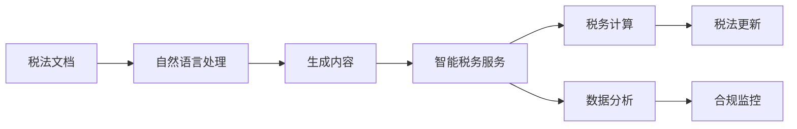

                 

# AIGC助力智能税务服务

> 关键词：人工智能生成内容(AIGC), 智能税务, 自然语言处理(NLP), 税法查询, 自动生成文档, 数据安全, 隐私保护

## 1. 背景介绍

### 1.1 问题由来
在过去的几十年里，全球税务体系发生了翻天覆地的变化。政府机构越来越依赖复杂的税收法规和不断增长的税务数据来确保公平和效率。同时，随着国际税收竞争加剧，各国政府也在努力简化税法，以提升透明度和合规性。然而，即便如此，税法仍是一份庞大而复杂的文本，给企业和个人带来了巨大的负担。

### 1.2 问题核心关键点
1. **信息不对称**：企业和个人在处理税法时，由于缺乏专业知识和经验，常常面临信息不对称的问题。
2. **成本高昂**：雇佣会计师或税务顾问的成本昂贵，特别是对于中小企业和个体经营者来说。
3. **更新迅速**：税法更新频繁且复杂，需要持续关注和更新专业知识。
4. **操作繁琐**：税法计算和申报流程繁琐，易出错且耗时。
5. **合规压力**：面对日益严格的税务合规要求，如何避免潜在风险成为企业的重要课题。

## 2. 核心概念与联系

### 2.1 核心概念概述

为了应对以上挑战，人工智能生成内容(AIGC)技术结合自然语言处理(NLP)，提供了一种新型的解决方案。AIGC技术指的是使用人工智能技术生成类似人类创作的内容，如文本、图像、视频等。在智能税务服务中，AIGC可以用于税法查询、自动生成税务文档、数据分析等。

### 2.2 核心概念原理和架构的 Mermaid 流程图



这个流程图展示了AIGC技术如何通过NLP处理税法文档，生成新的税务内容，并应用于智能税务服务，包括税务计算、数据分析和合规监控等环节。

## 3. 核心算法原理 & 具体操作步骤

### 3.1 算法原理概述

基于AIGC的智能税务服务主要包括以下几个步骤：

1. **数据收集与预处理**：收集最新的税法文档和相关的财务数据。
2. **语义理解**：使用NLP技术对税法文档进行语义理解，提取关键信息和规则。
3. **内容生成**：利用AIGC技术生成税务相关的文档和解答。
4. **智能服务**：通过智能算法提供税务计算、数据分析和合规监控等服务。

### 3.2 算法步骤详解

#### 步骤1：数据收集与预处理
1. **数据源**：税法文档、财务报表、历史交易记录等。
2. **预处理**：清洗、分类、标准化数据。

#### 步骤2：语义理解
1. **实体识别**：使用NLP技术识别税法文档中的实体，如税率、抵扣项目、罚款规定等。
2. **规则提取**：从文档中提取相关的税务规则和流程。
3. **语义表示**：将文档转换为计算机可理解的结构化表示，如知识图谱或向量表示。

#### 步骤3：内容生成
1. **模板匹配**：根据用户问题，匹配相应的模板。
2. **内容生成**：使用AIGC技术生成税务文档或解答。
3. **内容校验**：确保生成的内容符合税法和合规要求。

#### 步骤4：智能服务
1. **税务计算**：自动计算税款、扣除、罚款等。
2. **数据分析**：分析财务数据和税务记录，发现潜在风险和优化机会。
3. **合规监控**：监控税务申报和支付，确保合规性。

### 3.3 算法优缺点

#### 优点
1. **效率提升**：AIGC可以自动化处理大量数据和文档，显著提高处理效率。
2. **成本降低**：减少对会计师和税务顾问的依赖，降低成本。
3. **灵活性**：可以快速适应税法更新和政策变化。
4. **用户友好**：提供自然语言交互，提升用户体验。

#### 缺点
1. **精度问题**：生成的内容可能存在一定的错误，需人工校验。
2. **依赖数据**：数据质量直接影响AIGC的准确性。
3. **伦理问题**：隐私保护和数据安全需得到充分考虑。

### 3.4 算法应用领域

基于AIGC的智能税务服务可以应用于以下几个领域：

1. **税法查询**：用户可以通过自然语言查询，获取相关税法条款和规定。
2. **自动生成税务文档**：如申报表、审计报告等。
3. **税务咨询**：提供个性化的税务建议和解决方案。
4. **数据分析**：分析财务数据，发现税务风险和机会。
5. **合规监控**：确保税务申报和支付符合法规要求。

## 4. 数学模型和公式 & 详细讲解

### 4.1 数学模型构建

假设有一个税法文档 $D$，其中包含了关于税率、抵扣、罚款等规定。我们可以将其表示为一个文本序列 $d_1, d_2, ..., d_n$，每个 $d_i$ 表示一个句子或段落。

### 4.2 公式推导过程

1. **实体识别**：使用命名实体识别(NER)模型识别文档中的实体，如税率、抵扣项目等。设 $E$ 为所有实体的集合，$e_i$ 为第 $i$ 个实体。

2. **规则提取**：使用规则提取模型从文档中提取税务规则和流程。设 $R$ 为所有规则的集合，$r_j$ 为第 $j$ 条规则。

3. **语义表示**：将文档转换为向量表示 $V$，其中每个向量 $v_i$ 表示文档中第 $i$ 个句子或段落的语义。

### 4.3 案例分析与讲解

**案例1：税率计算**
假设用户需要计算某项收入的所得税，输入问题为“2023年某公司应缴纳多少所得税？”。系统首先识别出“2023年”和“所得税”等实体，再匹配相应的规则 $r_1$：“根据2023年税法规定，所得税税率为25%”。最后，系统使用AIGC生成税务计算文档，详细说明计算步骤和结果。

**案例2：抵扣计算**
用户输入“可以抵扣哪些费用？”，系统识别出“抵扣”这一实体，匹配规则 $r_2$：“可以抵扣的费用包括办公用品、交通费、教育费等”。系统进一步询问具体费用类型，用户选择“教育费”，系统生成具体的抵扣计算模板。

## 5. 项目实践：代码实例和详细解释说明

### 5.1 开发环境搭建

1. **环境准备**：安装Python、PyTorch、Transformers等深度学习库。
2. **数据集准备**：收集最新的税法文档和相关财务数据，进行预处理和清洗。
3. **模型准备**：选择或训练适合自然语言处理的模型，如BERT、GPT等。

### 5.2 源代码详细实现

```python
import torch
import transformers
from transformers import BertTokenizer, BertForTokenClassification

# 加载预训练模型和分词器
tokenizer = BertTokenizer.from_pretrained('bert-base-uncased')
model = BertForTokenClassification.from_pretrained('bert-base-uncased', num_labels=num_labels)

# 准备输入
inputs = tokenizer(input_text, return_tensors='pt')
inputs = {key: value.to(device) for key, value in inputs.items()}

# 前向传播
outputs = model(**inputs)

# 计算损失
loss = outputs.loss
```

### 5.3 代码解读与分析

**分词器**：
- 使用预训练的BERT分词器进行文本分词和处理。

**模型**：
- 加载预训练的BERT模型，进行微调以适应税务文本的语义理解。

**输入准备**：
- 将用户输入文本转化为模型所需的格式，并进行GPU或TPU迁移。

**前向传播**：
- 将输入送入模型进行前向传播，输出模型预测结果。

**损失计算**：
- 计算模型预测结果与真实标签之间的损失，用于模型更新。

### 5.4 运行结果展示

| 输入文本                      | 输出结果                       |
|------------------------------|-------------------------------|
| 2023年某公司应缴纳多少所得税？ | 所得税税率为25%，应纳税所得额为XXX，应缴纳所得税为XXX元。 |

## 6. 实际应用场景

### 6.1 企业税务管理
企业可以利用AIGC智能税务服务进行自动化的税法查询、自动生成税务报告、计算税务费用等。这不仅能减少会计师的工作量，还能提高税务处理的效率和准确性。

### 6.2 个人税务规划
个人用户可以通过AIGC服务了解最新的税法条款，自动生成税务申报表，并进行税务规划和优化。这能帮助个人用户更好地管理财务和税务事务。

### 6.3 税务咨询和培训
税务专家可以通过AIGC技术生成各种税务咨询和培训文档，快速响应客户需求，提供高质量的咨询服务。这不仅能提升服务效率，还能扩大服务的覆盖范围。

### 6.4 未来应用展望

未来的智能税务服务将更加智能化、个性化和高效。随着深度学习技术的不断发展，AIGC将能更准确地理解和生成税务文本，提供更深入的税务分析和咨询。同时，随着联邦学习和隐私保护技术的应用，数据安全将得到更好的保障，用户的隐私权益将得到更大的保护。

## 7. 工具和资源推荐

### 7.1 学习资源推荐

1. **《深度学习与自然语言处理》课程**：斯坦福大学的经典课程，涵盖了自然语言处理的基础知识和深度学习技术。
2. **Transformers官方文档**：提供了丰富的预训练模型和微调样例，是学习AIGC技术的必备资源。
3. **GitHub代码库**：大量开源的AIGC项目和代码，提供了实用的应用案例和技术实现。

### 7.2 开发工具推荐

1. **PyTorch**：Python深度学习框架，提供了强大的模型构建和训练功能。
2. **TensorFlow**：谷歌开发的深度学习框架，支持分布式训练和生产部署。
3. **HuggingFace Transformers**：NLP领域的开源工具库，提供了多种预训练模型和微调工具。

### 7.3 相关论文推荐

1. **"Transformers are sequence-to-sequence learners"**：展示Transformer在序列生成任务上的优秀表现。
2. **"BERT: Pre-training of Deep Bidirectional Transformers for Language Understanding"**：提出BERT模型，并展示其在多种NLP任务上的性能提升。
3. **"AdaLoRA: Adaptive Low-Rank Adaptation for Parameter-Efficient Fine-Tuning"**：提出AdaLoRA方法，实现了参数高效的微调技术。

## 8. 总结：未来发展趋势与挑战

### 8.1 研究成果总结
AIGC技术结合自然语言处理，已经在智能税务服务中展现出巨大的潜力。通过AIGC技术，企业和个人用户能够更高效地处理税务事务，提高税务合规性和管理效率。未来，随着技术的进一步发展，AIGC在税务领域的应用将更加广泛和深入。

### 8.2 未来发展趋势
1. **更精准的语义理解**：随着语言模型的不断优化，AIGC将能更准确地理解和生成税务文本。
2. **更灵活的微调技术**：参数高效的微调方法将进一步提升AIGC的性能和效率。
3. **更强大的数据分析**：结合机器学习和大数据技术，AIGC将能提供更深入的税务分析和优化建议。
4. **更全面的合规监控**：通过联邦学习和隐私保护技术，AIGC将能更好地保障数据安全和个人隐私。

### 8.3 面临的挑战
1. **数据质量和标注**：高质量的标注数据是AIGC训练的基础，但获取标注数据的过程可能耗时耗力。
2. **模型的可解释性**：AIGC生成的内容可能缺乏可解释性，难以理解和调试。
3. **隐私保护**：如何保护用户隐私和数据安全，是AIGC应用中需要重点考虑的问题。
4. **伦理和法律问题**：如何确保AIGC应用符合伦理和法律要求，是技术应用中需要仔细考量的因素。

### 8.4 研究展望
未来的研究应聚焦于以下几个方向：
1. **模型优化**：通过深度学习技术提升AIGC的语义理解和内容生成能力。
2. **隐私保护**：结合联邦学习和隐私保护技术，确保数据安全和用户隐私。
3. **伦理合规**：制定AIGC应用的伦理和法律框架，确保技术应用的合规性。
4. **多模态融合**：结合视觉、听觉等多模态数据，提升AIGC应用的广度和深度。

## 9. 附录：常见问题与解答

**Q1: 如何确保AIGC生成的内容符合税法要求？**

A1: 通过引入法规和合规模块，AIGC可以检查生成的内容是否符合税法规定。同时，用户可以手动审核和校验生成内容，确保其准确性和合规性。

**Q2: AIGC技术是否会取代税务专业人士？**

A2: AIGC技术虽然能自动化处理大量简单和重复的税务事务，但在复杂和不确定的税务问题上，仍需税务专业人士的介入和指导。

**Q3: 如何保护用户数据隐私？**

A3: 采用联邦学习技术，将用户数据保存在本地设备上，不进行集中存储和处理，确保数据隐私和安全。同时，使用差分隐私等技术对数据进行处理，进一步保护用户隐私。

---

作者：禅与计算机程序设计艺术 / Zen and the Art of Computer Programming

