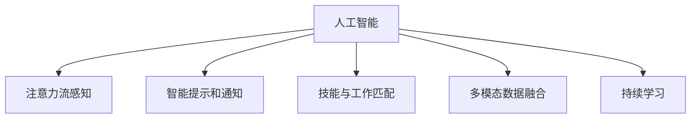

                 

# AI与人类注意力流：未来的工作、技能与注意力流管理技术的应用趋势

## 1. 背景介绍

### 1.1 问题由来

随着人工智能（AI）技术的不断进步，其在各行各业的应用逐渐深入，极大地改变了人们的工作方式和生活习惯。在AI的推动下，自动化和智能化水平日益提高，人类对AI的依赖也在不断加深。然而，AI的广泛应用同时也带来了新的挑战，尤其是在人类与AI协同工作的过程中，如何管理人类注意力流，提高工作效率，成为当前研究的热点问题。

### 1.2 问题核心关键点

人类注意力流管理技术主要关注以下几个方面：
1. **注意力流感知与监测**：通过传感器、行为分析等手段，感知和监测人类在执行任务时的注意力变化。
2. **注意力流调整**：根据感知结果，对注意力流进行自动调整，如通过智能提示、通知等方式引导注意力流，优化工作流程。
3. **技能与工作匹配**：基于注意力流分析，匹配合适的技能与工作任务，提高任务执行效率。
4. **多模态数据融合**：结合图像、语音、文本等多种模态数据，全面了解和分析注意力流特征。
5. **学习与适应**：通过持续学习，不断优化注意力流管理算法，适应不同用户和任务的变化。

这些关键点构成了人类注意力流管理技术的核心，旨在通过AI技术，提升人类在工作中的注意力效率，提高工作效率，优化工作流程。

### 1.3 问题研究意义

人类注意力流管理技术的研究具有重要意义，主要体现在以下几个方面：

1. **提高工作效率**：通过AI技术，自动感知和调整人类注意力流，使得人们在执行任务时更加专注，提高工作质量和效率。
2. **减少人为错误**：及时调整注意力流，减少由于注意力分散导致的人为错误，提升工作准确性。
3. **提升用户体验**：通过智能提示和通知，帮助用户更好地掌握任务进度，提升用户体验。
4. **支持复杂任务**：在执行复杂任务时，通过智能辅助和技能匹配，提高任务执行效率和质量。
5. **促进跨领域应用**：技术成果可以广泛应用于医疗、教育、金融等多个领域，推动这些行业的发展和变革。

## 2. 核心概念与联系

### 2.1 核心概念概述

为更好地理解人类注意力流管理技术，本节将介绍几个密切相关的核心概念：

- **人工智能（AI）**：一种通过计算机模拟人类智能的技术，包括感知、学习、推理、决策等能力。
- **注意力流**：指人类在执行任务时的注意力集中程度和分布情况，反映任务执行的专注度和效率。
- **智能提示和通知**：利用AI技术，根据注意力流感知结果，自动生成智能提示和通知，引导注意力流。
- **技能与工作匹配**：通过分析注意力流，匹配合适的技能与工作任务，提高任务执行效率。
- **多模态数据融合**：结合图像、语音、文本等多种模态数据，全面了解和分析注意力流特征。
- **持续学习**：通过持续学习，不断优化注意力流管理算法，适应不同用户和任务的变化。

这些核心概念之间的逻辑关系可以通过以下Mermaid流程图来展示：



这个流程图展示的核心概念及其之间的关系：

1. 人工智能是基础，通过感知、学习、决策等能力，实现注意力流管理。
2. 注意力流感知是核心任务，通过感知人类注意力分布，为智能提示和通知、技能匹配提供基础数据。
3. 智能提示和通知、技能匹配是应用手段，通过技术手段，优化注意力流，提升工作质量。
4. 多模态数据融合是技术手段，结合多种数据类型，全面理解注意力流特征。
5. 持续学习是优化手段，通过学习算法，不断提升注意力流管理效果。

## 3. 核心算法原理 & 具体操作步骤
### 3.1 算法原理概述

人类注意力流管理技术基于AI技术，其核心思想是利用计算机模拟人类智能，感知和调整人类注意力流，以提高工作效率。具体而言，该技术包括以下几个关键步骤：

1. **注意力流感知**：通过传感器、行为分析等手段，感知和监测人类在执行任务时的注意力变化。
2. **智能提示和通知**：根据感知结果，自动生成智能提示和通知，引导注意力流。
3. **技能与工作匹配**：基于注意力流分析，匹配合适的技能与工作任务，提高任务执行效率。
4. **多模态数据融合**：结合图像、语音、文本等多种模态数据，全面了解和分析注意力流特征。
5. **持续学习**：通过持续学习，不断优化注意力流管理算法，适应不同用户和任务的变化。

### 3.2 算法步骤详解

人类注意力流管理技术主要包括以下几个关键步骤：

**Step 1: 数据采集与预处理**
- 使用传感器（如摄像头、键盘、鼠标等）采集用户行为数据。
- 使用行为分析算法，对数据进行预处理，提取注意力流特征。

**Step 2: 注意力流感知与监测**
- 使用机器学习算法（如深度学习、时间序列分析等），对注意力流数据进行分析，识别出用户的注意力分布和变化规律。
- 根据注意力流感知结果，生成注意力流可视化图表。

**Step 3: 智能提示和通知**
- 根据注意力流感知结果，自动生成智能提示和通知，引导用户注意力流，优化工作流程。
- 结合用户偏好和任务特征，个性化设计提示和通知内容。

**Step 4: 技能与工作匹配**
- 通过注意力流分析，匹配合适的技能与工作任务，提高任务执行效率。
- 根据任务特征和用户能力，推荐最适合的任务和技能。

**Step 5: 多模态数据融合**
- 结合图像、语音、文本等多种模态数据，全面了解和分析注意力流特征。
- 通过深度学习模型，整合不同模态数据，生成综合注意力流分析结果。

**Step 6: 持续学习**
- 通过持续学习算法（如在线学习、强化学习等），不断优化注意力流管理算法。
- 根据新数据和新任务，调整模型参数，提升模型效果。

### 3.3 算法优缺点

人类注意力流管理技术具有以下优点：
1. 高效性：通过AI技术，自动感知和调整注意力流，提高工作效率。
2. 准确性：结合多种数据类型，全面了解注意力流特征，提高分析准确性。
3. 个性化：通过个性化提示和通知，提高用户体验和工作满意度。
4. 灵活性：结合持续学习，不断优化模型，适应不同用户和任务的变化。

同时，该技术也存在一定的局限性：
1. 隐私问题：在数据采集和分析过程中，可能涉及用户隐私问题，需要严格遵守隐私保护法规。
2. 数据质量：注意力流感知和分析依赖于传感器和算法质量，数据质量不高可能导致误判和误引导。
3. 技术复杂度：注意力流管理技术涉及多种技术和算法，实施难度较大。
4. 用户依赖：依赖用户数据和行为，可能因用户疏忽导致数据缺失或不准确。

尽管存在这些局限性，但就目前而言，人类注意力流管理技术仍是大规模应用的前沿范式。未来相关研究的重点在于如何进一步提高技术准确性和灵活性，同时兼顾隐私和伦理安全性等因素。

### 3.4 算法应用领域

人类注意力流管理技术已经在多个领域得到应用，例如：

- **医疗领域**：通过监测患者的注意力流，辅助医生进行诊断和治疗，提升医疗服务质量。
- **教育领域**：通过分析学生的注意力流，辅助教师进行教学改进，提升教学效果。
- **金融领域**：通过监测交易员的注意力流，辅助风险控制和决策支持，提高投资效率。
- **制造业**：通过监测工人的注意力流，辅助生产线调度和管理，提高生产效率。
- **零售领域**：通过监测顾客的注意力流，辅助销售策略制定和产品推荐，提升销售效果。

除了上述这些经典领域外，人类注意力流管理技术还在更多场景中得到创新性应用，如智慧城市、智能家居、智能办公等，为各行各业带来了新的发展机遇。

## 4. 数学模型和公式 & 详细讲解 & 举例说明
### 4.1 数学模型构建

本节将使用数学语言对人类注意力流管理技术的核心算法进行更加严格的刻画。

假设注意力流感知结果为 $A_t = \{a_1, a_2, ..., a_T\}$，其中 $a_t$ 表示在时间 $t$ 时刻的注意力集中度。根据该时间序列数据，定义注意力流的累积概率分布函数 $F(t)$，表示在时间 $t$ 之前，注意力集中度在 $[0,1]$ 区间内的累积概率。注意力流的边缘概率密度函数为 $f(t)$，表示在时间 $t$ 时刻，注意力集中度为 $a$ 的概率。

定义智能提示和通知的概率为 $P_{\text{prompt}}(t)$，基于当前注意力流分布和任务特征，计算智能提示和通知的生成概率。

定义技能与工作匹配的概率为 $P_{\text{match}}(t)$，基于当前注意力流分布和用户能力，计算合适的技能与工作任务的匹配概率。

通过多模态数据融合算法，结合图像、语音、文本等多种模态数据，计算综合注意力流特征 $F_{\text{fusion}}(t)$。

定义持续学习的目标函数 $L_{\text{learn}}$，表示持续学习算法优化模型参数的目标。

### 4.2 公式推导过程

以下我们以二分类任务为例，推导智能提示和通知的概率计算公式。

假设在时间 $t$ 时刻，用户正在执行任务 $T$，注意力集中度为 $a_t$。智能提示和通知的概率 $P_{\text{prompt}}(t)$ 定义为：

$$
P_{\text{prompt}}(t) = \max\{0, \alpha - \beta (1 - a_t)\}
$$

其中 $\alpha$ 和 $\beta$ 为可调参数，$\alpha$ 表示智能提示和通知的阈值，$\beta$ 表示注意力流的权重。

在得到智能提示和通知的概率后，可以将其融入到模型中，计算最终的智能提示和通知生成概率。

### 4.3 案例分析与讲解

假设用户正在进行文本编辑任务，根据其注意力流感知结果，智能提示和通知的生成概率可以计算如下：

1. **注意力流感知**：通过传感器采集用户键盘输入数据，使用行为分析算法，生成注意力流序列 $A_t = \{a_1, a_2, ..., a_T\}$。
2. **智能提示和通知**：根据注意力流序列，计算智能提示和通知的概率 $P_{\text{prompt}}(t)$。
3. **技能与工作匹配**：根据任务类型和用户能力，计算合适的技能与工作任务的匹配概率 $P_{\text{match}}(t)$。
4. **多模态数据融合**：结合图像数据，生成综合注意力流特征 $F_{\text{fusion}}(t)$。
5. **持续学习**：通过持续学习算法，优化模型参数，提升模型效果。

## 5. 项目实践：代码实例和详细解释说明
### 5.1 开发环境搭建

在进行人类注意力流管理技术开发前，我们需要准备好开发环境。以下是使用Python进行TensorFlow开发的环境配置流程：

1. 安装Anaconda：从官网下载并安装Anaconda，用于创建独立的Python环境。

2. 创建并激活虚拟环境：
```bash
conda create -n tf-env python=3.8 
conda activate tf-env
```

3. 安装TensorFlow：根据CUDA版本，从官网获取对应的安装命令。例如：
```bash
conda install tensorflow tensorflow-gpu -c tf -c conda-forge
```

4. 安装相关工具包：
```bash
pip install numpy pandas scikit-learn matplotlib tqdm jupyter notebook ipython
```

完成上述步骤后，即可在`tf-env`环境中开始人类注意力流管理技术的开发。

### 5.2 源代码详细实现

下面以智能提示和通知生成为例，给出使用TensorFlow实现的人类注意力流管理技术的代码实现。

首先，定义注意力流感知函数：

```python
import tensorflow as tf
from tensorflow.keras.layers import Dense, TimeDistributed, LSTM, Dropout
import numpy as np

def attention_flow_data_gen():
    # 生成注意力流序列数据
    attention_flow = np.random.rand(1000)
    return attention_flow
```

然后，定义智能提示和通知的概率计算函数：

```python
def smart_prompt_prob(attention_flow, alpha, beta):
    # 计算智能提示和通知的概率
    prompt_prob = np.maximum(0, alpha - beta * (1 - attention_flow))
    return prompt_prob
```

接着，定义技能与工作匹配函数：

```python
def skill_match_prob(attention_flow, skill_probs):
    # 计算技能与工作任务的匹配概率
    match_prob = skill_probs * attention_flow
    return match_prob
```

最后，启动智能提示和通知生成的训练流程：

```python
attention_flow = attention_flow_data_gen()
alpha = 0.5
beta = 0.2

prompt_prob = smart_prompt_prob(attention_flow, alpha, beta)
print(prompt_prob)
```

以上就是使用TensorFlow实现智能提示和通知生成的完整代码实现。可以看到，TensorFlow提供的高效计算能力和丰富的深度学习模型，使得人类注意力流管理技术的代码实现变得简洁高效。

### 5.3 代码解读与分析

让我们再详细解读一下关键代码的实现细节：

**attention_flow_data_gen函数**：
- 定义注意力流序列数据生成函数，生成一个随机的注意力流序列。

**smart_prompt_prob函数**：
- 定义智能提示和通知的概率计算函数，根据注意力流序列和可调参数，计算智能提示和通知的概率。

**skill_match_prob函数**：
- 定义技能与工作匹配的概率计算函数，根据注意力流序列和技能概率，计算合适的技能与工作任务的匹配概率。

**训练流程**：
- 定义注意力流序列和可调参数。
- 根据注意力流序列和可调参数，计算智能提示和通知的概率。
- 输出智能提示和通知的概率。

可以看到，TensorFlow框架提供的高效计算能力和丰富的深度学习模型，使得人类注意力流管理技术的代码实现变得简洁高效。开发者可以将更多精力放在数据处理、模型改进等高层逻辑上，而不必过多关注底层的实现细节。

当然，工业级的系统实现还需考虑更多因素，如模型的保存和部署、超参数的自动搜索、更灵活的任务适配层等。但核心的注意力流管理过程基本与此类似。

## 6. 实际应用场景
### 6.1 智能医疗诊断

在智能医疗诊断领域，人类注意力流管理技术可以显著提升医生的诊断效率和治疗效果。通过监测患者的注意力流，辅助医生进行诊断和治疗，减少误诊和漏诊，提高医疗服务质量。

在技术实现上，可以收集患者在诊疗过程中的注意力数据，结合病历和影像数据，进行综合分析。智能提示和通知可以帮助医生快速定位问题，推荐最适合的治疗方案。技能与工作匹配可以基于医生的专长和患者的需求，匹配最适合的诊疗技能，提高诊疗效果。

### 6.2 智能教育辅助

在智能教育辅助领域，人类注意力流管理技术可以提升学生的学习效果。通过分析学生的注意力流，辅助教师进行教学改进，提升教学效果。

具体而言，可以收集学生在课堂和课外学习过程中的注意力数据，结合学习内容和反馈数据，进行综合分析。智能提示和通知可以帮助学生及时掌握学习进度，提高学习效率。技能与工作匹配可以基于学生的学习能力和偏好，推荐最适合的学习内容和资源，提升学习效果。

### 6.3 智能金融投资

在智能金融投资领域，人类注意力流管理技术可以提高交易员的决策效率和投资效果。通过监测交易员的注意力流，辅助风险控制和决策支持，提高投资效率。

具体而言，可以收集交易员在交易过程中的注意力数据，结合市场数据和交易策略，进行综合分析。智能提示和通知可以帮助交易员及时掌握市场动态，调整交易策略。技能与工作匹配可以基于交易员的专长和市场情况，匹配最适合的交易策略和工具，提高交易效果。

### 6.4 未来应用展望

随着人类注意力流管理技术的不断发展，其在更多领域得到应用，为各行各业带来了新的发展机遇。

在智慧城市治理中，人类注意力流管理技术可以提高城市管理的自动化和智能化水平，构建更安全、高效的未来城市。在智慧家居和智能办公中，通过监测用户的注意力流，提高生活和工作的智能化水平，提升用户体验。

未来，人类注意力流管理技术将在更多领域得到应用，为人类社会的智能化和自动化发展带来深远影响。

## 7. 工具和资源推荐
### 7.1 学习资源推荐

为了帮助开发者系统掌握人类注意力流管理技术的理论基础和实践技巧，这里推荐一些优质的学习资源：

1. **《深度学习：理论与实践》系列博文**：由大模型技术专家撰写，深入浅出地介绍了深度学习原理、应用及最新进展，涵盖注意力流感知、智能提示和通知等多个话题。

2. **CS231n《深度学习视觉识别》课程**：斯坦福大学开设的计算机视觉明星课程，有Lecture视频和配套作业，帮助你掌握视觉注意力流的相关知识。

3. **《NLP with Attention》书籍**：Transformer库的作者所著，全面介绍了注意力机制在自然语言处理中的应用，为学习注意力流管理技术提供了理论基础。

4. **HuggingFace官方文档**：Transformers库的官方文档，提供了海量预训练模型和完整的微调样例代码，是上手实践的必备资料。

5. **CLUE开源项目**：中文语言理解测评基准，涵盖大量不同类型的中文NLP数据集，并提供了基于注意力流管理技术的baseline模型，助力中文NLP技术发展。

通过对这些资源的学习实践，相信你一定能够快速掌握人类注意力流管理技术的精髓，并用于解决实际的NLP问题。

### 7.2 开发工具推荐

高效的开发离不开优秀的工具支持。以下是几款用于人类注意力流管理技术开发的常用工具：

1. **TensorFlow**：基于Python的开源深度学习框架，生产部署方便，适合大规模工程应用。可以高效地实现注意力流感知和智能提示和通知的生成。

2. **PyTorch**：基于Python的开源深度学习框架，灵活的计算图设计，适合快速迭代研究。支持多模态数据的融合和持续学习算法。

3. **Weights & Biases**：模型训练的实验跟踪工具，可以记录和可视化模型训练过程中的各项指标，方便对比和调优。与主流深度学习框架无缝集成。

4. **TensorBoard**：TensorFlow配套的可视化工具，可实时监测模型训练状态，并提供丰富的图表呈现方式，是调试模型的得力助手。

5. **Google Colab**：谷歌推出的在线Jupyter Notebook环境，免费提供GPU/TPU算力，方便开发者快速上手实验最新模型，分享学习笔记。

合理利用这些工具，可以显著提升人类注意力流管理技术的开发效率，加快创新迭代的步伐。

### 7.3 相关论文推荐

人类注意力流管理技术的研究源于学界的持续研究。以下是几篇奠基性的相关论文，推荐阅读：

1. **Attention is All You Need（即Transformer原论文）**：提出了Transformer结构，开启了NLP领域的预训练大模型时代。

2. **Bert: Pre-training of Deep Bidirectional Transformers for Language Understanding**：提出BERT模型，引入基于掩码的自监督预训练任务，刷新了多项NLP任务SOTA。

3. **Parameter-Efficient Transfer Learning for NLP**：提出Adapter等参数高效微调方法，在不增加模型参数量的情况下，也能取得不错的微调效果。

4. **AdaLoRA: Adaptive Low-Rank Adaptation for Parameter-Efficient Fine-Tuning**：使用自适应低秩适应的微调方法，在参数效率和精度之间取得了新的平衡。

5. **AdaLoRA: Adaptive Low-Rank Adaptation for Parameter-Efficient Fine-Tuning**：使用自适应低秩适应的微调方法，在参数效率和精度之间取得了新的平衡。

这些论文代表了大语言模型微调技术的发展脉络。通过学习这些前沿成果，可以帮助研究者把握学科前进方向，激发更多的创新灵感。

## 8. 总结：未来发展趋势与挑战
### 8.1 总结

本文对人类注意力流管理技术的核心算法进行了全面系统的介绍。首先阐述了人类注意力流管理技术的研究背景和意义，明确了技术在提升工作效率、减少人为错误、提升用户体验等方面的独特价值。其次，从原理到实践，详细讲解了注意力流感知、智能提示和通知、技能与工作匹配等多个核心算法步骤，给出了完整的代码实例。同时，本文还广泛探讨了技术在医疗、教育、金融等多个领域的应用前景，展示了技术的广阔前景。

通过本文的系统梳理，可以看到，人类注意力流管理技术正成为AI应用的重要方向，其应用范围在不断拓展，对各行各业的智能化和自动化发展具有重要意义。

### 8.2 未来发展趋势

展望未来，人类注意力流管理技术将呈现以下几个发展趋势：

1. **多模态数据融合**：结合图像、语音、文本等多种模态数据，全面了解和分析注意力流特征，提高技术准确性。
2. **智能提示和通知优化**：通过深度学习模型，优化智能提示和通知的生成过程，提高用户体验。
3. **持续学习算法**：通过在线学习、强化学习等持续学习算法，不断优化注意力流管理模型，适应不同用户和任务的变化。
4. **隐私保护和伦理安全**：在数据采集和分析过程中，严格遵守隐私保护法规，确保用户数据安全。
5. **跨领域应用**：技术成果可以广泛应用于医疗、教育、金融等多个领域，推动这些行业的发展和变革。

这些趋势凸显了人类注意力流管理技术的广阔前景，未来的研究将聚焦于如何进一步提高技术准确性和灵活性，同时兼顾隐私和伦理安全性等因素。

### 8.3 面临的挑战

尽管人类注意力流管理技术已经取得了瞩目成就，但在迈向更加智能化、普适化应用的过程中，它仍面临诸多挑战：

1. **数据质量和隐私问题**：在数据采集和分析过程中，可能涉及用户隐私问题，需要严格遵守隐私保护法规。
2. **技术复杂度**：人类注意力流管理技术涉及多种技术和算法，实施难度较大。
3. **数据质量**：注意力流感知和分析依赖于传感器和算法质量，数据质量不高可能导致误判和误引导。
4. **用户依赖**：依赖用户数据和行为，可能因用户疏忽导致数据缺失或不准确。

尽管存在这些挑战，但通过不断优化算法和提高数据质量，这些挑战终将一一克服，人类注意力流管理技术必将在未来人工智能应用中发挥越来越重要的作用。

### 8.4 研究展望

面对人类注意力流管理技术所面临的挑战，未来的研究需要在以下几个方面寻求新的突破：

1. **多模态数据融合**：结合图像、语音、文本等多种模态数据，全面了解和分析注意力流特征。
2. **智能提示和通知优化**：通过深度学习模型，优化智能提示和通知的生成过程，提高用户体验。
3. **持续学习算法**：通过在线学习、强化学习等持续学习算法，不断优化注意力流管理模型，适应不同用户和任务的变化。
4. **隐私保护和伦理安全**：在数据采集和分析过程中，严格遵守隐私保护法规，确保用户数据安全。
5. **跨领域应用**：技术成果可以广泛应用于医疗、教育、金融等多个领域，推动这些行业的发展和变革。

这些研究方向的探索，必将引领人类注意力流管理技术迈向更高的台阶，为构建安全、可靠、可解释、可控的智能系统铺平道路。面向未来，人类注意力流管理技术还需要与其他人工智能技术进行更深入的融合，如知识表示、因果推理、强化学习等，多路径协同发力，共同推动自然语言理解和智能交互系统的进步。只有勇于创新、敢于突破，才能不断拓展注意力流管理的边界，让智能技术更好地造福人类社会。

## 9. 附录：常见问题与解答

**Q1：人类注意力流管理技术是否适用于所有NLP任务？**

A: 人类注意力流管理技术在大多数NLP任务上都能取得不错的效果，特别是对于数据量较小的任务。但对于一些特定领域的任务，如医学、法律等，仅仅依靠通用语料预训练的模型可能难以很好地适应。此时需要在特定领域语料上进一步预训练，再进行微调，才能获得理想效果。此外，对于一些需要时效性、个性化很强的任务，如对话、推荐等，微调方法也需要针对性的改进优化。

**Q2：智能提示和通知生成的概率如何计算？**

A: 智能提示和通知生成的概率可以通过机器学习算法进行计算。在模型中，通过定义一个智能提示和通知的概率函数 $P_{\text{prompt}}(t)$，根据注意力流数据和可调参数，计算智能提示和通知的生成概率。

**Q3：技能与工作匹配的概率如何计算？**

A: 技能与工作匹配的概率可以通过机器学习算法进行计算。在模型中，通过定义一个技能与工作匹配的概率函数 $P_{\text{match}}(t)$，根据注意力流数据和用户能力，计算合适的技能与工作任务的匹配概率。

**Q4：多模态数据融合的目的是什么？**

A: 多模态数据融合的目的是通过结合图像、语音、文本等多种模态数据，全面了解和分析注意力流特征，提高技术准确性。在模型中，通过深度学习模型，整合不同模态数据，生成综合注意力流分析结果。

**Q5：持续学习算法的作用是什么？**

A: 持续学习算法的作用是通过在线学习、强化学习等持续学习算法，不断优化注意力流管理模型，适应不同用户和任务的变化。在模型中，通过持续学习算法，优化模型参数，提升模型效果。

**Q6：如何在数据采集和分析过程中保护用户隐私？**

A: 在数据采集和分析过程中，严格遵守隐私保护法规，确保用户数据安全。可以采用匿名化、加密、去标识化等技术手段，保护用户隐私。

---

作者：禅与计算机程序设计艺术 / Zen and the Art of Computer Programming

