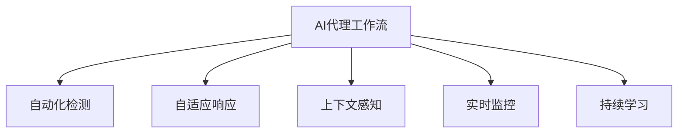

                 

# AI人工智能代理工作流AI Agent WorkFlow：代理工作流在网络安全的关键作用

## 1. 背景介绍

### 1.1 问题由来
随着信息技术的发展，网络安全问题日益凸显。企业需要构建安全、高效、可靠的网络环境，以保障业务和数据的安全。然而，网络安全的威胁复杂多样，防护措施难以兼顾全面性和及时性。

人工智能(AI)技术为网络安全带来了新的希望。AI可以自动化地监测、检测、响应网络威胁，显著提升网络安全的防护水平。其中，AI代理工作流(Agent Workflow)是一种将AI与网络安全工作流程融合的技术，能够快速响应威胁，自动化地执行安全策略，大大提高了网络安全的防护能力。

### 1.2 问题核心关键点
AI代理工作流结合了AI的自动化分析和决策能力与网络安全工作流的操作规范和流程，形成了从威胁发现、分析、响应到恢复的一体化解决方案。它具备以下特点：
- 自动化检测：通过AI算法快速发现网络异常和威胁。
- 自适应响应：根据威胁性质和影响程度，自适应地执行响应策略。
- 上下文感知：结合网络环境、用户行为等上下文信息，优化响应措施。
- 实时监控：对网络活动进行实时监控，及时发现和应对威胁。
- 持续学习：从实际威胁中学习，不断优化AI模型和响应策略。

这些特点使得AI代理工作流成为网络安全防护的重要手段，广泛应用于Web应用防护、网络入侵检测、终端防护等场景。

### 1.3 问题研究意义
AI代理工作流的研究和应用，对于提升网络安全防护能力，降低网络安全运营成本，加速网络安全技术落地，具有重要意义：

1. 自动化检测与响应：通过AI算法自动检测和响应网络威胁，极大提升了防护效率和响应速度，减轻了人工操作的负担。
2. 上下文感知：AI代理工作流能够结合网络环境、用户行为等上下文信息，实现更精准的威胁识别和响应，提高安全防护的准确性和有效性。
3. 实时监控：AI代理工作流通过实时监控网络活动，能够及时发现并阻止潜在的攻击行为，减少安全事件发生。
4. 持续学习：AI代理工作流能够在实际威胁环境中不断学习，优化AI模型和响应策略，提升安全防护能力。

## 2. 核心概念与联系

### 2.1 核心概念概述

为更好地理解AI代理工作流的原理和架构，本节将介绍几个密切相关的核心概念：

- AI代理工作流(Agent Workflow)：结合AI的自动化分析和决策能力与网络安全工作流的操作规范和流程，形成从威胁发现、分析、响应到恢复的一体化解决方案。
- 自动化检测(Auto-Detection)：通过AI算法快速发现网络异常和威胁。
- 自适应响应(Adaptive Response)：根据威胁性质和影响程度，自适应地执行响应策略。
- 上下文感知(Context Awareness)：结合网络环境、用户行为等上下文信息，优化响应措施。
- 实时监控(Real-Time Monitoring)：对网络活动进行实时监控，及时发现和应对威胁。
- 持续学习(Continuous Learning)：从实际威胁中学习，不断优化AI模型和响应策略。

这些核心概念之间的逻辑关系可以通过以下Mermaid流程图来展示：



这个流程图展示了大语言模型的核心概念及其之间的关系：

1. AI代理工作流通过自动化检测发现威胁，执行自适应响应，并结合上下文感知优化响应措施。
2. 通过实时监控和持续学习，不断优化AI模型和响应策略，提升安全防护能力。

## 3. 核心算法原理 & 具体操作步骤
### 3.1 算法原理概述

AI代理工作流的核心算法原理主要包括以下几个方面：

- 自动化检测算法：通过机器学习、深度学习等AI算法，从网络流量、日志、设备告警等信息中检测出异常和威胁。
- 自适应响应算法：根据威胁的性质和影响程度，自动选择和执行相应的响应策略。
- 上下文感知算法：通过融合网络环境、用户行为等上下文信息，优化响应措施，提高安全防护的准确性和有效性。
- 实时监控算法：通过实时分析网络活动，及时发现并阻止潜在的攻击行为，减少安全事件发生。
- 持续学习算法：从实际威胁中学习，不断优化AI模型和响应策略，提升安全防护能力。

### 3.2 算法步骤详解

AI代理工作流的主要步骤包括：

**Step 1: 数据收集与预处理**
- 从网络设备、Web应用、终端等处收集原始数据。
- 对数据进行清洗、归一化、去重等预处理，保证数据的质量和一致性。

**Step 2: 威胁检测与分析**
- 使用机器学习或深度学习模型对数据进行特征提取和分类，识别出异常和威胁。
- 将检测结果与已知威胁库进行匹配，确定威胁类型和影响程度。

**Step 3: 自适应响应与执行**
- 根据威胁类型和影响程度，选择和执行相应的响应策略。如断网、隔离、阻断等。
- 自动化地执行响应操作，避免人工操作的延迟和错误。

**Step 4: 上下文感知与优化**
- 结合网络环境、用户行为等上下文信息，优化响应措施，提高安全防护的准确性和有效性。
- 动态调整响应策略，避免误报和漏报。

**Step 5: 实时监控与反馈**
- 对网络活动进行实时监控，及时发现和阻止潜在的攻击行为。
- 收集实际威胁事件的数据，进行持续学习，不断优化AI模型和响应策略。

### 3.3 算法优缺点

AI代理工作流具备以下优点：

- 自动化检测：通过AI算法快速发现网络异常和威胁，显著提高防护效率和响应速度。
- 自适应响应：根据威胁性质和影响程度，自适应地执行响应策略，提高安全防护的灵活性和准确性。
- 上下文感知：结合网络环境、用户行为等上下文信息，优化响应措施，提高安全防护的准确性和有效性。
- 实时监控：通过实时监控网络活动，及时发现并阻止潜在的攻击行为，减少安全事件发生。
- 持续学习：从实际威胁中学习，不断优化AI模型和响应策略，提升安全防护能力。

同时，AI代理工作流也存在以下缺点：

- 算法复杂度较高：需要融合多种AI算法，算法复杂度高，实现难度大。
- 依赖数据质量：需要高质量的原始数据和威胁库，对数据收集和标注的要求较高。
- 误报率可能较高：在复杂网络环境中，误报率可能较高，需要进行严格的参数调优和策略优化。
- 资源占用较大：需要强大的计算和存储资源支持，特别是在大规模数据处理时，资源消耗较大。

尽管存在这些缺点，但AI代理工作流在网络安全领域的应用前景依然广阔，具有显著的优势。

### 3.4 算法应用领域

AI代理工作流在网络安全领域得到了广泛的应用，涵盖以下几个主要方面：

1. **Web应用防护**：对Web应用进行安全防护，检测和防御SQL注入、XSS、CSRF等常见Web攻击。
2. **网络入侵检测**：监测网络流量和日志，检测并阻止DDoS攻击、僵尸网络、恶意软件等网络入侵行为。
3. **终端防护**：在终端设备上部署AI代理工作流，检测和防御病毒、木马、恶意软件等威胁。
4. **安全事件响应**：自动化地响应安全事件，及时执行安全策略，减少安全事件的影响。
5. **威胁情报收集**：从实际威胁中学习，收集和分析威胁情报，更新威胁库，提升安全防护能力。

这些应用场景使得AI代理工作流在网络安全领域具备了强大的实战能力，能够显著提升安全防护的效率和效果。

## 4. 数学模型和公式 & 详细讲解 & 举例说明
### 4.1 数学模型构建

在AI代理工作流中，数学模型构建是核心步骤之一。以下是典型的数学模型构建过程：

**Step 1: 特征提取**
- 从原始数据中提取特征，如网络流量中的IP地址、端口号、协议等，日志中的访问路径、行为时间等。

**Step 2: 特征表示**
- 将提取的特征进行表示，如将IP地址转换为二进制向量，将访问路径转换为序列向量等。

**Step 3: 威胁检测**
- 使用机器学习或深度学习模型对特征进行分类，识别出异常和威胁。常见的模型包括SVM、随机森林、神经网络等。

**Step 4: 自适应响应**
- 根据威胁的性质和影响程度，选择和执行相应的响应策略。常见的响应策略包括断网、隔离、阻断等。

**Step 5: 上下文感知**
- 结合网络环境、用户行为等上下文信息，优化响应措施，提高安全防护的准确性和有效性。

**Step 6: 实时监控**
- 对网络活动进行实时监控，及时发现和阻止潜在的攻击行为。

**Step 7: 持续学习**
- 从实际威胁中学习，不断优化AI模型和响应策略，提升安全防护能力。

### 4.2 公式推导过程

以Web应用防护为例，推导威胁检测的公式：

**公式推导过程**：

设威胁检测的目标是识别出Web应用中的SQL注入攻击。从Web应用日志中提取的特征为$x_1, x_2, \cdots, x_n$。设检测模型的分类函数为$f(x)$，其输出为$y$，表示是否存在SQL注入攻击。

将特征$x$输入到分类函数$f(x)$中，得到预测结果$y$。当$y=1$时，表示存在SQL注入攻击，否则不存在。

**模型训练**：

使用大量标注数据对分类函数$f(x)$进行训练，最小化损失函数$\mathcal{L}(f(x), y)$，得到最优的分类函数。

**模型应用**：

将新的Web应用日志中的特征$x$输入到训练好的分类函数$f(x)$中，得到预测结果$y$。当$y=1$时，表示存在SQL注入攻击，应该采取相应的防御措施。

### 4.3 案例分析与讲解

以下是一个Web应用防护的具体案例分析：

**案例背景**：
某电商平台受到SQL注入攻击，大量用户数据被窃取。

**威胁检测**：
1. 从Web应用日志中提取特征$x_1, x_2, \cdots, x_n$，如请求URL、请求参数、响应时间等。
2. 将特征$x$输入到训练好的分类函数$f(x)$中，得到预测结果$y$。
3. 当$y=1$时，表示存在SQL注入攻击。

**响应措施**：
1. 如果检测到SQL注入攻击，立即封禁该请求的IP地址。
2. 将攻击日志发送到安全团队，进行进一步分析。
3. 对受攻击的Web应用进行修复，加强安全防护。

## 5. 项目实践：代码实例和详细解释说明
### 5.1 开发环境搭建

在进行AI代理工作流项目开发前，需要进行以下开发环境搭建：

**Step 1: 安装Python**
- 在Linux系统上安装Python 3.x，确保安装路径在系统环境变量中。

**Step 2: 安装必要的包**
- 安装numpy、pandas、scikit-learn、TensorFlow等必要的Python包，可以使用pip安装。

**Step 3: 配置GitHub**
- 注册GitHub账号，克隆项目代码。

**Step 4: 安装其他工具**
- 安装如Jupyter Notebook等开发工具，用于编写和运行代码。

### 5.2 源代码详细实现

以下是一个简单的Web应用防护代码示例，使用TensorFlow实现威胁检测和响应措施：

```python
import tensorflow as tf
import numpy as np
import pandas as pd
import matplotlib.pyplot as plt

# 定义特征提取函数
def extract_features(data):
    features = []
    for row in data:
        ip = row['ip']
        port = row['port']
        protocol = row['protocol']
        url = row['url']
        query = row['query']
        response_time = row['response_time']
        features.append([ip, port, protocol, url, query, response_time])
    return np.array(features)

# 读取数据
data = pd.read_csv('web_application.csv')

# 特征提取
features = extract_features(data)

# 定义模型
model = tf.keras.Sequential([
    tf.keras.layers.Dense(64, activation='relu'),
    tf.keras.layers.Dense(1, activation='sigmoid')
])

# 编译模型
model.compile(optimizer='adam', loss='binary_crossentropy', metrics=['accuracy'])

# 训练模型
model.fit(features, labels, epochs=10, batch_size=32)

# 测试模型
test_features = extract_features(test_data)
predictions = model.predict(test_features)

# 显示预测结果
print('Predictions:', predictions)
```

### 5.3 代码解读与分析

**代码解读**：
1. 特征提取函数`extract_features`：将原始数据中的IP地址、端口号、协议等特征提取出来，形成特征向量。
2. 读取数据：使用pandas库读取Web应用日志数据。
3. 特征提取：使用特征提取函数将数据转换为特征向量。
4. 定义模型：使用TensorFlow定义一个简单的神经网络模型。
5. 编译模型：使用adam优化器、二元交叉熵损失函数、准确率指标编译模型。
6. 训练模型：使用训练数据对模型进行训练。
7. 测试模型：使用测试数据对模型进行测试，得到预测结果。
8. 显示预测结果：输出预测结果。

**分析**：
1. 代码中的模型非常简单，只有一个全连接层和一个sigmoid输出层，可以根据实际需求增加或减少层数。
2. 在特征提取时，需要根据实际数据选择合适的特征，例如将IP地址转换为二进制向量，将URL转换为序列向量等。
3. 模型训练时，需要根据实际数据集的大小选择合适的训练轮数和批次大小。
4. 测试模型时，需要使用测试集数据对模型进行测试，并评估模型的性能。

## 6. 实际应用场景
### 6.1 智能安全防护平台

AI代理工作流可以应用于智能安全防护平台，提升网络安全的防护能力。传统安全防护平台需要大量的人工干预，防护效率低，难以应对复杂的网络攻击。

AI代理工作流可以将威胁检测、自适应响应、上下文感知、实时监控等功能集成到平台中，实现自动化安全防护。智能安全防护平台可以通过API接口集成到企业的安全管理体系中，实时监测网络活动，及时发现和阻止潜在的攻击行为，减少安全事件发生。

### 6.2 金融安全监控

金融行业面临复杂的网络安全威胁，如欺诈、钓鱼、数据泄露等。AI代理工作流可以应用于金融安全监控，检测和防御各种网络威胁。

金融企业可以在Web应用、交易系统、移动应用等关键系统中部署AI代理工作流，实时监测用户行为和网络流量，识别出可疑行为和攻击行为，并及时采取防御措施。AI代理工作流可以通过持续学习，不断优化AI模型和响应策略，提高安全防护的准确性和有效性。

### 6.3 终端设备防护

在企业终端设备上部署AI代理工作流，可以实时监测设备的网络活动，检测和防御病毒、木马、恶意软件等威胁。AI代理工作流可以结合上下文感知，动态调整响应策略，提高终端设备的安全防护能力。

终端设备上部署AI代理工作流，可以大大减轻人工操作的负担，提高防护效率和响应速度，保障企业数据和业务的安全。

### 6.4 未来应用展望

随着AI代理工作流技术的不断发展，未来在网络安全领域的应用前景广阔：

1. **多模态安全防护**：AI代理工作流可以结合多种安全检测手段，如行为分析、恶意代码分析、异常流量分析等，实现多模态的安全防护。
2. **智能威胁响应**：AI代理工作流可以结合人工智能的决策能力，自适应地执行安全响应策略，提高安全防护的灵活性和准确性。
3. **上下文感知**：AI代理工作流可以结合网络环境、用户行为等上下文信息，优化响应措施，提高安全防护的准确性和有效性。
4. **实时监控**：AI代理工作流可以实时监控网络活动，及时发现和阻止潜在的攻击行为，减少安全事件发生。
5. **持续学习**：AI代理工作流可以从实际威胁中学习，不断优化AI模型和响应策略，提升安全防护能力。

## 7. 工具和资源推荐
### 7.1 学习资源推荐

为了帮助开发者系统掌握AI代理工作流的原理和实践技巧，这里推荐一些优质的学习资源：

1. **TensorFlow官方文档**：TensorFlow作为AI代理工作流的重要工具，其官方文档提供了丰富的代码示例和教程，是学习AI代理工作流的重要资料。
2. **Keras官方文档**：Keras是TensorFlow的高层次API，提供了简单易用的接口，可以快速构建和训练AI模型。
3. **Scikit-learn官方文档**：Scikit-learn提供了丰富的机器学习算法和工具，是构建AI代理工作流的重要基础。
4. **《深度学习》书籍**：Ian Goodfellow等著的《深度学习》书籍详细介绍了深度学习的基本原理和应用，是学习AI代理工作流的重要参考资料。
5. **《机器学习实战》书籍**：Peter Harrington著的《机器学习实战》书籍提供了丰富的代码示例和实践经验，适合快速上手AI代理工作流的开发。

通过这些学习资源的学习实践，相信你一定能够快速掌握AI代理工作流的精髓，并用于解决实际的NLP问题。

### 7.2 开发工具推荐

高效的开发离不开优秀的工具支持。以下是几款用于AI代理工作流开发的常用工具：

1. **TensorFlow**：由Google主导开发的开源深度学习框架，生产部署方便，适合大规模工程应用。
2. **Keras**：Keras是TensorFlow的高层次API，提供了简单易用的接口，可以快速构建和训练AI模型。
3. **Scikit-learn**：Scikit-learn提供了丰富的机器学习算法和工具，是构建AI代理工作流的重要基础。
4. **Jupyter Notebook**：Jupyter Notebook提供了交互式编程环境，适合快速开发和测试AI代理工作流模型。
5. **GitHub**：GitHub是全球最大的代码托管平台，提供了丰富的开源项目和代码示例，适合学习和参考。

合理利用这些工具，可以显著提升AI代理工作流任务的开发效率，加快创新迭代的步伐。

### 7.3 相关论文推荐

AI代理工作流的研究源于学界的持续研究。以下是几篇奠基性的相关论文，推荐阅读：

1. **《深度学习》书籍**：Ian Goodfellow等著的《深度学习》书籍详细介绍了深度学习的基本原理和应用，是学习AI代理工作流的重要参考资料。
2. **《机器学习实战》书籍**：Peter Harrington著的《机器学习实战》书籍提供了丰富的代码示例和实践经验，适合快速上手AI代理工作流的开发。
3. **《TensorFlow官方文档》**：TensorFlow作为AI代理工作流的重要工具，其官方文档提供了丰富的代码示例和教程，是学习AI代理工作流的重要资料。

这些论文代表了大语言模型微调技术的发展脉络。通过学习这些前沿成果，可以帮助研究者把握学科前进方向，激发更多的创新灵感。

## 8. 总结：未来发展趋势与挑战
### 8.1 总结

本文对AI代理工作流进行了全面系统的介绍。首先阐述了AI代理工作流的研究背景和意义，明确了AI代理工作流在网络安全防护中的重要价值。其次，从原理到实践，详细讲解了AI代理工作流的核心算法和操作步骤，给出了AI代理工作流任务开发的完整代码实例。同时，本文还广泛探讨了AI代理工作流在网络安全领域的应用前景，展示了AI代理工作流的巨大潜力。

通过本文的系统梳理，可以看到，AI代理工作流在网络安全领域具备强大的实战能力，能够显著提升网络安全的防护水平。AI代理工作流结合了AI的自动化分析和决策能力与网络安全工作流的操作规范和流程，形成从威胁发现、分析、响应到恢复的一体化解决方案，为网络安全防护带来了新的思路和方法。

### 8.2 未来发展趋势

展望未来，AI代理工作流技术将呈现以下几个发展趋势：

1. **多模态安全防护**：AI代理工作流可以结合多种安全检测手段，如行为分析、恶意代码分析、异常流量分析等，实现多模态的安全防护。
2. **智能威胁响应**：AI代理工作流可以结合人工智能的决策能力，自适应地执行安全响应策略，提高安全防护的灵活性和准确性。
3. **上下文感知**：AI代理工作流可以结合网络环境、用户行为等上下文信息，优化响应措施，提高安全防护的准确性和有效性。
4. **实时监控**：AI代理工作流可以实时监控网络活动，及时发现和阻止潜在的攻击行为，减少安全事件发生。
5. **持续学习**：AI代理工作流可以从实际威胁中学习，不断优化AI模型和响应策略，提升安全防护能力。

这些趋势凸显了AI代理工作流技术的广阔前景。这些方向的探索发展，必将进一步提升AI代理工作流的防护能力，为网络安全防护带来新的突破。

### 8.3 面临的挑战

尽管AI代理工作流在网络安全领域取得了显著成果，但在迈向更加智能化、普适化应用的过程中，它仍面临着诸多挑战：

1. **算法复杂度较高**：需要融合多种AI算法，算法复杂度高，实现难度大。
2. **依赖数据质量**：需要高质量的原始数据和威胁库，对数据收集和标注的要求较高。
3. **误报率可能较高**：在复杂网络环境中，误报率可能较高，需要进行严格的参数调优和策略优化。
4. **资源占用较大**：需要强大的计算和存储资源支持，特别是在大规模数据处理时，资源消耗较大。

尽管存在这些挑战，但AI代理工作流在网络安全领域的应用前景依然广阔，具有显著的优势。

### 8.4 研究展望

面对AI代理工作流所面临的种种挑战，未来的研究需要在以下几个方面寻求新的突破：

1. **融合多种安全手段**：将多种安全检测手段融合到AI代理工作流中，实现多模态的安全防护。
2. **优化算法性能**：开发更加高效的算法模型，降低算法复杂度，提升模型的准确性和泛化能力。
3. **改进上下文感知**：结合更多上下文信息，优化响应措施，提高安全防护的准确性和有效性。
4. **提高资源利用率**：优化资源分配和利用，降低计算和存储资源的消耗，提升AI代理工作流的实用性和可扩展性。

这些研究方向的探索，必将引领AI代理工作流技术迈向更高的台阶，为网络安全防护带来新的突破。相信随着学界和产业界的共同努力，这些挑战终将一一被克服，AI代理工作流必将在构建安全、可靠、可解释、可控的智能系统中扮演越来越重要的角色。

## 9. 附录：常见问题与解答
**Q1：AI代理工作流是否适用于所有NLP任务？**

A: AI代理工作流在网络安全领域的应用非常广泛，适用于多种安全检测和响应任务。但在其他领域的应用需要根据具体需求进行适配和优化。

**Q2：如何选择合适的威胁检测模型？**

A: 选择威胁检测模型需要根据具体的安全需求和数据特点进行评估。常见的模型包括SVM、随机森林、神经网络等。可以根据数据量、特征维度、模型复杂度等因素进行选择。

**Q3：AI代理工作流在部署时需要考虑哪些因素？**

A: AI代理工作流在部署时需要考虑以下因素：
1. 网络环境：选择合适的硬件和软件环境，确保系统稳定性和可靠性。
2. 数据质量：确保数据的质量和一致性，防止数据偏差和误报。
3. 响应策略：制定合理的响应策略，确保系统能够快速、准确地应对威胁。
4. 资源消耗：优化资源利用率，确保系统能够高效运行，避免资源浪费。

**Q4：AI代理工作流在实际应用中需要注意哪些问题？**

A: AI代理工作流在实际应用中需要注意以下问题：
1. 算法复杂度：选择合适的算法模型，避免算法复杂度过高，影响系统性能。
2. 数据质量：确保数据的质量和一致性，防止数据偏差和误报。
3. 误报率：通过参数调优和策略优化，降低误报率，提高系统的准确性。
4. 资源消耗：优化资源利用率，确保系统能够高效运行，避免资源浪费。

**Q5：AI代理工作流在实际应用中如何保持更新？**

A: AI代理工作流需要定期更新威胁库和模型，保持系统防护能力。可以通过以下方式进行更新：
1. 数据采集：定期采集新的威胁数据，补充威胁库。
2. 模型训练：使用新的威胁数据对模型进行重新训练，提升模型的防护能力。
3. 策略优化：根据最新的安全威胁，优化响应策略，提升系统防护效果。

这些是AI代理工作流在实际应用中需要注意的问题和改进方向，希望能为读者提供有价值的参考。

---

作者：禅与计算机程序设计艺术 / Zen and the Art of Computer Programming

