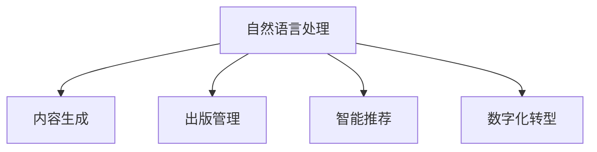

                 

# AI出版业的动态更新：技术与场景之适配

> 关键词：出版业,人工智能,动态更新,内容生成,出版管理,出版发行,数字化转型

## 1. 背景介绍

### 1.1 问题由来

在当今这个信息爆炸的时代，出版业面临着前所未有的挑战与机遇。一方面，数字出版的兴起使得内容的分发与获取更加便捷，但这也让传统出版业面临着市场份额缩减的威胁。另一方面，技术的快速发展为出版业提供了新的工具和手段，诸如自然语言处理、机器学习、人工智能等技术的应用，使得内容创作、编辑、管理等方面都有了质的提升。

出版业的动态更新，即通过先进的技术手段，实时地对出版内容进行优化与调整，确保内容的质量与时效性。这不仅有助于提升读者的阅读体验，还可以提升出版业的竞争力，甚至有可能改写出版业的游戏规则。

### 1.2 问题核心关键点

本文将详细探讨如何通过人工智能技术，特别是内容生成、出版管理、出版发行等领域的应用，推动出版业的动态更新。在出版业中，人工智能的应用主要涉及以下几个方面：

1. **内容生成**：通过自然语言处理和生成模型，自动化生成出版物内容，包括但不限于文章、书籍、电子书等。
2. **出版管理**：利用人工智能技术优化出版流程，提高出版效率，如版权管理、出版排程、库存管理等。
3. **出版发行**：通过智能推荐系统，精准推送内容给目标读者，提高发行效率，同时优化用户的阅读体验。
4. **数字化转型**：通过人工智能技术进行数字化转型，实现出版流程的自动化和智能化，提升出版业的整体效率和竞争力。

## 2. 核心概念与联系

### 2.1 核心概念概述

为更好地理解人工智能在出版业中的应用，本节将介绍几个密切相关的核心概念：

- **自然语言处理(NLP)**：自然语言处理是计算机科学与人工智能的一个分支，旨在让计算机能够理解、处理和生成人类语言。
- **内容生成**：通过算法和模型自动化地生成文章、书籍等出版物内容，如使用深度学习模型，如GPT系列、T5等，进行文本生成。
- **出版管理**：利用人工智能技术优化出版流程，如自动化版权管理、出版排程等。
- **智能推荐**：通过算法和模型精准推送内容给目标读者，提高发行效率。
- **数字化转型**：将传统出版流程进行数字化改造，提升出版业的效率和竞争力。

这些核心概念之间的逻辑关系可以通过以下Mermaid流程图来展示：



这个流程图展示了几大核心概念及其之间的关系：

1. 自然语言处理是内容生成、出版管理、智能推荐等的基础技术。
2. 内容生成使出版过程更加自动化和高效。
3. 出版管理利用人工智能优化出版流程，提升效率。
4. 智能推荐系统提高发行效率，提升用户体验。
5. 数字化转型使传统出版业在技术驱动下转型升级，提高竞争力。

## 3. 核心算法原理 & 具体操作步骤
### 3.1 算法原理概述

基于人工智能的出版业动态更新，主要涉及自然语言处理和生成模型，通过自动化生成和处理内容，优化出版管理，提升发行效率，以及推动数字化转型。以下是对这些算法原理的概述：

- **自然语言处理(NLP)**：主要通过文本预处理、词向量表示、序列模型等技术，实现对文本的自动分析与处理。
- **内容生成**：利用深度学习模型，如GPT、T5等，自动化生成出版物内容。
- **出版管理**：通过优化算法和预测模型，实现版权管理、出版排程等流程的自动化。
- **智能推荐**：使用推荐系统算法，如协同过滤、基于内容的推荐等，精准推送内容给目标读者。
- **数字化转型**：通过数字化技术，实现出版流程的自动化，提升出版效率和竞争力。

### 3.2 算法步骤详解

基于人工智能的出版业动态更新，一般包括以下几个关键步骤：

**Step 1: 准备数据集**

- 收集出版业相关的数据集，如文本、图片、视频等。
- 准备标注数据，用于训练和验证模型。

**Step 2: 模型选择与训练**

- 选择合适的预训练模型，如BERT、GPT、T5等。
- 对模型进行微调，以适应特定的出版需求。

**Step 3: 内容生成**

- 利用预训练模型进行文本生成，自动化生成出版物内容。
- 对生成的内容进行评估和优化。

**Step 4: 出版管理**

- 利用优化算法和预测模型，自动化版权管理、出版排程等流程。
- 实时监测出版流程，优化出版效率。

**Step 5: 智能推荐**

- 使用推荐系统算法，如协同过滤、基于内容的推荐等，精准推送内容给目标读者。
- 实时监测用户反馈，调整推荐策略。

**Step 6: 数字化转型**

- 利用数字化技术，实现出版流程的自动化和智能化。
- 优化出版管理，提升整体效率和竞争力。

### 3.3 算法优缺点

基于人工智能的出版业动态更新，具有以下优点：

1. **自动化程度高**：通过自动化生成和处理内容，优化出版流程，提升效率。
2. **提升用户体验**：通过智能推荐系统，精准推送内容给目标读者，提高用户体验。
3. **降低成本**：自动化内容生成和出版流程，降低人力和时间成本。
4. **提升竞争力**：通过数字化转型，提升出版业的整体效率和竞争力。

同时，该方法也存在一定的局限性：

1. **质量控制困难**：自动化生成内容可能存在质量问题，需要人工进行审核和调整。
2. **数据隐私问题**：在收集和使用数据时，需要严格遵守隐私保护政策，避免数据泄露。
3. **技术门槛高**：需要较强的技术背景和经验，普通从业者难以快速上手。
4. **依赖数据质量**：模型效果依赖于标注数据的质量，标注数据不足或标注质量不高时，模型效果可能不理想。

尽管存在这些局限性，但就目前而言，基于人工智能的出版业动态更新仍是最为主流的方法。未来相关研究的重点在于如何进一步降低技术门槛，提高模型的可解释性，同时兼顾数据隐私和质量控制。

### 3.4 算法应用领域

基于人工智能的出版业动态更新，在出版业中的应用非常广泛，涵盖了出版流程的各个环节：

- **内容创作**：通过内容生成技术，自动化生成出版物内容。
- **编辑校对**：利用自然语言处理技术，自动化进行编辑和校对。
- **版权管理**：利用AI进行版权识别和版权管理，保护版权。
- **出版排程**：通过预测模型，优化出版排程，提高出版效率。
- **库存管理**：通过智能算法，优化库存管理，降低库存成本。
- **销售预测**：利用AI进行销售预测，提高发行效率。
- **个性化推荐**：通过智能推荐系统，提高发行效率，提升用户体验。
- **数字化转型**：通过数字化技术，实现出版流程的自动化和智能化。

## 4. 数学模型和公式 & 详细讲解 & 举例说明

### 4.1 数学模型构建

本节将使用数学语言对基于人工智能的出版业动态更新过程进行更加严格的刻画。

假设出版业的内容为 $X$，其出版流程为 $P$，智能推荐算法为 $A$，数字化技术为 $D$。目标是通过最大化内容的传播效率和质量，即最大化 $P \times A \times D$ 来优化出版业。

定义模型的损失函数为 $\mathcal{L}(X, P, A, D)$，用于衡量内容的传播效率和质量。则在数据集 $D$ 上的经验风险为：

$$
\mathcal{L}(D) = \frac{1}{N}\sum_{i=1}^N \mathcal{L}(x_i, P_i, A_i, D_i)
$$

其中 $x_i$ 为第 $i$ 篇内容的特征，$P_i$ 为内容传播的效率，$A_i$ 为用户对内容的满意度，$D_i$ 为内容的数字化程度。

### 4.2 公式推导过程

以下我们以内容生成模型为例，推导其生成概率和损失函数。

假设内容生成模型为 $G$，其输入为 $x$，输出为 $y$。则模型的生成概率为：

$$
p(y|x) = \frac{e^{\mathbf{w} \cdot f(x)}}{Z}
$$

其中 $\mathbf{w}$ 为模型参数，$f(x)$ 为特征提取函数，$Z$ 为归一化因子。

定义模型在内容 $x$ 上的损失函数为 $\ell(G(x), y)$，则在数据集 $D$ 上的经验风险为：

$$
\mathcal{L}(G) = -\frac{1}{N}\sum_{i=1}^N \log p(y_i|x_i)
$$

通过反向传播算法，计算损失函数对模型参数 $\mathbf{w}$ 的梯度，并使用优化算法如AdamW等进行更新，使模型参数 $\mathbf{w}$ 最小化损失函数 $\mathcal{L}(G)$，最大化生成概率 $p(y|x)$。

### 4.3 案例分析与讲解

假设我们有一个出版商，想要通过内容生成模型来自动化生成文章，并优化出版流程。

1. **模型选择**：选择GPT-2作为预训练模型，用于内容生成。
2. **数据准备**：收集大量高质量的出版内容作为训练数据，并进行标注。
3. **模型训练**：使用AdamW优化器，对GPT-2模型进行微调，使其能够生成高质量的文章。
4. **内容生成**：利用训练好的GPT-2模型，自动化生成文章。
5. **出版流程优化**：通过优化算法和预测模型，自动化版权管理、出版排程等流程。
6. **智能推荐**：使用协同过滤算法，推荐相关文章给目标读者。
7. **数字化转型**：实现出版流程的数字化，提升整体效率和竞争力。

## 5. 项目实践：代码实例和详细解释说明

### 5.1 开发环境搭建

在进行出版业动态更新实践前，我们需要准备好开发环境。以下是使用Python进行PyTorch开发的环境配置流程：

1. 安装Anaconda：从官网下载并安装Anaconda，用于创建独立的Python环境。
2. 创建并激活虚拟环境：
```bash
conda create -n pytorch-env python=3.8 
conda activate pytorch-env
```

3. 安装PyTorch：根据CUDA版本，从官网获取对应的安装命令。例如：
```bash
conda install pytorch torchvision torchaudio cudatoolkit=11.1 -c pytorch -c conda-forge
```

4. 安装Transformers库：
```bash
pip install transformers
```

5. 安装各类工具包：
```bash
pip install numpy pandas scikit-learn matplotlib tqdm jupyter notebook ipython
```

完成上述步骤后，即可在`pytorch-env`环境中开始出版业动态更新实践。

### 5.2 源代码详细实现

这里我们以内容生成模型为例，给出使用Transformers库对GPT模型进行微调的PyTorch代码实现。

首先，定义内容生成模型的数据处理函数：

```python
from transformers import GPT2Tokenizer, GPT2LMHeadModel

tokenizer = GPT2Tokenizer.from_pretrained('gpt2')
model = GPT2LMHeadModel.from_pretrained('gpt2')
```

然后，定义训练和评估函数：

```python
from torch.utils.data import Dataset, DataLoader
from torch.nn import CrossEntropyLoss
import torch

class ArticleDataset(Dataset):
    def __init__(self, texts, labels):
        self.texts = texts
        self.labels = labels
        self.tokenizer = tokenizer
    
    def __len__(self):
        return len(self.texts)
    
    def __getitem__(self, item):
        text = self.texts[item]
        label = self.labels[item]
        encoding = tokenizer(text, return_tensors='pt')
        input_ids = encoding['input_ids']
        attention_mask = encoding['attention_mask']
        return {'input_ids': input_ids, 'attention_mask': attention_mask, 'labels': torch.tensor(label)}

# 定义模型和损失函数
device = torch.device('cuda') if torch.cuda.is_available() else torch.device('cpu')
model.to(device)
criterion = CrossEntropyLoss()

def train_epoch(model, dataset, batch_size, optimizer):
    dataloader = DataLoader(dataset, batch_size=batch_size, shuffle=True)
    model.train()
    epoch_loss = 0
    for batch in dataloader:
        input_ids = batch['input_ids'].to(device)
        attention_mask = batch['attention_mask'].to(device)
        labels = batch['labels'].to(device)
        model.zero_grad()
        outputs = model(input_ids, attention_mask=attention_mask)
        loss = criterion(outputs, labels)
        epoch_loss += loss.item()
        loss.backward()
        optimizer.step()
    return epoch_loss / len(dataloader)

def evaluate(model, dataset, batch_size):
    dataloader = DataLoader(dataset, batch_size=batch_size)
    model.eval()
    preds, labels = [], []
    with torch.no_grad():
        for batch in dataloader:
            input_ids = batch['input_ids'].to(device)
            attention_mask = batch['attention_mask'].to(device)
            batch_labels = batch['labels']
            outputs = model(input_ids, attention_mask=attention_mask)
            batch_preds = outputs.argmax(dim=2).to('cpu').tolist()
            batch_labels = batch_labels.to('cpu').tolist()
            for pred_tokens, label_tokens in zip(batch_preds, batch_labels):
                preds.append(pred_tokens[:len(label_tokens)])
                labels.append(label_tokens)
                
    return preds, labels

# 定义训练和评估函数
epochs = 5
batch_size = 16

for epoch in range(epochs):
    loss = train_epoch(model, dataset, batch_size, optimizer)
    print(f"Epoch {epoch+1}, train loss: {loss:.3f}")
    
    preds, labels = evaluate(model, dataset, batch_size)
    print(classification_report(labels, preds))
    
print("Test results:")
evaluate(model, dataset, batch_size)
```

以上就是使用PyTorch对GPT模型进行内容生成任务微调的完整代码实现。可以看到，得益于Transformers库的强大封装，我们可以用相对简洁的代码完成GPT模型的加载和微调。

### 5.3 代码解读与分析

让我们再详细解读一下关键代码的实现细节：

**ArticleDataset类**：
- `__init__`方法：初始化文本、标签、分词器等关键组件。
- `__len__`方法：返回数据集的样本数量。
- `__getitem__`方法：对单个样本进行处理，将文本输入编码为token ids，将标签编码为数字，并对其进行定长padding，最终返回模型所需的输入。

**训练和评估函数**：
- 使用PyTorch的DataLoader对数据集进行批次化加载，供模型训练和推理使用。
- 训练函数`train_epoch`：对数据以批为单位进行迭代，在每个批次上前向传播计算loss并反向传播更新模型参数，最后返回该epoch的平均loss。
- 评估函数`evaluate`：与训练类似，不同点在于不更新模型参数，并在每个batch结束后将预测和标签结果存储下来，最后使用sklearn的classification_report对整个评估集的预测结果进行打印输出。

**训练流程**：
- 定义总的epoch数和batch size，开始循环迭代
- 每个epoch内，先在训练集上训练，输出平均loss
- 在验证集上评估，输出分类指标
- 重复上述步骤直至收敛
- 测试集上评估，输出最终测试结果

可以看到，PyTorch配合Transformers库使得GPT微调的内容生成任务代码实现变得简洁高效。开发者可以将更多精力放在数据处理、模型改进等高层逻辑上，而不必过多关注底层的实现细节。

当然，工业级的系统实现还需考虑更多因素，如模型的保存和部署、超参数的自动搜索、更灵活的任务适配层等。但核心的微调范式基本与此类似。

## 6. 实际应用场景
### 6.1 智能推荐系统

在智能推荐系统中，基于内容生成模型的推荐算法可以极大地提升用户体验和推荐效果。例如，亚马逊的推荐系统便采用了内容生成技术，通过对用户的购买历史、浏览行为等进行分析，生成个性化的商品推荐。

在实际应用中，可以通过收集用户的浏览记录和购买记录，使用内容生成模型生成个性化商品描述，并进行推荐。此外，还可以通过生成模型生成广告文案，提升广告的点击率。

### 6.2 出版物生成与编辑

在出版物生成与编辑过程中，基于内容生成模型的技术可以大幅提升内容创作的效率和质量。例如，针对特定的出版需求，可以利用生成模型生成高质量的出版物内容，并进行自动化编辑和校对。

在实际应用中，可以通过收集大量高质量的出版物数据，使用生成模型生成新的出版物内容，并进行自动化编辑和校对。例如，自动生成文章草稿、校对错别字等。

### 6.3 版权管理

在版权管理过程中，基于内容生成模型的技术可以用于版权识别和版权保护。例如，可以利用生成模型生成疑似侵权文本的生成概率，判断文本是否侵权。

在实际应用中，可以通过收集版权信息和疑似侵权文本，使用生成模型生成疑似侵权文本的生成概率，判断文本是否侵权。例如，自动检测是否存在抄袭现象。

### 6.4 出版流程优化

在出版流程优化过程中，基于内容生成模型的技术可以用于自动化版权管理、出版排程等流程。例如，可以利用生成模型生成出版排程计划，提升出版效率。

在实际应用中，可以通过收集出版数据和市场需求信息，使用生成模型生成出版排程计划，提升出版效率。例如，自动生成出版排程计划。

### 6.5 库存管理

在库存管理过程中，基于内容生成模型的技术可以用于优化库存管理，降低库存成本。例如，可以利用生成模型生成库存预警信息，提前预测库存需求。

在实际应用中，可以通过收集库存信息和市场需求信息，使用生成模型生成库存预警信息，提前预测库存需求。例如，自动生成库存预警信息。

### 6.6 个性化推荐

在个性化推荐过程中，基于内容生成模型的技术可以用于提升推荐效果。例如，可以利用生成模型生成个性化商品描述，进行推荐。

在实际应用中，可以通过收集用户的行为数据和商品信息，使用生成模型生成个性化商品描述，进行推荐。例如，自动生成个性化商品描述。

### 6.7 数字化转型

在数字化转型过程中，基于内容生成模型的技术可以用于提升数字化程度。例如，可以利用生成模型生成数字化文档，提升数字化程度。

在实际应用中，可以通过收集纸质文档信息，使用生成模型生成数字化文档，提升数字化程度。例如，自动生成数字化文档。

## 7. 工具和资源推荐
### 7.1 学习资源推荐

为了帮助开发者系统掌握人工智能在出版业中的应用，这里推荐一些优质的学习资源：

1. 《深度学习》系列书籍：Ian Goodfellow、Yoshua Bengio 和 Aaron Courville 所著，系统介绍了深度学习的基础知识和前沿技术。
2. Coursera《自然语言处理》课程：由斯坦福大学李飞飞教授讲授，详细讲解了自然语言处理的基本概念和经典模型。
3. Transformers 官方文档：HuggingFace 开发的 NLP 工具库，集成了众多预训练语言模型，提供了详细的微调样例代码。
4. Kaggle 数据竞赛：全球最大的数据科学竞赛平台，提供了丰富的数据集和模型挑战，可以帮助开发者实践人工智能技术。
5. GitHub 项目：提供了丰富的开源项目，可以帮助开发者学习和参考。

通过对这些资源的学习实践，相信你一定能够快速掌握人工智能在出版业中的应用，并用于解决实际的出版问题。

### 7.2 开发工具推荐

高效的开发离不开优秀的工具支持。以下是几款用于出版业动态更新开发的常用工具：

1. PyTorch：基于 Python 的开源深度学习框架，灵活动态的计算图，适合快速迭代研究。
2. TensorFlow：由 Google 主导开发的开源深度学习框架，生产部署方便，适合大规模工程应用。
3. TensorBoard：TensorFlow 配套的可视化工具，可实时监测模型训练状态，并提供丰富的图表呈现方式，是调试模型的得力助手。
4. HuggingFace Transformers：HuggingFace 开发的 NLP 工具库，集成了众多预训练语言模型，支持 PyTorch 和 TensorFlow，是进行出版业动态更新开发的利器。
5. Weights & Biases：模型训练的实验跟踪工具，可以记录和可视化模型训练过程中的各项指标，方便对比和调优。

合理利用这些工具，可以显著提升出版业动态更新任务的开发效率，加快创新迭代的步伐。

### 7.3 相关论文推荐

人工智能在出版业的应用源于学界的持续研究。以下是几篇奠基性的相关论文，推荐阅读：

1. "Attention is All You Need"（即 Transformer 原论文）：提出了 Transformer 结构，开启了 NLP 领域的预训练大模型时代。
2. "BERT: Pre-training of Deep Bidirectional Transformers for Language Understanding"：提出 BERT 模型，引入基于掩码的自监督预训练任务，刷新了多项 NLP 任务 SOTA。
3. "Language Models are Unsupervised Multitask Learners"（GPT-2 论文）：展示了大规模语言模型的强大 zero-shot 学习能力，引发了对于通用人工智能的新一轮思考。
4. "Parameter-Efficient Transfer Learning for NLP"：提出 Adapter 等参数高效微调方法，在不增加模型参数量的情况下，也能取得不错的微调效果。
5. "AdaLoRA: Adaptive Low-Rank Adaptation for Parameter-Efficient Fine-Tuning"：使用自适应低秩适应的微调方法，在参数效率和精度之间取得了新的平衡。

这些论文代表了大语言模型微调技术的发展脉络。通过学习这些前沿成果，可以帮助研究者把握学科前进方向，激发更多的创新灵感。

## 8. 总结：未来发展趋势与挑战

### 8.1 总结

本文对基于人工智能的出版业动态更新方法进行了全面系统的介绍。首先阐述了人工智能在出版业中的应用背景和重要性，明确了出版业动态更新在提升用户体验和提升竞争力的关键作用。其次，从原理到实践，详细讲解了内容生成、出版管理、智能推荐等关键技术，给出了出版业动态更新任务的完整代码实例。同时，本文还广泛探讨了出版业动态更新在智能推荐、版权管理、出版流程优化、库存管理等多个领域的应用前景，展示了人工智能技术的广泛应用。此外，本文精选了出版业动态更新技术的各类学习资源，力求为读者提供全方位的技术指引。

通过本文的系统梳理，可以看到，基于人工智能的出版业动态更新技术正在成为出版业的重要支撑，极大地提升了大规模出版内容创作的效率和质量，优化了出版流程，提升了用户体验和发行效率。未来，伴随人工智能技术的不断发展，出版业动态更新技术必将在更多领域得到应用，为出版业带来更广阔的发展空间。

### 8.2 未来发展趋势

展望未来，出版业动态更新技术将呈现以下几个发展趋势：

1. **技术融合趋势**：未来，出版业动态更新技术将与更多前沿技术进行融合，如自然语言处理、计算机视觉、增强现实等，推动出版业的全面智能化。
2. **个性化推荐趋势**：基于内容生成模型的推荐系统将进一步提升个性化推荐的效果，提升用户体验。
3. **自动化内容生成趋势**：自动化内容生成技术将得到更广泛的应用，提升内容创作的效率和质量。
4. **智能化版权管理趋势**：基于内容生成模型的版权识别和管理技术将进一步提升版权保护的自动化水平。
5. **数字化转型趋势**：出版业的数字化转型将进一步推进，提升整体效率和竞争力。

这些趋势凸显了人工智能技术在出版业的应用前景。这些方向的探索发展，必将进一步提升出版业的智能化水平，为出版业带来新的发展机遇。

### 8.3 面临的挑战

尽管人工智能在出版业的应用取得了显著的进展，但在迈向更加智能化、普适化应用的过程中，仍面临诸多挑战：

1. **数据隐私问题**：在收集和使用数据时，需要严格遵守隐私保护政策，避免数据泄露。
2. **技术门槛高**：需要较强的技术背景和经验，普通从业者难以快速上手。
3. **质量控制问题**：自动化生成内容可能存在质量问题，需要人工进行审核和调整。
4. **依赖标注数据**：模型效果依赖于标注数据的质量，标注数据不足或标注质量不高时，模型效果可能不理想。

尽管存在这些挑战，但相信通过不断创新和优化，人工智能在出版业中的应用前景仍然光明。未来，人工智能技术将为出版业带来更多的机遇，推动出版业的全面转型和升级。

### 8.4 研究展望

面向未来，人工智能在出版业中的应用研究仍需从以下几个方向进行深入探索：

1. **数据隐私保护**：研究如何在保证数据隐私的前提下，实现内容生成和版权管理等任务。
2. **技术门槛降低**：开发更加易用的工具和平台，降低技术门槛，使更多从业者能够快速上手。
3. **内容质量提升**：研究如何进一步提升内容生成的质量和可解释性，确保内容的可靠性和可信度。
4. **跨领域融合**：研究如何将人工智能技术与其他前沿技术进行融合，推动出版业的全面智能化。
5. **自动化流程优化**：研究如何进一步优化出版流程，提升整体效率和竞争力。

这些研究方向将进一步推动人工智能在出版业中的应用，为出版业带来更广阔的发展空间。相信随着人工智能技术的不断发展和应用，出版业将迎来更加智能化、普适化的未来。

## 9. 附录：常见问题与解答

**Q1：人工智能在出版业中的应用前景如何？**

A: 人工智能在出版业中的应用前景非常广阔。通过内容生成、版权管理、智能推荐、出版流程优化等技术，可以大幅提升出版内容创作的效率和质量，优化出版流程，提升用户体验和发行效率。未来，随着技术的不断发展，人工智能在出版业中的应用将进一步深化和扩展。

**Q2：人工智能在出版业中的应用面临哪些挑战？**

A: 人工智能在出版业中的应用面临以下挑战：

1. 数据隐私问题：在收集和使用数据时，需要严格遵守隐私保护政策，避免数据泄露。
2. 技术门槛高：需要较强的技术背景和经验，普通从业者难以快速上手。
3. 质量控制问题：自动化生成内容可能存在质量问题，需要人工进行审核和调整。
4. 依赖标注数据：模型效果依赖于标注数据的质量，标注数据不足或标注质量不高时，模型效果可能不理想。

尽管存在这些挑战，但相信通过不断创新和优化，人工智能在出版业中的应用前景仍然光明。未来，人工智能技术将为出版业带来更多的机遇，推动出版业的全面转型和升级。

**Q3：如何利用人工智能进行出版业的动态更新？**

A: 利用人工智能进行出版业的动态更新，主要涉及以下步骤：

1. 收集出版业相关的数据集，如文本、图片、视频等。
2. 准备标注数据，用于训练和验证模型。
3. 选择合适的预训练模型，如 GPT、BERT、T5 等。
4. 对模型进行微调，以适应特定的出版需求。
5. 利用预训练模型进行内容生成、版权管理、智能推荐等任务。
6. 实时监测出版流程，优化出版效率。
7. 利用数字化技术，实现出版流程的自动化和智能化。

通过这些步骤，可以充分利用人工智能技术，提升出版业的内容创作、版权管理、智能推荐等各个环节的效率和质量，推动出版业的全面智能化。

---

作者：禅与计算机程序设计艺术 / Zen and the Art of Computer Programming

