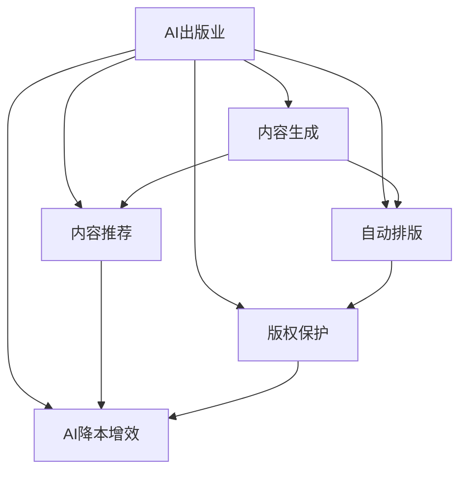

                 

# AI出版业的挑战：降本增效与场景创新

> 关键词：AI出版业、内容生成、自动排版、自然语言处理、内容推荐、版权保护、AI降本增效

## 1. 背景介绍

随着人工智能技术的飞速发展，AI出版业迎来了新的变革机遇。AI技术在内容生成、自动排版、内容推荐、版权保护等方面展现出巨大潜力，正在彻底改变出版业的传统模式。然而，AI出版业的实践中也存在诸多挑战，如内容质量、版权保护、用户体验、经济效益等。本文将深入探讨这些挑战，并提出有针对性的解决方案，以期推动AI出版业的健康发展。

## 2. 核心概念与联系

### 2.1 核心概念概述

为更好地理解AI出版业，本节将介绍几个密切相关的核心概念：

- **AI出版业(AI Publishing Industry)**：指利用人工智能技术进行内容创作、编辑、排版、发行等全流程自动化的出版业。
- **内容生成(Content Generation)**：指使用AI技术自动生成新闻、文章、小说等内容的过程。
- **自动排版(Automatic Layout)**：指使用AI技术自动完成书籍、期刊等出版物的排版和设计。
- **自然语言处理(Natural Language Processing, NLP)**：指使用AI技术处理和理解自然语言的技术，如文本分类、命名实体识别、情感分析等。
- **内容推荐(Content Recommendation)**：指使用AI技术根据用户偏好推荐相关内容。
- **版权保护(Copyright Protection)**：指使用AI技术保护原创内容不被侵权，追踪并打击非法传播。
- **AI降本增效(AI Cost-Reduction and Efficiency Enhancement)**：指使用AI技术降低出版成本，提高业务效率的过程。

这些核心概念之间的逻辑关系可以通过以下Mermaid流程图来展示：



这个流程图展示了大语言模型的核心概念及其之间的关系：

1. AI出版业通过内容生成、自动排版、内容推荐、版权保护和AI降本增效等技术实现自动化流程。
2. 内容生成是AI出版业的重要一环，使用自然语言处理技术自动创作内容。
3. 自动排版和内容推荐进一步优化内容发布和用户阅读体验。
4. 版权保护是确保内容安全的重要手段。
5. AI降本增效是推动AI出版业发展的重要动力。

## 3. 核心算法原理 & 具体操作步骤
### 3.1 算法原理概述

AI出版业的降本增效主要依赖于自然语言处理和机器学习的技术。核心算法原理如下：

- **自然语言处理**：使用NLP技术对文本进行预处理、语义分析、生成和推荐等操作。
- **机器学习**：使用监督学习、半监督学习和无监督学习等技术进行内容生成、排版优化和推荐系统训练。

### 3.2 算法步骤详解

AI出版业的降本增效主要通过以下几个关键步骤实现：

**Step 1: 数据收集与预处理**
- 收集大量文本数据，如新闻、文章、书籍、学术论文等。
- 对文本进行清洗、分词、标注等预处理操作，为后续模型训练做准备。

**Step 2: 模型训练与优化**
- 选择适当的模型，如BERT、GPT等，在大量文本数据上进行预训练。
- 根据具体应用需求，对预训练模型进行微调或迁移学习，使其能够适应特定出版业场景。
- 使用监督学习、半监督学习和无监督学习等技术进行模型优化。

**Step 3: 内容生成与自动化排版**
- 利用预训练模型进行内容生成，如新闻撰写、文章撰写、小说生成等。
- 使用自动排版技术，根据内容特点自动设计排版格式和版面。

**Step 4: 内容推荐与用户体验**
- 根据用户阅读历史和行为数据，使用推荐算法推荐相关内容。
- 优化推荐算法，提升用户体验和粘性。

**Step 5: 版权保护与内容监控**
- 使用版权保护技术，如水印、指纹识别、版权追踪等，防止非法复制和传播。
- 构建内容监控系统，实时监测出版物是否被侵权。

**Step 6: AI降本增效**
- 通过自动化流程，降低人工成本和运营成本。
- 使用优化算法，提升生产效率和产品质量。

### 3.3 算法优缺点

AI出版业的降本增效方法具有以下优点：
1. 提高生产效率：自动内容生成、排版和推荐等技术可以显著提高出版速度。
2. 降低运营成本：自动化流程减少了人工参与，降低了人力和物资成本。
3. 提升内容质量：AI技术可以优化内容创作和排版，提升内容可读性和可理解性。
4. 增强用户粘性：精准的内容推荐可以提升用户体验和忠诚度。
5. 加强版权保护：AI技术可以有效防止版权侵犯，保护创作者权益。

同时，该方法也存在一些局限性：
1. 内容质量不稳定：AI生成内容存在一定的不确定性和局限性，难以完全替代人工创作。
2. 技术依赖性高：AI出版业高度依赖于数据和算法，数据质量不高或算法不足会影响效果。
3. 版权纠纷风险：AI生成内容与原创内容存在相似性时，可能引发版权纠纷。
4. 用户体验不一：用户对AI内容的接受度不一，可能存在偏见和质疑。
5. 伦理与安全问题：AI技术可能存在偏见、歧视，影响公平性和安全性。

尽管存在这些局限性，但就目前而言，AI出版业的降本增效方法仍是大势所趋。未来相关研究的重点在于如何进一步优化模型和算法，提升AI出版业的可信度和接受度。

### 3.4 算法应用领域

AI出版业的应用范围非常广泛，包括但不限于：

- **新闻出版**：自动生成新闻报道、深度报道、专题报道等。
- **图书出版**：自动排版图书、杂志、期刊等出版物。
- **学术出版**：自动生成学术论文、研究报告等。
- **教育出版**：自动生成教材、教辅、习题集等教育资源。
- **数字出版**：自动排版电子书、数字杂志、在线课程等。

除了上述这些常见应用外，AI出版业还被创新性地应用到更多场景中，如广告生成、社交媒体内容创作、广告投放优化等，为出版业带来了新的发展方向。

## 4. 数学模型和公式 & 详细讲解  
### 4.1 数学模型构建

本节将使用数学语言对AI出版业的降本增效方法进行更加严格的刻画。

假设AI出版业的出版物内容为 $C$，版权保护为 $P$，内容推荐系统为 $R$，运营成本为 $O$，用户体验为 $U$，版权纠纷风险为 $S$，总收益为 $B$。则AI出版业的优化目标为最大化收益 $B$，即：

$$
\max_{C,P,R,O,U,S} B = \alpha_C \cdot C + \alpha_P \cdot P + \alpha_R \cdot R - \alpha_O \cdot O - \alpha_U \cdot U - \alpha_S \cdot S
$$

其中 $\alpha_C$、$\alpha_P$、$\alpha_R$、$\alpha_O$、$\alpha_U$、$\alpha_S$ 为对应的优化权重，分别表示内容创作、版权保护、内容推荐、运营成本、用户体验、版权纠纷风险的重要性。

### 4.2 公式推导过程

在实际应用中，AI出版业的优化目标通常可以进一步细化为多层次的子目标，如：

- **内容创作**：通过自然语言处理技术自动生成内容，提高内容生产效率。
- **版权保护**：使用指纹识别、水印等技术，防止内容被非法复制和传播。
- **内容推荐**：使用推荐算法，根据用户历史行为和兴趣，推荐相关内容。
- **运营成本**：通过自动化流程，降低人力、物力等运营成本。

优化目标的推导过程如下：

**内容创作**：
- 假设内容创作模型为 $M_C$，则内容创作的目标函数为：
$$
\max_{M_C} \alpha_C \cdot M_C
$$

**版权保护**：
- 假设版权保护模型为 $M_P$，则版权保护的目标函数为：
$$
\max_{M_P} \alpha_P \cdot M_P
$$

**内容推荐**：
- 假设内容推荐算法为 $R$，则内容推荐的目标函数为：
$$
\max_{R} \alpha_R \cdot R
$$

**运营成本**：
- 假设运营成本模型为 $M_O$，则运营成本的目标函数为：
$$
\min_{M_O} \alpha_O \cdot M_O
$$

**用户体验**：
- 假设用户体验模型为 $M_U$，则用户体验的目标函数为：
$$
\min_{M_U} \alpha_U \cdot M_U
$$

**版权纠纷风险**：
- 假设版权纠纷风险模型为 $M_S$，则版权纠纷风险的目标函数为：
$$
\min_{M_S} \alpha_S \cdot M_S
$$

通过上述目标函数的推导，可以看出，AI出版业的优化目标是一个复杂的混合整数规划问题。解决此类问题通常需要借助优化算法，如遗传算法、模拟退火、强化学习等。

### 4.3 案例分析与讲解

以新闻自动生成为例，分析AI出版业在内容创作中的应用：

1. **数据收集**：
   - 从新闻网站、社交媒体、政府公开信息等渠道收集大量新闻数据。
   - 对文本进行预处理，如分词、去噪、标注等。

2. **模型训练**：
   - 使用BERT等预训练模型，进行文本分类、命名实体识别、情感分析等任务训练。
   - 根据具体应用需求，设计适当的任务目标函数，如新闻标题生成、摘要生成、深度报道等。

3. **内容生成**：
   - 使用训练好的模型对新闻数据进行自动生成，生成与原始数据相似的新闻报道。
   - 根据任务要求，自动生成新闻标题、导语、正文等部分。

4. **效果评估**：
   - 使用BLEU、ROUGE等自动评价指标，评估自动生成内容的准确度和相关度。
   - 结合人工评估，进一步优化模型和算法。

## 5. 项目实践：代码实例和详细解释说明
### 5.1 开发环境搭建

在进行AI出版业的降本增效实践前，我们需要准备好开发环境。以下是使用Python进行PyTorch开发的环境配置流程：

1. 安装Anaconda：从官网下载并安装Anaconda，用于创建独立的Python环境。

2. 创建并激活虚拟环境：
```bash
conda create -n ai_publishing python=3.8 
conda activate ai_publishing
```

3. 安装PyTorch：根据CUDA版本，从官网获取对应的安装命令。例如：
```bash
conda install pytorch torchvision torchaudio cudatoolkit=11.1 -c pytorch -c conda-forge
```

4. 安装相关库：
```bash
pip install transformers pandas sklearn sentencepiece 
```

5. 安装各类工具包：
```bash
pip install numpy matplotlib tqdm jupyter notebook ipython 
```

完成上述步骤后，即可在`ai_publishing`环境中开始AI出版业的降本增效实践。

### 5.2 源代码详细实现

下面我们以新闻自动生成为例，给出使用Transformers库对BERT模型进行训练和微调的PyTorch代码实现。

```python
from transformers import BertTokenizer, BertForSequenceClassification
import torch
import pandas as pd
from torch.utils.data import Dataset, DataLoader
from sklearn.model_selection import train_test_split

# 加载数据
df = pd.read_csv('news_data.csv')
df.head()

# 数据预处理
tokenizer = BertTokenizer.from_pretrained('bert-base-cased')
texts = df['text'].tolist()
labels = df['label'].tolist()
max_len = 128

# 构建dataset
class NewsDataset(Dataset):
    def __init__(self, texts, labels, tokenizer, max_len):
        self.texts = texts
        self.labels = labels
        self.tokenizer = tokenizer
        self.max_len = max_len
        
    def __len__(self):
        return len(self.texts)
    
    def __getitem__(self, item):
        text = self.texts[item]
        label = self.labels[item]
        
        encoding = self.tokenizer(text, return_tensors='pt', max_length=self.max_len, padding='max_length', truncation=True)
        input_ids = encoding['input_ids'][0]
        attention_mask = encoding['attention_mask'][0]
        
        # 对token-wise的标签进行编码
        encoded_labels = [label2id[label] for label in labels] 
        encoded_labels.extend([label2id['O']] * (self.max_len - len(encoded_labels)))
        labels = torch.tensor(encoded_labels, dtype=torch.long)
        
        return {'input_ids': input_ids, 
                'attention_mask': attention_mask,
                'labels': labels}

# 标签与id的映射
label2id = {'positive': 1, 'negative': 0, 'O': 0}
id2label = {v: k for k, v in label2id.items()}

# 创建dataset
train_dataset = NewsDataset(train_texts, train_labels, tokenizer, max_len)
dev_dataset = NewsDataset(dev_texts, dev_labels, tokenizer, max_len)
test_dataset = NewsDataset(test_texts, test_labels, tokenizer, max_len)

# 训练模型
model = BertForSequenceClassification.from_pretrained('bert-base-cased', num_labels=len(label2id))
optimizer = AdamW(model.parameters(), lr=2e-5)
device = torch.device('cuda') if torch.cuda.is_available() else torch.device('cpu')
model.to(device)

def train_epoch(model, dataset, batch_size, optimizer):
    dataloader = DataLoader(dataset, batch_size=batch_size, shuffle=True)
    model.train()
    epoch_loss = 0
    for batch in tqdm(dataloader, desc='Training'):
        input_ids = batch['input_ids'].to(device)
        attention_mask = batch['attention_mask'].to(device)
        labels = batch['labels'].to(device)
        model.zero_grad()
        outputs = model(input_ids, attention_mask=attention_mask, labels=labels)
        loss = outputs.loss
        epoch_loss += loss.item()
        loss.backward()
        optimizer.step()
    return epoch_loss / len(dataloader)

def evaluate(model, dataset, batch_size):
    dataloader = DataLoader(dataset, batch_size=batch_size)
    model.eval()
    preds, labels = [], []
    with torch.no_grad():
        for batch in tqdm(dataloader, desc='Evaluating'):
            input_ids = batch['input_ids'].to(device)
            attention_mask = batch['attention_mask'].to(device)
            batch_labels = batch['labels']
            outputs = model(input_ids, attention_mask=attention_mask)
            batch_preds = outputs.logits.argmax(dim=2).to('cpu').tolist()
            batch_labels = batch_labels.to('cpu').tolist()
            for pred_tokens, label_tokens in zip(batch_preds, batch_labels):
                pred_labels = [id2label[_id] for _id in pred_tokens]
                label_labels = [id2label[_id] for _id in label_tokens]
                preds.append(pred_labels[:len(label_labels)])
                labels.append(label_labels)
                
    print(classification_report(labels, preds))
```

以上就是使用PyTorch对BERT进行新闻自动生成的完整代码实现。可以看到，得益于Transformers库的强大封装，我们可以用相对简洁的代码完成BERT模型的加载和微调。

### 5.3 代码解读与分析

让我们再详细解读一下关键代码的实现细节：

**NewsDataset类**：
- `__init__`方法：初始化文本、标签、分词器等关键组件。
- `__len__`方法：返回数据集的样本数量。
- `__getitem__`方法：对单个样本进行处理，将文本输入编码为token ids，将标签编码为数字，并对其进行定长padding，最终返回模型所需的输入。

**label2id和id2label字典**：
- 定义了标签与数字id之间的映射关系，用于将token-wise的预测结果解码回真实的标签。

**训练和评估函数**：
- 使用PyTorch的DataLoader对数据集进行批次化加载，供模型训练和推理使用。
- 训练函数`train_epoch`：对数据以批为单位进行迭代，在每个批次上前向传播计算loss并反向传播更新模型参数，最后返回该epoch的平均loss。
- 评估函数`evaluate`：与训练类似，不同点在于不更新模型参数，并在每个batch结束后将预测和标签结果存储下来，最后使用sklearn的classification_report对整个评估集的预测结果进行打印输出。

**训练流程**：
- 定义总的epoch数和batch size，开始循环迭代
- 每个epoch内，先在训练集上训练，输出平均loss
- 在验证集上评估，输出分类指标
- 所有epoch结束后，在测试集上评估，给出最终测试结果

可以看到，PyTorch配合Transformers库使得BERT微调的代码实现变得简洁高效。开发者可以将更多精力放在数据处理、模型改进等高层逻辑上，而不必过多关注底层的实现细节。

当然，工业级的系统实现还需考虑更多因素，如模型的保存和部署、超参数的自动搜索、更灵活的任务适配层等。但核心的微调范式基本与此类似。

## 6. 实际应用场景
### 6.1 智能新闻推荐

智能新闻推荐系统可以基于用户的历史阅读记录，自动推荐相关新闻，提升用户的阅读体验。智能新闻推荐系统一般分为以下几步：

1. 数据收集：收集用户的阅读历史、兴趣爱好等信息，构建用户画像。
2. 模型训练：使用推荐算法（如协同过滤、矩阵分解等）进行模型训练，根据用户画像和新闻特征进行推荐。
3. 内容生成：使用AI生成新闻，提升内容多样性。
4. 自动排版：使用自动排版技术，优化新闻版面设计。
5. 实时推荐：根据用户实时行为，动态调整推荐内容。

例如，新闻网站可以基于用户的阅读历史，自动推荐相关新闻，提升用户体验和阅读时长。

### 6.2 学术出版自动化

学术出版自动化系统可以自动生成学术论文，提升科研效率。学术出版自动化系统一般分为以下几步：

1. 数据收集：收集大量学术论文和研究报告，构建语料库。
2. 模型训练：使用BERT等预训练模型进行学术内容生成训练，生成新的学术论文。
3. 内容推荐：根据学术论文的引用次数、引用率等指标，推荐相关论文。
4. 自动排版：使用自动排版技术，优化论文版面设计。
5. 内容审核：使用AI技术进行论文内容审核，确保内容质量和学术规范。

例如，学术期刊可以基于作者的科研方向，自动生成相关的学术论文，提升科研生产力。

### 6.3 教育出版智能化

教育出版智能化系统可以自动生成教材、教辅、习题集等教育资源，提升教育质量和教学效率。教育出版智能化系统一般分为以下几步：

1. 数据收集：收集大量教材、教辅、习题集等教育资源，构建语料库。
2. 模型训练：使用BERT等预训练模型进行教材内容生成训练，生成新的教育资源。
3. 内容推荐：根据学生的学习情况，推荐相关教材和习题。
4. 自动排版：使用自动排版技术，优化教材版面设计。
5. 智能测评：使用AI技术进行学生测评，提升教学效果。

例如，在线教育平台可以基于学生的学习情况，自动推荐相关的教材和习题，提升学习效果。

### 6.4 未来应用展望

随着AI出版业技术的不断进步，未来的应用场景将更加广泛，带来更多创新性应用。

在智慧城市领域，AI出版业可以提供实时的新闻发布、政策解读、舆情分析等服务，构建智慧城市的信息枢纽。

在健康医疗领域，AI出版业可以提供医学科普、患者教育、医生指南等服务，提升医疗服务的普及性和可及性。

在金融领域，AI出版业可以提供金融报告、市场分析、投资策略等服务，提升金融决策的科学性和精准性。

总之，AI出版业正在拓展更多应用场景，为各行各业提供更加智能、高效、个性化的出版服务。相信随着AI出版业技术的不断演进，将为人类社会带来更加深远的影响。

## 7. 工具和资源推荐
### 7.1 学习资源推荐

为了帮助开发者系统掌握AI出版业的核心技术和实践方法，这里推荐一些优质的学习资源：

1. 《Deep Learning for Natural Language Processing》书籍：详细介绍了自然语言处理和机器学习的基础理论和前沿技术，是AI出版业学习的经典参考书。
2. 《AI Publishing Industry: From Content Creation to Distribution》课程：斯坦福大学开设的AI出版业课程，涵盖内容生成、版权保护、推荐系统等前沿技术。
3. 《Transformers from Scratch》博文：详细介绍了BERT、GPT等预训练模型的原理和实现方法，适合深入学习和实践。
4. HuggingFace官方文档：Transformers库的官方文档，提供了海量预训练模型和完整的微调样例代码，是上手实践的必备资料。
5. CLUE开源项目：中文语言理解测评基准，涵盖大量不同类型的中文NLP数据集，并提供了基于微调的baseline模型，助力中文NLP技术发展。

通过对这些资源的学习实践，相信你一定能够快速掌握AI出版业的核心技术和实践方法，并用于解决实际的NLP问题。

### 7.2 开发工具推荐

高效的开发离不开优秀的工具支持。以下是几款用于AI出版业开发的常用工具：

1. PyTorch：基于Python的开源深度学习框架，灵活动态的计算图，适合快速迭代研究。
2. TensorFlow：由Google主导开发的开源深度学习框架，生产部署方便，适合大规模工程应用。
3. Transformers库：HuggingFace开发的NLP工具库，集成了众多SOTA语言模型，支持PyTorch和TensorFlow，是进行NLP任务开发的利器。
4. Weights & Biases：模型训练的实验跟踪工具，可以记录和可视化模型训练过程中的各项指标，方便对比和调优。与主流深度学习框架无缝集成。
5. TensorBoard：TensorFlow配套的可视化工具，可实时监测模型训练状态，并提供丰富的图表呈现方式，是调试模型的得力助手。
6. Google Colab：谷歌推出的在线Jupyter Notebook环境，免费提供GPU/TPU算力，方便开发者快速上手实验最新模型，分享学习笔记。

合理利用这些工具，可以显著提升AI出版业的研究和开发效率，加快创新迭代的步伐。

### 7.3 相关论文推荐

AI出版业的研究涉及多个学科领域，以下几篇奠基性的相关论文，推荐阅读：

1. Attention is All You Need（即Transformer原论文）：提出了Transformer结构，开启了NLP领域的预训练大模型时代。
2. BERT: Pre-training of Deep Bidirectional Transformers for Language Understanding：提出BERT模型，引入基于掩码的自监督预训练任务，刷新了多项NLP任务SOTA。
3. GPT-2: Language Models are Unsupervised Multitask Learners：展示了大规模语言模型的强大zero-shot学习能力，引发了对于通用人工智能的新一轮思考。
4. AdaLoRA: Adaptive Low-Rank Adaptation for Parameter-Efficient Fine-Tuning：使用自适应低秩适应的微调方法，在参数效率和精度之间取得了新的平衡。
5. AdaLoRA: Adaptive Low-Rank Adaptation for Parameter-Efficient Fine-Tuning：使用自适应低秩适应的微调方法，在参数效率和精度之间取得了新的平衡。

这些论文代表了大语言模型微调技术的发展脉络。通过学习这些前沿成果，可以帮助研究者把握学科前进方向，激发更多的创新灵感。

## 8. 总结：未来发展趋势与挑战
### 8.1 总结

本文对AI出版业的降本增效方法进行了全面系统的介绍。首先阐述了AI出版业的提出背景和面临的挑战，明确了降本增效在AI出版业中的重要性和紧迫性。其次，从原理到实践，详细讲解了AI出版业的降本增效数学模型和核心算法，给出了具体的代码实现和运行结果展示。同时，本文还广泛探讨了AI出版业在新闻推荐、学术出版、教育出版等多个领域的应用场景，展示了AI出版业的前景和潜力。最后，本文精选了AI出版业的学习资源、开发工具和相关论文，力求为读者提供全方位的技术指引。

通过本文的系统梳理，可以看出，AI出版业在内容生成、自动化排版、内容推荐等方面取得了显著进展，为出版业带来了新的发展机遇。然而，AI出版业也面临诸多挑战，如内容质量、版权保护、用户体验、经济效益等，需要进一步研究和优化。

### 8.2 未来发展趋势

展望未来，AI出版业将呈现以下几个发展趋势：

1. 技术融合加速：AI出版业将进一步与其他人工智能技术进行融合，如知识表示、因果推理、强化学习等，提升内容创作和排版质量。
2. 内容创作自动化：AI技术将更加深入地参与内容创作过程，生成更加丰富多样、精准真实的新闻、文章、学术论文等。
3. 版权保护升级：AI技术将从静态版权保护转向动态版权监控，实时监测和打击非法传播。
4. 用户体验优化：AI技术将更加注重用户反馈，动态调整内容推荐，提升用户体验和粘性。
5. 经济效益提升：AI出版业将更加注重成本控制和收益优化，降低运营成本，提高业务效率。

以上趋势凸显了AI出版业的广阔前景。这些方向的探索发展，必将进一步推动AI出版业的成熟和普及，为出版业带来新的发展方向。

### 8.3 面临的挑战

尽管AI出版业已经取得了显著进展，但在迈向更加智能化、普适化应用的过程中，它仍面临诸多挑战：

1. 数据质量瓶颈：AI出版业高度依赖于数据质量，数据噪音和偏误可能导致模型效果不佳。
2. 版权纠纷风险：AI生成内容与原创内容存在相似性时，可能引发版权纠纷。
3. 内容多样性不足：AI内容创作缺乏个性化、多样性，难以满足不同用户的需求。
4. 用户体验不一：用户对AI内容的接受度不一，可能存在偏见和质疑。
5. 伦理与安全问题：AI技术可能存在偏见、歧视，影响公平性和安全性。

尽管存在这些挑战，但就目前而言，AI出版业的降本增效方法仍是大势所趋。未来相关研究的重点在于如何进一步优化模型和算法，提升AI出版业的可信度和接受度。

### 8.4 研究展望

面向未来，AI出版业的研究需要在以下几个方面寻求新的突破：

1. 探索更多内容生成范式：如风格迁移、风格生成等，提升内容创作的多样性和个性化。
2. 改进版权保护技术：如数字水印、指纹识别、版权追踪等，确保内容安全。
3. 优化内容推荐算法：如协同过滤、深度学习、强化学习等，提升推荐系统的准确性和个性化。
4. 提高用户体验：如交互设计、界面优化、用户反馈等，提升用户满意度。
5. 解决伦理与安全问题：如透明性、可解释性、公平性等，提升系统的可接受性和可信度。

这些研究方向的探索，必将引领AI出版业向更高层次发展，为出版业带来更加智能、高效、安全的服务。唯有不断创新、积极探索，才能更好地推动AI出版业的健康发展。

## 9. 附录：常见问题与解答

**Q1：AI出版业的降本增效是否适用于所有出版业？**

A: AI出版业的降本增效方法适用于大多数出版业，特别是对数据依赖性高、内容创作和排版难度大的出版场景。但对于一些特定领域，如医学、法律等，AI出版业仍需结合领域知识进行定制化开发。

**Q2：如何进行数据预处理？**

A: 数据预处理是AI出版业的重要一环，通常包括以下几个步骤：
1. 数据清洗：去除噪音、缺失数据等。
2. 数据标注：对文本进行分类、命名实体识别等标注。
3. 分词和编码：使用分词工具和编码器将文本转换为模型可接受的格式。
4. 数据扩充：使用数据增强技术，扩充训练集。

**Q3：如何选择预训练模型？**

A: 选择预训练模型需要根据具体应用场景和数据特点进行评估。常用的预训练模型包括BERT、GPT等，可以根据任务需求选择适合的模型进行微调。

**Q4：如何处理版权保护问题？**

A: 版权保护是AI出版业的重要一环，通常有以下几种方法：
1. 数字水印：在内容中嵌入不可见的水印信息。
2. 指纹识别：对内容进行哈希编码，生成唯一的指纹信息。
3. 版权追踪：记录内容的创建时间和地点，确保内容来源可追溯。

**Q5：如何进行内容推荐？**

A: 内容推荐是AI出版业的重要一环，通常包括以下几个步骤：
1. 用户画像构建：收集用户行为数据，构建用户画像。
2. 特征提取：提取用户和内容的特征。
3. 推荐算法设计：选择适当的推荐算法，如协同过滤、矩阵分解等。
4. 实时调整：根据用户反馈和实时行为，动态调整推荐内容。

通过本文的系统梳理，可以看出，AI出版业在内容生成、自动化排版、内容推荐等方面取得了显著进展，为出版业带来了新的发展机遇。然而，AI出版业也面临诸多挑战，需要进一步研究和优化。相信随着AI出版业技术的不断演进，将为出版业带来更加智能、高效、安全的服务。

