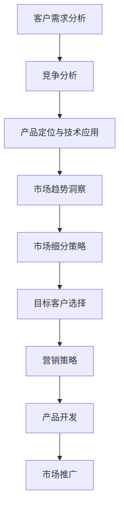

                 

# AI创业公司如何进行市场细分?

## 1. 背景介绍

### 1.1 问题由来
在人工智能(AI)的蓬勃发展下，AI创业公司如雨后春笋般涌现。然而，面对激烈的市场竞争，不少初创公司感到迷茫，不知道如何定位自身产品，寻找合适的市场细分方向。市场细分不仅是AI创业公司的必经之路，也是其成功的关键所在。通过市场细分，公司可以明确目标客户群、产品定位和竞争策略，提高市场竞争力。

### 1.2 问题核心关键点
市场细分需要考虑到客户需求、产品功能、技术能力、竞争对手、市场趋势等多方面因素。在本文中，我们将从以下几个方面探讨如何进行有效的市场细分：

1. **客户需求分析**：了解目标客户的需求、痛点以及潜在需求。
2. **竞争分析**：识别竞争对手的优势与不足，找出市场空白点。
3. **产品定位与技术应用**：明确产品定位，结合技术优势进行产品设计和功能开发。
4. **市场趋势洞察**：跟踪市场动态，把握行业趋势，预测未来发展方向。

### 1.3 问题研究意义
进行市场细分对于AI创业公司具有重要意义：

1. **精准定位**：帮助公司识别出最有价值的客户群体，实现资源的最优配置。
2. **差异化竞争**：找到市场中的差异点，构建独特的竞争优势。
3. **提升市场份额**：通过市场细分，可以有效提高市场渗透率，扩大市场份额。
4. **持续创新**：细分的市场可以为公司提供持续创新的动力和方向。

## 2. 核心概念与联系

### 2.1 核心概念概述

市场细分是市场营销学中一个核心概念，指将一个大的市场划分为多个具有相似需求特征的子市场，以便更精准地定位目标客户，提供更符合其需求的定制化产品或服务。在AI创业公司中，市场细分不仅包括传统营销学中的地理、人口、心理和行为细分，还涉及技术、应用场景和功能等多种维度的细分。

### 2.2 核心概念原理和架构的 Mermaid 流程图


这个流程图展示了市场细分的主要步骤：

1. **客户需求分析**：通过市场调研、用户访谈等方式了解客户需求。
2. **竞争分析**：评估竞争对手的产品、定价和市场表现。
3. **产品定位与技术应用**：结合市场分析结果，确定产品定位，开发关键技术功能。
4. **市场趋势洞察**：关注市场趋势和技术发展，预测未来需求。
5. **市场细分策略**：基于上述分析，制定详细的市场细分策略。
6. **目标客户选择**：根据市场细分策略，选择最有潜力的目标客户群。
7. **营销策略**：制定针对目标客户的营销策略。
8. **产品开发**：根据营销策略，开发满足目标客户需求的产品。
9. **市场推广**：实施市场推广计划，将产品推向目标市场。

## 3. 核心算法原理 & 具体操作步骤
### 3.1 算法原理概述

AI创业公司进行市场细分的算法原理主要基于以下几个步骤：

1. **数据收集**：通过市场调研、问卷调查、用户访谈等方式收集客户数据。
2. **数据处理**：对收集到的数据进行清洗、分类和分析，提取关键信息。
3. **模型构建**：利用机器学习或统计学方法，建立客户分群模型。
4. **细分策略制定**：基于模型结果，制定市场细分策略。
5. **市场验证**：通过小规模测试，验证市场细分策略的有效性。
6. **调整优化**：根据测试结果，调整和优化市场细分策略。

### 3.2 算法步骤详解

以下是详细的市场细分步骤：

1. **确定细分标准**：根据公司资源和市场特点，确定细分标准。例如，基于地理位置、年龄、性别、职业、消费习惯等。

2. **数据收集与清洗**：通过在线调查、社交媒体分析、销售数据记录等方式，收集目标客户的详细数据。清洗数据以去除噪音和异常值。

3. **特征提取**：从清洗后的数据中提取有意义的特征，如客户偏好、购买行为、收入水平等。

4. **模型训练**：使用聚类算法（如K-means、层次聚类、DBSCAN等）或分类算法（如决策树、随机森林、支持向量机等）训练客户分群模型。

5. **细分验证**：将训练得到的模型应用到小规模测试数据上，验证其准确性和有效性。

6. **细分策略制定**：根据细分结果，制定相应的市场细分策略。例如，针对不同客户群体，开发不同的产品功能和营销方案。

7. **测试与调整**：在小规模市场中进行测试，收集客户反馈，根据反馈调整市场细分策略。

### 3.3 算法优缺点

市场细分算法的主要优点包括：

1. **精准定位**：通过数据驱动的方式，能够精准识别目标客户，实现资源的最优配置。
2. **差异化竞争**：基于细分结果，公司可以设计出差异化的产品，构建独特的竞争优势。
3. **提升市场份额**：通过市场细分，公司可以更有效地满足目标客户需求，提升市场渗透率。

然而，市场细分也存在以下缺点：

1. **高成本**：数据收集和分析需要大量的时间和资源投入。
2. **数据隐私**：在收集客户数据时，需考虑数据隐私和法律法规的约束。
3. **模型复杂性**：细分模型需要大量的数据和复杂算法支持，难以快速调整。
4. **动态市场**：市场环境和客户需求不断变化，需要持续调整和优化细分策略。

### 3.4 算法应用领域

市场细分算法在多个领域中得到广泛应用，例如：

1. **电子商务**：通过客户行为分析，将客户划分为高价值客户、中价值客户和低价值客户，提供定制化服务。
2. **金融服务**：根据客户的资产规模、风险偏好等特征，进行客户细分，提供个性化金融产品。
3. **健康医疗**：基于患者的病史、症状等数据，进行疾病分类和细分，提供精准的医疗服务。
4. **教育培训**：根据学生的学习行为、兴趣等数据，进行细分，提供个性化学习方案。

## 4. 数学模型和公式 & 详细讲解 & 举例说明

### 4.1 数学模型构建

在市场细分中，常用的数学模型包括聚类模型、分类模型等。以下以聚类模型为例，说明市场细分的数学模型构建过程。

设客户数据集为 $D=\{x_i\}_{i=1}^N$，其中 $x_i$ 为第 $i$ 个客户的特征向量。聚类模型的目标是将客户数据集划分为 $K$ 个类别 $C_k=\{x_{i_k}\}$，其中 $x_{i_k}$ 为属于第 $k$ 类的客户集合。聚类模型的目标函数为：

$$
\min_{C_k} \sum_{i_k \in C_k} \sum_{j \in D} d(x_i, x_j)^2
$$

其中 $d(x_i, x_j)$ 为两个客户之间的距离度量函数，如欧几里得距离。

### 4.2 公式推导过程

假设使用K-means算法进行聚类，其步骤如下：

1. 随机选择 $K$ 个初始聚类中心 $c_1, c_2, ..., c_K$。
2. 将每个客户分配到最近的聚类中心。
3. 更新聚类中心的坐标，计算每个聚类中所有客户的平均特征向量。
4. 重复步骤2和3，直至聚类中心不再变化或达到预设迭代次数。

### 4.3 案例分析与讲解

以某电子商务平台为例，进行市场细分。首先，通过问卷调查收集客户的购买行为、商品偏好、年龄、性别等数据。使用K-means算法进行聚类，得到4个客户群体：高价值客户、中价值客户、低价值客户、潜在客户。然后，针对不同客户群体，设计不同的营销策略和产品推荐方案。

## 5. 项目实践：代码实例和详细解释说明

### 5.1 开发环境搭建

以下是Python环境搭建步骤：

1. 安装Anaconda：
```bash
conda create -n market-segmentation python=3.8
conda activate market-segmentation
```

2. 安装相关库：
```bash
pip install pandas numpy scikit-learn matplotlib seaborn
```

3. 准备数据集：
```python
import pandas as pd

data = pd.read_csv('customer_data.csv')
# 示例数据集，包含客户的购买行为、年龄、性别等特征
```

### 5.2 源代码详细实现

以下是使用K-means算法进行市场细分的Python代码实现：

```python
from sklearn.cluster import KMeans
import matplotlib.pyplot as plt

# 数据预处理
X = data.drop(['id', 'customer_id'], axis=1)
X = pd.get_dummies(X, columns=['gender', 'age_group', 'country'], prefix_sep='_')

# 模型训练
kmeans = KMeans(n_clusters=4, random_state=0)
kmeans.fit(X)

# 聚类结果可视化
labels = kmeans.labels_
fig, ax = plt.subplots(figsize=(12, 8))
ax.scatter(X.iloc[:, 0], X.iloc[:, 1], c=labels, cmap='viridis')
ax.set_title('Customer Clustering')
ax.set_xlabel('特征1')
ax.set_ylabel('特征2')
plt.show()

# 根据聚类结果进行市场细分
segments = {
    0: '低价值客户',
    1: '中价值客户',
    2: '高价值客户',
    3: '潜在客户'
}
```

### 5.3 代码解读与分析

以下是代码的详细解读：

1. 数据预处理：使用Pandas库进行数据清洗和特征编码，将非数值型特征转换为数值型特征。
2. 模型训练：使用K-means算法进行聚类，得到4个客户群体。
3. 聚类结果可视化：使用Matplotlib库将聚类结果可视化，帮助理解聚类效果。
4. 市场细分：根据聚类结果，定义不同客户群体的细分标签。

## 6. 实际应用场景

### 6.1 智能客服系统

智能客服系统通过市场细分，能够更精准地识别出不同客户群体的需求，提供个性化的服务。例如，对于高价值客户，提供VIP客户服务，设置专属客服热线；对于潜在客户，通过营销活动引导其进行购买。

### 6.2 金融服务

金融服务公司通过市场细分，能够针对不同客户群体的风险承受能力和投资需求，提供个性化的金融产品和服务。例如，针对高净值客户，提供高收益的理财和投资产品；针对中低收入客户，提供基础储蓄和贷款服务。

### 6.3 健康医疗

健康医疗公司通过市场细分，能够针对不同疾病类型和患者需求，提供精准的医疗服务。例如，针对癌症患者，提供个性化治疗方案和心理支持；针对慢性病患者，提供长期健康管理和康复服务。

### 6.4 未来应用展望

未来，市场细分将结合更多新兴技术和方法，进一步提升AI创业公司的市场竞争力。例如：

1. **大数据分析**：利用大数据技术，分析更多的客户数据，进行更深入的客户细分。
2. **人工智能算法**：结合深度学习、强化学习等先进算法，提高客户分群的准确性和细分的粒度。
3. **实时动态调整**：根据市场动态和客户反馈，实时调整市场细分策略，确保策略的有效性。
4. **跨领域应用**：将市场细分应用于更多行业领域，如零售、教育、政府服务等，实现跨领域的应用和推广。

## 7. 工具和资源推荐

### 7.1 学习资源推荐

1. 《市场营销学》（菲利普·科特勒）：市场营销学的经典教材，详细介绍了市场细分的理论和实践。
2. Coursera《数据科学专业》课程：涵盖数据科学的基础知识，包括数据预处理、机器学习等。
3. Udacity《人工智能基础》课程：介绍人工智能的基础概念和算法，帮助理解市场细分的技术实现。
4. Kaggle：提供丰富的数据集和竞赛，练习市场细分算法。

### 7.2 开发工具推荐

1. Python：广泛使用的数据科学和机器学习语言，支持丰富的库和工具。
2. Jupyter Notebook：交互式的数据分析和编程工具，适合快速原型开发和实验验证。
3. Matplotlib、Seaborn：数据可视化库，帮助理解和展示市场细分结果。
4. Pandas、NumPy：数据处理和分析库，提供高效的数据处理能力。
5. Scikit-learn：机器学习库，支持聚类、分类等多种模型算法。

### 7.3 相关论文推荐

1. "Customer Segmentation using K-means Clustering"：介绍使用K-means算法进行客户分群的经典方法。
2. "An Introduction to Customer Segmentation"：详细介绍了客户分群的理论基础和实践方法。
3. "Deep Learning for Customer Segmentation"：介绍使用深度学习模型进行客户分群的最新方法。

## 8. 总结：未来发展趋势与挑战

### 8.1 总结

本文详细介绍了AI创业公司如何进行市场细分的步骤和方法。通过市场细分，公司可以更精准地识别目标客户，设计符合客户需求的个性化产品和服务，从而提高市场竞争力。本文结合实际案例，深入讲解了市场细分的算法原理和操作步骤，并通过代码实例进行了详细说明。

### 8.2 未来发展趋势

未来市场细分技术的发展趋势包括：

1. **数据驱动**：更多利用大数据和人工智能技术，实现精准的客户细分。
2. **个性化服务**：结合客户行为数据，提供更加个性化的服务和产品。
3. **实时动态调整**：根据市场动态和客户反馈，实时调整细分策略，保持策略的有效性。
4. **跨领域应用**：将市场细分应用于更多行业领域，实现跨领域的应用和推广。

### 8.3 面临的挑战

市场细分技术在应用过程中面临的挑战包括：

1. **数据获取难度**：获取高质量、全面的客户数据具有挑战性。
2. **模型复杂性**：市场细分模型需要复杂的算法和技术支持，实现难度较大。
3. **动态市场环境**：市场环境和技术趋势不断变化，需要持续调整和优化细分策略。
4. **隐私保护**：在收集和处理客户数据时，需注意数据隐私和法律法规的约束。

### 8.4 研究展望

未来市场细分技术的研究方向包括：

1. **大数据分析**：结合大数据技术，提高数据处理和分析能力。
2. **人工智能算法**：探索新的算法和技术，提高市场细分的准确性和效率。
3. **实时动态调整**：开发实时调整和优化策略的方法，保持细分策略的有效性。
4. **跨领域应用**：将市场细分应用于更多行业领域，实现跨领域的应用和推广。

## 9. 附录：常见问题与解答

**Q1: 市场细分的主要步骤有哪些？**

A: 市场细分的主要步骤包括：

1. 确定细分标准：根据公司资源和市场特点，确定细分标准。
2. 数据收集与清洗：通过在线调查、社交媒体分析、销售数据记录等方式，收集目标客户的详细数据。
3. 特征提取：从清洗后的数据中提取有意义的特征，如客户偏好、购买行为、收入水平等。
4. 模型训练：使用聚类算法或分类算法训练客户分群模型。
5. 细分策略制定：根据模型结果，制定相应的市场细分策略。
6. 测试与调整：在小规模市场中进行测试，收集客户反馈，根据反馈调整市场细分策略。

**Q2: 如何进行数据预处理？**

A: 数据预处理的主要步骤包括：

1. 数据清洗：去除噪音和异常值，确保数据质量。
2. 特征编码：将非数值型特征转换为数值型特征，如使用独热编码将分类特征转换为数值型特征。
3. 数据标准化：对数据进行标准化处理，如将特征缩放到[0, 1]范围内。
4. 特征选择：选择有意义的特征，去除冗余和无关特征，提高模型的效率和准确性。

**Q3: 市场细分中的聚类算法有哪些？**

A: 常见的聚类算法包括：

1. K-means：基于欧几里得距离的聚类算法，适用于处理大规模数据。
2. 层次聚类：基于相似度的聚类算法，能够处理不同规模的数据。
3. DBSCAN：基于密度的聚类算法，能够识别任意形状的簇。
4. 均值聚类：基于特征均值的聚类算法，适用于处理高维数据。

**Q4: 如何进行市场细分策略的调整与优化？**

A: 市场细分策略的调整与优化主要步骤包括：

1. 收集客户反馈：通过问卷调查、用户访谈等方式收集客户反馈。
2. 数据分析：分析反馈数据，找出市场细分策略中的问题和不足。
3. 策略调整：根据分析结果，调整和优化市场细分策略。
4. 测试与验证：在小规模市场中进行测试，验证调整后的策略效果。
5. 持续优化：根据测试结果，持续优化市场细分策略，保持策略的有效性。

---

作者：禅与计算机程序设计艺术 / Zen and the Art of Computer Programming

