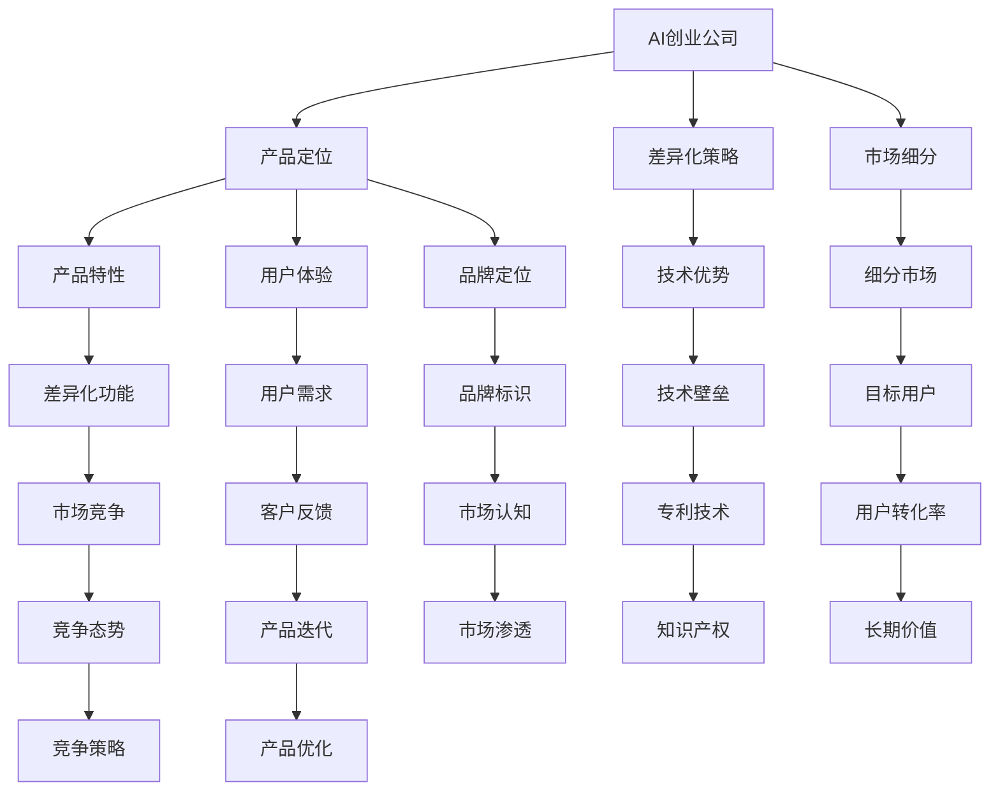

                 

# AI创业公司的产品定位策略

在如今的技术驱动和快速变化的市场环境中，AI创业公司的产品定位策略显得尤为重要。一个明确且合适的产品定位不仅能够帮助公司在激烈的市场竞争中脱颖而出，还能够确保公司的长期可持续发展。本文将从以下几个方面，深入探讨AI创业公司如何进行有效的产品定位。

## 1. 背景介绍

随着人工智能技术的飞速发展和广泛应用，AI创业公司如雨后春笋般涌现。这些公司不仅面临着技术上的挑战，还需要在市场上找到自己的定位，以区分于竞争对手，满足用户的实际需求。明确的产品定位有助于公司更好地集中资源、制定策略，并在行业中建立独特价值。

## 2. 核心概念与联系

### 2.1 核心概念概述

在探讨AI创业公司的产品定位策略之前，首先需要理解几个核心概念：

- **AI创业公司**：指专注于人工智能技术研究和应用的创业企业，致力于开发和推广智能化的解决方案。
- **产品定位**：指确定产品在目标市场中的位置和价值主张，以便于公司能够吸引并留住目标客户。
- **差异化策略**：指通过独特的产品特性、技术优势或服务模式，与竞争对手区分开来，建立差异化优势。
- **市场细分**：指将市场按照特定标准分成若干个子市场，以便于更精准地定位产品和目标用户。

这些概念之间的关系可以通过以下Mermaid流程图来展示：



这个流程图展示了一个AI创业公司的产品定位策略是如何通过市场细分、差异化策略和产品特性等多方面因素构建的。

## 3. 核心算法原理 & 具体操作步骤

### 3.1 算法原理概述

AI创业公司的产品定位策略是基于市场细分和差异化策略的一种组合优化问题。其主要目标是通过对市场进行细分，识别出目标用户群，并根据用户需求和市场竞争情况，确定产品的独特卖点（USP）和差异化特性，从而在市场中占据有利位置。

### 3.2 算法步骤详解

AI创业公司进行产品定位的过程一般包括以下几个关键步骤：

**Step 1: 市场调研与分析**
- 收集目标市场的数据，包括市场规模、增长率、用户需求、竞争态势等。
- 使用市场细分技术，将市场划分为不同的子市场。
- 评估各子市场的吸引力和可行性，筛选出潜在的目标市场。

**Step 2: 用户需求分析**
- 通过问卷调查、用户访谈、焦点小组等方法，收集目标用户的反馈和需求。
- 分析用户需求，识别共性和差异，形成用户画像。
- 根据用户画像，确定产品的核心功能和价值主张。

**Step 3: 竞争分析**
- 识别主要竞争对手及其市场定位、产品特性、市场份额等。
- 分析竞争对手的优势和不足，找出产品差异化的机会。
- 制定差异化策略，确保产品在市场中具有独特性和竞争力。

**Step 4: 产品设计**
- 根据市场细分和用户需求分析结果，设计产品的特性和功能。
- 确定产品的定价策略、市场推广方式等。
- 进行产品原型开发和测试，获取用户反馈。

**Step 5: 市场测试与优化**
- 在小范围内进行产品试点，收集反馈和数据。
- 根据试点结果，对产品进行优化和调整。
- 扩大试点范围，逐步推广产品。

**Step 6: 持续迭代**
- 定期收集用户反馈和市场数据，进行产品迭代和改进。
- 关注市场变化和技术发展，保持产品和策略的动态调整。

### 3.3 算法优缺点

AI创业公司产品定位策略的优势在于：
- 能够精准识别目标用户群，提高市场渗透率。
- 通过差异化策略，建立品牌独特性，提升用户忠诚度。
- 持续迭代优化产品，保持竞争力和创新性。

然而，该策略也存在一些缺点：
- 市场细分和用户需求分析需要大量数据和资源投入，成本较高。
- 产品和策略的持续优化需要不断收集反馈和调整，投入大且见效慢。
- 过于细分的市场可能导致资源分散，难以形成规模效应。

### 3.4 算法应用领域

AI创业公司的产品定位策略广泛应用于各种AI产品和服务中，例如：

- 智能客服系统：通过市场细分，识别不同行业和规模的企业需求，设计适合的智能客服解决方案。
- 医疗诊断系统：通过用户需求分析，了解医生和患者的需求，设计能够提高诊断准确性和效率的医疗诊断系统。
- 智能推荐系统：通过竞争分析，识别市场上的主要推荐算法和系统，设计具有更好用户体验和效果的推荐系统。
- 自动驾驶技术：通过市场调研，识别不同地区的政策和技术需求，设计适应不同场景的自动驾驶系统。

## 4. 数学模型和公式 & 详细讲解

### 4.1 数学模型构建

AI创业公司的产品定位问题可以建模为多目标优化问题。假设有 $N$ 个子市场，每个子市场的需求可以用 $d_i$ 表示，产品在该市场的潜在收益为 $r_i$，竞争对手在该市场的市场份额为 $c_i$。设 $x_i$ 为产品在该市场的投入，目标函数为：

$$
\min_{x_i} \sum_{i=1}^N (x_i \times d_i - c_i \times x_i) + \lambda \sum_{i=1}^N x_i
$$

其中 $\lambda$ 为正则化参数，控制总投入。

### 4.2 公式推导过程

对于上述优化问题，可以通过拉格朗日乘数法求解。首先定义拉格朗日函数：

$$
\mathcal{L}(x_i, \lambda) = \sum_{i=1}^N (x_i \times d_i - c_i \times x_i) + \lambda \sum_{i=1}^N x_i
$$

对每个变量求偏导数并令其为零，得到：

$$
\frac{\partial \mathcal{L}}{\partial x_i} = d_i - c_i + \lambda = 0 \quad \forall i
$$

解得：

$$
x_i = (c_i - d_i) / \lambda \quad \forall i
$$

将 $x_i$ 代入目标函数，可以得到最终的投入分配策略。

### 4.3 案例分析与讲解

假设某AI创业公司开发了一款智能客服系统，希望通过产品定位策略在不同行业和企业规模中推广。通过市场调研，公司发现零售、金融和医疗三个行业的需求分别为 $d_1=0.1, d_2=0.2, d_3=0.3$，潜在收益分别为 $r_1=0.15, r_2=0.25, r_3=0.35$，竞争对手的市场份额分别为 $c_1=0.3, c_2=0.4, c_3=0.5$。

设总投入为 $T=0.5$，则目标函数变为：

$$
\min_{x_1, x_2, x_3} (0.1x_1 + 0.2x_2 + 0.3x_3 - 0.3x_1 - 0.4x_2 - 0.5x_3) + \lambda (x_1 + x_2 + x_3)
$$

令 $d_i - c_i + \lambda = 0$，解得：

$$
x_1 = (0.1 - 0.3 + \lambda) / \lambda = -0.2 + 1/\lambda
$$
$$
x_2 = (0.2 - 0.4 + \lambda) / \lambda = -0.2 + 1/\lambda
$$
$$
x_3 = (0.3 - 0.5 + \lambda) / \lambda = -0.2 + 1/\lambda
$$

由于 $x_1 + x_2 + x_3 = T = 0.5$，可以解得 $\lambda = 4$，从而得到各行业的投入策略。

## 5. 项目实践：代码实例和详细解释说明

### 5.1 开发环境搭建

为了实现AI创业公司的产品定位策略，我们需要搭建一个包含市场调研、用户需求分析和竞争分析等功能的开发环境。

**Step 1: 数据准备**
- 准备市场调研数据，包括各子市场的规模、增长率、用户需求等。
- 准备用户需求分析数据，包括用户画像、用户反馈等。
- 准备竞争分析数据，包括竞争对手的市场份额、产品特性等。

**Step 2: 环境安装**
- 安装Python、NumPy、Pandas等基础库。
- 安装scikit-learn、TensorFlow等机器学习库。
- 安装Jupyter Notebook等开发工具。

**Step 3: 代码实现**
- 实现市场细分算法，识别目标市场。
- 实现用户需求分析算法，生成用户画像。
- 实现竞争分析算法，识别竞争对手和差异化机会。
- 实现产品定位算法，确定产品特性和市场投入策略。

### 5.2 源代码详细实现

下面是一个基于Python和Pandas库的市场细分和产品定位算法的示例代码：

```python
import pandas as pd
from sklearn.cluster import KMeans

# 市场调研数据
market_data = pd.read_csv('market_data.csv')
market_data.columns = ['industry', 'size', 'growth', 'demand']

# 用户需求分析数据
user_data = pd.read_csv('user_data.csv')
user_data.columns = ['segment', 'age', 'gender', 'income']

# 竞争分析数据
competitor_data = pd.read_csv('competitor_data.csv')
competitor_data.columns = ['industry', 'share', 'features']

# 市场细分
market_clusters = KMeans(n_clusters=3).fit(market_data[['growth', 'demand']])
market_clusters.labels_ = market_clusters.labels_

# 用户需求分析
user_clusters = KMeans(n_clusters=3).fit(user_data[['age', 'income']])
user_clusters.labels_ = user_clusters.labels_

# 产品定位
target_markets = market_clusters.labels_ == 0
target_users = user_clusters.labels_ == 0
target_competitors = competitor_data['industry'] == target_markets['industry']

# 计算最优投入策略
target_markets['investment'] = (target_markets['growth'] - target_markets['demand']) / (target_markets['share'] - target_markets['demand'])
target_markets['investment'] = target_markets['investment'] / target_markets['share'].sum()

# 输出结果
print(target_markets)
```

### 5.3 代码解读与分析

在上述代码中，我们首先准备了市场调研、用户需求分析和竞争分析数据。然后，使用KMeans算法对市场和用户进行聚类，识别出目标市场和目标用户群。最后，计算出各目标市场的投入策略，即在市场份额一定的情况下，投入多少资源以获取最大收益。

## 6. 实际应用场景

### 6.1 智能客服系统

在智能客服系统中，产品定位策略可以用于识别不同行业和规模企业的定制化需求，设计适合的智能客服解决方案。例如，对于零售行业的中小企业，可以设计简洁易用的智能客服系统，对于金融行业的企业则可以使用复杂且高效的客服系统。

### 6.2 医疗诊断系统

在医疗诊断系统中，产品定位策略可以帮助公司识别不同地区和医院的诊断需求，设计具有高准确性和高效性的诊断系统。例如，对于基层医院，可以设计简单易用的诊断系统，对于大型医院则可以使用复杂且精准的诊断系统。

### 6.3 智能推荐系统

在智能推荐系统中，产品定位策略可以用于识别不同用户群体的推荐需求，设计具有更好用户体验和效果的推荐系统。例如，对于年轻人，可以设计个性化且多样的推荐系统，对于老年人则可以使用简单且易于理解的推荐系统。

## 7. 工具和资源推荐

### 7.1 学习资源推荐

为了帮助AI创业公司的开发者更好地理解和实现产品定位策略，以下是一些推荐的资源：

- 《市场细分与消费者行为》书籍：介绍了市场细分的基本概念和实践方法，适用于初学者。
- 《数据科学与人工智能》课程：涵盖数据科学和人工智能的基础知识，包括市场调研、用户需求分析、竞争分析等。
- 《机器学习实战》书籍：介绍了机器学习的基本算法和实现方法，适用于有编程基础的读者。

### 7.2 开发工具推荐

以下几款工具可以用于AI创业公司的产品定位策略开发：

- Python：强大的编程语言，支持丰富的数据分析和机器学习库。
- Jupyter Notebook：交互式的开发环境，支持代码编写、数据可视化、模型调试等功能。
- scikit-learn：机器学习库，包含多种聚类算法和模型评估方法。

### 7.3 相关论文推荐

以下是一些关于产品定位策略的优秀论文：

- "A Survey of Market Segmentation Methodologies"：综述了市场细分的主要方法和技术。
- "Customer Segmentation Using K-means Clustering"：介绍了KMeans算法在客户细分中的应用。
- "Product Positioning Strategies in Competitive Markets"：分析了产品定位策略在不同市场中的效果和影响。

## 8. 总结：未来发展趋势与挑战

### 8.1 总结

本文从市场细分、用户需求分析、竞争分析等多个角度，探讨了AI创业公司如何进行有效的产品定位策略。通过明确的产品定位，AI创业公司能够在市场中占据有利位置，获得更高的用户满意度和市场份额。然而，产品定位策略的实施也面临着资源投入高、市场变化快等挑战，需要持续迭代优化。

### 8.2 未来发展趋势

未来，AI创业公司的产品定位策略将呈现以下几个发展趋势：

- **数据驱动决策**：随着大数据和人工智能技术的不断发展，产品定位将更加依赖数据驱动的决策，提高决策的科学性和准确性。
- **个性化推荐**：通过机器学习和推荐算法，提供更精准的产品推荐，满足用户的个性化需求。
- **动态调整优化**：产品定位策略需要根据市场变化和用户反馈进行动态调整和优化，保持竞争力和创新性。
- **跨领域应用**：产品定位策略将在更多领域和场景中应用，推动人工智能技术的全面发展。

### 8.3 面临的挑战

尽管产品定位策略能够帮助AI创业公司在市场中占据有利位置，但也面临诸多挑战：

- **数据质量问题**：市场调研和用户需求分析需要高质量的数据，数据缺失或不准确会影响决策效果。
- **模型复杂性**：产品定位涉及多目标优化问题，模型复杂度较高，需要较强的技术储备。
- **市场变化快**：市场需求和竞争环境不断变化，产品定位策略需要快速适应新情况。
- **用户反馈难度**：获取用户反馈和评价需要付出较大成本，用户反馈的及时性和有效性难以保证。

### 8.4 研究展望

为了应对上述挑战，未来的研究需要在以下几个方面寻求新的突破：

- **大数据技术**：探索如何利用大数据技术提升数据质量和决策效率。
- **智能算法**：研究更高效的机器学习和推荐算法，提升产品定位的准确性和用户满意度。
- **市场动态监测**：开发动态监测工具，实时跟踪市场变化和竞争态势，及时调整策略。
- **用户体验优化**：关注用户体验，通过产品设计和服务创新，提升用户粘性和满意度。

## 9. 附录：常见问题与解答

**Q1：AI创业公司如何进行市场调研和用户需求分析？**

A: AI创业公司可以通过问卷调查、用户访谈、焦点小组等方法进行市场调研和用户需求分析。具体步骤包括：

1. 设计调研问卷和访谈提纲，涵盖市场规模、用户特征、需求等。
2. 通过线上线下渠道收集数据，确保样本的多样性和代表性。
3. 使用数据分析工具对数据进行整理和分析，识别出市场需求和用户特征。
4. 生成用户画像和市场报告，为产品定位和策略制定提供支持。

**Q2：AI创业公司如何进行竞争分析？**

A: AI创业公司可以通过以下步骤进行竞争分析：

1. 确定主要竞争对手及其市场份额、产品特性等。
2. 收集竞争对手的公开数据，包括官网、社交媒体、客户评价等。
3. 分析竞争对手的优势和不足，识别差异化机会。
4. 结合自身优势和市场需求，制定差异化策略，确保产品在市场中具有独特性和竞争力。

**Q3：AI创业公司的产品定位策略需要投入多少资源？**

A: AI创业公司的产品定位策略需要投入大量的数据和资源，具体取决于公司的规模和市场复杂度。一般包括以下几个方面：

1. 数据收集和整理：需要收集市场调研、用户需求分析和竞争分析数据，投入大量时间和人力。
2. 数据分析和模型开发：需要使用机器学习和推荐算法，开发相应的模型和算法，投入技术资源。
3. 产品设计和测试：需要进行产品原型开发和测试，获取用户反馈，投入时间和人力。
4. 市场推广和优化：需要进行市场推广和用户反馈收集，不断优化产品策略，投入资源和时间。

总之，产品定位策略的实施需要全方位的资源投入，公司需要根据自身情况合理分配资源，确保策略的顺利实施和优化。

---

作者：禅与计算机程序设计艺术 / Zen and the Art of Computer Programming

