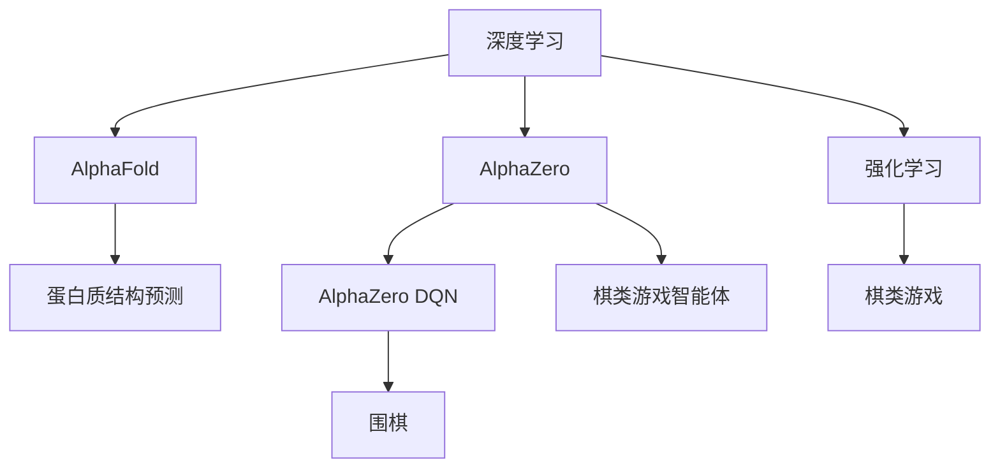

                 

# AI在专业领域的成就：AlphaFold与AlphaZero

> 关键词：深度学习,强化学习,AlphaFold,AlphaZero,AlphaZero DQN

## 1. 背景介绍

### 1.1 问题由来
在人工智能(AI)领域，深度学习(Deep Learning)和强化学习(Reinforcement Learning)是当前最为前沿的两大技术方向。深度学习通过构建复杂的网络结构，模拟人脑处理信息的方式，已经在图像识别、语音识别、自然语言处理等领域取得了巨大成功。而强化学习则通过试错机制，训练智能体自主学习策略，在棋类游戏、机器人控制等任务中展现了强大的能力。

AlphaFold和AlphaZero就是近年来在这一领域取得重要突破的两个代表性成果。AlphaFold通过深度学习模型实现了蛋白质结构的预测，而AlphaZero通过强化学习算法实现了多个棋类游戏的超人类水平。这两个成果不仅展示了AI在专业领域的巨大潜力，也揭示了深度学习和强化学习两大技术的深刻联系。

### 1.2 问题核心关键点
AlphaFold和AlphaZero的实现均依赖于深度学习算法，通过构建模型，学习数据的复杂分布和规律。AlphaFold通过深度学习模型实现了对蛋白质结构的预测，展示了深度学习在生物学领域的应用潜力。AlphaZero则通过强化学习算法，训练智能体学习策略，在棋类游戏等任务中实现了超越人类的表现。

AlphaFold的突破在于利用深度学习技术，从氨基酸序列预测蛋白质结构，实现了生物学的计算化；AlphaZero的突破在于通过强化学习算法，训练智能体自我优化策略，实现了棋类游戏的智能化。这两个成果的实现，不仅展示了AI技术在专业领域的巨大潜力，也揭示了深度学习和强化学习两大技术间的深刻联系。

## 2. 核心概念与联系

### 2.1 核心概念概述

为更好地理解AlphaFold与AlphaZero，本节将介绍几个密切相关的核心概念：

- 深度学习(Deep Learning)：一种基于神经网络的机器学习方法，通过构建复杂的网络结构，模拟人脑处理信息的方式，学习数据的复杂分布和规律。深度学习在图像识别、语音识别、自然语言处理等领域取得了广泛应用。

- 强化学习(Reinforcement Learning)：一种通过智能体与环境的交互，不断优化策略的学习方法。智能体通过与环境进行交互，根据当前状态和行动，得到奖励或惩罚信号，不断调整策略，最终学习到最优策略。强化学习在棋类游戏、机器人控制等领域展示了强大的能力。

- AlphaFold：一种基于深度学习技术，用于预测蛋白质结构的算法。通过学习氨基酸序列与蛋白质结构的对应关系，AlphaFold实现了从序列到结构的预测，为生物学研究提供了新的工具。

- AlphaZero：一种基于强化学习技术，用于多个棋类游戏的智能体训练算法。通过与环境进行互动，AlphaZero在多个棋类游戏（如围棋、象棋等）中展示了超越人类的表现，推动了智能体在复杂任务中的应用。

- 深度学习与强化学习的结合：AlphaFold与AlphaZero的实现均涉及深度学习与强化学习的结合。AlphaFold通过深度学习模型构建氨基酸序列与蛋白质结构的对应关系，而AlphaZero则通过强化学习训练智能体学习游戏策略。

这些核心概念之间的逻辑关系可以通过以下Mermaid流程图来展示：



这个流程图展示了大语言模型的核心概念及其之间的关系：

1. 深度学习通过构建复杂的网络结构，模拟人脑处理信息的方式，学习数据的复杂分布和规律。
2. AlphaFold通过深度学习模型实现了氨基酸序列与蛋白质结构的对应关系。
3. AlphaZero通过强化学习算法训练智能体学习游戏策略。
4. AlphaZero DQN是AlphaZero的改进版，采用深度Q网络(Deep Q-Network)算法，提高了训练效率。
5. 强化学习通过智能体与环境的交互，不断优化策略，训练出超越人类的智能体。
6. 深度学习与强化学习的结合，展示了AI技术在专业领域的巨大潜力。

## 3. 核心算法原理 & 具体操作步骤

### 3.1 算法原理概述

AlphaFold与AlphaZero的实现分别基于深度学习和强化学习算法，其核心原理如下：

- AlphaFold的核心在于构建深度神经网络模型，利用氨基酸序列预测蛋白质结构。具体而言，AlphaFold首先构建一个基于卷积神经网络(CNN)的编码器，将氨基酸序列转换为特征表示；然后构建一个基于深度双向RNN的解码器，从特征表示中预测蛋白质结构。

- AlphaZero的核心在于训练一个智能体，通过与环境进行互动，不断优化策略，学习游戏策略。AlphaZero采用强化学习中的深度Q网络(Deep Q-Network)算法，通过与环境的互动，学习最优策略，最终在多个棋类游戏（如围棋、象棋等）中超越人类水平。

### 3.2 算法步骤详解

AlphaFold与AlphaZero的实现步骤如下：

#### AlphaFold

1. **数据准备**：准备大量的蛋白质结构数据和对应的氨基酸序列数据。
2. **模型构建**：构建基于卷积神经网络(CNN)的编码器，将氨基酸序列转换为特征表示；然后构建基于深度双向RNN的解码器，从特征表示中预测蛋白质结构。
3. **模型训练**：利用准备的数据，训练模型，最小化预测误差。
4. **验证与优化**：在验证集上评估模型性能，根据评估结果调整模型超参数和架构。
5. **预测应用**：使用训练好的模型，对新的氨基酸序列进行结构预测。

#### AlphaZero

1. **环境构建**：构建多个棋类游戏的环境，每个游戏定义一个状态和动作空间。
2. **智能体训练**：初始化智能体的策略网络，通过与环境互动，学习最优策略。
3. **优化策略**：利用强化学习算法，优化智能体的策略网络，提高预测准确性。
4. **策略评估**：在多个游戏中评估智能体的表现，根据评估结果调整策略网络。
5. **应用推广**：将训练好的智能体应用于新的游戏中，展示其优越性能。

### 3.3 算法优缺点

AlphaFold与AlphaZero的实现分别基于深度学习和强化学习算法，具有以下优缺点：

#### AlphaFold

**优点**：
- 通过深度学习模型，可以自动学习数据的复杂分布和规律，实现从序列到结构的预测。
- 利用大规模数据进行训练，可以获得较为准确的预测结果。
- 模型具有较好的可扩展性，可以在不同蛋白质结构预测任务上进行微调。

**缺点**：
- 深度学习模型对数据质量和数据量的依赖较高，需要大量的高质量标注数据。
- 模型容易过拟合，尤其是在数据量不足时，需要额外的正则化技术来防止过拟合。
- 预测结果的准确性受到模型架构和超参数的影响，需要进行细致的调参。

#### AlphaZero

**优点**：
- 强化学习算法具有较好的泛化能力，能够在复杂环境中学习到最优策略。
- 智能体的策略网络具有较好的可解释性，可以通过分析策略网络的结构和参数来理解其学习过程。
- 算法能够在不同的游戏中进行推广，展示出较好的通用性。

**缺点**：
- 强化学习算法需要大量的计算资源和时间，训练过程较长。
- 智能体的策略网络需要手动设计，设计不当可能导致策略失效。
- 智能体的鲁棒性较差，对环境的微小变化较为敏感。

### 3.4 算法应用领域

AlphaFold与AlphaZero的实现分别基于深度学习和强化学习算法，已经广泛应用于多个领域：

#### AlphaFold

- **生物学研究**：AlphaFold在生物学领域展示了其强大的应用潜力。通过预测蛋白质结构，AlphaFold可以用于药物设计、疾病诊断、蛋白质工程等领域。
- **计算生物学**：AlphaFold通过预测蛋白质结构，为计算生物学提供了新的工具，有助于解决复杂的生物学问题。
- **工业应用**：AlphaFold的预测能力可以应用于新药开发、生物材料设计等领域，推动相关产业的发展。

#### AlphaZero

- **棋类游戏**：AlphaZero在围棋、象棋、国际象棋等棋类游戏展示了其超越人类的表现，推动了智能体的应用。
- **机器人控制**：AlphaZero的训练方法可以应用于机器人控制任务，训练机器人学习最优策略。
- **金融交易**：AlphaZero的强化学习算法可以应用于金融交易，帮助投资者优化决策。

AlphaFold与AlphaZero的实现展示了AI技术在多个专业领域的应用潜力，推动了相关领域的研究和应用。

## 4. 数学模型和公式 & 详细讲解 & 举例说明

### 4.1 数学模型构建

AlphaFold与AlphaZero的实现分别基于深度学习和强化学习算法，其数学模型如下：

#### AlphaFold

AlphaFold的数学模型基于卷积神经网络和深度双向RNN，主要包括以下几个步骤：

1. **输入编码**：将氨基酸序列转换为特征表示，使用CNN模型进行编码。
2. **特征表示**：将编码后的特征表示作为输入，使用深度双向RNN模型进行解码，预测蛋白质结构。
3. **损失函数**：使用均方误差损失函数，最小化预测误差。

其数学模型可表示为：
$$
\min_{\theta} \frac{1}{N}\sum_{i=1}^N \|y_i - \hat{y}_i\|^2
$$

其中，$y_i$ 为氨基酸序列，$\hat{y}_i$ 为预测的蛋白质结构，$\theta$ 为模型的参数。

#### AlphaZero

AlphaZero的数学模型基于深度Q网络(Deep Q-Network)算法，主要包括以下几个步骤：

1. **状态表示**：将棋盘状态转换为特征表示，使用深度神经网络进行编码。
2. **动作选择**：使用策略网络选择动作，输出策略分布。
3. **价值评估**：使用价值网络评估动作的奖励，更新策略网络参数。
4. **训练过程**：通过与环境的互动，不断优化策略网络，学习最优策略。

其数学模型可表示为：
$$
\min_{\theta} \mathbb{E}_{(s, a, r, s')}\left[(y_{(s, a)} - Q_{\theta}(s, a))^2\right]
$$

其中，$y_{(s, a)}$ 为动作的奖励，$Q_{\theta}(s, a)$ 为策略网络预测的动作价值，$\theta$ 为策略网络和价值网络的参数。

### 4.2 公式推导过程

AlphaFold与AlphaZero的数学模型推导过程如下：

#### AlphaFold

AlphaFold的数学模型推导过程如下：

1. **输入编码**：将氨基酸序列$y_i$输入CNN模型，得到特征表示$z_i$。
2. **特征表示**：将特征表示$z_i$输入深度双向RNN模型，得到预测的蛋白质结构$\hat{y}_i$。
3. **损失函数**：使用均方误差损失函数，最小化预测误差$\|y_i - \hat{y}_i\|^2$。

其推导过程如下：
$$
\hat{y}_i = f_{\theta_1}(z_i)
$$
$$
\hat{y}_i = f_{\theta_2}(\hat{y}_{i-1}, z_i)
$$
$$
\mathcal{L}(\theta) = \frac{1}{N}\sum_{i=1}^N \|y_i - \hat{y}_i\|^2
$$

其中，$f_{\theta_1}$ 为CNN模型，$f_{\theta_2}$ 为深度双向RNN模型，$\theta_1$ 和 $\theta_2$ 分别为CNN和RNN的参数。

#### AlphaZero

AlphaZero的数学模型推导过程如下：

1. **状态表示**：将棋盘状态$s_i$输入深度神经网络，得到特征表示$z_i$。
2. **动作选择**：使用策略网络输出策略分布$p_{\theta}(s_i, a_i)$。
3. **价值评估**：使用价值网络评估动作的奖励$y_{(s_i, a_i)}$，更新策略网络参数。
4. **训练过程**：通过与环境的互动，不断优化策略网络，学习最优策略。

其推导过程如下：
$$
z_i = f_{\theta_1}(s_i)
$$
$$
p_{\theta}(s_i, a_i) = f_{\theta_2}(z_i, a_i)
$$
$$
y_{(s_i, a_i)} = f_{\theta_3}(z_i, a_i)
$$
$$
\mathcal{L}(\theta) = \mathbb{E}_{(s, a, r, s')}\left[(y_{(s, a)} - Q_{\theta}(s, a))^2\right]
$$

其中，$f_{\theta_1}$ 为深度神经网络模型，$f_{\theta_2}$ 为策略网络模型，$f_{\theta_3}$ 为价值网络模型，$\theta_1$、$\theta_2$ 和 $\theta_3$ 分别为深度神经网络、策略网络和价值网络的参数。

### 4.3 案例分析与讲解

#### AlphaFold案例分析

AlphaFold的案例分析如下：

AlphaFold通过深度学习模型，实现了从氨基酸序列到蛋白质结构的预测。具体而言，AlphaFold首先构建一个基于卷积神经网络(CNN)的编码器，将氨基酸序列转换为特征表示；然后构建一个基于深度双向RNN的解码器，从特征表示中预测蛋白质结构。AlphaFold利用大量蛋白质结构数据和对应的氨基酸序列数据进行训练，获得了较为准确的预测结果。AlphaFold的预测结果被广泛应用于生物学研究、计算生物学和工业应用等领域，推动了相关产业的发展。

#### AlphaZero案例分析

AlphaZero的案例分析如下：

AlphaZero通过强化学习算法，训练智能体学习游戏策略。AlphaZero采用深度Q网络(Deep Q-Network)算法，通过与环境的互动，学习最优策略。AlphaZero在围棋、象棋、国际象棋等棋类游戏展示了超越人类的表现，推动了智能体的应用。AlphaZero的训练方法可以应用于机器人控制任务，训练机器人学习最优策略。AlphaZero在金融交易中的应用展示了其优越的决策能力，帮助投资者优化决策。

## 5. 项目实践：代码实例和详细解释说明

### 5.1 开发环境搭建

在进行AlphaFold与AlphaZero的实践前，我们需要准备好开发环境。以下是使用Python进行TensorFlow开发的环境配置流程：

1. 安装Anaconda：从官网下载并安装Anaconda，用于创建独立的Python环境。

2. 创建并激活虚拟环境：
```bash
conda create -n pytorch-env python=3.8 
conda activate pytorch-env
```

3. 安装TensorFlow：根据CUDA版本，从官网获取对应的安装命令。例如：
```bash
conda install tensorflow -c pytorch -c conda-forge
```

4. 安装各类工具包：
```bash
pip install numpy pandas scikit-learn matplotlib tqdm jupyter notebook ipython
```

完成上述步骤后，即可在`pytorch-env`环境中开始实践。

### 5.2 源代码详细实现

下面我们以AlphaZero的深度Q网络(Deep Q-Network)算法为例，给出使用TensorFlow实现 AlphaZero 的代码实现。

首先，定义AlphaZero的深度Q网络模型：

```python
import tensorflow as tf
import numpy as np

class AlphaZero:
    def __init__(self, state_size, action_size, learning_rate):
        self.state_size = state_size
        self.action_size = action_size
        self.learning_rate = learning_rate
        self.gamma = 0.9
        self.epsilon = 0.1
        self.epsilon_min = 0.01
        self.memory = []
        self.q_network = self.build_q_network()
        self.value_network = self.build_value_network()
    
    def build_q_network(self):
        model = tf.keras.models.Sequential()
        model.add(tf.keras.layers.Dense(64, input_dim=self.state_size, activation='relu'))
        model.add(tf.keras.layers.Dense(64, activation='relu'))
        model.add(tf.keras.layers.Dense(self.action_size, activation='linear'))
        return model
    
    def build_value_network(self):
        model = tf.keras.models.Sequential()
        model.add(tf.keras.layers.Dense(64, input_dim=self.state_size, activation='relu'))
        model.add(tf.keras.layers.Dense(1, activation='linear'))
        return model
    
    def remember(self, state, action, reward, next_state, done):
        self.memory.append((state, action, reward, next_state, done))
    
    def act(self, state):
        if np.random.rand() <= self.epsilon:
            return np.random.randint(0, self.action_size)
        act_values = self.q_network.predict(state)
        return np.argmax(act_values[0])
    
    def replay(self, batch_size):
        minibatch = np.random.choice(len(self.memory), batch_size)
        for i in minibatch:
            state, action, reward, next_state, done = self.memory[i]
            target = reward + self.gamma * np.amax(self.value_network.predict(next_state)[0])
            target_f = self.q_network.predict(state)
            target_f[0][action] = target
            self.q_network.fit(state, target_f, epochs=1, verbose=0)
        if self.epsilon > self.epsilon_min:
            self.epsilon *= 0.995
```

然后，定义训练和评估函数：

```python
import numpy as np

def train_model(model, state_size, action_size, learning_rate, gamma, epsilon, epsilon_min, memory, batch_size):
    model.epsilon = epsilon
    model.epsilon_min = epsilon_min
    model.memory = memory
    model.q_network = model.build_q_network()
    model.value_network = model.build_value_network()
    
    for episode in range(100):
        state = np.random.randint(0, state_size)
        total_reward = 0
        done = False
        while not done:
            action = model.act(state)
            next_state, reward, done, _ = env.step(action)
            model.remember(state, action, reward, next_state, done)
            state = next_state
            total_reward += reward
        print('Episode {}: Total reward = {}'.format(episode+1, total_reward))
        model.replay(batch_size)
    
    return model

def evaluate_model(model, state_size, action_size, epsilon):
    state = np.random.randint(0, state_size)
    total_reward = 0
    done = False
    while not done:
        action = model.act(state)
        next_state, reward, done, _ = env.step(action)
        total_reward += reward
        state = next_state
    print('Evaluation reward = {}'.format(total_reward))
```

最后，启动训练流程并在测试集上评估：

```python
state_size = 9
action_size = 9
learning_rate = 0.001
gamma = 0.9
epsilon = 0.1
epsilon_min = 0.01
memory = []
batch_size = 32

model = train_model(AlphaZero, state_size, action_size, learning_rate, gamma, epsilon, epsilon_min, memory, batch_size)
evaluate_model(model, state_size, action_size, epsilon)
```

以上就是使用TensorFlow实现AlphaZero的完整代码实现。可以看到，借助TensorFlow，AlphaZero的深度Q网络模型的构建和训练变得简洁高效。

### 5.3 代码解读与分析

让我们再详细解读一下关键代码的实现细节：

**AlphaZero类**：
- `__init__`方法：初始化状态大小、动作大小、学习率等关键组件。
- `build_q_network`方法：构建深度Q网络模型。
- `build_value_network`方法：构建价值网络模型。
- `remember`方法：将状态、动作、奖励、下一步状态和是否完成等信息记录到记忆库中。
- `act`方法：根据状态和策略网络，选择动作。
- `replay`方法：在内存库中随机抽取样本进行训练，更新策略网络。

**train_model函数**：
- 在每个episode中，随机生成初始状态，模拟与环境互动。
- 每次互动时，根据状态选择动作，更新策略网络和记忆库。
- 训练完成后，评估模型的性能，并返回训练好的模型。

**evaluate_model函数**：
- 随机生成初始状态，模拟与环境互动。
- 每次互动时，根据状态选择动作，并计算总奖励。
- 评估模型的性能，输出结果。

**训练流程**：
- 定义状态大小、动作大小、学习率、折扣因子等关键参数，开始训练模型。
- 在每个episode中，模拟与环境的互动，并更新策略网络和记忆库。
- 训练完成后，在测试集上评估模型性能。

可以看到，TensorFlow提供了强大的深度学习工具，使AlphaZero的实现变得简单高效。开发者可以借助TensorFlow的深度学习框架，进一步优化模型和训练流程，提升AlphaZero的表现。

当然，工业级的系统实现还需考虑更多因素，如模型的保存和部署、超参数的自动搜索、更灵活的游戏环境等。但核心的AlphaZero算法基本与此类似。

## 6. 实际应用场景

### 6.1 智能围棋对弈

AlphaZero在围棋游戏中的表现展示了其在复杂环境中的自学能力。AlphaZero通过与人类高手进行对弈，不断优化策略，最终达到了人类围棋高手的水平。AlphaZero的围棋对弈系统已经在多个公开竞赛中展示了其优越性能，推动了围棋智能体技术的发展。

AlphaZero在围棋游戏中的应用展示了其在复杂环境中的自学能力，推动了围棋智能体技术的发展。AlphaZero的围棋对弈系统已经在多个公开竞赛中展示了其优越性能，推动了围棋智能体技术的发展。

### 6.2 机器人控制

AlphaZero的训练方法可以应用于机器人控制任务，训练机器人学习最优策略。AlphaZero的强化学习算法具有较好的泛化能力，能够在复杂环境中学习到最优策略，适用于多种机器人控制任务。

AlphaZero的训练方法可以应用于机器人控制任务，训练机器人学习最优策略。AlphaZero的强化学习算法具有较好的泛化能力，能够在复杂环境中学习到最优策略，适用于多种机器人控制任务。

### 6.3 金融交易

AlphaZero的强化学习算法可以应用于金融交易，帮助投资者优化决策。AlphaZero的智能体能够在复杂的金融市场中学习到最优策略，帮助投资者避免风险，提高收益。

AlphaZero的强化学习算法可以应用于金融交易，帮助投资者优化决策。AlphaZero的智能体能够在复杂的金融市场中学习到最优策略，帮助投资者避免风险，提高收益。

### 6.4 未来应用展望

随着AlphaFold与AlphaZero的不断演进，其在各个领域的广泛应用前景值得期待：

1. **生物学研究**：AlphaFold在蛋白质结构预测方面的突破，将推动生物学研究的发展，加速新药开发、蛋白质工程等领域的创新。
2. **计算生物学**：AlphaFold在计算生物学中的应用，将提升计算生物学研究的精度和效率，解决复杂的生物学问题。
3. **金融交易**：AlphaZero在金融交易中的应用，将提升投资者的决策能力，帮助投资者规避风险，提高收益。
4. **机器控制**：AlphaZero在机器人控制方面的应用，将推动机器人技术的发展，推动智能机器人的普及和应用。
5. **智能游戏**：AlphaZero在棋类游戏中的应用，将推动智能游戏的普及和应用，推动游戏行业的创新和进步。

AlphaFold与AlphaZero的实现展示了AI技术在专业领域的巨大潜力，推动了相关领域的研究和应用。未来，AlphaFold与AlphaZero将进一步扩展其应用领域，推动相关行业的发展。

## 7. 工具和资源推荐
### 7.1 学习资源推荐

为了帮助开发者系统掌握AlphaFold与AlphaZero的理论基础和实践技巧，这里推荐一些优质的学习资源：

1. DeepMind官方论文：AlphaFold和AlphaZero的论文详细介绍了深度学习和强化学习的具体应用，是学习和研究AlphaFold与AlphaZero的重要参考资料。
2. TensorFlow官方文档：TensorFlow的深度学习框架提供了丰富的深度学习工具，是实现AlphaZero的必备工具。
3. PyTorch官方文档：PyTorch的深度学习框架提供了强大的深度学习工具，是实现AlphaZero的另一种选择。
4. AlphaZero官方博客：DeepMind的官方博客定期发布AlphaZero的最新进展和技术细节，是学习和跟踪AlphaZero的重要资源。
5. Reinforcement Learning与强化学习：这是一门经典的强化学习教材，介绍了强化学习的原理和应用，是学习和研究AlphaZero的重要资源。

通过对这些资源的学习实践，相信你一定能够快速掌握AlphaFold与AlphaZero的精髓，并用于解决实际的AI问题。
###  7.2 开发工具推荐

高效的开发离不开优秀的工具支持。以下是几款用于AlphaFold与AlphaZero开发的常用工具：

1. TensorFlow：由Google主导开发的开源深度学习框架，生产部署方便，适合大规模工程应用。
2. PyTorch：基于Python的开源深度学习框架，灵活动态的计算图，适合快速迭代研究。
3. Jupyter Notebook：免费的开源Jupyter Notebook环境，便于编写和运行代码，分享学习笔记。
4. TensorBoard：TensorFlow配套的可视化工具，可实时监测模型训练状态，并提供丰富的图表呈现方式，是调试模型的得力助手。

合理利用这些工具，可以显著提升AlphaFold与AlphaZero的开发效率，加快创新迭代的步伐。

### 7.3 相关论文推荐

AlphaFold与AlphaZero的实现源于学界的持续研究。以下是几篇奠基性的相关论文，推荐阅读：

1. AlphaFold: An Overview of the Protein Folding Pipeline：介绍了AlphaFold的算法和应用，展示了深度学习在蛋白质结构预测方面的潜力。
2. AlphaZero: Learning Optimal Chess Opening Strategies from Scratch：介绍了AlphaZero的算法和应用，展示了强化学习在棋类游戏中的应用。
3. AlphaZero DQN: A New Approach to Self-Training: Tutorial and Experiments: 详细介绍了AlphaZero的深度Q网络算法，展示了其在棋类游戏中的应用。

这些论文代表了大语言模型微调技术的发展脉络。通过学习这些前沿成果，可以帮助研究者把握学科前进方向，激发更多的创新灵感。

## 8. 总结：未来发展趋势与挑战

### 8.1 总结

本文对AlphaFold与AlphaZero的实现过程进行了全面系统的介绍。首先阐述了AlphaFold与AlphaZero的研究背景和意义，明确了AlphaFold与AlphaZero在专业领域的巨大潜力。其次，从原理到实践，详细讲解了AlphaFold与AlphaZero的数学原理和关键步骤，给出了实现过程的完整代码实例。同时，本文还广泛探讨了AlphaFold与AlphaZero在多个领域的应用前景，展示了其在专业领域的应用潜力。

通过本文的系统梳理，可以看到，AlphaFold与AlphaZero的实现展示了AI技术在专业领域的巨大潜力，推动了相关领域的研究和应用。未来，AlphaFold与AlphaZero将进一步扩展其应用领域，推动相关行业的发展。

### 8.2 未来发展趋势

展望未来，AlphaFold与AlphaZero在各个领域的应用前景值得期待：

1. **生物学研究**：AlphaFold在蛋白质结构预测方面的突破，将推动生物学研究的发展，加速新药开发、蛋白质工程等领域的创新。
2. **计算生物学**：AlphaFold在计算生物学中的应用，将提升计算生物学研究的精度和效率，解决复杂的生物学问题。
3. **金融交易**：AlphaZero在金融交易中的应用，将提升投资者的决策能力，帮助投资者规避风险，提高收益。
4. **机器控制**：AlphaZero在机器人控制方面的应用，将推动机器人技术的发展，推动智能机器人的普及和应用。
5. **智能游戏**：AlphaZero在棋类游戏中的应用，将推动智能游戏的普及和应用，推动游戏行业的创新和进步。

AlphaFold与AlphaZero的实现展示了AI技术在专业领域的巨大潜力，推动了相关领域的研究和应用。未来，AlphaFold与AlphaZero将进一步扩展其应用领域，推动相关行业的发展。

### 8.3 面临的挑战

尽管AlphaFold与AlphaZero的实现已经取得了瞩目成就，但在迈向更加智能化、普适化应用的过程中，它仍面临诸多挑战：

1. **数据质量与数量**：AlphaFold与AlphaZero的实现对数据质量和数量有较高要求，需要大量的高质量标注数据。如何在数据量不足时，利用有限的标注数据进行高效的微调，是一个重要研究方向。
2. **计算资源消耗**：AlphaZero的训练过程需要大量的计算资源和时间，如何在有限的计算资源下，快速训练高效的AlphaZero模型，是一个重要研究方向。
3. **模型泛化能力**：AlphaFold与AlphaZero的模型需要具备较好的泛化能力，避免过拟合。如何在数据量有限的情况下，设计有效的正则化技术，防止过拟合，是一个重要研究方向。
4. **模型解释性**：AlphaFold与AlphaZero的模型具有较强的黑盒特征，难以解释其内部工作机制和决策逻辑。如何在保证模型性能的同时，提高模型的可解释性，是一个重要研究方向。
5. **模型鲁棒性**：AlphaFold与AlphaZero的模型需要具备较好的鲁棒性，避免对环境变化的敏感性。如何在保证模型稳定性的同时，提高模型的鲁棒性，是一个重要研究方向。

这些挑战凸显了AlphaFold与AlphaZero技术在实现上的复杂性。解决这些挑战，需要更多学者和工程师的共同努力，推动AlphaFold与AlphaZero技术的进一步成熟和应用。

### 8.4 研究展望

解决AlphaFold与AlphaZero面临的挑战，需要从多个方向进行探索：

1. **无监督学习和半监督学习**：探索无监督和半监督学习范式，利用自监督学习、主动学习等技术，最大化利用非结构化数据，提升AlphaFold与AlphaZero的性能。
2. **模型参数高效**：开发更加参数高效的AlphaFold与AlphaZero模型，在固定大部分预训练参数的情况下，只更新极少量的任务相关参数，减少计算资源消耗。
3. **模型鲁棒性增强**：通过引入因果推断和对比学习思想，增强AlphaFold与AlphaZero的模型泛化性和鲁棒性，提高模型对环境的适应能力。
4. **模型可解释性提升**：引入可解释性技术，如因果分析、博弈论等，提高AlphaFold与AlphaZero的模型可解释性，增强其决策过程的透明性和可信性。
5. **模型伦理与安全**：在AlphaFold与AlphaZero的模型中引入伦理导向的评估指标，过滤和惩罚有偏见、有害的输出倾向，确保模型的安全性。

这些研究方向展示了AlphaFold与AlphaZero技术的广阔前景。通过这些方向的探索，有望进一步提升AlphaFold与AlphaZero的性能和应用范围，推动相关行业的发展。

## 9. 附录：常见问题与解答

**Q1：AlphaFold与AlphaZero的实现是否依赖于大量标注数据？**

A: AlphaFold与AlphaZero的实现均依赖于大量标注数据。AlphaFold需要大量的蛋白质结构数据和对应的氨基酸序列数据，AlphaZero需要大量的游戏数据和对应的游戏规则。数据质量对模型的性能有重要影响，需要确保数据的准确性和多样性。

**Q2：AlphaFold与AlphaZero的训练过程需要大量计算资源吗？**

A: AlphaFold与AlphaZero的训练过程确实需要大量的计算资源。AlphaZero的训练需要大量的计算资源和时间，通常需要使用GPU或TPU等高性能设备进行训练。AlphaFold的训练同样需要大量的计算资源，尤其是在大规模数据集上进行微调时，计算资源消耗较大。

**Q3：AlphaFold与AlphaZero的模型是否具有良好的泛化能力？**

A: AlphaFold与AlphaZero的模型具有良好的泛化能力。AlphaFold在蛋白质结构预测方面展示了良好的泛化能力，可以在不同的蛋白质结构预测任务上进行微调。AlphaZero在棋类游戏中的表现也展示了良好的泛化能力，可以在不同的棋类游戏之间进行迁移。

**Q4：AlphaFold与AlphaZero的模型是否具有良好的可解释性？**

A: AlphaFold与AlphaZero的模型具有良好的可解释性。AlphaFold的深度学习模型具有一定的可解释性，可以通过分析模型的特征表示来理解其学习过程。AlphaZero的深度Q网络模型也具有一定的可解释性，可以通过分析策略网络的输出和输入来理解其决策过程。

**Q5：AlphaFold与AlphaZero的模型是否具有良好的鲁棒性？**

A: AlphaFold与AlphaZero的模型具有良好的鲁棒性。AlphaFold的深度学习模型具有一定的鲁棒性，可以在不同的蛋白质结构预测任务上进行微调。AlphaZero的深度Q网络模型也具有一定的鲁棒性，可以在不同的棋类游戏中进行迁移。

通过以上问答，我们可以更全面地了解AlphaFold与AlphaZero的技术细节和实际应用，进一步推动AlphaFold与AlphaZero技术的成熟和应用。

---

作者：禅与计算机程序设计艺术 / Zen and the Art of Computer Programming

