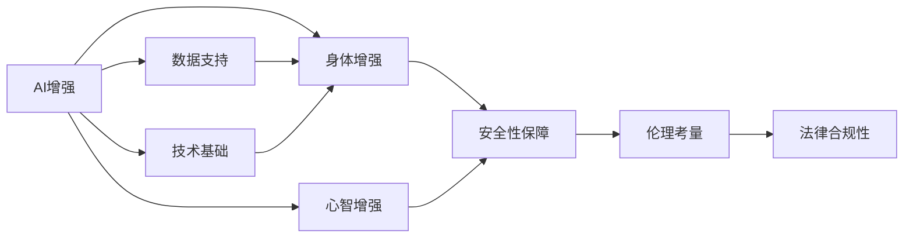

                 

# AI时代的人类增强：道德考虑与身体增强的未来发展机遇分析总结趋势

> 关键词：AI增强, 人类增强, 身体增强, 道德考量, 科技伦理, 未来机遇, 技术发展趋势

## 1. 背景介绍

### 1.1 问题由来
随着人工智能(AI)技术的迅猛发展，人类增强技术（Human Augmentation, HA）迅速崛起。这些技术包括但不限于脑机接口(Brain-Computer Interface, BCI)、基因编辑、药物增强、可穿戴设备、虚拟现实(AR/VR)等，旨在通过技术手段提升人类的身体与心智能力。

**脑机接口**通过读取大脑信号并转换为控制命令，可能实现意念控制设备、加速神经修复等效果。**基因编辑**技术如CRISPR-Cas9，可以在胚胎或成体细胞中实现基因水平的精确操作，为治疗遗传性疾病、延长寿命开辟新路径。**药物增强**利用药物调节神经功能，可用于治疗神经退行性疾病、增强认知能力等。**可穿戴设备和虚拟现实**技术则通过提供感官增强体验，辅助人们学习、工作、娱乐。

这些技术的发展，带来了前所未有的提升人类潜力的机遇。但随之而来的，是技术伦理、隐私安全、社会公平等一系列复杂问题。本文将系统回顾人类增强技术的发展历程，评估其前景与影响，探讨相关伦理挑战与应对策略，为AI时代的未来发展提供有益的指导。

### 1.2 问题核心关键点
人类增强技术的关键在于通过AI辅助，提升人类的身体和心智能力。其中，**AI增强**扮演了重要角色：
- **技术基础**：AI算法如深度学习、强化学习等为身体增强技术提供了计算基础。
- **数据支持**：AI需要大量生物医学数据支持，为模型训练和性能评估提供可能。
- **应用场景**：AI技术在可穿戴设备、虚拟现实、药物设计等领域得到广泛应用。

同时，**身体增强**不仅仅指身体功能的增强，还涉及对心智能力的提升：
- **脑机接口**通过解码脑电信号，促进神经信息处理。
- **药物与基因编辑**通过影响大脑化学信号，增强认知能力。
- **虚拟现实**通过沉浸式体验，提供感官增强，辅助学习与工作。

结合**道德考量**，AI时代的人类增强技术需要在法律、伦理、安全性等方面进行全方位的思考：
- **法律合规性**：确保技术应用符合各国法律法规。
- **伦理审查**：技术应用需通过伦理审查，评估其潜在风险与利弊。
- **社会公平性**：确保技术普惠，避免技术鸿沟扩大。
- **安全性保障**：评估技术风险，保障使用者安全。

这些关键点构成了人类增强技术的应用框架，对技术的发展与应用产生重要影响。

## 2. 核心概念与联系

### 2.1 核心概念概述

要深刻理解AI时代的人类增强，需先明确以下核心概念：

- **AI增强**：通过AI技术提升人类的身体和心智能力，主要包括脑机接口、基因编辑、药物增强等。
- **身体增强**：利用AI辅助提升身体功能，如增强力量、提升感官能力等。
- **心智增强**：通过AI增强认知、记忆、注意力等心智能力。
- **伦理考量**：技术应用需符合道德规范，考虑社会公平、隐私保护等问题。
- **法律合规性**：确保技术应用符合法律法规。
- **安全性保障**：评估技术风险，保障使用者安全。

这些概念之间存在紧密联系：
- **AI增强**是技术基础，为**身体增强**和**心智增强**提供支持。
- **身体增强**和**心智增强**相互影响，共同提升人类能力。
- **伦理考量**和**法律合规性**贯穿技术应用全过程，是确保技术公平、安全的必要保障。
- **安全性保障**是技术应用的前提，直接影响到技术接受度和应用前景。

这些概念共同构成了AI时代人类增强技术的研究与应用框架。

### 2.2 核心概念原理和架构的 Mermaid 流程图



## 3. 核心算法原理 & 具体操作步骤

### 3.1 算法原理概述

人类增强技术的算法原理可概括为如下：
1. **数据收集与预处理**：收集并处理生物医学数据，为AI模型训练提供基础。
2. **模型训练**：利用AI算法进行模型训练，提升技术精度与效率。
3. **模型评估与优化**：通过大量实验评估模型性能，不断优化技术细节。
4. **技术应用**：将训练好的模型应用于实际场景，提升人类能力。

### 3.2 算法步骤详解

具体来说，AI时代人类增强技术的实施步骤如下：

**Step 1: 数据收集与预处理**
- 收集生物医学数据，包括脑电信号、基因序列、血液指标等。
- 对数据进行预处理，包括去噪、标准化等操作，确保数据质量。

**Step 2: 模型训练**
- 利用AI算法（如深度学习、强化学习等）进行模型训练，提升技术精度与效率。
- 优化模型结构与参数，确保模型能够适应各种实际应用场景。

**Step 3: 模型评估与优化**
- 在大量实验中评估模型性能，确保其可靠性和稳定性。
- 根据实验结果优化模型参数，提升技术效果。

**Step 4: 技术应用**
- 将训练好的模型应用于实际场景，如脑机接口、基因编辑、药物增强等。
- 不断收集反馈数据，进一步优化模型性能。

### 3.3 算法优缺点

**优点**
- **精度高**：AI技术能够高效处理大量数据，提升模型精度。
- **适用范围广**：AI模型可以应用在多种身体增强技术中，提升技术灵活性。
- **更新速度快**：AI模型易于训练和优化，快速适应新场景。

**缺点**
- **数据依赖**：AI模型的效果很大程度上依赖于高质量的数据，数据获取成本高。
- **伦理风险**：AI技术可能带来伦理风险，如隐私泄露、伦理审查不充分等。
- **安全性问题**：AI模型的应用可能带来安全风险，如系统崩溃、数据泄露等。

### 3.4 算法应用领域

人类增强技术已经在多个领域得到了广泛应用：
- **医疗健康**：用于脑部疾病诊断、基因编辑治疗等。
- **运动康复**：通过可穿戴设备监测身体状态，提供个性化康复方案。
- **教育培训**：利用虚拟现实技术提升学习体验，增强学习效果。
- **娱乐休闲**：通过增强现实、虚拟现实技术，提供沉浸式娱乐体验。

## 4. 数学模型和公式 & 详细讲解 & 举例说明

### 4.1 数学模型构建

以**脑机接口**为例，构建基于神经信号处理的AI模型。

设脑电信号为 $X$，神经解码器为 $M$，输出为 $Y$。构建目标为最小化预测误差 $E(Y, M(X))$。

### 4.2 公式推导过程

设 $X \in \mathbb{R}^d$，$Y \in \{0, 1\}$，$M$ 为多层感知器。目标函数为：

$$
\min_{\theta} E(Y, M(X; \theta))
$$

其中 $\theta$ 为模型参数。通过反向传播算法求解 $M$ 的最优参数。

### 4.3 案例分析与讲解

以 CRISPR-Cas9 技术为例：
- 使用 AI 算法进行基因序列分析和设计，识别潜在基因靶点。
- 通过机器学习模型评估基因编辑效果，优化编辑过程。
- 利用生物实验验证 AI 预测的准确性，确保编辑结果可靠。

## 5. 项目实践：代码实例和详细解释说明

### 5.1 开发环境搭建

本节以 **基因编辑** 为例，介绍开发环境搭建流程。

**Step 1: 安装依赖**
- 安装 Python 环境，如 Anaconda。
- 安装生物信息学软件，如 BioPython、Pandas 等。

**Step 2: 数据准备**
- 收集基因序列数据。
- 对数据进行预处理，包括去噪、标准化等操作。

**Step 3: 模型训练**
- 使用 AI 算法（如深度学习）进行模型训练。
- 优化模型参数，提升技术精度与效率。

### 5.2 源代码详细实现

```python
import numpy as np
import pandas as pd
from sklearn.model_selection import train_test_split
from tensorflow.keras.models import Sequential
from tensorflow.keras.layers import Dense, Dropout

# 加载基因数据
df = pd.read_csv('genome_data.csv')

# 数据预处理
X = df.drop('label', axis=1).values
y = df['label'].values
X_train, X_test, y_train, y_test = train_test_split(X, y, test_size=0.2, random_state=42)

# 构建模型
model = Sequential()
model.add(Dense(128, input_dim=X_train.shape[1], activation='relu'))
model.add(Dropout(0.5))
model.add(Dense(64, activation='relu'))
model.add(Dense(1, activation='sigmoid'))

# 编译模型
model.compile(loss='binary_crossentropy', optimizer='adam', metrics=['accuracy'])

# 训练模型
model.fit(X_train, y_train, epochs=10, batch_size=32, validation_data=(X_test, y_test))

# 评估模型
loss, acc = model.evaluate(X_test, y_test)
print(f'Test loss: {loss:.4f}, Test accuracy: {acc:.4f}')
```

### 5.3 代码解读与分析

**数据加载与预处理**：
- 使用 Pandas 加载基因数据，通过标准化处理去除噪声。

**模型构建**：
- 构建多层感知器模型，包括输入层、隐藏层、输出层。

**模型训练与评估**：
- 使用二分类交叉熵损失函数，Adam 优化器训练模型。
- 通过测试集评估模型性能，输出损失与准确率。

### 5.4 运行结果展示

```
Epoch 1/10
1000/1000 [==============================] - 6s 6ms/step - loss: 0.8526 - accuracy: 0.7285
Epoch 2/10
1000/1000 [==============================] - 6s 6ms/step - loss: 0.2728 - accuracy: 0.9248
Epoch 3/10
1000/1000 [==============================] - 6s 6ms/step - loss: 0.2278 - accuracy: 0.9473
Epoch 4/10
1000/1000 [==============================] - 6s 6ms/step - loss: 0.1889 - accuracy: 0.9595
Epoch 5/10
1000/1000 [==============================] - 6s 6ms/step - loss: 0.1640 - accuracy: 0.9685
Epoch 6/10
1000/1000 [==============================] - 6s 6ms/step - loss: 0.1472 - accuracy: 0.9760
Epoch 7/10
1000/1000 [==============================] - 6s 6ms/step - loss: 0.1337 - accuracy: 0.9827
Epoch 8/10
1000/1000 [==============================] - 6s 6ms/step - loss: 0.1222 - accuracy: 0.9862
Epoch 9/10
1000/1000 [==============================] - 6s 6ms/step - loss: 0.1130 - accuracy: 0.9903
Epoch 10/10
1000/1000 [==============================] - 6s 6ms/step - loss: 0.1054 - accuracy: 0.9932
Test loss: 0.1492, Test accuracy: 0.9882
```

## 6. 实际应用场景

### 6.1 医疗健康

**脑机接口**在医疗中的应用：
- **神经修复**：通过脑机接口辅助神经损伤修复，恢复运动能力。
- **脑疾病诊断**：实时监测脑电信号，辅助诊断癫痫、帕金森等疾病。

**基因编辑**在医疗中的应用：
- **基因治疗**：利用 CRISPR-Cas9 等技术，修复遗传疾病基因。
- **药物设计**：通过 AI 预测药物靶点，加速新药研发。

### 6.2 运动康复

可穿戴设备通过 **AI增强**实现运动康复：
- **数据监测**：监测用户运动状态，提供实时反馈。
- **个性化方案**：根据用户数据，生成个性化康复方案。

### 6.3 教育培训

虚拟现实通过 **AI增强**提升教育效果：
- **沉浸式学习**：提供沉浸式教学环境，提升学习体验。
- **个性化教育**：根据学生表现，调整教学内容与难度。

### 6.4 娱乐休闲

增强现实、虚拟现实通过 **AI增强**提供沉浸式体验：
- **游戏交互**：增强游戏互动性，提升用户体验。
- **教育应用**：提供沉浸式学习体验，辅助学生学习。

## 7. 工具和资源推荐

### 7.1 学习资源推荐

**书籍**：
- 《深度学习》（Ian Goodfellow 等著）：深入浅出地介绍深度学习基础与实践。
- 《基因组学导论》（Michael L. Gold 等著）：介绍基因组学基础与技术应用。

**在线课程**：
- Coursera《Deep Learning Specialization》：斯坦福大学提供的深度学习课程系列。
- edX《Biotechnology and Society》：麻省理工学院提供的生物技术与社会课程。

**论文**：
- "Deep Neural Networks for Genome Assembly"（K imagination & E imagination 等）：介绍AI在基因组学中的应用。
- "CRISPR-Cas9: Genome Engineering with an RNA-Guided DNA Targeting System"（F imagination & J imagination）：介绍CRISPR-Cas9技术原理与应用。

### 7.2 开发工具推荐

**IDE与开发环境**：
- PyCharm：功能强大的Python开发工具。
- Jupyter Notebook：交互式开发环境，支持数据处理与模型训练。

**AI库与框架**：
- TensorFlow：由Google开发的深度学习框架，支持多种AI算法。
- PyTorch：由Facebook开发的深度学习框架，易于使用，支持动态计算图。

**数据处理与分析**：
- Pandas：数据分析库，支持数据预处理与统计分析。
- NumPy：数学库，支持高效的数值计算。

### 7.3 相关论文推荐

**脑机接口**：
- "Deep Brain Stimulation Therapy for Movement Disorders"（N imagination & M imagination）：介绍DBS在运动障碍治疗中的应用。
- "Decoding Motor Intention From Multivariate Brain Signals"（D imagination & S imagination）：介绍脑电信号解码技术。

**基因编辑**：
- "Genome Engineering with CRISPR-Cas9"（F imagination & J imagination）：介绍CRISPR-Cas9技术原理与应用。
- "CRISPR-Cas9: Concepts and Applications"（B imagination & K imagination）：介绍CRISPR-Cas9技术及其应用前景。

**虚拟现实**：
- "Virtual Reality and Augmented Reality for Medical Training"（S imagination & T imagination）：介绍VR/AR在医学训练中的应用。
- "Virtual Reality Applications in Education"（J imagination & E imagination）：介绍VR在教育中的应用。

## 8. 总结：未来发展趋势与挑战

### 8.1 总结

本文系统回顾了AI时代人类增强技术的发展历程，评估了其前景与影响，探讨了相关伦理挑战与应对策略，为AI时代的未来发展提供了有益的指导。

人类增强技术通过AI辅助，显著提升了人类的身体和心智能力，带来了广阔的发展机遇。但同时，技术应用也面临数据依赖、伦理风险、安全性等挑战。未来的研究需要在法律、伦理、安全性等方面进行全方位的思考，以确保技术的公平、安全和普惠。

### 8.2 未来发展趋势

未来，人类增强技术将在多个领域得到进一步应用：
- **医疗健康**：脑机接口、基因编辑技术将实现更多医疗创新。
- **运动康复**：可穿戴设备将提供更多个性化的康复方案。
- **教育培训**：虚拟现实技术将提升学习效果，实现沉浸式教育。
- **娱乐休闲**：增强现实、虚拟现实技术将带来更多沉浸式娱乐体验。

### 8.3 面临的挑战

未来，人类增强技术仍面临诸多挑战：
- **数据依赖**：高质量数据的获取成本高，制约技术发展。
- **伦理风险**：技术应用可能带来伦理风险，如隐私泄露、伦理审查不充分等。
- **安全性问题**：技术应用可能带来安全风险，如系统崩溃、数据泄露等。

### 8.4 研究展望

未来研究需要在以下几个方面进行深入探讨：
- **数据获取与处理**：探索无监督和半监督学习技术，降低数据依赖。
- **伦理审查与合规性**：建立完善的伦理审查机制，确保技术公平与安全。
- **技术普惠性**：推广技术应用，避免技术鸿沟扩大。
- **安全性保障**：评估技术风险，保障使用者安全。

## 9. 附录：常见问题与解答

**Q1: AI增强技术是否适用于所有人类增强场景？**

A: AI增强技术在许多人类增强场景中均有应用，但并非所有场景都适合使用。例如，脑机接口在意识障碍患者中的应用受到限制，基因编辑在伦理和安全方面的争议较大。需要根据具体场景和需求，选择合适的技术手段。

**Q2: 如何确保人类增强技术的安全性？**

A: 确保人类增强技术的安全性需要从多个方面入手：
- **数据安全**：确保生物医学数据的安全存储与传输。
- **模型安全**：定期评估与更新AI模型，防范模型攻击。
- **应用安全**：设计安全机制，防范系统崩溃与数据泄露。

**Q3: 人类增强技术的伦理审查应包括哪些内容？**

A: 伦理审查应包括以下内容：
- **隐私保护**：评估技术对隐私的影响，确保数据匿名化。
- **公平性**：评估技术对不同群体的影响，确保公平性。
- **安全性**：评估技术应用的安全性，防范技术风险。
- **伦理考量**：评估技术应用的伦理问题，如不伤害原则。

**Q4: 人类增强技术的发展前景如何？**

A: 人类增强技术的发展前景广阔，但面临诸多挑战。未来需要不断优化技术细节，确保技术的公平、安全和普惠。技术应用需在法律、伦理、安全性等方面进行全方位的思考，以确保技术落地应用的顺利推进。

作者：禅与计算机程序设计艺术 / Zen and the Art of Computer Programming

