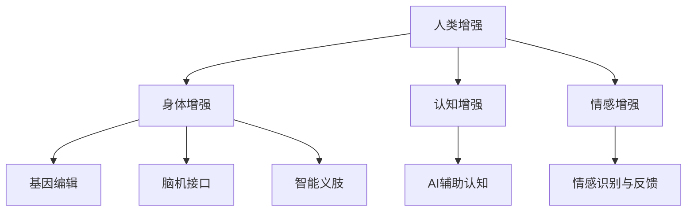

                 

# AI时代的人类增强：道德考虑与身体增强的未来发展策略

> 关键词：AI增强,人类增强,身体增强,道德考量,技术伦理

## 1. 背景介绍

在AI时代的浪潮下，人类增强（Human Enhancement）成为了科技界、医疗界、伦理界乃至全球社会共同关注的热点话题。借助生物医学、人工智能、纳米科技等前沿技术手段，人类正一步步接近身体和认知能力的极限。然而，这一过程伴随着诸多道德和法律争议，如何在提升人类福祉的同时，避免滑入不可控的深渊，成为了全社会亟需正视的重大议题。

在人类增强的不同维度中，身体增强占据了相当大的比重。从基因编辑到纳米医疗，从脑机接口到智能义肢，一系列技术的突破正在不断拓展人类的身体极限。这些技术的问世不仅关乎人类的身体机能，更是关乎人类社会的未来走向。因此，如何在享受科技红利的同时，坚持技术伦理，确保技术安全、公平、普惠，是本文探讨的核心议题。

## 2. 核心概念与联系

### 2.1 核心概念概述

- **人类增强（Human Enhancement）**：通过技术手段增强人类自然能力，包括身体、认知、情感等方面。常见技术包括基因编辑、脑机接口、智能假肢等。
- **身体增强（Body Enhancement）**：专指通过生物医学或工程手段提升人体机能的技术，如基因治疗、纳米医疗、义肢装置等。
- **技术伦理（Technological Ethics）**：研究人工智能、生物技术等技术应用对社会、伦理、法律的影响，并提出相应的规范和建议。
- **基因编辑（Gene Editing）**：指通过CRISPR-Cas9等技术直接修改人类基因，以治疗疾病或提升能力。
- **脑机接口（Brain-Computer Interface, BCIs）**：使人类大脑与计算机进行信息交互的技术，应用于控制假肢、增强认知等。
- **智能义肢（Smart Prosthetics）**：结合人工智能和物联网技术，使假肢具备智能化、自适应能力的义肢装置。

### 2.2 核心概念原理和架构的 Mermaid 流程图



此图展示了人类增强技术的主要分支及相互关联，从身体增强出发，延伸至认知和情感增强，再扩展到具体的技术实现手段。各个分支之间相互交织，共同构建了人类增强的完整框架。

## 3. 核心算法原理 & 具体操作步骤

### 3.1 算法原理概述

基于AI技术的身体增强，核心在于如何通过机器学习、深度学习等算法，提高假肢、义肢等设备的智能化水平，使其更好地服务于人类的身体需求。本文聚焦于深度学习在身体增强中的应用，以假肢为例，探索如何通过深度学习提升其适应性和智能化水平。

### 3.2 算法步骤详解

深度学习在身体增强中的应用，主要分为以下几个关键步骤：

**Step 1: 数据收集与预处理**
- 收集假肢佩戴者的运动数据、环境数据等，通过传感器或穿戴设备获取。
- 对数据进行清洗、归一化、特征提取等预处理操作，准备用于模型训练。

**Step 2: 模型选择与训练**
- 选择合适的深度学习模型，如循环神经网络（RNN）、卷积神经网络（CNN）、Transformer等。
- 利用收集到的数据训练模型，优化模型参数，使其能够预测假肢的最佳运动状态。

**Step 3: 模型集成与评估**
- 将训练好的模型与假肢控制系统集成，进行整体测试和调试。
- 在实际佩戴过程中，通过用户体验反馈和环境适应性测试，评估模型性能。

**Step 4: 持续优化与迭代**
- 根据佩戴者的使用反馈和环境变化，持续优化模型参数，提升假肢的适应性和智能化水平。
- 定期收集新数据，重新训练模型，保持其持续更新和优化。

### 3.3 算法优缺点

**优点**：
- 深度学习能够有效处理复杂的数据，捕捉数据之间的复杂关系，提升假肢的智能化水平。
- 通过持续优化和迭代，深度学习模型能够不断提升假肢的适应性和稳定性。

**缺点**：
- 深度学习模型需要大量的数据进行训练，数据收集和标注成本较高。
- 模型复杂度高，需要高性能计算资源，训练和部署成本较高。
- 深度学习模型存在一定的黑盒问题，难以解释其决策过程，影响模型的可信度。

### 3.4 算法应用领域

深度学习在身体增强中的应用广泛，包括但不限于以下几个领域：

- **智能义肢**：结合深度学习和物联网技术，提升假肢的智能化和自适应能力，使假肢能够更好地适应佩戴者的使用需求。
- **康复辅助**：利用深度学习分析佩戴者的运动模式，提供个性化的康复训练方案。
- **运动优化**：通过深度学习预测和优化假肢的机械运动，提升佩戴者的运动效果和舒适度。
- **环境适应**：利用深度学习分析环境变化，动态调整假肢的运动策略，提升佩戴者的环境适应性。

## 4. 数学模型和公式 & 详细讲解 & 举例说明

### 4.1 数学模型构建

深度学习模型通常采用神经网络架构，以多层感知机（MLP）为例，其基本结构如下：

$$
f(x) = W_2 \sigma(W_1 x + b_1) + b_2
$$

其中 $x$ 为输入数据，$W_1, W_2$ 为权重矩阵，$b_1, b_2$ 为偏置向量，$\sigma$ 为激活函数。

以预测假肢的运动状态为例，模型输入为佩戴者的运动数据，输出为假肢的运动指令。模型的训练目标为最小化预测输出与实际输出的误差。

### 4.2 公式推导过程

以回归问题为例，假设模型输入为 $x_i$，输出为 $y_i$，目标是找到最优的权重 $W$ 和偏置 $b$，使得模型预测值 $y'$ 与真实值 $y$ 的误差最小化。常见的最小二乘法目标函数为：

$$
J(W, b) = \frac{1}{2N}\sum_{i=1}^N(y_i - y'_i)^2
$$

其中 $N$ 为样本数量。通过梯度下降等优化算法，求解目标函数的极小值，即可得到最优的模型参数。

### 4.3 案例分析与讲解

以预测假肢运动为例，使用一个简单的多层感知机模型进行演示：

- **模型结构**：
  - 输入层：传感器采集到的运动数据
  - 隐藏层：通过多层感知机进行处理
  - 输出层：预测的假肢运动指令

- **训练数据**：收集佩戴者的运动数据，将数据分为训练集、验证集和测试集。
- **训练过程**：利用训练集对模型进行前向传播和反向传播，不断调整权重和偏置，最小化损失函数。
- **评估过程**：在验证集上评估模型性能，调整模型参数，防止过拟合。最终在测试集上评估模型的泛化能力。

## 5. 项目实践：代码实例和详细解释说明

### 5.1 开发环境搭建

使用Python和TensorFlow搭建深度学习模型。首先需要安装必要的库：

```bash
pip install tensorflow numpy pandas sklearn
```

创建虚拟环境：

```bash
conda create --name myenv python=3.8
conda activate myenv
```

### 5.2 源代码详细实现

以下是一个简单的多层感知机模型实现，用于预测假肢的运动状态：

```python
import tensorflow as tf
import numpy as np
from sklearn.model_selection import train_test_split

# 加载数据
data = np.load('data.npy')
labels = np.load('labels.npy')

# 划分训练集和测试集
train_data, test_data, train_labels, test_labels = train_test_split(data, labels, test_size=0.2, random_state=42)

# 定义模型
model = tf.keras.Sequential([
    tf.keras.layers.Dense(64, activation='relu', input_shape=(input_dim,)),
    tf.keras.layers.Dense(32, activation='relu'),
    tf.keras.layers.Dense(1, activation='sigmoid')
])

# 编译模型
model.compile(optimizer='adam', loss='binary_crossentropy', metrics=['accuracy'])

# 训练模型
model.fit(train_data, train_labels, epochs=10, validation_data=(test_data, test_labels))
```

### 5.3 代码解读与分析

上述代码实现了简单的多层感知机模型，用于预测假肢的运动状态。关键点如下：

- **数据加载**：使用Numpy加载数据，并将其划分为训练集和测试集。
- **模型定义**：使用Sequential模型，定义三层全连接神经网络，激活函数分别为ReLU和Sigmoid。
- **模型编译**：选择Adam优化器和二元交叉熵损失函数，评估指标为准确率。
- **模型训练**：使用训练集数据进行模型训练，验证集进行性能评估。

通过此示例代码，可以看出深度学习模型训练的基本流程：数据加载、模型定义、模型编译、模型训练等。

### 5.4 运行结果展示

训练完成后，可以在测试集上进行性能评估：

```python
test_loss, test_acc = model.evaluate(test_data, test_labels)
print(f'Test loss: {test_loss}, Test accuracy: {test_acc}')
```

## 6. 实际应用场景

### 6.1 智能义肢

智能义肢是深度学习在身体增强中最具代表性的应用之一。通过深度学习算法，使义肢具备自适应能力，可以根据佩戴者的运动模式自动调整输出，提升佩戴者的使用体验和舒适度。

以一种名为Myoelectric Prosthesis为例，其利用深度学习模型分析佩戴者的肌肉信号，实时调整义肢的运动状态。通过长时间训练，深度学习模型能够精准捕捉佩戴者的运动意图，实现高精度的义肢控制。

### 6.2 康复辅助

深度学习在康复辅助中的应用，主要体现在个性化训练方案的制定上。通过深度学习分析佩戴者的运动数据，可以制定个性化的康复训练计划，帮助佩戴者更快地恢复健康。

以一个名为Rehabilitative Therapy的案例为例，该系统通过深度学习分析佩戴者的运动模式，生成个性化的康复训练方案，并实时调整训练强度和内容，帮助佩戴者达到最佳康复效果。

### 6.3 运动优化

利用深度学习对假肢的运动进行优化，可以显著提升佩戴者的运动效果和舒适度。通过深度学习模型，分析假肢的运动轨迹和速度，调整假肢的控制策略，使其能够更自然地跟随佩戴者的动作。

以一种名为Adaptive Prosthesis的案例为例，其利用深度学习模型分析假肢的运动状态，实时调整假肢的机械结构和运动参数，使假肢的动作更加流畅、自然。

## 7. 工具和资源推荐

### 7.1 学习资源推荐

- **深度学习教程**：《深度学习》（Ian Goodfellow 著）、《动手学深度学习》（李沐等著）、《神经网络与深度学习》（Michael Nielsen 著）等书籍和教程，系统介绍深度学习的基本理论和实践。
- **TensorFlow官方文档**：详细介绍了TensorFlow的各个组件和使用方法，提供了丰富的示例代码和文档。
- **GitHub开源项目**：如OpenAI的DexNet，KTH的PACIFIC，提供了深度学习在身体增强中的具体实现和案例分析。

### 7.2 开发工具推荐

- **TensorFlow**：作为深度学习的主流框架，TensorFlow提供了丰富的算法库和工具，支持深度学习的各个方面。
- **PyTorch**：基于Python的深度学习框架，以其简洁易用的接口著称，适合快速原型开发和实验。
- **Keras**：基于TensorFlow和Theano的高级API，提供了简单易用的接口，适合初学者入门。

### 7.3 相关论文推荐

- **Deep Brain Stimulation for Human Enhancement**：探讨了深度学习在脑机接口中的应用，分析了其对人类增强的潜在影响。
- **AI-Driven Human Enhancement: Ethics, Governance and Impact**：讨论了AI在人类增强中的伦理问题，提出了相应的规范和建议。
- **Human Enhancement Technologies and Regulatory Considerations**：分析了各类人类增强技术的应用前景和监管挑战，提出了相应的政策建议。

## 8. 总结：未来发展趋势与挑战

### 8.1 研究成果总结

本文介绍了基于深度学习的身体增强技术，分析了其在智能义肢、康复辅助、运动优化等领域的应用，并探讨了技术伦理问题。通过系统梳理，可以看出深度学习在身体增强中的应用潜力巨大，但其面临的数据收集、模型训练、技术伦理等挑战也不可忽视。

### 8.2 未来发展趋势

未来，深度学习在身体增强中的应用将进一步拓展，以下趋势值得关注：

- **技术融合**：深度学习与其他技术（如基因编辑、脑机接口等）的融合，将产生更加全面的身体增强方案。
- **智能化提升**：通过深度学习不断优化假肢等设备的智能化水平，提升佩戴者的使用体验。
- **个性化定制**：通过深度学习分析佩戴者的独特需求，提供个性化的身体增强方案，提高使用效果。
- **伦理监管**：随着技术应用的普及，对伦理问题的关注将进一步增加，相应的监管机制和规范将逐步完善。

### 8.3 面临的挑战

深度学习在身体增强中面临的挑战包括：

- **数据隐私**：深度学习模型需要大量数据进行训练，如何保护佩戴者的数据隐私，避免数据滥用，是亟需解决的问题。
- **技术安全**：深度学习模型可能存在一定的安全漏洞，如模型篡改、攻击等，如何保障模型的安全性，是另一个重要课题。
- **伦理争议**：深度学习在身体增强中的应用，可能会引发一系列伦理争议，如“基因编辑”是否合理、“增强”的边界等，如何平衡技术应用和伦理价值，是必须面对的挑战。

### 8.4 研究展望

未来，深度学习在身体增强中的应用将更加广泛和深入，其研究展望包括以下几个方面：

- **伦理框架构建**：构建合理的伦理框架，指导技术的应用，平衡技术利益和伦理价值。
- **跨学科研究**：推动跨学科合作，综合生物医学、计算机科学、伦理学等多领域的知识，共同推进身体增强技术的发展。
- **国际合作**：加强国际合作，制定全球统一的规范和标准，促进技术的全球共享和应用。
- **持续优化**：通过不断的技术创新和优化，提高深度学习模型的性能和适用性，推动身体增强技术的普惠和可及。

## 9. 附录：常见问题与解答

**Q1: 如何确保深度学习在身体增强中的应用安全？**

A: 确保深度学习在身体增强中的应用安全，需要从数据保护、模型安全、伦理监管等多个方面入手：
- **数据保护**：加强数据隐私保护，采用数据匿名化、加密等技术，避免数据泄露。
- **模型安全**：通过模型检测和验证，避免模型被恶意篡改和攻击。
- **伦理监管**：制定相关的伦理规范和法律法规，保障技术的公平、普惠和透明。

**Q2: 深度学习在身体增强中的应用是否具有普惠性？**

A: 深度学习在身体增强中的应用，具有潜在的普惠性。通过深度学习，可以提供个性化的身体增强方案，提升佩戴者的使用体验和健康效果。但同时也需要注意，深度学习的普及和应用需要解决数据获取、技术门槛、伦理监管等问题，才能实现真正的普惠。

**Q3: 深度学习在身体增强中的应用是否存在伦理争议？**

A: 深度学习在身体增强中的应用，确实存在一些伦理争议。例如，基因编辑技术可能引发的伦理问题，智能假肢对人类主体性的挑战等。因此，需要在技术应用的过程中，充分考虑伦理问题，制定相应的规范和标准，保障技术的健康发展。

通过本文的探讨，可以看到，深度学习在身体增强中的应用，既有广阔的前景，也面临着诸多挑战。只有积极应对技术伦理问题，才能实现技术的健康发展和广泛应用，真正造福人类社会。

---

作者：禅与计算机程序设计艺术 / Zen and the Art of Computer Programming

