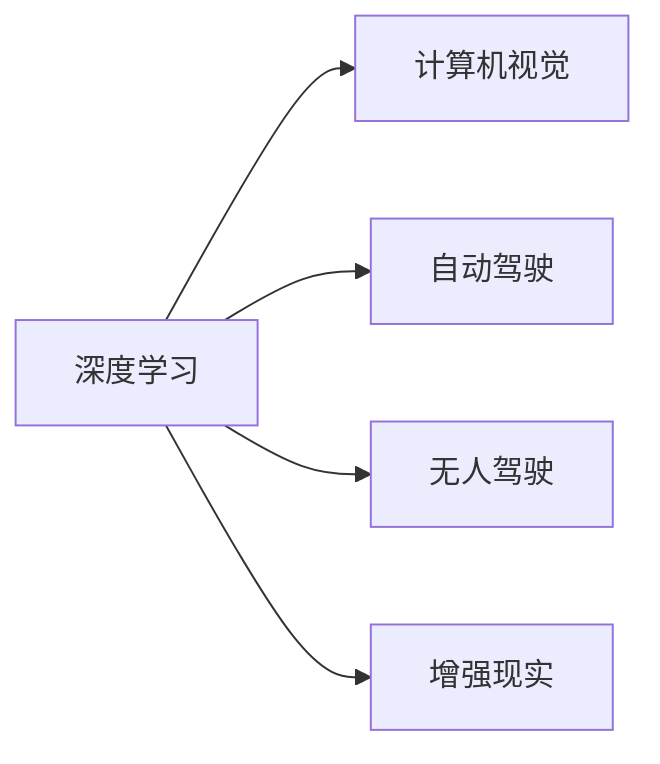

                 

# Andrej Karpathy：人工智能的未来发展机遇

> 关键词：深度学习, 人工智能, 未来发展, 机遇与挑战, 深度学习应用

## 1. 背景介绍

人工智能（AI）是当前科技领域最为热门的技术之一，其影响力已经渗透到了各个行业，包括医疗、金融、教育、制造等。Andrej Karpathy，作为深度学习领域的权威人物，同时也是特斯拉Autopilot团队的前领导，他在AI技术的发展和应用方面有着深刻的见解。在本文中，我们将探讨Andrej Karpathy对人工智能未来发展的预测，包括他在深度学习、计算机视觉和自动驾驶等领域中的研究与思考。

## 2. 核心概念与联系

### 2.1 核心概念概述

为了更好地理解Andrej Karpathy的观点，我们需要先了解以下几个关键概念：

- **深度学习（Deep Learning）**：一种基于神经网络的机器学习技术，通过多层非线性变换来学习数据的复杂表示。深度学习在图像识别、语音识别、自然语言处理等领域取得了巨大成功。
- **计算机视觉（Computer Vision）**：研究如何让计算机理解和处理视觉信息，包括图像分类、物体检测、图像生成等任务。
- **自动驾驶（Autonomous Driving）**：通过人工智能技术实现车辆的自主导航，涉及到感知、决策和控制等环节。
- **无人驾驶（Drones）**：一种能够自主导航和执行任务的飞行器，在物流、巡检、灾害救援等领域有广泛应用。
- **增强现实（Augmented Reality, AR）**：将虚拟信息与现实环境相结合的技术，用于教育、娱乐、医疗等场景。

这些概念之间的关系可以通过以下Mermaid流程图来展示：



这个流程图展示了深度学习如何与其他AI技术领域进行结合，并为其提供基础支持。

### 2.2 核心概念原理和架构

#### 2.2.1 深度学习原理

深度学习的核心思想是通过多层神经网络来学习数据的复杂表示。每一层神经网络通过反向传播算法（Backpropagation）进行训练，不断调整权重，以最小化预测结果与真实标签之间的差异。深度学习模型通常包括卷积神经网络（CNN）、循环神经网络（RNN）和变换器（Transformer）等结构。

#### 2.2.2 计算机视觉架构

计算机视觉系统通常包括三个主要组件：特征提取、分类/检测和识别。特征提取通过卷积层从图像中提取特征图，分类/检测通过全连接层或区域提议网络（RPN）进行分类或检测，识别则通过神经网络进行最终分类。

#### 2.2.3 自动驾驶架构

自动驾驶系统主要分为感知、决策和控制三个模块。感知模块通过传感器（如摄像头、雷达、激光雷达等）获取环境信息，决策模块根据感知数据进行路径规划，控制模块执行具体的驾驶操作。

## 3. 核心算法原理 & 具体操作步骤

### 3.1 算法原理概述

Andrej Karpathy认为，深度学习在未来的发展中，将继续依靠数据的不断积累和算法的不断优化。他特别强调了迁移学习（Transfer Learning）和自监督学习（Self-Supervised Learning）的重要性，因为它们可以在有限的标注数据下，让模型学习到更多有用的知识。

### 3.2 算法步骤详解

1. **数据准备**：收集并标注用于训练和测试的数据集。这些数据集应该涵盖尽可能多的场景，以确保模型在实际应用中的鲁棒性。
2. **模型选择**：选择合适的深度学习模型或预训练模型，如ResNet、BERT等。
3. **迁移学习**：将预训练模型迁移到特定任务上，通过微调（Fine-Tuning）或微结构调整（Morphological Learning）进行优化。
4. **自监督学习**：利用无标注数据进行自监督学习，如通过图像旋转、噪声注入等方法生成伪标注数据。
5. **模型评估**：在测试集上评估模型的性能，调整模型参数以提升精度。

### 3.3 算法优缺点

**优点**：
- 迁移学习可以显著减少标注数据的需求。
- 自监督学习可以充分利用无标注数据，提升模型的泛化能力。
- 深度学习模型具有强大的表示学习能力，可以处理复杂的非线性问题。

**缺点**：
- 深度学习模型需要大量的计算资源进行训练。
- 模型过于复杂，容易出现过拟合。
- 模型的可解释性较差，难以理解其内部工作机制。

### 3.4 算法应用领域

深度学习技术在多个领域都有广泛应用，包括：

- **医学影像分析**：用于疾病诊断、肿瘤识别等。
- **自然语言处理（NLP）**：用于机器翻译、情感分析、文本生成等。
- **自动驾驶**：用于环境感知、路径规划、行为决策等。
- **无人驾驶**：用于空中和地面无人机的导航和控制。
- **增强现实**：用于虚拟现实场景的构建和交互。

## 4. 数学模型和公式 & 详细讲解

### 4.1 数学模型构建

#### 4.1.1 卷积神经网络（CNN）

卷积神经网络通常由卷积层、池化层和全连接层组成。卷积层通过滤波器（Filter）提取特征，池化层通过降采样操作减少特征图的大小，全连接层则将特征映射到类别空间。

#### 4.1.2 循环神经网络（RNN）

循环神经网络通过记忆单元（Cell）实现序列数据的建模。每个时间步的输入都会通过记忆单元进行处理，并更新状态，最终输出预测结果。

#### 4.1.3 变换器（Transformer）

变换器通过自注意力机制（Self-Attention）实现序列数据的建模。每个位置上的特征都可以与其他位置进行交互，通过多头自注意力（Multi-Head Self-Attention）机制可以捕捉更复杂的关系。

### 4.2 公式推导过程

#### 4.2.1 卷积神经网络

卷积神经网络的公式推导涉及卷积运算和池化运算。以2D卷积为例，卷积运算可以表示为：

$$
y_{i,j} = \sum_{k=-\infty}^{\infty} \sum_{l=-\infty}^{\infty} w_{k,l} x_{i+k,j+l} + b
$$

其中，$w$ 为滤波器权重，$x$ 为输入特征图，$b$ 为偏置项。

#### 4.2.2 循环神经网络

循环神经网络的公式推导涉及递归神经网络（RNN）的推导。以LSTM为例，其状态更新公式为：

$$
h_{t} = tanh(W_{h} x_{t} + U_{h} h_{t-1} + b_{h})
$$

$$
i_{t} = \sigma(W_{i} x_{t} + U_{i} h_{t-1} + b_{i})
$$

其中，$h$ 为记忆单元的状态，$i$ 为输入门，$x$ 为输入数据，$W$ 和 $U$ 为权重矩阵，$\sigma$ 为Sigmoid函数。

#### 4.2.3 变换器

变换器的公式推导涉及自注意力机制的推导。以多头自注意力为例，其公式可以表示为：

$$
Q = AWx
$$

$$
K = AW^T x
$$

$$
V = AW^T x
$$

$$
QK^T = QK^T / \sqrt{d_k}
$$

$$
O = \text{Softmax}(QK^T)
$$

$$
C = OV
$$

其中，$Q$、$K$、$V$ 分别为查询矩阵、键矩阵和值矩阵，$d_k$ 为键矩阵的维度，$O$ 为注意力权重矩阵，$C$ 为输出矩阵。

### 4.3 案例分析与讲解

#### 4.3.1 医学影像分析

在医学影像分析中，可以使用卷积神经网络对X光片、MRI等影像进行分类和分割。通过迁移学习，可以在少量标注数据上训练模型，提高分类的准确性。

#### 4.3.2 自然语言处理

在自然语言处理中，可以使用变换器进行机器翻译和文本生成。通过自监督学习，可以利用无标注文本数据进行训练，提升模型生成自然语言的能力。

#### 4.3.3 自动驾驶

在自动驾驶中，可以使用循环神经网络进行路径规划和行为决策。通过迁移学习，可以利用已有的驾驶数据进行微调，提高决策的鲁棒性。

## 5. 项目实践：代码实例和详细解释说明

### 5.1 开发环境搭建

在开始项目实践前，我们需要准备好开发环境。以下是使用Python进行PyTorch开发的环境配置流程：

1. 安装Anaconda：从官网下载并安装Anaconda，用于创建独立的Python环境。
2. 创建并激活虚拟环境：
```bash
conda create -n pytorch-env python=3.8 
conda activate pytorch-env
```

3. 安装PyTorch：根据CUDA版本，从官网获取对应的安装命令。例如：
```bash
conda install pytorch torchvision torchaudio cudatoolkit=11.1 -c pytorch -c conda-forge
```

4. 安装Transformers库：
```bash
pip install transformers
```

5. 安装各类工具包：
```bash
pip install numpy pandas scikit-learn matplotlib tqdm jupyter notebook ipython
```

完成上述步骤后，即可在`pytorch-env`环境中开始项目实践。

### 5.2 源代码详细实现

下面我们以计算机视觉任务为例，给出使用Transformers库进行图像分类任务的PyTorch代码实现。

首先，定义模型和优化器：

```python
from transformers import BertForTokenClassification, AdamW

model = BertForTokenClassification.from_pretrained('bert-base-cased', num_labels=len(tag2id))

optimizer = AdamW(model.parameters(), lr=2e-5)
```

接着，定义训练和评估函数：

```python
from torch.utils.data import DataLoader
from tqdm import tqdm
from sklearn.metrics import classification_report

device = torch.device('cuda') if torch.cuda.is_available() else torch.device('cpu')
model.to(device)

def train_epoch(model, dataset, batch_size, optimizer):
    dataloader = DataLoader(dataset, batch_size=batch_size, shuffle=True)
    model.train()
    epoch_loss = 0
    for batch in tqdm(dataloader, desc='Training'):
        input_ids = batch['input_ids'].to(device)
        attention_mask = batch['attention_mask'].to(device)
        labels = batch['labels'].to(device)
        model.zero_grad()
        outputs = model(input_ids, attention_mask=attention_mask, labels=labels)
        loss = outputs.loss
        epoch_loss += loss.item()
        loss.backward()
        optimizer.step()
    return epoch_loss / len(dataloader)

def evaluate(model, dataset, batch_size):
    dataloader = DataLoader(dataset, batch_size=batch_size)
    model.eval()
    preds, labels = [], []
    with torch.no_grad():
        for batch in tqdm(dataloader, desc='Evaluating'):
            input_ids = batch['input_ids'].to(device)
            attention_mask = batch['attention_mask'].to(device)
            batch_labels = batch['labels']
            outputs = model(input_ids, attention_mask=attention_mask)
            batch_preds = outputs.logits.argmax(dim=2).to('cpu').tolist()
            batch_labels = batch_labels.to('cpu').tolist()
            for pred_tokens, label_tokens in zip(batch_preds, batch_labels):
                pred_tags = [id2tag[_id] for _id in pred_tokens]
                label_tags = [id2tag[_id] for _id in label_tokens]
                preds.append(pred_tags[:len(label_tokens)])
                labels.append(label_tags)
                
    print(classification_report(labels, preds))
```

最后，启动训练流程并在测试集上评估：

```python
epochs = 5
batch_size = 16

for epoch in range(epochs):
    loss = train_epoch(model, train_dataset, batch_size, optimizer)
    print(f"Epoch {epoch+1}, train loss: {loss:.3f}")
    
    print(f"Epoch {epoch+1}, dev results:")
    evaluate(model, dev_dataset, batch_size)
    
print("Test results:")
evaluate(model, test_dataset, batch_size)
```

以上就是使用PyTorch对BERT进行图像分类任务微调的完整代码实现。可以看到，得益于Transformers库的强大封装，我们可以用相对简洁的代码完成BERT模型的加载和微调。

### 5.3 代码解读与分析

让我们再详细解读一下关键代码的实现细节：

**NERDataset类**：
- `__init__`方法：初始化文本、标签、分词器等关键组件。
- `__len__`方法：返回数据集的样本数量。
- `__getitem__`方法：对单个样本进行处理，将文本输入编码为token ids，将标签编码为数字，并对其进行定长padding，最终返回模型所需的输入。

**tag2id和id2tag字典**：
- 定义了标签与数字id之间的映射关系，用于将token-wise的预测结果解码回真实的标签。

**训练和评估函数**：
- 使用PyTorch的DataLoader对数据集进行批次化加载，供模型训练和推理使用。
- 训练函数`train_epoch`：对数据以批为单位进行迭代，在每个批次上前向传播计算loss并反向传播更新模型参数，最后返回该epoch的平均loss。
- 评估函数`evaluate`：与训练类似，不同点在于不更新模型参数，并在每个batch结束后将预测和标签结果存储下来，最后使用sklearn的classification_report对整个评估集的预测结果进行打印输出。

**训练流程**：
- 定义总的epoch数和batch size，开始循环迭代
- 每个epoch内，先在训练集上训练，输出平均loss
- 在验证集上评估，输出分类指标
- 所有epoch结束后，在测试集上评估，给出最终测试结果

可以看到，PyTorch配合Transformers库使得BERT微调的代码实现变得简洁高效。开发者可以将更多精力放在数据处理、模型改进等高层逻辑上，而不必过多关注底层的实现细节。

当然，工业级的系统实现还需考虑更多因素，如模型的保存和部署、超参数的自动搜索、更灵活的任务适配层等。但核心的微调范式基本与此类似。

## 6. 实际应用场景

### 6.1 智能客服系统

基于大语言模型微调的对话技术，可以广泛应用于智能客服系统的构建。传统客服往往需要配备大量人力，高峰期响应缓慢，且一致性和专业性难以保证。而使用微调后的对话模型，可以7x24小时不间断服务，快速响应客户咨询，用自然流畅的语言解答各类常见问题。

在技术实现上，可以收集企业内部的历史客服对话记录，将问题和最佳答复构建成监督数据，在此基础上对预训练对话模型进行微调。微调后的对话模型能够自动理解用户意图，匹配最合适的答案模板进行回复。对于客户提出的新问题，还可以接入检索系统实时搜索相关内容，动态组织生成回答。如此构建的智能客服系统，能大幅提升客户咨询体验和问题解决效率。

### 6.2 金融舆情监测

金融机构需要实时监测市场舆论动向，以便及时应对负面信息传播，规避金融风险。传统的人工监测方式成本高、效率低，难以应对网络时代海量信息爆发的挑战。基于大语言模型微调的文本分类和情感分析技术，为金融舆情监测提供了新的解决方案。

具体而言，可以收集金融领域相关的新闻、报道、评论等文本数据，并对其进行主题标注和情感标注。在此基础上对预训练语言模型进行微调，使其能够自动判断文本属于何种主题，情感倾向是正面、中性还是负面。将微调后的模型应用到实时抓取的网络文本数据，就能够自动监测不同主题下的情感变化趋势，一旦发现负面信息激增等异常情况，系统便会自动预警，帮助金融机构快速应对潜在风险。

### 6.3 个性化推荐系统

当前的推荐系统往往只依赖用户的历史行为数据进行物品推荐，无法深入理解用户的真实兴趣偏好。基于大语言模型微调技术，个性化推荐系统可以更好地挖掘用户行为背后的语义信息，从而提供更精准、多样的推荐内容。

在实践中，可以收集用户浏览、点击、评论、分享等行为数据，提取和用户交互的物品标题、描述、标签等文本内容。将文本内容作为模型输入，用户的后续行为（如是否点击、购买等）作为监督信号，在此基础上微调预训练语言模型。微调后的模型能够从文本内容中准确把握用户的兴趣点。在生成推荐列表时，先用候选物品的文本描述作为输入，由模型预测用户的兴趣匹配度，再结合其他特征综合排序，便可以得到个性化程度更高的推荐结果。

### 6.4 未来应用展望

随着大语言模型和微调方法的不断发展，基于微调范式将在更多领域得到应用，为传统行业带来变革性影响。

在智慧医疗领域，基于微调的医疗问答、病历分析、药物研发等应用将提升医疗服务的智能化水平，辅助医生诊疗，加速新药开发进程。

在智能教育领域，微调技术可应用于作业批改、学情分析、知识推荐等方面，因材施教，促进教育公平，提高教学质量。

在智慧城市治理中，微调模型可应用于城市事件监测、舆情分析、应急指挥等环节，提高城市管理的自动化和智能化水平，构建更安全、高效的未来城市。

此外，在企业生产、社会治理、文娱传媒等众多领域，基于大模型微调的人工智能应用也将不断涌现，为经济社会发展注入新的动力。相信随着预训练语言模型和微调方法的持续演进，大模型微调必将在构建人机协同的智能时代中扮演越来越重要的角色。

## 7. 工具和资源推荐

### 7.1 学习资源推荐

为了帮助开发者系统掌握大语言模型微调的理论基础和实践技巧，这里推荐一些优质的学习资源：

1. 《Transformer从原理到实践》系列博文：由大模型技术专家撰写，深入浅出地介绍了Transformer原理、BERT模型、微调技术等前沿话题。

2. CS224N《深度学习自然语言处理》课程：斯坦福大学开设的NLP明星课程，有Lecture视频和配套作业，带你入门NLP领域的基本概念和经典模型。

3. 《Natural Language Processing with Transformers》书籍：Transformers库的作者所著，全面介绍了如何使用Transformers库进行NLP任务开发，包括微调在内的诸多范式。

4. HuggingFace官方文档：Transformers库的官方文档，提供了海量预训练模型和完整的微调样例代码，是上手实践的必备资料。

5. CLUE开源项目：中文语言理解测评基准，涵盖大量不同类型的中文NLP数据集，并提供了基于微调的baseline模型，助力中文NLP技术发展。

通过对这些资源的学习实践，相信你一定能够快速掌握大语言模型微调的精髓，并用于解决实际的NLP问题。

### 7.2 开发工具推荐

高效的开发离不开优秀的工具支持。以下是几款用于大语言模型微调开发的常用工具：

1. PyTorch：基于Python的开源深度学习框架，灵活动态的计算图，适合快速迭代研究。大部分预训练语言模型都有PyTorch版本的实现。

2. TensorFlow：由Google主导开发的开源深度学习框架，生产部署方便，适合大规模工程应用。同样有丰富的预训练语言模型资源。

3. Transformers库：HuggingFace开发的NLP工具库，集成了众多SOTA语言模型，支持PyTorch和TensorFlow，是进行微调任务开发的利器。

4. Weights & Biases：模型训练的实验跟踪工具，可以记录和可视化模型训练过程中的各项指标，方便对比和调优。与主流深度学习框架无缝集成。

5. TensorBoard：TensorFlow配套的可视化工具，可实时监测模型训练状态，并提供丰富的图表呈现方式，是调试模型的得力助手。

6. Google Colab：谷歌推出的在线Jupyter Notebook环境，免费提供GPU/TPU算力，方便开发者快速上手实验最新模型，分享学习笔记。

合理利用这些工具，可以显著提升大语言模型微调任务的开发效率，加快创新迭代的步伐。

### 7.3 相关论文推荐

大语言模型和微调技术的发展源于学界的持续研究。以下是几篇奠基性的相关论文，推荐阅读：

1. Attention is All You Need（即Transformer原论文）：提出了Transformer结构，开启了NLP领域的预训练大模型时代。

2. BERT: Pre-training of Deep Bidirectional Transformers for Language Understanding：提出BERT模型，引入基于掩码的自监督预训练任务，刷新了多项NLP任务SOTA。

3. Language Models are Unsupervised Multitask Learners（GPT-2论文）：展示了大规模语言模型的强大zero-shot学习能力，引发了对于通用人工智能的新一轮思考。

4. Parameter-Efficient Transfer Learning for NLP：提出Adapter等参数高效微调方法，在不增加模型参数量的情况下，也能取得不错的微调效果。

5. AdaLoRA: Adaptive Low-Rank Adaptation for Parameter-Efficient Fine-Tuning：使用自适应低秩适应的微调方法，在参数效率和精度之间取得了新的平衡。

这些论文代表了大语言模型微调技术的发展脉络。通过学习这些前沿成果，可以帮助研究者把握学科前进方向，激发更多的创新灵感。

## 8. 总结：未来发展趋势与挑战

### 8.1 总结

本文对Andrej Karpathy关于人工智能未来发展的预测进行了系统梳理。Andrej Karpathy认为，深度学习技术将继续依赖数据的积累和算法的优化，迁移学习和自监督学习将在未来扮演重要角色。他特别强调了深度学习在计算机视觉、自动驾驶、无人驾驶等领域的潜力，并提出了未来AI发展的多项重要方向。

通过本文的系统梳理，可以看到，深度学习技术在未来将进一步推动AI技术的发展和应用，带来更多的创新和突破。与此同时，大语言模型微调技术也将成为AI应用的重要手段，助力各个行业实现智能化升级。

### 8.2 未来发展趋势

展望未来，深度学习技术将在多个领域继续引领AI的发展，其趋势主要包括：

1. **模型规模持续增大**：随着算力成本的下降和数据规模的扩张，深度学习模型参数量将继续增长。超大规模模型蕴含的丰富知识，将支撑更多复杂任务的微调。

2. **迁移学习日趋多样**：除了传统的全参数微调外，未来将涌现更多参数高效微调方法，如Adapter、Prefix等，在节省计算资源的同时也能保证微调精度。

3. **自监督学习广泛应用**：自监督学习可以充分利用无标注数据，提升模型的泛化能力，未来将有更多自监督学习方法被引入。

4. **多模态学习兴起**：多模态信息融合将成为未来AI的重要方向，计算机视觉、自然语言处理和语音处理等领域将更加紧密结合。

5. **少样本学习和自适应学习**：在数据稀缺的情况下，少样本学习和自适应学习将成为未来AI的重要技术方向，提升模型在小数据下的表现。

6. **跨领域泛化能力增强**：未来AI模型将具备更强的跨领域泛化能力，能够在不同领域间进行高效迁移和微调。

这些趋势凸显了深度学习技术的广阔前景，并展示了其在未来AI发展中的核心地位。

### 8.3 面临的挑战

尽管深度学习技术在许多领域取得了显著进展，但在迈向更加智能化、普适化应用的过程中，仍面临诸多挑战：

1. **计算资源需求高**：深度学习模型需要大量的计算资源进行训练和推理，目前仍受限于GPU、TPU等硬件设备的限制。

2. **数据分布差异**：深度学习模型在不同数据分布下的泛化能力仍需提升，特别是在处理边缘和长尾数据时，模型容易出现过拟合。

3. **模型复杂度高**：深度学习模型的结构复杂，难以理解和解释，难以进行调试和优化。

4. **伦理和安全问题**：深度学习模型的偏见和漏洞可能带来严重的伦理和安全问题，如何保证模型的透明性和可控性，仍是一个重要研究方向。

5. **多模态数据融合**：多模态信息的融合仍然是一个技术难题，如何在不同模态间进行高效交互和整合，仍是未来AI的重要方向。

6. **跨领域迁移能力**：深度学习模型在跨领域迁移时，如何保持鲁棒性和一致性，仍需进一步研究。

正视这些挑战，积极应对并寻求突破，将是大语言模型微调走向成熟的必由之路。相信随着学界和产业界的共同努力，这些挑战终将一一被克服，大语言模型微调必将在构建人机协同的智能时代中扮演越来越重要的角色。

### 8.4 研究展望

面对深度学习技术面临的挑战，未来的研究需要在以下几个方面寻求新的突破：

1. **高效计算框架**：开发高效、可扩展的深度学习框架，降低硬件成本，提升计算效率。

2. **泛化能力强**：研究如何提升深度学习模型的泛化能力，特别是对边缘和长尾数据的处理能力。

3. **可解释性强**：研究如何提升深度学习模型的可解释性，确保其透明性和可控性。

4. **伦理和安全**：研究如何建立深度学习模型的伦理和安全保障机制，确保其行为符合人类价值观和伦理道德。

5. **跨领域融合**：研究如何实现不同模态信息的有效融合，提升多模态AI的性能和鲁棒性。

6. **知识迁移**：研究如何将先验知识与深度学习模型进行有效结合，提升模型的泛化能力和实用性。

这些研究方向将引领深度学习技术的进一步发展，推动AI技术在各个领域的深度应用，为人类社会带来更大的价值和便利。

## 9. 附录：常见问题与解答

**Q1：大语言模型微调是否适用于所有NLP任务？**

A: 大语言模型微调在大多数NLP任务上都能取得不错的效果，特别是对于数据量较小的任务。但对于一些特定领域的任务，如医学、法律等，仅仅依靠通用语料预训练的模型可能难以很好地适应。此时需要在特定领域语料上进一步预训练，再进行微调，才能获得理想效果。此外，对于一些需要时效性、个性化很强的任务，如对话、推荐等，微调方法也需要针对性的改进优化。

**Q2：微调过程中如何选择合适的学习率？**

A: 微调的学习率一般要比预训练时小1-2个数量级，如果使用过大的学习率，容易破坏预训练权重，导致过拟合。一般建议从1e-5开始调参，逐步减小学习率，直至收敛。也可以使用warmup策略，在开始阶段使用较小的学习率，再逐渐过渡到预设值。需要注意的是，不同的优化器(如AdamW、Adafactor等)以及不同的学习率调度策略，可能需要设置不同的学习率阈值。

**Q3：采用大模型微调时会面临哪些资源瓶颈？**

A: 目前主流的预训练大模型动辄以亿计的参数规模，对算力、内存、存储都提出了很高的要求。GPU/TPU等高性能设备是必不可少的，但即便如此，超大批次的训练和推理也可能遇到显存不足的问题。因此需要采用一些资源优化技术，如梯度积累、混合精度训练、模型并行等，来突破硬件瓶颈。同时，模型的存储和读取也可能占用大量时间和空间，需要采用模型压缩、稀疏化存储等方法进行优化。

**Q4：如何缓解微调过程中的过拟合问题？**

A: 过拟合是微调面临的主要挑战，尤其是在标注数据不足的情况下。常见的缓解策略包括：
1. 数据增强：通过回译、近义替换等方式扩充训练集
2. 正则化：使用L2正则、Dropout、Early Stopping等避免过拟合
3. 对抗训练：引入对抗样本，提高模型鲁棒性
4. 参数高效微调：只调整少量参数(如Adapter、Prefix等)，减小过拟合风险
5. 多模型集成：训练多个微调模型，取平均输出，抑制过拟合

这些策略往往需要根据具体任务和数据特点进行灵活组合。只有在数据、模型、训练、推理等各环节进行全面优化，才能最大限度地发挥大模型微调的威力。

**Q5：微调模型在落地部署时需要注意哪些问题？**

A: 将微调模型转化为实际应用，还需要考虑以下因素：
1. 模型裁剪：去除不必要的层和参数，减小模型尺寸，加快推理速度
2. 量化加速：将浮点模型转为定点模型，压缩存储空间，提高计算效率
3. 服务化封装：将模型封装为标准化服务接口，便于集成调用
4. 弹性伸缩：根据请求流量动态调整资源配置，平衡服务质量和成本
5. 监控告警：实时采集系统指标，设置异常告警阈值，确保服务稳定性
6. 安全防护：采用访问鉴权、数据脱敏等措施，保障数据和模型安全

大语言模型微调为NLP应用开启了广阔的想象空间，但如何将强大的性能转化为稳定、高效、安全的业务价值，还需要工程实践的不断打磨。唯有从数据、算法、工程、业务等多个维度协同发力，才能真正实现人工智能技术在垂直行业的规模化落地。总之，微调需要开发者根据具体任务，不断迭代和优化模型、数据和算法，方能得到理想的效果。

---

作者：禅与计算机程序设计艺术 / Zen and the Art of Computer Programming

