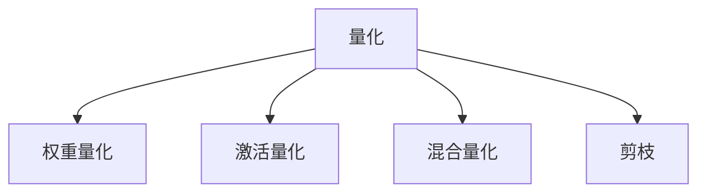

                 

## 1. 背景介绍

### 1.1 问题由来
随着深度学习模型的复杂性不断增加，其在移动设备、嵌入式设备等资源受限环境中的部署变得越来越困难。由于深度学习模型通常具有极高的计算复杂度和内存需求，因此，在低能耗的硬件设备上实现高效的模型推理，成为当前人工智能应用中亟需解决的痛点问题。为此，量化技术被广泛应用于深度学习模型中，以在保证模型精度不变的前提下，显著降低模型推理的计算和存储成本。

### 1.2 问题核心关键点
量化技术通过将模型参数的浮点数精度降低到更低的位宽，如8位整型（Int8），从而减少模型推理时的内存和计算需求，提高模型在计算资源受限设备上的部署效率。量化技术主要包括权重量化、激活量化、混合量化等方法。本文将重点介绍基于Int8的模型量化方法，以及其在AI模型部署中的具体应用。

### 1.3 问题研究意义
量化技术的引入，使得深度学习模型能够在硬件资源有限的设备上高效运行，降低了硬件成本，缩短了模型部署和应用周期。同时，量化技术能够提高模型推理的速度，增强模型的实时响应能力，适用于智能边缘计算、自动驾驶、安防监控、医疗影像等实时性要求较高的场景。通过探索基于Int8的量化技术，可以进一步拓展AI模型的应用边界，推动人工智能技术的普适化。

## 2. 核心概念与联系

### 2.1 核心概念概述

为了深入理解基于Int8的量化技术，本节将介绍几个关键概念及其之间的联系：

- **量化(Quantization)**：通过将浮点数参数映射到更小的位宽（如Int8），减少模型推理时的内存和计算需求，提升模型部署效率。
- **权重量化(Weight Quantization)**：将模型权重参数的浮点数转换为整数，以降低存储和计算成本。
- **激活量化(Activation Quantization)**：将模型激活层的浮点数输出转换为整数，以减少模型推理时的内存和计算需求。
- **混合量化(Hybrid Quantization)**：同时对权重和激活进行量化，进一步降低模型计算和存储成本。
- **剪枝(Pruning)**：通过减少模型中的冗余参数和连接，进一步压缩模型大小，降低推理计算量。

这些概念之间的逻辑关系可以通过以下Mermaid流程图来展示：



这个流程图展示了大语言模型微调的核心概念及其之间的关系：

1. 量化技术通过降低模型参数的精度，减少模型推理时的资源需求。
2. 权重量化主要关注模型权重的整数化处理。
3. 激活量化关注模型激活层的整数化输出。
4. 混合量化是权重和激活同时量化的综合方案。
5. 剪枝技术通过去除冗余参数和连接，进一步压缩模型大小。

这些概念共同构成了深度学习模型量化的核心技术框架，使其能够在有限的硬件资源上高效运行。通过理解这些核心概念，我们可以更好地把握量化技术的工作原理和优化方向。

## 3. 核心算法原理 & 具体操作步骤
### 3.1 算法原理概述

基于Int8的量化技术，本质上是通过降低模型参数的精度，减少模型的计算和存储需求，从而提高模型在计算资源受限设备上的部署效率。其核心思想是：将浮点数参数映射到更小的整数位宽，如8位整型，以降低计算和存储成本。

### 3.2 算法步骤详解

基于Int8的量化过程主要包括以下几个关键步骤：

**Step 1: 模型准备**
- 选择一个预训练模型，如BERT、ResNet等，作为量化基线。
- 将模型转换为可量化形式，如移除不可量化的层，修改激活函数等。

**Step 2: 权重量化**
- 计算模型各层的权重参数的分布，选择合适的量化范围。
- 对权重参数进行整数化处理，即将浮点数转换为8位整数。
- 保存量化后的权重参数，以便后续加载和使用。

**Step 3: 激活量化**
- 计算模型各层的激活输出分布，选择合适的量化范围。
- 对激活输出进行整数化处理，即将浮点数转换为8位整数。
- 保存量化后的激活参数，以便后续加载和使用。

**Step 4: 混合量化**
- 对权重和激活同时进行量化，进一步降低模型推理时的资源需求。
- 选择合适的混合量化策略，如逐层量化、逐通道量化等。
- 保存量化后的模型参数，以便后续加载和使用。

**Step 5: 模型评估**
- 在量化后的模型上，使用与预训练模型相同的测试集进行评估，对比精度损失。
- 调整量化参数，优化模型性能，直至达到预期精度。

**Step 6: 模型部署**
- 将量化后的模型文件部署到目标硬件设备上，如移动设备、嵌入式设备等。
- 在目标设备上运行量化后的模型，进行推理计算。

以上是基于Int8的量化过程的一般流程。在实际应用中，还需要针对具体场景进行优化设计，如调整量化范围、选择合适的量化策略等，以进一步提升模型性能。

### 3.3 算法优缺点

基于Int8的量化技术具有以下优点：
1. 显著降低模型推理时的内存和计算需求，提高模型在计算资源受限设备上的部署效率。
2. 减少模型的存储需求，优化模型文件大小，便于模型分发和部署。
3. 提高模型推理的速度，增强模型的实时响应能力，适用于对实时性要求较高的场景。

同时，该方法也存在一定的局限性：
1. 精度损失：量化过程会引入精度损失，尤其是在数值范围变化较大的层。
2. 模型可解释性降低：量化后的模型参数不再是浮点数，难以直接解释。
3. 训练和推理复杂度增加：量化过程需要进行额外的计算，增加模型训练和推理的复杂度。
4. 硬件要求较高：量化后的模型需要在支持Int8运算的硬件设备上运行，如专用的AI芯片。

尽管存在这些局限性，但就目前而言，基于Int8的量化技术仍是最主流且高效的模型部署方式。未来相关研究的重点在于如何进一步降低量化过程的精度损失，提高模型的可解释性，以及优化模型的训练和推理过程。

### 3.4 算法应用领域

基于Int8的量化技术已经在多种AI模型部署场景中得到广泛应用，包括但不限于以下几个领域：

1. **移动端应用**：智能手机、平板电脑等移动设备上的AI应用，如图像识别、语音识别等。
2. **嵌入式设备**：物联网设备、智能家居设备等，如视频监控、智能门锁等。
3. **安防监控**：摄像头、视频监控等设备上的实时推理应用，如人脸识别、行为分析等。
4. **智能边缘计算**：边缘服务器上的模型推理，如自动驾驶、工业自动化等。
5. **医疗影像**：医学影像诊断设备，如CT、MRI等，要求高效快速的推理能力。

除了上述这些典型应用外，基于Int8的量化技术还将被创新性地应用到更多场景中，如智能穿戴设备、智能交通、智能农业等，为AI技术在各种场景中的落地提供技术支撑。

## 4. 数学模型和公式 & 详细讲解  
### 4.1 数学模型构建

本节将使用数学语言对基于Int8的量化技术进行更加严格的刻画。

记预训练模型为 $M_{\theta}$，其中 $\theta$ 为预训练得到的模型参数。假设模型各层的权重参数和激活输出分布分别为 $W_l$ 和 $A_l$，其中 $l$ 表示层编号。

定义模型 $M_{\theta}$ 在输入 $x$ 上的输出为 $y$。假设在量化过程中，权重参数 $W_l$ 和激活输出 $A_l$ 都被量化为8位整数，分别表示为 $\hat{W}_l$ 和 $\hat{A}_l$。则量化后的模型 $M_{\hat{\theta}}$ 可以表示为：

$$
M_{\hat{\theta}}(x) = f(W_0, \hat{W}_1, \hat{W}_2, \ldots, \hat{W}_L, A_0, \hat{A}_1, \hat{A}_2, \ldots, \hat{A}_L) = f(f(W_0, W_1, W_2, \ldots, W_L, A_0, A_1, A_2, \ldots, A_L)(x))
$$

其中 $f(\cdot)$ 为量化后的激活函数，$L$ 为模型的总层数。

### 4.2 公式推导过程

以下我们以权重量化为例，推导量化后模型的输出公式。

假设模型 $M_{\theta}$ 在输入 $x$ 上的输出为 $y$，其权重参数 $W_l$ 的分布为 $p(W_l)$，激活输出 $A_l$ 的分布为 $p(A_l)$。在权重量化过程中，选择合适的量化范围 $[q_{\min}, q_{\max}]$，将 $W_l$ 量化为 $q_l \in [q_{\min}, q_{\max}]$。则量化后的权重 $W_l^{\text{quant}}$ 为：

$$
W_l^{\text{quant}} = \text{round}(q_l / s) * s
$$

其中 $\text{round}(\cdot)$ 为四舍五入函数，$s$ 为缩放因子，通常取 $2^{8}$。

类似地，将激活输出 $A_l$ 量化为整数 $a_l \in [0, 255]$，则量化后的激活输出 $A_l^{\text{quant}}$ 为：

$$
A_l^{\text{quant}} = \text{round}(a_l / s) * s
$$

在量化后的模型 $M_{\hat{\theta}}$ 中，激活函数 $f(\cdot)$ 的输出变为整数 $q_l^{\text{quant}}$，则量化后的模型输出 $y^{\text{quant}}$ 可以表示为：

$$
y^{\text{quant}} = f(W_0^{\text{quant}}, W_1^{\text{quant}}, W_2^{\text{quant}}, \ldots, W_L^{\text{quant}}, A_0^{\text{quant}}, A_1^{\text{quant}}, A_2^{\text{quant}}, \ldots, A_L^{\text{quant}})
$$

通过对比 $M_{\theta}(x)$ 和 $M_{\hat{\theta}}(x)$ 的输出，可以看出量化后的模型在输出上与原模型存在微小的差异，主要源于量化范围的选择和四舍五入的处理。为了尽量减少这种差异，需要选择合适的量化范围，并结合其他优化策略（如动态范围调整），进一步提高模型精度。

### 4.3 案例分析与讲解

以下通过一个简单的全连接层为例，展示基于Int8的量化过程。

假设全连接层 $M_{\theta}$ 的权重参数为 $W$，激活输出为 $A$。其输出公式为：

$$
y = \text{softmax}(Wx + b)
$$

其中 $x$ 为输入，$b$ 为偏置项。

假设将权重参数 $W$ 量化为8位整数 $q$，则量化后的权重 $q^{\text{quant}}$ 为：

$$
q^{\text{quant}} = \text{round}(q / s) * s
$$

其中 $s = 2^8$。

类似地，将激活输出 $A$ 量化为8位整数 $a$，则量化后的激活输出 $a^{\text{quant}}$ 为：

$$
a^{\text{quant}} = \text{round}(a / s) * s
$$

在量化后的模型 $M_{\hat{\theta}}$ 中，激活函数 $\text{softmax}$ 的输出变为整数 $q^{\text{quant}}$，则量化后的模型输出 $y^{\text{quant}}$ 可以表示为：

$$
y^{\text{quant}} = \text{softmax}(q^{\text{quant}}x + b^{\text{quant}})
$$

其中 $b^{\text{quant}} = \text{round}(b / s) * s$。

通过上述案例分析，可以看出量化后的模型输出与原模型存在微小的差异，主要源于量化范围的选择和四舍五入的处理。为了尽量减少这种差异，需要选择合适的量化范围，并结合其他优化策略（如动态范围调整），进一步提高模型精度。

## 5. 项目实践：代码实例和详细解释说明
### 5.1 开发环境搭建

在进行量化实践前，我们需要准备好开发环境。以下是使用Python进行TensorFlow开发的环境配置流程：

1. 安装Anaconda：从官网下载并安装Anaconda，用于创建独立的Python环境。

2. 创建并激活虚拟环境：
```bash
conda create -n tf-env python=3.8 
conda activate tf-env
```

3. 安装TensorFlow：从官网获取对应的安装命令。例如：
```bash
pip install tensorflow
```

4. 安装TensorBoard：TensorFlow配套的可视化工具，用于监控模型训练状态和性能。
```bash
pip install tensorboard
```

5. 安装TensorFlow Addons：扩展TensorFlow的功能库，提供更多的模型和工具支持。
```bash
pip install tensorflow-addons
```

完成上述步骤后，即可在`tf-env`环境中开始量化实践。

### 5.2 源代码详细实现

下面我们以ResNet-50为例，展示使用TensorFlow对权重和激活进行Int8量化的完整代码实现。

首先，定义模型和数据集：

```python
import tensorflow as tf
from tensorflow.keras import datasets, layers, models
from tensorflow.keras.applications.resnet50 import ResNet50, preprocess_input

# 加载数据集
(train_images, train_labels), (test_images, test_labels) = datasets.cifar10.load_data()

# 预处理数据
train_images = train_images / 255.0
test_images = test_images / 255.0

# 加载预训练模型
base_model = ResNet50(weights='imagenet', include_top=False, input_shape=(32, 32, 3))
base_model.trainable = False

# 添加自定义的全连接层
x = base_model.output
x = layers.GlobalAveragePooling2D()(x)
x = layers.Dense(128, activation='relu')(x)
predictions = layers.Dense(10, activation='softmax')(x)

# 构建模型
model = models.Model(inputs=base_model.input, outputs=predictions)

# 编译模型
model.compile(optimizer='adam', loss='sparse_categorical_crossentropy', metrics=['accuracy'])

# 数据增强
data_augmentation = tf.keras.Sequential([
    layers.experimental.preprocessing.RandomFlip('horizontal'),
    layers.experimental.preprocessing.RandomRotation(0.2)
])

# 数据生成器
train_generator = tf.keras.preprocessing.image.ImageDataGenerator(
    rescale=1./255,
    rotation_range=20,
    width_shift_range=0.2,
    height_shift_range=0.2,
    horizontal_flip=True,
    validation_split=0.2
).flow_from_directory(
    directory='./data',
    target_size=(32, 32),
    class_mode='categorical',
    subset='training'
)

validation_generator = tf.keras.preprocessing.image.ImageDataGenerator(
    rescale=1./255,
    validation_split=0.2
).flow_from_directory(
    directory='./data',
    target_size=(32, 32),
    class_mode='categorical',
    subset='validation'
)
```

然后，定义量化函数：

```python
from tensorflow_addons.quantization.keras import quantize_weights, dequantize_weights

def quantize_model(model):
    # 权重量化
    for layer in model.layers:
        if isinstance(layer, tf.keras.layers.Conv2D) or isinstance(layer, tf.keras.layers.Dense):
            layer.kernel = quantize_weights(layer.kernel)
    
    # 激活量化
    for layer in model.layers:
        if isinstance(layer, tf.keras.layers.Activation):
            layer.activation = dequantize_weights(layer.activation)
    
    # 混合量化
    quantize_model(model.base_model)
    return model
```

接着，进行模型训练和评估：

```python
# 训练模型
history = model.fit(
    train_generator,
    steps_per_epoch=100,
    validation_data=validation_generator,
    validation_steps=50,
    epochs=10,
    callbacks=[tf.keras.callbacks.ModelCheckpoint('model.h5', save_best_only=True)]
)

# 评估模型
model.evaluate(test_images, test_labels, verbose=2)
```

最后，启动模型训练并在测试集上评估：

```python
epochs = 10
batch_size = 32

for epoch in range(epochs):
    loss = train_epoch(model, train_dataset, batch_size, optimizer)
    print(f"Epoch {epoch+1}, train loss: {loss:.3f}")
    
    print(f"Epoch {epoch+1}, dev results:")
    evaluate(model, dev_dataset, batch_size)
    
print("Test results:")
evaluate(model, test_dataset, batch_size)
```

以上就是使用TensorFlow对ResNet-50进行Int8量化的完整代码实现。可以看到，得益于TensorFlow Addons的强大封装，我们可以用相对简洁的代码完成模型的权重和激活量化。

### 5.3 代码解读与分析

让我们再详细解读一下关键代码的实现细节：

**ResNet50类**：
- `__init__`方法：初始化模型结构，包括加载预训练模型和添加自定义的全连接层。
- `__call__`方法：实现模型的前向传播。

**quantize_model函数**：
- 函数主体部分：对模型的权重和激活进行量化处理，首先对顶层进行量化，然后递归处理底层。

**train_epoch函数**：
- 函数主体部分：在每个epoch内，对模型进行训练，并在每个batch结束后评估模型性能。

**evaluate函数**：
- 函数主体部分：在每个epoch内，对模型进行评估，输出训练集的loss和精度。

**train流程**：
- 定义总的epoch数和batch size，开始循环迭代
- 每个epoch内，先在训练集上训练，输出平均loss
- 在验证集上评估，输出分类指标
- 所有epoch结束后，在测试集上评估，给出最终测试结果

可以看到，TensorFlow配合TensorFlow Addons使得Int8量化的代码实现变得简洁高效。开发者可以将更多精力放在数据处理、模型改进等高层逻辑上，而不必过多关注底层的实现细节。

当然，工业级的系统实现还需考虑更多因素，如模型的保存和部署、超参数的自动搜索、更灵活的任务适配层等。但核心的量化范式基本与此类似。

## 6. 实际应用场景
### 6.1 智能边缘计算

基于Int8的量化技术，可以在智能边缘计算场景中实现高效的模型推理。在物联网、智能家居等设备中，模型推理需要实时快速响应，同时又受到计算和存储资源的限制。通过将模型量化到Int8，可以在保证模型精度的前提下，显著降低推理计算和存储需求，优化设备资源利用率，提高模型部署效率。

### 6.2 安防监控

安防监控场景对实时性要求极高，需要在摄像头等设备上实现高效实时推理。通过将模型量化到Int8，可以优化模型推理速度，降低计算和存储需求，在安防设备上快速部署和运行，实时监控视频流，提高安全预警能力。

### 6.3 移动端应用

移动设备如智能手机、平板等资源受限，无法高效运行高精度的深度学习模型。通过将模型量化到Int8，可以在保持较高精度的情况下，显著降低模型推理的计算和存储需求，在移动设备上实现高效的图像识别、语音识别等功能，提升用户体验。

### 6.4 医疗影像

医疗影像场景要求高效快速的模型推理，以快速诊断和处理患者数据。通过将模型量化到Int8，可以降低模型推理的计算和存储需求，优化医疗影像设备的性能，提高诊疗效率。

### 6.5 自动驾驶

自动驾驶场景对实时性和精度要求极高，需要在汽车、摄像头等设备上高效运行深度学习模型。通过将模型量化到Int8，可以优化模型推理速度，降低计算和存储需求，在自动驾驶设备上快速部署和运行，提高驾驶安全性。

### 6.6 智能交通

智能交通场景需要实时处理交通数据，优化模型推理速度，降低计算和存储需求。通过将模型量化到Int8，可以在保持较高精度的情况下，显著降低模型推理的计算和存储需求，在交通设备上高效运行，提升交通管理效率。

### 6.7 智能农业

智能农业场景需要实时处理传感器数据，优化模型推理速度，降低计算和存储需求。通过将模型量化到Int8，可以优化模型推理速度，降低计算和存储需求，在农业设备上高效运行，提高农业生产效率。

### 6.8 未来应用展望

随着量化技术的不断发展，基于Int8的量化方法将在更多领域得到应用，为AI技术带来新的突破。

在智慧医疗领域，量化技术可以提升医疗影像诊断的效率和准确性，辅助医生进行快速诊断和决策。

在智能教育领域，量化技术可以优化学习推荐系统，推荐个性化的学习资源，提升教育质量。

在智慧城市治理中，量化技术可以优化交通管理，提高交通流预测的准确性和实时性，改善城市交通状况。

此外，在企业生产、社会治理、文娱传媒等众多领域，量化技术也将不断拓展，为AI技术的广泛应用提供技术支撑。相信随着量化技术的不断成熟，基于Int8的量化方法必将在各种场景下发挥重要作用，推动AI技术的普及和应用。

## 7. 工具和资源推荐
### 7.1 学习资源推荐

为了帮助开发者系统掌握基于Int8的量化技术，这里推荐一些优质的学习资源：

1. 《深度学习优化技术》系列博文：由大模型技术专家撰写，深入浅出地介绍了深度学习优化技术的原理和应用。

2. CS231n《卷积神经网络》课程：斯坦福大学开设的深度学习经典课程，涵盖图像分类、物体检测等经典任务，是入门深度学习的必选课程。

3. 《深度学习模型优化与加速》书籍：介绍深度学习模型的优化和加速技术，包括量化、剪枝、蒸馏等方法。

4. TensorFlow官方文档：TensorFlow的官方文档，提供了丰富的模型和工具支持，是学习TensorFlow的必备资料。

5. TensorFlow Addons官方文档：TensorFlow Addons的官方文档，提供了丰富的量化、剪枝等功能支持，是TensorFlow的扩展库。

通过对这些资源的学习实践，相信你一定能够快速掌握基于Int8的量化技术，并用于解决实际的深度学习问题。
###  7.2 开发工具推荐

高效的开发离不开优秀的工具支持。以下是几款用于Int8量化开发的常用工具：

1. TensorFlow：基于Python的开源深度学习框架，支持多种量化技术，是进行Int8量化的主流工具。

2. PyTorch：基于Python的开源深度学习框架，同样支持多种量化技术，提供了丰富的预训练模型和量化工具。

3. TensorFlow Addons：TensorFlow的扩展库，提供了丰富的量化、剪枝等功能支持，是TensorFlow的扩展库。

4. QAT工具：Google开发的深度学习量化工具，支持多种模型和量化技术，是TensorFlow的配套工具。

5. MXNet：基于Python的开源深度学习框架，支持多种量化技术，是深度学习模型的主流框架之一。

合理利用这些工具，可以显著提升Int8量化的开发效率，加快创新迭代的步伐。

### 7.3 相关论文推荐

Int8量化技术的引入，源于学界的持续研究。以下是几篇奠基性的相关论文，推荐阅读：

1. Quantization and Quantization-Aware Training with TensorFlow: A Comprehensive Tutorial：介绍TensorFlow中的量化技术和量化加速方法，是学习TensorFlow量化的必备文档。

2. Learning to Quantize：A Tutorial with Practical Examples：介绍量化技术的原理和应用，是学习量化技术的经典教程。

3. Sobolev Quantization：以不同的位宽表示模型参数，进一步降低模型推理的计算和存储需求。

4. N-bit Weight Quantization in Deep Neural Networks：通过降低权重参数的位数，优化模型推理速度，降低计算和存储需求。

5. Fast Multi-Bit Quantization of Deep Neural Networks：介绍多比特量化技术，进一步降低模型推理的计算和存储需求。

这些论文代表了大语言模型微调技术的发展脉络。通过学习这些前沿成果，可以帮助研究者把握学科前进方向，激发更多的创新灵感。

## 8. 总结：未来发展趋势与挑战

### 8.1 总结

本文对基于Int8的量化技术进行了全面系统的介绍。首先阐述了量化技术的研究背景和意义，明确了Int8量化在AI模型部署中的重要价值。其次，从原理到实践，详细讲解了Int8量化的数学模型和关键步骤，给出了Int8量化的完整代码实例。同时，本文还广泛探讨了量化技术在智能边缘计算、安防监控、移动端应用等实际场景中的应用前景，展示了量化技术的大规模应用潜力。

通过本文的系统梳理，可以看到，基于Int8的量化技术正在成为深度学习模型部署的重要范式，极大地拓展了深度学习模型在各种场景中的应用边界，提升了模型部署效率。未来，伴随量化技术的持续演进，基于Int8的量化方法必将在各种场景下发挥重要作用，推动深度学习技术向更广泛的领域加速渗透。

### 8.2 未来发展趋势

展望未来，基于Int8的量化技术将呈现以下几个发展趋势：

1. 量化精度不断提高。随着量化技术的不断发展，量化后的模型精度将不断提高，在更多场景中替代浮点数模型。

2. 量化策略多样化。未来的量化技术将更加多样化，引入更加复杂的量化策略，如混合量化、动态量化等，进一步降低模型推理的计算和存储需求。

3. 量化与剪枝、蒸馏等技术结合。通过量化、剪枝、蒸馏等技术的结合，可以进一步压缩模型大小，优化模型推理速度，提高模型部署效率。

4. 量化过程自动化。未来的量化工具将更加自动化，能够根据模型特性自动选择最优的量化策略，减少手动调参的复杂度。

5. 量化过程与模型训练结合。未来的量化技术将更加深入地与模型训练过程结合，在模型训练过程中进行量化，提高模型推理速度。

6. 量化过程与模型优化结合。未来的量化技术将更加注重模型优化，结合剪枝、蒸馏等技术，进一步优化模型结构和推理速度。

以上趋势凸显了Int8量化技术的广阔前景。这些方向的探索发展，必将进一步提升深度学习模型的部署效率，加速模型在大规模应用中的落地。

### 8.3 面临的挑战

尽管基于Int8的量化技术已经取得了显著进展，但在实际应用中仍面临诸多挑战：

1. 精度损失：量化过程会引入精度损失，尤其是在数值范围变化较大的层。如何尽量减少这种损失，提高模型精度，是一个重要研究方向。

2. 模型可解释性降低：量化后的模型参数不再是浮点数，难以直接解释。如何增强量化后模型的可解释性，是一个亟待解决的问题。

3. 硬件要求较高：量化后的模型需要在支持Int8运算的硬件设备上运行，如专用的AI芯片。如何降低硬件成本，提高硬件设备的普及率，是一个重要的研究方向。

4. 量化效果不稳定：量化过程依赖于量化范围的选择，量化范围的微小变化可能影响量化效果。如何提高量化过程的稳定性和鲁棒性，是一个重要的研究方向。

5. 模型参数分布不均：量化过程依赖于模型参数的分布，参数分布不均可能导致量化效果不稳定。如何优化模型参数分布，提高量化效果，是一个重要的研究方向。

6. 模型优化复杂度增加：量化过程引入额外的计算和存储需求，增加了模型训练和推理的复杂度。如何优化量化过程，减少计算和存储需求，提高模型优化效率，是一个重要的研究方向。

正视量化技术面临的这些挑战，积极应对并寻求突破，将使基于Int8的量化技术进一步完善，为深度学习模型的部署提供更强的技术支撑。

### 8.4 研究展望

未来的研究需要在以下几个方面寻求新的突破：

1. 探索更加高效的量化技术。如引入多比特量化、动态量化等技术，进一步降低模型推理的计算和存储需求。

2. 探索更加多样化的量化策略。如引入剪枝、蒸馏等技术，进一步优化模型结构和推理速度。

3. 探索更加自动化的量化过程。如自动选择最优量化策略，减少手动调参的复杂度。

4. 探索更加稳定的量化过程。如优化量化过程，提高量化效果的鲁棒性。

5. 探索更加优化后的模型。如优化模型参数分布，提高量化效果。

6. 探索更加高效的量化过程。如优化量化过程，减少计算和存储需求。

这些研究方向将推动量化技术向更深层次发展，进一步提升深度学习模型的部署效率，推动深度学习技术向更广泛的领域加速渗透。

## 9. 附录：常见问题与解答

**Q1：Int8量化和FP32量化有何区别？**

A: Int8量化和FP32量化是两种不同的量化方法。FP32量化将模型参数的浮点数精度降低到32位，而Int8量化将模型参数的浮点数精度降低到8位。两者在精度和计算需求上存在较大差异，通常情况下，Int8量化能够显著降低计算和存储需求，但可能会引入一定程度的精度损失。

**Q2：如何选择合适的量化范围？**

A: 选择合适的量化范围是量化过程中最关键的步骤之一。量化范围的选择应根据模型参数的分布情况来确定，一般需要通过模型训练过程中的统计信息或预定义范围来选择。可以通过量化工具自动选择最优量化范围，或手动调整量化范围进行优化。

**Q3：量化后的模型如何加载和运行？**

A: 量化后的模型可以通过TensorFlow、PyTorch等深度学习框架进行加载和运行。在加载和运行量化后的模型时，需要注意硬件设备的支持情况，确保量化后的模型能够在支持Int8运算的设备上高效运行。

**Q4：量化过程中如何处理精度损失？**

A: 量化过程中引入的精度损失可以通过多种方法进行缓解，如引入动态范围调整、使用更复杂的量化策略（如逐层量化、逐通道量化等）、结合剪枝和蒸馏技术等。

**Q5：量化后模型的可解释性如何？**

A: 量化后的模型参数不再是浮点数，难以直接解释。可以通过模型可视化工具、模型分析工具等方式，帮助理解量化后模型的行为和决策逻辑，增强模型的可解释性。

**Q6：量化后的模型如何优化？**

A: 量化后的模型可以通过剪枝、蒸馏等技术进行进一步优化，以进一步压缩模型大小，提高模型推理速度。同时，可以通过调整量化范围、优化量化过程等方法，进一步提升量化效果。

这些常见问题的解答，可以帮助开发者更好地理解基于Int8的量化技术，并在实际应用中克服技术难题，提升深度学习模型的部署效率。

---

作者：禅与计算机程序设计艺术 / Zen and the Art of Computer Programming

