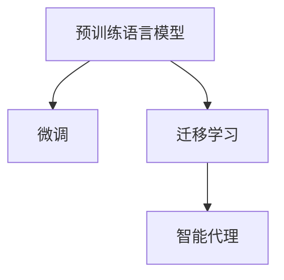

                 

# LLM在AI Agent中的角色

## 1. 背景介绍

人工智能的快速发展，特别是在自然语言处理（NLP）领域的突飞猛进，极大地推动了智能代理（AI Agent）技术的发展。智能代理是能够自主完成任务、适应环境变化、与人类和其他系统交互的人工智能系统。其中，基于语言的大规模预训练模型（Large Language Models, LLMs），如OpenAI的GPT系列、Google的BERT等，已经成为智能代理的核心技术之一。

在现代智能代理中，LLMs扮演着基础组件的角色，它们通过预先学习广泛的语言知识，能够为智能代理提供强大的语言理解和生成能力。基于LLMs的智能代理不仅能够理解自然语言指令，还能够生成自然语言响应，甚至在无标签数据上展示出一定的学习和推理能力。这种能力使得LLMs在智能代理中的应用场景非常广泛，包括但不限于智能客服、智能助手、自动驾驶、智能家居等。

## 2. 核心概念与联系

### 2.1 核心概念概述

要深刻理解LLMs在智能代理中的角色，首先需要了解几个核心概念：

- **预训练语言模型（Pre-trained Language Models, PLMs）**：通过在大规模无标签文本数据上自监督学习得到的模型，如BERT、GPT等。这些模型经过预训练后，能够学习到丰富的语言知识和语义理解能力。

- **微调（Fine-tuning）**：在预训练模型的基础上，使用下游任务的少量标注数据，通过有监督学习优化模型在特定任务上的性能。微调可以显著提升模型在特定任务上的效果。

- **迁移学习（Transfer Learning）**：将一个领域学习到的知识，迁移到另一个相关领域，以加速学习和提高性能。在大规模语言模型中，迁移学习是最常用的方法之一。

- **参数高效微调（Parameter-Efficient Fine-Tuning, PEFT）**：只更新模型的一部分参数，而保留预训练模型的其他参数，以提高微调效率和减少过拟合。

- **智能代理（AI Agent）**：能够自主完成任务、适应环境变化、与人类和其他系统交互的人工智能系统。智能代理可以基于LLMs进行构建，实现自然语言交互、智能决策等功能。

这些核心概念之间的逻辑关系可以通过以下Mermaid流程图来展示：



这个流程图展示了预训练模型如何通过微调和迁移学习被应用到智能代理中，最终实现自然语言交互和智能决策等功能。

## 3. 核心算法原理 & 具体操作步骤

### 3.1 算法原理概述

基于LLMs的智能代理通常包含以下几个关键步骤：

1. **预训练**：使用大规模无标签文本数据对模型进行预训练，学习语言知识和语义理解能力。
2. **微调**：根据具体任务，使用下游任务的少量标注数据，对预训练模型进行有监督学习，优化其在特定任务上的性能。
3. **迁移学习**：将预训练模型应用于新的任务或环境，通过微调或改进来适应新的任务需求。

基于LLMs的智能代理能够自主执行各种任务，包括但不限于：

- 自然语言理解和生成：能够理解自然语言指令，并生成自然语言响应。
- 多任务学习：能够在不同任务间进行迁移学习，适应不同的应用场景。
- 智能决策：能够基于语言理解和知识推理，进行智能决策。
- 人机交互：能够自然地与人类和其他系统进行语言交互。

### 3.2 算法步骤详解

以下将详细讲解基于LLMs的智能代理的核心算法步骤：

1. **数据准备**：收集并标注数据集，用于微调和评估智能代理的性能。

2. **模型选择与加载**：选择适合的预训练模型（如BERT、GPT等），并加载到系统中。

3. **微调设置**：设置微调的超参数，包括学习率、批大小、迭代轮数等，并选择合适的优化算法。

4. **微调训练**：将数据集分批次输入模型，前向传播计算损失函数，反向传播计算梯度，更新模型参数，直至收敛。

5. **评估与优化**：在验证集上评估模型性能，调整超参数以进一步提升效果。

6. **部署与应用**：将微调后的模型部署到实际应用中，进行多任务学习和智能决策。

### 3.3 算法优缺点

基于LLMs的智能代理具有以下优点：

- **泛化能力强**：预训练模型经过大规模无标签数据学习，能够学习到丰富的语言知识和语义理解能力，适用于多种任务。
- **适应性强**：通过微调和迁移学习，模型可以适应不同的任务和环境，具有较强的泛化能力。
- **效果好**：在大规模语言模型基础上进行微调，能够在少量标注数据的情况下，快速提升模型性能。

同时，也存在以下缺点：

- **依赖标注数据**：微调依赖于下游任务的少量标注数据，标注成本较高。
- **计算资源需求高**：预训练和微调模型需要大量计算资源，包括高性能GPU和TPU等。
- **可解释性差**：LLMs作为"黑盒"模型，其决策过程难以解释，难以进行调试和优化。

### 3.4 算法应用领域

基于LLMs的智能代理已经被广泛应用于多个领域，例如：

- **智能客服**：能够理解客户需求，提供个性化服务，提升客户体验。
- **智能助手**：能够自然地与人类进行对话，提供信息查询、日程安排等服务。
- **自动驾驶**：通过自然语言指令控制车辆，提升驾驶体验。
- **智能家居**：能够理解语音指令，控制家电设备，提升家居生活品质。

## 4. 数学模型和公式 & 详细讲解

### 4.1 数学模型构建

基于LLMs的智能代理通常使用Transformer架构，其数学模型可以表示为：

$$
\begin{aligned}
&\text{Transformer} = \text{Encoder} \times \text{Attention} \times \text{Decoder} \\
&\text{Encoder} = \{M_{i, j}\} \\
&\text{Attention} = \{A_{i, j}\} \\
&\text{Decoder} = \{D_{i, j}\} \\
\end{aligned}
$$

其中，$M_{i, j}$ 表示编码器中的自注意力机制，$A_{i, j}$ 表示解码器中的自注意力机制，$D_{i, j}$ 表示解码器中的前馈网络。

### 4.2 公式推导过程

以BERT模型为例，其微调的目标函数可以表示为：

$$
L(\theta) = \frac{1}{N} \sum_{i=1}^N l(\theta, x_i, y_i)
$$

其中，$l(\theta, x_i, y_i)$ 为损失函数，$x_i$ 为输入样本，$y_i$ 为真实标签。

在微调过程中，优化目标是通过梯度下降等优化算法，最小化损失函数 $L(\theta)$，更新模型参数 $\theta$。

### 4.3 案例分析与讲解

以智能客服系统为例，其微调过程可以概括为：

1. **数据准备**：收集历史客服对话数据，标注客户意图和响应。
2. **模型选择与加载**：选择BERT模型，并加载到系统中。
3. **微调设置**：设置微调的超参数，包括学习率、批大小等。
4. **微调训练**：将对话数据分批次输入模型，前向传播计算损失函数，反向传播计算梯度，更新模型参数，直至收敛。
5. **评估与优化**：在验证集上评估模型性能，调整超参数以进一步提升效果。
6. **部署与应用**：将微调后的模型部署到实际客服系统中，进行多任务学习和智能决策。

## 5. 项目实践：代码实例和详细解释说明

### 5.1 开发环境搭建

在进行智能客服系统的微调实践前，我们需要准备好开发环境。以下是使用Python进行PyTorch开发的环境配置流程：

1. 安装Anaconda：从官网下载并安装Anaconda，用于创建独立的Python环境。

2. 创建并激活虚拟环境：
```bash
conda create -n pytorch-env python=3.8 
conda activate pytorch-env
```

3. 安装PyTorch：根据CUDA版本，从官网获取对应的安装命令。例如：
```bash
conda install pytorch torchvision torchaudio cudatoolkit=11.1 -c pytorch -c conda-forge
```

4. 安装Transformers库：
```bash
pip install transformers
```

5. 安装各类工具包：
```bash
pip install numpy pandas scikit-learn matplotlib tqdm jupyter notebook ipython
```

完成上述步骤后，即可在`pytorch-env`环境中开始微调实践。

### 5.2 源代码详细实现

下面我们以智能客服系统为例，给出使用Transformers库对BERT模型进行微调的PyTorch代码实现。

首先，定义智能客服系统的任务数据处理函数：

```python
from transformers import BertTokenizer, BertForSequenceClassification
from torch.utils.data import Dataset
import torch

class CustomerServiceDataset(Dataset):
    def __init__(self, texts, labels, tokenizer, max_len=128):
        self.texts = texts
        self.labels = labels
        self.tokenizer = tokenizer
        self.max_len = max_len
        
    def __len__(self):
        return len(self.texts)
    
    def __getitem__(self, item):
        text = self.texts[item]
        label = self.labels[item]
        
        encoding = self.tokenizer(text, return_tensors='pt', max_length=self.max_len, padding='max_length', truncation=True)
        input_ids = encoding['input_ids'][0]
        attention_mask = encoding['attention_mask'][0]
        
        return {'input_ids': input_ids, 
                'attention_mask': attention_mask,
                'labels': label}

# 标签与id的映射
label2id = {'customerservice': 0, 'other': 1}
id2label = {v: k for k, v in label2id.items()}

# 创建dataset
tokenizer = BertTokenizer.from_pretrained('bert-base-cased')

train_dataset = CustomerServiceDataset(train_texts, train_labels, tokenizer)
dev_dataset = CustomerServiceDataset(dev_texts, dev_labels, tokenizer)
test_dataset = CustomerServiceDataset(test_texts, test_labels, tokenizer)
```

然后，定义模型和优化器：

```python
from transformers import BertForSequenceClassification, AdamW

model = BertForSequenceClassification.from_pretrained('bert-base-cased', num_labels=len(label2id))

optimizer = AdamW(model.parameters(), lr=2e-5)
```

接着，定义训练和评估函数：

```python
from torch.utils.data import DataLoader
from tqdm import tqdm
from sklearn.metrics import classification_report

device = torch.device('cuda') if torch.cuda.is_available() else torch.device('cpu')
model.to(device)

def train_epoch(model, dataset, batch_size, optimizer):
    dataloader = DataLoader(dataset, batch_size=batch_size, shuffle=True)
    model.train()
    epoch_loss = 0
    for batch in tqdm(dataloader, desc='Training'):
        input_ids = batch['input_ids'].to(device)
        attention_mask = batch['attention_mask'].to(device)
        labels = batch['labels'].to(device)
        model.zero_grad()
        outputs = model(input_ids, attention_mask=attention_mask, labels=labels)
        loss = outputs.loss
        epoch_loss += loss.item()
        loss.backward()
        optimizer.step()
    return epoch_loss / len(dataloader)

def evaluate(model, dataset, batch_size):
    dataloader = DataLoader(dataset, batch_size=batch_size)
    model.eval()
    preds, labels = [], []
    with torch.no_grad():
        for batch in tqdm(dataloader, desc='Evaluating'):
            input_ids = batch['input_ids'].to(device)
            attention_mask = batch['attention_mask'].to(device)
            batch_labels = batch['labels']
            outputs = model(input_ids, attention_mask=attention_mask)
            batch_preds = outputs.logits.argmax(dim=1).to('cpu').tolist()
            batch_labels = batch_labels.to('cpu').tolist()
            for pred, label in zip(batch_preds, batch_labels):
                preds.append(pred)
                labels.append(label)
                
    print(classification_report(labels, preds))
```

最后，启动训练流程并在测试集上评估：

```python
epochs = 5
batch_size = 16

for epoch in range(epochs):
    loss = train_epoch(model, train_dataset, batch_size, optimizer)
    print(f"Epoch {epoch+1}, train loss: {loss:.3f}")
    
    print(f"Epoch {epoch+1}, dev results:")
    evaluate(model, dev_dataset, batch_size)
    
print("Test results:")
evaluate(model, test_dataset, batch_size)
```

以上就是使用PyTorch对BERT进行智能客服系统微调的完整代码实现。可以看到，得益于Transformers库的强大封装，我们可以用相对简洁的代码完成BERT模型的加载和微调。

### 5.3 代码解读与分析

让我们再详细解读一下关键代码的实现细节：

**CustomerServiceDataset类**：
- `__init__`方法：初始化文本、标签、分词器等关键组件。
- `__len__`方法：返回数据集的样本数量。
- `__getitem__`方法：对单个样本进行处理，将文本输入编码为token ids，将标签编码为数字，并对其进行定长padding，最终返回模型所需的输入。

**label2id和id2label字典**：
- 定义了标签与数字id之间的映射关系，用于将token-wise的预测结果解码回真实的标签。

**训练和评估函数**：
- 使用PyTorch的DataLoader对数据集进行批次化加载，供模型训练和推理使用。
- 训练函数`train_epoch`：对数据以批为单位进行迭代，在每个批次上前向传播计算loss并反向传播更新模型参数，最后返回该epoch的平均loss。
- 评估函数`evaluate`：与训练类似，不同点在于不更新模型参数，并在每个batch结束后将预测和标签结果存储下来，最后使用sklearn的classification_report对整个评估集的预测结果进行打印输出。

**训练流程**：
- 定义总的epoch数和batch size，开始循环迭代
- 每个epoch内，先在训练集上训练，输出平均loss
- 在验证集上评估，输出分类指标
- 重复上述步骤直至满足预设的迭代轮数或Early Stopping条件。

可以看到，PyTorch配合Transformers库使得BERT微调的代码实现变得简洁高效。开发者可以将更多精力放在数据处理、模型改进等高层逻辑上，而不必过多关注底层的实现细节。

当然，工业级的系统实现还需考虑更多因素，如模型的保存和部署、超参数的自动搜索、更灵活的任务适配层等。但核心的微调范式基本与此类似。

## 6. 实际应用场景

### 6.1 智能客服系统

基于大语言模型微调的对话技术，可以广泛应用于智能客服系统的构建。传统客服往往需要配备大量人力，高峰期响应缓慢，且一致性和专业性难以保证。而使用微调后的对话模型，可以7x24小时不间断服务，快速响应客户咨询，用自然流畅的语言解答各类常见问题。

在技术实现上，可以收集企业内部的历史客服对话记录，将问题和最佳答复构建成监督数据，在此基础上对预训练对话模型进行微调。微调后的对话模型能够自动理解用户意图，匹配最合适的答案模板进行回复。对于客户提出的新问题，还可以接入检索系统实时搜索相关内容，动态组织生成回答。如此构建的智能客服系统，能大幅提升客户咨询体验和问题解决效率。

### 6.2 金融舆情监测

金融机构需要实时监测市场舆论动向，以便及时应对负面信息传播，规避金融风险。传统的人工监测方式成本高、效率低，难以应对网络时代海量信息爆发的挑战。基于大语言模型微调的文本分类和情感分析技术，为金融舆情监测提供了新的解决方案。

具体而言，可以收集金融领域相关的新闻、报道、评论等文本数据，并对其进行主题标注和情感标注。在此基础上对预训练语言模型进行微调，使其能够自动判断文本属于何种主题，情感倾向是正面、中性还是负面。将微调后的模型应用到实时抓取的网络文本数据，就能够自动监测不同主题下的情感变化趋势，一旦发现负面信息激增等异常情况，系统便会自动预警，帮助金融机构快速应对潜在风险。

### 6.3 个性化推荐系统

当前的推荐系统往往只依赖用户的历史行为数据进行物品推荐，无法深入理解用户的真实兴趣偏好。基于大语言模型微调技术，个性化推荐系统可以更好地挖掘用户行为背后的语义信息，从而提供更精准、多样的推荐内容。

在实践中，可以收集用户浏览、点击、评论、分享等行为数据，提取和用户交互的物品标题、描述、标签等文本内容。将文本内容作为模型输入，用户的后续行为（如是否点击、购买等）作为监督信号，在此基础上微调预训练语言模型。微调后的模型能够从文本内容中准确把握用户的兴趣点。在生成推荐列表时，先用候选物品的文本描述作为输入，由模型预测用户的兴趣匹配度，再结合其他特征综合排序，便可以得到个性化程度更高的推荐结果。

### 6.4 未来应用展望

随着大语言模型和微调方法的不断发展，基于微调范式将在更多领域得到应用，为传统行业带来变革性影响。

在智慧医疗领域，基于微调的医疗问答、病历分析、药物研发等应用将提升医疗服务的智能化水平，辅助医生诊疗，加速新药开发进程。

在智能教育领域，微调技术可应用于作业批改、学情分析、知识推荐等方面，因材施教，促进教育公平，提高教学质量。

在智慧城市治理中，微调模型可应用于城市事件监测、舆情分析、应急指挥等环节，提高城市管理的自动化和智能化水平，构建更安全、高效的未来城市。

此外，在企业生产、社会治理、文娱传媒等众多领域，基于大模型微调的人工智能应用也将不断涌现，为经济社会发展注入新的动力。相信随着技术的日益成熟，微调方法将成为人工智能落地应用的重要范式，推动人工智能技术在垂直行业的规模化落地。总之，微调需要开发者根据具体任务，不断迭代和优化模型、数据和算法，方能得到理想的效果。

## 7. 工具和资源推荐

### 7.1 学习资源推荐

为了帮助开发者系统掌握大语言模型微调的理论基础和实践技巧，这里推荐一些优质的学习资源：

1. 《Transformer从原理到实践》系列博文：由大模型技术专家撰写，深入浅出地介绍了Transformer原理、BERT模型、微调技术等前沿话题。

2. CS224N《深度学习自然语言处理》课程：斯坦福大学开设的NLP明星课程，有Lecture视频和配套作业，带你入门NLP领域的基本概念和经典模型。

3. 《Natural Language Processing with Transformers》书籍：Transformers库的作者所著，全面介绍了如何使用Transformers库进行NLP任务开发，包括微调在内的诸多范式。

4. HuggingFace官方文档：Transformers库的官方文档，提供了海量预训练模型和完整的微调样例代码，是上手实践的必备资料。

5. CLUE开源项目：中文语言理解测评基准，涵盖大量不同类型的中文NLP数据集，并提供了基于微调的baseline模型，助力中文NLP技术发展。

通过对这些资源的学习实践，相信你一定能够快速掌握大语言模型微调的精髓，并用于解决实际的NLP问题。

### 7.2 开发工具推荐

高效的开发离不开优秀的工具支持。以下是几款用于大语言模型微调开发的常用工具：

1. PyTorch：基于Python的开源深度学习框架，灵活动态的计算图，适合快速迭代研究。大部分预训练语言模型都有PyTorch版本的实现。

2. TensorFlow：由Google主导开发的开源深度学习框架，生产部署方便，适合大规模工程应用。同样有丰富的预训练语言模型资源。

3. Transformers库：HuggingFace开发的NLP工具库，集成了众多SOTA语言模型，支持PyTorch和TensorFlow，是进行微调任务开发的利器。

4. Weights & Biases：模型训练的实验跟踪工具，可以记录和可视化模型训练过程中的各项指标，方便对比和调优。与主流深度学习框架无缝集成。

5. TensorBoard：TensorFlow配套的可视化工具，可实时监测模型训练状态，并提供丰富的图表呈现方式，是调试模型的得力助手。

6. Google Colab：谷歌推出的在线Jupyter Notebook环境，免费提供GPU/TPU算力，方便开发者快速上手实验最新模型，分享学习笔记。

合理利用这些工具，可以显著提升大语言模型微调任务的开发效率，加快创新迭代的步伐。

### 7.3 相关论文推荐

大语言模型和微调技术的发展源于学界的持续研究。以下是几篇奠基性的相关论文，推荐阅读：

1. Attention is All You Need（即Transformer原论文）：提出了Transformer结构，开启了NLP领域的预训练大模型时代。

2. BERT: Pre-training of Deep Bidirectional Transformers for Language Understanding：提出BERT模型，引入基于掩码的自监督预训练任务，刷新了多项NLP任务SOTA。

3. Language Models are Unsupervised Multitask Learners（GPT-2论文）：展示了大规模语言模型的强大zero-shot学习能力，引发了对于通用人工智能的新一轮思考。

4. Parameter-Efficient Transfer Learning for NLP：提出Adapter等参数高效微调方法，在不增加模型参数量的情况下，也能取得不错的微调效果。

5. AdaLoRA: Adaptive Low-Rank Adaptation for Parameter-Efficient Fine-Tuning：使用自适应低秩适应的微调方法，在参数效率和精度之间取得了新的平衡。

6. Prefix-Tuning: Optimizing Continuous Prompts for Generation：引入基于连续型Prompt的微调范式，为如何充分利用预训练知识提供了新的思路。

这些论文代表了大语言模型微调技术的发展脉络。通过学习这些前沿成果，可以帮助研究者把握学科前进方向，激发更多的创新灵感。

## 8. 总结：未来发展趋势与挑战

### 8.1 总结

本文对基于大语言模型的智能代理技术进行了全面系统的介绍。首先阐述了智能代理的构建原理和目标，明确了基于大语言模型的微调范式在智能代理中的重要地位。其次，从原理到实践，详细讲解了微调的数学原理和关键步骤，给出了微调任务开发的完整代码实例。同时，本文还广泛探讨了微调方法在智能客服、金融舆情、个性化推荐等多个行业领域的应用前景，展示了微调范式的巨大潜力。此外，本文精选了微调技术的各类学习资源，力求为读者提供全方位的技术指引。

通过本文的系统梳理，可以看到，基于大语言模型的智能代理技术正在成为AI领域的重要范式，极大地拓展了预训练语言模型的应用边界，催生了更多的落地场景。受益于大规模语料的预训练，微调智能代理能够实现复杂的自然语言交互和智能决策，展现出强大的应用能力。未来，伴随预训练语言模型和微调方法的持续演进，智能代理必将在更多领域发挥更大作用，为经济社会发展注入新的动力。

### 8.2 未来发展趋势

展望未来，大语言模型微调技术将呈现以下几个发展趋势：

1. 模型规模持续增大。随着算力成本的下降和数据规模的扩张，预训练语言模型的参数量还将持续增长。超大规模语言模型蕴含的丰富语言知识，有望支撑更加复杂多变的智能代理任务。

2. 微调方法日趋多样。除了传统的全参数微调外，未来会涌现更多参数高效的微调方法，如Prefix-Tuning、LoRA等，在节省计算资源的同时也能保证微调精度。

3. 持续学习成为常态。随着数据分布的不断变化，智能代理也需要持续学习新知识以保持性能。如何在不遗忘原有知识的同时，高效吸收新样本信息，将成为重要的研究课题。

4. 标注样本需求降低。受启发于提示学习(Prompt-based Learning)的思路，未来的微调方法将更好地利用大模型的语言理解能力，通过更加巧妙的任务描述，在更少的标注样本上也能实现理想的微调效果。

5. 多模态微调崛起。当前的智能代理往往局限于纯文本数据，未来会进一步拓展到图像、视频、语音等多模态数据微调。多模态信息的融合，将显著提升智能代理对现实世界的理解和建模能力。

6. 模型通用性增强。经过海量数据的预训练和多领域任务的微调，未来的智能代理将具备更强大的常识推理和跨领域迁移能力，逐步迈向通用人工智能(AGI)的目标。

以上趋势凸显了大语言模型微调技术的广阔前景。这些方向的探索发展，必将进一步提升智能代理的性能和应用范围，为经济社会发展注入新的动力。

### 8.3 面临的挑战

尽管大语言模型微调技术已经取得了瞩目成就，但在迈向更加智能化、普适化应用的过程中，它仍面临着诸多挑战：

1. 标注成本瓶颈。虽然微调依赖于标注数据，但对于长尾应用场景，难以获得充足的高质量标注数据，成为制约微调性能的瓶颈。如何进一步降低微调对标注样本的依赖，将是一大难题。

2. 模型鲁棒性不足。当前智能代理面对域外数据时，泛化性能往往大打折扣。对于测试样本的微小扰动，智能代理的预测也容易发生波动。如何提高智能代理的鲁棒性，避免灾难性遗忘，还需要更多理论和实践的积累。

3. 推理效率有待提高。大规模智能代理模型虽然精度高，但在实际部署时往往面临推理速度慢、内存占用大等效率问题。如何在保证性能的同时，简化模型结构，提升推理速度，优化资源占用，将是重要的优化方向。

4. 可解释性亟需加强。当前智能代理模型通常作为"黑盒"系统，其决策过程难以解释，难以进行调试和优化。对于医疗、金融等高风险应用，算法的可解释性和可审计性尤为重要。如何赋予智能代理更强的可解释性，将是亟待攻克的难题。

5. 安全性有待保障。预训练智能代理模型难免会学习到有偏见、有害的信息，通过微调传递到下游任务，产生误导性、歧视性的输出，给实际应用带来安全隐患。如何从数据和算法层面消除模型偏见，避免恶意用途，确保输出的安全性，也将是重要的研究课题。

6. 知识整合能力不足。现有的智能代理模型往往局限于任务内数据，难以灵活吸收和运用更广泛的先验知识。如何让智能代理过程更好地与外部知识库、规则库等专家知识结合，形成更加全面、准确的信息整合能力，还有很大的想象空间。

正视智能代理面临的这些挑战，积极应对并寻求突破，将是大语言模型微调走向成熟的必由之路。相信随着学界和产业界的共同努力，这些挑战终将一一被克服，大语言模型微调必将在构建人机协同的智能代理中扮演越来越重要的角色。

### 8.4 研究展望

面对大语言模型微调所面临的种种挑战，未来的研究需要在以下几个方面寻求新的突破：

1. 探索无监督和半监督微调方法。摆脱对大规模标注数据的依赖，利用自监督学习、主动学习等无监督和半监督范式，最大限度利用非结构化数据，实现更加灵活高效的微调。

2. 研究参数高效和计算高效的微调范式。开发更加参数高效的微调方法，在固定大部分预训练参数的同时，只更新极少量的任务相关参数。同时优化微调模型的计算图，减少前向传播和反向传播的资源消耗，实现更加轻量级、实时性的部署。

3. 融合因果和对比学习范式。通过引入因果推断和对比学习思想，增强智能代理建立稳定因果关系的能力，学习更加普适、鲁棒的语言表征，从而提升智能代理泛化性和抗干扰能力。

4. 引入更多先验知识。将符号化的先验知识，如知识图谱、逻辑规则等，与神经网络模型进行巧妙融合，引导智能代理学习更准确、合理的语言模型。同时加强不同模态数据的整合，实现视觉、语音等多模态信息与文本信息的协同建模。

5. 结合因果分析和博弈论工具。将因果分析方法引入智能代理，识别出智能代理决策的关键特征，增强输出解释的因果性和逻辑性。借助博弈论工具刻画人机交互过程，主动探索并规避智能代理的脆弱点，提高系统稳定性。

6. 纳入伦理道德约束。在智能代理训练目标中引入伦理导向的评估指标，过滤和惩罚有偏见、有害的输出倾向。同时加强人工干预和审核，建立智能代理行为的监管机制，确保输出符合人类价值观和伦理道德。

这些研究方向的探索，必将引领大语言模型微调技术迈向更高的台阶，为构建安全、可靠、可解释、可控的智能系统铺平道路。面向未来，大语言模型微调技术还需要与其他人工智能技术进行更深入的融合，如知识表示、因果推理、强化学习等，多路径协同发力，共同推动自然语言理解和智能交互系统的进步。只有勇于创新、敢于突破，才能不断拓展智能代理的边界，让智能技术更好地造福人类社会。

## 9. 附录：常见问题与解答

**Q1：大语言模型微调是否适用于所有智能代理任务？**

A: 大语言模型微调在大多数智能代理任务上都能取得不错的效果，特别是对于数据量较小的任务。但对于一些特定领域的任务，如医学、法律等，仅仅依靠通用语料预训练的模型可能难以很好地适应。此时需要在特定领域语料上进一步预训练，再进行微调，才能获得理想效果。此外，对于一些需要时效性、个性化很强的任务，如对话、推荐等，微调方法也需要针对性的改进优化。

**Q2：智能代理在落地部署时需要注意哪些问题？**

A: 将智能代理模型转化为实际应用，还需要考虑以下因素：
1. 模型裁剪：去除不必要的层和参数，减小模型尺寸，加快推理速度
2. 量化加速：将浮点模型转为定点模型，压缩存储空间，提高计算效率
3. 服务化封装：将模型封装为标准化服务接口，便于集成调用
4. 弹性伸缩：根据请求流量动态调整资源配置，平衡服务质量和成本
5. 监控告警：实时采集系统指标，设置异常告警阈值，确保服务稳定性
6. 安全防护：采用访问鉴权、数据脱敏等措施，保障数据和模型安全

智能代理需要开发者根据具体任务，不断迭代和优化模型、数据和算法，方能得到理想的效果。

**Q3：智能代理中的大语言模型微调与传统的机器学习模型微调有何不同？**

A: 智能代理中的大语言模型微调和传统的机器学习模型微调有以下不同：

1. 数据要求：大语言模型微调通常需要大量的无标签文本数据进行预训练，而传统的机器学习模型微调则依赖于有标签的训练数据。
2. 模型复杂度：大语言模型通常具有庞大的参数规模和复杂的结构，而传统的机器学习模型则相对简单。
3. 模型训练：大语言模型通常使用自监督学习任务进行预训练，然后通过微调任务来优化特定任务性能，而传统的机器学习模型通常直接使用标注数据进行有监督学习。
4. 任务适应性：大语言模型由于预训练时的广泛语言知识，能够更好地适应各种任务和领域，而传统的机器学习模型则需要重新训练以适应新任务。

综上所述，智能代理中的大语言模型微调具有更大的灵活性和泛化能力，可以应用于更广泛的任务和领域，但同时也对数据和计算资源有更高的要求。

**Q4：智能代理中的大语言模型微调如何进行参数高效微调？**

A: 参数高效微调是一种只更新模型的一部分参数，而保留预训练模型的其他参数的微调方法，以提高微调效率和减少过拟合。

一种常用的参数高效微调方法是通过 Adapter 模块进行微调。Adapter 模块通常包括一层线性变换和一层激活函数，通过训练Adapter模块，可以更新模型的一部分参数，而保持预训练模型的其他部分不变。这样，可以在不增加模型总参数量的情况下，进行有效的微调。

例如，在智能客服系统中，可以使用 Adapter 模块对预训练模型进行微调，更新 Adapter 模块的参数，以适应特定客服对话任务。同时，保持预训练模型的其他参数不变，以避免破坏预训练的权重。这样可以大大降低微调成本，提高微调效率。

总的来说，参数高效微调方法可以在不增加模型复杂度的前提下，提高微调效果，同时减少过拟合风险。

**Q5：智能代理中的大语言模型微调如何进行多任务学习？**

A: 多任务学习（Multitask Learning, MTL）是指在一个模型上同时进行多个相关任务的学习，以提高模型的泛化能力和迁移能力。在大语言模型微调中，可以通过多任务学习来提升模型在不同任务上的性能。

一种常见的多任务学习方法是共享表示学习（Shared Representation Learning），即在预训练和微调阶段，共享部分网络参数和损失函数，使得模型能够在不同任务上学习到相似的表示。例如，在智能客服系统中，可以使用共享表示学习来优化预训练模型，使其能够同时学习到多个客服对话任务的相关知识。

另一种多任务学习方法是通过任务子网（Task Subnet）进行微调。任务子网通常是一组与特定任务相关的全连接层或子网络，通过训练任务子网，可以更新模型的一部分参数，以适应特定任务的需求。例如，在智能客服系统中，可以使用任务子网对预训练模型进行微调，以优化特定客服对话任务的性能。

总的来说，多任务学习可以提高智能代理在不同任务上的性能，同时减少对标注数据的依赖，使得模型能够更好地适应新的任务和领域。

**Q6：智能代理中的大语言模型微调如何进行知识图谱融合？**

A: 知识图谱融合是指将知识图谱中的结构化知识与自然语言处理模型进行整合，以增强模型的语义理解和推理能力。在大语言模型微调中，可以通过知识图谱融合来提升模型对现实世界的理解和建模能力。

一种常见的知识图谱融合方法是基于知识图谱嵌入（Knowledge Graph Embedding）的方法，即将知识图谱中的实体和关系嵌入到低维向量空间中，然后将其与自然语言处理模型进行融合。例如，在智能客服系统中，可以使用知识图谱嵌入的方法将实体和关系嵌入到BERT模型的上下文中，以增强模型对客服对话的理解能力。

另一种知识图谱融合方法是基于知识图谱推理（Knowledge Graph Reasoning）的方法，即在自然语言处理模型中加入知识图谱推理机制，使得模型能够基于知识图谱进行推理和预测。例如，在智能客服系统中，可以使用知识图谱推理的方法在模型中引入知识图谱中的因果关系和推理规则，以增强模型对客服对话的推理能力。

总的来说，知识图谱融合可以提高智能代理的语义理解和推理能力，使其能够更好地处理自然语言文本和结构化数据，从而提升智能代理的性能和应用范围。

---

作者：禅与计算机程序设计艺术 / Zen and the Art of Computer Programming

