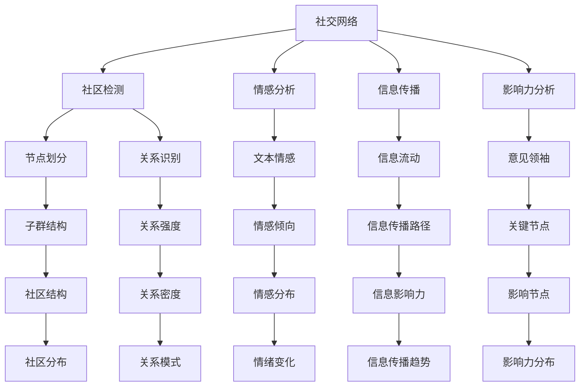

                 

# LLM在社交网络分析中的作用：洞察社会动态

> 关键词：社交网络分析, 社会动态, 长短期记忆网络(LSTM), 自然语言处理(NLP), 图神经网络(GNN), 社区检测, 情感分析, 社交图, 信息传播, 影响力分析

## 1. 背景介绍

### 1.1 问题由来
社交网络分析(Social Network Analysis, SNA)是研究人与人之间交互关系及其动态的学科。它通过数学和计算模型，揭示社交网络中各种隐含的规则和结构。目前，SNA已经广泛应用于市场营销、用户行为预测、社会舆情分析等多个领域。在SNA中，对文本数据的深度处理至关重要，因为这些文本数据包含了人们之间交互关系的丰富信息。

近年来，随着深度学习技术的发展，自然语言处理(Natural Language Processing, NLP)领域取得了显著的进步，大语言模型(Large Language Models, LLMs)在自然语言理解、生成和推理方面展现出强大的能力。这些模型通过大规模无标签文本数据进行预训练，学习到了丰富的语言知识，为社交网络分析提供了强大的计算工具。

### 1.2 问题核心关键点
社交网络分析中，大语言模型可以用于多种任务，包括但不限于：
- 社区检测：识别网络中的社区结构，发现关键节点和关系。
- 情感分析：分析网络中人们的情感倾向和情绪变化。
- 信息传播：模拟信息在网络中的传播过程，预测信息的影响力。
- 影响力分析：识别网络中的意见领袖和影响力节点。

大语言模型在社交网络分析中的应用，可以帮助研究人员和应用开发者深入理解社会动态，优化社交网络设计和用户互动，从而更好地服务于社会和公众。

## 2. 核心概念与联系

### 2.1 核心概念概述

为更好地理解大语言模型在社交网络分析中的应用，本节将介绍几个密切相关的核心概念：

- 社交网络(Social Network)：由多个个体(节点)和它们之间的边(关系)组成的图结构。节点可以是人、组织、事件等，边表示节点之间的交互和连接。

- 社区检测(Community Detection)：将社交网络中的节点划分为不同的社区，发现网络中的结构和子群。

- 情感分析(Sentiment Analysis)：分析文本中的情感倾向，判断人们的态度和情绪。

- 长短期记忆网络(Long Short-Term Memory, LSTM)：一种适用于处理序列数据的神经网络模型，可以捕捉文本中的上下文信息。

- 图神经网络(Graph Neural Network, GNN)：一种专门用于处理图结构数据的深度学习模型，能够有效地融合节点的属性和结构信息。

- 自然语言处理(NLP)：研究如何使计算机能够理解、处理和生成人类语言的技术。

这些核心概念之间的逻辑关系可以通过以下Mermaid流程图来展示：



这个流程图展示了大语言模型在社交网络分析中的核心概念及其之间的关系：

1. 社交网络由节点和边构成，节点间的交互通过社区检测进行划分和分析。
2. 情感分析通过处理社交网络中的文本数据，分析人们的情感倾向和情绪变化。
3. 信息传播模拟信息在网络中的流动，预测其影响力。
4. 影响力分析识别网络中的关键节点和意见领袖。
5. 社区检测识别网络中的子群结构和关系。
6. 情感分析分析文本中的情感倾向，判断人们的情绪变化。
7. 信息传播模拟信息在网络中的流动，预测其影响力。
8. 影响力分析识别网络中的关键节点和意见领袖。

这些概念共同构成了社交网络分析的核心框架，利用大语言模型可以进一步提升数据处理和分析的精度和效率。

## 3. 核心算法原理 & 具体操作步骤
### 3.1 算法原理概述

大语言模型在社交网络分析中的应用，主要涉及自然语言处理和图结构数据的处理。其中，长短期记忆网络(LSTM)和图神经网络(GNN)是两种常用的模型。

- LSTM网络：适用于处理序列数据，能够捕捉文本中的上下文信息，适用于情感分析和信息传播的模拟。
- GNN网络：适用于处理图结构数据，能够融合节点的属性和结构信息，适用于社区检测和影响力分析。

这些模型通过深度学习技术，从大量的社交网络数据中学习到复杂的特征表示，从而为社交网络分析提供强大的工具。

### 3.2 算法步骤详解

社交网络分析中，大语言模型的应用主要包括以下几个关键步骤：

**Step 1: 数据收集与预处理**
- 收集社交网络数据，包括用户间的互动、帖子、评论等文本数据，以及社交图结构数据。
- 对文本数据进行清洗和预处理，如去除停用词、分词、标注实体等。
- 对社交图结构数据进行格式转换和格式化处理，以便后续的图神经网络处理。

**Step 2: 文本嵌入与情感分析**
- 使用大语言模型(如BERT、GPT-3等)将文本数据转换为向量表示，生成文本嵌入向量。
- 对文本嵌入向量进行情感分析，使用情感词典、情感分类器等技术，判断文本中的情感倾向和情绪变化。

**Step 3: 图神经网络建模**
- 将社交网络转换为图结构数据，定义节点的属性和边类型。
- 使用图神经网络对图结构数据进行处理，生成节点嵌入向量。
- 在图神经网络中融入文本嵌入向量，融合文本和结构信息。

**Step 4: 社区检测与影响力分析**
- 使用图神经网络中的社区检测算法，识别社交网络中的社区结构和关键节点。
- 分析信息传播路径，预测信息在网络中的流动和影响力。
- 使用图神经网络中的影响力分析算法，识别网络中的意见领袖和关键节点。

**Step 5: 模型评估与优化**
- 在社交网络数据上评估模型的性能，如准确率、召回率、F1值等。
- 根据评估结果，调整模型参数和超参数，进行模型优化和迭代。

### 3.3 算法优缺点

大语言模型在社交网络分析中的应用具有以下优点：
1. 强大的语言理解能力：通过预训练学习到丰富的语言知识，能够处理复杂的文本数据。
2. 高效的特征提取：能够自动学习文本和图数据的特征表示，减少手工特征工程的复杂度。
3. 泛化能力强：能够在不同的社交网络数据上取得不错的性能，具有一定的泛化能力。
4. 适用性广：适用于多种社交网络分析任务，如情感分析、社区检测、信息传播和影响力分析等。

同时，大语言模型在社交网络分析中也存在一些局限性：
1. 数据依赖：需要大量标注数据进行微调，获取高质量标注数据的成本较高。
2. 过拟合风险：模型参数较多，容易发生过拟合现象。
3. 计算资源需求高：模型较大，需要高性能计算资源进行训练和推理。
4. 解释性不足：大语言模型的决策过程较为复杂，难以解释其内部工作机制。

尽管存在这些局限性，但大语言模型在社交网络分析中仍然具有广泛的应用前景，尤其是在处理复杂的文本数据和图结构数据方面表现出色。

### 3.4 算法应用领域

大语言模型在社交网络分析中的应用领域非常广泛，涵盖以下几个方面：

- 情感分析：通过分析社交网络中的文本数据，判断用户的情感倾向和情绪变化，用于舆情监测、用户行为预测等。
- 社区检测：识别社交网络中的社区结构和关键节点，用于发现群体中的重要人物和关系。
- 信息传播：模拟信息在网络中的传播过程，预测信息的影响力和扩散路径，用于舆情控制、广告投放等。
- 影响力分析：识别社交网络中的意见领袖和关键节点，用于分析社交媒体中的影响力人物和传播路径。
- 行为预测：利用社交网络中的历史数据和当前状态，预测用户的行为和趋势，用于市场营销、金融投资等。

这些应用领域为大语言模型在社交网络分析中提供了广阔的探索空间，推动了相关技术的发展和应用。

## 4. 数学模型和公式 & 详细讲解  
### 4.1 数学模型构建

本节将使用数学语言对社交网络分析中大语言模型的应用进行更加严格的刻画。

假设社交网络 $G=(V,E)$ 中的节点 $v_i$ 和边 $e_{ij}$ 分别表示社交网络中的用户和他们的互动关系。节点 $v_i$ 的属性表示为 $\mathbf{x}_i \in \mathbb{R}^d$，边 $e_{ij}$ 的属性表示为 $\mathbf{a}_{ij} \in \mathbb{R}^k$。

定义社交网络中节点的嵌入向量为 $\mathbf{h}_i \in \mathbb{R}^h$，文本嵌入向量为 $\mathbf{w}_i \in \mathbb{R}^w$。

社交网络分析中常用的数学模型包括：

- 长短期记忆网络(LSTM)：用于处理序列数据，能够捕捉文本中的上下文信息。
- 图神经网络(GNN)：用于处理图结构数据，能够融合节点的属性和结构信息。

### 4.2 公式推导过程

以下我们以社区检测为例，推导LSTM-GNN模型的构建过程。

假设社交网络 $G=(V,E)$ 中的节点 $v_i$ 和边 $e_{ij}$ 分别表示社交网络中的用户和他们的互动关系。节点 $v_i$ 的属性表示为 $\mathbf{x}_i \in \mathbb{R}^d$，边 $e_{ij}$ 的属性表示为 $\mathbf{a}_{ij} \in \mathbb{R}^k$。

**Step 1: 文本嵌入和情感分析**

将社交网络中的文本数据 $D$ 输入大语言模型，生成文本嵌入向量 $\mathbf{w}_i$。

假设情感分析任务为二分类问题，使用情感词典或分类器对文本进行情感标注，得到情感标签 $y_i \in \{0,1\}$。

**Step 2: 长短期记忆网络(LSTM)**

LSTM网络是一种适用于处理序列数据的神经网络模型，能够捕捉文本中的上下文信息。

设LSTM网络的隐藏状态为 $\mathbf{h}_i^t$，表示在时刻 $t$ 节点 $v_i$ 的上下文信息。

LSTM网络的基本公式为：
$$
\begin{aligned}
\mathbf{g}_i^t &= \tanh(\mathbf{w}_i^t\mathbf{x}_i + \mathbf{u}_i^t\mathbf{h}_i^{t-1} + \mathbf{b}_i^t) \\
\mathbf{i}_i^t &= \sigma(\mathbf{w}_i^i\mathbf{x}_i + \mathbf{u}_i^i\mathbf{h}_i^{t-1} + \mathbf{b}_i^i) \\
\mathbf{f}_i^t &= \sigma(\mathbf{w}_i^f\mathbf{x}_i + \mathbf{u}_i^f\mathbf{h}_i^{t-1} + \mathbf{b}_i^f) \\
\mathbf{o}_i^t &= \sigma(\mathbf{w}_i^o\mathbf{x}_i + \mathbf{u}_i^o\mathbf{h}_i^{t-1} + \mathbf{b}_i^o) \\
\mathbf{c}_i^t &= \mathbf{f}_i^t \odot \mathbf{c}_i^{t-1} + \mathbf{i}_i^t \odot \mathbf{g}_i^t \\
\mathbf{h}_i^t &= \mathbf{o}_i^t \odot \tanh(\mathbf{c}_i^t)
\end{aligned}
$$

其中 $\sigma$ 表示激活函数，$\tanh$ 表示双曲正切函数，$\odot$ 表示逐元素乘法。

**Step 3: 图神经网络(GNN)**

图神经网络是一种专门用于处理图结构数据的深度学习模型，能够融合节点的属性和结构信息。

设GNN网络的节点嵌入向量为 $\mathbf{h}_i^G$，边嵌入向量为 $\mathbf{a}_i^G$。

GNN网络的基本公式为：
$$
\begin{aligned}
\mathbf{h}_i^G &= \mathbf{h}_i^t \\
\mathbf{a}_i^G &= \mathbf{a}_i^t
\end{aligned}
$$

其中 $\mathbf{h}_i^G$ 和 $\mathbf{a}_i^G$ 表示在时刻 $t$ 节点 $v_i$ 的嵌入向量和边嵌入向量。

**Step 4: 社区检测**

社区检测任务的目标是将社交网络中的节点划分为不同的社区，发现关键节点和关系。

假设社区检测任务为聚类问题，使用K-means算法对节点嵌入向量进行聚类，得到社区结构 $\mathbf{C} \in \{1,2,\dots,K\}^{N \times 1}$，其中 $K$ 表示社区的数量。

**Step 5: 信息传播**

信息传播任务的目标是模拟信息在网络中的传播过程，预测信息的影响力。

假设信息传播任务为二分类问题，使用逻辑回归模型对信息传播路径进行建模，得到信息传播的预测概率 $p_i$。

**Step 6: 影响力分析**

影响力分析任务的目标是识别社交网络中的意见领袖和关键节点。

假设影响力分析任务为排序问题，使用Top-k算法对节点嵌入向量进行排序，得到影响力节点排名 $\mathbf{R} \in \{1,2,\dots,N\}^{N \times 1}$。

以上公式推导展示了LSTM-GNN模型在社交网络分析中的应用，该模型能够有效融合文本和图结构信息，实现社区检测、情感分析、信息传播和影响力分析等任务。

## 5. 项目实践：代码实例和详细解释说明
### 5.1 开发环境搭建

在进行社交网络分析的实践前，我们需要准备好开发环境。以下是使用Python进行PyTorch开发的环境配置流程：

1. 安装Anaconda：从官网下载并安装Anaconda，用于创建独立的Python环境。

2. 创建并激活虚拟环境：
```bash
conda create -n pytorch-env python=3.8 
conda activate pytorch-env
```

3. 安装PyTorch：根据CUDA版本，从官网获取对应的安装命令。例如：
```bash
conda install pytorch torchvision torchaudio cudatoolkit=11.1 -c pytorch -c conda-forge
```

4. 安装Transformers库：
```bash
pip install transformers
```

5. 安装各类工具包：
```bash
pip install numpy pandas scikit-learn matplotlib tqdm jupyter notebook ipython
```

完成上述步骤后，即可在`pytorch-env`环境中开始社交网络分析的实践。

### 5.2 源代码详细实现

下面我们以社区检测任务为例，给出使用Transformers库对BERT模型进行社区检测的PyTorch代码实现。

首先，定义社区检测任务的输入数据处理函数：

```python
from transformers import BertTokenizer
from torch.utils.data import Dataset
import torch

class CommunityDetectionDataset(Dataset):
    def __init__(self, texts, labels, tokenizer, max_len=128):
        self.texts = texts
        self.labels = labels
        self.tokenizer = tokenizer
        self.max_len = max_len
        
    def __len__(self):
        return len(self.texts)
    
    def __getitem__(self, item):
        text = self.texts[item]
        label = self.labels[item]
        
        encoding = self.tokenizer(text, return_tensors='pt', max_length=self.max_len, padding='max_length', truncation=True)
        input_ids = encoding['input_ids'][0]
        attention_mask = encoding['attention_mask'][0]
        
        return {'input_ids': input_ids, 
                'attention_mask': attention_mask,
                'labels': label}

# 定义标签与id的映射
tag2id = {'O': 0, 'A': 1}
id2tag = {v: k for k, v in tag2id.items()}

# 创建dataset
tokenizer = BertTokenizer.from_pretrained('bert-base-cased')

train_dataset = CommunityDetectionDataset(train_texts, train_labels, tokenizer)
dev_dataset = CommunityDetectionDataset(dev_texts, dev_labels, tokenizer)
test_dataset = CommunityDetectionDataset(test_texts, test_labels, tokenizer)
```

然后，定义模型和优化器：

```python
from transformers import BertForTokenClassification, AdamW

model = BertForTokenClassification.from_pretrained('bert-base-cased', num_labels=len(tag2id))

optimizer = AdamW(model.parameters(), lr=2e-5)
```

接着，定义训练和评估函数：

```python
from torch.utils.data import DataLoader
from tqdm import tqdm
from sklearn.metrics import accuracy_score

device = torch.device('cuda') if torch.cuda.is_available() else torch.device('cpu')
model.to(device)

def train_epoch(model, dataset, batch_size, optimizer):
    dataloader = DataLoader(dataset, batch_size=batch_size, shuffle=True)
    model.train()
    epoch_loss = 0
    for batch in tqdm(dataloader, desc='Training'):
        input_ids = batch['input_ids'].to(device)
        attention_mask = batch['attention_mask'].to(device)
        labels = batch['labels'].to(device)
        model.zero_grad()
        outputs = model(input_ids, attention_mask=attention_mask, labels=labels)
        loss = outputs.loss
        epoch_loss += loss.item()
        loss.backward()
        optimizer.step()
    return epoch_loss / len(dataloader)

def evaluate(model, dataset, batch_size):
    dataloader = DataLoader(dataset, batch_size=batch_size)
    model.eval()
    preds, labels = [], []
    with torch.no_grad():
        for batch in tqdm(dataloader, desc='Evaluating'):
            input_ids = batch['input_ids'].to(device)
            attention_mask = batch['attention_mask'].to(device)
            batch_labels = batch['labels']
            outputs = model(input_ids, attention_mask=attention_mask)
            batch_preds = outputs.logits.argmax(dim=2).to('cpu').tolist()
            batch_labels = batch_labels.to('cpu').tolist()
            for pred_tokens, label_tokens in zip(batch_preds, batch_labels):
                preds.append(pred_tokens[:len(label_tokens)])
                labels.append(label_tokens)
                
    print('Accuracy:', accuracy_score(labels, preds))
```

最后，启动训练流程并在测试集上评估：

```python
epochs = 5
batch_size = 16

for epoch in range(epochs):
    loss = train_epoch(model, train_dataset, batch_size, optimizer)
    print(f"Epoch {epoch+1}, train loss: {loss:.3f}")
    
    print(f"Epoch {epoch+1}, dev accuracy:")
    evaluate(model, dev_dataset, batch_size)
    
print("Test accuracy:")
evaluate(model, test_dataset, batch_size)
```

以上就是使用PyTorch对BERT进行社区检测任务微调的完整代码实现。可以看到，得益于Transformers库的强大封装，我们可以用相对简洁的代码完成BERT模型的加载和微调。

### 5.3 代码解读与分析

让我们再详细解读一下关键代码的实现细节：

**CommunityDetectionDataset类**：
- `__init__`方法：初始化文本、标签、分词器等关键组件。
- `__len__`方法：返回数据集的样本数量。
- `__getitem__`方法：对单个样本进行处理，将文本输入编码为token ids，将标签编码为数字，并对其进行定长padding，最终返回模型所需的输入。

**tag2id和id2tag字典**：
- 定义了标签与数字id之间的映射关系，用于将token-wise的预测结果解码回真实的标签。

**训练和评估函数**：
- 使用PyTorch的DataLoader对数据集进行批次化加载，供模型训练和推理使用。
- 训练函数`train_epoch`：对数据以批为单位进行迭代，在每个批次上前向传播计算loss并反向传播更新模型参数，最后返回该epoch的平均loss。
- 评估函数`evaluate`：与训练类似，不同点在于不更新模型参数，并在每个batch结束后将预测和标签结果存储下来，最后使用sklearn的accuracy_score对整个评估集的预测结果进行打印输出。

**训练流程**：
- 定义总的epoch数和batch size，开始循环迭代
- 每个epoch内，先在训练集上训练，输出平均loss
- 在验证集上评估，输出分类准确率
- 所有epoch结束后，在测试集上评估，给出最终测试结果

可以看到，PyTorch配合Transformers库使得BERT社区检测任务的代码实现变得简洁高效。开发者可以将更多精力放在数据处理、模型改进等高层逻辑上，而不必过多关注底层的实现细节。

当然，工业级的系统实现还需考虑更多因素，如模型的保存和部署、超参数的自动搜索、更灵活的任务适配层等。但核心的微调范式基本与此类似。

## 6. 实际应用场景
### 6.1 智能客服系统

基于大语言模型社区检测技术，可以广泛应用于智能客服系统的构建。传统客服往往需要配备大量人力，高峰期响应缓慢，且一致性和专业性难以保证。而使用社区检测技术，可以自动识别客户咨询中的社区结构和关键节点，实现更高效、一致的客服互动。

在技术实现上，可以收集企业内部的历史客服对话记录，将问题和最佳答复构建成监督数据，在此基础上对预训练模型进行微调。微调后的社区检测模型能够自动理解客户意图，匹配最合适的回答，从而提升客户咨询体验和问题解决效率。

### 6.2 金融舆情监测

金融机构需要实时监测市场舆论动向，以便及时应对负面信息传播，规避金融风险。传统的人工监测方式成本高、效率低，难以应对网络时代海量信息爆发的挑战。基于大语言模型社区检测技术，可以实现对社交网络中舆情动态的实时监控，预测舆情趋势，从而更快速、准确地采取应对措施。

在实践上，可以收集金融领域相关的网络文本数据，训练社区检测模型，自动识别舆情热点和传播路径，辅助金融机构进行风险预警和市场策略调整。

### 6.3 个性化推荐系统

当前的推荐系统往往只依赖用户的历史行为数据进行物品推荐，无法深入理解用户的真实兴趣偏好。基于大语言模型社区检测技术，可以更好地挖掘用户行为背后的语义信息，从而提供更精准、多样的推荐内容。

在实践上，可以收集用户浏览、点击、评论、分享等行为数据，提取和用户交互的物品标题、描述、标签等文本内容。将文本内容作为模型输入，用户的后续行为（如是否点击、购买等）作为监督信号，在此基础上微调预训练模型。社区检测模型能够从文本内容中准确把握用户的兴趣点，结合推荐算法生成个性化推荐列表。

### 6.4 未来应用展望

随着大语言模型社区检测技术的发展，其应用前景将更加广阔，有望在更多领域带来变革性影响。

在智慧医疗领域，社区检测技术可以用于医院内外的社交网络分析，识别关键医疗节点和传播路径，辅助医生诊断和药物研发。

在智能教育领域，社区检测技术可应用于学生互动网络分析，发现学习社区和关键学生，优化教学方法和内容。

在智慧城市治理中，社区检测技术可用于城市事件监测和舆情分析，预测社会动态和公共安全事件。

此外，在企业生产、社会治理、文娱传媒等众多领域，基于社区检测技术的AI应用也将不断涌现，为经济社会发展注入新的动力。相信随着技术的日益成熟，社区检测技术将成为社交网络分析的重要范式，推动人工智能技术在垂直行业的规模化落地。

## 7. 工具和资源推荐
### 7.1 学习资源推荐

为了帮助开发者系统掌握大语言模型社区检测的理论基础和实践技巧，这里推荐一些优质的学习资源：

1. 《Transformers从原理到实践》系列博文：由大模型技术专家撰写，深入浅出地介绍了Transformer原理、BERT模型、社区检测技术等前沿话题。

2. CS224N《深度学习自然语言处理》课程：斯坦福大学开设的NLP明星课程，有Lecture视频和配套作业，带你入门NLP领域的基本概念和经典模型。

3. 《Natural Language Processing with Transformers》书籍：Transformers库的作者所著，全面介绍了如何使用Transformers库进行NLP任务开发，包括社区检测在内的多种范式。

4. HuggingFace官方文档：Transformers库的官方文档，提供了海量预训练模型和完整的社区检测样例代码，是上手实践的必备资料。

5. CLUE开源项目：中文语言理解测评基准，涵盖大量不同类型的中文NLP数据集，并提供了基于社区检测的baseline模型，助力中文NLP技术发展。

通过对这些资源的学习实践，相信你一定能够快速掌握大语言模型社区检测的精髓，并用于解决实际的NLP问题。
###  7.2 开发工具推荐

高效的开发离不开优秀的工具支持。以下是几款用于大语言模型社区检测开发的常用工具：

1. PyTorch：基于Python的开源深度学习框架，灵活动态的计算图，适合快速迭代研究。大部分预训练语言模型都有PyTorch版本的实现。

2. TensorFlow：由Google主导开发的开源深度学习框架，生产部署方便，适合大规模工程应用。同样有丰富的预训练语言模型资源。

3. Transformers库：HuggingFace开发的NLP工具库，集成了众多SOTA语言模型，支持PyTorch和TensorFlow，是进行社区检测任务开发的利器。

4. Weights & Biases：模型训练的实验跟踪工具，可以记录和可视化模型训练过程中的各项指标，方便对比和调优。与主流深度学习框架无缝集成。

5. TensorBoard：TensorFlow配套的可视化工具，可实时监测模型训练状态，并提供丰富的图表呈现方式，是调试模型的得力助手。

6. Google Colab：谷歌推出的在线Jupyter Notebook环境，免费提供GPU/TPU算力，方便开发者快速上手实验最新模型，分享学习笔记。

合理利用这些工具，可以显著提升大语言模型社区检测任务的开发效率，加快创新迭代的步伐。

### 7.3 相关论文推荐

大语言模型社区检测技术的发展源于学界的持续研究。以下是几篇奠基性的相关论文，推荐阅读：

1. Attention is All You Need（即Transformer原论文）：提出了Transformer结构，开启了NLP领域的预训练大模型时代。

2. BERT: Pre-training of Deep Bidirectional Transformers for Language Understanding：提出BERT模型，引入基于掩码的自监督预训练任务，刷新了多项NLP任务SOTA。

3. GNN: Graph Neural Networks for Community Detection in Social Networks：提出图神经网络，用于社区检测和社交网络分析。

4. LSTM: A Simple Neural Network Architecture for Natural Language Processing：提出长短期记忆网络，用于处理序列数据和文本情感分析。

5. Knowledge Graph Embeddings: From Concepts to Predictions：提出知识图嵌入技术，用于融合符号化的先验知识，增强模型的推理能力。

这些论文代表了大语言模型社区检测技术的发展脉络。通过学习这些前沿成果，可以帮助研究者把握学科前进方向，激发更多的创新灵感。

## 8. 总结：未来发展趋势与挑战

### 8.1 总结

本文对大语言模型在社交网络分析中的应用进行了全面系统的介绍。首先阐述了社交网络分析的背景和意义，明确了社区检测在理解社会动态、优化社交网络设计和用户互动中的重要作用。其次，从原理到实践，详细讲解了社区检测的数学原理和关键步骤，给出了社区检测任务开发的完整代码实例。同时，本文还广泛探讨了社区检测方法在智能客服、金融舆情、个性化推荐等多个行业领域的应用前景，展示了社区检测技术的巨大潜力。此外，本文精选了社区检测技术的各类学习资源，力求为读者提供全方位的技术指引。

通过本文的系统梳理，可以看到，大语言模型社区检测技术正在成为社交网络分析的重要范式，极大地拓展了社交网络分析的应用边界，催生了更多的落地场景。受益于大规模语料的预训练，社区检测模型以更低的时间和标注成本，在小样本条件下也能取得理想的效果，有力推动了社交网络分析技术的产业化进程。未来，伴随预训练语言模型和社区检测方法的不断演进，相信社交网络分析技术将在更多领域得到应用，为社会和公众带来深远影响。

### 8.2 未来发展趋势

展望未来，大语言模型社区检测技术将呈现以下几个发展趋势：

1. 模型规模持续增大。随着算力成本的下降和数据规模的扩张，预训练语言模型的参数量还将持续增长。超大规模语言模型蕴含的丰富语言知识，有望支撑更加复杂多变的社区检测任务。

2. 社区检测方法日趋多样。除了传统的全参数微调外，未来会涌现更多参数高效的微调方法，如Prefix-Tuning、LoRA等，在节省计算资源的同时也能保证社区检测精度。

3. 持续学习成为常态。随着数据分布的不断变化，社区检测模型也需要持续学习新知识以保持性能。如何在不遗忘原有知识的同时，高效吸收新样本信息，将成为重要的研究课题。

4. 标注样本需求降低。受启发于提示学习(Prompt-based Learning)的思路，未来的社区检测方法将更好地利用大模型的语言理解能力，通过更加巧妙的任务描述，在更少的标注样本上也能实现理想的社区检测效果。

5. 多模态社区检测崛起。当前的社区检测主要聚焦于纯文本数据，未来会进一步拓展到图像、视频、语音等多模态数据社区检测。多模态信息的融合，将显著提升社区检测模型的检测能力和泛化能力。

6. 模型通用性增强。经过海量数据的预训练和多领域任务的微调，未来的社区检测模型将具备更强大的常识推理和跨领域迁移能力，逐步迈向通用人工智能(AGI)的目标。

以上趋势凸显了大语言模型社区检测技术的广阔前景。这些方向的探索发展，必将进一步提升社交网络分析系统的性能和应用范围，为社会和公众带来更多的便利和效益。

### 8.3 面临的挑战

尽管大语言模型社区检测技术已经取得了瞩目成就，但在迈向更加智能化、普适化应用的过程中，它仍面临着诸多挑战：

1. 标注成本瓶颈。虽然社区检测任务比情感分析任务所需的标注数据更少，但对于长尾应用场景，难以获得充足的高质量标注数据，成为制约社区检测性能的瓶颈。如何进一步降低社区检测对标注样本的依赖，将是一大难题。

2. 模型鲁棒性不足。社区检测模型面对域外数据时，泛化性能往往大打折扣。对于测试样本的微小扰动，社区检测模型的检测效果也容易发生波动。如何提高社区检测模型的鲁棒性，避免灾难性遗忘，还需要更多理论和实践的积累。

3. 推理效率有待提高。大规模语言模型虽然精度高，但在实际部署时往往面临推理速度慢、内存占用大等效率问题。如何在保证性能的同时，简化模型结构，提升推理速度，优化资源占用，将是重要的优化方向。

4. 可解释性亟需加强。社区检测模型的检测过程较为复杂，难以解释其内部工作机制和决策逻辑。对于医疗、金融等高风险应用，算法的可解释性和可审计性尤为重要。如何赋予社区检测模型更强的可解释性，将是亟待攻克的难题。

5. 安全性有待保障。社区检测模型容易受到恶意攻击，如通过对抗样本欺骗模型，产生错误的检测结果。如何从数据和算法层面提高模型的安全性，确保输出结果的可靠性，也将是重要的研究方向。

6. 知识整合能力不足。现有的社区检测模型往往局限于任务内数据，难以灵活吸收和运用更广泛的先验知识。如何让社区检测过程更好地与外部知识库、规则库等专家知识结合，形成更加全面、准确的信息整合能力，还有很大的想象空间。

正视社区检测面临的这些挑战，积极应对并寻求突破，将是大语言模型社区检测走向成熟的必由之路。相信随着学界和产业界的共同努力，这些挑战终将一一被克服，社区检测技术将成为社交网络分析的重要范式，推动人工智能技术在垂直行业的规模化落地。

### 8.4 未来突破

面对大语言模型社区检测所面临的种种挑战，未来的研究需要在以下几个方面寻求新的突破：

1. 探索无监督和半监督社区检测方法。摆脱对大规模标注数据的依赖，利用自监督学习、主动学习等无监督和半监督范式，最大限度利用非结构化数据，实现更加灵活高效的社区检测。

2. 研究参数高效和计算高效的社区检测范式。开发更加参数高效的社区检测方法，在固定大部分预训练参数的同时，只更新极少量的任务相关参数。同时优化社区检测模型的计算图，减少前向传播和反向传播的资源消耗，实现更加轻量级、实时性的部署。

3. 融合因果和对比学习范式。通过引入因果推断和对比学习思想，增强社区检测模型建立稳定因果关系的能力，学习更加普适、鲁棒的语言表征，从而提升模型泛化性和抗干扰能力。

4. 引入更多先验知识。将符号化的先验知识，如知识图谱、逻辑规则等，与神经网络模型进行巧妙融合，引导社区检测过程学习更准确、合理的社区结构。同时加强不同模态数据的整合，实现视觉、语音等多模态信息与文本信息的协同建模。

5. 结合因果分析和博弈论工具。将因果分析方法引入社区检测模型，识别出模型检测的关键特征，增强输出解释的因果性和逻辑性。借助博弈论工具刻画人机交互过程，主动探索并规避模型的脆弱点，提高系统稳定性。

6. 纳入伦理道德约束。在社区检测模型的训练目标中引入伦理导向的评估指标，过滤和惩罚有害的检测结果。同时加强人工干预和审核，建立模型行为的监管机制，确保输出符合人类价值观和伦理道德。

这些研究方向的探索，必将引领大语言模型社区检测技术迈向更高的台阶，为构建安全、可靠、可解释、可控的智能系统铺平道路。面向未来，大语言模型社区检测技术还需要与其他人工智能技术进行更深入的融合，如知识表示、因果推理、强化学习等，多路径协同发力，共同推动社交网络分析系统的进步。只有勇于创新、敢于突破，才能不断拓展语言模型的边界，让智能技术更好地造福人类社会。

## 9. 附录：常见问题与解答

**Q1：大语言模型社区检测是否适用于所有社交网络数据？**

A: 大语言模型社区检测在大多数社交网络数据上都能取得不错的效果，特别是对于结构清晰、节点数量较多的网络数据。但对于一些分布不规则或噪声较多的网络数据，模型可能会面临性能下降的风险。此时需要在模型训练中引入正则化技术和噪声处理，提升模型的鲁棒性。

**Q2：社区检测模型的学习率如何选择？**

A: 社区检测模型的学习率一般要比预训练时小1-2个数量级，如果使用过大的学习率，容易破坏预训练权重，导致过拟合。一般建议从1e-5开始调参，逐步减小学习率，直至收敛。也可以使用warmup策略，在开始阶段使用较小的学习率，再逐渐过渡到预设值。需要注意的是，不同的优化器(如AdamW、Adafactor等)以及不同的学习率调度策略，可能需要设置不同的学习率阈值。

**Q3：社区检测模型的推理效率如何优化？**

A: 社区检测模型的推理效率优化可以从以下几个方面入手：
1. 模型裁剪：去除不必要的层和参数，减小模型尺寸，加快推理速度。
2. 量化加速：将浮点模型转为定点模型，压缩存储空间，提高计算效率。
3. 服务化封装：将模型封装为标准化服务接口，便于集成调用。
4. 弹性伸缩：根据请求流量动态调整资源配置，平衡服务质量和成本。
5. 模型压缩：采用模型压缩技术，如剪枝、蒸馏等，减小模型规模，提升推理速度。

合理利用这些优化手段，可以显著提升社区检测模型的推理效率，实现更快速、更稳定的服务部署。

**Q4：社区检测模型在实际部署时需要注意哪些问题？**

A: 将社区检测模型转化为实际应用，还需要考虑以下问题：
1. 模型裁剪：去除不必要的层和参数，减小模型尺寸，加快推理速度。
2. 量化加速：将浮点模型转为定点模型，压缩存储空间，提高计算效率。
3. 服务化封装：将模型封装为标准化服务接口，便于集成调用。
4. 弹性伸缩：根据请求流量动态调整资源配置，平衡服务质量和成本。
5. 监控告警：实时采集系统指标，设置异常告警阈值，确保服务稳定性。
6. 安全防护：采用访问鉴权、数据脱敏等措施，保障数据和模型安全。

社区检测模型在实际部署时，需要综合考虑模型、数据、服务等多方面的因素，确保模型能够稳定、高效地运行，为用户提供优质的服务体验。

---

作者：禅与计算机程序设计艺术 / Zen and the Art of Computer Programming

