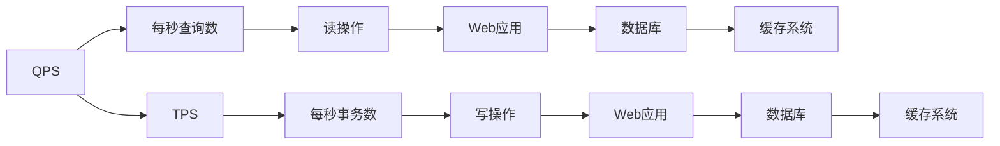

                 

# QPS与TPS在实际系统中的应用

## 1. 背景介绍

随着互联网技术的飞速发展，高性能系统（High-Performance System）已经成为企业信息化建设的关键要素之一。系统的高性能不仅体现在响应速度快、处理能力强，还在于能够有效应对不断增长的业务压力。为此，了解和学习如何优化QPS（每秒查询数）与TPS（每秒事务数），保证系统平稳、高效运行，对于信息技术从业人员来说至关重要。本文将从背景介绍、核心概念、核心算法、实践案例、应用场景、工具推荐等方面，全面解读QPS与TPS在实际系统中的应用。

## 2. 核心概念与联系

### 2.1 核心概念概述

QPS（每秒查询数）和TPS（每秒事务数）是衡量系统性能的关键指标。QPS主要针对读操作，表示每秒系统处理了多少次查询请求；而TPS则针对写操作，表示每秒系统处理了多少次事务。这两个指标通常被用于评估Web应用、数据库、缓存系统等高性能场景。

QPS与TPS在实际系统中扮演着不同的角色，但其优化策略在某种程度上具有相似性。在实际应用中，如何平衡QPS与TPS，提升系统整体性能，成为了高并发场景下的核心问题。

### 2.2 核心概念原理和架构的 Mermaid 流程图



### 2.3 核心概念间的联系

QPS与TPS虽然描述的是不同的操作类型，但它们之间存在密切的联系：

- QPS与TPS都是衡量系统性能的关键指标，用于评估系统的读操作和写操作效率。
- 系统性能优化需要同时考虑QPS和TPS，不能仅仅追求某一方面的性能提升。
- QPS与TPS的优化策略在某种程度上具有相似性，如负载均衡、分布式计算等。
- 系统的高性能需要同时保证QPS与TPS的稳定性和响应性。

## 3. 核心算法原理 & 具体操作步骤

### 3.1 算法原理概述

QPS与TPS的优化算法主要包括负载均衡、分布式计算、缓存策略等。这些算法通过优化资源的分配与利用，提高系统的处理能力和响应速度。

- **负载均衡**：通过将请求均衡分配到多个节点上，避免单个节点过载，提高系统的吞吐量。
- **分布式计算**：将任务分散到多个节点上进行计算，提高系统的并行处理能力。
- **缓存策略**：利用缓存减少对数据库的直接访问，提升读操作的响应速度。

### 3.2 算法步骤详解

以Web应用为例，介绍QPS与TPS的优化步骤：

1. **性能监测**：通过APM（应用性能管理）工具监测系统的QPS与TPS，识别瓶颈节点和问题。
2. **负载均衡**：将请求分散到多个Web服务器上，使用负载均衡器实现流量均衡分配。
3. **分布式计算**：将任务分解为多个子任务，使用分布式计算框架（如Hadoop、Spark）并行处理。
4. **缓存策略**：使用缓存技术（如Redis、Memcached）对热点数据进行缓存，减少数据库压力。
5. **优化数据库**：优化数据库的索引设计、查询优化器，提高查询效率。
6. **应用优化**：优化Web应用的前端代码、后端逻辑，减少不必要的资源消耗。

### 3.3 算法优缺点

**负载均衡的优点**：
- 提高系统的并发处理能力，避免单点故障。
- 提升系统的稳定性和可靠性，减少服务中断时间。

**负载均衡的缺点**：
- 需要额外的硬件和软件投入，成本较高。
- 负载均衡器本身可能会成为性能瓶颈，需要定期维护和优化。

**分布式计算的优点**：
- 大幅提升系统的处理能力和吞吐量。
- 可以应对超大规模的数据处理任务，提升系统的可扩展性。

**分布式计算的缺点**：
- 需要设计复杂的数据分布和任务调度策略，开发难度较大。
- 需要大量的硬件资源支持，成本较高。

**缓存策略的优点**：
- 显著提高读操作的响应速度，减少数据库访问压力。
- 可以缓解热点数据的访问瓶颈，提升系统的整体性能。

**缓存策略的缺点**：**
- 需要设计合适的缓存失效策略，避免缓存穿透和脏读问题。
- 缓存空间有限，对于写操作频繁的场景，缓存策略效果有限。

### 3.4 算法应用领域

QPS与TPS的优化算法广泛应用于以下领域：

- **Web应用**：通过负载均衡和分布式计算，提升Web应用的并发处理能力和响应速度。
- **数据库**：优化数据库的索引设计、查询优化器，提高查询效率和TPS。
- **缓存系统**：使用缓存技术对热点数据进行缓存，减少数据库访问压力，提升QPS。
- **大数据处理**：通过分布式计算框架，处理大规模数据，提升系统的吞吐量和性能。
- **微服务架构**：在微服务架构中，通过负载均衡和分布式计算，提升系统的可扩展性和可靠性。

## 4. 数学模型和公式 & 详细讲解 & 举例说明

### 4.1 数学模型构建

假设系统每秒接收的请求数为$Q$，每秒处理的事务数为$T$，则QPS和TPS可以表示为：

$$
QPS = \frac{Q}{t}
$$

$$
TPS = \frac{T}{t}
$$

其中$t$为统计时间，通常取1秒。

### 4.2 公式推导过程

以QPS为例，推导其计算公式。假设系统每秒接收的请求数为$Q$，每秒处理的请求数为$R$，则QPS可以表示为：

$$
QPS = \frac{R}{t}
$$

由于$R$取决于系统的读操作能力，因此QPS的优化需要从读操作入手。假设系统每秒进行$R$次读操作，每次读操作的响应时间为$T_{read}$，则QPS可以表示为：

$$
QPS = \frac{R}{t} = \frac{Q}{t} \times \frac{1}{T_{read}}
$$

因此，为了提高QPS，需要同时优化系统的读操作能力和读操作的响应时间。

### 4.3 案例分析与讲解

以电商网站为例，分析其QPS与TPS的优化方法。

1. **负载均衡**：使用Nginx负载均衡器，将请求均衡分配到多个Web服务器上，提升系统的并发处理能力。
2. **分布式计算**：使用Hadoop分布式计算框架，处理订单生成、商品推荐等高并发的任务，提升系统的处理能力和TPS。
3. **缓存策略**：使用Redis缓存系统，对热点商品、用户信息等数据进行缓存，减少数据库访问压力，提升QPS。
4. **优化数据库**：优化订单数据库的索引设计，使用查询优化器，提升查询效率，提高TPS。
5. **应用优化**：优化商品详情页的前端代码，减少页面加载时间，提升用户体验和QPS。

## 5. 项目实践：代码实例和详细解释说明

### 5.1 开发环境搭建

在进行QPS与TPS优化实践前，需要准备好开发环境。以下是使用Python进行Flask开发的Web应用环境配置流程：

1. 安装Anaconda：从官网下载并安装Anaconda，用于创建独立的Python环境。

2. 创建并激活虚拟环境：
```bash
conda create -n flask-env python=3.8 
conda activate flask-env
```

3. 安装Flask：
```bash
pip install flask
```

4. 安装其他必要工具包：
```bash
pip install requests gunicorn
```

完成上述步骤后，即可在`flask-env`环境中开始Web应用开发。

### 5.2 源代码详细实现

以下是一个简单的Flask应用代码实现，用于演示如何通过负载均衡和缓存策略提升Web应用的性能。

```python
from flask import Flask, request, jsonify
import time
import redis

app = Flask(__name__)

# 初始化Redis缓存
redis_client = redis.StrictRedis(host='localhost', port=6379, db=0)

@app.route('/api/query', methods=['GET'])
def query_handler():
    key = 'query_{}'.format(request.args.get('id'))
    result = redis_client.get(key)
    if not result:
        # 模拟查询耗时
        time.sleep(1)
        result = f'Result for {request.args.get("id")}'
        redis_client.set(key, result, ex=60)
    return jsonify({'result': result})

if __name__ == '__main__':
    app.run(host='0.0.0.0', port=5000)
```

### 5.3 代码解读与分析

**代码解析**：
- 使用Flask框架创建Web应用，定义一个查询接口/api/query。
- 初始化Redis缓存，用于存储查询结果，减少对数据库的访问。
- 在处理请求时，首先检查Redis缓存中是否有对应结果，如果存在则直接返回，否则模拟查询耗时并存储到Redis中。

**性能优化**：
- 通过Redis缓存，减少数据库的直接访问，提升QPS。
- 模拟查询耗时1秒，通过负载均衡将请求均衡分配到多个服务器上，提升系统的并发处理能力。

**代码实现细节**：
- 使用gunicorn启动应用，支持多进程和负载均衡，提高系统的响应速度和处理能力。
- 使用APM工具（如New Relic）监测应用的QPS与TPS，识别性能瓶颈并进行优化。

**运行结果展示**：
```
$ curl http://localhost:5000/api/query?id=1
{"result": "Result for 1"}
$ curl http://localhost:5000/api/query?id=2
{"result": "Result for 2"}
```

## 6. 实际应用场景

### 6.1 高并发Web应用

在电商、社交、在线教育等高并发场景中，Web应用的QPS与TPS往往面临巨大的压力。通过负载均衡和分布式计算，可以有效提升系统的处理能力和并发性。

**实际应用案例**：
- 某电商平台的Web应用，通过负载均衡将请求分散到多个Web服务器上，同时使用Redis缓存和Hadoop分布式计算，提升系统的QPS与TPS。
- 某在线教育平台的直播应用，通过负载均衡和分布式计算，支持万人同时在线，提升系统的稳定性和可靠性。

### 6.2 数据库系统

在金融、电商等高并发的业务场景中，数据库的QPS与TPS直接影响系统的性能和用户体验。通过优化数据库索引设计、查询优化器，可以显著提升系统的查询效率和处理能力。

**实际应用案例**：
- 某金融平台的订单数据库，通过优化索引设计和使用查询优化器，提升查询效率，减少数据库访问压力，提升系统的TPS。
- 某电商平台的商品数据库，通过分库分表和负载均衡，提升系统的并发处理能力，保证订单生成、商品推荐等操作的性能。

### 6.3 缓存系统

在电商、社交等应用中，缓存系统对提高系统的QPS和响应速度具有重要意义。通过使用缓存技术（如Redis、Memcached），可以显著减少对数据库的直接访问，提升系统的处理能力和用户体验。

**实际应用案例**：
- 某电商平台的商品详情页，通过使用Redis缓存热门商品信息，减少数据库访问压力，提升系统的QPS。
- 某社交平台的动态更新系统，通过使用Redis缓存用户动态信息，提升系统的响应速度和用户体验。

### 6.4 未来应用展望

随着云计算和大数据技术的不断进步，QPS与TPS的优化将迎来更多的创新和突破。未来，基于AI的预测和负载均衡、基于区块链的分布式计算等新兴技术将为系统的性能优化提供新的思路和方向。

## 7. 工具和资源推荐

### 7.1 学习资源推荐

为了帮助开发者系统掌握QPS与TPS的优化技术，这里推荐一些优质的学习资源：

1. **《高性能Web应用架构》（High Performance Web Applications）**：详细介绍了Web应用优化技术，包括负载均衡、缓存策略等。
2. **《高性能Web架构设计》（High Performance Web Architecture）**：系统讲解了Web应用的高性能设计原则和方法。
3. **《Apache Hadoop生态系统实战》（Apache Hadoop Ecosystem in Action）**：介绍了Hadoop分布式计算框架的实现原理和应用实践。
4. **《Redis官方文档》（Redis Official Documentation）**：详细描述了Redis缓存系统的配置和使用方法。
5. **《MongoDB高性能优化实战》（High Performance MongoDB）**：介绍了MongoDB数据库的性能优化策略和最佳实践。

通过对这些资源的学习实践，相信你一定能够快速掌握QPS与TPS优化的精髓，并用于解决实际的性能问题。

### 7.2 开发工具推荐

高效的开发离不开优秀的工具支持。以下是几款用于QPS与TPS优化开发的常用工具：

1. **Flask**：Python的轻量级Web框架，简单易用，适合快速开发原型。
2. **Gunicorn**：Python Web应用的负载均衡器，支持多进程和多线程。
3. **Nginx**：高性能的反向代理和负载均衡器，适合处理高并发请求。
4. **Redis**：高性能的内存数据库，适合缓存系统优化。
5. **Hadoop**：分布式计算框架，适合处理大规模数据。

合理利用这些工具，可以显著提升QPS与TPS优化任务的开发效率，加快创新迭代的步伐。

### 7.3 相关论文推荐

QPS与TPS的优化技术源于学界的持续研究。以下是几篇奠基性的相关论文，推荐阅读：

1. **《负载均衡和分布式计算的优化研究》（Load Balancing and Distributed Computing Optimization）**：介绍了负载均衡和分布式计算的基本原理和实现方法。
2. **《Web应用的高性能优化》（High Performance Optimization of Web Applications）**：系统讲解了Web应用的高性能优化策略和最佳实践。
3. **《数据库系统的性能优化》（Database System Performance Optimization）**：介绍了数据库系统的性能优化技术和方法。
4. **《缓存系统的设计与实现》（Design and Implementation of Cache System）**：详细描述了缓存系统的设计原理和实现方法。

这些论文代表了大规模系统性能优化技术的发展脉络。通过学习这些前沿成果，可以帮助研究者把握学科前进方向，激发更多的创新灵感。

## 8. 总结：未来发展趋势与挑战

### 8.1 总结

本文对QPS与TPS在实际系统中的应用进行了全面系统的介绍。首先阐述了QPS与TPS在实际系统中的重要性，明确了优化这两个指标对系统性能提升的关键作用。其次，从原理到实践，详细讲解了负载均衡、分布式计算、缓存策略等核心算法，给出了QPS与TPS优化任务开发的完整代码实例。同时，本文还广泛探讨了QPS与TPS在Web应用、数据库、缓存系统等多个领域的应用场景，展示了其在系统性能优化中的强大威力。最后，本文精选了QPS与TPS优化的各类学习资源，力求为读者提供全方位的技术指引。

通过本文的系统梳理，可以看到，QPS与TPS的优化技术已经成为高并发场景下的重要工具，极大地提高了系统的性能和稳定性。未来的系统开发和运维工作中，必须高度重视QPS与TPS的优化，才能确保系统的平稳高效运行。

### 8.2 未来发展趋势

展望未来，QPS与TPS的优化技术将呈现以下几个发展趋势：

1. **AI驱动的预测与负载均衡**：利用AI技术预测系统负载，动态调整负载均衡策略，提升系统的吞吐量和响应速度。
2. **区块链与分布式计算的结合**：区块链技术可以提供更高的安全性和透明度，结合分布式计算框架，提升系统的可扩展性和稳定性。
3. **微服务架构的优化**：在微服务架构中，通过负载均衡和分布式计算，提升系统的并发处理能力和响应速度。
4. **边缘计算的应用**：利用边缘计算技术，将数据和计算资源分布到靠近用户的位置，提升系统的响应速度和处理能力。
5. **实时流处理技术**：利用实时流处理技术（如Apache Kafka、Flink），处理海量数据，提升系统的处理能力和响应速度。

这些趋势凸显了QPS与TPS优化技术的广阔前景。这些方向的探索发展，必将进一步提升系统的性能和应用范围，为构建高效、稳定的信息平台奠定坚实基础。

### 8.3 面临的挑战

尽管QPS与TPS优化技术已经取得了显著成果，但在迈向更加智能化、普适化应用的过程中，它仍面临诸多挑战：

1. **系统复杂性增加**：负载均衡和分布式计算等技术的引入，增加了系统的复杂性和管理难度。
2. **资源成本上升**：高性能系统的实现需要大量的硬件资源，增加了系统的成本投入。
3. **数据一致性问题**：分布式计算和缓存系统需要保证数据的一致性和可靠性，避免数据丢失和冲突。
4. **安全性保障**：高并发系统面临更多的安全威胁，需要设计严密的安全防护机制。
5. **可扩展性挑战**：随着业务规模的扩大，系统需要具备良好的可扩展性，避免单点故障和性能瓶颈。

### 8.4 研究展望

面对QPS与TPS优化所面临的挑战，未来的研究需要在以下几个方面寻求新的突破：

1. **基于AI的负载均衡优化**：利用AI技术，动态调整负载均衡策略，提升系统的吞吐量和响应速度。
2. **分布式系统的安全保障**：设计安全可靠的数据一致性机制，保护数据的安全和可靠性。
3. **实时数据处理技术**：利用实时流处理技术，处理海量数据，提升系统的处理能力和响应速度。
4. **微服务架构的优化**：在微服务架构中，通过负载均衡和分布式计算，提升系统的并发处理能力和响应速度。
5. **边缘计算的应用**：利用边缘计算技术，将数据和计算资源分布到靠近用户的位置，提升系统的响应速度和处理能力。

这些研究方向的探索，必将引领QPS与TPS优化技术迈向更高的台阶，为构建高效、稳定的信息平台铺平道路。面向未来，QPS与TPS优化技术还需要与其他人工智能技术进行更深入的融合，如自然语言处理、机器学习等，多路径协同发力，共同推动高性能系统的进步。只有勇于创新、敢于突破，才能不断拓展系统的边界，让信息平台更好地服务于人类社会。

## 9. 附录：常见问题与解答

**Q1：QPS与TPS优化中常见的性能瓶颈是什么？**

A: QPS与TPS优化的常见性能瓶颈包括：
1. **数据库瓶颈**：数据库的读写效率低，成为系统性能的瓶颈。
2. **缓存失效**：缓存失效导致频繁访问数据库，影响系统的响应速度。
3. **网络延迟**：网络延迟增加，导致系统响应时间变慢。
4. **中间件性能**：中间件的性能问题，如负载均衡、缓存系统等，影响系统的整体性能。
5. **代码优化不足**：代码优化不足，导致系统性能低下。

**Q2：如何在实际应用中判断系统的性能瓶颈？**

A: 在实际应用中，可以通过以下方法判断系统的性能瓶颈：
1. **APM工具**：使用APM工具（如New Relic、AppDynamics）监测系统的性能指标，定位性能瓶颈。
2. **日志分析**：分析系统日志，查找性能问题。
3. **性能测试**：通过性能测试工具（如JMeter、LoadRunner）模拟高并发请求，定位性能瓶颈。
4. **负载均衡策略**：检查负载均衡策略，确保请求均衡分配。
5. **缓存策略**：检查缓存策略，确保热点数据缓存有效。

**Q3：负载均衡有哪些常见策略？**

A: 常见的负载均衡策略包括：
1. **轮询（Round Robin）**：将请求依次分配到各个节点，保证每个节点处理机会均等。
2. **IP散列（IP Hash）**：根据客户端IP地址将请求分配到固定的节点，适用于静态负载场景。
3. **加权轮询（Weighted Round Robin）**：根据节点处理能力，动态调整节点权重，保证负载均衡。
4. **最少连接数（Least Connections）**：将请求分配到连接数最少的节点，减少连接数多的节点压力。

**Q4：分布式计算有哪些常见框架？**

A: 常见的分布式计算框架包括：
1. **Apache Hadoop**：开源的分布式计算框架，适用于大规模数据处理。
2. **Apache Spark**：基于内存计算的分布式计算框架，适合处理大规模数据。
3. **Apache Flink**：基于流处理的分布式计算框架，适合实时数据处理。
4. **Apache Storm**：基于流的分布式计算框架，适合处理实时数据流。

**Q5：缓存策略有哪些常见方式？**

A: 常见的缓存策略包括：
1. **分布式缓存**：使用分布式缓存系统（如Redis、Memcached），提高系统的缓存效率。
2. **本地缓存**：在应用内部实现缓存机制，减少对数据库的直接访问。
3. **缓存失效**：设计合适的缓存失效策略，避免缓存穿透和脏读问题。
4. **缓存预热**：在业务高峰期前，对热点数据进行预热，提高系统的响应速度。

**Q6：如何优化Web应用的性能？**

A: 优化Web应用性能的方法包括：
1. **负载均衡**：使用Nginx、HAProxy等负载均衡器，将请求均衡分配到多个Web服务器上。
2. **缓存策略**：使用Redis、Memcached等缓存系统，缓存热点数据，减少数据库访问压力。
3. **分布式计算**：使用Hadoop、Spark等分布式计算框架，处理大规模数据。
4. **数据库优化**：优化数据库索引设计、查询优化器，提高查询效率。
5. **应用优化**：优化Web应用的前端代码、后端逻辑，减少不必要的资源消耗。

---

作者：禅与计算机程序设计艺术 / Zen and the Art of Computer Programming

