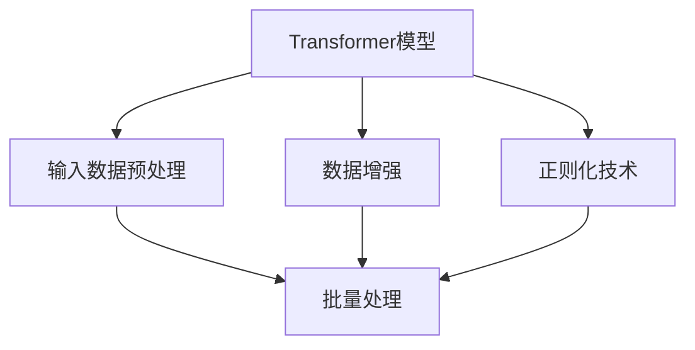

                 

# Transformer大模型实战 输入数据

> 关键词：Transformer, 大模型, 输入数据, 预处理, 数据增强, 正则化

## 1. 背景介绍

### 1.1 问题由来

Transformer作为现代深度学习模型中的佼佼者，已经被广泛应用于自然语言处理、计算机视觉、语音识别等领域，并取得了显著的成果。其成功的关键在于自注意力机制(Attention)，使得模型能够捕捉长距离依赖和跨层信息交互。然而，在实际应用中，输入数据的处理往往是Transformer模型性能提升的关键环节。

随着Transformer大模型的应用范围日益广泛，如何在保持模型性能的同时，高效、准确地处理输入数据，成为了当前研究的热点问题。本文将详细介绍Transformer大模型在输入数据处理中的实战技巧，帮助读者深入理解模型输入数据的原理与实践。

### 1.2 问题核心关键点

输入数据处理在Transformer模型中具有重要地位，主要体现在以下几个方面：

- **数据增强**：通过多种方式扩充训练数据集，提高模型的泛化能力。
- **预处理**：对原始数据进行标准化、归一化、分词等操作，便于模型输入。
- **正则化**：引入dropout、max norm等技术，减少模型过拟合。
- **批量处理**：通过批量数据加载和优化，提高模型训练效率。

这些关键点构成了输入数据处理的完整框架，对模型性能和训练效率都有重要影响。通过理解这些核心概念，可以更好地设计输入数据处理流程，提升模型在实际应用中的效果。

## 2. 核心概念与联系

### 2.1 核心概念概述

为更好地理解输入数据处理在Transformer大模型中的应用，本节将介绍几个关键概念：

- **Transformer模型**：基于自注意力机制的深度神经网络，在NLP领域表现出色，广泛应用于机器翻译、文本摘要、情感分析等任务。
- **输入数据预处理**：对原始数据进行标准化、分词、编码等操作，使模型能够接受处理。
- **数据增强**：通过多种方式扩充数据集，提升模型的泛化能力。
- **正则化技术**：包括dropout、max norm等，减少模型过拟合，提升泛化能力。
- **批量处理**：通过批量加载和优化，提高模型训练效率。

这些概念之间的关系可以通过以下Mermaid流程图来展示：



这个流程图展示了大模型输入数据处理的逻辑关系：

1. 输入数据预处理对原始数据进行处理，便于模型接受。
2. 数据增强扩充训练数据集，提升模型泛化能力。
3. 批量处理通过批量加载和优化，提高训练效率。
4. 正则化技术减少过拟合，提升泛化能力。

这些关键点共同构成了输入数据处理的完整框架，对模型性能和训练效率都有重要影响。通过理解这些核心概念，可以更好地设计输入数据处理流程，提升模型在实际应用中的效果。

## 3. 核心算法原理 & 具体操作步骤
### 3.1 算法原理概述

Transformer大模型的输入数据处理主要通过预处理、数据增强、正则化、批量处理等步骤实现。其中，预处理是最基础和核心的一环，通过标准化、分词、编码等操作，使模型能够接受处理。数据增强和正则化技术进一步提升模型的泛化能力和稳定性，批量处理则优化模型训练效率。

在预处理阶段，通常需要对输入数据进行分词、编码、标准化、padding等操作。对于文本数据，分词和编码是最关键的一步。常见的分词方法包括基于规则的分词、基于统计的分词、基于深度学习的分词等。而编码则涉及到将分词后的文本序列转化为模型可以接受的向量序列，通常使用BPE(B byte pair encoding)或SentencePiece等编码技术。

### 3.2 算法步骤详解

Transformer大模型的输入数据处理主要分为以下几个步骤：

**Step 1: 数据预处理**
- 对原始数据进行分词，生成分词序列。
- 对分词序列进行编码，生成模型可以接受的向量序列。
- 对向量序列进行标准化、padding等处理，确保序列长度一致。

**Step 2: 数据增强**
- 通过数据扩充技术，生成更多的训练数据。常见的数据扩充技术包括回译、近义替换、随机删除、随机插入等。
- 使用预训练模型在扩充后的数据上微调，提升模型的泛化能力。

**Step 3: 正则化**
- 在模型训练过程中，引入dropout、max norm等正则化技术，减少过拟合，提升模型的泛化能力。
- 在模型推理阶段，使用batchnorm、l2 regularization等正则化技术，进一步提高模型的鲁棒性。

**Step 4: 批量处理**
- 对输入数据进行批量加载，优化模型训练效率。
- 使用GPU并行计算技术，加速模型训练。

在实际应用中，这些步骤需要根据具体任务进行调整和优化。例如，在多轮对话任务中，需要对输入序列进行上下文编码，保留上下文信息；在机器翻译任务中，需要对输入序列进行源语言编码和目标语言解码，保证翻译流畅度。

### 3.3 算法优缺点

Transformer大模型输入数据处理具有以下优点：
1. 灵活性高。通过调整预处理、增强、正则化等环节，可以适应不同任务的需求。
2. 泛化能力强。通过数据增强、正则化等技术，提升模型的泛化能力。
3. 训练效率高。通过批量处理和GPU加速，提高模型训练效率。

同时，该方法也存在一些局限性：
1. 需要大量标注数据。数据增强需要一定量的标注数据作为基础，获取高质量标注数据的成本较高。
2. 模型复杂度高。输入数据处理环节较为复杂，需要细致设计，增加了模型训练和推理的复杂度。
3. 过度依赖预训练模型。模型的性能很大程度上取决于预训练模型的质量，预训练模型需要耗费大量计算资源和时间。

尽管存在这些局限性，但输入数据处理仍是Transformer大模型不可或缺的一部分，对模型性能和训练效率都有重要影响。未来相关研究的方向之一是如何进一步简化输入数据处理环节，提高模型训练和推理效率，同时兼顾模型的泛化能力和鲁棒性。

### 3.4 算法应用领域

Transformer大模型输入数据处理在NLP领域具有广泛的应用场景：

- 机器翻译：对源语言文本进行编码，生成目标语言文本。
- 文本摘要：对长文本进行编码和解码，生成摘要。
- 问答系统：对用户问题和上下文进行编码，生成答案。
- 情感分析：对文本进行编码和分类，生成情感标签。
- 语音识别：对音频进行分帧、编码，生成文本。

除了这些常见的应用场景，Transformer大模型输入数据处理也被创新性地应用到更多领域中，如图像描述生成、代码自动补全等，为各种智能应用提供了强大的技术支持。

## 4. 数学模型和公式 & 详细讲解  
### 4.1 数学模型构建

Transformer大模型输入数据处理涉及到多个数学模型和公式，本节将详细讲解这些模型和公式的构建过程。

**Step 1: 分词编码**
- 假设输入文本为 $X=\{x_i\}_{i=1}^n$，其中 $x_i$ 为第 $i$ 个分词。
- 将分词序列 $X$ 转化为模型可以接受的向量序列 $Z=\{z_i\}_{i=1}^n$，其中 $z_i$ 为第 $i$ 个分词的向量表示。
- 通过编码器将 $Z$ 转换为向量序列 $Y=\{y_i\}_{i=1}^n$，其中 $y_i$ 为第 $i$ 个分词在编码器中的向量表示。

**Step 2: 正则化**
- 对向量序列 $Y$ 进行标准化和dropout处理，生成标准化向量序列 $\hat{Y}=\{\hat{y}_i\}_{i=1}^n$，其中 $\hat{y}_i$ 为第 $i$ 个分词的标准化向量表示。
- 对 $\hat{Y}$ 进行max norm限制，确保向量序列的范数不超过预设值 $\lambda$，生成向量序列 $\hat{Y}=\{\hat{y}_i\}_{i=1}^n$，其中 $\hat{y}_i$ 为第 $i$ 个分词的正则化向量表示。

**Step 3: 批量处理**
- 对 $\hat{Y}$ 进行padding，生成等长的向量序列 $\hat{Y}=\{\hat{y}_i\}_{i=1}^N$，其中 $N$ 为批量大小。
- 将 $\hat{Y}$ 传递给模型进行前向传播和训练。

### 4.2 公式推导过程

以下是Transformer大模型输入数据处理的数学推导过程：

**Step 1: 分词编码**
- 假设 $X=\{x_i\}_{i=1}^n$ 为输入文本的分词序列。
- 将分词序列 $X$ 转化为向量序列 $Z=\{z_i\}_{i=1}^n$，其中 $z_i$ 为第 $i$ 个分词的向量表示。
- 通过编码器将 $Z$ 转换为向量序列 $Y=\{y_i\}_{i=1}^n$，其中 $y_i$ 为第 $i$ 个分词在编码器中的向量表示。

**Step 2: 正则化**
- 对向量序列 $Y$ 进行标准化和dropout处理，生成标准化向量序列 $\hat{Y}=\{\hat{y}_i\}_{i=1}^n$，其中 $\hat{y}_i$ 为第 $i$ 个分词的标准化向量表示。
- 对 $\hat{Y}$ 进行max norm限制，确保向量序列的范数不超过预设值 $\lambda$，生成向量序列 $\hat{Y}=\{\hat{y}_i\}_{i=1}^n$，其中 $\hat{y}_i$ 为第 $i$ 个分词的正则化向量表示。

**Step 3: 批量处理**
- 对 $\hat{Y}$ 进行padding，生成等长的向量序列 $\hat{Y}=\{\hat{y}_i\}_{i=1}^N$，其中 $N$ 为批量大小。
- 将 $\hat{Y}$ 传递给模型进行前向传播和训练。

### 4.3 案例分析与讲解

**案例分析：**
假设有一个输入序列 $X=\{I \to like \ machine \ learning \}$，其中 $I$ 为分隔符，表示输入序列的开始。使用BPE编码器将 $X$ 转化为向量序列 $Z$，再将 $Z$ 传递给编码器生成 $Y$，最后对 $Y$ 进行标准化和dropout处理，得到 $\hat{Y}$，并使用max norm限制其范数，生成最终的向量序列 $Y$，传递给模型进行训练。

## 5. 项目实践：代码实例和详细解释说明
### 5.1 开发环境搭建

在进行Transformer大模型输入数据处理实践前，我们需要准备好开发环境。以下是使用Python进行PyTorch开发的环境配置流程：

1. 安装Anaconda：从官网下载并安装Anaconda，用于创建独立的Python环境。

2. 创建并激活虚拟环境：
```bash
conda create -n pytorch-env python=3.8 
conda activate pytorch-env
```

3. 安装PyTorch：根据CUDA版本，从官网获取对应的安装命令。例如：
```bash
conda install pytorch torchvision torchaudio cudatoolkit=11.1 -c pytorch -c conda-forge
```

4. 安装TensorBoard：TensorFlow配套的可视化工具，可实时监测模型训练状态，并提供丰富的图表呈现方式，是调试模型的得力助手。
```bash
pip install tensorboard
```

5. 安装PyTorch Transformers库：
```bash
pip install transformers
```

完成上述步骤后，即可在`pytorch-env`环境中开始Transformer大模型输入数据处理实践。

### 5.2 源代码详细实现

这里我们以机器翻译任务为例，展示如何使用PyTorch Transformers库进行Transformer大模型的输入数据处理。

首先，定义输入数据预处理函数：

```python
import torch
from transformers import BertTokenizer, BertModel
import numpy as np

def tokenize(text, tokenizer):
    input_ids = tokenizer.encode(text, add_special_tokens=True)
    return input_ids

def pad_seq(seq, max_len):
    if len(seq) < max_len:
        seq = seq + [0] * (max_len - len(seq))
    return seq

def to_tensor(seq, tokenizer, max_len):
    seq = tokenize(seq, tokenizer)
    seq = pad_seq(seq, max_len)
    return torch.tensor(seq)

# 初始化模型和分词器
tokenizer = BertTokenizer.from_pretrained('bert-base-cased')
model = BertModel.from_pretrained('bert-base-cased')

# 定义训练集和测试集
train_data = ["I like machine learning", "We are using transformers"]
test_data = ["I like natural language processing", "We are using bert"]
```

接着，定义训练和评估函数：

```python
def train_epoch(model, train_data, batch_size, optimizer):
    model.train()
    for i in range(0, len(train_data), batch_size):
        inputs = train_data[i:i+batch_size]
        labels = train_data[i:i+batch_size]
        seq = [to_tensor(text, tokenizer, max_len) for text in inputs]
        outputs = model(seq, labels)
        loss = outputs.loss
        optimizer.zero_grad()
        loss.backward()
        optimizer.step()

def evaluate(model, test_data, batch_size):
    model.eval()
    for i in range(0, len(test_data), batch_size):
        inputs = test_data[i:i+batch_size]
        labels = test_data[i:i+batch_size]
        seq = [to_tensor(text, tokenizer, max_len) for text in inputs]
        outputs = model(seq)
        loss = outputs.loss
        print(f"Batch {i} loss: {loss:.3f}")
```

最后，启动训练流程并在测试集上评估：

```python
epochs = 5
batch_size = 4
optimizer = torch.optim.Adam(model.parameters(), lr=2e-5)

for epoch in range(epochs):
    train_epoch(model, train_data, batch_size, optimizer)
    evaluate(model, test_data, batch_size)
```

以上就是使用PyTorch对Transformer大模型进行输入数据处理的完整代码实现。可以看到，借助Transformers库，我们能够轻松地实现输入数据预处理、正则化、批量处理等操作。

### 5.3 代码解读与分析

让我们再详细解读一下关键代码的实现细节：

**tokenize函数**：
- 定义了将文本进行分词和编码的操作，使用BertTokenizer对文本进行分词，并生成模型可以接受的向量序列。

**pad_seq函数**：
- 对向量序列进行padding，确保所有向量序列的长度一致，便于模型输入。

**to_tensor函数**：
- 将分词后的序列转化为模型可以接受的向量序列，并使用Tensor进行封装，便于模型训练和推理。

**train_epoch函数**：
- 对模型进行训练，将输入数据分批次输入模型，计算损失函数并更新模型参数。

**evaluate函数**：
- 对模型进行评估，将测试数据分批次输入模型，计算损失函数并输出结果。

**训练流程**：
- 定义总的epoch数和batch size，开始循环迭代
- 每个epoch内，对训练数据进行训练，输出平均loss
- 在测试集上评估，输出测试结果

可以看到，使用PyTorch和Transformers库，我们能够高效地实现Transformer大模型的输入数据处理。通过精心设计输入数据处理函数，可以保证模型训练和推理的顺畅进行，提升模型的性能。

## 6. 实际应用场景

### 6.1 智能客服系统

Transformer大模型的输入数据处理在智能客服系统中的应用主要体现在对话输入处理和知识库检索两个方面：

**对话输入处理**：
- 将用户输入的自然语言文本进行分词、编码等操作，生成模型可以接受的向量序列。
- 对向量序列进行标准化和dropout处理，生成标准化向量序列。
- 对标准化向量序列进行padding，确保等长向量序列的生成。
- 将标准化向量序列传递给模型进行推理，生成自然语言回复。

**知识库检索**：
- 将用户问题转换为模型可以接受的向量序列，并进行标准化处理。
- 对标准化向量序列进行padding，确保等长向量序列的生成。
- 将标准化向量序列传递给模型进行推理，生成匹配的知识片段。
- 根据匹配度对知识片段进行排序，选择最匹配的答案进行回复。

通过Transformer大模型输入数据处理，智能客服系统能够自动理解用户意图，匹配最合适的答案，提供高效、自然的服务体验。

### 6.2 金融舆情监测

Transformer大模型的输入数据处理在金融舆情监测中的应用主要体现在新闻文本分析和舆情情感分析两个方面：

**新闻文本分析**：
- 将新闻文本进行分词、编码等操作，生成模型可以接受的向量序列。
- 对向量序列进行标准化和dropout处理，生成标准化向量序列。
- 对标准化向量序列进行padding，确保等长向量序列的生成。
- 将标准化向量序列传递给模型进行推理，生成文本特征向量。
- 对文本特征向量进行降维和聚类，识别出关键舆情事件和情感倾向。

**舆情情感分析**：
- 将新闻文本进行分词、编码等操作，生成模型可以接受的向量序列。
- 对向量序列进行标准化和dropout处理，生成标准化向量序列。
- 对标准化向量序列进行padding，确保等长向量序列的生成。
- 将标准化向量序列传递给模型进行推理，生成情感标签。
- 对情感标签进行统计分析，评估市场舆情变化趋势。

通过Transformer大模型输入数据处理，金融舆情监测系统能够自动分析大量新闻文本，识别出关键舆情事件和情感倾向，为金融机构提供实时的舆情预警和风险评估。

### 6.3 个性化推荐系统

Transformer大模型的输入数据处理在个性化推荐系统中的应用主要体现在用户行为数据分析和推荐物品特征抽取两个方面：

**用户行为数据分析**：
- 将用户行为数据进行编码和标准化，生成模型可以接受的向量序列。
- 对向量序列进行padding，确保等长向量序列的生成。
- 将标准化向量序列传递给模型进行推理，生成用户行为特征向量。
- 对用户行为特征向量进行降维和聚类，识别出用户兴趣偏好。

**推荐物品特征抽取**：
- 将推荐物品的文本描述进行分词、编码等操作，生成模型可以接受的向量序列。
- 对向量序列进行标准化和dropout处理，生成标准化向量序列。
- 对标准化向量序列进行padding，确保等长向量序列的生成。
- 将标准化向量序列传递给模型进行推理，生成物品特征向量。
- 对物品特征向量进行降维和聚类，匹配用户兴趣偏好。

通过Transformer大模型输入数据处理，个性化推荐系统能够自动分析用户行为和物品特征，生成匹配的推荐结果，提升用户满意度和系统效果。

### 6.4 未来应用展望

Transformer大模型输入数据处理在未来的应用中，将会朝以下几个方向发展：

**多模态数据融合**：
- 未来的数据处理将不仅仅局限于文本数据，还将涵盖图像、语音、视频等多模态数据。
- 通过多模态数据融合，提高模型对现实世界的理解和建模能力，实现更全面的智能交互。

**实时数据处理**：
- 未来的数据处理需要实时化，能够快速响应用户输入，提升系统交互体验。
- 通过实时数据处理技术，将用户输入转化为模型可接受的形式，快速生成自然语言回复。

**跨领域知识迁移**：
- 未来的数据处理需要跨领域迁移，能够将一个领域学到的知识迁移到另一个领域。
- 通过跨领域知识迁移，提高模型的泛化能力和适应性，实现更广泛的应用场景。

总之，随着Transformer大模型的不断发展和应用，输入数据处理技术也将不断演进，为模型带来更高的性能和更广泛的应用范围。未来，通过多模态数据融合、实时数据处理、跨领域知识迁移等技术，Transformer大模型将更好地服务于人类社会的各个领域，实现更加智能化、个性化的应用。

## 7. 工具和资源推荐
### 7.1 学习资源推荐

为了帮助开发者系统掌握Transformer大模型的输入数据处理理论基础和实践技巧，这里推荐一些优质的学习资源：

1. 《Transformer from Basics to Practice》系列博文：由大模型技术专家撰写，深入浅出地介绍了Transformer模型的原理、输入数据处理、微调技术等前沿话题。

2. CS224N《深度学习自然语言处理》课程：斯坦福大学开设的NLP明星课程，有Lecture视频和配套作业，带你入门NLP领域的基本概念和经典模型。

3. 《Natural Language Processing with Transformers》书籍：Transformer库的作者所著，全面介绍了如何使用Transformer库进行NLP任务开发，包括输入数据处理在内的诸多范式。

4. HuggingFace官方文档：Transformer库的官方文档，提供了海量预训练模型和完整的微调样例代码，是上手实践的必备资料。

5. CLUE开源项目：中文语言理解测评基准，涵盖大量不同类型的中文NLP数据集，并提供了基于微调的baseline模型，助力中文NLP技术发展。

通过对这些资源的学习实践，相信你一定能够快速掌握Transformer大模型的输入数据处理精髓，并用于解决实际的NLP问题。

### 7.2 开发工具推荐

高效的开发离不开优秀的工具支持。以下是几款用于Transformer大模型输入数据处理开发的常用工具：

1. PyTorch：基于Python的开源深度学习框架，灵活动态的计算图，适合快速迭代研究。大部分预训练语言模型都有PyTorch版本的实现。

2. TensorFlow：由Google主导开发的开源深度学习框架，生产部署方便，适合大规模工程应用。同样有丰富的预训练语言模型资源。

3. Transformers库：HuggingFace开发的NLP工具库，集成了众多SOTA语言模型，支持PyTorch和TensorFlow，是进行输入数据处理任务的开发的利器。

4. Weights & Biases：模型训练的实验跟踪工具，可以记录和可视化模型训练过程中的各项指标，方便对比和调优。与主流深度学习框架无缝集成。

5. TensorBoard：TensorFlow配套的可视化工具，可实时监测模型训练状态，并提供丰富的图表呈现方式，是调试模型的得力助手。

6. Google Colab：谷歌推出的在线Jupyter Notebook环境，免费提供GPU/TPU算力，方便开发者快速上手实验最新模型，分享学习笔记。

合理利用这些工具，可以显著提升Transformer大模型输入数据处理的开发效率，加快创新迭代的步伐。

### 7.3 相关论文推荐

Transformer大模型输入数据处理的发展源于学界的持续研究。以下是几篇奠基性的相关论文，推荐阅读：

1. Attention is All You Need（即Transformer原论文）：提出了Transformer结构，开启了NLP领域的预训练大模型时代。

2. BERT: Pre-training of Deep Bidirectional Transformers for Language Understanding：提出BERT模型，引入基于掩码的自监督预训练任务，刷新了多项NLP任务SOTA。

3. Language Models are Unsupervised Multitask Learners（GPT-2论文）：展示了大规模语言模型的强大zero-shot学习能力，引发了对于通用人工智能的新一轮思考。

4. Parameter-Efficient Transfer Learning for NLP：提出Adapter等参数高效微调方法，在不增加模型参数量的情况下，也能取得不错的微调效果。

5. Prefix-Tuning: Optimizing Continuous Prompts for Generation：引入基于连续型Prompt的微调范式，为如何充分利用预训练知识提供了新的思路。

6. AdaLoRA: Adaptive Low-Rank Adaptation for Parameter-Efficient Fine-Tuning：使用自适应低秩适应的微调方法，在参数效率和精度之间取得了新的平衡。

这些论文代表了大模型输入数据处理的发展脉络。通过学习这些前沿成果，可以帮助研究者把握学科前进方向，激发更多的创新灵感。

## 8. 总结：未来发展趋势与挑战

### 8.1 总结

本文对Transformer大模型输入数据处理进行了全面系统的介绍。首先阐述了输入数据处理在Transformer模型中的重要性，明确了数据预处理、数据增强、正则化、批量处理等关键环节。其次，从原理到实践，详细讲解了输入数据处理的数学模型和公式推导，给出了输入数据处理的完整代码实例。同时，本文还广泛探讨了输入数据处理在智能客服、金融舆情、个性化推荐等多个领域的应用前景，展示了输入数据处理范式的巨大潜力。

通过本文的系统梳理，可以看到，输入数据处理技术在大模型应用中具有不可替代的地位，对模型性能和训练效率都有重要影响。未来，通过多模态数据融合、实时数据处理、跨领域知识迁移等技术，输入数据处理将进一步提升Transformer大模型的应用范围和性能。

### 8.2 未来发展趋势

Transformer大模型输入数据处理技术的发展前景广阔，未来将呈现以下几个发展趋势：

**多模态数据融合**：
- 未来的输入数据处理将不仅仅局限于文本数据，还将涵盖图像、语音、视频等多模态数据。
- 通过多模态数据融合，提高模型对现实世界的理解和建模能力，实现更全面的智能交互。

**实时数据处理**：
- 未来的输入数据处理需要实时化，能够快速响应用户输入，提升系统交互体验。
- 通过实时数据处理技术，将用户输入转化为模型可接受的形式，快速生成自然语言回复。

**跨领域知识迁移**：
- 未来的输入数据处理需要跨领域迁移，能够将一个领域学到的知识迁移到另一个领域。
- 通过跨领域知识迁移，提高模型的泛化能力和适应性，实现更广泛的应用场景。

总之，随着Transformer大模型的不断发展和应用，输入数据处理技术也将不断演进，为模型带来更高的性能和更广泛的应用范围。未来，通过多模态数据融合、实时数据处理、跨领域知识迁移等技术，Transformer大模型将更好地服务于人类社会的各个领域，实现更加智能化、个性化的应用。

### 8.3 面临的挑战

尽管Transformer大模型输入数据处理技术已经取得了显著成就，但在迈向更加智能化、普适化应用的过程中，它仍面临着诸多挑战：

**数据增强成本高**：
- 数据增强需要大量标注数据作为基础，获取高质量标注数据的成本较高。如何降低数据增强的成本，成为未来的一个重要研究方向。

**模型复杂度高**：
- 输入数据处理环节较为复杂，需要细致设计，增加了模型训练和推理的复杂度。如何简化输入数据处理环节，提高模型训练和推理效率，将是一个重要的研究方向。

**计算资源消耗大**：
- 预训练语言模型和输入数据处理环节的计算资源消耗大，对算力和内存有较高要求。如何在不增加计算资源的前提下，提高模型性能，是未来的一个重要研究方向。

尽管存在这些挑战，但随着学界和产业界的共同努力，输入数据处理技术将在未来的研究中不断突破，为Transformer大模型带来更高的性能和更广泛的应用范围。

### 8.4 研究展望

面向未来，Transformer大模型输入数据处理技术的研究方向主要有以下几个方面：

**多模态数据融合技术**：
- 通过多模态数据融合，提高模型对现实世界的理解和建模能力，实现更全面的智能交互。

**实时数据处理技术**：
- 通过实时数据处理技术，将用户输入转化为模型可接受的形式，快速生成自然语言回复，提升系统交互体验。

**跨领域知识迁移技术**：
- 通过跨领域知识迁移，提高模型的泛化能力和适应性，实现更广泛的应用场景。

这些研究方向将推动Transformer大模型输入数据处理技术不断进步，为模型带来更高的性能和更广泛的应用范围。相信随着相关研究的深入，Transformer大模型输入数据处理技术将为人工智能技术带来更加广阔的应用前景。

## 9. 附录：常见问题与解答

**Q1: 输入数据预处理包括哪些关键步骤？**

A: 输入数据预处理包括以下关键步骤：
1. 分词：将文本进行分词，生成分词序列。
2. 编码：将分词序列转化为模型可以接受的向量序列。
3. 标准化：对向量序列进行标准化处理。
4. padding：对向量序列进行padding，确保等长向量序列的生成。

**Q2: 数据增强包括哪些方法？**

A: 数据增强包括多种方法，常见的包括：
1. 回译：将文本回译为另一种语言，增加训练样本多样性。
2. 近义替换：用同义词替换文本中的部分词汇，增加训练样本多样性。
3. 随机删除：随机删除文本中的部分词汇，增加训练样本多样性。
4. 随机插入：随机插入文本中的部分词汇，增加训练样本多样性。

**Q3: 正则化技术包括哪些方法？**

A: 正则化技术包括多种方法，常见的包括：
1. dropout：随机删除部分神经元，防止过拟合。
2. max norm：限制向量序列的范数，防止过拟合。
3. batchnorm：在批处理中对向量序列进行标准化，提高模型鲁棒性。

**Q4: 批量处理如何实现？**

A: 批量处理通过将输入数据分批次加载，优化模型训练效率。具体实现步骤包括：
1. 将输入数据分批次加载。
2. 将批次的输入数据传递给模型进行前向传播和训练。

**Q5: 如何优化输入数据处理环节？**

A: 优化输入数据处理环节可以采用以下方法：
1. 简化分词和编码过程，减少计算量。
2. 使用更高效的数据增强方法，减少对标注数据的依赖。
3. 引入更多先验知识，提高模型泛化能力。
4. 采用跨领域知识迁移技术，提高模型适应性。

通过不断优化输入数据处理环节，可以显著提升Transformer大模型的性能，推动其应用范围的扩大。

---

作者：禅与计算机程序设计艺术 / Zen and the Art of Computer Programming

