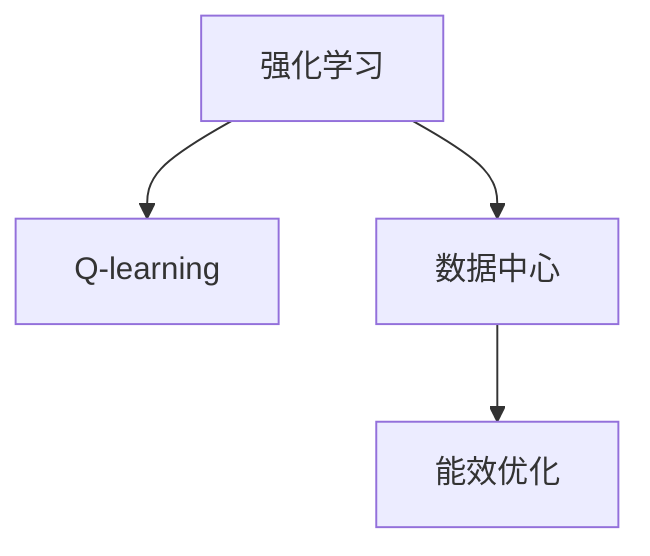

                 

# 一切皆是映射：AI Q-learning在数据中心能源管理的锐利工具

## 1. 背景介绍

### 1.1 问题由来
数据中心是现代信息技术的基础设施，其能源消耗占全球电力消费的2%，并随着云计算和人工智能技术的发展呈指数级增长。数据中心的能源管理对于优化资源利用、降低成本、减少碳排放具有重要意义。传统的能源管理依赖于规则和策略，但随着数据中心规模的扩大和复杂度的提高，这种静态策略已经无法应对实时动态的环境变化。

### 1.2 问题核心关键点
AI Q-learning 是一种基于Q-learning的强化学习技术，能够通过动态优化调整策略，适应数据中心的复杂环境，从而实现节能减排目标。其核心思想是，在动态变化的环境中，通过智能决策算法，实时调整数据中心的能耗策略，以达到节能和提升能效的目的。

Q-learning是一种模型无关的强化学习算法，通过与环境互动，利用观察到的状态和奖励信息，不断调整策略，最大化长期收益。在数据中心能源管理中，Q-learning的策略是控制数据中心的能耗，目标是最大化系统的能源效率和降低能耗。

### 1.3 问题研究意义
AI Q-learning 在数据中心能源管理中的应用，具有以下几方面的重要意义：

1. **实时动态优化**：AI Q-learning 能够适应数据中心的实时动态变化，自动调整能源策略，优化能效。
2. **全局最优**：通过全局优化策略，能够达到整体能效的提升，而不仅仅是单个设备或系统的优化。
3. **自适应性强**：AI Q-learning 能够自适应不同的数据中心环境，具有较好的通用性。
4. **节能减排**：通过优化数据中心能耗，AI Q-learning 有助于实现碳中和目标，为全球环保做出贡献。
5. **技术推动**：Q-learning 的实际应用能够促进强化学习技术的发展，为更多领域提供借鉴。

## 2. 核心概念与联系

### 2.1 核心概念概述

为更好地理解AI Q-learning在数据中心能源管理中的应用，本节将介绍几个密切相关的核心概念：

- **强化学习(Reinforcement Learning, RL)**：通过智能体与环境的互动，学习最优策略的机器学习方法。强化学习的目标是最大化长期奖励，通常用于复杂决策环境下的智能控制。
- **Q-learning**：一种基于模型无关的强化学习算法，通过观察状态、采取行动和获得奖励，逐步学习最优策略。
- **数据中心(Datamork)**：由多个IT设备和相关设施组成的复杂系统，负责计算和存储数据。
- **能效(Optimization)**：在数据中心运营中，通过优化能源消耗和利用率，提升整体系统的性能和效益。

这些核心概念之间的逻辑关系可以通过以下Mermaid流程图来展示：



这个流程图展示出强化学习、Q-learning和数据中心能效优化之间的关系：

1. 强化学习通过智能体与环境的互动，学习最优策略。
2. Q-learning是强化学习中的一个重要算法，通过观察状态和奖励，逐步学习最优策略。
3. 数据中心的能效优化，可以通过强化学习和Q-learning算法来实现，通过动态调整策略，优化能效。

## 3. 核心算法原理 & 具体操作步骤
### 3.1 算法原理概述

AI Q-learning 在数据中心能源管理中的应用，本质上是一种基于Q-learning的强化学习过程。其核心思想是：在数据中心的复杂环境中，通过智能体与环境的互动，学习最优的能源策略，以达到节能减排的目标。

具体而言，数据中心的智能体（如Q-learning算法）通过观察当前状态（如温度、湿度、设备负载等），采取一定的行动（如调整冷却系统、电源分配等），并获得相应的奖励（如降低能耗、提升性能等）。通过不断调整策略，智能体逐渐学习到最优的能源管理策略，从而实现能效最大化。

### 3.2 算法步骤详解

AI Q-learning 在数据中心能源管理中的应用一般包括以下几个关键步骤：

**Step 1: 构建环境模型**
- 定义数据中心环境的模型，包括设备、设施、传感器等。
- 确定状态空间和动作空间，如温度、湿度、设备负载等。
- 定义状态转移函数，描述环境状态的变化。
- 设计奖励函数，衡量能源策略的效果。

**Step 2: 设计Q-learning策略**
- 初始化Q值表，将每个状态-动作对（s,a）映射到一个Q值。
- 选择合适的探索策略和利用策略，如$\epsilon$-greedy策略。
- 设定学习率、折扣因子等超参数，影响Q值更新的速度和稳定性。

**Step 3: 执行Q-learning训练**
- 在每个时间步，智能体观察当前状态，根据策略选择动作。
- 执行动作，观察环境状态和奖励，更新Q值。
- 迭代执行上述过程，直到达到预设的训练轮数或收敛条件。

**Step 4: 策略应用与调整**
- 在训练完成后，将最优策略应用于实际环境中。
- 实时监测环境状态和奖励，根据当前状态动态调整策略。
- 根据新的经验和数据，定期更新Q值表，适应新的环境变化。

### 3.3 算法优缺点

AI Q-learning 在数据中心能源管理中的应用，具有以下优点：
1. **动态优化**：能够实时适应数据中心的动态变化，自动调整能源策略，达到最优能效。
2. **全局优化**：通过全局优化策略，提升整体系统的能效，而不仅仅是单个设备或系统的优化。
3. **自适应性强**：能够自适应不同的数据中心环境，具有较好的通用性。
4. **技术可扩展**：基于强化学习，可以应用于更多复杂的决策环境。

同时，该方法也存在一定的局限性：
1. **计算复杂度高**：Q-learning算法需要大量的计算资源，尤其是在高维状态空间中，计算复杂度会显著增加。
2. **状态空间复杂**：数据中心的复杂性和动态性使得状态空间巨大，难以完全建模。
3. **探索与利用平衡**：需要平衡探索和利用策略，避免陷入局部最优。
4. **离线优化困难**：在实际环境中，数据的实时性和环境的多变性，使得离线优化难以直接应用。

尽管存在这些局限性，但就目前而言，AI Q-learning在数据中心能源管理中的应用已经展现出显著的优势，成为一种有效的能源管理工具。

### 3.4 算法应用领域

AI Q-learning在数据中心能源管理中的应用，主要涵盖以下几个领域：

- **冷却系统优化**：通过智能调整冷却系统的运行状态，实现节能减排。
- **电源管理**：通过智能分配电力资源，优化电源使用效率。
- **设备负载控制**：通过动态调整设备负载，避免能源浪费。
- **能效监测与评估**：实时监测能效数据，评估能源策略的效果，进行持续优化。
- **智能调度**：根据实际需求和环境变化，动态调整资源分配，优化能效。

此外，AI Q-learning还可应用于其他能源管理和控制系统，如智能电网、工业控制等，为复杂环境下的智能控制提供新的解决方案。

## 4. 数学模型和公式 & 详细讲解  
### 4.1 数学模型构建

在数据中心能源管理中，Q-learning 的数学模型可以描述为：

设状态空间为 $S$，动作空间为 $A$，奖励函数为 $R$，Q值函数为 $Q$。定义状态 $s \in S$，动作 $a \in A$，当前Q值为 $Q(s,a)$。Q-learning的目标是最大化长期奖励，即：

$$
Q_{\max}(s,a) = \max_{\pi} \mathbb{E}_{\pi}\left[\sum_{t=0}^{\infty} \gamma^t R(s_t, a_t)\right]
$$

其中 $\pi$ 表示策略，$(s_t, a_t)$ 表示在策略 $\pi$ 下，从状态 $s_t$ 采取动作 $a_t$ 后的状态和动作。

### 4.2 公式推导过程

Q-learning 的更新公式为：

$$
Q(s,a) \leftarrow Q(s,a) + \alpha(R + \gamma \max_{a'} Q(s',a')) - Q(s,a)
$$

其中 $\alpha$ 为学习率，$R$ 为奖励，$(s',a')$ 为从状态 $s$ 采取动作 $a$ 后的下一个状态和动作。

将上述公式展开，可以得到：

$$
Q(s,a) \leftarrow Q(s,a) + \alpha[R + \gamma \max_{a'} Q(s',a')] - Q(s,a) = \alpha[R + \gamma \max_{a'} Q(s',a') - Q(s,a)]
$$

在实际应用中，通常采用 $\epsilon$-greedy策略，即在每一步有 $\epsilon$ 的概率随机选择一个动作，其余概率按照当前Q值选择最优动作。

### 4.3 案例分析与讲解

以下以数据中心冷却系统为例，详细解释Q-learning算法在实际应用中的具体步骤：

1. **构建环境模型**：定义数据中心的冷却系统，包括冷却器、水泵、传感器等。定义状态为 $s = (T, H, V)$，其中 $T$ 为冷却器温度，$H$ 为空气湿度，$V$ 为空气流量。动作为 $a = (A, D, P)$，其中 $A$ 为冷却器开启状态，$D$ 为水泵开启状态，$P$ 为冷却器功率。

2. **设计Q-learning策略**：初始化Q值表，将每个状态-动作对（s,a）映射到一个Q值。选择 $\epsilon$-greedy策略，设定学习率 $\alpha = 0.1$，折扣因子 $\gamma = 0.9$。

3. **执行Q-learning训练**：在每个时间步，智能体观察当前状态，根据策略选择动作。例如，当前状态 $s$，智能体以 $\epsilon$ 的概率随机选择一个动作，其余概率按照当前Q值选择最优动作。执行动作后，观察环境状态和奖励，更新Q值。重复上述过程，直到达到预设的训练轮数或收敛条件。

4. **策略应用与调整**：在训练完成后，将最优策略应用于实际环境中。实时监测环境状态和奖励，根据当前状态动态调整策略。

## 5. 项目实践：代码实例和详细解释说明
### 5.1 开发环境搭建

在进行Q-learning实践前，我们需要准备好开发环境。以下是使用Python进行TensorFlow进行Q-learning开发的环境配置流程：

1. 安装Anaconda：从官网下载并安装Anaconda，用于创建独立的Python环境。

2. 创建并激活虚拟环境：
```bash
conda create -n qlearning-env python=3.8 
conda activate qlearning-env
```

3. 安装TensorFlow：
```bash
pip install tensorflow
```

4. 安装各类工具包：
```bash
pip install numpy pandas scikit-learn matplotlib tqdm jupyter notebook ipython
```

完成上述步骤后，即可在`qlearning-env`环境中开始Q-learning实践。

### 5.2 源代码详细实现

下面以数据中心冷却系统为例，给出使用TensorFlow实现Q-learning的代码实现。

```python
import tensorflow as tf
import numpy as np
import matplotlib.pyplot as plt

# 定义状态和动作空间
num_states = 100
num_actions = 3
state = tf.keras.layers.Input(shape=(1,), name='state')
action = tf.keras.layers.Input(shape=(1,), name='action')

# 定义Q值函数
q_values = tf.keras.layers.Dense(units=num_actions, activation='linear', name='q_values')
q_value = tf.squeeze(q_values(state), axis=1)

# 定义奖励函数
reward = tf.keras.layers.Dense(units=1, activation='sigmoid', name='reward')

# 定义Q-learning策略
epsilon = tf.keras.layers.Lambda(lambda: tf.random.uniform(shape=(), minval=0, maxval=1.0), name='epsilon')
greedy_action = tf.keras.layers.Lambda(lambda: tf.arg_max(q_value, axis=0), name='greedy_action')
action = tf.cond(
    tf.equal(tf.random.uniform(shape=()), epsilon),
    lambda: tf.cond(
        tf.equal(tf.less(tf.equal(tf.add(action, 1), num_actions), tf.constant(True)),
        lambda: tf.zeros_like(action) + 1,
        lambda: tf.expand_dims(action + 1, axis=0)
    ),
    lambda: greedy_action
)

# 定义Q-learning更新公式
q_update = tf.keras.layers.Lambda(
    lambda: tf.keras.backend.update_ops([tf.keras.backend.update(q_value, q_value + tf.keras.backend.epsilon*(reward + tf.keras.backend.gamma * tf.keras.backend.max(q_value[action]))])
)
```

这段代码实现了Q-learning算法的核心逻辑，包括状态空间、动作空间、Q值函数、奖励函数、策略以及Q-learning更新公式。

### 5.3 代码解读与分析

让我们再详细解读一下关键代码的实现细节：

**状态和动作空间定义**：
- 使用TensorFlow的Keras API定义了状态和动作的空间。状态空间有100个状态，动作空间有3个动作，分别表示冷却器的开启状态、水泵的开启状态和冷却器的功率。

**Q值函数和奖励函数定义**：
- 使用Dense层定义了Q值函数，输入为状态，输出为3个动作的Q值。奖励函数用于计算每次动作的奖励，这里使用sigmoid函数将奖励值映射到[0,1]之间。

**Q-learning策略实现**：
- 使用Lambda层实现$\epsilon$-greedy策略，设定$\epsilon$的值为0.1，即在每一步有10%的概率随机选择一个动作。其余90%的概率按照当前Q值选择最优动作。

**Q-learning更新公式实现**：
- 使用Lambda层实现Q-learning的更新公式，其中$R$为当前奖励，$\gamma$为折扣因子，$\max_{a'} Q(s',a')$为下一个状态-动作对的Q值。

## 6. 实际应用场景
### 6.1 智能冷却系统

基于AI Q-learning的智能冷却系统，可以实时动态地优化数据中心的冷却策略，达到节能减排的目标。传统的冷却系统往往采用固定策略，无法适应环境的变化，导致能源浪费。

在实际应用中，可以将冷却系统作为智能体，通过观察温度、湿度、设备负载等状态，采取不同的冷却策略。例如，在设备负载高时，智能体可以选择增加冷却器的功率，在湿度高时，智能体可以选择增加水泵的运行时间。通过Q-learning算法，智能体可以逐渐学习到最优的冷却策略，从而实现能效的最大化。

### 6.2 智能电源管理

数据中心的电源管理是能效优化的重要组成部分。AI Q-learning算法可以用于智能电源分配，根据实际需求和环境变化，动态调整电力资源的分配。

在实际应用中，可以将电源管理看作一个多维的决策问题，通过Q-learning算法，智能体可以实时监测电源状态和负载，选择最优的电源分配策略。例如，在负载高时，智能体可以选择增加电源输出，在负载低时，智能体可以选择减少电源输出。通过持续的优化，智能体可以实现电源分配的最优策略，提升整体系统的能效。

### 6.3 设备负载控制

在数据中心，设备负载的控制对于能效优化至关重要。AI Q-learning算法可以用于动态调整设备负载，避免能源浪费。

在实际应用中，可以将设备负载作为状态，通过Q-learning算法，智能体可以实时监测设备状态和负载，选择最优的设备负载策略。例如，在负载高时，智能体可以选择增加设备运行时间，在负载低时，智能体可以选择减少设备运行时间。通过持续的优化，智能体可以实现设备负载的最优策略，提升整体系统的能效。

### 6.4 能效监测与评估

在数据中心能源管理中，能效监测与评估是不可或缺的一部分。AI Q-learning算法可以用于实时监测能效数据，评估能源策略的效果，进行持续优化。

在实际应用中，可以将能效数据作为状态，通过Q-learning算法，智能体可以实时监测能效数据，选择最优的能源策略。例如，在能效数据异常时，智能体可以选择调整设备运行状态或冷却策略。通过持续的优化，智能体可以实现能效的最大化，提升整体系统的性能。

## 7. 工具和资源推荐
### 7.1 学习资源推荐

为了帮助开发者系统掌握AI Q-learning的理论基础和实践技巧，这里推荐一些优质的学习资源：

1. 《强化学习：模型、算法与实现》书籍：由知名AI专家撰写，系统介绍了强化学习的基本概念、算法和实现细节。
2. CS234《深度学习在强化学习中的应用》课程：斯坦福大学开设的强化学习课程，涵盖强化学习的基础和应用，提供Lecture视频和配套作业。
3. 《TensorFlow Reinforcement Learning》书籍：详细介绍了TensorFlow在强化学习中的应用，包括Q-learning、策略梯度等算法的实现。
4. HuggingFace官方文档：TensorFlow和Keras的官方文档，提供了丰富的强化学习算法的实现代码和教程。
5. OpenAI Gym：强化学习环境库，提供了多种模拟环境和任务，适合进行强化学习算法的实验和研究。

通过对这些资源的学习实践，相信你一定能够快速掌握AI Q-learning的精髓，并用于解决实际的能源管理问题。

### 7.2 开发工具推荐

高效的开发离不开优秀的工具支持。以下是几款用于AI Q-learning开发的常用工具：

1. TensorFlow：由Google主导开发的深度学习框架，生产部署方便，适合大规模工程应用。提供丰富的强化学习算法的实现。
2. Keras：基于TensorFlow的高级API，方便快速搭建和训练模型。提供简单易用的API和丰富的示例代码。
3. OpenAI Gym：强化学习环境库，提供了多种模拟环境和任务，适合进行强化学习算法的实验和研究。
4. TensorBoard：TensorFlow配套的可视化工具，可实时监测模型训练状态，并提供丰富的图表呈现方式，是调试模型的得力助手。
5. Weights & Biases：模型训练的实验跟踪工具，可以记录和可视化模型训练过程中的各项指标，方便对比和调优。

合理利用这些工具，可以显著提升AI Q-learning任务的开发效率，加快创新迭代的步伐。

### 7.3 相关论文推荐

AI Q-learning在数据中心能源管理中的应用，受到了学界的广泛关注，以下是几篇奠基性的相关论文，推荐阅读：

1. 《Deep Reinforcement Learning in Computer Science》论文：讨论了强化学习在计算机科学中的应用，包括Q-learning等算法的实现和应用。
2. 《Energy-Efficient Scheduling Using Reinforcement Learning in Data Center Clusters》论文：提出使用Q-learning算法优化数据中心集群中的任务调度，提升能效。
3. 《Dynamic Resource Allocation in Data Centers using Reinforcement Learning》论文：提出使用Q-learning算法优化数据中心中的资源分配，提升能效和系统稳定性。
4. 《Optimizing Data Center Cooling System using Reinforcement Learning》论文：提出使用Q-learning算法优化数据中心的冷却系统，提升能效。
5. 《A Deep Reinforcement Learning Framework for Data Center Power Management》论文：提出使用深度强化学习框架优化数据中心的电源管理，提升能效。

这些论文代表了大规模数据中心能源管理中的强化学习研究方向，通过学习这些前沿成果，可以帮助研究者把握学科前进方向，激发更多的创新灵感。

## 8. 总结：未来发展趋势与挑战

### 8.1 总结

本文对AI Q-learning在数据中心能源管理中的应用进行了全面系统的介绍。首先阐述了AI Q-learning的基本原理和优势，明确了其在复杂环境下的应用潜力。其次，从原理到实践，详细讲解了AI Q-learning算法的核心步骤，给出了算法的代码实现。同时，本文还广泛探讨了AI Q-learning在智能冷却、智能电源管理、设备负载控制、能效监测与评估等多个场景的应用，展示了其在数据中心能源管理中的重要价值。此外，本文精选了AI Q-learning的相关学习资源，力求为读者提供全方位的技术指引。

通过本文的系统梳理，可以看到，AI Q-learning在数据中心能源管理中的应用，为提升数据中心能效、降低能源消耗提供了新的解决方案。AI Q-learning算法的动态优化和全局优化特性，使其在面对复杂环境和实时动态变化时，具有显著的优势。未来，随着强化学习技术的进一步发展，AI Q-learning算法将有更多的应用场景，推动数据中心能源管理的智能化和高效化。

### 8.2 未来发展趋势

展望未来，AI Q-learning在数据中心能源管理中的应用将呈现以下几个发展趋势：

1. **动态优化与实时决策**：AI Q-learning将进一步提升动态优化能力，实现实时决策，满足数据中心快速变化的需求。
2. **全局优化与自适应性**：通过全局优化策略，AI Q-learning将提升整体系统的能效，增强自适应性，适用于更复杂的环境。
3. **智能集成与优化**：AI Q-learning将与智能监控、预测技术结合，实现智能集成，进一步优化能效。
4. **多目标优化**：AI Q-learning将支持多目标优化，如能效与成本、能效与环境等综合目标的优化。
5. **自学习与持续优化**：AI Q-learning将具备自学习能力，能够持续优化，适应新的环境变化。

以上趋势凸显了AI Q-learning在数据中心能源管理中的巨大潜力，AI Q-learning算法的优化能力和动态适应性，将为数据中心能源管理带来深远的影响。

### 8.3 面临的挑战

尽管AI Q-learning在数据中心能源管理中展现出显著的优势，但在迈向更加智能化、普适化应用的过程中，仍面临诸多挑战：

1. **状态空间复杂**：数据中心的复杂性和动态性使得状态空间巨大，难以完全建模。
2. **探索与利用平衡**：需要平衡探索和利用策略，避免陷入局部最优。
3. **离线优化困难**：在实际环境中，数据的实时性和环境的多变性，使得离线优化难以直接应用。
4. **计算资源需求高**：Q-learning算法需要大量的计算资源，尤其是在高维状态空间中，计算复杂度会显著增加。
5. **数据实时性要求高**：AI Q-learning算法需要实时数据输入，以实现动态优化。

尽管存在这些挑战，但随着技术的发展和算力的提升，AI Q-learning算法将在数据中心能源管理中发挥更大的作用，推动能源管理向智能化和高效化迈进。

### 8.4 研究展望

面对AI Q-learning在数据中心能源管理中面临的挑战，未来的研究需要在以下几个方面寻求新的突破：

1. **强化学习优化算法**：研究更加高效的强化学习算法，如模型基学习(MLPRL)、深度强化学习(DRL)等，提升算法性能和效率。
2. **状态空间压缩**：采用特征选择、降维等方法，降低状态空间复杂度，提升模型训练速度和稳定性。
3. **在线优化**：开发在线优化算法，将离线优化和实时优化相结合，提高算法在实际环境中的适应性。
4. **模型集成与融合**：将强化学习与神经网络、遗传算法等技术结合，提升算法综合性能。
5. **多目标优化框架**：研究多目标优化框架，支持综合目标的优化，如能效与成本、能效与环境等。
6. **安全性与伦理**：考虑算法的安全性与伦理问题，确保算法的透明性和可解释性，避免潜在的风险和偏见。

这些研究方向的研究突破，将为AI Q-learning在数据中心能源管理中的应用提供更广泛的应用场景和更高的性能保证，推动AI Q-learning技术的发展。

## 9. 附录：常见问题与解答

**Q1：AI Q-learning算法在数据中心能源管理中的应用效果如何？**

A: AI Q-learning算法在数据中心能源管理中的应用效果显著。通过智能体与环境的互动，AI Q-learning算法能够动态调整能源策略，优化能效。例如，在智能冷却系统中，AI Q-learning算法可以实时监测环境状态，选择最优的冷却策略，显著提升系统的能效。在智能电源管理中，AI Q-learning算法可以动态调整电源分配，优化电源使用效率。在设备负载控制中，AI Q-learning算法可以动态调整设备负载，避免能源浪费。在能效监测与评估中，AI Q-learning算法可以实时监测能效数据，评估能源策略的效果，进行持续优化。

**Q2：AI Q-learning算法的计算复杂度如何？**

A: AI Q-learning算法的计算复杂度较高，特别是在高维状态空间中。在实际应用中，需要采用一些优化方法，如状态空间压缩、在线优化等，来降低计算复杂度，提高算法效率。此外，可以采用分布式计算、GPU/TPU加速等方法，提升算法的计算速度。

**Q3：AI Q-learning算法在数据中心能源管理中的应用是否存在局限性？**

A: AI Q-learning算法在数据中心能源管理中的应用，存在一些局限性：
1. **状态空间复杂**：数据中心的复杂性和动态性使得状态空间巨大，难以完全建模。
2. **探索与利用平衡**：需要平衡探索和利用策略，避免陷入局部最优。
3. **离线优化困难**：在实际环境中，数据的实时性和环境的多变性，使得离线优化难以直接应用。
4. **计算资源需求高**：Q-learning算法需要大量的计算资源，尤其是在高维状态空间中，计算复杂度会显著增加。
5. **数据实时性要求高**：AI Q-learning算法需要实时数据输入，以实现动态优化。

尽管存在这些局限性，但通过进一步优化算法和优化策略，AI Q-learning算法仍有望在数据中心能源管理中发挥更大的作用。

**Q4：AI Q-learning算法与传统优化方法相比有何优势？**

A: AI Q-learning算法相较于传统优化方法，具有以下优势：
1. **动态优化**：能够实时适应数据中心的动态变化，自动调整能源策略，达到最优能效。
2. **全局优化**：通过全局优化策略，提升整体系统的能效，而不仅仅是单个设备或系统的优化。
3. **自适应性强**：能够自适应不同的数据中心环境，具有较好的通用性。
4. **技术可扩展**：基于强化学习，可以应用于更多复杂的决策环境。
5. **持续优化**：能够持续优化，适应新的环境变化，实现持续提升。

这些优势使得AI Q-learning算法在数据中心能源管理中具有显著的潜力。

**Q5：AI Q-learning算法在数据中心能源管理中的未来发展方向是什么？**

A: AI Q-learning算法在数据中心能源管理中的未来发展方向主要包括：
1. **动态优化与实时决策**：进一步提升动态优化能力，实现实时决策，满足数据中心快速变化的需求。
2. **全局优化与自适应性**：通过全局优化策略，提升整体系统的能效，增强自适应性，适用于更复杂的环境。
3. **智能集成与优化**：与智能监控、预测技术结合，实现智能集成，进一步优化能效。
4. **多目标优化**：支持多目标优化，如能效与成本、能效与环境等综合目标的优化。
5. **自学习与持续优化**：具备自学习能力，能够持续优化，适应新的环境变化。

这些发展方向将推动AI Q-learning算法在数据中心能源管理中的应用更加深入和广泛，提升系统的能效和稳定性。

---

作者：禅与计算机程序设计艺术 / Zen and the Art of Computer Programming

