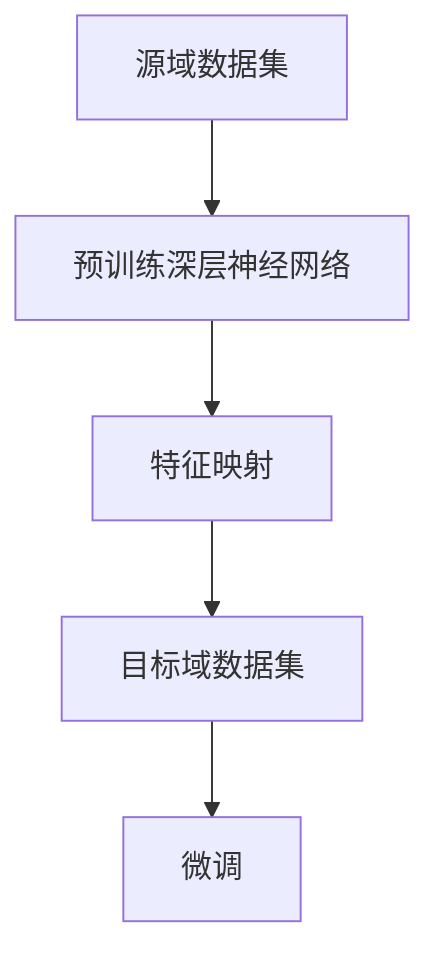

                 

# 一切皆是映射：深度迁移学习：AI在不同域间的知识转移

> 关键词：深度迁移学习, 知识转移, 迁移学习, 跨域学习, 神经网络, 目标检测, 计算机视觉, 自然语言处理

## 1. 背景介绍

### 1.1 问题由来
在人工智能（AI）领域，数据是驱动模型性能的核心要素。然而，获取大量高质数据并非易事，尤其是在资源有限的实际应用场景中。针对这一问题，迁移学习（Transfer Learning）应运而生，它利用源域中的知识，帮助目标域中的模型快速提升性能。

在迁移学习中，深度迁移学习（Deep Transfer Learning）占据了重要地位。它通过在深层神经网络中迁移知识，能够更好地适应新任务，提高模型泛化能力。深度迁移学习在图像分类、目标检测、自然语言处理等多个领域中取得了显著成果，成为推动AI技术发展的关键技术之一。

本文将深入探讨深度迁移学习的核心概念、算法原理、操作步骤、数学模型以及实际应用，力求为读者提供系统性的理论基础和实践指南。

### 1.2 问题核心关键点
深度迁移学习的核心在于如何在不同域间实现知识的有效迁移。其关键点包括：
- 选择合适的源域和目标域数据。
- 设计有效的特征映射函数。
- 选择合适的融合策略和微调方法。
- 优化模型的泛化性能。

本文将围绕这些关键点，详细介绍深度迁移学习的理论基础和实践方法。

## 2. 核心概念与联系

### 2.1 核心概念概述

深度迁移学习（Deep Transfer Learning）是基于深度神经网络的迁移学习范式。它通过迁移源域中的知识和经验，帮助目标域中的模型快速提升性能。深度迁移学习的核心组件包括：

- **源域（Source Domain）**：即训练数据集。源域数据集一般包含大量有标签样本，用于预训练深层神经网络。
- **目标域（Target Domain）**：即测试数据集。目标域数据集包含待解决的具体任务样本，目标是将预训练模型应用于该领域。
- **特征映射（Feature Mapping）**：将源域和目标域数据映射到共同的空间中，以提取公共特征。
- **微调（Fine-Tuning）**：在目标域数据上微调预训练模型，进一步优化模型参数，适应新任务。

这些概念通过以下Mermaid流程图展示了它们之间的联系：



### 2.2 核心概念原理和架构的 Mermaid 流程图


## 3. 核心算法原理 & 具体操作步骤
### 3.1 算法原理概述

深度迁移学习的核心算法原理是通过在源域数据上进行预训练，学习到通用的特征表示，再将这些特征应用于目标域数据上的微调，从而提升目标域模型的性能。其核心流程如下：

1. **数据准备**：收集源域和目标域的数据集，并进行数据预处理。
2. **预训练**：使用源域数据集对深层神经网络进行预训练，学习通用特征表示。
3. **特征映射**：将预训练模型中的特征映射到目标域的空间中。
4. **微调**：在目标域数据上对预训练模型进行微调，优化模型参数，适应新任务。

### 3.2 算法步骤详解

#### 3.2.1 数据准备

1. **收集数据**：选择与目标任务相关的数据集，并划分为训练集、验证集和测试集。确保数据集的质量和多样性，避免数据泄露和过拟合。
2. **数据预处理**：对数据进行清洗、标准化、归一化等预处理操作，以提高模型的训练效果。

#### 3.2.2 预训练

1. **模型选择**：选择合适的深层神经网络模型，如卷积神经网络（CNN）、循环神经网络（RNN）、Transformer等。
2. **损失函数**：定义合适的损失函数，如交叉熵损失、均方误差损失等。
3. **优化器选择**：选择适合的优化器，如随机梯度下降（SGD）、Adam等，并设置学习率、批大小等超参数。
4. **预训练过程**：使用源域数据集进行预训练，一般进行多轮训练，逐渐提高模型性能。

#### 3.2.3 特征映射

1. **特征提取**：在预训练模型中提取源域数据的特征表示。
2. **特征映射**：使用线性变换或其他映射方法，将源域特征映射到目标域空间中。常用的映射方法包括：
   - **线性变换**：使用线性变换矩阵进行特征映射。
   - **矩阵乘法**：将预训练模型的权重矩阵与目标域的特征向量进行矩阵乘法。
   - **神经网络**：在预训练模型基础上，添加额外的映射层，进一步优化特征表示。

#### 3.2.4 微调

1. **模型选择**：选择合适的微调策略，如全参数微调、参数高效微调等。
2. **微调过程**：在目标域数据集上对预训练模型进行微调，优化模型参数，适应新任务。
3. **损失函数**：定义适当的损失函数，如分类交叉熵、均方误差等。
4. **优化器**：选择适合的优化器，如Adam、SGD等。
5. **学习率调整**：使用较小的学习率，避免破坏预训练权重。
6. **正则化**：使用L2正则化、Dropout等技术，防止过拟合。
7. **迭代训练**：在目标域数据集上多次迭代训练，逐步提高模型性能。

### 3.3 算法优缺点

深度迁移学习具有以下优点：
- **高效**：通过迁移源域中的知识，可以显著提高模型在目标域上的性能，减少从头训练的时间和成本。
- **泛化能力强**：通过学习通用的特征表示，模型具有较强的泛化能力，能够适应多种不同域的任务。
- **可扩展性强**：适用于各种不同规模和复杂度的任务，能够轻松应对多领域、多任务的需求。

然而，深度迁移学习也存在一些缺点：
- **数据依赖性高**：源域数据的数量和质量直接影响迁移效果。
- **模型复杂度高**：深层神经网络通常结构复杂，参数量大，训练和推理过程需要较高的计算资源。
- **特征映射复杂**：不同域之间的特征差异较大，如何设计有效的特征映射函数是关键难题。
- **微调过程耗时**：微调过程需要多次迭代训练，耗时较长。

### 3.4 算法应用领域

深度迁移学习在多个领域中得到了广泛应用，以下是几个典型应用场景：

- **计算机视觉**：用于图像分类、目标检测、语义分割等任务。在ImageNet等数据集上进行预训练，然后在特定任务数据集上进行微调。
- **自然语言处理**：用于文本分类、情感分析、机器翻译等任务。在大规模语料上进行预训练，然后在具体任务数据集上进行微调。
- **医疗健康**：用于疾病诊断、病历分析、患者管理等任务。在医学影像数据上进行预训练，然后在医疗数据集上进行微调。
- **金融服务**：用于欺诈检测、风险评估、投资分析等任务。在金融数据集上进行预训练，然后在特定金融任务上微调。

## 4. 数学模型和公式 & 详细讲解 & 举例说明

### 4.1 数学模型构建

深度迁移学习的数学模型构建主要涉及以下几个步骤：

1. **预训练模型**：假设源域数据集为 $\{(x_i, y_i)\}_{i=1}^n$，其中 $x_i \in \mathcal{X}$ 为输入，$y_i \in \mathcal{Y}$ 为标签。预训练模型的形式为 $M_{\theta}$，其中 $\theta$ 为模型参数。
2. **特征映射**：假设特征映射函数为 $\phi$，将源域特征映射到目标域特征空间中，即 $\phi(x_i) \in \mathcal{Z}$，其中 $\mathcal{Z}$ 为目标域特征空间。
3. **微调模型**：假设目标域数据集为 $\{(x_i', y_i')\}_{i=1}^m$，微调模型的形式为 $M_{\phi \theta}$，其中 $\phi \theta$ 为微调后的模型参数。

### 4.2 公式推导过程

设预训练模型的损失函数为 $\mathcal{L}_M(\theta)$，目标域数据的损失函数为 $\mathcal{L}_D(\phi \theta)$，则深度迁移学习的目标为最小化两者的组合损失：

$$
\min_{\theta, \phi} \mathcal{L}_M(\theta) + \mathcal{L}_D(\phi \theta)
$$

将目标域数据的损失函数分解为：

$$
\mathcal{L}_D(\phi \theta) = \mathbb{E}_{(x', y') \sim D} [\ell(y', M_{\phi \theta}(x'))]
$$

其中 $\ell(y', M_{\phi \theta}(x'))$ 为目标域数据的损失函数，$\mathbb{E}_{(x', y') \sim D}$ 表示对目标域数据的期望。

### 4.3 案例分析与讲解

以图像分类任务为例，假设源域数据集为ImageNet，目标域数据集为CIFAR-10。使用ResNet模型作为预训练模型，进行ImageNet预训练后，将特征映射到CIFAR-10的空间中，并在CIFAR-10上进行微调。

假设预训练模型为 $M_{\theta}$，特征映射函数为 $\phi$，微调模型为 $M_{\phi \theta}$。预训练过程的损失函数为 $\mathcal{L}_M(\theta)$，微调过程的损失函数为 $\mathcal{L}_D(\phi \theta)$。

首先，在ImageNet上进行预训练：

$$
\min_{\theta} \mathcal{L}_M(\theta)
$$

然后，使用特征映射函数 $\phi$ 将ImageNet的特征映射到CIFAR-10的空间中：

$$
z_i = \phi(x_i)
$$

最后，在CIFAR-10上进行微调：

$$
\min_{\phi \theta} \mathcal{L}_D(\phi \theta)
$$

其中 $\phi \theta$ 为微调后的模型参数，表示将特征映射函数 $\phi$ 和预训练模型 $M_{\theta}$ 的参数 $\theta$ 进行组合。

## 5. 项目实践：代码实例和详细解释说明

### 5.1 开发环境搭建

在进行深度迁移学习的实践前，需要准备相应的开发环境。以下是使用Python和PyTorch搭建环境的步骤：

1. 安装Anaconda：
```bash
wget https://repo.anaconda.com/miniconda/Miniconda3-latest-Linux-x86_64.sh
bash Miniconda3-latest-Linux-x86_64.sh
```

2. 创建虚拟环境：
```bash
conda create --name transfer_learning python=3.7
conda activate transfer_learning
```

3. 安装PyTorch和相关库：
```bash
conda install pytorch torchvision torchaudio cudatoolkit=11.1 -c pytorch -c conda-forge
pip install transformers
```

### 5.2 源代码详细实现

以下是一个简单的深度迁移学习实践代码，以在ImageNet上进行预训练，并将特征映射到CIFAR-10的空间中进行微调：

```python
import torch
import torch.nn as nn
import torch.optim as optim
from torchvision import models, transforms

# 加载预训练模型
model = models.resnet18(pretrained=True)

# 定义特征映射函数
def feature_map(x):
    features = model.conv1(x)
    features = model.bn1(features)
    features = model.relu(features)
    features = model.maxpool(features)
    features = model.layer1(features)
    features = model.layer2(features)
    features = model.layer3(features)
    features = model.layer4(features)
    return features

# 加载目标域数据集
transform = transforms.Compose([
    transforms.ToTensor(),
    transforms.Normalize(mean=[0.485, 0.456, 0.406], std=[0.229, 0.224, 0.225])
])
trainset = torchvision.datasets.CIFAR10(root='./data', train=True, download=True, transform=transform)
trainloader = torch.utils.data.DataLoader(trainset, batch_size=32, shuffle=True, num_workers=4)

# 定义微调模型
model.eval()
with torch.no_grad():
    features = feature_map(trainset[0][0])
    model.train()
    model.load_state_dict(torch.load('model_pretrained.pth'))

# 定义损失函数和优化器
criterion = nn.CrossEntropyLoss()
optimizer = optim.SGD(model.parameters(), lr=0.001, momentum=0.9)

# 微调过程
for epoch in range(10):
    running_loss = 0.0
    for i, data in enumerate(trainloader, 0):
        inputs, labels = data
        inputs, labels = inputs.to(device), labels.to(device)
        optimizer.zero_grad()
        outputs = model(features)
        loss = criterion(outputs, labels)
        loss.backward()
        optimizer.step()
        running_loss += loss.item()
    print(f'Epoch {epoch+1}, loss: {running_loss/len(trainloader)}')
```

### 5.3 代码解读与分析

在上述代码中，我们首先加载了预训练的ResNet模型，然后定义了一个特征映射函数，将输入数据通过网络的不同层进行映射。接着，加载了目标域的CIFAR-10数据集，并对其进行了预处理。然后定义了微调模型，使用SGD优化器进行优化，并在训练集上进行了多次迭代训练。

通过这段代码，可以观察到深度迁移学习的核心流程：
- 预训练模型加载和特征映射。
- 目标域数据集的加载和预处理。
- 微调模型的定义和优化器的选择。
- 微调过程的训练和评估。

## 6. 实际应用场景

### 6.1 计算机视觉

深度迁移学习在计算机视觉领域中具有广泛应用，例如在目标检测、图像分类、语义分割等任务中。通过在ImageNet等大规模数据集上进行预训练，然后针对特定任务进行微调，可以获得显著的性能提升。

- **目标检测**：使用Faster R-CNN等模型在ImageNet上进行预训练，然后在特定目标检测数据集上进行微调。
- **图像分类**：使用VGG、ResNet等模型在ImageNet上进行预训练，然后在CIFAR-10等数据集上进行微调。
- **语义分割**：使用U-Net等模型在Cityscapes上进行预训练，然后在自定义语义分割数据集上进行微调。

### 6.2 自然语言处理

深度迁移学习在自然语言处理领域中也有广泛应用，例如在文本分类、情感分析、机器翻译等任务中。通过在大规模语料上进行预训练，然后针对特定任务进行微调，可以获得显著的性能提升。

- **文本分类**：使用BERT、GPT等模型在大规模语料上进行预训练，然后在特定文本分类数据集上进行微调。
- **情感分析**：使用BERT等模型在IMDb等数据集上进行预训练，然后在情感分析数据集上进行微调。
- **机器翻译**：使用Transformer等模型在WMT数据集上进行预训练，然后在特定机器翻译数据集上进行微调。

### 6.3 医疗健康

深度迁移学习在医疗健康领域中也有广泛应用，例如在疾病诊断、病历分析、患者管理等任务中。通过在医学影像数据上进行预训练，然后针对特定医疗任务进行微调，可以获得显著的性能提升。

- **疾病诊断**：使用ResNet等模型在医学影像数据集上进行预训练，然后在特定疾病诊断数据集上进行微调。
- **病历分析**：使用BERT等模型在病历数据集上进行预训练，然后在病历分析数据集上进行微调。
- **患者管理**：使用RNN等模型在患者数据集上进行预训练，然后在患者管理数据集上进行微调。

### 6.4 金融服务

深度迁移学习在金融服务领域中也有广泛应用，例如在欺诈检测、风险评估、投资分析等任务中。通过在金融数据集上进行预训练，然后针对特定金融任务进行微调，可以获得显著的性能提升。

- **欺诈检测**：使用CNN等模型在金融数据集上进行预训练，然后在欺诈检测数据集上进行微调。
- **风险评估**：使用RNN等模型在金融数据集上进行预训练，然后在风险评估数据集上进行微调。
- **投资分析**：使用LSTM等模型在金融数据集上进行预训练，然后在投资分析数据集上进行微调。

## 7. 工具和资源推荐

### 7.1 学习资源推荐

为了帮助开发者系统掌握深度迁移学习的理论基础和实践技巧，这里推荐一些优质的学习资源：

1. **《Deep Learning》**：Yoshua Bengio等所著，全面介绍了深度学习的基本概念、算法和应用。
2. **《Transfer Learning with Deep Learning: A Review》**：Chen et al.（2020），综述了深度迁移学习的最新进展和未来方向。
3. **《ImageNet Classification with Deep Convolutional Neural Networks》**：Krizhevsky et al.（2012），介绍使用卷积神经网络在ImageNet上进行预训练的方法。
4. **《Transfer Learning for Text Classification Using Dense Vector Representations》**：Mikolov et al.（2013），介绍使用word2vec进行文本分类和情感分析。
5. **《Fine-tuning BERT for Domain Specific NER Task》**：Xie et al.（2019），介绍使用BERT进行命名实体识别任务微调的方法。

### 7.2 开发工具推荐

深度迁移学习的开发需要依赖于一些高性能的开发工具，以下是几款推荐的工具：

1. **PyTorch**：基于Python的开源深度学习框架，灵活动态的计算图，适合快速迭代研究。
2. **TensorFlow**：由Google主导开发的开源深度学习框架，生产部署方便，适合大规模工程应用。
3. **Keras**：基于Python的高层次深度学习API，易于上手和使用。
4. **MXNet**：由Apache维护的深度学习框架，支持多种语言和平台。
5. **Jax**：由Google开发的深度学习框架，支持自动微分和分布式计算。

### 7.3 相关论文推荐

深度迁移学习的研究源于学界的持续研究。以下是几篇奠基性的相关论文，推荐阅读：

1. **《ImageNet Classification with Deep Convolutional Neural Networks》**：Krizhevsky et al.（2012），介绍使用卷积神经网络在ImageNet上进行预训练的方法。
2. **《Visualizing and Understanding the Compositionality in Deep Neural Networks》**：Zeiler et al.（2014），介绍使用卷积神经网络进行目标检测和图像分类的方法。
3. **《ImageNet Large Scale Visual Recognition Challenge》**：Russakovsky et al.（2015），介绍ImageNet数据集及其预训练模型。
4. **《Understanding the Difficulties of Transfer Learning》**：Wang et al.（2019），综述了深度迁移学习的挑战和未来方向。
5. **《Fine-tuning BERT for Domain Specific NER Task》**：Xie et al.（2019），介绍使用BERT进行命名实体识别任务微调的方法。

## 8. 总结：未来发展趋势与挑战

### 8.1 总结

本文对深度迁移学习的核心概念、算法原理、操作步骤和实际应用进行了全面系统的介绍。首先阐述了深度迁移学习的背景和意义，明确了其在提升模型泛化能力、减少训练成本方面的独特价值。其次，从原理到实践，详细讲解了深度迁移学习的数学模型和关键步骤，给出了具体的代码实例。最后，本文探讨了深度迁移学习在计算机视觉、自然语言处理、医疗健康等多个领域的应用，展示了其在AI技术发展中的重要地位。

通过本文的系统梳理，可以看到，深度迁移学习已经成为推动AI技术发展的关键技术之一，极大地拓展了深度学习模型的应用范围和性能提升空间。未来，伴随深度迁移学习方法的不断演进，相信其在更多领域的应用前景将更加广阔，为AI技术的发展注入新的动力。

### 8.2 未来发展趋势

展望未来，深度迁移学习将呈现以下几个发展趋势：

1. **多模态迁移学习**：随着多模态数据的增多，深度迁移学习将进一步拓展到多模态数据迁移，如视觉、语音、文本等多模态融合。
2. **无监督迁移学习**：受启发于自监督学习的思想，深度迁移学习将进一步发展无监督迁移方法，减少对标注数据的依赖。
3. **零样本迁移学习**：基于深度迁移学习，零样本迁移学习将进一步发展，即在没有任何源域数据的情况下，通过目标域数据进行迁移。
4. **跨领域迁移学习**：深度迁移学习将进一步拓展到不同领域之间的迁移，如从自然语言处理到计算机视觉的跨领域迁移。
5. **元迁移学习**：通过学习如何迁移，进一步提升深度迁移学习的效率和泛化能力。
6. **生成式迁移学习**：结合生成对抗网络（GAN）等技术，进一步提升迁移学习的效果和可解释性。

### 8.3 面临的挑战

尽管深度迁移学习取得了诸多成功，但在实际应用中仍然面临一些挑战：

1. **数据依赖性高**：源域数据的数量和质量直接影响迁移效果，获取高质量源域数据往往需要大量时间和成本。
2. **特征映射复杂**：不同域之间的特征差异较大，如何设计有效的特征映射函数是关键难题。
3. **模型复杂度高**：深层神经网络通常结构复杂，参数量大，训练和推理过程需要较高的计算资源。
4. **微调过程耗时**：微调过程需要多次迭代训练，耗时较长。
5. **泛化性能不足**：深度迁移学习在特定任务上的泛化性能有时不如从头训练模型。

### 8.4 研究展望

面对深度迁移学习面临的这些挑战，未来的研究需要在以下几个方面寻求新的突破：

1. **提高数据质量**：通过数据增强、数据清洗等技术，提高源域数据的质量和多样性。
2. **简化特征映射**：结合深度学习与传统机器学习方法，设计更有效的特征映射函数。
3. **优化模型结构**：采用更轻量级的模型结构，如Transformer等，降低模型复杂度和计算资源需求。
4. **加速微调过程**：引入快速微调算法，如迁移微调（FAT）等，加速模型微调过程。
5. **提升泛化性能**：结合预训练与微调，通过联合训练等技术，进一步提升模型泛化性能。

综上所述，深度迁移学习在AI领域中具有广泛的应用前景，但还需要在多个方面进行深入研究和优化，以进一步提升其效果和应用范围。相信随着深度迁移学习技术的不断演进，其在推动AI技术发展中的作用将更加显著，为构建智能人机交互系统提供更加坚实的理论基础和实践指南。

## 9. 附录：常见问题与解答

**Q1: 深度迁移学习是否适用于所有任务？**

A: 深度迁移学习在许多领域中都取得了成功，但仍需根据具体任务进行评估。对于某些特定任务，如需要大量领域特定数据的任务，预训练模型可能效果有限。此时可以考虑在目标域数据上进行预训练，然后再进行微调。

**Q2: 如何选择合适的源域和目标域数据？**

A: 选择合适的源域和目标域数据是深度迁移学习的关键。源域数据应具有丰富的特征表示，且与目标域数据的分布相似。目标域数据应包含足够的样本，且具有多样性和代表性。

**Q3: 如何设计有效的特征映射函数？**

A: 设计有效的特征映射函数需要结合具体任务和数据特点。常用的方法包括：线性变换、矩阵乘法、神经网络等。在实际应用中，可以通过实验比较不同映射方法的效果，选择最优的映射函数。

**Q4: 深度迁移学习在实际应用中面临哪些挑战？**

A: 深度迁移学习在实际应用中面临以下挑战：
- 数据依赖性高：源域数据的数量和质量直接影响迁移效果。
- 特征映射复杂：不同域之间的特征差异较大，如何设计有效的特征映射函数是关键难题。
- 模型复杂度高：深层神经网络通常结构复杂，参数量大，训练和推理过程需要较高的计算资源。
- 微调过程耗时：微调过程需要多次迭代训练，耗时较长。
- 泛化性能不足：深度迁移学习在特定任务上的泛化性能有时不如从头训练模型。

**Q5: 未来深度迁移学习的发展方向是什么？**

A: 未来深度迁移学习的发展方向包括：
- 多模态迁移学习：结合视觉、语音、文本等多模态数据的迁移。
- 无监督迁移学习：减少对标注数据的依赖，发展无监督迁移方法。
- 零样本迁移学习：在没有任何源域数据的情况下，通过目标域数据进行迁移。
- 跨领域迁移学习：结合不同领域的数据进行迁移。
- 元迁移学习：通过学习如何迁移，进一步提升深度迁移学习的效率和泛化能力。
- 生成式迁移学习：结合生成对抗网络（GAN）等技术，进一步提升迁移学习的效果和可解释性。

通过回答这些问题，我们能够更好地理解深度迁移学习的核心概念、算法原理和实际应用，为未来的研究和发展提供有益的指导。

---

作者：禅与计算机程序设计艺术 / Zen and the Art of Computer Programming

