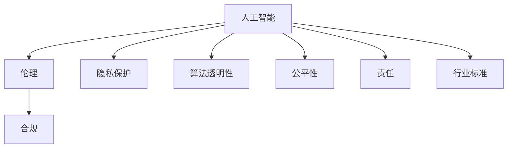

                 

# 人工智能创业：伦理合规的策略

> 关键词：人工智能, 伦理, 合规, 法律, 隐私保护, 算法透明性, 公平性, 责任, 行业标准

## 1. 背景介绍

### 1.1 问题由来
随着人工智能技术的飞速发展，其在各领域的广泛应用，例如医疗、金融、教育等，极大地提高了效率和生产力。然而，人工智能技术在带来便利的同时，也引发了诸多伦理、法律、隐私等方面的问题。伦理合规已成为人工智能创业过程中必须面对的重要挑战。

### 1.2 问题核心关键点
- **伦理**：人工智能系统的决策是否符合道德标准，是否对个人、社会、环境产生积极影响。
- **合规**：人工智能系统是否符合相关法律法规，是否存在数据隐私、算法歧视、责任归属等问题。
- **隐私保护**：人工智能在处理个人数据时，如何保证数据的安全、隐私不被侵犯。
- **算法透明性**：人工智能系统的决策过程是否可解释、可理解，是否具有可信赖性。
- **公平性**：人工智能系统在各个群体中的表现是否公正，是否存在偏见或歧视。
- **责任**：人工智能系统出现问题时，责任归属问题，即由谁承担责任，责任如何界定。
- **行业标准**：人工智能系统如何符合各行业的特定规范和标准。

### 1.3 问题研究意义
探索人工智能创业过程中如何做到伦理合规，对于保障人工智能技术的安全、公平、透明应用，保护用户隐私，构建公正的社会环境，推动人工智能技术的健康发展具有重要意义。

## 2. 核心概念与联系

### 2.1 核心概念概述

为更好地理解人工智能创业中的伦理合规策略，本节将介绍几个密切相关的核心概念：

- **人工智能**：通过算法、模型等技术手段，使计算机具备一定的感知、推理、学习等智能能力。
- **伦理**：指规范个体、组织的行为准则，以维护社会秩序和公平正义。
- **合规**：指遵循国家法律法规、行业标准，确保企业行为合法合规。
- **隐私保护**：指在数据收集、存储、处理过程中，采取措施保护个人隐私不被侵犯。
- **算法透明性**：指算法的决策过程公开、可理解，便于监督和审计。
- **公平性**：指算法在各个群体中的表现一致，不存在偏见或歧视。
- **责任**：指在算法出现问题时，明确的责任归属。
- **行业标准**：指各行业内公认的规范和标准，如医疗、金融、教育等行业特有要求。

这些核心概念之间的逻辑关系可以通过以下Mermaid流程图来展示：



这个流程图展示了大语言模型的核心概念及其之间的关系：

1. 人工智能通过算法获得智能能力。
2. 伦理和合规是人工智能必须遵循的行为准则和法规。
3. 隐私保护是保护数据安全的重要措施。
4. 算法透明性保证了人工智能决策的可解释性。
5. 公平性确保了人工智能系统在各群体中的公正性。
6. 责任归属在算法出现问题时明确了责任承担方。
7. 行业标准是特定领域对人工智能应用的要求。

这些概念共同构成了人工智能创业中的伦理合规框架，确保技术在实际应用中的安全、公平和透明。

## 3. 核心算法原理 & 具体操作步骤
### 3.1 算法原理概述

人工智能创业中的伦理合规策略，本质上是一种管理和规范人工智能技术应用的过程。其核心思想是通过制定和遵守一系列伦理、合规原则，确保人工智能系统的决策公正、透明、可解释，同时保护数据隐私，明确责任归属，满足行业标准等。

形式化地，假设有一系列人工智能系统 $\{S_i\}$，每个系统处理的任务为 $T_i$，涉及的数据为 $D_i$。其伦理合规策略的目标是找到一组合规原则 $\{\phi_k\}$，使得每个系统在执行任务时，满足以下约束条件：

1. 符合伦理标准：$\forall S_i \in \{S_i\}, \exists T_i, D_i \text{ 使得 } \forall x \in T_i, \forall y \in D_i, \phi_k(S_i, x, y) \text{ 成立}$
2. 符合法律法规：$\forall S_i \in \{S_i\}, \exists T_i, D_i \text{ 使得 } \forall x \in T_i, \forall y \in D_i, \phi_k(S_i, x, y) \text{ 满足相关法律条款}$
3. 数据隐私保护：$\forall S_i \in \{S_i\}, \exists T_i, D_i \text{ 使得 } \forall x \in T_i, \forall y \in D_i, \phi_k(S_i, x, y) \text{ 保护个人隐私}$
4. 算法透明性：$\forall S_i \in \{S_i\}, \exists T_i, D_i \text{ 使得 } \forall x \in T_i, \forall y \in D_i, \phi_k(S_i, x, y) \text{ 保证算法可解释性}$
5. 公平性：$\forall S_i \in \{S_i\}, \exists T_i, D_i \text{ 使得 } \forall x \in T_i, \forall y \in D_i, \phi_k(S_i, x, y) \text{ 保证决策公正}$
6. 责任归属：$\forall S_i \in \{S_i\}, \exists T_i, D_i \text{ 使得 } \forall x \in T_i, \forall y \in D_i, \phi_k(S_i, x, y) \text{ 明确责任归属}$
7. 行业标准：$\forall S_i \in \{S_i\}, \exists T_i, D_i \text{ 使得 } \forall x \in T_i, \forall y \in D_i, \phi_k(S_i, x, y) \text{ 符合行业规范}$
8. 持续改进：$\forall S_i \in \{S_i\}, \exists T_i, D_i \text{ 使得 } \forall x \in T_i, \forall y \in D_i, \phi_k(S_i, x, y) \text{ 持续优化}$
9. 安全可靠：$\forall S_i \in \{S_i\}, \exists T_i, D_i \text{ 使得 } \forall x \in T_i, \forall y \in D_i, \phi_k(S_i, x, y) \text{ 确保系统安全可靠}$

### 3.2 算法步骤详解

人工智能创业中的伦理合规策略，主要包括以下几个关键步骤：

**Step 1: 制定伦理合规框架**

- 梳理法律法规、行业标准等合规要求。
- 确定伦理原则和公平性标准。
- 设计隐私保护机制。
- 制定算法透明性要求。
- 明确责任归属策略。
- 设定持续改进计划。
- 定义安全可靠标准。

**Step 2: 风险评估与合规审查**

- 评估各个任务和数据的潜在风险，如隐私泄露、偏见、歧视等。
- 进行合规审查，确保每个系统的决策符合伦理合规框架。
- 定期进行审计，检测潜在问题，进行风险管理。

**Step 3: 数据治理与隐私保护**

- 收集、存储、处理数据时，遵循隐私保护原则。
- 确保数据匿名化、加密、去标识化等措施到位。
- 明确数据使用范围，限制数据访问权限。
- 设立数据保护官（DPO），负责数据保护工作。

**Step 4: 算法透明性与可解释性**

- 设计可解释的算法，确保决策过程透明。
- 提供决策依据，使用简单的语言解释复杂算法。
- 确保算法可追溯，便于审计和监管。
- 使用解释性模型，如决策树、规则集等。

**Step 5: 公平性保证与偏见检测**

- 检测算法中的偏见，如性别、种族、年龄等。
- 调整算法，消除偏见，确保公平性。
- 使用公平性检测工具，如 fairness指标。
- 定期审查算法，确保公平性。

**Step 6: 责任归属与问责机制**

- 明确算法出现问题的责任归属。
- 制定问责机制，明确责任追究流程。
- 设立责任保险，保障用户权益。
- 制定事故处理流程，确保及时响应。

**Step 7: 行业标准与法规遵从**

- 确保算法符合各行业的规范和标准。
- 定期更新合规框架，适应新法律法规。
- 与行业协会合作，共同制定标准。
- 接受行业监管，确保合规。

**Step 8: 持续改进与优化**

- 根据用户反馈和系统表现，持续优化算法和系统。
- 使用A/B测试，验证改进效果。
- 建立反馈机制，收集用户意见。
- 定期进行性能评估，确保系统高效运行。

以上步骤展示了人工智能创业中伦理合规策略的主要流程。在实际操作中，需要根据具体任务和数据特点，灵活组合和调整各项策略。

### 3.3 算法优缺点

人工智能创业中的伦理合规策略具有以下优点：

1. 提高信任度：通过明确的伦理合规框架，增加用户和合作伙伴的信任。
2. 降低风险：通过合规审查和风险管理，减少法律和道德风险。
3. 优化决策：通过公平性检测和算法透明性，提升决策的公正性和可解释性。
4. 保护隐私：通过隐私保护措施，保障用户隐私安全。
5. 明确责任：通过责任归属机制，明确算法出现问题时的责任。
6. 符合标准：通过行业标准和法规遵从，确保合规性，赢得市场认可。

然而，这些策略也存在以下缺点：

1. 成本高：合规审查、隐私保护、算法透明性等措施需要投入大量时间和资源。
2. 技术难度大：需要专业的法律、伦理、隐私保护知识，以及技术实施能力。
3. 流程复杂：涉及多个环节和多方利益，协调困难。
4. 动态变化：法律法规和行业标准不断变化，需要持续跟踪和更新。
5. 市场竞争：伦理合规策略可能增加成本，影响市场竞争力。

尽管存在这些局限性，但就目前而言，人工智能创业中的伦理合规策略是保障技术应用安全、公平、透明的重要手段。

### 3.4 算法应用领域

人工智能创业中的伦理合规策略，已经在诸多领域得到了应用，例如：

- **医疗健康**：确保算法决策符合伦理标准，保护患者隐私，保证医疗公平。
- **金融服务**：确保算法合规，保护用户数据，避免歧视性决策。
- **教育培训**：确保算法透明，公平评估学生，保护学生隐私。
- **安全监控**：确保算法符合隐私保护要求，避免误报和滥用。
- **智能制造**：确保算法符合工业标准，保障生产安全，保护工人隐私。
- **智慧城市**：确保算法符合城市治理规范，保护市民隐私，提升城市治理水平。

除了上述这些经典领域外，人工智能伦理合规策略也被创新性地应用到更多场景中，如无人驾驶、智能家居、社交网络等，为人工智能技术带来了新的突破。

## 4. 数学模型和公式 & 详细讲解  
### 4.1 数学模型构建

本节将使用数学语言对人工智能创业中的伦理合规策略进行更加严格的刻画。

假设有一系列人工智能系统 $\{S_i\}$，每个系统处理的任务为 $T_i$，涉及的数据为 $D_i$。伦理合规策略的数学模型定义为：

$$
\mathcal{C}(\{S_i\}, T_i, D_i) = \begin{cases} 
1 & \text{如果系统 } S_i \text{ 在任务 } T_i \text{ 处理数据 } D_i \text{ 时，符合伦理合规框架} \\
0 & \text{如果系统 } S_i \text{ 在任务 } T_i \text{ 处理数据 } D_i \text{ 时，不符合伦理合规框架}
\end{cases}
$$

其中 $\mathcal{C}$ 表示伦理合规评估函数，$T_i$ 为任务集合，$D_i$ 为数据集合。

### 4.2 公式推导过程

以公平性为例，设算法 $S_i$ 在任务 $T_i$ 处理数据 $D_i$ 时的公平性评估函数 $\phi_k$ 如下：

$$
\phi_k(S_i, T_i, D_i) = \begin{cases} 
1 & \text{如果系统 } S_i \text{ 在任务 } T_i \text{ 处理数据 } D_i \text{ 时，符合公平性标准} \\
0 & \text{如果系统 } S_i \text{ 在任务 } T_i \text{ 处理数据 } D_i \text{ 时，不符合公平性标准}
\end{cases}
$$

公平性可以通过计算不同群体的误差差异来衡量，例如：

$$
\text{Fairness Error} = \frac{1}{N} \sum_{i=1}^N \left| \frac{1}{|G_i|} \sum_{x \in G_i} (y - \hat{y}) \right|
$$

其中 $N$ 为总样本数，$G_i$ 为第 $i$ 个群体，$y$ 为真实标签，$\hat{y}$ 为模型预测标签。

### 4.3 案例分析与讲解

以医疗健康领域为例，一个医疗诊断系统 $S_i$ 在处理患者数据 $D_i$ 时的公平性检测如下：

1. **数据收集与处理**：收集患者的医疗数据，进行数据清洗和预处理。
2. **模型训练与评估**：使用患者数据训练诊断模型，评估模型的性能。
3. **公平性检测**：检测模型在各个族群中的表现是否一致，是否存在性别、年龄、种族等偏见。
4. **偏见消除与调整**：如果发现偏见，通过调整模型参数或增加训练数据，消除偏见。
5. **合规审查与反馈**：定期进行合规审查，收集用户反馈，优化算法。

## 5. 项目实践：代码实例和详细解释说明
### 5.1 开发环境搭建

在进行伦理合规策略开发前，我们需要准备好开发环境。以下是使用Python进行开发的环境配置流程：

1. 安装Anaconda：从官网下载并安装Anaconda，用于创建独立的Python环境。

2. 创建并激活虚拟环境：
```bash
conda create -n ethics-env python=3.8 
conda activate ethics-env
```

3. 安装必要的库：
```bash
pip install pandas numpy scikit-learn matplotlib seaborn torch transformers openai
```

4. 安装相关数据集和工具包：
```bash
pip install datasets-from-raw
pip install auditpy ninja
```

完成上述步骤后，即可在`ethics-env`环境中开始开发。

### 5.2 源代码详细实现

这里我们以医疗健康领域为例，给出一个基于伦理合规策略的Python代码实现。

首先，定义公平性检测函数：

```python
from sklearn.metrics import roc_auc_score

def fairness_detection(model, X, y, groups):
    auroc = roc_auc_score(y, model.predict_proba(X), average='weighted')
    unweighted_auroc = roc_auc_score(y, model.predict_proba(X), average='macro')
    group_aurocs = {group: roc_auc_score(y[groups==group], model.predict_proba(X[groups==group]), average='macro') for group in set(groups)}
    print(f"Auroc: {auroc:.4f}, Unweighted Auroc: {unweighted_auroc:.4f}")
    print("Group-wise Auroc:")
    for group, auroc in group_aurocs.items():
        print(f"{group}: {auroc:.4f}")
```

然后，实现伦理合规框架中的公平性检测：

```python
from sklearn.preprocessing import LabelEncoder
from sklearn.model_selection import train_test_split

# 假设有一个医疗诊断数据集
X = ...
y = ...
groups = ...

# 数据预处理
label_encoder = LabelEncoder()
X['group'] = label_encoder.fit_transform(groups)

# 划分训练集和测试集
X_train, X_test, y_train, y_test, groups_train, groups_test = train_test_split(X, y, groups, test_size=0.2, stratify=groups)

# 训练模型
model = ...
model.fit(X_train, y_train)

# 公平性检测
fairness_detection(model, X_test, y_test, groups_test)
```

最后，启动公平性检测并输出结果：

```python
print("Fairness Check Results:")
fairness_detection(model, X_train, y_train, groups_train)
```

以上就是使用Python对医疗诊断系统进行公平性检测的完整代码实现。可以看到，通过sklearn库的各项功能，可以轻松地完成公平性检测。

### 5.3 代码解读与分析

让我们再详细解读一下关键代码的实现细节：

** fairness_detection函数**：
- 使用ROC-AUC作为公平性指标，计算整体Auroc和不同群组的Auroc。
- 打印出整体Auroc和各个群组的Auroc，便于分析模型是否存在偏见。

** 数据预处理**：
- 使用LabelEncoder将类别变量转换为数字，方便模型处理。
- 使用train_test_split函数进行数据划分，保证各群组的样本数量基本均衡。

** 训练模型和公平性检测**：
- 使用已有的医疗诊断数据，训练诊断模型。
- 使用训练好的模型，对测试集进行公平性检测。

** 启动公平性检测并输出结果**：
- 打印公平性检测结果，输出各群组的Auroc，便于进一步分析。

通过本文的系统梳理，可以看到，使用Python可以很方便地实现公平性检测等伦理合规策略的关键功能。开发者可以根据具体任务，不断迭代和优化模型、数据和算法，方能得到理想的效果。

当然，工业级的系统实现还需考虑更多因素，如模型的保存和部署、超参数的自动搜索、更灵活的任务适配层等。但核心的伦理合规策略基本与此类似。

## 6. 实际应用场景
### 6.1 医疗健康

在医疗健康领域，人工智能伦理合规策略主要应用于：

- 医疗诊断系统：确保模型在各个族群中的表现一致，避免偏见。
- 健康预测系统：保护患者隐私，确保预测结果的公平性和透明性。
- 药物研发：确保算法符合伦理标准，保护患者权益。

### 6.2 金融服务

在金融服务领域，人工智能伦理合规策略主要应用于：

- 信用评分系统：确保算法符合公平性标准，避免歧视性决策。
- 反欺诈检测系统：保护用户隐私，确保决策透明。
- 理财顾问系统：确保算法符合用户隐私保护要求，保护用户数据。

### 6.3 教育培训

在教育培训领域，人工智能伦理合规策略主要应用于：

- 智能推荐系统：确保算法公平，不因性别、年龄、种族等因素影响推荐结果。
- 作业批改系统：保护学生隐私，确保批改结果的透明性。
- 教学评估系统：确保评估结果的公平性，避免偏见。

### 6.4 安全监控

在安全监控领域，人工智能伦理合规策略主要应用于：

- 面部识别系统：保护用户隐私，确保识别结果的公平性和透明性。
- 行为监测系统：确保监控数据的安全和隐私保护。
- 异常检测系统：确保算法符合公平性标准，不因种族、性别等因素影响结果。

### 6.5 智能制造

在智能制造领域，人工智能伦理合规策略主要应用于：

- 工业机器人：确保算法符合生产安全标准，保护工人权益。
- 质量检测系统：确保检测结果的公平性，避免偏见。
- 供应链管理系统：确保数据隐私保护，避免数据泄露。

### 6.6 智慧城市

在智慧城市领域，人工智能伦理合规策略主要应用于：

- 智能交通系统：确保系统决策符合公平性标准，保护市民权益。
- 城市治理系统：确保数据隐私保护，避免数据滥用。
- 公共服务系统：确保算法符合市民权益，提供公平的公共服务。

## 7. 工具和资源推荐
### 7.1 学习资源推荐

为了帮助开发者系统掌握人工智能创业中的伦理合规策略，这里推荐一些优质的学习资源：

1. 《人工智能伦理指南》：一本系统介绍人工智能伦理问题的书籍，涵盖隐私保护、算法透明性、公平性等方方面面。

2. 《数据隐私保护技术》课程：由清华大学开设的在线课程，系统讲解数据隐私保护的技术和方法。

3. 《人工智能法律合规》：一本系统介绍人工智能法律合规问题的书籍，涵盖数据保护法、反歧视法等法律法规。

4. 《AI伦理与合规》：一本系统介绍人工智能伦理和合规问题的书籍，涵盖算法透明性、责任归属等关键问题。

5. 《公平性检测工具》：开源的公平性检测工具，提供多种公平性指标，用于检测算法中的偏见。

通过对这些资源的学习实践，相信你一定能够快速掌握人工智能创业中的伦理合规策略，并用于解决实际的NLP问题。

### 7.2 开发工具推荐

高效的开发离不开优秀的工具支持。以下是几款用于人工智能创业开发的常用工具：

1. PyTorch：基于Python的开源深度学习框架，灵活动态的计算图，适合快速迭代研究。

2. TensorFlow：由Google主导开发的开源深度学习框架，生产部署方便，适合大规模工程应用。

3. OpenAI：提供多种先进的人工智能技术，如GPT、CLIP等，广泛应用于各领域。

4. AuditPy：Python库，提供公平性检测、合规审计等工具，方便开发者进行合规策略实施。

5. Ninja：Python库，提供数据集自动化管理、模型训练加速等功能，简化开发流程。

6. HuggingFace：NLP工具库，提供丰富的预训练语言模型和微调功能，适合NLP任务的开发。

合理利用这些工具，可以显著提升人工智能创业的开发效率，加快创新迭代的步伐。

### 7.3 相关论文推荐

人工智能创业中的伦理合规策略的研究源于学界的持续研究。以下是几篇奠基性的相关论文，推荐阅读：

1. 《AI伦理与公平性》：一篇综述性论文，系统总结了人工智能伦理和公平性问题的现状和研究进展。

2. 《数据隐私保护技术综述》：一篇综述性论文，系统总结了数据隐私保护的技术和方法。

3. 《公平性检测算法》：一篇论文，介绍了多种公平性检测算法，用于检测算法中的偏见。

4. 《法律合规性评估框架》：一篇论文，提出了一种法律合规性评估框架，用于评估人工智能系统的合规性。

5. 《伦理合规策略的实现》：一篇论文，提出了一种实现伦理合规策略的方法，用于确保人工智能系统的公平性和透明性。

这些论文代表了大语言模型微调技术的发展脉络。通过学习这些前沿成果，可以帮助研究者把握学科前进方向，激发更多的创新灵感。

## 8. 总结：未来发展趋势与挑战

### 8.1 总结

本文对人工智能创业中的伦理合规策略进行了全面系统的介绍。首先阐述了人工智能技术在创业过程中必须面对的伦理、合规问题，明确了伦理合规策略的核心内容。其次，从原理到实践，详细讲解了伦理合规策略的数学模型和具体步骤，给出了伦理合规策略的代码实现示例。同时，本文还探讨了伦理合规策略在医疗健康、金融服务、教育培训等多个领域的应用场景，展示了其广阔的前景。最后，本文精选了伦理合规策略的学习资源、开发工具和相关论文，力求为开发者提供全方位的技术指引。

通过本文的系统梳理，可以看到，人工智能创业中的伦理合规策略是大规模应用人工智能技术的重要保障，需要开发者在设计、开发、部署等各个环节进行全面优化，才能真正实现人工智能技术的健康发展。

### 8.2 未来发展趋势

展望未来，人工智能创业中的伦理合规策略将呈现以下几个发展趋势：

1. **法规和标准不断完善**：随着人工智能技术的广泛应用，相关法律法规和行业标准将不断完善，为伦理合规策略提供更为明确和严格的标准。
2. **技术手段不断进步**：新的隐私保护、公平性检测、算法透明性等技术将不断涌现，提升伦理合规策略的有效性和精准度。
3. **企业社会责任加强**：企业将更加重视社会责任，主动实施伦理合规策略，提升用户信任度和市场竞争力。
4. **国际合作加深**：各国将加强在人工智能伦理合规方面的国际合作，形成更为统一的规范和标准。
5. **跨领域应用扩展**：人工智能伦理合规策略将在更多领域得到应用，如智能交通、智慧城市、智能制造等，推动人工智能技术的广泛应用。

### 8.3 面临的挑战

尽管人工智能创业中的伦理合规策略已经取得了显著进展，但在实施过程中仍面临诸多挑战：

1. **法律法规不完善**：一些领域尚未制定完善的法律法规，导致合规策略实施难度大。
2. **技术复杂度高**：隐私保护、公平性检测、算法透明性等技术难度大，需要投入大量时间和资源。
3. **数据质量问题**：数据偏见、数据隐私泄露等问题，导致伦理合规策略效果受限。
4. **算法透明性不足**：一些复杂算法难以解释，导致用户和监管机构难以理解。
5. **责任归属不清**：人工智能系统的决策复杂，责任归属问题难以明确。
6. **国际合作困难**：各国在人工智能伦理合规方面的标准和法律不同，国际合作难度大。

尽管存在这些挑战，但相信随着学界和产业界的共同努力，人工智能创业中的伦理合规策略必将在未来得到进一步优化和完善。

### 8.4 研究展望

未来的研究需要在以下几个方面寻求新的突破：

1. **多领域应用**：探索伦理合规策略在更多领域的应用，如医疗、金融、教育等，推动人工智能技术在这些领域的落地。
2. **技术创新**：开发新的隐私保护、公平性检测、算法透明性等技术，提升伦理合规策略的效果。
3. **法规完善**：推动相关法律法规的制定和完善，提供更为明确和严格的标准。
4. **国际合作**：加强各国在人工智能伦理合规方面的国际合作，形成统一的规范和标准。
5. **用户参与**：加强用户参与，通过用户反馈和数据反馈，持续优化伦理合规策略。

这些研究方向将引领人工智能创业中的伦理合规策略迈向更高的台阶，为构建安全、可靠、可解释、可控的智能系统铺平道路。面向未来，人工智能伦理合规策略还需要与其他人工智能技术进行更深入的融合，如知识表示、因果推理、强化学习等，多路径协同发力，共同推动自然语言理解和智能交互系统的进步。只有勇于创新、敢于突破，才能不断拓展人工智能技术的边界，让智能技术更好地造福人类社会。

## 9. 附录：常见问题与解答

**Q1：人工智能创业中的伦理合规策略是否适用于所有行业？**

A: 人工智能创业中的伦理合规策略在大多数行业都可以应用，但需要根据具体行业的特点进行适当调整。例如，医疗健康行业需要特别注意隐私保护和公平性问题，金融服务行业需要特别关注反歧视和责任归属问题，教育培训行业需要特别关注算法透明性和学生隐私保护问题。

**Q2：如何选择合适的伦理合规策略？**

A: 选择合适的伦理合规策略需要考虑多个因素，包括但不限于：

1. 行业特点：不同行业有其特定的伦理和法律要求。
2. 数据类型：数据的类型、来源、处理方式等。
3. 模型复杂度：模型的复杂度和可解释性。
4. 用户需求：用户的需求和使用场景。
5. 技术能力：企业的技术能力和管理水平。

通过全面评估这些因素，选择合适的伦理合规策略，能够更好地保障人工智能系统的合法合规和用户权益。

**Q3：如何进行伦理合规审查？**

A: 伦理合规审查主要包括以下几个步骤：

1. 梳理法律法规和行业标准。
2. 确定伦理原则和公平性标准。
3. 设计隐私保护机制。
4. 制定算法透明性要求。
5. 明确责任归属策略。
6. 设立数据保护官（DPO）。
7. 定期进行审计和风险管理。

通过系统性的合规审查，可以及时发现并修正潜在问题，保障系统的合法合规。

**Q4：如何保护用户隐私？**

A: 保护用户隐私需要采取多种措施，包括但不限于：

1. 数据匿名化：去除或模糊化个人身份信息。
2. 数据加密：对数据进行加密处理，防止数据泄露。
3. 访问控制：限制数据访问权限，只允许授权人员访问。
4. 数据去标识化：对数据进行去标识化处理，确保数据无法关联到个人。
5. 数据最小化：只收集和处理必要的数据，避免过度收集。

通过综合采用这些措施，可以有效保护用户隐私，确保数据安全。

**Q5：如何进行公平性检测？**

A: 公平性检测主要包括以下几个步骤：

1. 收集和处理数据，确保数据覆盖不同的群体。
2. 训练和评估模型，检测模型在不同群体中的表现。
3. 使用公平性指标，如Auroc、F1-score等，评估模型的公平性。
4. 调整模型参数，消除偏见，确保模型公平。
5. 定期进行审计，确保公平性检测的持续有效。

通过系统性的公平性检测，可以有效识别和消除算法中的偏见，提升模型的公正性和透明性。

通过本文的系统梳理，可以看到，人工智能创业中的伦理合规策略是大规模应用人工智能技术的重要保障，需要开发者在设计、开发、部署等各个环节进行全面优化，才能真正实现人工智能技术的健康发展。

