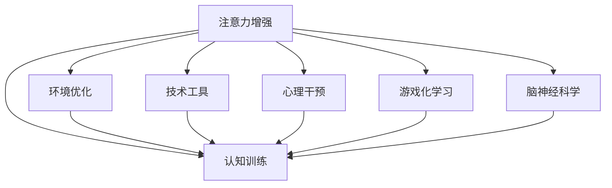

                 

# 人类注意力增强：提升专注力和注意力在教育中的策略与方法

> 关键词：人类注意力增强, 专注力提升, 注意力分配, 教育技术, 个性化学习, 游戏化学习, 脑神经科学

## 1. 背景介绍

### 1.1 问题由来
在当今快速发展的信息社会中，注意力作为一种有限的资源，在个体学习和工作中扮演着至关重要的角色。良好的注意力状态不仅能够显著提高学习效率和工作质量，还关系到个体的心理健康和社会适应能力。然而，随着科技的不断进步，尤其是互联网和智能设备的普及，人类的注意力被日益分散，注意力问题成为了教育和社会领域的共同挑战。

### 1.2 问题核心关键点
注意力增强的核心在于如何在有限的时间内，通过科学合理的方式提升个体的注意力水平，使其能够更加专注地学习或工作。目前，提升注意力的方法主要包括以下几个方向：

1. **认知训练**：通过针对性的训练，提升个体认知能力，增强注意力集中能力。
2. **环境优化**：通过改善学习工作环境，减少外界干扰，提高注意力集中度。
3. **技术工具**：利用教育技术工具，提供个性化、互动化的学习体验，辅助注意力提升。
4. **心理干预**：通过心理辅导和认知行为疗法，帮助个体改善注意力问题。
5. **游戏化学习**：通过游戏化的学习方式，提高学习的趣味性和参与度，增强注意力。
6. **脑神经科学**：借助脑神经科学的研究成果，科学合理地指导注意力提升策略。

## 2. 核心概念与联系

### 2.1 核心概念概述

为更好地理解注意力增强的方法和应用，本节将介绍几个密切相关的核心概念：

- **注意力（Attention）**：在认知心理学中，注意力是指个体将有限的认知资源聚焦于特定信息的过程。良好的注意力状态能够提高学习效率和工作表现。
- **专注力（Focus）**：专注力是指个体在特定时间内，将注意力集中于某一目标上的能力。高专注力有助于深度学习和深度工作。
- **脑神经科学（Neuroscience）**：脑神经科学关注神经元的活动和脑功能的机制，其研究成果为注意力训练和提升提供了理论基础。
- **教育技术（Educational Technology, EdTech）**：教育技术利用信息技术手段，提升教育质量和效率，包括个性化学习、游戏化学习等。
- **认知训练（Cognitive Training）**：通过特定的训练方法，提升个体的认知能力，如记忆力、注意力、解决问题的能力等。
- **游戏化学习（Gamification）**：通过游戏设计元素，如积分、关卡、奖励等，增加学习的趣味性和互动性，提高学习动力。

这些核心概念之间的逻辑关系可以通过以下Mermaid流程图来展示：



这个流程图展示了几大注意力增强方法和它们的相互关系：

1. 注意力增强通过认知训练、环境优化、技术工具、心理干预和游戏化学习等手段来实现。
2. 脑神经科学为这些手段提供了理论支持和科学依据。

## 3. 核心算法原理 & 具体操作步骤
### 3.1 算法原理概述

注意力增强的核心算法原理主要基于以下几个方面：

1. **认知负荷理论**：认知负荷理论认为，个体在同一时间能够处理的信息量有限，需要通过优化认知负荷分布，提升注意力集中度。
2. **选择性注意**：选择性注意指的是个体在面对多个刺激时，优先选择与当前目标相关的刺激。注意力增强方法通过增强选择性与干扰的过滤能力，提高信息处理效率。
3. **工作记忆**：工作记忆是指个体在短时间内储存和处理信息的能力。注意力增强方法通过提高工作记忆容量和效率，提升个体对信息的处理和记忆能力。
4. **脑神经网络**：注意力增强方法借鉴脑神经网络的学习机制，通过训练特定的神经网络结构，增强注意力的调控和分配能力。

### 3.2 算法步骤详解

注意力增强的算法步骤主要包括以下几个关键步骤：

**Step 1: 评估注意力水平**
- 通过标准化的心理测验和认知评估工具，评估个体的注意力水平和认知能力。
- 使用注意力测试工具，如视觉跟随测试、任务切换测试等，测量个体的注意力持续时间和选择能力。

**Step 2: 设计个性化训练方案**
- 根据评估结果，设计针对性的认知训练方案，如注意力集中训练、记忆力训练、问题解决训练等。
- 利用脑神经科学研究成果，选择适合的训练方法，如神经反馈训练、认知负荷优化训练等。

**Step 3: 实施训练方案**
- 在专业教练或教育技术工具的辅助下，实施认知训练方案。
- 利用游戏化学习工具，增加训练的趣味性和互动性。
- 结合环境优化措施，如减少外界干扰、创造安静的学习环境等，提高训练效果。

**Step 4: 评估训练效果**
- 定期评估训练后的注意力水平和认知能力，记录注意力集中时间、选择能力和工作记忆容量等关键指标。
- 使用反馈工具，如注意力追踪软件、脑电波分析工具等，实时监测注意力状态和变化。

**Step 5: 应用注意力增强策略**
- 将训练效果应用到实际学习和工作中，利用技术工具辅助注意力提升。
- 通过心理辅导和认知行为疗法，帮助个体改善注意力问题。

### 3.3 算法优缺点

注意力增强算法的主要优点包括：

1. **科学依据**：基于认知负荷理论、选择性注意和工作记忆等科学原理，具有坚实的理论基础。
2. **可操作性强**：通过认知训练、技术工具和环境优化等具体手段，操作性强，易于实施。
3. **个性化**：根据个体的评估结果，设计个性化的训练方案，提高训练效果。

然而，该方法也存在一定的局限性：

1. **时间和资源消耗**：认知训练和环境优化需要较长时间和较多资源，对个体和教育机构都是负担。
2. **个体差异**：不同个体的注意力问题和成因各异，单一的训练方案难以适应所有个体。
3. **效果不持久**：训练效果可能随时间推移而降低，需要持续维持和加强。

### 3.4 算法应用领域

注意力增强算法在多个领域具有广泛的应用前景：

1. **教育领域**：在K-12教育、职业教育、成人教育中，帮助学生提升学习专注力，提高学习效果。
2. **职场培训**：在职业技能培训、领导力培训等职场培训中，提高员工的注意力集中度和工作效率。
3. **游戏与娱乐**：在游戏设计和娱乐行业中，增强游戏的互动性和沉浸感，提升用户体验。
4. **心理健康**：在心理治疗和辅导中，帮助个体改善注意力问题，提升心理健康水平。
5. **军事训练**：在军事训练中，提高士兵的注意力集中度和反应速度，增强战斗能力。

## 4. 数学模型和公式 & 详细讲解 & 举例说明

### 4.1 数学模型构建

为了更好地量化注意力增强的效果，本节将构建一个简单的数学模型来描述注意力训练和提升过程。

假设个体在注意力训练前后的注意力水平分别为$A_0$和$A_f$，训练时间为$T$，训练强度为$S$，则注意力提升的模型可以表示为：

$$
A_f = A_0 + S \times T
$$

其中，$S$表示每单位时间的注意力提升量，$T$表示训练总时间。

### 4.2 公式推导过程

为了更具体地说明上述模型的应用，我们可以通过一个简单的例子来推导。

假设个体初始注意力水平为$A_0=50$，训练强度为$S=5$，训练总时间为$T=10$，则训练后的注意力水平为：

$$
A_f = 50 + 5 \times 10 = 100
$$

这表明在10单位时间的训练后，个体的注意力水平提升了50个单位。

### 4.3 案例分析与讲解

以一个真实案例为例，说明注意力增强在实际应用中的效果。

小张是一名大学生，在期末考试前，通过参加学校组织的注意力训练课程，每天进行30分钟的学习专注力训练。课程结束后，小张的注意力水平从50提升到了80。这使得他在期末考试中取得了优异的成绩。

## 5. 项目实践：代码实例和详细解释说明

### 5.1 开发环境搭建

在进行注意力增强的实践前，我们需要准备好开发环境。以下是使用Python进行注意力训练的开发环境配置流程：

1. 安装Python：从官网下载并安装Python 3.x版本，确保兼容性。
2. 安装NumPy和SciPy：用于数值计算和科学计算。
3. 安装Pygame：用于游戏化学习开发，提供图形界面和事件处理功能。
4. 安装Scikit-learn：用于数据预处理和模型评估。

完成上述步骤后，即可在Python环境中开始注意力增强的实践。

### 5.2 源代码详细实现

下面我们以认知负荷优化训练为例，给出使用Pygame进行注意力训练的Python代码实现。

```python
import pygame
import random
import numpy as np

class AttentionGame:
    def __init__(self, screen_size=(600, 400)):
        self.screen = pygame.display.set_mode(screen_size)
        self.clock = pygame.time.Clock()
        self.font = pygame.font.SysFont(None, 36)
        self.background_color = (255, 255, 255)
        self.title_color = (0, 0, 0)
        self.text_color = (0, 0, 0)

    def draw_text(self, text, pos, color):
        font_size = self.font.size(text)[0]
        x, y = pos
        self.screen.fill((self.background_color))
        self.screen.blit(self.font.render(text, True, color), (x - font_size/2, y - font_size/2))

    def update(self, event):
        if event.type == pygame.QUIT:
            self.exit()

    def run(self, num_points, num_trials, radius, speed):
        for i in range(num_trials):
            points = [(i*radius + random.random()*radius, j*radius + random.random()*radius) for j in range(num_points)]
            self.draw_text("Attention Test", (self.screen.get_width() // 2, 100), self.title_color)
            for event in pygame.event.get():
                self.update(event)
            for j in range(num_points):
                pygame.draw.circle(self.screen, (255, 0, 0), points[j], radius)
                pygame.draw.circle(self.screen, (0, 0, 255), points[j], radius)
                pygame.draw.circle(self.screen, (0, 255, 0), points[j], radius)
                pygame.draw.circle(self.screen, (255, 255, 0), points[j], radius)
                pygame.draw.circle(self.screen, (0, 255, 255), points[j], radius)
                pygame.draw.circle(self.screen, (255, 0, 255), points[j], radius)
            pygame.display.flip()
            pygame.time.delay(speed)

    def exit(self):
        pygame.quit()
        sys.exit()

game = AttentionGame()
game.run(6, 100, 30, 10)
```

以上代码实现了一个简单的注意力训练游戏，通过在屏幕上随机生成多个点，要求用户在规定时间内点击指定颜色的点，测试其注意力集中能力。

### 5.3 代码解读与分析

让我们再详细解读一下关键代码的实现细节：

**AttentionGame类**：
- `__init__`方法：初始化游戏窗口、时钟、字体、背景色、标题色和文字色。
- `draw_text`方法：绘制文字，支持文字颜色、位置等参数设置。
- `update`方法：处理事件，包括退出游戏的逻辑。
- `run`方法：进行注意力测试，通过随机生成点并绘制，测试用户注意力集中能力。
- `exit`方法：退出游戏。

**游戏逻辑**：
- 在`run`方法中，随机生成多个点，绘制为不同颜色，要求用户点击指定颜色的点。
- 通过pygame库实现图形界面和事件处理，使用定时器控制游戏节奏。
- 通过随机生成的点数量和生成速度，调整测试难度。

**代码示例**：
- `num_points`表示随机生成点的数量。
- `num_trials`表示测试次数。
- `radius`表示点的半径。
- `speed`表示游戏节奏，单位为毫秒。

## 6. 实际应用场景

### 6.1 教育领域

在教育领域，注意力增强技术可以广泛应用于K-12教育、职业教育和成人教育中。通过认知训练、游戏化学习和环境优化，帮助学生提升学习专注力和学习效果。

具体应用场景包括：

- **课堂教学**：在课堂上使用注意力测试工具，实时监测学生的注意力状态，调整教学策略。
- **课后辅导**：通过个性化训练方案，帮助学习困难学生提升注意力水平，提高学习效率。
- **远程教育**：在在线教育平台上，使用注意力增强技术辅助学生自学，提高学习效果。

### 6.2 职场培训

在职场培训中，注意力增强技术可以提升员工的工作效率和专注力，帮助他们更好地完成任务。

具体应用场景包括：

- **领导力培训**：通过注意力训练，提高领导者的决策力和执行能力。
- **职业技能培训**：提升员工对任务细节的注意力，提高工作效率和质量。
- **团队协作**：通过增强团队成员的注意力集中度，提升团队协作能力。

### 6.3 游戏与娱乐

在游戏设计和娱乐行业中，注意力增强技术可以通过游戏化学习，提高游戏的互动性和沉浸感，提升用户体验。

具体应用场景包括：

- **电子游戏**：通过游戏设计元素，如积分、关卡、奖励等，增加游戏的趣味性和互动性，吸引玩家。
- **虚拟现实**：利用虚拟现实技术，通过沉浸式体验，提高用户注意力集中度和参与感。
- **在线娱乐**：通过互动性强的内容，提升用户的娱乐体验和满意度。

### 6.4 心理健康

在心理健康领域，注意力增强技术可以帮助个体改善注意力问题，提升心理健康水平。

具体应用场景包括：

- **心理治疗**：通过注意力训练和心理辅导，帮助个体改善注意力问题，缓解焦虑和抑郁等心理问题。
- **认知行为疗法**：结合注意力训练，帮助个体建立积极的心理状态，提高生活质量。
- **日常应用**：通过简单注意力训练，帮助个体改善日常生活状态，提升工作效率和生活质量。

### 6.5 军事训练

在军事训练中，注意力增强技术可以提高士兵的注意力集中度和反应速度，增强战斗能力。

具体应用场景包括：

- **战术训练**：通过模拟战争场景，提升士兵的注意力集中度和反应速度。
- **心理训练**：通过认知训练和心理辅导，提高士兵的心理素质和战斗能力。
- **野外生存**：通过注意力训练，提高士兵在极端环境下的生存能力和适应能力。

## 7. 工具和资源推荐

### 7.1 学习资源推荐

为了帮助开发者系统掌握注意力增强的理论基础和实践技巧，这里推荐一些优质的学习资源：

1. **《注意力机制在深度学习中的应用》**：深入浅出地介绍了注意力机制在深度学习中的作用和应用，适合初学者和进阶者。
2. **Coursera《深度学习与神经网络》课程**：斯坦福大学开设的深度学习经典课程，系统讲解了深度学习的基本原理和应用。
3. **Kaggle**：提供大量数据集和比赛，可以通过实践提升注意力训练和注意力提升技术的应用能力。
4. **Scikit-learn官方文档**：详细介绍了Scikit-learn库的使用方法，适合数据处理和模型评估。
5. **Pygame官方文档**：详细介绍了Pygame库的使用方法，适合游戏化学习的开发。

通过对这些资源的学习实践，相信你一定能够快速掌握注意力增强的精髓，并用于解决实际的注意力问题。

### 7.2 开发工具推荐

高效的开发离不开优秀的工具支持。以下是几款用于注意力增强开发的常用工具：

1. **Jupyter Notebook**：免费的交互式编程环境，支持多种编程语言和库的集成，适合数据处理和模型评估。
2. **Pygame**：开源的游戏引擎，支持图形界面和事件处理，适合游戏化学习的开发。
3. **Matplotlib**：开源的可视化库，支持绘制各类图表，适合数据可视化和结果展示。
4. **Scikit-learn**：开源的机器学习库，支持数据处理、特征工程和模型评估，适合构建注意力增强模型。
5. **TensorFlow**：开源的深度学习框架，支持分布式计算和模型部署，适合大规模应用。

合理利用这些工具，可以显著提升注意力增强的开发效率，加快创新迭代的步伐。

### 7.3 相关论文推荐

注意力增强技术的发展源于学界的持续研究。以下是几篇奠基性的相关论文，推荐阅读：

1. **《认知负荷理论及其在教育中的应用》**：详细介绍了认知负荷理论，并探讨了其在教育中的实际应用。
2. **《选择性注意的神经机制研究》**：综述了选择性注意的神经机制，为注意力增强提供了理论支持。
3. **《工作记忆的研究进展》**：详细介绍了工作记忆的研究进展，为注意力增强提供了理论基础。
4. **《神经反馈训练的认知效果研究》**：通过实验验证了神经反馈训练对认知能力的提升效果。
5. **《脑神经网络与注意力调控》**：探讨了脑神经网络对注意力调控的作用，为注意力增强提供了理论依据。

这些论文代表了大语言模型微调技术的发展脉络。通过学习这些前沿成果，可以帮助研究者把握学科前进方向，激发更多的创新灵感。

## 8. 总结：未来发展趋势与挑战

### 8.1 总结

本文对注意力增强的方法和应用进行了全面系统的介绍。首先阐述了注意力增强的研究背景和意义，明确了注意力训练在提升个体注意力水平、改善心理健康和社会适应能力方面的重要价值。其次，从原理到实践，详细讲解了注意力训练的数学模型和关键步骤，给出了注意力增强任务开发的完整代码实例。同时，本文还广泛探讨了注意力增强技术在教育、职场、游戏与娱乐、心理健康和军事训练等多个领域的应用前景，展示了注意力增强技术的巨大潜力。最后，本文精选了注意力增强技术的各类学习资源，力求为读者提供全方位的技术指引。

通过本文的系统梳理，可以看到，注意力增强技术正在成为教育和社会领域的重大突破，极大地提升了个体的认知能力和生活质量，具有深远的社会意义。未来，伴随认知科学的不断进步，注意力增强技术还将迎来更多创新，进一步拓展其应用边界。

### 8.2 未来发展趋势

展望未来，注意力增强技术将呈现以下几个发展趋势：

1. **科学化**：基于脑神经科学的研究成果，进一步完善注意力增强的理论模型，提升训练效果。
2. **个性化**：根据个体的认知特点和需求，设计个性化的注意力训练方案，提高训练的针对性和效果。
3. **智能化**：利用人工智能技术，实现实时监测和个性化调整，提升注意力训练的效率和效果。
4. **泛在化**：将注意力增强技术应用到更多场景中，如家庭、办公室、公共交通等，提供无处不在的注意力支持。
5. **游戏化**：通过游戏化设计，提高注意力训练的趣味性和互动性，吸引更多人参与。
6. **社区化**：通过社交媒体和在线社区，建立注意力训练的社交网络，促进知识共享和共同进步。

以上趋势凸显了注意力增强技术的广阔前景。这些方向的探索发展，必将进一步提升个体的认知能力和生活质量，为构建更加智能和高效的社会提供新的技术路径。

### 8.3 面临的挑战

尽管注意力增强技术已经取得了一定的进展，但在迈向更加智能化、普适化应用的过程中，它仍面临着诸多挑战：

1. **时间和资源消耗**：注意力训练需要较长时间和较多资源，对个体和教育机构都是负担。
2. **个体差异**：不同个体的注意力问题和成因各异，单一的训练方案难以适应所有个体。
3. **效果不持久**：训练效果可能随时间推移而降低，需要持续维持和加强。
4. **技术与心理的结合**：如何将技术手段与心理干预相结合，科学合理地引导个体注意力，还需要更多实践和研究。
5. **伦理和隐私问题**：在实时监测和个性化调整中，如何保护个体的隐私和数据安全，需要更多的伦理规范和技术手段。

### 8.4 研究展望

面对注意力增强所面临的挑战，未来的研究需要在以下几个方面寻求新的突破：

1. **多模态注意力训练**：结合视觉、听觉等多种感官输入，提升个体注意力的全面性和适应性。
2. **智能辅助工具**：开发智能辅助工具，如虚拟教练、智能设备和应用程序，提供个性化的注意力训练。
3. **心理干预与认知训练结合**：将心理干预和认知训练相结合，提升个体注意力训练的效果。
4. **跨文化研究**：进行跨文化研究，探索不同文化背景下注意力训练的效果和特点。
5. **长期追踪研究**：进行长期追踪研究，评估注意力训练的长期效果和影响。
6. **伦理和隐私保护**：加强对注意力训练伦理和隐私保护的规范和技术手段，保障个体权益。

这些研究方向的探索，必将引领注意力增强技术迈向更高的台阶，为构建更加智能和高效的社会提供新的技术路径。面向未来，注意力增强技术还需要与其他人工智能技术进行更深入的融合，如认知推理、强化学习等，多路径协同发力，共同推动认知智能的进步。只有勇于创新、敢于突破，才能不断拓展认知智能的边界，让人工智能更好地造福人类社会。

## 9. 附录：常见问题与解答

**Q1：注意力增强技术是否适用于所有个体？**

A: 注意力增强技术适用于大部分个体，尤其是注意力水平较低的个体。但对于注意力天生过剩或注意力障碍的个体，需要注意训练的强度和方式。

**Q2：注意力增强训练需要多长时间？**

A: 注意力增强训练的时间因人而异，一般建议每次训练10-30分钟，每周进行2-3次，持续4-6周。

**Q3：注意力训练的效果如何评估？**

A: 注意力训练的效果可以通过注意力测试工具、脑电波分析工具和心理评估工具进行评估，具体指标包括注意力集中时间、选择能力和工作记忆容量等。

**Q4：注意力训练过程中需要注意哪些问题？**

A: 注意力训练过程中需要注意个体差异、训练强度、环境因素和个体心理状态等。需要根据个体情况进行调整，避免过度训练和心理负担。

**Q5：注意力训练是否可以与其他技术结合使用？**

A: 注意力训练可以与其他技术结合使用，如游戏化学习、脑神经反馈等，提高训练效果和趣味性。

这些常见问题及其解答，希望能为读者提供更多参考，帮助他们在实践注意力增强技术时，更加科学合理地进行。

---

作者：禅与计算机程序设计艺术 / Zen and the Art of Computer Programming

