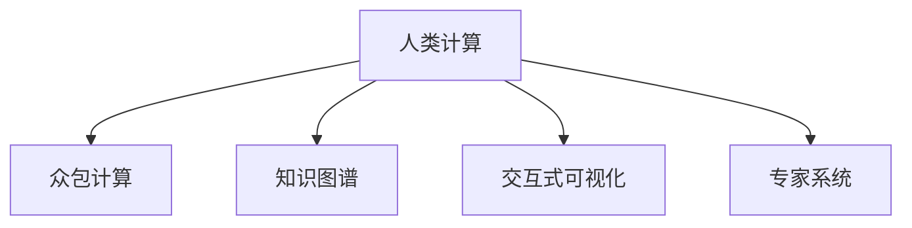

                 

# 人类计算：连接人类智慧的网络

## 1. 背景介绍

### 1.1 问题由来
在当今这个信息爆炸的时代，我们面临的是一个前所未有的数据海洋。从社交媒体到电商平台，从智能家居到工业自动化，各种设备和服务都在生成大量的数据。这些数据不仅蕴含着商业价值，还潜藏着无限的知识和智慧。然而，如何高效地从海量数据中提取有价值的信息，仍然是一个巨大挑战。传统的搜索、排序、统计等计算方式已经无法满足这一需求。

### 1.2 问题核心关键点
人类计算（Human Computing）是一种通过利用人类智慧来处理和分析数据的计算方式。它与传统的机器计算不同，后者主要依赖于计算机硬件和软件。人类计算的核心在于利用人类的思维能力和创造力，借助各种工具和平台，实现对数据的分析、解释和决策。这种计算方式具有灵活性、创造性和适应性，能够处理复杂的、非结构化数据，并发现数据中的深层次模式和规律。

### 1.3 问题研究意义
研究人类计算，对于提升数据处理和分析能力，推动人工智能技术的进步，具有重要的理论和实践意义。它能够帮助我们在数据丰富的领域中，挖掘出更有价值的信息和知识，为各行各业带来新的创新和应用。特别是在医疗、金融、教育等领域，人类计算能够提供更精准的决策支持，提升效率和效果。

## 2. 核心概念与联系

### 2.1 核心概念概述

为更好地理解人类计算，本节将介绍几个关键概念：

- 人类计算（Human Computing）：一种通过利用人类智慧和创造力，处理和分析数据的计算方式。人类计算的核心在于将人类的思维能力与计算机技术相结合，实现数据的高效分析和决策。
- 众包计算（Crowdsourcing）：通过网络平台聚集大量人类用户，共同完成数据标注、图像识别、语音识别等任务。众包计算充分利用了人类的多样性、创造性和灵活性。
- 知识图谱（Knowledge Graph）：一种用于表示实体和它们之间关系的图形结构，常用于信息检索、推荐系统等领域。知识图谱能够将结构化数据和非结构化数据结合起来，提供更全面、准确的信息。
- 交互式可视化（Interactive Visualization）：通过图形界面和交互技术，将复杂的数据和分析结果以直观的方式呈现出来，帮助用户更好地理解和解释数据。
- 专家系统（Expert System）：利用专家的知识和经验，构建智能决策系统，支持复杂决策问题的分析和解决。专家系统能够在特定领域提供深度见解和建议。

这些核心概念之间的逻辑关系可以通过以下Mermaid流程图来展示：



这个流程图展示了几个人类计算的核心概念及其之间的关系：

1. 人类计算是连接其他所有概念的桥梁，是整个计算过程的基础。
2. 众包计算、知识图谱、交互式可视化和专家系统都是人类计算的重要工具和方法。
3. 众包计算和专家系统分别利用了人类劳动和专业知识，而知识图谱和交互式可视化则利用了图形表示和直观展示。

这些概念共同构成了人类计算的体系框架，帮助我们在数据处理和分析中充分利用人类的智慧和创造力。

## 3. 核心算法原理 & 具体操作步骤
### 3.1 算法原理概述

人类计算的核心算法原理是通过各种工具和技术，将人类智慧和计算机技术相结合，实现数据的处理和分析。常见的技术手段包括：

- 众包平台：如Amazon Mechanical Turk、CrowdFlower等，通过网络平台收集大量的人类劳动，完成数据标注和分类等任务。
- 知识图谱技术：如Neo4j、Freebase等，将实体和关系以图形结构表示，构建全面的知识库，支持信息检索和推理。
- 交互式可视化工具：如Tableau、Power BI等，通过图形界面和交互技术，将复杂的数据和分析结果呈现出来，帮助用户理解和解释数据。
- 专家系统：如IBM Watson、Google DeepMind等，利用专家的知识和经验，构建智能决策系统，支持复杂问题的分析和解决。

这些技术手段在数据处理和分析中发挥着重要作用，能够充分利用人类的智慧和创造力，实现高效的数据分析和决策支持。

### 3.2 算法步骤详解

人类计算的具体操作步骤可以概括为以下几个步骤：

**Step 1: 数据收集与预处理**
- 确定需要分析和处理的数据源，包括结构化数据和非结构化数据。
- 对数据进行清洗和预处理，去除噪声和错误，确保数据的准确性和一致性。

**Step 2: 众包任务设计**
- 根据具体需求，设计合适的众包任务，明确任务的目标和要求。
- 选择合适的众包平台，发布任务并设置报酬机制，吸引合适的人类用户参与。

**Step 3: 数据标注与验证**
- 在众包平台上收集人类用户对任务的标注结果，进行初步筛选和校验。
- 选择准确率和一致性较高的标注结果，用于后续的分析和推理。

**Step 4: 知识图谱构建**
- 利用知识图谱技术，将结构化数据和非结构化数据结合，构建全面的知识库。
- 使用知识图谱进行信息检索和推理，挖掘数据中的深层次模式和规律。

**Step 5: 交互式可视化**
- 选择适合的交互式可视化工具，将分析结果以图形界面的形式呈现出来。
- 通过交互式可视化，帮助用户更好地理解和解释数据，发现数据中的关键信息。

**Step 6: 专家系统决策**
- 在专家系统的基础上，构建智能决策系统，支持复杂问题的分析和解决。
- 利用专家的知识和经验，结合数据的分析和推理结果，提供深度见解和建议。

### 3.3 算法优缺点

人类计算具有以下优点：

- 灵活性高：能够处理各种类型的数据，包括结构化数据和非结构化数据，能够适应各种复杂和变化的环境。
- 创造性强：充分利用人类的思维能力和创造力，能够发现数据中的深层次模式和规律，提供新的见解和解决方案。
- 适应性好：能够随着数据的变化和任务的需要进行动态调整，保持系统的灵活性和适应性。

同时，人类计算也存在一些局限性：

- 数据隐私问题：众包任务和专家系统的参与者可能涉及个人隐私和敏感信息，需要严格的数据保护和隐私管理。
- 任务成本高：众包任务和专家系统的参与需要支付一定的报酬，可能导致成本较高。
- 决策依赖于专家：专家系统的决策依赖于专家的知识和经验，可能存在主观性和局限性。

尽管存在这些局限性，但人类计算在数据处理和分析中仍然具有不可替代的优势，能够充分利用人类的智慧和创造力，实现高效的数据分析和决策支持。

### 3.4 算法应用领域

人类计算在多个领域中得到了广泛的应用，包括：

- 医疗健康：利用众包平台和知识图谱，进行疾病诊断和治疗方案的推荐。
- 金融理财：利用专家系统进行市场分析和投资决策，提供个性化的理财建议。
- 教育培训：利用交互式可视化，进行学生的学习和辅导，提升教学效果。
- 商业营销：利用数据标注和知识图谱，进行客户分析和市场细分，提升营销效果。
- 环境保护：利用众包平台和知识图谱，进行环境监测和数据分析，提供环境保护建议。

此外，人类计算还在科研、艺术、文化等多个领域中得到了应用，为各行各业带来了新的创新和价值。

## 4. 数学模型和公式 & 详细讲解 & 举例说明

### 4.1 数学模型构建

本节将使用数学语言对人类计算的各个步骤进行更加严格的刻画。

设待处理的数据集为 $D=\{x_1,x_2,\dots,x_n\}$，其中 $x_i$ 表示第 $i$ 个样本。人类计算的目标是从数据集 $D$ 中提取有价值的信息，进行数据处理和分析。

人类计算的数学模型可以表示为：

$$
\mathcal{M} = (D, F, R)
$$

其中 $D$ 表示数据集，$F$ 表示数据分析和处理的方法和工具，$R$ 表示结果的表示和呈现方式。

### 4.2 公式推导过程

以下我们以医疗健康领域的人类计算为例，推导疾病诊断的数学模型。

设医生为专家系统，患者为输入数据。医生根据患者的历史病历和症状，利用众包平台和知识图谱，进行疾病诊断。设疾病为 $C$，症状为 $S$，病历为 $H$。则疾病诊断的数学模型可以表示为：

$$
\text{diagnosis}(C) = \text{max}_{S \in S(H)} P(C|S)
$$

其中 $S(H)$ 表示从病历 $H$ 中提取的症状集合，$P(C|S)$ 表示给定症状 $S$，疾病 $C$ 的概率。

在推导过程中，我们假设每个症状对疾病的诊断概率是独立的，并且已经通过众包任务和知识图谱进行了标注和验证。根据贝叶斯定理，可以得到：

$$
P(C|S) = \frac{P(S|C)P(C)}{P(S)}
$$

其中 $P(S|C)$ 表示给定疾病 $C$，出现症状 $S$ 的概率，$P(C)$ 表示疾病 $C$ 的发生概率，$P(S)$ 表示出现症状 $S$ 的概率。

通过对上述公式进行数值计算，可以得到最可能的疾病诊断结果。

### 4.3 案例分析与讲解

以一个简单的例子来说明人类计算的实际应用。

假设有一个患者，出现咳嗽、发烧、胸闷等症状。医生利用众包平台和知识图谱，从病历中提取出这些症状，并进行标注和验证。然后，医生利用专家系统，根据标注和验证的结果，进行疾病诊断。

首先，利用知识图谱，医生获取所有与症状相关的疾病信息，构建知识库。然后，在专家系统中，根据已有的标注和验证结果，计算每个疾病的概率。最终，通过最大值选择最可能的疾病诊断结果。

## 5. 项目实践：代码实例和详细解释说明

### 5.1 开发环境搭建

在进行人类计算实践前，我们需要准备好开发环境。以下是使用Python进行开发的环境配置流程：

1. 安装Anaconda：从官网下载并安装Anaconda，用于创建独立的Python环境。

2. 创建并激活虚拟环境：
```bash
conda create -n human-computing-env python=3.8 
conda activate human-computing-env
```

3. 安装必要的工具包：
```bash
pip install numpy pandas matplotlib seaborn
```

4. 下载并安装众包平台：
```bash
pip install crowdflower
```

5. 下载并安装知识图谱工具：
```bash
pip install neo4j
```

6. 下载并安装交互式可视化工具：
```bash
pip install plotly
```

完成上述步骤后，即可在`human-computing-env`环境中开始人类计算的实践。

### 5.2 源代码详细实现

这里我们以医疗健康领域的疾病诊断为例，给出使用Python进行人类计算的代码实现。

首先，定义疾病和症状的数据：

```python
import pandas as pd

# 定义疾病和症状
diseases = ["感冒", "肺炎", "流感", "癌症"]
symptoms = ["咳嗽", "发烧", "胸闷", "疼痛"]

# 定义疾病与症状的关系
symptom_disease_map = {
    "咳嗽": ["感冒", "肺炎", "流感"],
    "发烧": ["感冒", "肺炎", "流感", "癌症"],
    "胸闷": ["肺炎", "心脏病"],
    "疼痛": ["癌症"]
}

# 定义症状与疾病的条件概率
symptom_probability = {
    "感冒": {"咳嗽": 0.8, "发烧": 0.6, "胸闷": 0.2},
    "肺炎": {"咳嗽": 0.7, "发烧": 0.8, "胸闷": 0.3, "疼痛": 0.1},
    "流感": {"咳嗽": 0.9, "发烧": 0.7, "胸闷": 0.1},
    "癌症": {"疼痛": 0.9}
}

# 定义疾病的先验概率
prior_probability = {
    "感冒": 0.1,
    "肺炎": 0.2,
    "流感": 0.3,
    "癌症": 0.4
}
```

然后，实现疾病诊断的代码：

```python
from sympy import Rational

def diagnose_disease(symptoms):
    diagnosis = {}
    
    for symptom in symptoms:
        if symptom in symptom_disease_map:
            for disease in symptom_disease_map[symptom]:
                if disease in diagnosis:
                    diagnosis[disease] += Rational(symptom_probability[disease][symptom])
                else:
                    diagnosis[disease] = Rational(symptom_probability[disease][symptom])
    
    for disease in diagnosis:
        diagnosis[disease] /= prior_probability[disease]
    
    diagnosis = {disease: probability for disease, probability in diagnosis.items() if probability > Rational(1, 10)}
    diagnosis = {disease: 1/diagnosis[disease] for disease in diagnosis}
    
    return diagnosis
```

最后，使用代码进行疾病诊断：

```python
# 患者的症状
patient_symptoms = ["咳嗽", "发烧", "胸闷"]

# 疾病诊断结果
diagnosis_result = diagnose_disease(patient_symptoms)

# 输出诊断结果
for disease, probability in diagnosis_result.items():
    print(f"疾病 {disease} 的概率为 {probability}")
```

以上就是使用Python进行人类计算的疾病诊断代码实现。可以看到，通过定义疾病和症状，构建知识库和条件概率表，利用数学公式计算疾病诊断概率，可以很方便地实现疾病诊断。

### 5.3 代码解读与分析

让我们再详细解读一下关键代码的实现细节：

**疾病和症状定义**：
- 定义了疾病和症状的列表，用于构建知识库。
- 定义了症状与疾病的映射关系，用于构建条件概率表。
- 定义了疾病的先验概率，用于计算疾病的总体概率。

**疾病诊断函数**：
- 遍历患者的症状，将每个症状与对应的疾病进行关联，计算每个疾病的概率。
- 将疾病的概率进行归一化，计算每个疾病的后验概率。
- 过滤掉概率小于0.1的疾病，避免过多噪音影响诊断结果。
- 对疾病的概率进行倒数转换，得到疾病的对数概率，方便后续的计算和比较。

**疾病诊断代码实现**：
- 调用`diagnose_disease`函数，对患者的症状进行疾病诊断。
- 输出每个疾病的概率，以便医生参考。

可以看到，通过Python代码实现，人类计算的疾病诊断过程变得简单高效。开发者可以通过更详细的建模和计算，提升诊断的准确性和可靠性。

## 6. 实际应用场景

### 6.1 医疗健康

基于人类计算的医疗健康应用，已经在多个方面取得了显著的成果。

**疾病诊断**：利用众包平台和知识图谱，进行疾病诊断和治疗方案的推荐。医生可以借助众包平台收集大量的临床数据，进行症状的标注和验证。然后，利用知识图谱构建疾病和症状的关系图，进行疾病诊断。最后，利用专家系统，结合患者的病历和症状，提供个性化的诊断和治疗方案。

**治疗方案**：利用众包平台和知识图谱，进行治疗方案的推荐。医生可以借助众包平台收集大量的治疗方案，进行标注和验证。然后，利用知识图谱构建治疗方案和疾病的关系图，进行治疗方案的推荐。最后，利用专家系统，结合患者的病情和症状，提供个性化的治疗方案。

**健康管理**：利用众包平台和知识图谱，进行健康管理和预防。医生可以借助众包平台收集大量的健康数据，进行健康信息的标注和验证。然后，利用知识图谱构建健康信息和疾病的关系图，进行健康管理和预防。最后，利用专家系统，结合患者的生活习惯和健康数据，提供个性化的健康管理和预防方案。

### 6.2 金融理财

基于人类计算的金融理财应用，已经在多个方面取得了显著的成果。

**市场分析**：利用众包平台和知识图谱，进行市场分析和投资决策。金融分析师可以借助众包平台收集大量的市场数据，进行数据的标注和验证。然后，利用知识图谱构建市场信息和关系图，进行市场分析和投资决策。最后，利用专家系统，结合市场信息和历史数据，提供个性化的投资建议。

**风险管理**：利用众包平台和知识图谱，进行风险管理和控制。金融分析师可以借助众包平台收集大量的风险数据，进行数据的标注和验证。然后，利用知识图谱构建风险信息和关系图，进行风险管理和控制。最后，利用专家系统，结合市场信息和风险数据，提供个性化的风险管理和控制方案。

**理财建议**：利用众包平台和知识图谱，进行理财建议和规划。金融顾问可以借助众包平台收集大量的理财数据，进行理财信息的标注和验证。然后，利用知识图谱构建理财信息和关系图，进行理财建议和规划。最后，利用专家系统，结合理财信息和历史数据，提供个性化的理财建议和规划方案。

### 6.3 教育培训

基于人类计算的教育培训应用，已经在多个方面取得了显著的成果。

**学习辅导**：利用众包平台和知识图谱，进行学习辅导和答疑。教师可以借助众包平台收集大量的学习数据，进行学习信息的标注和验证。然后，利用知识图谱构建学习信息和关系图，进行学习辅导和答疑。最后，利用专家系统，结合学习信息和学生的数据，提供个性化的学习辅导和答疑方案。

**课程设计**：利用众包平台和知识图谱，进行课程设计和优化。教师可以借助众包平台收集大量的课程数据，进行课程信息的标注和验证。然后，利用知识图谱构建课程信息和关系图，进行课程设计和优化。最后，利用专家系统，结合课程信息和学生的需求，提供个性化的课程设计和优化方案。

**学习评估**：利用众包平台和知识图谱，进行学习评估和反馈。教师可以借助众包平台收集大量的学习数据，进行学习信息的标注和验证。然后，利用知识图谱构建学习信息和关系图，进行学习评估和反馈。最后，利用专家系统，结合学习信息和学生的反馈，提供个性化的学习评估和反馈方案。

### 6.4 未来应用展望

随着人类计算技术的不断发展，其在各个领域的应用前景将更加广阔。

**智能家居**：利用人类计算，进行智能家居的控制和优化。智能家居设备可以借助众包平台和知识图谱，进行设备信息和关系图，进行智能家居的控制和优化。最后，利用专家系统，结合用户的行为数据和设备数据，提供个性化的智能家居方案。

**环境保护**：利用人类计算，进行环境保护和监测。环境保护机构可以借助众包平台和知识图谱，进行环境数据和关系图，进行环境保护和监测。最后，利用专家系统，结合环境数据和历史数据，提供个性化的环境保护和监测方案。

**文化艺术**：利用人类计算，进行文化艺术的创作和创新。艺术家可以借助众包平台和知识图谱，进行文化艺术信息和关系图，进行文化艺术的创作和创新。最后，利用专家系统，结合文化艺术信息和用户数据，提供个性化的文化艺术方案。

总之，人类计算的应用领域将不断扩展，为各行各业带来新的创新和价值。

## 7. 工具和资源推荐

### 7.1 学习资源推荐

为了帮助开发者系统掌握人类计算的理论基础和实践技巧，这里推荐一些优质的学习资源：

1. 《人类计算与数据科学》（Human Computing and Data Science）：一本介绍人类计算技术的经典书籍，涵盖了众包计算、知识图谱、交互式可视化等多个方面。

2. 《数据科学导论》（Introduction to Data Science）：一本系统介绍数据科学的入门书籍，详细讲解了数据收集、处理、分析和可视化的全流程。

3. 《Python数据科学手册》（Python Data Science Handbook）：一本Python数据科学的实用指南，介绍了Python在数据科学中的应用，包括众包平台、知识图谱和交互式可视化工具。

4. Coursera上的《数据科学》（Data Science）课程：由Johns Hopkins University开设的在线课程，涵盖数据收集、处理、分析和可视化的多个方面，适合初学者学习。

5. edX上的《数据科学与机器学习》（Data Science and Machine Learning）课程：由Microsoft和Columbia University联合开设的在线课程，详细讲解了数据科学和机器学习的理论和实践。

通过对这些资源的学习实践，相信你一定能够快速掌握人类计算的精髓，并用于解决实际的计算问题。

### 7.2 开发工具推荐

高效的开发离不开优秀的工具支持。以下是几款用于人类计算开发的常用工具：

1. Python：一种灵活的编程语言，适合数据处理和分析，有丰富的数据科学库和框架支持。

2. R语言：一种统计分析语言，适合数据可视化和大数据分析，有丰富的统计分析库和图形库支持。

3. Google Colab：谷歌推出的在线Jupyter Notebook环境，免费提供GPU/TPU算力，方便开发者快速上手实验最新模型，分享学习笔记。

4. Kaggle：一个数据科学竞赛平台，可以发布和参加各种数据科学竞赛，积累实战经验。

5. Tableau：一种交互式可视化工具，适合数据可视化和探索分析，有丰富的图形和图表支持。

6. Neo4j：一种知识图谱工具，支持复杂关系图的构建和查询，适合构建和分析大规模知识图谱。

合理利用这些工具，可以显著提升人类计算的开发效率，加快创新迭代的步伐。

### 7.3 相关论文推荐

人类计算和数据科学的发展源于学界的持续研究。以下是几篇奠基性的相关论文，推荐阅读：

1. Crowdsourcing Science: Linking Volunteers and Researchers on the Internet：介绍众包计算的原理和应用，提出基于互联网的科学研究新模式。

2. Google Scholar is not enough: Data Mining for Scientific Discovery：研究如何使用数据挖掘技术，发现和验证科学研究的假设。

3. The Future of Human-Centered Data Science：探讨数据科学未来的发展方向，强调人类智慧和创造力在数据科学中的重要性。

4. Knowledge Graphs for Scientific Discovery：研究如何使用知识图谱技术，发现和验证科学研究的假设。

5. Expert Systems: A Survey of Applications and Results：全面介绍专家系统的应用和研究结果，探讨专家系统在决策支持中的应用。

这些论文代表了大数据和人类计算的发展脉络。通过学习这些前沿成果，可以帮助研究者把握学科前进方向，激发更多的创新灵感。

## 8. 总结：未来发展趋势与挑战

### 8.1 总结

本文对人类计算的各个方面进行了全面系统的介绍。首先阐述了人类计算的研究背景和意义，明确了人类计算在数据处理和分析中的重要作用。其次，从原理到实践，详细讲解了人类计算的核心算法和操作步骤，给出了人类计算任务开发的完整代码实例。同时，本文还探讨了人类计算在多个领域中的应用，展示了人类计算的广泛前景。

通过本文的系统梳理，可以看到，人类计算正在成为数据处理和分析的重要手段，能够充分利用人类的智慧和创造力，实现高效的数据分析和决策支持。未来，伴随人类计算技术的不断进步，其在各个领域的应用前景将更加广阔。

### 8.2 未来发展趋势

展望未来，人类计算技术将呈现以下几个发展趋势：

1. 众包计算的普及：众包平台和众包计算技术将不断发展和普及，利用人类智慧和创造力，处理和分析海量数据。

2. 知识图谱的丰富：知识图谱技术和知识图谱工具将不断完善和丰富，构建更加全面和准确的知识库，支持数据的高效检索和推理。

3. 交互式可视化的深入：交互式可视化工具和技术将不断发展和完善，提供更加直观和灵活的数据呈现方式，帮助用户更好地理解和解释数据。

4. 专家系统的提升：专家系统技术和专家系统工具将不断发展和提升，构建更加智能和灵活的决策支持系统，提供深度见解和建议。

5. 数据隐私的保护：随着众包计算和专家系统的普及，数据隐私保护将成为一个重要问题，需要设计更加完善的隐私保护机制，确保数据的安全和隐私。

6. 跨领域的融合：人类计算技术将与其他技术进行更深入的融合，如人工智能、区块链、物联网等，协同发力，共同推动智能社会的进步。

以上趋势凸显了人类计算技术的广阔前景。这些方向的探索发展，必将进一步提升数据处理和分析的效率和效果，为各行各业带来新的创新和价值。

### 8.3 面临的挑战

尽管人类计算在数据处理和分析中已经取得了显著的成果，但在迈向更加智能化、普适化应用的过程中，仍面临诸多挑战：

1. 数据隐私问题：众包任务和专家系统的参与者可能涉及个人隐私和敏感信息，需要严格的数据保护和隐私管理。

2. 任务成本高：众包任务和专家系统的参与需要支付一定的报酬，可能导致成本较高。

3. 决策依赖于专家：专家系统的决策依赖于专家的知识和经验，可能存在主观性和局限性。

4. 数据质量问题：众包平台和专家系统的标注和验证结果可能存在错误和噪音，需要严格的数据验证和清洗。

5. 系统复杂度高：人类计算系统的构建和维护需要多方面的协同和支持，可能面临复杂度高、开发难度大的问题。

尽管存在这些挑战，但人类计算在数据处理和分析中仍然具有不可替代的优势，能够充分利用人类的智慧和创造力，实现高效的数据分析和决策支持。

### 8.4 研究展望

面对人类计算面临的挑战，未来的研究需要在以下几个方面寻求新的突破：

1. 众包计算的自动化：利用自动化技术，提高众包任务的设计和标注效率，降低人工成本。

2. 知识图谱的智能构建：利用机器学习和人工智能技术，自动构建和更新知识图谱，提高知识库的准确性和丰富性。

3. 交互式可视化的自动化：利用自动化技术，提高交互式可视化的设计和呈现效率，降低人工成本。

4. 专家系统的自适应：利用机器学习和人工智能技术，构建自适应专家系统，提高系统的灵活性和普适性。

5. 数据隐私的保护：利用隐私保护技术和算法，设计更加完善的隐私保护机制，确保数据的安全和隐私。

6. 跨领域的融合：将人类计算与其他技术进行更深入的融合，如人工智能、区块链、物联网等，协同发力，共同推动智能社会的进步。

这些研究方向的探索，必将引领人类计算技术迈向更高的台阶，为构建智能化的数据处理和分析系统铺平道路。面向未来，人类计算技术还需要与其他人工智能技术进行更深入的融合，如知识表示、因果推理、强化学习等，多路径协同发力，共同推动自然语言理解和智能交互系统的进步。只有勇于创新、敢于突破，才能不断拓展人类计算的边界，让智能技术更好地造福人类社会。

## 9. 附录：常见问题与解答

**Q1：人类计算是否适用于所有数据处理任务？**

A: 人类计算在处理复杂、非结构化数据时具有独特优势，能够充分利用人类的智慧和创造力，挖掘数据中的深层次模式和规律。然而，对于结构化数据和实时数据处理等任务，人类计算可能不如机器计算高效。因此，在实际应用中，需要根据具体任务的特点，选择合适的技术手段。

**Q2：众包计算和专家系统如何选择合适的参与者？**

A: 众包平台和专家系统需要选择合适的参与者，以确保标注和验证结果的准确性和一致性。通常，众包平台会根据任务的特点和要求，选择具有相关知识和技能的参与者。专家系统则需要根据领域专家的经验和知识，进行系统的设计和优化。

**Q3：知识图谱如何构建和维护？**

A: 知识图谱的构建和维护需要多方面的协同和支持，包括数据的收集、标注、验证和更新。通常，知识图谱构建的第一步是收集和标注数据，构建知识图谱的初始版本。然后，利用自动化技术和人工智能技术，进行知识图谱的验证和更新，确保知识图谱的准确性和丰富性。

**Q4：如何处理数据隐私问题？**

A: 数据隐私保护是众包计算和专家系统的一个重要问题。通常，需要设计严格的数据保护机制，包括数据加密、匿名化、去标识化等技术手段，确保数据的安全和隐私。此外，还需要建立数据使用规范和监管机制，确保数据使用的合法性和道德性。

**Q5：如何提高人类计算的效率和效果？**

A: 提高人类计算的效率和效果，需要在数据处理和分析的全流程中，进行多个环节的优化。具体措施包括：优化数据收集和标注流程，提高众包平台和专家系统的效率；使用自动化技术，提高知识图谱的构建和维护效率；利用交互式可视化技术，提高数据的呈现和分析效率。

这些问题的解答，希望能够帮助你更好地理解和应用人类计算技术，实现高效的数据处理和分析。

---

作者：禅与计算机程序设计艺术 / Zen and the Art of Computer Programming

