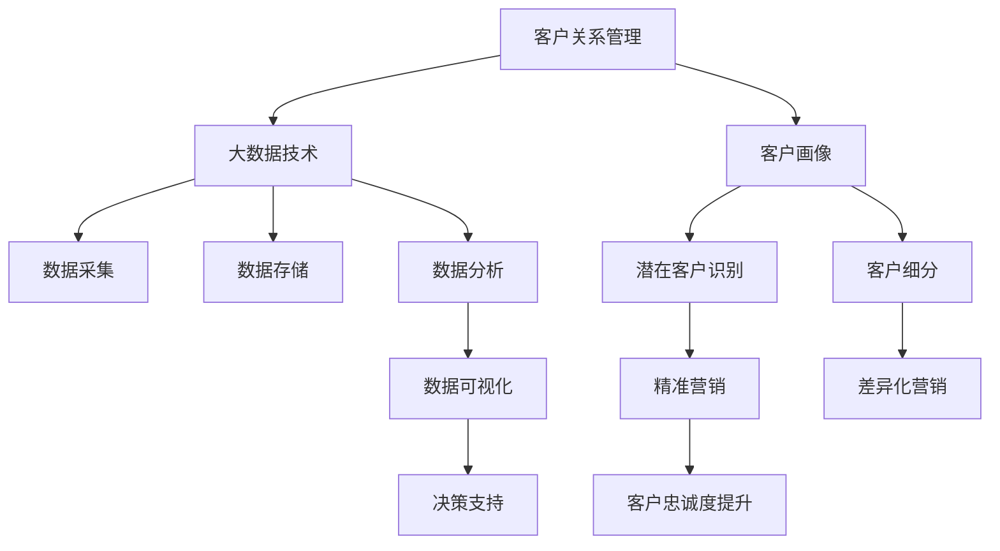

                 

# 信息差的客户关系管理革新：大数据如何优化客户关系管理

## 1. 背景介绍

### 1.1 问题由来
在当今数字化时代，客户关系管理(Customer Relationship Management, CRM)成为了企业管理中至关重要的环节。随着市场的竞争加剧和消费者需求的日趋个性化，企业需要更高效、更智能的CRM系统，以实现精准营销、客户细分、忠诚度提升等目标。然而，传统的CRM系统往往依赖于手工输入，数据质量参差不齐，客户信息更新不及时，客户画像片面，导致企业无法充分利用客户数据，无法有效跟进潜在客户，最终造成信息差，影响了客户关系的建立和维护。

### 1.2 问题核心关键点
本文聚焦于如何通过大数据技术优化客户关系管理，缩小企业与客户之间的信息差，提升客户满意度，增强客户黏性，最终实现商业价值增长。具体问题包括：

- 如何构建更全面的客户画像？
- 如何快速识别潜在客户？
- 如何优化客户细分策略？
- 如何利用数据驱动客户关系管理？

### 1.3 问题研究意义
优化客户关系管理对于提升企业竞争力和市场份额具有重要意义。通过大数据技术，企业能够获取和分析海量客户数据，发现潜在客户和关联机会，精准营销，实现客户关系的数字化、智能化管理。具体意义体现在：

1. **提升客户满意度**：通过个性化的服务和产品推荐，提升客户体验，增加客户忠诚度。
2. **提高销售转化率**：通过精准营销和客户细分，有效识别和跟进潜在客户，提升销售业绩。
3. **优化客户细分策略**：基于大数据分析，发现不同客户群体的共性和差异，进行更精细的客户细分。
4. **强化数据驱动决策**：利用数据分析工具，提供科学的决策依据，优化资源配置，提升运营效率。

## 2. 核心概念与联系

### 2.1 核心概念概述

为更好地理解如何通过大数据优化客户关系管理，本节将介绍几个密切相关的核心概念：

- 客户关系管理(CRM)：通过系统化的方法和技术，实现客户信息的收集、管理、分析和利用，以提高客户满意度和忠诚度。
- 大数据技术：指从海量数据中提取有价值信息的技术，包括数据采集、存储、处理、分析和应用等。
- 客户画像：基于客户历史行为和属性数据，构建的详尽而多维的客户信息概貌。
- 潜在客户识别：通过数据分析和模型训练，识别有潜在购买意向的客户。
- 客户细分：将客户分成若干个更小的群体，针对不同客户群体采取不同的营销策略。
- 数据驱动决策：以数据分析为基础，支持企业决策过程，提升决策准确性和效率。

这些概念之间的逻辑关系可以通过以下Mermaid流程图来展示：



这个流程图展示了大数据技术在客户关系管理中的作用：

1. 通过大数据技术，构建和更新客户画像。
2. 使用大数据技术，识别潜在客户。
3. 应用大数据技术，进行客户细分。
4. 利用大数据技术，驱动精准营销和差异化营销。
5. 通过大数据技术，提升客户忠诚度。

这些核心概念共同构成了大数据在客户关系管理中的应用框架，使其能够有效地管理客户信息，精准识别客户需求，提升客户关系管理水平。

## 3. 核心算法原理 & 具体操作步骤

### 3.1 算法原理概述

通过大数据技术优化客户关系管理，本质上是通过数据分析和模型训练，从海量数据中提取有价值信息，并应用于客户画像构建、潜在客户识别、客户细分等过程。具体而言，数据驱动的CRM系统包括以下几个步骤：

1. **数据采集与存储**：收集客户基本信息、行为数据、互动数据等，存储在数据仓库中。
2. **数据预处理**：清洗数据、处理缺失值、转换数据格式等，确保数据质量。
3. **数据分析与建模**：利用机器学习、深度学习等技术，构建客户画像、识别潜在客户、进行客户细分等模型。
4. **数据可视化**：通过数据可视化工具，将分析结果呈现给企业决策者，提供直观的决策支持。
5. **决策支持与优化**：基于数据分析结果，优化营销策略、资源配置等，提升客户关系管理效果。

### 3.2 算法步骤详解

基于大数据技术的客户关系管理优化步骤包括：

**Step 1: 数据采集与存储**
- 收集客户基本信息，如姓名、年龄、性别、联系方式等。
- 收集客户行为数据，如购买记录、浏览记录、互动记录等。
- 将数据存储在数据仓库中，并建立索引和关联关系。

**Step 2: 数据预处理**
- 清洗数据，去除重复和错误数据。
- 处理缺失值，填补或删除缺失数据。
- 数据格式转换，统一数据类型和单位。

**Step 3: 数据分析与建模**
- 基于历史数据，构建客户画像模型，识别客户基本信息、行为特征、兴趣偏好等。
- 应用机器学习模型，如分类、聚类、关联规则挖掘等，识别潜在客户。
- 利用聚类分析，进行客户细分，识别不同客户群体的特点和需求。

**Step 4: 数据可视化**
- 通过数据可视化工具，如Tableau、Power BI等，将分析结果以图表、仪表盘等形式呈现。
- 提供直观的客户画像、潜在客户分布、客户细分结果等展示。

**Step 5: 决策支持与优化**
- 基于数据分析结果，优化客户细分策略、营销策略、服务方案等。
- 实时监控客户互动和反馈，不断调整和优化客户关系管理策略。

### 3.3 算法优缺点

基于大数据技术的客户关系管理优化方法具有以下优点：

1. **数据驱动**：通过大数据分析，发现客户需求和行为规律，提供数据驱动的决策支持。
2. **全面准确**：基于海量数据构建客户画像，识别潜在客户和细分群体，提供全面、准确的客户信息。
3. **动态更新**：实时更新客户信息，动态调整营销策略，提升客户关系管理的时效性。
4. **预测能力**：利用机器学习模型，预测客户行为和需求，提前布局，抢占市场先机。

同时，该方法也存在一些局限性：

1. **数据隐私**：客户数据的收集和使用可能涉及隐私问题，需要遵守相关法律法规。
2. **数据质量**：数据采集和存储过程中，可能存在数据质量问题，影响分析结果。
3. **技术门槛**：大数据技术需要较高技术门槛，对企业数据处理能力提出较高要求。
4. **成本投入**：大数据系统建设和维护需要较高成本，中小企业可能难以负担。

尽管存在这些局限性，但就目前而言，大数据技术在客户关系管理中的应用仍是大势所趋。企业需要综合权衡成本与效益，合理投入，以实现客户关系管理的数字化转型。

### 3.4 算法应用领域

大数据技术在客户关系管理中的应用，已经涵盖了诸多领域，具体包括：

- 零售行业：通过大数据分析客户行为和偏好，提供个性化推荐和精准营销。
- 金融行业：利用大数据分析客户信用和风险，优化贷款审批流程。
- 电信行业：基于客户行为数据，提供定制化的服务方案。
- 医疗行业：通过大数据分析患者健康数据，提供个性化的医疗服务。
- 旅游行业：利用大数据分析用户偏好，提供定制化的旅游产品推荐。
- 教育行业：基于学生学习行为数据，提供个性化的教育方案。

除了上述这些经典应用外，大数据技术在更多领域也显示出其广泛的应用前景，如政府服务、智能制造、能源管理等，为各行各业带来了数字化转型的新机遇。

## 4. 数学模型和公式 & 详细讲解 & 举例说明

### 4.1 数学模型构建

本节将使用数学语言对通过大数据优化客户关系管理的过程进行更加严格的刻画。

设客户数据集为 $D=\{(x_i,y_i)\}_{i=1}^N, x_i \in \mathcal{X}, y_i \in \mathcal{Y}$，其中 $x_i$ 为客户的特征向量，$y_i$ 为目标标签（如购买记录、互动行为等）。

定义客户画像模型为 $f(x) = (x; \theta)$，其中 $\theta$ 为模型的参数，表示模型的输出结果。客户画像的目标是最小化预测误差，即：

$$
\min_{\theta} \frac{1}{N} \sum_{i=1}^N \| f(x_i) - y_i \|^2
$$

其中 $\| \cdot \|$ 为L2范数。

客户画像模型可以是线性回归、决策树、支持向量机等传统的机器学习模型，也可以是深度神经网络模型，如全连接网络、卷积神经网络(CNN)、循环神经网络(RNN)等。

### 4.2 公式推导过程

以下我们以线性回归模型为例，推导客户画像模型的最小化误差公式。

设客户特征向量为 $x \in \mathbb{R}^d$，目标标签为 $y \in \mathbb{R}$。假设线性回归模型为：

$$
f(x) = w^Tx + b
$$

其中 $w \in \mathbb{R}^d$ 为权重向量，$b \in \mathbb{R}$ 为偏置项。目标是最小化预测误差，即：

$$
\min_{w,b} \frac{1}{N} \sum_{i=1}^N (y_i - f(x_i))^2
$$

根据最小二乘法的原理，上述问题等价于求解以下矩阵方程：

$$
\mathbf{W} = \arg\min_{\mathbf{W}} \| \mathbf{Y} - \mathbf{X}\mathbf{W} \|^2
$$

其中 $\mathbf{Y}$ 为目标向量，$\mathbf{X}$ 为特征矩阵，$\mathbf{W}$ 为权重向量。求解该方程，得到最优权重向量 $\mathbf{W}$，进而得到客户画像模型：

$$
f(x) = \mathbf{W}^T x + b
$$

通过线性回归模型，可以对客户行为和属性进行建模，构建客户画像，实现客户分群、潜在客户识别等任务。

### 4.3 案例分析与讲解

假设某电商平台收集了用户的购买记录、浏览记录、评论信息等数据，目标是构建客户画像，进行个性化推荐。数据集包括100万个客户记录，每个记录包含20个特征，如年龄、性别、购买金额、浏览时间等。

**Step 1: 数据预处理**
- 清洗数据，去除重复和错误记录。
- 处理缺失值，填补缺失数据。
- 数据格式转换，统一数据类型和单位。

**Step 2: 特征工程**
- 选择重要特征，如购买金额、浏览时间、用户评分等。
- 进行特征编码，将类别型特征转换为数值型特征。

**Step 3: 模型训练**
- 将数据集划分为训练集和测试集，比例为70%:30%。
- 使用线性回归模型进行训练，求解最优权重向量。
- 在测试集上评估模型性能，计算均方误差。

**Step 4: 模型应用**
- 根据客户画像模型，预测客户的购买倾向。
- 根据购买倾向，推荐相应的产品。
- 实时监控客户互动和反馈，不断调整和优化模型。

通过上述步骤，电商平台可以构建详尽的客户画像，实现精准推荐和个性化服务，提升客户满意度和转化率。

## 5. 项目实践：代码实例和详细解释说明

### 5.1 开发环境搭建

在进行大数据驱动的客户关系管理实践前，我们需要准备好开发环境。以下是使用Python进行PyTorch开发的环境配置流程：

1. 安装Anaconda：从官网下载并安装Anaconda，用于创建独立的Python环境。

2. 创建并激活虚拟环境：
```bash
conda create -n pytorch-env python=3.8 
conda activate pytorch-env
```

3. 安装PyTorch：根据CUDA版本，从官网获取对应的安装命令。例如：
```bash
conda install pytorch torchvision torchaudio cudatoolkit=11.1 -c pytorch -c conda-forge
```

4. 安装Pandas、NumPy等数据处理库：
```bash
pip install pandas numpy scikit-learn matplotlib tqdm jupyter notebook ipython
```

5. 安装机器学习库scikit-learn：
```bash
pip install scikit-learn
```

完成上述步骤后，即可在`pytorch-env`环境中开始大数据驱动的CRM系统开发。

### 5.2 源代码详细实现

这里我们以线性回归模型为例，展示如何使用scikit-learn库构建客户画像，并进行潜在客户识别和客户细分。

首先，准备客户数据集和特征：

```python
import pandas as pd
from sklearn.model_selection import train_test_split

# 读取客户数据集
data = pd.read_csv('customer_data.csv')

# 选择重要特征
features = ['age', 'gender', 'purchase_amount', 'browsing_time']
X = data[features]

# 选择目标标签
y = data['purchase_record']

# 数据拆分
X_train, X_test, y_train, y_test = train_test_split(X, y, test_size=0.3, random_state=42)
```

然后，构建和训练线性回归模型：

```python
from sklearn.linear_model import LinearRegression

# 构建线性回归模型
model = LinearRegression()

# 训练模型
model.fit(X_train, y_train)
```

接着，使用模型进行潜在客户识别和客户细分：

```python
from sklearn.metrics import mean_squared_error

# 在测试集上评估模型性能
y_pred = model.predict(X_test)
mse = mean_squared_error(y_test, y_pred)

# 计算R2分数
r2_score = model.score(X_test, y_test)

print(f"测试集均方误差: {mse:.2f}, R2分数: {r2_score:.2f}")
```

最后，使用模型对新客户进行预测和分析：

```python
# 对新客户进行预测
new_customer = pd.DataFrame({'age': 35, 'gender': 'M', 'purchase_amount': 1000, 'browsing_time': 30})
prediction = model.predict(new_customer)

print(f"新客户预测购买记录: {prediction}")
```

### 5.3 代码解读与分析

让我们再详细解读一下关键代码的实现细节：

**数据预处理**
- 使用Pandas库读取数据集，并选择合适的特征。
- 使用train_test_split函数将数据集划分为训练集和测试集，确保模型评估的公平性。

**模型训练**
- 使用scikit-learn的LinearRegression类构建线性回归模型。
- 调用fit函数，将训练集数据拟合到模型中。

**模型评估**
- 使用均方误差(mean_squared_error)函数计算模型在测试集上的均方误差。
- 使用R2分数(r2_score)函数计算模型在测试集上的决定系数，评估模型的拟合效果。

**模型应用**
- 使用训练好的模型对新客户进行预测，获取其购买倾向。
- 根据预测结果，进行个性化推荐和客户细分。

通过上述步骤，我们构建了基于线性回归模型的客户画像，并通过评估和预测，验证了模型的性能和实用性。

## 6. 实际应用场景

### 6.1 零售行业

在零售行业中，通过大数据优化客户关系管理，可以实现以下功能：

- **客户画像构建**：基于历史购买记录和浏览行为，构建详细的客户画像，了解客户偏好和需求。
- **精准营销**：根据客户画像，推送个性化推荐和促销活动，提升销售转化率。
- **库存管理**：通过分析客户购买行为，优化库存结构，减少库存积压。
- **客户细分**：根据客户画像，进行细分，制定针对不同群体的营销策略。

### 6.2 金融行业

在金融行业中，通过大数据优化客户关系管理，可以实现以下功能：

- **信用评估**：利用客户信用记录和行为数据，评估客户信用等级。
- **风险控制**：通过数据分析，识别潜在风险客户，减少贷款违约率。
- **客户细分**：根据客户资产和消费行为，进行分层管理，制定差异化服务策略。
- **客户忠诚度提升**：通过个性化推荐和优惠活动，增强客户黏性。

### 6.3 电信行业

在电信行业中，通过大数据优化客户关系管理，可以实现以下功能：

- **用户画像构建**：基于用户通话记录和上网行为，构建详尽的用户画像，了解用户偏好。
- **精准营销**：根据用户画像，推送个性化的套餐和优惠活动，提升用户满意度。
- **网络优化**：通过分析用户网络使用情况，优化网络资源配置，提升用户体验。
- **客户细分**：根据用户行为数据，进行细分，制定差异化服务策略。

### 6.4 未来应用展望

随着大数据技术的发展，未来客户关系管理的优化将更加智能化和个性化。大数据驱动的CRM系统将具备以下趋势：

1. **实时性增强**：通过实时数据采集和处理，实现客户关系管理的实时更新和优化。
2. **多模态融合**：利用语音、图像、视频等多模态数据，提升客户画像的全面性和准确性。
3. **模型可解释性**：通过模型可解释性技术，解释客户关系管理的决策过程，增强系统的透明性和可信度。
4. **跨领域应用**：将大数据技术应用到更多领域，如医疗、教育、政府服务等，实现全行业的客户关系管理优化。
5. **自动化决策**：通过自动化决策技术，实现客户关系管理的自动化和智能化，提升效率和准确性。

大数据驱动的CRM系统，将为各行各业带来全新的客户关系管理模式，提升客户体验和满意度，促进企业商业价值的增长。

## 7. 工具和资源推荐

### 7.1 学习资源推荐

为了帮助开发者系统掌握大数据驱动的客户关系管理理论基础和实践技巧，这里推荐一些优质的学习资源：

1. 《Python数据科学手册》系列博文：由Kaggle竞赛冠军撰写，详细介绍了数据采集、处理、分析等核心技术。

2. Coursera《机器学习》课程：由斯坦福大学开设的知名课程，涵盖机器学习的基本概念和算法，适合初学者入门。

3. 《深度学习入门》书籍：面向深度学习初学者，通过实例讲解深度学习在客户关系管理中的应用。

4. Kaggle平台：全球最大的数据科学竞赛平台，提供大量实战项目和数据集，适合实践学习。

5. HuggingFace官方文档：提供丰富的预训练模型和代码示例，帮助开发者快速上手。

通过对这些资源的学习实践，相信你一定能够快速掌握大数据驱动的CRM技术，并用于解决实际的客户关系管理问题。

### 7.2 开发工具推荐

高效的开发离不开优秀的工具支持。以下是几款用于大数据驱动CRM系统开发的常用工具：

1. Python：面向数据科学家的高效编程语言，支持丰富的数据处理库和机器学习库。

2. PyTorch：基于Python的开源深度学习框架，支持动态计算图和GPU加速，适合构建复杂的客户关系管理模型。

3. TensorFlow：由Google主导开发的开源深度学习框架，支持分布式计算和自动微分，适合大规模工程应用。

4. Apache Spark：基于内存计算的分布式计算框架，支持大数据处理和机器学习任务。

5. Hadoop生态系统：包括Hadoop、Hive、HBase等组件，支持大规模数据存储和处理。

6. Tableau、Power BI：数据可视化工具，支持复杂数据报表和交互式仪表盘，方便数据分析和展示。

合理利用这些工具，可以显著提升大数据驱动的CRM系统开发效率，加快创新迭代的步伐。

### 7.3 相关论文推荐

大数据驱动的客户关系管理技术的发展源于学界的持续研究。以下是几篇奠基性的相关论文，推荐阅读：

1. K-means: A Method for Cluster Analysis of Multivariate Observations and Its Applications to Psychometric Problem（K-means聚类算法）：介绍聚类分析的基本原理和应用，帮助理解客户细分技术。

2. The Elements of Statistical Learning（《统计学习方法》）：深度讲解机器学习算法，包括回归、分类、聚类等，适合系统学习。

3. TensorFlow: A System for Large-Scale Machine Learning（TensorFlow系统介绍）：介绍TensorFlow的基本架构和应用，适合深度学习开发。

4. Scikit-learn: Machine Learning in Python（Scikit-learn介绍）：介绍Scikit-learn的基本功能和应用，适合数据分析和机器学习开发。

5. Hadoop: The Proliferation of a Data Processing System（Hadoop系统介绍）：介绍Hadoop的基本架构和应用，适合大数据处理开发。

这些论文代表了大数据驱动CRM技术的发展脉络。通过学习这些前沿成果，可以帮助研究者把握学科前进方向，激发更多的创新灵感。

## 8. 总结：未来发展趋势与挑战

### 8.1 总结

本文对大数据驱动的客户关系管理进行了全面系统的介绍。首先阐述了大数据技术在客户关系管理中的重要性，明确了大数据优化客户关系管理的目标和意义。其次，从原理到实践，详细讲解了数据驱动的CRM系统构建过程，给出了大数据驱动CRM系统开发的完整代码实例。同时，本文还广泛探讨了大数据驱动CRM系统在零售、金融、电信等多个行业领域的应用前景，展示了大数据驱动CRM技术的广阔前景。此外，本文精选了大数据驱动CRM系统的各类学习资源，力求为读者提供全方位的技术指引。

通过本文的系统梳理，可以看到，大数据驱动的客户关系管理技术正在成为CRM领域的重要范式，极大地拓展了客户关系管理系统的应用边界，提升了客户关系管理的效果。未来，伴随大数据技术和大规模模型的不断发展，客户关系管理系统的性能和应用范围将得到进一步提升。

### 8.2 未来发展趋势

展望未来，大数据驱动的客户关系管理技术将呈现以下几个发展趋势：

1. **多模态融合**：利用语音、图像、视频等多模态数据，提升客户画像的全面性和准确性。
2. **实时性增强**：通过实时数据采集和处理，实现客户关系管理的实时更新和优化。
3. **模型可解释性**：通过模型可解释性技术，解释客户关系管理的决策过程，增强系统的透明性和可信度。
4. **自动化决策**：通过自动化决策技术，实现客户关系管理的自动化和智能化，提升效率和准确性。
5. **跨领域应用**：将大数据技术应用到更多领域，如医疗、教育、政府服务等，实现全行业的客户关系管理优化。
6. **智能推荐**：利用机器学习、深度学习等技术，实现个性化推荐和精准营销，提升客户体验和满意度。

这些趋势凸显了大数据驱动CRM技术的广阔前景。这些方向的探索发展，必将进一步提升客户关系管理系统的性能和应用范围，为各行各业带来数字化转型的新机遇。

### 8.3 面临的挑战

尽管大数据驱动的客户关系管理技术已经取得了瞩目成就，但在迈向更加智能化、普适化应用的过程中，它仍面临着诸多挑战：

1. **数据隐私**：客户数据的收集和使用可能涉及隐私问题，需要遵守相关法律法规。
2. **数据质量**：数据采集和存储过程中，可能存在数据质量问题，影响分析结果。
3. **技术门槛**：大数据技术需要较高技术门槛，对企业数据处理能力提出较高要求。
4. **成本投入**：大数据系统建设和维护需要较高成本，中小企业可能难以负担。
5. **模型复杂性**：大规模模型的训练和部署需要高性能计算资源，对企业计算能力提出较高要求。
6. **模型可解释性**：复杂模型的决策过程难以解释，客户关系管理的透明性和可信度面临挑战。

尽管存在这些挑战，但就目前而言，大数据驱动的CRM技术仍是大势所趋。企业需要综合权衡成本与效益，合理投入，以实现客户关系管理的数字化转型。

### 8.4 研究展望

面对大数据驱动CRM技术所面临的挑战，未来的研究需要在以下几个方面寻求新的突破：

1. **数据隐私保护**：开发更加安全的数据存储和传输技术，保护客户隐私。
2. **数据质量提升**：优化数据采集和处理流程，提升数据质量，确保分析结果的可靠性。
3. **模型可解释性**：发展模型可解释性技术，增强客户关系管理的透明性和可信度。
4. **自动化决策**：开发自动化决策技术，提升客户关系管理的自动化和智能化水平。
5. **多模态融合**：利用多模态数据，构建更加全面和准确的客户画像。
6. **跨领域应用**：将大数据技术应用到更多领域，提升各行各业客户关系管理的效果。

这些研究方向的探索，必将引领大数据驱动CRM技术迈向更高的台阶，为构建安全、可靠、可解释、可控的智能系统铺平道路。面向未来，大数据驱动CRM技术还需要与其他人工智能技术进行更深入的融合，如知识表示、因果推理、强化学习等，多路径协同发力，共同推动客户关系管理系统的进步。只有勇于创新、敢于突破，才能不断拓展客户关系管理的边界，让大数据技术更好地造福人类社会。

## 9. 附录：常见问题与解答

**Q1：大数据驱动的CRM系统是否适用于所有行业？**

A: 大数据驱动的CRM系统在大多数行业都能取得不错的效果，特别是对于数据量较大的行业。但对于一些特定行业的客户关系管理，可能需要结合行业特点，进行定制化的开发和优化。例如，医疗行业需要结合电子健康记录等特殊数据，教育行业需要结合学生学习行为数据等。

**Q2：如何选择适合的客户画像模型？**

A: 选择适合的客户画像模型需要考虑数据特点和业务需求。通常情况下，可以使用线性回归、决策树、支持向量机等传统机器学习模型，或深度神经网络模型，如全连接网络、卷积神经网络(CNN)、循环神经网络(RNN)等。对于数据量较大、特征较多的情况，建议使用深度学习模型，而对于数据量较小、特征较少的情况，则可以使用传统机器学习模型。

**Q3：如何优化客户画像模型的性能？**

A: 优化客户画像模型需要综合考虑数据预处理、特征工程、模型训练等各个环节。具体措施包括：
1. 数据清洗：去除重复和错误数据，处理缺失值。
2. 特征选择：选择重要特征，避免过拟合。
3. 模型调参：调整学习率、正则化系数等参数，优化模型性能。
4. 模型集成：使用集成学习技术，提升模型泛化能力。
5. 模型验证：使用交叉验证等技术，评估模型性能，避免过拟合。

这些措施可以帮助优化客户画像模型，提升模型性能和泛化能力。

**Q4：客户画像模型的应用场景有哪些？**

A: 客户画像模型的应用场景非常广泛，具体包括：
1. 客户细分：根据客户画像进行细分成不同群体，制定针对不同群体的营销策略。
2. 潜在客户识别：利用客户画像，识别有潜在购买意向的客户。
3. 精准营销：根据客户画像，推送个性化推荐和促销活动，提升销售转化率。
4. 客户忠诚度提升：通过客户画像，提供个性化服务，提升客户满意度和忠诚度。
5. 风险控制：利用客户画像，评估客户信用风险，制定差异化服务策略。
6. 客户推荐：利用客户画像，提供个性化的产品和服务推荐。

通过客户画像模型，可以全面了解客户需求和行为，实现精准营销和个性化服务，提升客户关系管理的效果。

**Q5：如何处理大数据驱动CRM系统中的数据隐私问题？**

A: 数据隐私问题是客户关系管理中的重要问题，需要采取以下措施：
1. 数据匿名化：使用数据匿名化技术，保护客户隐私。
2. 数据加密：采用数据加密技术，保护数据在传输和存储过程中的安全性。
3. 数据访问控制：设置数据访问权限，限制敏感数据访问。
4. 数据合规性：遵守相关法律法规，如GDPR等，保护客户隐私。
5. 数据审计：定期对数据使用情况进行审计，确保数据使用合法合规。

通过这些措施，可以有效保护客户隐私，避免数据泄露和安全风险。

---

作者：禅与计算机程序设计艺术 / Zen and the Art of Computer Programming

