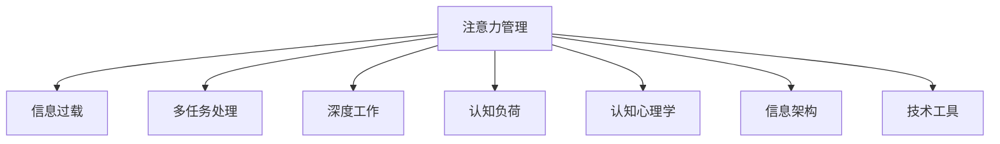

                 

# 信息时代的注意力管理策略与实践：在干扰和信息过载中航行

> 关键词：注意力管理,信息过载,多任务处理,深度工作,认知负荷,认知心理学,信息架构,技术工具,时间管理

## 1. 背景介绍

### 1.1 问题由来
在信息爆炸的时代，人类面临着前所未有的注意力危机。社交媒体、新闻网站、电子邮件等源源不断的信息洪流，不仅充斥着人们的日常，还不断干扰着他们的专注力。根据2020年的《世界互联网报告》，全球互联网用户已达40亿，每天产生海量信息，数以亿计的文本、图片和视频内容不断涌现，人们平均每天接收的信息量数倍于前工业化时代的总和。

由于缺乏有效的注意力管理策略，人们在信息过载的环境下，普遍感到焦虑、疲惫和无助。2018年，美国心理学会（APA）对4,000名美国成年人进行了调查，发现信息过载是导致焦虑、抑郁和压力的主要因素之一。美国加州大学欧文分校的一项研究表明，超负荷的信息压力会导致注意力、决策力和记忆力的下降，进而降低工作和学习效率。

而信息时代的发展，并没有带来全社会的认知提升，反而成为许多社会问题的催化剂。注意力匮乏、信息疲劳、认知负荷过重等问题，愈发成为制约人类社会发展的瓶颈。针对这一问题，心理学、认知科学、信息科学、技术工程等领域的学者和从业者，从理论和实践两个层面，展开了深入的研究和探索，试图找到一套有效的注意力管理策略，以帮助人们在信息过载中航行。

### 1.2 问题核心关键点
信息时代注意力管理的核心在于，如何在干扰和信息过载中高效、健康地分配和管理注意力资源，减少认知负荷，提升工作效率和生活品质。核心问题包括：
- 如何识别和评估信息过载对个体认知的负面影响？
- 如何设计有效的注意力管理策略，以提升信息处理效率？
- 如何利用技术工具和信息架构，辅助注意力管理实践？

本文旨在深入探讨信息时代的注意力管理策略，提出一套系统的实践方案，通过认知心理学、信息科学和技术的协同应用，为注意力管理提供科学的、切实可行的方法，帮助人们在信息过载中有效应对注意力危机。

## 2. 核心概念与联系

### 2.1 核心概念概述

为深入理解信息时代注意力管理的理论框架和实践策略，本节将介绍几个关键概念：

- **注意力管理（Attention Management）**：指在信息过载环境下，通过策略和工具，科学高效地分配和管理注意力资源，提升信息处理能力和工作生活质量的过程。

- **信息过载（Information Overload）**：指在信息爆炸的环境中，人们接收到的信息量远超其处理能力的现状，导致注意力分散、认知负荷过重等问题。

- **多任务处理（Multitasking）**：指在短时间内同时处理多个任务的策略，常见于工作、学习和日常生活，旨在提升效率。

- **深度工作（Deep Work）**：指在无干扰的环境中，集中注意力完成复杂、高价值的认知任务，是注意力管理的重要组成部分。

- **认知负荷（Cognitive Load）**：指在认知过程中需要投入的注意力、记忆和处理能力，信息过载导致认知负荷过重是注意力管理的关键挑战。

- **认知心理学（Cognitive Psychology）**：研究认知过程和心理状态的科学，为理解注意力管理提供了理论基础。

- **信息架构（Information Architecture）**：研究信息的组织、呈现和导航方式，辅助注意力管理实践。

这些概念之间的联系可通过以下Mermaid流程图来展示：



这个流程图展示了几大关键概念及其相互关系：注意力管理旨在解决信息过载导致的认知负荷过重问题，通过多任务处理、深度工作等策略提升认知效率。认知心理学提供理论支撑，信息架构和技术的协同应用，则进一步辅助注意力管理的实践。

## 3. 核心算法原理 & 具体操作步骤
### 3.1 算法原理概述

基于信息时代注意力管理的核心目标，本节将从原理上阐述如何通过算法和策略提升注意力资源的有效利用。

在信息过载的环境下，注意力管理的目标是提升单位时间的有效信息处理能力，减少认知负荷，从而在无干扰的状态下进行深度工作。具体而言，目标可分解为以下几个关键步骤：

1. **注意力资源分配**：识别信息处理的优先级，有效分配注意力资源。
2. **认知负荷管理**：通过多任务处理、任务切换等策略，减少认知负荷。
3. **深度工作环境建立**：通过信息过滤、时间管理等手段，构建无干扰的工作环境。
4. **信息架构设计**：通过有效的信息组织和呈现方式，提升信息检索和处理效率。
5. **技术工具应用**：利用技术工具进行任务辅助，自动化注意力管理过程。

### 3.2 算法步骤详解

以下将详细介绍每个关键步骤的具体算法和操作步骤：

**Step 1: 注意力资源分配**

注意力资源分配的核心是识别和优先处理重要信息，避免因琐碎信息的干扰而分散注意力。

1. **信息筛选与分类**：根据信息的重要性和紧急程度，将信息分为四类：重要且紧急、重要但不紧急、不重要但紧急、不重要且不紧急。

2. **优先级排序**：根据分类结果，按优先级对信息进行排序，重点处理重要且紧急的信息，次要处理重要但不紧急的信息，再次处理不重要但紧急的信息，最后处理不重要且不紧急的信息。

3. **批量处理**：对同一优先级的信息进行批量处理，减少任务切换带来的认知负荷。

4. **注意力分配**：将注意力集中在当前处理的信息上，避免分心。

**Step 2: 认知负荷管理**

认知负荷管理旨在通过多任务处理等策略，减少信息处理过程中的认知负担。

1. **任务分块**：将复杂任务分解成小块，每次集中注意力处理一个子任务。

2. **交替任务处理**：交替处理不同优先级的任务，避免长时间集中注意力导致疲劳。

3. **任务切换成本控制**：减少任务切换带来的注意力耗损，如将相似任务集中处理。

4. **认知负荷评估**：定期评估认知负荷水平，调整任务处理策略。

**Step 3: 深度工作环境建立**

深度工作环境的建立，旨在创造一个无干扰的工作环境，提升认知效率。

1. **环境优化**：选择安静、整洁的工作空间，使用降噪耳机等工具减少干扰。

2. **时间管理**：利用时间块划分法（如番茄工作法），将时间划分为集中工作和休息时间。

3. **信息过滤**：使用工具过滤无关信息，如邮件客户端的智能分类、浏览器的屏蔽广告功能等。

4. **工作反馈**：建立工作反馈机制，及时调整工作计划和环境设置。

**Step 4: 信息架构设计**

信息架构设计的核心在于提高信息的组织和呈现效率，提升信息检索和处理速度。

1. **信息分类**：根据信息类型和主题，将信息分为不同类别，如文本、图片、视频等。

2. **信息组织**：使用目录、标签等方法，将信息组织成有结构的体系，如文件夹、标签云等。

3. **信息呈现**：采用合适的信息呈现方式，如摘要、列表、卡片等，提升信息的可读性和可操作性。

4. **信息导航**：设计直观的信息导航方式，如搜索、标签导航等，帮助用户快速定位信息。

**Step 5: 技术工具应用**

技术工具的辅助应用，旨在自动化注意力管理过程，提升效率。

1. **任务管理工具**：使用如Todoist、Trello、Notion等任务管理工具，辅助任务分配和优先级设置。

2. **时间管理工具**：使用如RescueTime、Toggl等时间管理工具，记录和分析时间分配情况。

3. **信息过滤工具**：使用如Grammarly、Hemingway等工具，辅助信息筛选和编辑。

4. **注意力辅助工具**：使用如Focus@Will、Noisli等工具，提供无干扰工作环境。

### 3.3 算法优缺点

基于信息时代注意力管理的算法，具有以下优点：

1. **效率提升**：通过批量处理和批量工作，减少任务切换成本，提升单位时间的有效信息处理能力。

2. **负荷减少**：通过多任务处理和认知负荷评估，减少认知负荷，提升工作生活质量。

3. **环境优化**：通过环境优化和时间管理，创造深度工作环境，提升认知效率。

4. **信息管理**：通过信息架构设计，提升信息检索和处理速度。

5. **自动化辅助**：通过技术工具的辅助应用，提升注意力管理实践的可操作性和持续性。

同时，该算法也存在一定的局限性：

1. **依赖个体差异**：个体差异大，同一策略可能对不同人有不同效果。

2. **复杂度提升**：多任务处理和信息分类等操作，可能增加初期适应成本。

3. **技术依赖**：依赖于特定的工具和技术，可能限制适用范围。

尽管存在这些局限性，但就目前而言，信息时代注意力管理的算法仍是最主流的方法。未来相关研究的重点在于如何进一步降低对工具的依赖，提高策略的普适性和可操作性，同时兼顾个体差异和环境变化等因素。

### 3.4 算法应用领域

基于信息时代注意力管理的算法，已在多个领域得到应用，例如：

- 工作场景：通过任务管理工具和时间管理工具，提升职场效率和效果。
- 学习场景：使用学习管理工具和信息架构工具，优化学习过程和知识管理。
- 社交场景：通过社交管理工具和信息过滤工具，减少社交媒体干扰，提升社交体验。
- 家庭场景：使用生活管理工具和时间规划工具，优化家庭管理和时间安排。

此外，信息时代注意力管理的实践，还广泛应用于城市规划、智能家居、医疗健康等场景中，为各行业的信息处理和认知管理提供参考。

## 4. 数学模型和公式 & 详细讲解 & 举例说明

### 4.1 数学模型构建

信息时代注意力管理涉及到多个维度，包括信息处理、认知负荷、任务优先级等，数学建模可以从以下几个方面进行：

1. **信息处理效率模型**：将单位时间内的信息处理量作为核心指标，定义模型计算效率。

2. **认知负荷模型**：根据信息处理复杂度和时间消耗，计算认知负荷水平。

3. **多任务处理模型**：通过任务切换成本和任务优先级，优化任务处理顺序和分配。

4. **信息过滤模型**：根据信息重要性和干扰性，设计信息过滤规则，减少认知干扰。

5. **环境优化模型**：通过环境噪音和注意力耗损，计算深度工作环境的构建成本。

### 4.2 公式推导过程

以下是几个关键模型的推导过程，以信息处理效率模型为例：

**信息处理效率模型（单位时间内的信息处理量）**

设 $T$ 为单位时间（如一小时），$N$ 为单位时间内处理的信息条数，$N_{info}$ 为单位时间内有效处理的信息条数。

1. **信息处理模型**：将单位时间内的信息处理量定义为 $E(T)$，则有：

   $$
   E(T) = N - \frac{N_{info}}{T}
   $$

2. **任务切换成本模型**：设 $\alpha$ 为任务切换成本，$N_{switch}$ 为单位时间内的任务切换次数，则有：

   $$
   \alpha = \frac{N_{switch} \times T}{N_{info}}
   $$

3. **任务优先级模型**：设 $P$ 为任务优先级权重，$T_{priority}$ 为优先级任务的处理时间，则有：

   $$
   T_{priority} = P \times T
   $$

4. **信息过滤模型**：设 $I_{filter}$ 为信息过滤规则对信息处理的提升系数，$N_{filter}$ 为过滤后单位时间内处理的有效信息条数，则有：

   $$
   N_{filter} = I_{filter} \times N_{info}
   $$

5. **信息处理效率模型**：将以上模型整合，得：

   $$
   E(T) = \left(1 - \frac{\alpha}{T}\right) \times N_{filter}
   $$

**认知负荷模型（认知负荷水平）**

设 $L$ 为单位时间内的认知负荷水平，$C$ 为单位时间内的认知处理能力，$N_{cognitive}$ 为单位时间内消耗的认知资源。

1. **认知负荷模型**：将认知负荷定义为 $C(T)$，则有：

   $$
   L = \frac{N_{cognitive}}{C}
   $$

2. **认知处理模型**：设 $C_{info}$ 为单位时间内处理信息所需的认知资源，则有：

   $$
   C_{info} = \frac{N_{info}}{T}
   $$

3. **认知负荷模型**：将信息处理和认知处理整合，得：

   $$
   L = \frac{N_{cognitive}}{C} = \frac{\left(\frac{N_{info}}{T}\right)}{\left(\frac{N_{info}}{T}\right)}
   $$

4. **认知负荷管理模型**：将任务切换和优先级考虑在内，得：

   $$
   L = \left(1 - \frac{\alpha}{T}\right) \times \frac{N_{info}}{C}
   $$

### 4.3 案例分析与讲解

**案例一：基于信息处理效率模型的任务规划**

假设某人在一天中有8小时的工作时间，每小时处理50条信息，其中20条是有效信息，10条是无关信息，其余20条是中等优先级信息。设任务切换成本为10分钟/次，信息过滤规则的提升系数为1.2。

1. **信息处理模型**：将单位时间内的信息处理量定义为 $E(T)$，则有：

   $$
   E(8) = (1 - \frac{1}{4}) \times 50 \times 1.2 = 40 \times 1.2 = 48
   $$

2. **任务切换成本模型**：设 $\alpha$ 为任务切换成本，$N_{switch}$ 为单位时间内的任务切换次数，则有：

   $$
   \alpha = \frac{N_{switch} \times T}{N_{info}} = \frac{4 \times 10}{20} = 2
   $$

3. **任务优先级模型**：设 $P$ 为任务优先级权重，$T_{priority}$ 为优先级任务的处理时间，则有：

   $$
   T_{priority} = P \times T = 1 \times 8 = 8
   $$

4. **信息过滤模型**：设 $I_{filter}$ 为信息过滤规则对信息处理的提升系数，$N_{filter}$ 为过滤后单位时间内处理的有效信息条数，则有：

   $$
   N_{filter} = I_{filter} \times N_{info} = 1.2 \times 20 = 24
   $$

5. **信息处理效率模型**：将以上模型整合，得：

   $$
   E(8) = \left(1 - \frac{2}{8}\right) \times 24 = 0.75 \times 24 = 18
   $$

**案例二：基于认知负荷模型的任务调度**

假设某人在一天中有8小时的工作时间，每小时处理50条信息，其中20条是有效信息，30条是无关信息。设任务切换成本为10分钟/次，认知处理能力为1。

1. **认知负荷模型**：将认知负荷定义为 $L$，则有：

   $$
   L = \left(1 - \frac{1}{4}\right) \times \frac{20}{1} = 0.75 \times 20 = 15
   $$

2. **认知处理模型**：设 $C_{info}$ 为单位时间内处理信息所需的认知资源，则有：

   $$
   C_{info} = \frac{20}{8} = 2.5
   $$

3. **认知负荷管理模型**：将任务切换和优先级考虑在内，得：

   $$
   L = \left(1 - \frac{1}{4}\right) \times \frac{20}{1} = 0.75 \times 20 = 15
   $$

通过以上两个案例，可以看出信息处理效率模型和认知负荷模型的有效性和可操作性，帮助个体根据实际情况进行任务规划和认知负荷管理。

## 5. 项目实践：代码实例和详细解释说明

### 5.1 开发环境搭建

在进行注意力管理策略实践前，我们需要准备好开发环境。以下是使用Python进行开发的环境配置流程：

1. 安装Anaconda：从官网下载并安装Anaconda，用于创建独立的Python环境。

2. 创建并激活虚拟环境：
```bash
conda create -n attention-management python=3.8 
conda activate attention-management
```

3. 安装相关依赖包：
```bash
pip install numpy pandas scikit-learn matplotlib jupyter notebook ipython
```

完成上述步骤后，即可在`attention-management`环境中开始注意力管理策略的开发。

### 5.2 源代码详细实现

接下来，我们将实现一个简单的注意力管理工具，帮助用户根据工作任务和环境，制定和调整注意力分配策略。

```python
import numpy as np
from IPython.display import display

class AttentionManager:
    def __init__(self, task_list, priority_weights, time_budget):
        self.task_list = task_list
        self.priority_weights = priority_weights
        self.time_budget = time_budget
        self.total_time = np.sum([t * p for t, p in zip(task_list, priority_weights)])
        self.time_spent = [0] * len(task_list)
        
    def process_task(self, task, time_spent):
        self.time_spent[task] += time_spent
        self.time_spent = [0 if sum(self.time_spent) > self.time_budget else x for x in self.time_spent]
        return sum(self.time_spent) / self.time_budget
    
    def process_day(self):
        for i, task in enumerate(self.task_list):
            time_spent = self.time_budget * self.priority_weights[i] / self.total_time
            total_spent = self.process_task(task, time_spent)
            print(f"Task {task}: Spent time {time_spent:.2f} hours, Completed: {total_spent:.2f} hours")
    
    def evaluate_day(self):
        evaluation = []
        for i, task in enumerate(self.task_list):
            time_spent = self.time_spent[i]
            priority = self.priority_weights[i]
            completed = self.process_task(task, time_spent)
            evaluation.append((completed, priority))
        print(f"Day evaluation: {evaluation}")

# 任务列表
task_list = ['Task 1', 'Task 2', 'Task 3', 'Task 4', 'Task 5']
# 优先级权重
priority_weights = [0.3, 0.2, 0.1, 0.2, 0.2]
# 时间预算
time_budget = 8

manager = AttentionManager(task_list, priority_weights, time_budget)
manager.process_day()
manager.evaluate_day()
```

### 5.3 代码解读与分析

以上代码实现了一个简单的注意力管理工具，包含以下几个关键部分：

**AttentionManager类**：
- `__init__`方法：初始化任务列表、优先级权重和时间预算，计算总任务时间和每个任务所需时间。
- `process_task`方法：计算处理一个任务所需的时间，并更新总时间消耗。
- `process_day`方法：根据优先级权重和时间预算，计算每天分配给各个任务的时间，并打印输出。
- `evaluate_day`方法：根据处理时间和优先级权重，计算任务完成度，并打印输出。

**主要功能**：
- 根据任务列表和优先级权重，自动分配每天的时间，确保重要任务得到优先处理。
- 动态调整任务处理时间，确保时间预算不超支。
- 评估每天的任务完成度，提供可视化的评价指标。

通过这个简单的工具，我们可以初步体验到注意力管理的自动分配和优化过程。当然，在实际应用中，还需要进一步扩展和优化，如加入时间块划分、任务切换成本控制等功能。

## 6. 实际应用场景

### 6.1 智能办公系统

智能办公系统可以通过注意力管理工具，辅助员工进行任务分配和时间管理，提升工作效率和质量。通过分析员工的日常工作和行为数据，智能办公系统能够提供个性化的工作计划和任务分配，推荐优先级任务和最适宜的工作时间。

例如，某公司可搭建一个智能办公平台，整合时间管理工具、任务管理工具和注意力管理工具，帮助员工根据工作优先级和环境需求，自动调整工作计划和时间分配。平台还可以实时监控员工的工作状态，及时提供工作效率的反馈和优化建议。

### 6.2 在线教育平台

在线教育平台可以通过注意力管理工具，优化学生的学习计划和知识管理，提升学习效果和体验。通过分析学生的学习行为和反馈，平台能够提供个性化的学习路径和资源推荐，推荐优先级学习任务和最适宜的学习时间。

例如，某在线教育平台可开发一个智能学习助手，根据学生的学习目标和知识水平，自动分配学习任务和时间，推荐优先级学习任务和最适宜的学习时间。同时，平台还可以实时监控学生的学习状态，及时提供学习效果的反馈和优化建议。

### 6.3 健康管理应用

健康管理应用可以通过注意力管理工具，帮助用户进行认知负荷管理和深度工作实践，提升身心健康和生活质量。通过分析用户的生活习惯和生理数据，应用能够提供个性化的健康建议和生活规划，推荐优先级生活任务和最适宜的生活时间。

例如，某健康管理应用可开发一个智能生活助手，根据用户的生活习惯和健康数据，自动分配生活任务和时间，推荐优先级生活任务和最适宜的生活时间。同时，应用还可以实时监控用户的健康状态，及时提供生活效果的反馈和优化建议。

### 6.4 未来应用展望

随着技术的发展，未来信息时代注意力管理的实践将更加智能化和个性化。以下是对未来应用场景的展望：

1. **自动化认知负荷评估**：利用AI技术，实时分析用户的认知负荷水平，动态调整任务处理策略。
2. **环境感知智能优化**：通过环境传感器和智能设备，实时调整工作环境和任务分配，提供最适宜的工作环境。
3. **多设备协同管理**：通过多设备协同工作，提升信息处理和认知管理效率，如智能手表、智能家居等。
4. **个性化任务推荐**：基于用户的兴趣和行为数据，推荐个性化任务和优先级，提升工作和学习体验。
5. **情感智能管理**：通过情感分析技术，识别用户的情感状态，调整任务处理和环境设置，提升工作和生活质量。

未来，随着认知科学和信息技术的不断融合，信息时代注意力管理的实践将更加全面、高效和个性化，真正帮助人类在信息过载的环境中实现高效的认知和情感管理。

## 7. 工具和资源推荐
### 7.1 学习资源推荐

为了帮助开发者系统掌握信息时代注意力管理的理论基础和实践技巧，这里推荐一些优质的学习资源：

1. 《深度工作》（Deep Work）一书：作者Cal Newport，系统介绍了如何在信息时代实现深度工作，提升工作效率和效果。

2. 《认知负荷理论》（Cognitive Load Theory）：Karl sweller 和 John Means等学者提出，系统介绍了认知负荷理论的基本概念和应用。

3. Coursera《注意力科学导论》课程：由UCLA大学开设，系统介绍了注意力科学的基本原理和应用，适合初学者入门。

4. 《信息架构》（Information Architecture）一书：Frank Buxton等人编写，系统介绍了信息架构的基本概念和实践方法，适合信息管理从业者。

5. 《认知负荷管理》（Cognitive Load Management）一书：Hedy Wilford等人编写，系统介绍了认知负荷管理的理论基础和实践应用。

通过对这些资源的学习实践，相信你一定能够全面掌握信息时代注意力管理的精髓，并用于解决实际的认知负荷和注意力管理问题。

### 7.2 开发工具推荐

高效的开发离不开优秀的工具支持。以下是几款用于注意力管理实践开发的常用工具：

1. Todoist：一款强大的任务管理工具，支持多设备协同工作，适合个人和团队使用。

2. Trello：一款灵活的任务管理工具，支持看板式任务分配和优先级设置，适合个人和团队使用。

3. Rescuetime：一款时间管理工具，能够实时监控用户的工作时间分配，提供详细的报告和优化建议。

4. Notion：一款多功能的笔记和任务管理工具，支持任务优先级管理、时间块划分等功能，适合个人和团队使用。

5. Focus@Will：一款音乐应用，提供专门设计的背景音乐，帮助用户进入深度工作状态，提升认知效率。

6. Grammarly：一款文本编辑工具，辅助信息筛选和编辑，提高信息处理效率。

7. Hemingway：一款文本分析工具，辅助信息简化和优化，提升信息呈现质量。

这些工具可以帮助开发者更高效地进行注意力管理实践，提升工作效率和生活质量。

### 7.3 相关论文推荐

信息时代注意力管理的理论研究和实践探索，得到了心理学、认知科学和信息科学等多个领域的关注。以下是几篇奠基性的相关论文，推荐阅读：

1. Cal Newport, 《深度工作：如何有效地利用你的时间》：提出了深度工作的理念，探讨了信息时代如何实现高效的工作和学习。

2. Edward Spitzberg and Benjamin DeLisi, 《网络社交对认知负荷的影响》：研究了社交媒体对认知负荷的影响，提出了减少社交媒体干扰的方法。

3. Jiacheng Yang et al., 《注意力机制在自然语言处理中的应用》：探讨了注意力机制在自然语言处理中的作用，提供了提高信息处理效率的方法。

4. Nir Eyal, 《无意识决策：如何设计无缝的欲望机器》：研究了人类行为和信息处理的心理机制，提供了优化信息架构和认知负荷的方法。

这些论文代表了大信息时代注意力管理的研究进展，通过学习这些前沿成果，可以帮助研究者把握学科前进方向，激发更多的创新灵感。

## 8. 总结：未来发展趋势与挑战

### 8.1 总结

本文对信息时代的注意力管理策略进行了全面系统的介绍。首先阐述了信息过载对人类认知的影响，明确了注意力管理在提升工作效率和生活质量方面的重要意义。其次，从原理到实践，详细讲解了注意力管理的数学模型和算法步骤，给出了具体的代码实现和应用实例。同时，本文还广泛探讨了注意力管理在智能办公、在线教育、健康管理等多个领域的应用前景，展示了信息时代注意力管理的巨大潜力。此外，本文精选了注意力管理的各类学习资源，力求为读者提供全方位的技术指引。

通过本文的系统梳理，可以看到，信息时代的注意力管理策略正在成为提升认知效率的重要手段，极大地拓展了人类信息处理和认知管理的边界。受益于认知科学和信息技术的不断融合，未来基于注意力管理的技术实践将更加全面、高效和个性化，真正帮助人类在信息过载的环境中实现高效的认知和情感管理。

### 8.2 未来发展趋势

展望未来，信息时代注意力管理的实践将呈现以下几个发展趋势：

1. **自动化程度提升**：利用AI技术，实现自动化认知负荷评估和任务优化，提升注意力管理实践的效率和精度。

2. **多设备协同管理**：通过智能设备和物联网技术，实现多设备协同工作，提升信息处理和认知管理效率。

3. **个性化优化**：基于用户的行为数据和生理数据，提供个性化的注意力管理建议，提升用户体验和效果。

4. **情感智能融合**：将情感分析技术融入注意力管理实践，识别和优化用户的情感状态，提升工作和生活质量。

5. **跨学科融合**：认知科学、心理学、信息科学等多学科的协同应用，将进一步推动注意力管理理论的发展和实践的创新。

这些趋势凸显了信息时代注意力管理的广阔前景，伴随着认知科学和信息技术的不断融合，未来的注意力管理实践将更加全面、高效和个性化，真正帮助人类在信息过载的环境中实现高效的认知和情感管理。

### 8.3 面临的挑战

尽管信息时代注意力管理的实践取得了一定进展，但在迈向更加智能化、普适化应用的过程中，它仍面临着诸多挑战：

1. **技术依赖问题**：依赖于特定的工具和技术，可能限制适用范围，特别是在设备和数据有限的场景下。

2. **用户接受度问题**：用户对新技术和新方法的接受度参差不齐，如何提升用户的使用体验和便捷性，是关键挑战。

3. **数据隐私问题**：注意力管理涉及大量的个人数据，如何确保数据隐私和安全，避免数据滥用，是重要的伦理问题。

4. **环境适应性问题**：不同环境和工作场景下的注意力管理策略差异较大，如何适应不同场景，提升策略的普适性，是实践的难点。

5. **行为干预问题**：注意力管理可能干预用户的行为习惯，如何平衡干预和自由选择，避免过度干预，是实践中的重要考量。

6. **效果评估问题**：如何量化和评估注意力管理的实际效果，提供科学的评价指标，是实践中的关键问题。

这些挑战需要研究者和从业者共同应对，通过多学科合作和用户反馈，不断优化和改进注意力管理实践。相信随着技术的发展和应用的深入，信息时代注意力管理将逐步克服这些挑战，实现其全面落地和广泛应用。

### 8.4 研究展望

面对信息时代注意力管理所面临的种种挑战，未来的研究需要在以下几个方面寻求新的突破：

1. **跨学科研究**：进一步加强心理学、认知科学和信息科学的交叉研究，推动认知负荷理论、多任务处理模型等基础研究。

2. **数据驱动优化**：利用大数据和机器学习技术，进行用户行为和认知负荷的实时监测和优化，提升注意力管理策略的精准性。

3. **个性化定制**：基于用户的个性化需求和行为数据，定制化和动态调整注意力管理策略，提升用户体验和效果。

4. **跨文化适应**：研究不同文化背景下的认知负荷和注意力管理策略，提升注意力管理的普适性和跨文化适应性。

5. **技术融合创新**：结合认知科学、心理学和信息技术，推动注意力管理理论的创新和应用，提升实践的科学性和有效性。

这些研究方向将推动信息时代注意力管理的进一步发展，为人类认知智能的提升提供新的动力。

## 9. 附录：常见问题与解答

**Q1：注意力管理是否适用于所有人群？**

A: 注意力管理策略适用于绝大多数人，但不同人的注意力特点和工作习惯存在差异，具体策略需要根据个人情况进行调整。某些特殊人群，如老年人、儿童等，可能需要更简单的策略和更频繁的调整。

**Q2：如何选择合适的注意力管理策略？**

A: 选择合适的注意力管理策略，需要根据个人的工作环境、任务类型和认知负荷水平进行评估。常见的策略包括时间块划分法（如番茄工作法）、优先级任务管理（如Todoist）、深度工作环境构建（如Focus@Will）等。根据实际情况进行选择和组合，可以最大限度地提升注意力管理效果。

**Q3：注意力管理是否会影响工作效率？**

A: 合理的注意力管理可以显著提升工作效率，避免信息过载和认知负荷过重，提升认知效率。但过度依赖策略也可能导致工作效率降低，因此需要在实践中不断调整和优化，找到最适合自己的策略。

**Q4：注意力管理是否需要持续调整？**

A: 注意力管理是一个动态过程，需要根据个人的工作状态和环境变化进行持续调整。定期评估认知负荷和任务完成度，及时调整策略，可以提升注意力管理的持续效果。

**Q5：注意力管理是否会影响健康？**

A: 合理的注意力管理可以提升身心健康，减少信息过载带来的焦虑和压力。但过度依赖工具和管理策略，也可能导致健康问题，如过度使用设备导致的眼疲劳等。因此需要在实践中找到平衡点，适度使用注意力管理工具。

通过对这些常见问题的解答，可以更全面地理解信息时代注意力管理的实践和挑战，帮助读者更好地应用于实际工作和生活场景中。

---

作者：禅与计算机程序设计艺术 / Zen and the Art of Computer Programming

