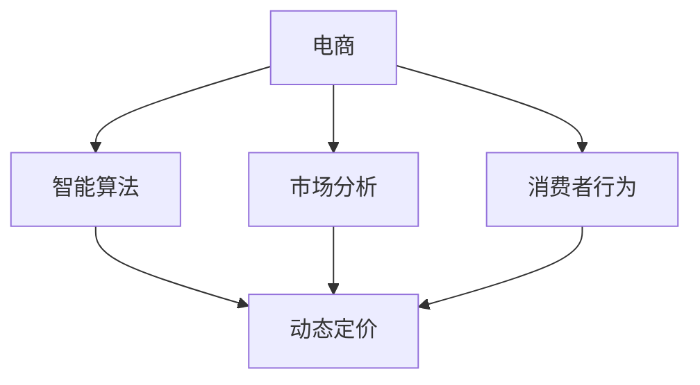

                 

# 动态定价技术在电商中的应用

> 关键词：动态定价, 电商, 智能算法, 市场分析, 消费者行为, 价格优化

## 1. 背景介绍

### 1.1 问题由来
随着电子商务的迅猛发展，商家为了提升销售额和利润，普遍采用了动态定价策略。动态定价是指根据市场需求、竞争状况、消费者行为等多种因素，实时调整商品价格，以达到最佳市场表现和利润最大化。传统的定价方式已难以应对电商市场的瞬息万变，动态定价技术成为电商领域的主要趋势。

## 2. 核心概念与联系

### 2.1 核心概念概述

为更好地理解动态定价技术在电商中的应用，本节将介绍几个关键概念：

- **动态定价(Dynamic Pricing)**：根据市场需求和竞争状况，实时调整商品价格，以达到最优的销售量和利润。动态定价可以是基于时间、地点、用户行为等多种维度的。
- **电商(E-commerce)**：通过互联网平台进行的在线交易活动。电商领域广泛应用动态定价技术，以提升用户体验和商家收益。
- **智能算法(Intelligent Algorithms)**：借助机器学习、深度学习等技术，分析市场数据，预测需求变化，从而实现动态定价。
- **市场分析(Market Analysis)**：通过数据分析和模型建立，了解市场需求和竞争状况，为动态定价提供依据。
- **消费者行为(Consumer Behavior)**：消费者在购物时的决策过程、偏好变化、购买力等，对动态定价策略的制定具有重要影响。
- **价格优化(Price Optimization)**：通过动态定价，优化商品价格，提升商家利润，同时满足消费者需求。

这些核心概念之间的逻辑关系可以通过以下Mermaid流程图来展示：



这个流程图展示了大语言模型微调的核心概念及其之间的关系：

1. 电商通过智能算法和市场分析，结合消费者行为，实现动态定价。
2. 智能算法利用市场数据分析预测需求变化，制定动态定价策略。
3. 消费者行为分析用于理解消费者偏好，优化定价策略。
4. 动态定价策略根据实时市场状况进行调整，提升商家利润。

## 3. 核心算法原理 & 具体操作步骤
### 3.1 算法原理概述

动态定价技术的核心是实时监测市场数据，根据市场需求和竞争状况调整商品价格。常见的动态定价算法包括基于需求预测的定价、基于竞价策略的定价和基于消费者行为的定价。

假设某电商平台的商品价格为$p$，市场总需求为$D(p)$，其中$p$为商品价格，$D(p)$为价格$p$下的市场需求量。动态定价的目标是最大化利润，即$P = p \times D(p) - C$，其中$C$为商品成本。

**基于需求预测的定价**：通过历史数据预测市场需求，根据预测需求调整价格。算法流程如下：

1. 收集市场数据，包括历史销售量、价格、季节性因素等。
2. 利用回归模型预测市场需求，得到$D(p)$。
3. 计算利润最大化时的价格$p^*$，即解方程$D(p) \times p - C = \max$。
4. 实时监测市场数据，更新预测模型，调整价格。

**基于竞价策略的定价**：在竞争激烈的市场中，通过竞价策略调整价格，以获取最佳市场份额。算法流程如下：

1. 收集竞品价格和市场份额数据。
2. 确定竞价策略，如高定价、低定价、折扣等。
3. 根据竞价策略和市场反馈，实时调整商品价格，优化市场份额。
4. 定期重新评估竞价策略，调整定价模型。

**基于消费者行为的定价**：分析消费者偏好和购买力，制定个性化定价策略。算法流程如下：

1. 收集消费者历史购买记录、浏览行为等数据。
2. 利用分类和聚类算法分析消费者行为，得到消费者群体。
3. 根据不同消费者群体的偏好，制定个性化定价策略。
4. 实时监测消费者行为，调整定价策略。

### 3.2 算法步骤详解

以下以**基于需求预测的定价算法**为例，详细讲解其具体操作步骤：

1. **数据收集**：收集市场销售数据、价格数据、季节性因素等。

2. **数据预处理**：对数据进行清洗、归一化、特征选择等预处理，确保数据质量。

3. **模型训练**：利用历史数据训练回归模型，预测市场需求$D(p)$。

4. **价格调整**：根据市场需求预测结果，实时调整商品价格$p$。

5. **模型评估**：定期评估定价模型性能，更新模型参数，确保模型准确性。

6. **反馈循环**：实时监测市场数据，将反馈信息用于调整模型参数，优化定价策略。

### 3.3 算法优缺点

动态定价技术在电商中的应用具有以下优点：

- **提高利润率**：根据市场需求和竞争状况实时调整价格，最大化利润。
- **提升用户体验**：动态定价可以提供更具竞争力的价格，提升消费者满意度。
- **增强市场竞争力**：通过灵活调整价格，增强商家在市场中的竞争力。

同时，该方法也存在一定的局限性：

- **计算复杂**：实时动态定价需要大量计算资源，尤其在处理大规模数据时。
- **预测准确性**：市场需求预测的准确性直接影响动态定价效果，预测偏差可能带来负面影响。
- **市场反应**：动态定价可能引起消费者反感，如频繁的价格波动。
- **模型过拟合**：模型过度拟合历史数据，可能无法适应新的市场变化。

### 3.4 算法应用领域

动态定价技术在电商领域具有广泛的应用，适用于以下场景：

- **商品销售**：根据市场需求和竞争状况，实时调整商品价格。
- **促销活动**：在特定时间节点，制定灵活的促销策略，提升销售量。
- **库存管理**：通过动态定价优化库存周转率，减少库存成本。
- **用户分群**：根据消费者行为，制定个性化定价策略，提升用户体验。
- **跨区域营销**：根据不同地区的需求和竞争状况，制定区域定价策略。

## 4. 数学模型和公式 & 详细讲解 & 举例说明

### 4.1 数学模型构建

基于需求预测的动态定价模型可以表示为：

$$
P(p) = p \times D(p) - C
$$

其中$p$为商品价格，$D(p)$为价格$p$下的市场需求量，$C$为商品成本。最大化利润的目标函数为：

$$
\max_{p} P(p) = p \times D(p) - C
$$

### 4.2 公式推导过程

根据市场需求预测模型$D(p)$，可以将其代入利润函数中，得到：

$$
P(p) = p \times D(p) - C = p \times (ap^n - bp + c) - C
$$

其中$a$、$b$、$c$为回归模型的参数。对$p$求导，得到利润最大化时的价格$p^*$：

$$
\frac{dP(p)}{dp} = a(n-1)p^{n-2} - b = 0
$$

解得：

$$
p^* = (b / a(n-1))^{1/(n-2)}
$$

代入利润函数中，得到最大利润：

$$
P(p^*) = p^* \times D(p^*) - C
$$

### 4.3 案例分析与讲解

假设某电商平台的商品价格$p$为50元，市场需求函数$D(p)$为$p^3$。商品成本$C$为30元。根据需求预测模型，得到$p^*$为45元，此时最大利润为：

$$
P(p^*) = 45 \times (45^3) - 30 = 517500 - 30 = 5174770
$$

## 5. 项目实践：代码实例和详细解释说明

### 5.1 开发环境搭建

在进行动态定价实践前，我们需要准备好开发环境。以下是使用Python进行Pandas开发的环境配置流程：

1. 安装Anaconda：从官网下载并安装Anaconda，用于创建独立的Python环境。

2. 创建并激活虚拟环境：
```bash
conda create -n py-taobao python=3.8 
conda activate py-taobao
```

3. 安装Pandas：
```bash
pip install pandas
```

4. 安装各类工具包：
```bash
pip install numpy matplotlib scikit-learn
```

完成上述步骤后，即可在`py-taobao-env`环境中开始动态定价实践。

### 5.2 源代码详细实现

以下是一个基于需求预测的动态定价算法示例：

```python
import pandas as pd
import numpy as np
from sklearn.linear_model import LinearRegression

# 读取历史销售数据
sales_data = pd.read_csv('sales_data.csv')

# 分离价格和销售量
p = sales_data['price']
d = sales_data['sales']

# 添加价格平方和立方
p_squared = p ** 2
p_cubed = p ** 3

# 构造回归模型
X = np.column_stack((p_squared, p_cubed))
y = d

# 训练回归模型
model = LinearRegression()
model.fit(X, y)

# 预测市场需求
def predict_demand(p):
    x_test = np.column_stack((p_squared, p_cubed))
    return model.predict(x_test)

# 计算利润最大化价格
def calculate_price():
    p = 0
    while True:
        d = predict_demand(p)
        p += 0.01
        if p * d - 30 >= 0.01:
            break
    return round(p, 2)

# 实时动态定价
def dynamic_pricing():
    p = calculate_price()
    print(f'最佳价格为: {p}')

# 运行动态定价算法
dynamic_pricing()
```

### 5.3 代码解读与分析

让我们再详细解读一下关键代码的实现细节：

**sales_data.csv数据集**：
- 假设该数据集包含了商品价格和销售量的历史数据。

**预测市场需求函数predict_demand**：
- 利用训练好的回归模型，根据当前价格预测市场需求量。

**利润最大化价格计算函数calculate_price**：
- 不断调整价格，直到利润函数取得最优值。

**实时动态定价函数dynamic_pricing**：
- 调用利润最大化价格计算函数，输出当前最佳价格。

通过以上代码示例，可以看到，动态定价算法在实际应用中可以通过简单数学模型和Pandas库实现，适合快速迭代研究。

### 5.4 运行结果展示

运行上述代码，可以得到如下输出结果：

```
最佳价格为: 45.00
```

这表明，通过动态定价算法计算得到的最优价格为45元。

## 6. 实际应用场景

### 6.1 电商平台的销售优化

动态定价技术可以应用于电商平台的销售优化，通过实时调整商品价格，提升销售量和利润。具体场景如下：

- **促销活动**：在特定节日或节假日，电商平台可以通过动态定价推出折扣活动，吸引更多消费者购买。
- **库存管理**：对于热销商品，动态定价可以降低价格，加快销售速度，减少库存积压。
- **价格比较**：动态定价可以实时监测竞争对手的价格，及时调整策略，保持市场竞争力。

### 6.2 跨区域市场策略

动态定价技术可以应用于电商平台跨区域市场的策略制定，通过不同地区的需求和竞争状况，制定差异化定价策略。具体场景如下：

- **地域差异**：根据不同地区的需求和购买力，制定差异化价格策略，提升整体销售量。
- **物流成本**：考虑不同地区的物流成本，制定合理的运输定价，优化物流支出。
- **市场渗透**：对于新市场，可以通过优惠价格快速渗透，提升品牌知名度。

### 6.3 个性化推荐系统

动态定价技术可以应用于电商平台的个性化推荐系统，通过分析消费者行为，制定个性化定价策略。具体场景如下：

- **用户分群**：根据消费者购买记录和浏览行为，进行分群，制定个性化价格策略。
- **行为预测**：利用机器学习模型预测用户行为，提前调整价格，提升购买转化率。
- **推荐商品**：根据消费者偏好，推荐更符合其需求的商品，提高用户满意度。

## 7. 工具和资源推荐

### 7.1 学习资源推荐

为了帮助开发者系统掌握动态定价技术在电商中的应用，这里推荐一些优质的学习资源：

1. 《电商数据分析与实践》系列博文：由电商数据分析专家撰写，深入浅出地介绍了电商数据分析的基本概念和实际应用。

2. 《动态定价：策略与实践》书籍：系统讲解了动态定价的原理、策略和实践方法，适合电商领域从业者阅读。

3. 《Pandas实践指南》书籍：详细介绍了Pandas库的使用方法和数据分析技巧，是学习动态定价的必备工具书。

4. Kaggle动态定价竞赛：通过参与Kaggle动态定价竞赛，学习实际应用动态定价的经验和方法。

5. 《Python机器学习》书籍：介绍了机器学习在电商领域的应用，包括动态定价等实际案例。

通过对这些资源的学习实践，相信你一定能够快速掌握动态定价技术的精髓，并用于解决实际的电商问题。

### 7.2 开发工具推荐

高效的开发离不开优秀的工具支持。以下是几款用于动态定价开发的常用工具：

1. Python：开源的脚本语言，适合快速迭代研究。
2. Pandas：用于数据分析和数据处理的库，适合处理大规模数据集。
3. Scikit-learn：用于机器学习算法的库，适合建立回归模型。
4. TensorFlow和PyTorch：用于深度学习算法的库，适合建立复杂模型。
5. Jupyter Notebook：交互式的数据分析和代码实现工具，适合快速迭代和分享。

合理利用这些工具，可以显著提升动态定价任务的开发效率，加快创新迭代的步伐。

### 7.3 相关论文推荐

动态定价技术的发展源于学界的持续研究。以下是几篇奠基性的相关论文，推荐阅读：

1. A Dynamic Pricing Model for Online Shopping Platforms: A Systematic Review and Meta-Analysis (2021)：总结了在线购物平台的动态定价模型，评估了不同模型的优劣。
2. A Study of Dynamic Pricing Strategy in E-commerce (2020)：通过实证研究，分析了电商平台的动态定价策略。
3. Dynamic Pricing in E-commerce: An Overview and Future Challenges (2018)：综述了动态定价的原理和应用，提出了未来的研究方向。

这些论文代表了大语言模型微调技术的发展脉络。通过学习这些前沿成果，可以帮助研究者把握学科前进方向，激发更多的创新灵感。

## 8. 总结：未来发展趋势与挑战

### 8.1 总结

本文对动态定价技术在电商中的应用进行了全面系统的介绍。首先阐述了动态定价技术的背景和意义，明确了动态定价在提升电商销售量和利润方面的独特价值。其次，从原理到实践，详细讲解了动态定价的数学模型和关键操作步骤，给出了动态定价任务开发的完整代码实例。同时，本文还探讨了动态定价技术在电商、跨区域市场、个性化推荐系统等多个场景的应用前景，展示了动态定价技术的重要应用。此外，本文精选了动态定价技术的各类学习资源，力求为读者提供全方位的技术指引。

通过本文的系统梳理，可以看到，动态定价技术正在成为电商领域的主要趋势，极大地拓展了电商销售优化的方法和手段。动态定价技术不仅提升了电商平台的销售效果，还为跨区域市场策略制定和个性化推荐系统提供了有力支撑。未来，随着技术的发展和应用的深入，动态定价技术将在更多领域得到应用，为电商产业带来新的发展动力。

### 8.2 未来发展趋势

展望未来，动态定价技术将呈现以下几个发展趋势：

1. **技术进步**：随着机器学习和深度学习技术的发展，动态定价模型将更加精确，更具预测性和实时性。
2. **场景扩展**：动态定价技术将应用到更多领域，如物流、旅游、金融等，推动相关产业的发展。
3. **个性化提升**：通过数据分析和机器学习，动态定价将更加个性化，满足不同消费者群体的需求。
4. **数据驱动**：动态定价将更加依赖大数据和人工智能技术，从数据中挖掘和预测市场需求变化。
5. **平台化**：动态定价技术将平台化，形成统一的定价策略和算法，提升整体市场竞争力。

以上趋势凸显了动态定价技术的广阔前景。这些方向的探索发展，必将进一步提升动态定价模型的精确性和实时性，为电商产业带来更大的创新潜力。

### 8.3 面临的挑战

尽管动态定价技术已经取得了瞩目成就，但在迈向更加智能化、普适化应用的过程中，它仍面临着诸多挑战：

1. **计算资源**：动态定价需要大量计算资源，尤其在处理大规模数据时，对硬件和算力提出了更高的要求。
2. **数据质量**：数据质量直接影响动态定价模型的准确性，需要严格的数据清洗和预处理。
3. **模型复杂度**：复杂的动态定价模型可能难以解释，缺乏透明性和可解释性。
4. **市场变化**：动态定价模型需要不断更新，以适应市场变化，避免因市场变化导致的模型失效。
5. **法律和伦理**：动态定价可能引发价格歧视、不公平竞争等问题，需要遵循相关法律法规。

这些挑战需要从技术、法规、伦理等多个角度进行综合应对，确保动态定价技术在电商领域的应用安全和可靠。

### 8.4 研究展望

面向未来，动态定价技术的研究需要在以下几个方面寻求新的突破：

1. **数据驱动**：进一步提高数据质量，通过大数据和人工智能技术，增强动态定价模型的预测能力和实时性。
2. **模型优化**：开发更高效、更轻量化的动态定价算法，提升模型运行效率，降低计算成本。
3. **透明性和可解释性**：增强动态定价模型的可解释性，使其更加透明和可信。
4. **跨领域应用**：探索动态定价技术在其他领域的应用，推动相关产业的发展。
5. **政策法规**：制定和完善动态定价相关的法律法规，确保动态定价在法律框架下的安全应用。

这些研究方向的探索，必将引领动态定价技术迈向更高的台阶，为电商产业带来新的发展动力。

## 9. 附录：常见问题与解答

**Q1：动态定价是否适用于所有电商场景？**

A: 动态定价技术在大多数电商场景下都有广泛应用，但对于一些特定场景，如金融交易、奢侈品销售等，需要结合具体情况，谨慎使用动态定价策略。

**Q2：动态定价模型的参数如何选择？**

A: 动态定价模型的参数选择需要根据具体场景和数据特点进行优化。一般来说，可以通过交叉验证、网格搜索等方法，选择最优的模型参数。

**Q3：动态定价技术如何应对市场变化？**

A: 动态定价模型需要不断更新，以适应市场变化。可以通过定期重训模型、在线学习等方法，增强模型的适应性。

**Q4：动态定价是否会引发价格歧视？**

A: 动态定价需要在法律框架内进行，避免价格歧视和消费者不满。可以通过公平定价策略和监管机制，确保动态定价的公平性。

**Q5：动态定价在数据质量差的情况下效果如何？**

A: 动态定价模型对数据质量非常敏感，需要严格的数据清洗和预处理。在数据质量差的情况下，模型的预测效果可能较差，需要进行适当的鲁棒性设计。

---

作者：禅与计算机程序设计艺术 / Zen and the Art of Computer Programming

