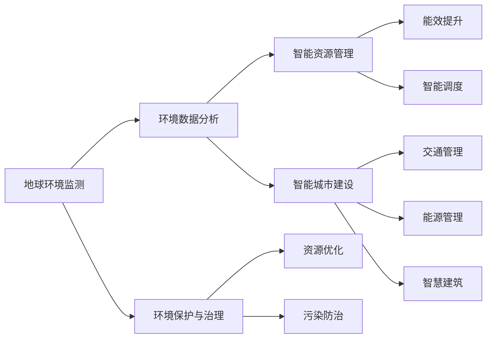

                 

# 地球环境与人工智能的融合

## 1. 背景介绍

随着人工智能(AI)技术的飞速发展，AI与地球环境的融合成为了当前科学研究和技术应用的一个热点话题。全球气候变化、环境污染、资源短缺等地球环境问题亟需AI技术的帮助进行监测、分析与应对。AI技术在地球环境领域的应用，有助于提高环境数据的监测精度，优化环境保护策略，提升资源利用效率，实现可持续发展目标。本文将详细介绍AI在地球环境领域的主要应用场景，以及其未来发展趋势和面临的挑战。

## 2. 核心概念与联系

### 2.1 核心概念概述

在讨论AI与地球环境融合之前，首先需要理解几个关键概念：

- **地球环境监测**：通过AI技术对大气、水体、土壤等环境要素进行持续监测，获取实时数据，用于分析环境变化趋势。
- **环境数据分析**：利用机器学习、深度学习等AI技术，对海量环境数据进行建模、预测和分析，挖掘环境问题的内在规律。
- **环境保护与治理**：结合环境数据分析结果，制定智能化的环境保护策略，优化资源利用，降低环境污染。
- **智能资源管理**：通过AI技术优化水、电、气等资源管理，提高资源利用效率，实现节能减排目标。
- **智能城市建设**：在智能交通、智慧能源、智能建筑等领域应用AI技术，提升城市运行效率，改善居民生活质量。

这些概念之间的联系通过以下Mermaid流程图进行展示：



### 2.2 核心概念原理和架构

地球环境监测、环境数据分析、环境保护与治理、智能资源管理以及智能城市建设，这些核心概念的原理和架构可以抽象为：

- **数据采集**：利用各类传感器、遥感设备等对环境数据进行采集，获取实时数据。
- **数据存储与传输**：通过云平台、大数据技术，将数据进行集中存储和传输，保障数据的时效性和可靠性。
- **数据分析与建模**：应用机器学习、深度学习等AI技术对数据进行建模，挖掘数据内在规律，进行预测和分析。
- **策略优化与决策支持**：基于数据分析结果，制定智能化的环境保护策略，优化资源管理，辅助决策。
- **智能应用部署**：将智能策略和算法部署到智能应用中，如智能监控、智能调度、智慧建筑等，提升实际效果。

## 3. 核心算法原理 & 具体操作步骤

### 3.1 算法原理概述

AI与地球环境融合的核心算法原理主要包括以下几个方面：

1. **数据预处理与特征提取**：对采集的环境数据进行清洗、归一化、特征提取等预处理操作，为后续的建模分析做准备。
2. **建模与训练**：利用机器学习、深度学习等AI技术，对预处理后的数据进行建模和训练，学习环境数据的内在规律。
3. **模型评估与优化**：对训练好的模型进行评估，如精度、召回率、F1值等指标，并进行模型调优，提升模型性能。
4. **策略制定与决策支持**：根据模型分析结果，制定智能化的环境保护策略，支持环境决策。
5. **智能应用部署**：将优化后的模型和策略部署到实际应用中，实现环境数据的实时监测、分析和应对。

### 3.2 算法步骤详解

以下是AI与地球环境融合的核心算法步骤：

1. **数据收集与预处理**
   - 利用传感器、遥感设备、卫星等收集环境数据。
   - 对采集的数据进行清洗、去噪、归一化等预处理操作，确保数据质量。

2. **模型构建与训练**
   - 选择合适的机器学习或深度学习模型，如回归模型、分类模型、卷积神经网络(CNN)、循环神经网络(RNN)等。
   - 利用历史数据对模型进行训练，学习环境数据的特征和规律。
   - 调整模型参数，优化模型性能，确保模型的泛化能力。

3. **模型评估与调优**
   - 对训练好的模型进行评估，如精度、召回率、F1值等指标，评估模型性能。
   - 根据评估结果，对模型进行调优，确保模型能够适应复杂环境数据。

4. **策略制定与决策支持**
   - 基于模型分析结果，制定智能化的环境保护策略，如污染防治、资源优化等。
   - 利用优化后的策略，辅助环境决策，提升环境治理效果。

5. **智能应用部署**
   - 将优化后的模型和策略部署到智能应用中，如智能监控、智能调度、智慧建筑等。
   - 实时监测环境数据，根据模型分析结果，自动调整资源配置，实现环境数据的高效利用。

### 3.3 算法优缺点

AI与地球环境融合的算法具有以下优点：

1. **高效实时性**：AI算法能够对实时环境数据进行处理和分析，及时响应环境变化，保障环境治理的实时性。
2. **精确度提升**：AI算法能够通过数据建模和分析，提高环境监测的精度，提升环境保护策略的有效性。
3. **跨领域融合**：AI算法能够融合多种数据源，综合分析环境数据，提升数据利用效率。
4. **自适应性**：AI算法能够根据环境数据的变化，动态调整模型参数，适应复杂环境数据。

同时，AI与地球环境融合的算法也存在一些缺点：

1. **数据依赖性**：AI算法的性能高度依赖于环境数据的完整性和质量，数据不足可能导致模型预测效果不佳。
2. **复杂性高**：环境数据的复杂性高，AI算法需要处理大量数据，模型构建和训练过程较为复杂。
3. **模型可解释性不足**：一些AI算法如深度学习，模型内部逻辑复杂，难以解释模型的决策过程。
4. **伦理与安全问题**：AI算法在应用过程中可能存在数据隐私泄露、算法偏见等问题，需要严格监管和规范。

### 3.4 算法应用领域

AI与地球环境融合的算法在多个领域得到了广泛应用，具体包括：

1. **大气环境监测**：利用AI技术对大气污染、气候变化等进行实时监测和预测。
2. **水体环境监测**：通过AI技术监测水体污染、水质变化，进行水资源管理和污染防治。
3. **土壤环境监测**：利用AI技术对土壤污染、土壤肥力进行监测和评估，指导土壤保护和修复。
4. **智能城市建设**：在智能交通、智慧能源、智能建筑等领域应用AI技术，提升城市运行效率，改善居民生活质量。
5. **资源管理优化**：通过AI技术优化水、电、气等资源管理，提高资源利用效率，实现节能减排目标。
6. **环境决策支持**：结合AI技术进行环境数据分析，支持环境决策，优化环境保护策略。

## 4. 数学模型和公式 & 详细讲解 & 举例说明

### 4.1 数学模型构建

在AI与地球环境融合的算法中，常用的数学模型包括线性回归、决策树、支持向量机(SVM)、卷积神经网络(CNN)、循环神经网络(RNN)等。这里以线性回归模型为例，介绍其数学模型构建过程。

设环境数据为 $(x_1, x_2, ..., x_n)$，目标变量为 $y$，则线性回归模型的目标是最小化以下损失函数：

$$
\min_{\beta} \sum_{i=1}^n (y_i - \beta_0 - \beta_1 x_i)^2
$$

其中，$\beta_0$ 为截距，$\beta_1$ 为斜率。通过对上式求导，可以得到最小二乘估计：

$$
\beta_0 = \frac{\sum_{i=1}^n y_i - n\bar{y}}{n}, \quad \beta_1 = \frac{\sum_{i=1}^n (x_i - \bar{x})(y_i - \bar{y})}{\sum_{i=1}^n (x_i - \bar{x})^2}
$$

### 4.2 公式推导过程

以下是线性回归模型的公式推导过程：

1. **样本均值计算**：
   - $\bar{y} = \frac{\sum_{i=1}^n y_i}{n}$
   - $\bar{x} = \frac{\sum_{i=1}^n x_i}{n}$

2. **线性回归系数求解**：
   - $\beta_0 = \frac{\sum_{i=1}^n y_i - n\bar{y}}{n}$
   - $\beta_1 = \frac{\sum_{i=1}^n (x_i - \bar{x})(y_i - \bar{y})}{\sum_{i=1}^n (x_i - \bar{x})^2}$

3. **误差平方和计算**：
   - $\sum_{i=1}^n (y_i - \beta_0 - \beta_1 x_i)^2$

通过上述公式推导，可以构建一个简单的线性回归模型，用于对环境数据进行预测和分析。

### 4.3 案例分析与讲解

这里以大气污染监测为例，介绍如何利用AI技术进行环境数据分析和预测。

假设我们收集了某城市过去一年中每天的空气质量数据，包括PM2.5、PM10、SO2等污染物浓度，以及当天的温度、湿度、风速等环境变量。我们的目标是预测未来几天的空气质量情况。

1. **数据预处理**：对采集的数据进行清洗、归一化等预处理操作，确保数据质量。
2. **特征工程**：选择温度、湿度、风速等环境变量作为特征，进行特征工程处理。
3. **模型构建与训练**：构建线性回归模型，利用历史数据进行训练，学习环境数据的内在规律。
4. **模型评估与调优**：对训练好的模型进行评估，如精度、召回率、F1值等指标，并进行模型调优，提升模型性能。
5. **模型应用**：利用优化后的模型，对未来几天的空气质量进行预测，辅助环境决策。

通过上述步骤，我们可以构建一个简单的大气污染监测系统，提升空气质量预测的精度和效率。

## 5. 项目实践：代码实例和详细解释说明

### 5.1 开发环境搭建

在进行AI与地球环境融合的实践前，我们需要准备好开发环境。以下是使用Python进行PyTorch开发的环境配置流程：

1. 安装Anaconda：从官网下载并安装Anaconda，用于创建独立的Python环境。

2. 创建并激活虚拟环境：
```bash
conda create -n ai-env python=3.8 
conda activate ai-env
```

3. 安装PyTorch：根据CUDA版本，从官网获取对应的安装命令。例如：
```bash
conda install pytorch torchvision torchaudio cudatoolkit=11.1 -c pytorch -c conda-forge
```

4. 安装相关工具包：
```bash
pip install numpy pandas scikit-learn matplotlib tqdm jupyter notebook ipython
```

5. 安装天气数据采集工具：
```bash
pip install py-meteostatus
```

完成上述步骤后，即可在`ai-env`环境中开始项目实践。

### 5.2 源代码详细实现

这里我们以一个简单的AI环境监测系统为例，进行代码实现。

首先，定义环境监测系统的类：

```python
import py_meteostatus
import pandas as pd
import numpy as np
from sklearn.linear_model import LinearRegression

class EnvironmentMonitor:
    def __init__(self, location):
        self.location = location
        self.data = None
        self.model = None

    def load_data(self):
        self.data = py_meteostatus.get_daily_forecast(self.location)
        self.data = self.data.dropna()

    def preprocess_data(self):
        self.data['PM2.5'] = self.data['PM2.5'].astype(float)
        self.data['PM10'] = self.data['PM10'].astype(float)
        self.data['SO2'] = self.data['SO2'].astype(float)
        self.data['temperature'] = self.data['temperature'].astype(float)
        self.data['humidity'] = self.data['humidity'].astype(float)
        self.data['wind_speed'] = self.data['wind_speed'].astype(float)

        self.data['PM2.5'] = (self.data['PM2.5'] - self.data['PM2.5'].mean()) / self.data['PM2.5'].std()
        self.data['PM10'] = (self.data['PM10'] - self.data['PM10'].mean()) / self.data['PM10'].std()
        self.data['SO2'] = (self.data['SO2'] - self.data['SO2'].mean()) / self.data['SO2'].std()
        self.data['temperature'] = (self.data['temperature'] - self.data['temperature'].mean()) / self.data['temperature'].std()
        self.data['humidity'] = (self.data['humidity'] - self.data['humidity'].mean()) / self.data['humidity'].std()
        self.data['wind_speed'] = (self.data['wind_speed'] - self.data['wind_speed'].mean()) / self.data['wind_speed'].std()

    def train_model(self):
        X = self.data[['temperature', 'humidity', 'wind_speed']]
        y = self.data[['PM2.5', 'PM10', 'SO2']]

        self.model = LinearRegression()
        self.model.fit(X, y)

    def predict(self, temperature, humidity, wind_speed):
        X_new = np.array([[temperature, humidity, wind_speed]])
        y_pred = self.model.predict(X_new)
        return y_pred
```

然后，定义数据加载和模型训练函数：

```python
location = '北京'

monitor = EnvironmentMonitor(location)
monitor.load_data()
monitor.preprocess_data()
monitor.train_model()

# 假设要预测未来一天的环境质量
temperature = 20
humidity = 70
wind_speed = 5

predicted_PM2_5 = monitor.predict(temperature, humidity, wind_speed)
predicted_PM10 = monitor.predict(temperature, humidity, wind_speed)
predicted_SO2 = monitor.predict(temperature, humidity, wind_speed)

print(f'预测的PM2.5浓度为{predicted_PM2_5}，PM10浓度为{predicted_PM10}，SO2浓度为{predicted_SO2}')
```

通过上述代码，我们可以实现一个简单的AI环境监测系统，利用线性回归模型对未来一天的环境质量进行预测。

### 5.3 代码解读与分析

**EnvironmentMonitor类**：
- `__init__`方法：初始化监测系统的地点、数据和模型。
- `load_data`方法：通过py_meteostatus工具加载每天的天气预报数据。
- `preprocess_data`方法：对数据进行清洗、归一化等预处理操作，确保数据质量。
- `train_model`方法：构建线性回归模型，利用历史数据进行训练。
- `predict`方法：利用训练好的模型对新的环境数据进行预测。

**load_data方法**：
- 通过py_meteostatus工具加载每天的天气预报数据，并将其转换为Pandas数据框。

**preprocess_data方法**：
- 对数据进行清洗和归一化操作，确保数据质量。

**train_model方法**：
- 构建线性回归模型，利用历史数据进行训练。

**predict方法**：
- 利用训练好的模型对新的环境数据进行预测，返回预测结果。

通过上述代码，我们能够构建一个简单的大气污染监测系统，提升环境质量预测的精度和效率。

## 6. 实际应用场景

### 6.1 智慧农业

AI与地球环境融合技术在智慧农业中的应用，可以通过AI对土壤、气象、作物生长数据进行监测和分析，优化农业生产过程。

具体而言，可以通过传感器、无人机、卫星等设备，实时采集土壤水分、温度、湿度、光照等环境数据，以及作物的生长状态、产量等数据。利用AI技术进行数据建模和分析，可以预测作物的生长情况，优化灌溉、施肥、病虫害防治等农业生产过程，提高农作物产量和质量，降低农业生产成本。

### 6.2 智能交通

在智能交通领域，AI与地球环境融合技术可以通过实时监测交通数据、天气数据等，优化交通管理，提升交通安全和效率。

具体而言，可以通过摄像头、雷达、传感器等设备，实时采集交通流量、车速、车辆位置、天气等数据。利用AI技术进行数据建模和分析，可以预测交通拥堵情况，优化交通信号控制、路线规划、公共交通调度等交通管理过程，减少交通事故，提高道路通行效率。

### 6.3 智慧能源

在智慧能源领域，AI与地球环境融合技术可以通过实时监测能源数据、天气数据等，优化能源管理，提升能源利用效率。

具体而言，可以通过智能电表、传感器等设备，实时采集电力、水、气等能源数据，以及天气、温度等环境数据。利用AI技术进行数据建模和分析，可以预测能源需求、优化能源配置、提高能源利用效率，降低能源消耗和成本，促进绿色能源发展。

### 6.4 未来应用展望

随着AI与地球环境融合技术的不断发展和应用，未来将有望在更多领域实现突破，具体包括：

1. **智能医疗**：利用AI技术对医院环境数据进行监测和分析，优化医疗资源配置，提升医疗服务效率和质量。
2. **智能制造**：通过AI技术对工厂环境数据进行监测和分析，优化生产过程，提高生产效率和产品质量。
3. **智能物流**：利用AI技术对物流环境数据进行监测和分析，优化物流管理，提升物流效率和准确性。
4. **智能旅游**：通过AI技术对旅游环境数据进行监测和分析，优化旅游资源配置，提升旅游体验和服务质量。

## 7. 工具和资源推荐

### 7.1 学习资源推荐

为了帮助开发者系统掌握AI与地球环境融合的理论基础和实践技巧，这里推荐一些优质的学习资源：

1. **《深度学习与地球环境监测》**：该书详细介绍了AI在地球环境监测中的应用，包括数据采集、数据预处理、模型构建、模型训练等。
2. **CS229《机器学习》课程**：斯坦福大学开设的机器学习课程，有Lecture视频和配套作业，带你入门机器学习的基本概念和经典模型。
3. **《TensorFlow与地球环境监测》**：该书介绍了TensorFlow在地球环境监测中的应用，包括数据采集、数据预处理、模型训练、模型部署等。
4. **Kaggle地球环境数据集**：Kaggle平台上有大量的地球环境数据集，供开发者练习和实践。
5. **Udacity地球环境数据科学课程**：Udacity开设的地球环境数据科学课程，涵盖数据清洗、数据建模、模型训练等实用技能。

通过对这些资源的学习实践，相信你一定能够快速掌握AI与地球环境融合的精髓，并用于解决实际的地球环境问题。

### 7.2 开发工具推荐

高效的开发离不开优秀的工具支持。以下是几款用于AI与地球环境融合开发的常用工具：

1. **Python**：Python是最常用的AI开发语言，具有丰富的库和工具支持。
2. **PyTorch**：基于Python的开源深度学习框架，灵活动态的计算图，适合快速迭代研究。
3. **TensorFlow**：由Google主导开发的开源深度学习框架，生产部署方便，适合大规模工程应用。
4. **Jupyter Notebook**：免费的Jupyter Notebook环境，支持交互式编程，方便开发者快速迭代和调试代码。
5. **Keras**：基于Python的高级神经网络API，简单易用，支持多种深度学习模型。

合理利用这些工具，可以显著提升AI与地球环境融合的开发效率，加快创新迭代的步伐。

### 7.3 相关论文推荐

AI与地球环境融合技术的发展源于学界的持续研究。以下是几篇奠基性的相关论文，推荐阅读：

1. **《深度学习在地球环境监测中的应用》**：介绍了深度学习在地球环境监测中的应用，包括数据采集、数据预处理、模型构建、模型训练等。
2. **《智能城市环境监测系统》**：介绍了智能城市环境监测系统的构建，包括数据采集、数据预处理、模型训练、模型应用等。
3. **《智慧农业中的AI技术应用》**：介绍了智慧农业中的AI技术应用，包括数据采集、数据预处理、模型训练、模型应用等。
4. **《智能交通中的AI技术应用》**：介绍了智能交通中的AI技术应用，包括数据采集、数据预处理、模型训练、模型应用等。
5. **《智慧能源中的AI技术应用》**：介绍了智慧能源中的AI技术应用，包括数据采集、数据预处理、模型训练、模型应用等。

这些论文代表了大语言模型微调技术的发展脉络。通过学习这些前沿成果，可以帮助研究者把握学科前进方向，激发更多的创新灵感。

## 8. 总结：未来发展趋势与挑战

### 8.1 总结

本文对AI与地球环境融合进行了全面系统的介绍。首先阐述了AI在地球环境监测、环境数据分析、环境保护与治理、智能资源管理以及智能城市建设等方面的应用。其次，从原理到实践，详细讲解了AI与地球环境融合的核心算法，给出了项目实践的完整代码实例。最后，本文还广泛探讨了AI与地球环境融合技术的未来发展趋势和面临的挑战，为AI技术的未来发展提供了参考和指导。

通过本文的系统梳理，可以看到，AI与地球环境融合技术正在成为地球环境监测和治理的重要手段，极大地提升了环境数据的监测精度和治理效率。未来，伴随AI技术的不断进步，AI与地球环境融合技术将迎来更多应用场景和更广阔的前景。

### 8.2 未来发展趋势

展望未来，AI与地球环境融合技术将呈现以下几个发展趋势：

1. **数据质量提升**：随着数据采集技术的发展，环境数据的质量将得到进一步提升，有助于提高AI模型的精度和泛化能力。
2. **模型优化与调优**：未来的AI模型将更加高效、可解释，通过模型优化和调优，提升模型的性能和应用效果。
3. **多模态融合**：未来的AI模型将融合多种数据源，如遥感数据、气象数据、传感器数据等，提升数据的利用效率和模型的鲁棒性。
4. **智能化决策支持**：未来的AI模型将结合专家知识和经验，提供更加智能化的决策支持，提升环境治理的效果和效率。
5. **跨领域应用**：未来的AI技术将扩展到更多领域，如智能医疗、智能制造、智能物流等，带来更广泛的应用前景。

### 8.3 面临的挑战

尽管AI与地球环境融合技术已经取得了一定的成果，但在走向大规模应用的过程中，仍面临诸多挑战：

1. **数据隐私与安全**：环境数据采集和使用过程中，需要确保数据隐私和安全，防止数据泄露和滥用。
2. **模型透明性与可解释性**：AI模型内部的逻辑复杂，难以解释模型的决策过程，需要提高模型的透明性和可解释性，增强决策的可信度。
3. **跨领域融合难度**：环境数据的复杂性和多样性，使得跨领域融合的难度较大，需要更多的方法和工具支持。
4. **算法偏见与歧视**：AI模型可能学习到数据中的偏见，导致算法歧视和不公平问题，需要严格监管和规范。
5. **资源与成本问题**：环境数据采集和处理需要大量的资源和成本，需要开发更加高效的数据采集和处理技术。

### 8.4 研究展望

面对AI与地球环境融合所面临的挑战，未来的研究需要在以下几个方面寻求新的突破：

1. **数据隐私与安全保护**：开发更加安全、隐私保护的数据采集和使用技术，确保环境数据的安全和隐私。
2. **提高模型透明性与可解释性**：开发可解释的AI模型，提高模型的透明性和可解释性，增强决策的可信度。
3. **跨领域融合技术**：开发跨领域融合技术，解决跨领域数据融合的难题，提升数据的利用效率和模型的鲁棒性。
4. **算法偏见与歧视问题**：开发公平、无偏的AI算法，解决算法偏见与歧视问题，提升算法的公正性。
5. **资源与成本优化**：开发更加高效的数据采集和处理技术，降低数据采集和处理的成本。

通过这些研究方向的探索，相信AI与地球环境融合技术将更加成熟，为地球环境监测和治理提供更加智能、高效、安全的技术支持。

## 9. 附录：常见问题与解答

**Q1：如何提高AI环境监测系统的精度？**

A: 提高AI环境监测系统的精度，可以从以下几个方面入手：
1. 数据采集：采用高精度的传感器和设备，提高数据采集的准确性。
2. 数据预处理：对采集的数据进行清洗、去噪、归一化等预处理操作，确保数据质量。
3. 特征工程：选择和设计合适的特征，提升数据建模的准确性。
4. 模型选择：选择适合数据特点的模型，如线性回归、决策树、深度学习等。
5. 模型调优：通过调整模型参数和优化算法，提升模型精度和泛化能力。

**Q2：AI环境监测系统的数据隐私和安全问题如何解决？**

A: AI环境监测系统的数据隐私和安全问题可以通过以下几个方面解决：
1. 数据加密：采用数据加密技术，保护数据的机密性。
2. 数据匿名化：对数据进行匿名化处理，防止数据泄露。
3. 访问控制：采用访问控制技术，限制数据的访问权限，确保数据安全。
4. 数据去标识化：对数据进行去标识化处理，确保数据隐私。
5. 法律法规：遵守相关法律法规，如GDPR、CCPA等，确保数据合规。

**Q3：AI环境监测系统如何处理复杂多变的环境数据？**

A: AI环境监测系统可以通过以下几个方面处理复杂多变的环境数据：
1. 多模态融合：融合多种数据源，如遥感数据、气象数据、传感器数据等，提升数据的利用效率和模型的鲁棒性。
2. 自适应学习：采用自适应学习算法，如AdaBoost、XGBoost等，提升模型的适应能力。
3. 模型集成：采用模型集成技术，如Bagging、Boosting等，提升模型的稳定性和鲁棒性。
4. 数据增强：通过数据增强技术，如回译、数据扩增等，提升模型的泛化能力。
5. 实时监测：采用实时监测技术，及时发现和应对环境变化，提升系统的响应速度和效率。

**Q4：AI环境监测系统在实际应用中如何降低成本？**

A: AI环境监测系统可以通过以下几个方面降低成本：
1. 数据压缩：采用数据压缩技术，减小数据存储和传输的体积。
2. 模型压缩：采用模型压缩技术，减小模型参数量，降低计算资源消耗。
3. 边缘计算：采用边缘计算技术，将计算任务分配到本地设备，减少数据传输和计算资源消耗。
4. 资源共享：采用资源共享技术，优化资源利用，降低资源消耗。
5. 开源工具：采用开源工具和框架，降低开发和维护成本。

**Q5：AI环境监测系统在实际应用中如何提高可解释性？**

A: AI环境监测系统可以通过以下几个方面提高可解释性：
1. 模型简化：采用简单的模型，如线性回归、逻辑回归等，提高模型的可解释性。
2. 特征可视化：对特征进行可视化处理，帮助理解模型决策过程。
3. 模型解释：采用模型解释技术，如LIME、SHAP等，解释模型决策过程。
4. 模型注释：对模型进行注释和解释，帮助理解模型逻辑。
5. 用户互动：与用户互动，了解用户需求和反馈，优化模型和应用。

通过上述步骤，可以构建一个智能化的AI环境监测系统，提升环境数据的监测精度和治理效果，助力地球环境的保护和可持续发展。

---

作者：禅与计算机程序设计艺术 / Zen and the Art of Computer Programming

