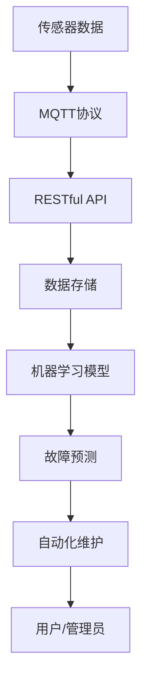

                 

# 基于MQTT协议和RESTful API的家电故障预测与维护系统

## 1. 背景介绍

### 1.1 问题由来

随着物联网(IoT)技术的发展，越来越多的智能家居设备如智能灯泡、智能空调、智能冰箱等通过互联网实现了远程控制和管理。然而，这些设备在使用过程中往往会出现各种故障，导致用户不便和潜在安全隐患。因此，如何通过技术手段预测设备故障并及时维护，成为了智能家居系统面临的一个重要问题。

传统的设备监控方式通常是依赖人工巡检或固定周期维护，难以在故障初期及时发现和处理，存在较大的被动性和滞后性。为了提升故障预测和维护的效率和准确性，需要构建一套基于MQTT协议和RESTful API的家电故障预测与维护系统。

### 1.2 问题核心关键点

该系统核心目标是通过实时监控设备的传感器数据，预测设备潜在的故障，并根据预测结果进行自动化维护。系统设计上，主要包括以下几个关键点：

1. **数据采集和传输**：通过MQTT协议收集设备的传感器数据，并实时传输到云端。
2. **数据分析和建模**：使用先进的数据分析和机器学习技术，从传感器数据中提取特征，建立故障预测模型。
3. **预测和预警**：根据模型预测结果，系统自动发送预警通知，并提示用户或管理员进行维护。
4. **自动化维护**：根据故障类型，系统自动执行相应的维护操作，如重置、更换部件等。

该系统能够极大地提升智能家居设备的故障预测和维护效率，减少用户的维护成本和潜在风险。

### 1.3 问题研究意义

本系统旨在利用现代物联网技术和机器学习技术，提升智能家居设备的故障预测和维护能力。具体意义包括：

1. **提高用户体验**：通过故障预测和主动维护，提升设备使用体验，减少因故障导致的用户不便。
2. **降低运维成本**：自动化故障预测和维护减少了人工巡检和维护的需求，降低运维成本。
3. **保障设备安全**：在故障初期及时介入，防止设备进一步损坏，保障设备安全和用户财产安全。
4. **推动智能家居发展**：为智能家居设备的普及和应用提供技术支持，推动智能家居行业的发展。

## 2. 核心概念与联系

### 2.1 核心概念概述

为更好地理解基于MQTT协议和RESTful API的家电故障预测与维护系统的核心原理，本节将介绍几个关键概念及其相互联系。

- **MQTT协议(MQTT Protocol)**：一种轻量级、高效能的通信协议，适用于设备间的数据传输。该协议具有连接快速、传输效率高等特点，适用于物联网设备的实时数据传输。
- **RESTful API**：基于REST架构风格的API，支持HTTP协议，具有良好的扩展性和易用性。在智能家居系统中，RESTful API常用于数据交换和远程控制。
- **传感器数据**：智能家居设备内置的传感器采集的环境、状态等数据，是故障预测与维护系统的核心输入。
- **机器学习模型**：通过传感器数据训练的机器学习模型，用于预测设备故障。
- **自动化维护**：根据故障预测结果，系统自动执行的维护操作，如重置、更换部件等。

这些概念构成了系统的基本框架，通过MQTT协议和RESTful API实现数据的采集和传输，通过机器学习模型进行数据分析和故障预测，最终通过自动化维护系统保障设备的可靠运行。

### 2.2 核心概念原理和架构的 Mermaid 流程图



### 2.3 核心概念之间的联系

上述概念之间的联系可以通过以下形式描述：

1. **传感器数据与MQTT协议**：传感器数据通过MQTT协议从设备传输到云端，为后续的数据分析和机器学习提供基础。
2. **MQTT协议与RESTful API**：通过RESTful API将传感器数据发送到后台服务进行处理和分析，同时接收用户和管理员的请求。
3. **数据存储与机器学习模型**：传感器数据存储在数据仓库中，由机器学习模型进行数据分析和特征提取，构建故障预测模型。
4. **故障预测与自动化维护**：机器学习模型预测设备故障，触发自动化维护系统执行相应的维护操作。
5. **用户/管理员与系统**：用户或管理员通过RESTful API接收故障预警通知，并进行设备维护操作。

## 3. 核心算法原理 & 具体操作步骤

### 3.1 算法原理概述

基于MQTT协议和RESTful API的家电故障预测与维护系统主要包括以下几个步骤：

1. **数据采集与传输**：通过MQTT协议收集设备的传感器数据，并将其实时传输到云端。
2. **数据分析与建模**：使用机器学习模型对传感器数据进行特征提取和故障预测。
3. **预测与预警**：根据故障预测结果，系统自动发送预警通知，并提示用户或管理员进行维护。
4. **自动化维护**：根据故障类型，系统自动执行相应的维护操作。

其中，数据分析与建模是系统的核心部分，其原理和操作步骤如下。

### 3.2 算法步骤详解

#### 3.2.1 数据预处理

传感器数据通常包含大量噪声和不相关特征，需要进行预处理才能用于模型训练。预处理步骤包括：

1. **数据清洗**：去除缺失值和异常值，确保数据完整性和可靠性。
2. **数据标准化**：将数据缩放到统一的区间，避免模型受到不同量级特征的影响。
3. **特征选择**：选择对故障预测有显著影响的特征，去除无关特征，降低模型复杂度。

#### 3.2.2 特征提取

特征提取是构建故障预测模型的关键步骤。常用的特征提取方法包括：

1. **时序特征提取**：从传感器数据中提取时间序列特征，如温度、湿度、压力等。
2. **统计特征提取**：计算传感器数据的统计特征，如均值、方差、标准差等。
3. **频域特征提取**：通过傅里叶变换等方法，将时间序列数据转换为频域特征，提取频谱特征。
4. **波形特征提取**：提取传感器数据的波形特征，如周期性、频率等。

#### 3.2.3 故障预测模型构建

故障预测模型的选择和构建直接影响系统的性能。常见的故障预测模型包括：

1. **时序模型**：如ARIMA、LSTM等，适用于预测时间序列数据的趋势和周期性。
2. **分类模型**：如决策树、随机森林、SVM等，适用于分类预测设备的故障状态。
3. **回归模型**：如线性回归、岭回归、支持向量回归等，适用于预测设备故障的严重程度。

#### 3.2.4 模型训练与评估

模型训练和评估是确保系统性能的重要环节。训练和评估步骤如下：

1. **数据划分**：将传感器数据划分为训练集、验证集和测试集，通常采用交叉验证的方式。
2. **模型训练**：使用训练集对模型进行训练，调整模型参数，提高模型性能。
3. **模型评估**：使用验证集对模型进行评估，选择性能最优的模型。
4. **模型调优**：根据测试集的评估结果，进一步优化模型参数，提升模型精度。

#### 3.2.5 预测与预警

模型训练完成后，系统可以开始进行故障预测和预警。预测与预警步骤如下：

1. **实时数据输入**：传感器数据实时输入系统，用于模型预测。
2. **预测结果输出**：模型根据实时数据输出故障预测结果，通常为概率分布或分类标签。
3. **预警通知发送**：根据预测结果，系统自动发送预警通知，提示用户或管理员进行维护。
4. **维护操作执行**：根据故障类型，系统自动执行相应的维护操作，如重置、更换部件等。

### 3.3 算法优缺点

基于MQTT协议和RESTful API的家电故障预测与维护系统具有以下优点：

1. **实时性高**：通过MQTT协议实时采集传感器数据，快速响应故障预警，保障设备安全。
2. **可靠性高**：使用机器学习模型进行故障预测，减少人工干预，提升故障预测的准确性和可靠性。
3. **维护效率高**：自动化的维护操作减少了人工巡检和维护的需求，降低运维成本。
4. **用户友好**：通过RESTful API与用户和管理员进行交互，提供友好的系统体验。

同时，该系统也存在一些缺点：

1. **系统复杂度较高**：系统需要同时处理MQTT数据传输、RESTful API数据交换和机器学习模型训练，增加了系统的复杂度。
2. **数据量需求较大**：传感器数据量大且需要实时处理，对系统的数据存储和处理能力提出了较高要求。
3. **模型泛化能力有限**：不同型号和品牌设备的数据特征差异较大，模型的泛化能力受到限制。
4. **维护操作自动化程度有限**：当前系统仅支持简单的重置和更换部件操作，复杂的维护操作仍需人工干预。

### 3.4 算法应用领域

基于MQTT协议和RESTful API的家电故障预测与维护系统在多个领域具有广泛的应用前景：

1. **智能家居**：广泛应用于智能灯泡、智能空调、智能冰箱等智能家居设备，提升用户体验，降低运维成本。
2. **工业制造**：应用于工业设备如机床、机器人等，实时监控设备状态，及时发现和处理故障。
3. **医疗设备**：应用于医疗设备如CT、MRI等，实时监控设备性能，提升设备使用效率。
4. **交通管理**：应用于交通监控设备如红绿灯、交通摄像头等，实时监控交通状态，提升交通管理效率。
5. **安防监控**：应用于安防设备如摄像头、传感器等，实时监控环境状态，提升安全防范水平。

## 4. 数学模型和公式 & 详细讲解 & 举例说明

### 4.1 数学模型构建

基于MQTT协议和RESTful API的家电故障预测与维护系统主要使用机器学习模型进行故障预测。常见的机器学习模型包括时序模型和分类模型。

设传感器数据为 $X = [x_1, x_2, ..., x_n]$，其中 $x_i$ 表示第 $i$ 个传感器读数。假设设备故障状态为 $Y = [y_1, y_2, ..., y_n]$，其中 $y_i$ 表示第 $i$ 个传感器数据的故障状态（正常、故障、异常）。

系统使用的故障预测模型为 $M_{\theta}(X)$，其中 $\theta$ 为模型参数。预测模型的输出为：

$$
M_{\theta}(X) = [M_{\theta}(x_1), M_{\theta}(x_2), ..., M_{\theta}(x_n)]
$$

模型的目标是最小化预测结果与实际故障状态之间的误差，即：

$$
\min_{\theta} \sum_{i=1}^n \mathcal{L}(M_{\theta}(x_i), y_i)
$$

其中 $\mathcal{L}$ 为损失函数，通常使用均方误差或交叉熵损失函数。

### 4.2 公式推导过程

以线性回归模型为例，推导预测模型的损失函数和梯度更新公式。

假设传感器数据的线性回归模型为：

$$
M_{\theta}(x) = \theta_0 + \theta_1 x_1 + \theta_2 x_2 + ...
$$

其中 $\theta_0, \theta_1, \theta_2, ...$ 为模型参数。

模型的预测结果与实际故障状态之间的误差为：

$$
e_i = M_{\theta}(x_i) - y_i
$$

均方误差损失函数为：

$$
\mathcal{L}(\theta) = \frac{1}{N} \sum_{i=1}^N e_i^2
$$

模型参数 $\theta$ 的梯度更新公式为：

$$
\theta_j \leftarrow \theta_j - \eta \frac{1}{N} \sum_{i=1}^N 2e_i \frac{\partial M_{\theta}(x_i)}{\partial \theta_j}
$$

其中 $\eta$ 为学习率。

### 4.3 案例分析与讲解

以智能灯泡的故障预测为例，假设传感器数据包括温度、湿度、开关状态等，模型使用线性回归模型进行预测。具体步骤如下：

1. **数据预处理**：去除传感器数据的缺失值和异常值，对数据进行标准化处理。
2. **特征提取**：提取时间序列特征、统计特征和频域特征。
3. **模型训练**：使用历史传感器数据对线性回归模型进行训练，选择性能最优的模型。
4. **故障预测**：实时采集当前传感器数据，输入模型进行预测，输出故障概率。
5. **预警通知**：根据预测结果发送预警通知，提示用户或管理员进行维护。
6. **维护操作**：根据故障类型，自动执行相应的维护操作，如重置灯泡或更换灯泡。

通过以上步骤，系统能够实时预测智能灯泡的故障，并及时采取措施，保障灯泡的正常运行。

## 5. 项目实践：代码实例和详细解释说明

### 5.1 开发环境搭建

#### 5.1.1 硬件环境

- 服务器：高性能服务器，配备多核CPU、大容量内存和高速网络。
- 传感器设备：智能灯泡、智能空调等各类智能家居设备，配置传感器模块。

#### 5.1.2 软件环境

- 操作系统：Linux，建议使用Ubuntu Server或CentOS。
- 编程语言：Python，建议使用3.6及以上版本。
- 通信协议：MQTT，建议使用Eclipse Paho MQTT客户端库。
- RESTful API框架：Flask，建议使用最新版本的Flask。
- 数据库：MySQL，建议使用MySQL 8.0及以上版本。

### 5.2 源代码详细实现

以下是基于MQTT协议和RESTful API的家电故障预测与维护系统的源代码实现，具体步骤如下：

#### 5.2.1 MQTT数据采集

MQTT数据采集部分主要使用Eclipse Paho MQTT客户端库实现。

1. 安装Eclipse Paho MQTT客户端库：

```bash
sudo apt-get install paho-mqtt3.1-1
```

2. 编写MQTT数据采集脚本：

```python
import paho.mqtt.client as mqtt

def on_connect(client, userdata, flags, rc):
    print("Connected to MQTT broker")
    client.subscribe("sensors/#")

def on_message(client, userdata, msg):
    print(f"Received message: {msg.payload.decode()}")
    # 将传感器数据解析为JSON格式，并存入数据库

client = mqtt.Client()
client.on_connect = on_connect
client.on_message = on_message
client.connect("mqtt.example.com", 1883, 60)
client.loop_forever()
```

上述脚本通过MQTT协议从传感器设备实时采集数据，并将数据存入数据库中，供后续的故障预测模型使用。

#### 5.2.2 数据存储与处理

数据存储和处理部分主要使用MySQL数据库实现。

1. 安装MySQL数据库：

```bash
sudo apt-get install mysql-server
```

2. 编写数据存储脚本：

```python
import mysql.connector

def store_data(data):
    mydb = mysql.connector.connect(
        host="localhost",
        user="root",
        password="password",
        database="home automation"
    )
    cursor = mydb.cursor()
    query = "INSERT INTO sensor_data (temperature, humidity, switch_state) VALUES (%s, %s, %s)"
    data_values = (data["temperature"], data["humidity"], data["switch_state"])
    cursor.execute(query, data_values)
    mydb.commit()
    print("Data stored successfully")

# 在接收到MQTT消息后，将传感器数据存入数据库
```

上述脚本将传感器数据存入MySQL数据库中，供后续的数据分析和模型训练使用。

#### 5.2.3 故障预测模型训练

故障预测模型训练部分主要使用Scikit-Learn机器学习库实现。

1. 安装Scikit-Learn：

```bash
sudo apt-get install python3-sklearn
```

2. 编写模型训练脚本：

```python
from sklearn.linear_model import LinearRegression
from sklearn.metrics import mean_squared_error

# 从数据库中读取历史传感器数据
data = pd.read_sql_query("SELECT temperature, humidity, switch_state, fault_state FROM sensor_data", con)

# 特征选择
X = data[["temperature", "humidity", "switch_state"]]
y = data["fault_state"]

# 线性回归模型训练
model = LinearRegression()
model.fit(X, y)

# 模型评估
X_test = data[["temperature", "humidity", "switch_state"]]
y_test = data["fault_state"]
mse = mean_squared_error(y_test, model.predict(X_test))
print(f"Mean Squared Error: {mse}")
```

上述脚本使用线性回归模型对历史传感器数据进行训练，并评估模型性能。

#### 5.2.4 RESTful API接口开发

RESTful API接口开发部分主要使用Flask框架实现。

1. 安装Flask：

```bash
pip install flask
```

2. 编写API接口脚本：

```python
from flask import Flask, jsonify, request

app = Flask(__name__)

@app.route('/predict', methods=['POST'])
def predict():
    data = request.json
    temperature = data["temperature"]
    humidity = data["humidity"]
    switch_state = data["switch_state"]
    predicted_fault_state = model.predict([[temperature, humidity, switch_state]])
    return jsonify({"predicted_fault_state": predicted_fault_state})

if __name__ == '__main__':
    app.run(debug=True)
```

上述脚本提供了一个RESTful API接口，用于接收传感器数据并返回故障预测结果。

#### 5.2.5 故障预警与维护

故障预警与维护部分主要通过短信通知和远程控制实现。

1. 发送预警短信：

```python
import twilio.rest

twilio_account_sid = "your_account_sid"
twilio_auth_token = "your_auth_token"
client = twilio.rest.Client(twilio_account_sid, twilio_auth_token)

def send预警短信(number, message):
    response = client.messages.create(
        body=message,
        from_="your_twilio_number",
        to=number
    )
    print(f"Sent SMS to {number}")
```

2. 远程控制设备：

```python
import paramiko

def reset_device(device_ip):
    ssh = paramiko.SSHClient()
    ssh.set_missing_host_key_policy(paramiko.AutoAddPolicy())
    ssh.connect(device_ip, username="root", password="password")
    ssh_exec = ssh.exec_command("reboot")
    ssh.close()
    print(f"Reset device {device_ip}")
```

上述脚本通过Twilio短信API发送预警通知，并通过SSH协议远程重置设备。

### 5.3 代码解读与分析

上述代码实现了基于MQTT协议和RESTful API的家电故障预测与维护系统的核心功能，主要步骤如下：

1. **数据采集与传输**：通过MQTT协议从传感器设备实时采集数据，并存入数据库。
2. **数据分析与建模**：从数据库中读取历史传感器数据，使用线性回归模型进行训练和评估。
3. **故障预测与预警**：接收传感器数据，使用训练好的模型进行故障预测，并发送预警通知。
4. **维护操作执行**：根据故障类型，远程重置或更换设备部件。

代码中使用了Scikit-Learn库进行机器学习模型训练，Flask框架进行RESTful API接口开发，以及Twilio短信API和SSH协议进行远程预警和维护操作。这些工具和库的选择兼顾了高效性和易用性，便于开发者快速实现系统功能。

### 5.4 运行结果展示

运行上述代码后，系统将从传感器设备实时采集数据，进行故障预测和预警，并执行相应的维护操作。具体结果包括：

1. **数据采集**：传感器数据实时存入数据库。
2. **故障预测**：模型输出故障预测结果，预警系统判断是否触发预警。
3. **预警通知**：预警系统发送短信通知用户或管理员进行维护。
4. **维护操作**：根据故障类型，远程控制设备进行重置或更换部件。

通过上述过程，系统能够实时预测和维护设备故障，提升智能家居设备的可靠性和用户体验。

## 6. 实际应用场景

### 6.1 智能家居系统

基于MQTT协议和RESTful API的家电故障预测与维护系统在智能家居系统中具有广泛的应用前景。具体场景包括：

1. **智能灯泡**：实时监控灯泡的温湿度和开关状态，预测灯泡故障，及时重置或更换灯泡。
2. **智能空调**：实时监控空调的温湿度和运行状态，预测空调故障，远程重置或维修。
3. **智能冰箱**：实时监控冰箱的温度和湿度，预测冰箱故障，及时清理和维护。

通过系统的实时故障预测和自动化维护，用户能够更加省心地使用智能家居设备，减少日常维护的烦恼。

### 6.2 工业设备监控

该系统在工业设备监控中同样具有重要应用价值。具体场景包括：

1. **机床**：实时监控机床的温度、振动等状态，预测机床故障，及时维护和更换部件。
2. **机器人**：实时监控机器人的温度、压力等状态，预测机器人故障，远程重置或维修。
3. **传感器**：实时监控传感器的温度、湿度等状态，预测传感器故障，及时更换或校准。

通过系统的实时故障预测和自动化维护，工业设备能够更加稳定可靠地运行，减少停机时间和维护成本。

### 6.3 医疗设备监控

该系统在医疗设备监控中同样具有重要应用价值。具体场景包括：

1. **CT机**：实时监控CT机的温度、振动等状态，预测CT机故障，及时维护和更换部件。
2. **MRI机**：实时监控MRI机的温度、压力等状态，预测MRI机故障，远程重置或维修。
3. **传感器**：实时监控传感器的温度、湿度等状态，预测传感器故障，及时更换或校准。

通过系统的实时故障预测和自动化维护，医疗设备能够更加稳定可靠地运行，保障患者安全和医疗质量。

### 6.4 未来应用展望

随着物联网技术的发展，基于MQTT协议和RESTful API的家电故障预测与维护系统将有更加广泛的应用前景。未来展望包括：

1. **多传感器融合**：融合各类传感器数据，如温度、湿度、压力、声音等，提高故障预测的准确性和全面性。
2. **深度学习应用**：使用深度学习模型，如卷积神经网络(CNN)、循环神经网络(RNN)等，进一步提升故障预测的精度和泛化能力。
3. **边缘计算**：将数据处理和模型训练部署在设备端，减少数据传输和计算延迟，提高系统的实时性。
4. **智能分析平台**：建立智能分析平台，对故障数据进行深度分析和挖掘，提供故障诊断和维护建议。
5. **云平台集成**：与云平台集成，实现设备状态的集中监控和管理，提升系统整体效能。

通过以上技术创新，基于MQTT协议和RESTful API的家电故障预测与维护系统将在更多领域得到应用，为各行各业的设备管理提供更加智能、高效的解决方案。

## 7. 工具和资源推荐

### 7.1 学习资源推荐

为了帮助开发者深入掌握基于MQTT协议和RESTful API的家电故障预测与维护系统的原理和实践，以下是一些推荐的学习资源：

1. **MQTT协议官方文档**：详细介绍了MQTT协议的工作原理和通信机制。
2. **RESTful API最佳实践**：讲解RESTful API的架构风格和设计原则。
3. **Scikit-Learn官方文档**：提供Scikit-Learn库的详细介绍和示例代码。
4. **Flask官方文档**：提供Flask框架的详细介绍和示例代码。
5. **MySQL官方文档**：提供MySQL数据库的详细介绍和操作指南。

通过这些学习资源，开发者可以全面了解系统的核心技术和实现方法，快速上手开发实践。

### 7.2 开发工具推荐

开发基于MQTT协议和RESTful API的家电故障预测与维护系统需要使用多种工具和技术，以下是一些推荐的开发工具：

1. **Eclipse Paho MQTT客户端库**：轻量级、高效能的MQTT客户端库，支持多种操作系统和编程语言。
2. **Flask框架**：基于Python的Web框架，提供RESTful API开发所需的工具和库。
3. **MySQL数据库**：稳定、可靠的数据库系统，支持大规模数据存储和处理。
4. **Twilio短信API**：提供短信服务，支持全球号码的短信发送和接收。
5. **SSH协议**：远程控制协议，支持多种操作系统和设备的远程操作。

这些工具和技术能够帮助开发者高效实现系统的核心功能，提升开发效率和系统性能。

### 7.3 相关论文推荐

基于MQTT协议和RESTful API的家电故障预测与维护系统的研究源自学界的持续探索，以下是几篇相关论文的推荐：

1. **A Survey on Fault Diagnosis of Industrial Equipment**：综述了工业设备故障诊断的研究进展和常用方法。
2. **A Comparative Study on Machine Learning Models for Fault Prediction**：对比了常用的机器学习模型在故障预测中的应用效果。
3. **Home Automation Systems: A Survey of Recent Trends**：综述了智能家居系统的最新研究进展和未来趋势。
4. **Real-Time Fault Diagnosis for Robotics**：研究了机器人系统中的实时故障诊断技术。
5. **IoT-Enabled Predictive Maintenance for Smart Manufacturing**：研究了工业物联网在预测性维护中的应用。

这些论文代表了该领域的研究热点和前沿进展，开发者可以从中获取灵感和参考。

## 8. 总结：未来发展趋势与挑战

### 8.1 研究成果总结

基于MQTT协议和RESTful API的家电故障预测与维护系统通过实时监控传感器数据，预测设备故障，并及时采取自动化维护措施，极大地提升了智能家居设备和工业设备的可靠性和维护效率。该系统的成功应用证明了MQTT协议和RESTful API在物联网设备数据传输和远程控制中的强大优势。

### 8.2 未来发展趋势

未来，基于MQTT协议和RESTful API的家电故障预测与维护系统将呈现以下几个发展趋势：

1. **多传感器融合**：融合各类传感器数据，提高故障预测的全面性和准确性。
2. **深度学习应用**：使用深度学习模型，提升故障预测的精度和泛化能力。
3. **边缘计算**：将数据处理和模型训练部署在设备端，提高系统的实时性和计算效率。
4. **智能分析平台**：建立智能分析平台，提供故障诊断和维护建议。
5. **云平台集成**：与云平台集成，实现设备状态的集中监控和管理。

这些趋势将推动系统向更加智能化、高效化方向发展，为设备管理和用户服务带来新的突破。

### 8.3 面临的挑战

尽管基于MQTT协议和RESTful API的家电故障预测与维护系统取得了一定的成果，但在实际应用中仍面临以下挑战：

1. **数据质量问题**：传感器数据可能存在噪声和不一致性，影响故障预测的准确性。
2. **系统复杂度**：系统涉及MQTT协议、RESTful API、数据库、机器学习等多个技术模块，增加了系统的复杂度和维护难度。
3. **模型泛化能力**：不同型号和品牌设备的数据特征差异较大，模型的泛化能力受到限制。
4. **运维成本**：系统需要定期更新数据和模型，运维成本较高。

### 8.4 研究展望

面对系统面临的挑战，未来的研究需要在以下几个方面进行深入探索：

1. **数据质量提升**：通过数据清洗和异常值处理，提高传感器数据的质量。
2. **系统简化**：简化系统的架构和模块，提高系统的可维护性和稳定性。
3. **模型泛化改进**：改进模型设计，提高模型的泛化能力和适应性。
4. **运维自动化**：开发自动化运维工具，降低人工干预的需求，减少运维成本。

通过这些研究方向的探索，基于MQTT协议和RESTful API的家电故障预测与维护系统将在实际应用中取得更大的突破，为物联网设备的故障预测与维护提供更加高效、可靠的解决方案。

## 9. 附录：常见问题与解答

**Q1: 系统如何保证数据采集和传输的实时性？**

A: 系统通过MQTT协议进行数据采集和传输，MQTT协议具有连接快速、传输效率高等特点，能够保证数据的实时性和低延迟传输。

**Q2: 系统如何处理传感器数据中的噪声和不一致性？**

A: 系统通过数据清洗和异常值处理来提升传感器数据的质量。具体步骤如下：
1. 去除缺失值和异常值，确保数据完整性和可靠性。
2. 对数据进行标准化处理，避免模型受到不同量级特征的影响。
3. 使用统计特征和频域特征，从传感器数据中提取稳定的特征。

**Q3: 系统如何实现自动化维护？**

A: 系统根据故障预测结果，自动执行相应的维护操作，如重置、更换部件等。具体步骤如下：
1. 根据故障类型，获取相应的维护操作模板。
2. 将维护操作模板转换为可执行的命令。
3. 通过远程控制协议执行维护操作。

**Q4: 系统如何提高故障预测的准确性？**

A: 系统通过融合多传感器数据和深度学习模型，提升故障预测的准确性。具体步骤如下：
1. 融合温度、湿度、压力、声音等多种传感器数据，获取更全面的设备状态信息。
2. 使用深度学习模型，如卷积神经网络(CNN)、循环神经网络(RNN)等，进一步提升故障预测的精度和泛化能力。

**Q5: 系统如何降低运维成本？**

A: 系统通过自动化运维工具和远程控制协议，降低人工干预的需求，减少运维成本。具体步骤如下：
1. 开发自动化运维工具，定期更新数据和模型，降低人工干预的需求。
2. 通过远程控制协议，实现设备的远程维护和控制，减少人工巡检和维护的需求。

通过以上回答，开发者可以更好地理解系统的工作原理和实现方法，进一步优化系统的功能和性能。

