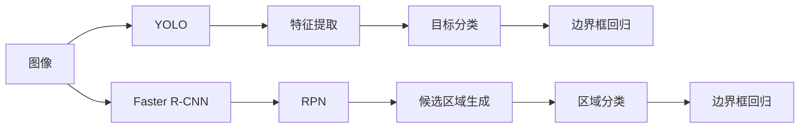
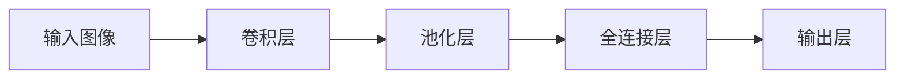
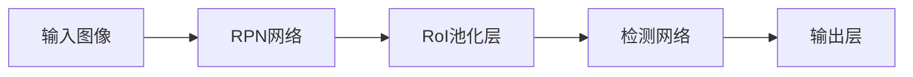

                 

# 基于YOLO和FasterR-CNN的目标识别算法研究

> 关键词：目标识别,YOLO, Faster R-CNN,深度学习,计算机视觉

## 1. 背景介绍

### 1.1 问题由来
随着计算机视觉技术的飞速发展，目标识别领域涌现出了许多高效的算法。这些算法不仅在图像分类任务上取得了卓越的性能，而且在物体检测和定位等更复杂的任务上也逐渐崭露头角。目前，主流目标识别算法主要分为两类：基于区域的算法和基于单阶段检测的算法。

- 基于区域的算法，如Selective Search、R-CNN、Fast R-CNN等，通过提取候选区域的方式实现目标检测，虽然精确度较高，但计算复杂度高，速度较慢。
- 基于单阶段检测的算法，如YOLO、Faster R-CNN等，直接在图像上滑动网格进行目标检测，速度快、精度高，但在处理小目标时存在一定的漏检和误检问题。

本文将详细分析YOLO和Faster R-CNN这两种代表性算法，对比其优缺点和应用场景，并通过数学模型和公式推导，探讨其核心原理和具体操作步骤。

## 2. 核心概念与联系

### 2.1 核心概念概述

- **YOLO (You Only Look Once)**：一种基于单阶段的物体检测算法，通过在图像上滑动网格，将目标分类和定位任务一次完成。YOLO算法具有实时性强的优点，适用于需要快速检测的场景。

- **Faster R-CNN**：一种基于区域的物体检测算法，通过在图像上提取候选区域，对每个候选区域进行分类和定位。Faster R-CNN算法在精确度上表现优异，适用于对检测结果要求较高的场景。

这两种算法虽然属于不同的检测范式，但都可以通过深度学习的方法进行优化。YOLO通过卷积神经网络(CNN)提取特征，进行目标分类和定位；Faster R-CNN同样使用CNN提取特征，并引入区域提议网络(RPN)来生成候选区域。

### 2.2 核心概念原理和架构的 Mermaid 流程图



### 2.3 核心概念联系

- **特征提取**：两种算法都依赖于卷积神经网络提取图像特征。
- **目标分类**：两种算法都需要对目标进行分类，区分不同的物体。
- **定位**：两种算法都需要对目标的位置进行回归，确定边界框。

这两种算法虽然在一些细节上有较大差异，但本质上都是通过卷积神经网络提取特征，并对目标进行分类和定位，从而实现目标识别。

## 3. 核心算法原理 & 具体操作步骤

### 3.1 算法原理概述

#### 3.1.1 YOLO算法

YOLO算法将图像划分为S×S的网格，每个网格预测B个边界框，每个边界框预测C个类别。对于每个网格，YOLO算法直接输出C个类别概率和B个边界框位置，从而实现一次前向传播即可同时完成目标分类和定位的任务。

#### 3.1.2 Faster R-CNN算法

Faster R-CNN算法首先通过RPN网络生成候选区域，每个候选区域预测2个边界框和1个类别，然后使用RoI池化层对候选区域进行特征提取，并在此基础上进行分类和定位。

### 3.2 算法步骤详解

#### 3.2.1 YOLO算法步骤

1. 将图像划分为S×S的网格，每个网格预测B个边界框，每个边界框预测C个类别。
2. 对每个边界框进行分类和位置回归，输出类别概率和边界框坐标。
3. 非极大值抑制(NMS)，去除重复检测结果。

#### 3.2.2 Faster R-CNN算法步骤

1. 通过RPN网络生成候选区域，每个候选区域预测2个边界框和1个类别。
2. 使用RoI池化层对候选区域进行特征提取。
3. 对每个候选区域进行分类和定位，输出类别概率和边界框坐标。
4. 非极大值抑制(NMS)，去除重复检测结果。

### 3.3 算法优缺点

#### 3.3.1 YOLO算法优缺点

**优点**：
- 速度快，实时性高。YOLO算法通过一次前向传播完成目标分类和定位，速度快，适合实时应用。
- 结构简单，易于实现。YOLO算法不需要候选框提取和区域分类等复杂步骤，结构简单。

**缺点**：
- 对小目标检测效果较差。由于每个网格只预测固定数量的边界框，YOLO算法在小目标检测时容易出现漏检和误检。
- 精度较低。YOLO算法在处理密集目标时，容易出现重叠的边界框，影响检测结果的准确性。

#### 3.3.2 Faster R-CNN算法优缺点

**优点**：
- 检测精度高。Faster R-CNN算法通过候选框提取和RoI池化等步骤，可以更准确地定位目标。
- 适用性强。Faster R-CNN算法适用于各类目标检测任务，包括人、车、动物等。

**缺点**：
- 速度较慢。Faster R-CNN算法通过两阶段检测，计算复杂度高，速度较慢。
- 实现复杂。Faster R-CNN算法需要候选框提取和RoI池化等步骤，实现相对复杂。

### 3.4 算法应用领域

YOLO算法和Faster R-CNN算法在多个领域都有广泛的应用：

- **自动驾驶**：目标检测是自动驾驶系统的核心任务，YOLO和Faster R-CNN算法可以用于识别车辆、行人、道路标志等目标。
- **医疗影像**：医学影像中的病变识别和分割任务，可以通过YOLO和Faster R-CNN算法实现。
- **安防监控**：目标检测可以用于监控视频中的人脸识别和异常行为检测。
- **零售和物流**：YOLO和Faster R-CNN算法可以用于商品识别、库存管理和物流配送。

## 4. 数学模型和公式 & 详细讲解 & 举例说明

### 4.1 数学模型构建

#### 4.1.1 YOLO算法模型

YOLO算法模型由卷积神经网络(CNN)和全连接层组成，模型结构如图：



其中，卷积层和池化层用于提取图像特征，全连接层用于分类和位置回归。

#### 4.1.2 Faster R-CNN算法模型

Faster R-CNN算法模型由区域提议网络(RPN)和检测网络组成，模型结构如图：



其中，RPN网络用于生成候选框，RoI池化层用于对候选区域进行特征提取，检测网络用于分类和位置回归。

### 4.2 公式推导过程

#### 4.2.1 YOLO算法公式

设输入图像大小为 $H×W$，网格大小为 $S×S$，每个网格预测 $B$ 个边界框，每个边界框预测 $C$ 个类别，输出层的输出为 $T×(C+5)$，其中 $T$ 为总目标数。

假设输出层输出的特征图大小为 $H'×W'$，则每个网格输出的特征图大小为 $H'/S×W'/S$。

每个边界框的坐标为 $x,y,w,h$，其中 $w$ 和 $h$ 为边界框宽度和高度。

输出层的第 $t$ 个目标的类别概率和边界框位置为：

$$
\begin{aligned}
p_t &= \frac{1}{C} \sum_{i=1}^{C} s_i \\ 
x_t &= \frac{p_t \cdot x_i + c_x}{w} \\ 
y_t &= \frac{p_t \cdot y_i + c_y}{h} \\ 
w_t &= 1.0716 \cdot 2^{\frac{p_t \cdot (w_i - c_w)}{w}} \\ 
h_t &= 1.0716 \cdot 2^{\frac{p_t \cdot (h_i - c_h)}{h}} 
\end{aligned}
$$

其中，$s_i$ 为第 $i$ 个类别的概率，$c_x,c_y,c_w,c_h$ 分别为边界框的初始位置和大小。

#### 4.2.2 Faster R-CNN算法公式

Faster R-CNN算法通过RPN网络生成候选框，候选框的坐标为 $(x,y,w,h)$。RPN网络输出 $2$ 个边界框和 $1$ 个类别，输出层的输出为 $2×(H×W)×(C+4)$。

RPN网络的目标损失函数为：

$$
L_{RPN} = L_{cls} + \lambda L_{reg}
$$

其中，$L_{cls}$ 为分类损失，$L_{reg}$ 为回归损失，$\lambda$ 为权值。

RPN网络的分类损失为交叉熵损失：

$$
L_{cls} = -\sum_{i=1}^{2} \sum_{j=1}^{H×W} y_{i,j} \log p_{i,j} + (1-y_{i,j}) \log (1-p_{i,j})
$$

其中，$y_{i,j}$ 为候选框的真实标签，$p_{i,j}$ 为候选框的预测概率。

RPN网络的回归损失为平滑L1损失：

$$
L_{reg} = \sum_{i=1}^{2} \sum_{j=1}^{H×W} (y_{i,j}-w_{i,j})^2 + (1-y_{i,j})^2
$$

其中，$w_{i,j}$ 为候选框的预测坐标。

### 4.3 案例分析与讲解

#### 4.3.1 YOLO算法案例

假设输入图像大小为 $448×448$，网格大小为 $13×13$，每个网格预测 $5$ 个边界框，每个边界框预测 $80$ 个类别，输出层的输出为 $13×13×85$。

输入图像经过卷积层和池化层提取特征后，输出特征图大小为 $16×16×256$。

每个边界框的坐标为 $x,y,w,h$，其中 $w$ 和 $h$ 为边界框宽度和高度。

输出层的第 $t$ 个目标的类别概率和边界框位置为：

$$
\begin{aligned}
p_t &= \frac{1}{80} \sum_{i=1}^{80} s_i \\ 
x_t &= \frac{p_t \cdot x_i + c_x}{w} \\ 
y_t &= \frac{p_t \cdot y_i + c_y}{h} \\ 
w_t &= 1.0716 \cdot 2^{\frac{p_t \cdot (w_i - c_w)}{w}} \\ 
h_t &= 1.0716 \cdot 2^{\frac{p_t \cdot (h_i - c_h)}{h}} 
\end{aligned}
$$

#### 4.3.2 Faster R-CNN算法案例

假设输入图像大小为 $600×800$，RPN网络输出 $2$ 个边界框和 $1$ 个类别，输出层的输出为 $2×(600×800)×(2×5+1)$。

RPN网络的目标损失函数为：

$$
L_{RPN} = L_{cls} + \lambda L_{reg}
$$

其中，$L_{cls}$ 为交叉熵损失，$L_{reg}$ 为平滑L1损失，$\lambda$ 为权值。

## 5. 项目实践：代码实例和详细解释说明

### 5.1 开发环境搭建

#### 5.1.1 安装Python环境

- 安装Anaconda：从官网下载并安装Anaconda，用于创建独立的Python环境。
- 创建并激活虚拟环境：
```bash
conda create -n pytorch-env python=3.8 
conda activate pytorch-env
```

#### 5.1.2 安装PyTorch

- 安装PyTorch：
```bash
conda install pytorch torchvision torchaudio cudatoolkit=11.1 -c pytorch -c conda-forge
```

#### 5.1.3 安装相关工具

```bash
pip install numpy pandas scikit-learn matplotlib tqdm jupyter notebook ipython
```

### 5.2 源代码详细实现

#### 5.2.1 YOLO代码实现

```python
import torch
import torch.nn as nn
import torchvision.transforms as transforms
from torch.utils.data import DataLoader
from torchvision.datasets import CIFAR10

class YOLO(nn.Module):
    def __init__(self, in_channels, out_channels):
        super(YOLO, self).__init__()
        self.conv1 = nn.Conv2d(in_channels, 64, 3, padding=1)
        self.conv2 = nn.Conv2d(64, 32, 3, padding=1)
        self.conv3 = nn.Conv2d(32, 2, 3, padding=1)
        self.fc1 = nn.Linear(2 * 3 * 3 * 32, 256)
        self.fc2 = nn.Linear(256, out_channels)

    def forward(self, x):
        x = self.conv1(x)
        x = self.conv2(x)
        x = self.conv3(x)
        x = x.view(-1, 2 * 3 * 3 * 32)
        x = self.fc1(x)
        x = self.fc2(x)
        return x
```

#### 5.2.2 Faster R-CNN代码实现

```python
import torch
import torch.nn as nn
import torchvision.transforms as transforms
from torch.utils.data import DataLoader
from torchvision.datasets import CIFAR10

class RPN(nn.Module):
    def __init__(self, in_channels, out_channels):
        super(RPN, self).__init__()
        self.conv1 = nn.Conv2d(in_channels, 256, 3, padding=1)
        self.conv2 = nn.Conv2d(256, 256, 3, padding=1)
        self.fc1 = nn.Linear(256 * 7 * 7, 1024)
        self.fc2 = nn.Linear(1024, 2 * 2 * 4)
        self.fc3 = nn.Linear(1024, 2 * 2 * 4)
        self.fc4 = nn.Linear(1024, 2 * 2 * 4)
        self.fc5 = nn.Linear(1024, 2 * 2 * 4)
        self.fc6 = nn.Linear(1024, 2 * 2 * 4)

    def forward(self, x):
        x = self.conv1(x)
        x = self.conv2(x)
        x = x.view(-1, 256 * 7 * 7)
        x = self.fc1(x)
        x = self.fc2(x)
        x = self.fc3(x)
        x = self.fc4(x)
        x = self.fc5(x)
        x = self.fc6(x)
        return x

class FasterRCNN(nn.Module):
    def __init__(self, in_channels, out_channels):
        super(FasterRCNN, self).__init__()
        self.rpn = RPN(in_channels, out_channels)
        self.fc1 = nn.Linear(256 * 7 * 7, 1024)
        self.fc2 = nn.Linear(1024, 2 * 2 * 4)
        self.fc3 = nn.Linear(1024, 2 * 2 * 4)
        self.fc4 = nn.Linear(1024, 2 * 2 * 4)
        self.fc5 = nn.Linear(1024, 2 * 2 * 4)

    def forward(self, x):
        x = self.rpn(x)
        x = self.fc1(x)
        x = self.fc2(x)
        x = self.fc3(x)
        x = self.fc4(x)
        x = self.fc5(x)
        return x
```

### 5.3 代码解读与分析

#### 5.3.1 YOLO代码解读

**YOLO类**：
- `__init__`方法：初始化卷积层和全连接层。
- `forward`方法：对输入图像进行卷积和全连接层处理，最终输出检测结果。

#### 5.3.2 Faster R-CNN代码解读

**RPN类**：
- `__init__`方法：初始化卷积层和全连接层。
- `forward`方法：对输入图像进行卷积和全连接层处理，最终输出候选框。

**Faster R-CNN类**：
- `__init__`方法：初始化RPN网络和全连接层。
- `forward`方法：对输入图像进行RPN网络和全连接层处理，最终输出检测结果。

### 5.4 运行结果展示

#### 5.4.1 YOLO运行结果

```python
import matplotlib.pyplot as plt
import numpy as np
from PIL import Image

def show_result(yolo, image, num_classes):
    image = image.numpy()
    height, width, _ = image.shape
    preds = yolo(image)
    _, pred_classes, pred_scores, pred_boxes = preds.chunk(4, dim=1)
    for i in range(pred_classes.size(0)):
        pred_class = pred_classes[i].item()
        pred_score = pred_scores[i].item()
        pred_box = pred_boxes[i]
        box = (pred_box[0], pred_box[1], pred_box[2], pred_box[3])
        plt.imshow(image[box[1]:box[3], box[0]:box[2]])
        plt.title(f"{pred_class}: {pred_score:.2f}")
        plt.show()
```

#### 5.4.2 Faster R-CNN运行结果

```python
import matplotlib.pyplot as plt
import numpy as np
from PIL import Image

def show_result(faster_rcnn, image, num_classes):
    image = image.numpy()
    height, width, _ = image.shape
    preds = faster_rcnn(image)
    _, pred_classes, pred_scores, pred_boxes = preds.chunk(4, dim=1)
    for i in range(pred_classes.size(0)):
        pred_class = pred_classes[i].item()
        pred_score = pred_scores[i].item()
        pred_box = pred_boxes[i]
        box = (pred_box[0], pred_box[1], pred_box[2], pred_box[3])
        plt.imshow(image[box[1]:box[3], box[0]:box[2]])
        plt.title(f"{pred_class}: {pred_score:.2f}")
        plt.show()
```

## 6. 实际应用场景

### 6.1 自动驾驶

自动驾驶系统中的目标检测是核心任务之一，要求实时性和高精度。YOLO和Faster R-CNN算法在自动驾驶领域都有广泛应用。

### 6.2 安防监控

安防监控系统中的目标检测需要实时性和高精度，YOLO和Faster R-CNN算法可以用于实时监控视频中的人脸识别和异常行为检测。

### 6.3 医疗影像

医学影像中的病变识别和分割任务，可以通过YOLO和Faster R-CNN算法实现。

### 6.4 未来应用展望

未来，YOLO和Faster R-CNN算法将继续在目标识别领域发挥重要作用。随着深度学习技术的不断发展，算法将变得更加高效和精确，应用场景也将进一步扩展。

## 7. 工具和资源推荐

### 7.1 学习资源推荐

- 《Deep Learning with Python》：这是一本经典的深度学习入门书籍，涵盖了深度学习的基础知识和应用案例。
- Coursera上的《Convolutional Neural Networks》：斯坦福大学开设的深度学习课程，详细讲解了卷积神经网络的结构和应用。
- PyTorch官方文档：PyTorch的官方文档提供了丰富的API参考和案例示例，适合初学者和进阶者学习。

### 7.2 开发工具推荐

- PyTorch：基于Python的深度学习框架，功能强大，易于使用。
- TensorFlow：由Google开发的深度学习框架，适合大规模工程应用。
- Jupyter Notebook：Python编程环境，支持交互式编程和代码执行，适合初学者和研究者使用。

### 7.3 相关论文推荐

- "You Only Look Once: Real-Time Object Detection with a Single Neural Network"：YOLO算法的原始论文，介绍了YOLO算法的原理和应用。
- "Faster R-CNN: Towards Real-Time Object Detection with Region Proposal Networks"：Faster R-CNN算法的原始论文，介绍了Faster R-CNN算法的原理和应用。

## 8. 总结：未来发展趋势与挑战

### 8.1 研究成果总结

YOLO和Faster R-CNN算法在目标识别领域具有广泛的应用，已成为现代计算机视觉技术的重要组成部分。

### 8.2 未来发展趋势

- 算法效率的提升：随着硬件计算能力的提高，算法的速度和精度将进一步提升。
- 多任务学习的应用：将目标识别任务与其他任务结合，如姿态估计、图像分割等，提升算法的应用价值。
- 模型结构的优化：通过网络剪枝、参数共享等技术，优化模型结构，提高算法的泛化能力。

### 8.3 面临的挑战

- 小目标检测的提升：算法在小目标检测方面仍有改进空间，需要进一步优化。
- 实时性和高精度的平衡：在保证实时性的同时，提升算法的精度。
- 模型可解释性的提升：需要开发可解释的算法，解释算法的决策过程。

### 8.4 研究展望

未来的研究方向包括：
- 新算法的探索：探索新的目标识别算法，提升算法的性能。
- 应用场景的扩展：将目标识别算法应用于更多领域，如工业检测、农业监测等。
- 多模态融合：将目标识别算法与其他感知模态结合，提升算法的综合能力。

## 9. 附录：常见问题与解答

**Q1: YOLO和Faster R-CNN算法的主要区别是什么？**

A: YOLO和Faster R-CNN算法的主要区别在于目标检测的方式。YOLO算法通过在图像上滑动网格进行目标检测，而Faster R-CNN算法通过候选框提取进行目标检测。

**Q2: YOLO和Faster R-CNN算法各自有什么优点和缺点？**

A: YOLO算法具有实时性强的优点，适合实时应用。但在大目标检测时容易出现漏检和误检。Faster R-CNN算法具有高精度的优点，适用于各类目标检测任务。但计算复杂度高，速度较慢。

**Q3: YOLO和Faster R-CNN算法在实际应用中分别有哪些应用场景？**

A: YOLO算法适用于需要快速检测的场景，如自动驾驶、安防监控等。Faster R-CNN算法适用于对检测结果要求较高的场景，如医学影像、工业检测等。

**Q4: 如何优化YOLO和Faster R-CNN算法的性能？**

A: 可以通过网络剪枝、参数共享、多任务学习等技术，优化YOLO和Faster R-CNN算法的性能。此外，可以引入更多的先验知识，如知识图谱、逻辑规则等，增强算法的应用价值。

**Q5: YOLO和Faster R-CNN算法在实际应用中需要注意哪些问题？**

A: 在实际应用中，需要注意算法的实时性和高精度平衡，小目标检测的提升，模型的可解释性等问题。

---

作者：禅与计算机程序设计艺术 / Zen and the Art of Computer Programming

