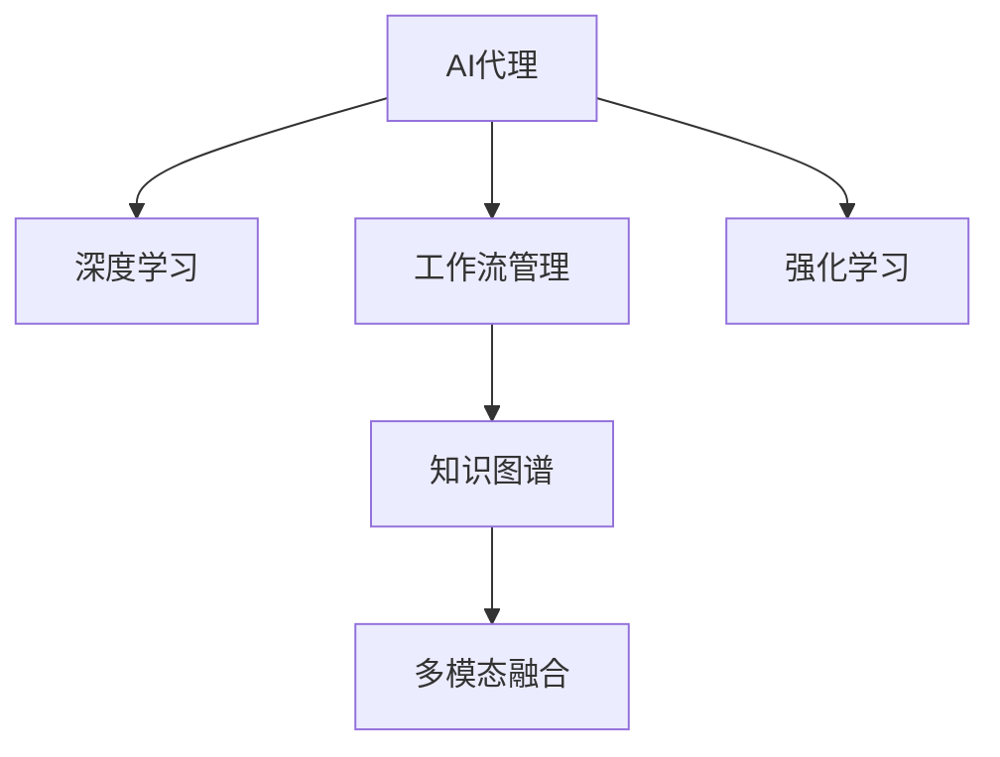

                 

# 基于深度学习的AI代理工作流：案例与实践

## 1. 背景介绍

### 1.1 问题由来
随着人工智能（AI）技术的迅猛发展，企业越来越意识到其潜力，并开始积极探索如何利用AI技术提升业务效率和创新能力。其中，AI代理（AI Agent）作为一种能够自主决策、执行复杂任务的智能系统，其应用范围和价值日益凸显。AI代理不仅能够帮助企业处理大量重复性、低价值的任务，还能在更为复杂的场景下提供决策支持，助力企业实现智能化转型。

### 1.2 问题核心关键点
AI代理的工作流通常包括感知、决策、执行三个环节。其中，感知环节负责从环境中获取信息，决策环节根据感知到的信息制定行动策略，执行环节则执行这些策略以达成目标。这种三层架构使得AI代理能够应对多样化的任务需求。然而，构建一个高效的AI代理系统，除了需要强大的技术支撑外，还需要从需求分析、系统设计、模型训练到部署实施等多环节进行全面的思考与实践。

### 1.3 问题研究意义
深入研究AI代理工作流的案例与实践，对于AI技术的实际应用和推广具有重要意义：

1. **提升业务效率**：AI代理可以自动化处理大量重复性任务，极大提升企业的工作效率，减少人力成本。
2. **创新业务模式**：AI代理能够辅助决策，推动企业探索新业务模式，增强市场竞争力。
3. **优化资源配置**：通过AI代理，企业可以实现资源的最优配置，提升运营效益。
4. **增强数据分析能力**：AI代理可以处理和分析海量数据，提供深入的洞察，支持业务决策。
5. **构建智能生态**：AI代理能够与其他智能系统协同工作，构建智能生态，提升整体智能水平。

## 2. 核心概念与联系

### 2.1 核心概念概述

在深入探讨AI代理工作流之前，首先需要理解一些核心概念及其相互之间的关系：

- **AI代理（AI Agent）**：指能够自主感知环境、决策行动、优化目标的智能系统。AI代理通常由感知模块、决策模块、执行模块三部分构成。
- **深度学习（Deep Learning）**：一种基于多层神经网络的机器学习技术，通过自动特征提取、多层非线性变换等技术实现复杂模式识别。
- **工作流管理（Workflow Management）**：指对业务流程进行定义、执行、监控和优化的一套方法论。
- **知识图谱（Knowledge Graph）**：一种结构化的知识表示方法，能够将领域知识进行有机的整合，支持AI代理的知识检索和推理。
- **多模态融合（Multi-Modal Fusion）**：指融合视觉、语音、文本等多种模态信息，以提升AI代理的理解和处理能力。
- **强化学习（Reinforcement Learning）**：一种基于奖励和惩罚的机器学习技术，通过与环境的交互优化策略。

这些核心概念之间的联系可以通过以下Mermaid流程图来展示：



这个流程图展示了大语言模型工作流中各核心概念的关系：

1. AI代理通过深度学习进行感知和决策。
2. 工作流管理对AI代理的流程进行定义和优化。
3. 知识图谱为AI代理提供结构化的知识支持。
4. 多模态融合提升AI代理的理解和处理能力。
5. 强化学习通过与环境的交互，优化AI代理的行为策略。

这些概念共同构成了AI代理的工作流框架，使得AI代理能够在复杂环境中自主完成各种任务。

## 3. 核心算法原理 & 具体操作步骤

### 3.1 算法原理概述

AI代理的核心算法原理主要基于深度学习和强化学习的结合。其工作流一般包括以下几个步骤：

1. **感知模块**：通过卷积神经网络（CNN）、循环神经网络（RNN）、Transformer等深度学习模型，对输入的多模态数据进行特征提取和预处理。
2. **决策模块**：通过策略网络（如Q网络、Policy网络），根据感知模块输出的特征，制定最优决策策略。
3. **执行模块**：根据决策模块的输出，通过动作执行网络（如动作执行器），执行具体的操作，达成目标。

### 3.2 算法步骤详解

#### 3.2.1 感知模块

感知模块的实现主要依赖深度学习模型，如CNN、RNN、Transformer等。以下以视觉感知为例，介绍如何利用卷积神经网络进行图像特征提取：

1. **模型选择**：选择合适的深度学习模型，如ResNet、Inception、EfficientNet等，对输入图像进行特征提取。
2. **数据预处理**：对输入图像进行预处理，包括归一化、裁剪、旋转等操作，提升模型性能。
3. **特征提取**：通过卷积层、池化层等网络结构，提取图像的高级特征。

#### 3.2.2 决策模块

决策模块通常由策略网络构成，通过优化策略网络参数，实现最优决策。以下以强化学习为例，介绍如何利用Q网络进行策略优化：

1. **状态空间定义**：定义状态空间，即决策模块的输入。状态空间通常包括感知模块输出的特征、时间步数等信息。
2. **动作空间定义**：定义动作空间，即决策模块的输出。动作空间通常包括可执行的具体操作，如移动、点击、播放等。
3. **训练Q网络**：通过Q网络学习状态-动作对之间的Q值，即每个状态-动作对的预期奖励。
4. **策略选择**：根据Q网络的输出，选择最优动作。

#### 3.2.3 执行模块

执行模块负责根据决策模块的输出，执行具体的操作。以下以动作执行器为例，介绍如何利用深度学习模型进行动作执行：

1. **动作映射**：将决策模块的输出映射到具体的动作空间。
2. **执行网络**：利用深度学习模型，如Recurrent Neural Network (RNN)、Long Short-Term Memory (LSTM)等，进行动作执行。
3. **反馈处理**：根据执行结果，更新感知模块和决策模块的参数，实现模型的自适应。

### 3.3 算法优缺点

#### 3.3.1 优点

1. **高效性**：深度学习模型能够高效地处理复杂的多模态数据，提升AI代理的感知和决策能力。
2. **自适应性**：强化学习使得AI代理能够在不断交互中自适应地优化策略，提高决策准确性。
3. **可扩展性**：深度学习和强化学习技术可以广泛应用于各种复杂任务，具有广泛的可扩展性。
4. **灵活性**：通过多模态融合和知识图谱支持，AI代理能够处理多样化的输入数据，提升应用范围。

#### 3.3.2 缺点

1. **数据需求高**：深度学习和强化学习模型的训练需要大量的标注数据和交互数据，成本较高。
2. **计算资源消耗大**：深度学习模型参数量大，计算复杂度高，需要高性能计算资源。
3. **泛化能力有限**：深度学习模型容易过拟合，泛化能力有限，需要额外的正则化技术。
4. **模型复杂度**：模型结构复杂，难以理解和调试，需要较高的专业技能。

### 3.4 算法应用领域

基于深度学习的AI代理技术，已经在多个领域得到了广泛应用，例如：

1. **智能客服**：利用AI代理自动处理客户咨询，提升服务效率和质量。
2. **智能推荐**：通过AI代理分析用户行为数据，实现个性化推荐，提升用户体验。
3. **智能交通**：利用AI代理优化交通流量，提高交通管理效率。
4. **智能制造**：通过AI代理优化生产流程，提升生产效率和产品质量。
5. **智能安防**：利用AI代理实时监控和预警，提升安防系统性能。
6. **智能金融**：通过AI代理进行风险评估和欺诈检测，保障金融安全。

## 4. 数学模型和公式 & 详细讲解 & 举例说明

### 4.1 数学模型构建

AI代理的工作流可以通过数学模型进行建模和优化。以下以视觉感知为例，介绍如何利用卷积神经网络进行图像特征提取：

1. **输入**：输入为彩色图像$x \in \mathbb{R}^{H \times W \times C}$，其中$H$为图像高度，$W$为图像宽度，$C$为颜色通道数。
2. **网络结构**：卷积神经网络由卷积层、池化层、全连接层等组成。卷积层用于提取图像特征，池化层用于降维，全连接层用于分类。
3. **输出**：输出为图像的特征表示$\mathbf{z} \in \mathbb{R}^d$，其中$d$为特征向量的维度。

### 4.2 公式推导过程

以视觉感知为例，介绍卷积神经网络的特征提取过程。假设输入为$x \in \mathbb{R}^{H \times W \times C}$，网络结构为$Conv \times Pool \times \ldots \times FC$，其中$Conv$表示卷积层，$Pool$表示池化层，$FC$表示全连接层。

网络的前向传播过程可以表示为：

$$
\mathbf{z} = f(\mathbf{x}, \mathbf{W}^{[1]}, \mathbf{b}^{[1]}, \mathbf{W}^{[2]}, \mathbf{b}^{[2]}, \ldots, \mathbf{W}^{[L]}, \mathbf{b}^{[L]})
$$

其中，$f$为非线性激活函数，$\mathbf{W}^{[l]}$和$\mathbf{b}^{[l]}$为第$l$层的权重和偏置。

### 4.3 案例分析与讲解

以智能推荐系统为例，介绍如何使用AI代理进行个性化推荐。

1. **输入**：用户的历史行为数据$x \in \mathbb{R}^{N \times d}$，其中$N$为用户数，$d$为特征维度。
2. **网络结构**：利用深度学习模型，如RNN、LSTM、Transformer等，对用户行为进行建模。
3. **输出**：推荐物品列表$y \in \mathbb{R}^{M}$，其中$M$为物品数。

## 5. 项目实践：代码实例和详细解释说明

### 5.1 开发环境搭建

在进行AI代理开发之前，需要进行开发环境搭建。以下是使用Python进行TensorFlow开发的环境配置流程：

1. 安装Anaconda：从官网下载并安装Anaconda，用于创建独立的Python环境。

2. 创建并激活虚拟环境：
```bash
conda create -n tf-env python=3.8 
conda activate tf-env
```

3. 安装TensorFlow：根据CUDA版本，从官网获取对应的安装命令。例如：
```bash
conda install tensorflow -c conda-forge
```

4. 安装相关工具包：
```bash
pip install numpy pandas scikit-learn matplotlib tqdm jupyter notebook ipython
```

完成上述步骤后，即可在`tf-env`环境中开始AI代理的开发实践。

### 5.2 源代码详细实现

这里我们以视觉感知模块为例，给出使用TensorFlow实现卷积神经网络代码的实现。

首先，定义卷积神经网络的结构：

```python
import tensorflow as tf
from tensorflow.keras.layers import Conv2D, MaxPooling2D, Flatten, Dense

def create_cnn_model():
    model = tf.keras.Sequential()
    model.add(Conv2D(32, (3, 3), activation='relu', input_shape=(28, 28, 1)))
    model.add(MaxPooling2D((2, 2)))
    model.add(Flatten())
    model.add(Dense(10, activation='softmax'))
    return model
```

然后，进行模型的训练：

```python
model = create_cnn_model()
model.compile(optimizer='adam', loss='sparse_categorical_crossentropy', metrics=['accuracy'])

# 训练数据
train_images = ...
train_labels = ...

# 训练
model.fit(train_images, train_labels, epochs=10, batch_size=32)
```

最后，进行模型的评估和预测：

```python
# 评估数据
test_images = ...
test_labels = ...

# 评估
test_loss, test_acc = model.evaluate(test_images, test_labels)

# 预测
predictions = model.predict(test_images)
```

以上就是使用TensorFlow实现卷积神经网络代码的实现。可以看到，TensorFlow提供了丰富的深度学习模型和工具，可以很方便地进行模型构建、训练和评估。

### 5.3 代码解读与分析

让我们再详细解读一下关键代码的实现细节：

**create_cnn_model函数**：
- 定义卷积神经网络的结构，包括卷积层、池化层、全连接层等。
- 通过Sequential模型，按照顺序逐层添加网络结构。
- 卷积层使用32个3x3的卷积核，ReLU激活函数。
- 池化层使用2x2的最大池化，减小特征图尺寸。
- 全连接层输出10个类别，使用softmax激活函数。

**模型训练**：
- 使用adam优化器，交叉熵损失函数，准确率指标。
- 定义训练数据，调用模型fit方法进行训练，设置epochs和batch size。
- 训练过程中，模型自动进行前向传播、反向传播和参数更新，直至收敛。

**模型评估**：
- 使用evaluate方法对测试集进行评估，计算损失和准确率。
- 模型自动进行前向传播，计算预测结果，并返回损失和准确率。

**模型预测**：
- 使用predict方法对测试集进行预测，计算预测结果。
- 模型自动进行前向传播，返回预测结果。

可以看到，TensorFlow提供了丰富的API和工具，可以很方便地进行深度学习模型的构建、训练和评估。开发者可以将更多精力放在模型设计、数据处理等高层逻辑上，而不必过多关注底层的实现细节。

当然，工业级的系统实现还需考虑更多因素，如模型的保存和部署、超参数的自动搜索、更灵活的任务适配层等。但核心的AI代理范式基本与此类似。

## 6. 实际应用场景

### 6.1 智能客服系统

基于AI代理的智能客服系统，可以显著提升客户服务体验。传统的客服系统需要大量人力进行人工客服，成本高，响应速度慢。而AI代理可以通过自然语言理解（NLU）和自然语言生成（NLG）技术，自动处理客户咨询，提升服务效率和质量。

在技术实现上，可以收集企业内部的客服对话记录，将问题和最佳答复构建成监督数据，在此基础上对预训练语言模型进行微调。微调后的语言模型能够自动理解用户意图，匹配最合适的答案模板进行回复。对于客户提出的新问题，还可以接入检索系统实时搜索相关内容，动态组织生成回答。如此构建的智能客服系统，能大幅提升客户咨询体验和问题解决效率。

### 6.2 智能推荐系统

基于AI代理的智能推荐系统，可以个性化推荐用户感兴趣的内容，提升用户体验。传统的推荐系统往往只依赖用户的历史行为数据进行物品推荐，无法深入理解用户的真实兴趣偏好。而AI代理能够通过多模态信息融合和知识图谱支持，更全面地分析用户行为数据，提供更精准、多样的推荐内容。

在技术实现上，可以收集用户浏览、点击、评论、分享等行为数据，提取和用户交互的物品标题、描述、标签等文本内容。将文本内容作为模型输入，用户的后续行为（如是否点击、购买等）作为监督信号，在此基础上微调预训练语言模型。微调后的模型能够从文本内容中准确把握用户的兴趣点。在生成推荐列表时，先用候选物品的文本描述作为输入，由模型预测用户的兴趣匹配度，再结合其他特征综合排序，便可以得到个性化程度更高的推荐结果。

### 6.3 智能交通系统

基于AI代理的智能交通系统，可以优化交通流量，提升交通管理效率。传统的交通管理系统往往依赖于静态的交通信号灯和人工调度，难以实时响应交通情况。而AI代理可以通过感知模块实时监测交通情况，决策模块制定最优调度策略，执行模块执行具体操作，从而实现交通流量的动态调整。

在技术实现上，可以使用摄像头、传感器等设备，实时获取道路和交通情况数据。通过卷积神经网络等深度学习模型，对数据进行特征提取和预处理。利用强化学习等算法，优化交通调度策略，提升交通管理效率。

## 7. 工具和资源推荐

### 7.1 学习资源推荐

为了帮助开发者系统掌握AI代理的理论基础和实践技巧，这里推荐一些优质的学习资源：

1. 《深度学习》系列书籍：由Goodfellow等人所著，深入浅出地介绍了深度学习的基本原理和应用。
2. 《Reinforcement Learning》系列书籍：由Sutton等人所著，全面介绍了强化学习的基本理论和算法。
3. CS294T《深度学习》课程：加州大学伯克利分校开设的深度学习课程，有Lecture视频和配套作业，适合入门学习。
4. CS224D《深度学习自然语言处理》课程：斯坦福大学开设的NLP明星课程，有Lecture视频和配套作业，适合深入学习。
5. Kaggle数据科学竞赛平台：提供大量NLP数据集和竞赛任务，适合实践学习和算法调优。

通过对这些资源的学习实践，相信你一定能够快速掌握AI代理的精髓，并用于解决实际的NLP问题。

### 7.2 开发工具推荐

高效的开发离不开优秀的工具支持。以下是几款用于AI代理开发的常用工具：

1. TensorFlow：由Google主导开发的开源深度学习框架，生产部署方便，适合大规模工程应用。
2. PyTorch：基于Python的开源深度学习框架，灵活动态的计算图，适合快速迭代研究。
3. Weights & Biases：模型训练的实验跟踪工具，可以记录和可视化模型训练过程中的各项指标，方便对比和调优。
4. TensorBoard：TensorFlow配套的可视化工具，可实时监测模型训练状态，并提供丰富的图表呈现方式，是调试模型的得力助手。
5. Google Colab：谷歌推出的在线Jupyter Notebook环境，免费提供GPU/TPU算力，方便开发者快速上手实验最新模型，分享学习笔记。

合理利用这些工具，可以显著提升AI代理的开发效率，加快创新迭代的步伐。

### 7.3 相关论文推荐

AI代理技术的发展源于学界的持续研究。以下是几篇奠基性的相关论文，推荐阅读：

1. AlexNet：ImageNet大规模视觉识别挑战赛的冠军模型，奠定了深度学习在计算机视觉领域的基础。
2. RNN：基于递归神经网络的时间序列预测模型，广泛应用于自然语言处理领域。
3. LSTM：长短期记忆网络，有效解决了传统RNN的梯度消失问题，广泛应用于序列建模任务。
4. Transformer：Google提出的自注意力机制模型，广泛应用于自然语言处理领域，推动了大规模语言模型的发展。
5. GAN：生成对抗网络，通过两个网络的对抗训练，生成高质量的图像、视频等数据。

这些论文代表了大语言模型和AI代理技术的早期研究，为后续技术的发展奠定了基础。

## 8. 总结：未来发展趋势与挑战

### 8.1 总结

本文对基于深度学习的AI代理工作流进行了全面系统的介绍。首先阐述了AI代理的基本概念和研究背景，明确了工作流对AI代理的重要意义。其次，从原理到实践，详细讲解了感知、决策、执行等环节的算法原理和操作步骤，提供了完整的代码实例。同时，本文还广泛探讨了AI代理在智能客服、智能推荐、智能交通等多个领域的应用前景，展示了AI代理技术的广阔前景。

通过本文的系统梳理，可以看到，AI代理在自动化处理、智能决策、优化执行等方面具有显著的优势，能够显著提升企业的业务效率和竞争力。未来，伴随深度学习和强化学习技术的不断发展，AI代理必将在更多领域得到应用，成为企业智能化转型的重要驱动力。

### 8.2 未来发展趋势

展望未来，AI代理技术将呈现以下几个发展趋势：

1. **多模态融合**：AI代理将越来越多地融合视觉、语音、文本等多种模态信息，提升感知和决策能力。
2. **知识图谱支持**：AI代理将更多地利用知识图谱，进行实体关系抽取和知识推理，增强决策的合理性。
3. **自适应学习**：AI代理将通过持续学习和强化学习，不断优化策略，提升泛化能力和鲁棒性。
4. **高效率执行**：AI代理将通过模型裁剪、量化加速等技术，提升执行效率，支持实时应用。
5. **可解释性增强**：AI代理将通过可解释性技术和模型调试工具，增强决策的透明性和可信度。
6. **伦理道德保障**：AI代理将引入伦理导向的评估指标，避免有害输出，确保模型安全。

以上趋势凸显了AI代理技术的未来发展方向，这些方向的探索发展，必将进一步提升AI代理系统的性能和应用范围，为人类认知智能的进化带来深远影响。

### 8.3 面临的挑战

尽管AI代理技术已经取得了显著成就，但在迈向更加智能化、普适化应用的过程中，它仍面临着诸多挑战：

1. **数据需求高**：AI代理的训练需要大量的标注数据和交互数据，成本较高。如何提高数据利用效率，降低数据获取成本，是亟需解决的问题。
2. **计算资源消耗大**：深度学习模型参数量大，计算复杂度高，需要高性能计算资源。如何优化模型结构和训练过程，降低计算资源消耗，是重要研究方向。
3. **泛化能力有限**：深度学习模型容易过拟合，泛化能力有限，需要额外的正则化技术。如何提高模型的泛化能力，增强模型鲁棒性，是未来研究方向。
4. **模型复杂度**：模型结构复杂，难以理解和调试，需要较高的专业技能。如何简化模型结构，提升模型可解释性，是重要研究方向。
5. **伦理道德问题**：AI代理在决策过程中可能产生偏见、有害输出等问题，如何确保模型安全，避免伦理道德问题，是重要研究方向。

### 8.4 研究展望

面对AI代理技术所面临的种种挑战，未来的研究需要在以下几个方面寻求新的突破：

1. **无监督学习**：摆脱对大规模标注数据的依赖，利用自监督学习、主动学习等无监督范式，最大限度利用非结构化数据。
2. **模型压缩**：通过模型裁剪、量化加速等技术，优化模型结构和计算过程，提升模型效率。
3. **自适应学习**：通过持续学习和强化学习，优化模型策略，提升泛化能力和鲁棒性。
4. **多模态融合**：融合视觉、语音、文本等多种模态信息，提升感知和决策能力。
5. **可解释性增强**：通过可解释性技术和模型调试工具，增强决策的透明性和可信度。
6. **伦理道德保障**：引入伦理导向的评估指标，避免有害输出，确保模型安全。

这些研究方向的探索，必将引领AI代理技术迈向更高的台阶，为构建安全、可靠、可解释、可控的智能系统铺平道路。面向未来，AI代理技术还需要与其他人工智能技术进行更深入的融合，如知识表示、因果推理、强化学习等，多路径协同发力，共同推动自然语言理解和智能交互系统的进步。只有勇于创新、敢于突破，才能不断拓展AI代理的边界，让智能技术更好地造福人类社会。

## 9. 附录：常见问题与解答

**Q1：AI代理在实际应用中面临哪些挑战？**

A: AI代理在实际应用中面临以下挑战：
1. **数据需求高**：AI代理的训练需要大量的标注数据和交互数据，成本较高。
2. **计算资源消耗大**：深度学习模型参数量大，计算复杂度高，需要高性能计算资源。
3. **泛化能力有限**：深度学习模型容易过拟合，泛化能力有限，需要额外的正则化技术。
4. **模型复杂度**：模型结构复杂，难以理解和调试，需要较高的专业技能。
5. **伦理道德问题**：AI代理在决策过程中可能产生偏见、有害输出等问题，需要确保模型安全。

**Q2：如何提高AI代理的泛化能力？**

A: 提高AI代理的泛化能力，可以采取以下措施：
1. **数据增强**：通过数据扩充、数据增强等技术，提高数据的多样性和泛化能力。
2. **正则化**：使用L2正则、Dropout等技术，防止模型过拟合。
3. **模型裁剪**：通过模型裁剪技术，减小模型规模，降低计算复杂度。
4. **知识图谱**：引入知识图谱，增强模型的知识推理能力。
5. **多模态融合**：融合视觉、语音、文本等多种模态信息，提升感知和决策能力。

**Q3：AI代理如何在多模态数据融合中取得更好效果？**

A: AI代理在多模态数据融合中，可以采取以下措施：
1. **特征对齐**：将不同模态的特征进行对齐，提取共性信息。
2. **融合算法**：使用融合算法，如LSTM、Transformer等，融合多模态信息。
3. **注意力机制**：引入注意力机制，根据不同模态的信息重要性，动态调整融合权重。
4. **权重学习**：通过学习权重，优化多模态信息的融合效果。
5. **多任务学习**：同时进行多个任务的学习，提升模型的多模态处理能力。

**Q4：AI代理在实际应用中如何保证模型安全和可解释性？**

A: 保证AI代理模型安全和可解释性，可以采取以下措施：
1. **伦理导向**：引入伦理导向的评估指标，避免有害输出。
2. **可解释性技术**：使用可解释性技术，如LIME、SHAP等，提升模型的可解释性。
3. **模型调试**：通过模型调试工具，及时发现和修正模型问题。
4. **公平性检验**：进行公平性检验，确保模型在所有群体中表现一致。
5. **透明性保障**：公开模型架构和决策过程，增强透明度。

以上是关于AI代理工作流的案例与实践的详细介绍，希望能对您的学习和实践有所帮助。在未来的技术发展中，相信AI代理将在更多领域得到广泛应用，为人类智能社会的进步贡献力量。

作者：禅与计算机程序设计艺术 / Zen and the Art of Computer Programming

