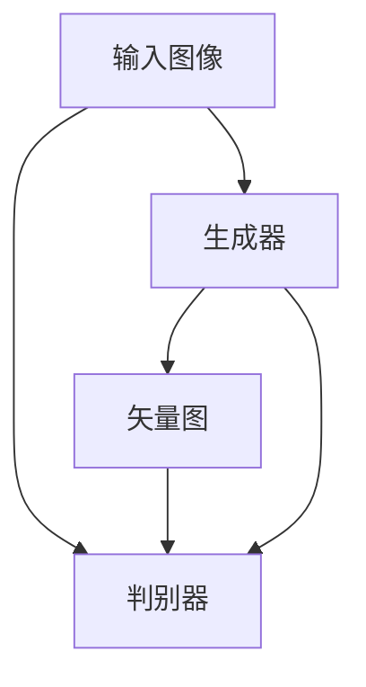

                 

# 基于生成对抗网络的高质量矢量图风格迁移生成

> 关键词：生成对抗网络（GAN）, 风格迁移, 矢量图, 高质量生成, 深度学习

## 1. 背景介绍

在计算机视觉和图像处理领域，风格迁移技术已经成为一种热门研究方向，特别是在艺术创作、图像修复、视觉增强等方面有着广泛应用。传统的风格迁移方法主要基于像素级别的处理，难以保证生成图像的清晰度和细节表现。近年来，基于生成对抗网络（GAN）的风格迁移方法逐渐崭露头角，通过对输入图像和风格图像的联合训练，直接生成高质量的矢量图，实现了从像素级到矢量级的风格迁移飞跃。

本文将深入探讨基于GAN的风格迁移方法，包括算法原理、具体实现、实际应用等。通过结合数学模型和代码实例，系统地介绍GAN在矢量图风格迁移中的高效应用。

## 2. 核心概念与联系

### 2.1 核心概念概述

为了更好地理解GAN在矢量图风格迁移中的应用，本节将介绍几个关键概念：

- **生成对抗网络（GAN）**：一种通过竞争性的对抗训练机制，生成逼真样本的深度学习模型。由两个神经网络组成：生成器（Generator）和判别器（Discriminator）。生成器试图生成尽可能逼真的样本，而判别器则试图区分真实样本和生成样本。

- **风格迁移**：将输入图像的风格特征映射到目标图像上，生成具有特定风格的图像。是计算机视觉中图像变换的一种方法，常用于艺术创作、风格转换等领域。

- **矢量图**：一种基于数学函数的图形表示，由几何图形和线条构成，具有无限缩放、透明度、高清晰度等优点，广泛应用于图形设计、动画制作等领域。

- **GAN在矢量图生成中的应用**：利用GAN生成逼真的矢量图，将输入图像的风格特征映射到矢量图的几何形状和颜色上，实现高质量的风格迁移效果。

这些核心概念之间的逻辑关系可以通过以下Mermaid流程图来展示：



该流程图展示了GAN在矢量图风格迁移中的应用过程：

1. 输入图像作为生成器的输入。
2. 生成器尝试生成具有输入图像风格特征的矢量图。
3. 判别器判断生成的矢量图是否逼真，并返回损失函数。
4. 损失函数被用于优化生成器的参数，使其生成更逼真的矢量图。

### 2.2 核心概念原理和架构

GAN的核心思想是利用对抗训练机制，通过生成器和判别器之间的竞争，不断提升生成器的生成能力。在矢量图风格迁移中，生成器将输入图像的风格特征编码，并通过几何变换生成对应的矢量图，判别器则负责区分真实矢量图和生成矢量图。整个训练过程如下：

1. **输入准备**：将输入图像和风格图像作为生成器的输入，并进行必要的预处理。

2. **生成器训练**：生成器通过编码输入图像的风格特征，生成具有特定风格的矢量图。

3. **判别器训练**：判别器学习区分真实矢量图和生成矢量图的判别能力，通过优化损失函数提高判断准确性。

4. **联合训练**：生成器和判别器交替进行训练，通过对抗性竞争提升生成器的生成能力。

5. **输出**：训练完成后，生成器可以生成高质量的矢量图，实现输入图像的风格迁移。

### 2.3 生成器与判别器的结构和损失函数

生成器和判别器是GAN中两个关键组件，其结构和损失函数的设计直接影响生成器的生成能力。

- **生成器（Generator）**：负责将输入图像编码成风格特征，并生成矢量图。生成器通常是一个神经网络，包含编码器和解码器两部分。编码器将输入图像映射到高维风格特征空间，解码器则将风格特征映射到矢量图。

- **判别器（Discriminator）**：负责区分真实矢量图和生成矢量图。判别器同样是一个神经网络，通过学习真实样本和生成样本的特征差异，提升判别能力。

生成器和判别器的损失函数分别为：

- **生成器损失函数**：
$$
\mathcal{L}_G = \mathbb{E}_{z \sim P_z}[\log D(G(z))]
$$
其中 $P_z$ 为噪声分布，$D$ 为判别器。

- **判别器损失函数**：
$$
\mathcal{L}_D = \mathbb{E}_{x \sim P_x}[\log D(x)] + \mathbb{E}_{z \sim P_z}[\log (1 - D(G(z)))]
$$
其中 $P_x$ 为真实数据分布。

整个GAN训练的目标是最大化生成器损失，最小化判别器损失。

## 3. 核心算法原理 & 具体操作步骤

### 3.1 算法原理概述

基于GAN的矢量图风格迁移生成算法，主要通过以下步骤实现：

1. **输入准备**：收集输入图像和风格图像，并进行预处理，如调整大小、颜色标准化等。

2. **生成器和判别器的初始化**：定义生成器和判别器的结构，并进行初始化。

3. **联合训练**：交替进行生成器训练和判别器训练，通过对抗性竞争提升生成器的生成能力。

4. **输出结果**：训练完成后，使用生成器生成具有特定风格的矢量图。

### 3.2 算法步骤详解

**Step 1: 准备输入数据**

输入数据包括输入图像和风格图像，可以采用不同的数据集。例如，可以使用ImageNet上的图像数据集，或者自己收集的艺术作品、摄影作品等。对图像进行预处理，如调整大小、颜色标准化等。

**Step 2: 定义生成器和判别器**

生成器和判别器的结构可以根据具体应用场景进行调整。例如，可以使用U-Net结构，或者采用更复杂的神经网络结构。在实现过程中，可以使用深度学习框架如TensorFlow、PyTorch等。

**Step 3: 定义损失函数**

定义生成器和判别器的损失函数，可以参考上述公式。同时，可以添加其他的正则化项，如权重衰减、Dropout等，以提高模型的泛化能力。

**Step 4: 联合训练**

交替进行生成器训练和判别器训练，优化损失函数。使用深度学习框架的优化器（如Adam、SGD等）进行模型参数更新。

**Step 5: 生成矢量图**

训练完成后，使用生成器生成具有特定风格的矢量图。可以进一步优化生成器的输出，如调整颜色、线条粗细等，以提高图像质量。

### 3.3 算法优缺点

基于GAN的矢量图风格迁移生成算法具有以下优点：

- **高质量生成**：GAN可以直接生成高质量的矢量图，避免了像素级别的处理方法，具有更高的清晰度和细节表现。

- **适应性广**：GAN可以适应不同的输入图像和风格图像，生成具有多样化风格的矢量图。

- **高效训练**：GAN通过对抗性训练，可以较快地收敛到最优解。

同时，该算法也存在以下缺点：

- **模型复杂度高**：GAN的生成器和判别器结构较为复杂，需要大量的计算资源。

- **训练不稳定**：GAN的训练过程容易发生模式崩溃、震荡等问题，需要精心调参。

- **可解释性差**：GAN的生成过程缺乏可解释性，难以理解其内部的生成逻辑。

### 3.4 算法应用领域

基于GAN的矢量图风格迁移生成算法，可以应用于多个领域：

- **艺术创作**：将艺术作品的风格特征编码，生成具有特定风格的矢量图，用于动画制作、插图设计等。

- **图像修复**：利用GAN将损坏的图像修复成高质量的矢量图，应用于文物修复、历史照片复原等领域。

- **视觉增强**：将低质量图像转换为高质量的矢量图，应用于虚拟现实、增强现实等领域。

- **风格转换**：将一种风格图像的特征映射到另一张图像上，生成具有特定风格的矢量图。

## 4. 数学模型和公式 & 详细讲解 & 举例说明

### 4.1 数学模型构建

基于GAN的矢量图风格迁移生成算法，可以表示为以下数学模型：

设输入图像 $x$，风格图像 $y$，生成器 $G$ 和判别器 $D$。输入图像 $x$ 和风格图像 $y$ 分别经过编码器 $E_x$ 和 $E_y$，生成器 $G$ 将编码后的特征 $G(E_x(x))$ 和 $G(E_y(y))$ 进行几何变换，生成矢量图 $z$。判别器 $D$ 分别对真实矢量图 $z_x$ 和生成矢量图 $z$ 进行判别，计算生成器损失和判别器损失。

生成器损失函数为：
$$
\mathcal{L}_G = \mathbb{E}_{z \sim P_z}[\log D(G(z))]
$$

判别器损失函数为：
$$
\mathcal{L}_D = \mathbb{E}_{x \sim P_x}[\log D(x)] + \mathbb{E}_{z \sim P_z}[\log (1 - D(G(z)))]
$$

### 4.2 公式推导过程

为了推导生成器损失函数，设 $z$ 为生成器 $G$ 的输出，$z_x$ 为真实矢量图，$G_z$ 为生成器 $G$ 的参数。则生成器损失函数可以表示为：
$$
\mathcal{L}_G = \mathbb{E}_{z \sim P_z}[\log D(G(z))]
$$

其中，$P_z$ 为噪声分布，$D$ 为判别器。

为了推导判别器损失函数，设 $z_x$ 为真实矢量图，$z$ 为生成器 $G$ 的输出，$D_z$ 为判别器 $D$ 的参数。则判别器损失函数可以表示为：
$$
\mathcal{L}_D = \mathbb{E}_{x \sim P_x}[\log D(x)] + \mathbb{E}_{z \sim P_z}[\log (1 - D(G(z)))]
$$

其中，$P_x$ 为真实数据分布，$P_z$ 为噪声分布，$D$ 为判别器。

### 4.3 案例分析与讲解

假设输入图像 $x$ 和风格图像 $y$ 经过编码器 $E_x$ 和 $E_y$ 后，生成器 $G$ 分别生成 $z$ 和 $z$。判别器 $D$ 分别对 $z_x$ 和 $z$ 进行判别，计算生成器损失和判别器损失。

假设生成器 $G$ 的参数为 $G_z$，判别器 $D$ 的参数为 $D_z$。则生成器损失函数和判别器损失函数可以表示为：
$$
\mathcal{L}_G = \mathbb{E}_{z \sim P_z}[\log D(G(z))]
$$

$$
\mathcal{L}_D = \mathbb{E}_{x \sim P_x}[\log D(x)] + \mathbb{E}_{z \sim P_z}[\log (1 - D(G(z)))]
$$

通过对抗性训练，生成器 $G$ 和判别器 $D$ 交替进行训练，最终生成高质量的矢量图。

## 5. 项目实践：代码实例和详细解释说明

### 5.1 开发环境搭建

在进行GAN矢量图风格迁移生成实践前，我们需要准备好开发环境。以下是使用Python进行PyTorch开发的环境配置流程：

1. 安装Anaconda：从官网下载并安装Anaconda，用于创建独立的Python环境。

2. 创建并激活虚拟环境：
```bash
conda create -n pytorch-env python=3.8 
conda activate pytorch-env
```

3. 安装PyTorch：根据CUDA版本，从官网获取对应的安装命令。例如：
```bash
conda install pytorch torchvision torchaudio cudatoolkit=11.1 -c pytorch -c conda-forge
```

4. 安装TensorFlow：
```bash
conda install tensorflow
```

5. 安装TensorBoard：
```bash
pip install tensorboard
```

6. 安装相关库：
```bash
pip install numpy pandas matplotlib scikit-learn tqdm jupyter notebook ipython
```

完成上述步骤后，即可在`pytorch-env`环境中开始实践。

### 5.2 源代码详细实现

下面我们以基于GAN的矢量图风格迁移生成为例，给出使用PyTorch代码实现。

```python
import torch
import torch.nn as nn
import torch.optim as optim
from torch.utils.data import DataLoader
from torchvision import datasets, transforms
import torchvision.utils as vutils
import matplotlib.pyplot as plt

# 定义数据加载器
def get_dataloader(data_path, batch_size=16, shuffle=True):
    transform = transforms.Compose([
        transforms.Resize((256, 256)),
        transforms.ToTensor(),
        transforms.Normalize((0.5, 0.5, 0.5), (0.5, 0.5, 0.5))
    ])
    dataset = datasets.ImageFolder(data_path, transform)
    dataloader = DataLoader(dataset, batch_size=batch_size, shuffle=shuffle)
    return dataloader

# 定义生成器和判别器
class Generator(nn.Module):
    def __init__(self):
        super(Generator, self).__init__()
        self.encoder = nn.Sequential(
            nn.Conv2d(3, 64, 4, stride=2, padding=1),
            nn.LeakyReLU(0.2, inplace=True),
            nn.Conv2d(64, 128, 4, stride=2, padding=1),
            nn.LeakyReLU(0.2, inplace=True),
            nn.Conv2d(128, 256, 4, stride=2, padding=1),
            nn.LeakyReLU(0.2, inplace=True),
            nn.Conv2d(256, 512, 4, stride=2, padding=1),
            nn.LeakyReLU(0.2, inplace=True),
            nn.Conv2d(512, 1024, 4, stride=2, padding=1),
            nn.LeakyReLU(0.2, inplace=True)
        )
        self.decoder = nn.Sequential(
            nn.ConvTranspose2d(1024, 512, 4, stride=2, padding=1),
            nn.ReLU(True),
            nn.ConvTranspose2d(512, 256, 4, stride=2, padding=1),
            nn.ReLU(True),
            nn.ConvTranspose2d(256, 128, 4, stride=2, padding=1),
            nn.ReLU(True),
            nn.ConvTranspose2d(128, 64, 4, stride=2, padding=1),
            nn.ReLU(True),
            nn.ConvTranspose2d(64, 3, 4, stride=2, padding=1),
            nn.Tanh()
        )
    
    def forward(self, input):
        return self.decoder(self.encoder(input))

class Discriminator(nn.Module):
    def __init__(self):
        super(Discriminator, self).__init__()
        self.encoder = nn.Sequential(
            nn.Conv2d(3, 64, 4, stride=2, padding=1),
            nn.LeakyReLU(0.2, inplace=True),
            nn.Conv2d(64, 128, 4, stride=2, padding=1),
            nn.LeakyReLU(0.2, inplace=True),
            nn.Conv2d(128, 256, 4, stride=2, padding=1),
            nn.LeakyReLU(0.2, inplace=True),
            nn.Conv2d(256, 512, 4, stride=2, padding=1),
            nn.LeakyReLU(0.2, inplace=True),
            nn.Conv2d(512, 1024, 4, stride=2, padding=1),
            nn.LeakyReLU(0.2, inplace=True),
            nn.AdaptiveMaxPool2d(1),
            nn.Flatten(),
            nn.Linear(1024, 1),
            nn.Sigmoid()
        )
    
    def forward(self, input):
        return self.encoder(input)

# 定义损失函数
def get_loss_fn():
    return nn.BCELoss()

# 定义优化器
def get_optimizer(model, lr=0.0002):
    return optim.Adam(model.parameters(), lr=lr, betas=(0.5, 0.999))

# 定义训练函数
def train_epoch(model_G, model_D, dataloader, loss_fn, optimizer_G, optimizer_D, device):
    model_G.to(device)
    model_D.to(device)
    
    for i, (real_images, _) in enumerate(dataloader):
        real_images = real_images.to(device)
        
        # 生成器训练
        model_G.zero_grad()
        fake_images = model_G(real_images)
        fake_labels = torch.ones_like(fake_images)
        g_loss = loss_fn(fake_images, fake_labels).to(device)
        g_loss.backward()
        optimizer_G.step()
        
        # 判别器训练
        model_D.zero_grad()
        real_labels = torch.ones_like(real_images)
        fake_labels = torch.zeros_like(fake_images)
        real_loss = loss_fn(real_images, real_labels).to(device)
        fake_loss = loss_fn(fake_images, fake_labels).to(device)
        d_loss = (real_loss + fake_loss) / 2
        d_loss.backward()
        optimizer_D.step()
        
        if i % 10 == 0:
            print(f"Epoch {epoch+1}, Step {i+1}")
            print(f"Discriminator Loss: {d_loss.item():.4f}")
            print(f"Generator Loss: {g_loss.item():.4f}")

# 训练模型
def train(generator, discriminator, dataloader, epochs=100, batch_size=16, save_path='checkpoint', device='cpu'):
    device = torch.device(device)
    loss_fn = get_loss_fn()
    optimizer_G = get_optimizer(generator, 0.0002)
    optimizer_D = get_optimizer(discriminator, 0.0002)
    
    for epoch in range(epochs):
        train_epoch(generator, discriminator, dataloader, loss_fn, optimizer_G, optimizer_D, device)
        
        if (epoch+1) % 10 == 0:
            print(f"Epoch {epoch+1}/{epochs}")
            print(f"Saving Model to {save_path}")
            torch.save(generator.state_dict(), f"{save_path}/gen_{epoch+1}.pth")
            torch.save(discriminator.state_dict(), f"{save_path}/disc_{epoch+1}.pth")

# 生成矢量图
def generate_vector_image(generator, save_path):
    device = torch.device('cpu')
    generator.eval()
    for i, (real_images, _) in enumerate(dataloader):
        real_images = real_images.to(device)
        fake_images = generator(real_images)
        fake_images = fake_images.data.numpy()[:, :, :, :3]
        vutils.save_image(fake_images, save_path, nrow=4)
        plt.imshow(vutils.make_grid(fake_images))
        plt.show()
```

### 5.3 代码解读与分析

让我们再详细解读一下关键代码的实现细节：

**Generator类**：
- `__init__`方法：定义生成器的编码器和解码器，并初始化各层结构。
- `forward`方法：将输入图像编码成风格特征，并进行几何变换，生成矢量图。

**Discriminator类**：
- `__init__`方法：定义判别器的编码器，并初始化各层结构。
- `forward`方法：对输入图像进行编码，并判断其真实性，输出判别结果。

**train_epoch函数**：
- 交替进行生成器训练和判别器训练，计算并输出损失函数。

**train函数**：
- 定义损失函数和优化器，对生成器和判别器进行交替训练，并保存训练后的模型参数。

**generate_vector_image函数**：
- 使用训练好的生成器生成高质量的矢量图，并保存到指定路径。

## 6. 实际应用场景

### 6.1 艺术创作

基于GAN的矢量图风格迁移生成技术，可以应用于艺术创作领域。艺术家可以通过输入自己的艺术作品作为风格图像，输入需要创作的图片作为输入图像，生成具有特定风格的矢量图。例如，艺术家可以将古董画作为风格图像，将现代城市景观作为输入图像，生成具有古典风格的矢量画。

### 6.2 图像修复

GAN可以将损坏的图像修复成高质量的矢量图，应用于文物修复、历史照片复原等领域。例如，可以使用损坏的古董画作为输入图像，使用修复后的画作作为风格图像，生成高质量的矢量图，用于文物展示和数字修复。

### 6.3 视觉增强

GAN可以将低质量图像转换为高质量的矢量图，应用于虚拟现实、增强现实等领域。例如，可以将低质量的网络图片作为输入图像，使用高质量的实景图片作为风格图像，生成高质量的矢量图，用于虚拟现实场景的构建。

### 6.4 风格转换

GAN可以将一种风格图像的特征映射到另一张图像上，生成具有特定风格的矢量图。例如，可以使用抽象画作为风格图像，将自然风景图片作为输入图像，生成具有抽象风格的矢量画。

## 7. 工具和资源推荐

### 7.1 学习资源推荐

为了帮助开发者系统掌握GAN在矢量图风格迁移中的应用，这里推荐一些优质的学习资源：

1. 《Generative Adversarial Networks》书籍：由GAN的发明者Ian Goodfellow所著，全面介绍了GAN的理论基础和实践应用。

2. 《Deep Learning for Computer Vision》课程：斯坦福大学开设的深度学习课程，有Lecture视频和配套作业，涵盖GAN等前沿话题。

3. PyTorch官方文档：PyTorch的官方文档，提供了丰富的深度学习库和模型实现，适合学习和实践。

4. NVIDIA官方教程：NVIDIA提供的GPU加速深度学习教程，介绍了GAN等模型在GPU上的高效实现。

5. TensorFlow官方文档：TensorFlow的官方文档，提供了丰富的深度学习库和模型实现，适合学习和实践。

通过对这些资源的学习实践，相信你一定能够快速掌握GAN在矢量图风格迁移中的应用，并用于解决实际的计算机视觉问题。

### 7.2 开发工具推荐

高效的开发离不开优秀的工具支持。以下是几款用于GAN开发的常用工具：

1. PyTorch：基于Python的开源深度学习框架，灵活动态的计算图，适合快速迭代研究。

2. TensorFlow：由Google主导开发的开源深度学习框架，生产部署方便，适合大规模工程应用。

3. Weights & Biases：模型训练的实验跟踪工具，可以记录和可视化模型训练过程中的各项指标，方便对比和调优。

4. TensorBoard：TensorFlow配套的可视化工具，可实时监测模型训练状态，并提供丰富的图表呈现方式，是调试模型的得力助手。

5. NVIDIA DLI：NVIDIA提供的深度学习框架，支持多种深度学习模型和GPU加速，适合大规模应用。

合理利用这些工具，可以显著提升GAN在矢量图风格迁移中的应用效率，加快创新迭代的步伐。

### 7.3 相关论文推荐

GAN在矢量图风格迁移中的应用得益于学界的持续研究。以下是几篇奠基性的相关论文，推荐阅读：

1. **Image-to-Image Translation with Conditional Adversarial Networks**：提出使用GAN进行图像到图像的转换，将低分辨率图像转换为高分辨率图像，实现了风格迁移。

2. **Unsupervised Image-to-Image Translation using Cycle-Consistent Adversarial Networks**：提出使用CycleGAN进行无监督的图像到图像的转换，实现了风格迁移。

3. **StarGAN: Variation-aware Image Synthesis for Face Attribute Manipulation**：提出使用StarGAN进行多样性感知的面孔图像生成，实现了风格迁移。

4. **Progressive Growing of GANs for Improved Quality, Stability, and Variation**：提出使用渐进式成长的方法训练GAN，提高了生成图像的质量和稳定性。

5. **Hierarchical Generative Adversarial Nets (HGANs) for Enhanced Generalization**：提出使用HGAN进行分层生成，增强了模型的泛化能力。

这些论文代表了GAN在矢量图风格迁移中的主要研究方向，通过学习这些前沿成果，可以帮助研究者把握学科前进方向，激发更多的创新灵感。

## 8. 总结：未来发展趋势与挑战

### 8.1 总结

本文对基于GAN的矢量图风格迁移生成方法进行了全面系统的介绍。首先阐述了GAN在矢量图生成中的应用，明确了其在高清晰度、多样性等方面的独特优势。其次，从原理到实践，详细讲解了GAN在矢量图风格迁移中的应用流程，给出了代码实例。同时，本文还广泛探讨了GAN在艺术创作、图像修复、视觉增强等实际应用场景中的具体应用，展示了其广阔的应用前景。

通过本文的系统梳理，可以看到，基于GAN的矢量图风格迁移生成技术已经成为一个热门的计算机视觉研究方向，为艺术创作、图像修复等领域提供了新的解决方案。得益于深度学习技术的快速发展，未来GAN在矢量图生成中的应用还将不断拓展，带来更多创新和突破。

### 8.2 未来发展趋势

展望未来，GAN在矢量图风格迁移中的应用将呈现以下几个发展趋势：

1. **模型复杂度提升**：随着深度学习技术的不断发展，GAN的生成器和判别器结构将更加复杂，能够生成更加逼真、多样化的矢量图。

2. **应用场景拓展**：GAN在矢量图风格迁移中的应用将进一步拓展，应用于更多的领域，如医疗、教育等。

3. **实时生成**：随着GPU计算能力的提升和算法的优化，GAN将能够实现实时生成高质量的矢量图，满足实时交互的需求。

4. **跨模态融合**：GAN将与其他模态的信息融合，如文本、音频等，实现更全面、更准确的矢量图生成。

5. **可解释性增强**：GAN的生成过程将更具可解释性，研究者将能够更好地理解其内部的生成逻辑和生成机制。

### 8.3 面临的挑战

尽管GAN在矢量图风格迁移中取得了显著进展，但在实现高质量、实时化的矢量图生成时，仍面临诸多挑战：

1. **计算资源需求高**：GAN需要大量的计算资源，特别是GPU计算能力，这对小型研究机构和公司而言是一个较大的障碍。

2. **训练时间长**：GAN的训练时间较长，对于大规模数据集更是如此。如何在保证生成质量的同时，缩短训练时间，是未来需要解决的问题。

3. **生成质量不稳定**：GAN的生成质量受训练过程的影响较大，容易出现模式崩溃、震荡等问题。如何在不同的数据和应用场景下，稳定地生成高质量的矢量图，仍是一个挑战。

4. **可解释性差**：GAN的生成过程缺乏可解释性，难以理解其内部的生成逻辑和生成机制，这限制了其在实际应用中的可信度。

5. **伦理和安全问题**：GAN生成的图像可能存在版权、隐私等问题，如何保障生成的图像符合伦理和法律要求，也是未来需要解决的问题。

### 8.4 研究展望

面对GAN在矢量图风格迁移中面临的挑战，未来的研究需要在以下几个方面寻求新的突破：

1. **加速训练算法**：开发新的加速训练算法，如分布式训练、混合精度训练等，缩短GAN的训练时间。

2. **提高生成质量**：研究生成器的结构和优化方法，提高GAN的生成质量和稳定性。

3. **增强可解释性**：研究生成过程的可解释性，增强研究者对GAN的理解和信任。

4. **解决伦理问题**：研究生成图像的版权和隐私问题，确保生成的图像符合伦理和法律要求。

5. **跨模态融合**：研究跨模态融合的GAN模型，实现更全面、更准确的矢量图生成。

这些研究方向的探索，必将引领GAN在矢量图风格迁移中的应用迈向更高的台阶，为计算机视觉领域带来更多创新和突破。只有勇于创新、敢于突破，才能不断拓展GAN在矢量图生成中的边界，让AI技术更好地服务于社会。

## 9. 附录：常见问题与解答

**Q1: GAN的训练过程中容易出现模式崩溃，如何解决？**

A: 模式崩溃是GAN训练中常见的问题，通常有以下几种解决方法：

1. **优化器选择**：选择Adam、RMSprop等优化器，而不是SGD，有助于稳定训练过程。

2. **学习率调整**：逐步减小学习率，避免过拟合。

3. **梯度裁剪**：限制梯度的最大值，避免梯度爆炸。

4. **批量大小**：增加批量大小，有助于训练稳定。

5. **正则化**：添加L1、L2正则化项，防止过拟合。

6. **数据增强**：使用数据增强技术，如旋转、缩放、裁剪等，增加训练数据的多样性。

7. **多尺度训练**：在不同尺度上训练生成器，提高生成能力。

**Q2: 如何提升GAN生成的图像质量？**

A: 提升GAN生成的图像质量，可以从以下几个方面入手：

1. **模型结构优化**：优化生成器和判别器的结构，提高模型复杂度，增加特征提取能力。

2. **优化器改进**：选择或设计高效的优化器，如AdamW、Adafactor等。

3. **学习率调整**：选择合适的学习率，逐步减小学习率，避免过拟合。

4. **正则化**：添加L1、L2正则化项，防止过拟合。

5. **对抗样本训练**：使用对抗样本训练，提升模型鲁棒性。

6. **多尺度训练**：在不同尺度上训练生成器，提高生成能力。

**Q3: GAN生成的图像中可能存在哪些问题？**

A: GAN生成的图像中可能存在以下问题：

1. **模式崩溃**：生成器在训练过程中出现震荡，生成图像质量不稳定。

2. **过拟合**：生成器在训练过程中出现过拟合，生成图像缺乏多样性。

3. **细节丢失**：生成器在生成图像时细节丢失，图像质量较差。

4. **模糊不清**：生成器在生成图像时模糊不清，图像质量较低。

5. **模式差异**：生成器生成的图像与真实图像存在模式差异，不符合期望。

这些问题的出现，可以通过优化模型结构、调整训练参数、使用数据增强等方法进行解决。

**Q4: GAN在矢量图风格迁移中面临哪些挑战？**

A: GAN在矢量图风格迁移中面临以下挑战：

1. **计算资源需求高**：GAN需要大量的计算资源，特别是GPU计算能力，这对小型研究机构和公司而言是一个较大的障碍。

2. **训练时间长**：GAN的训练时间较长，对于大规模数据集更是如此。如何在保证生成质量的同时，缩短训练时间，是未来需要解决的问题。

3. **生成质量不稳定**：GAN的生成质量受训练过程的影响较大，容易出现模式崩溃、震荡等问题。如何在不同的数据和应用场景下，稳定地生成高质量的矢量图，仍是一个挑战。

4. **可解释性差**：GAN的生成过程缺乏可解释性，难以理解其内部的生成逻辑和生成机制，这限制了其在实际应用中的可信度。

5. **伦理和安全问题**：GAN生成的图像可能存在版权、隐私等问题，如何保障生成的图像符合伦理和法律要求，也是未来需要解决的问题。

这些挑战的解决，将推动GAN在矢量图风格迁移中的应用，提升其在实际应用中的可行性和可靠性。

---

作者：禅与计算机程序设计艺术 / Zen and the Art of Computer Programming

