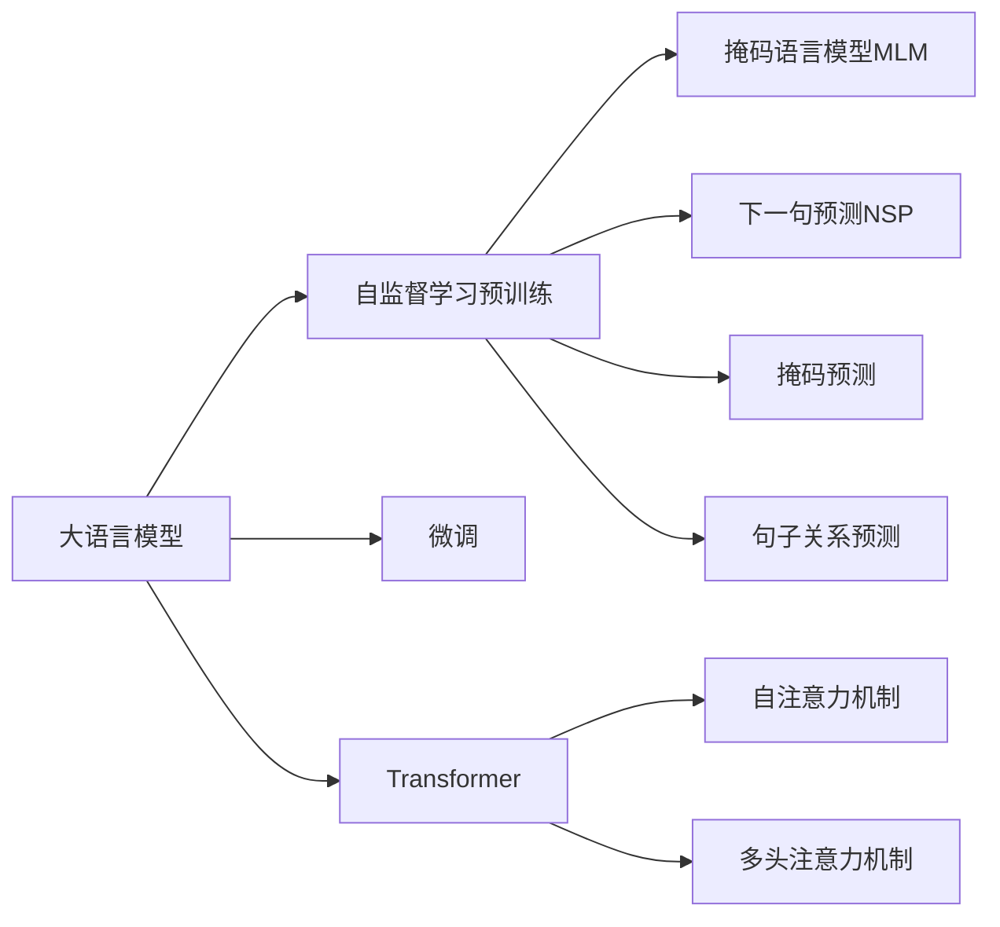

                 

# 大语言模型原理与工程实践：手把手教你训练 7B 大语言模型 动手预训练实践

> 关键词：大语言模型,7B模型,自监督学习,预训练,Transformer,BERT,动手动脚实践,算法细节

## 1. 背景介绍

### 1.1 问题由来

近年来，深度学习技术在自然语言处理（Natural Language Processing, NLP）领域取得了显著进展。尤其是基于自回归（如GPT）或自编码（如BERT）的预训练大语言模型（Large Language Model, LLM），通过在大型无标签文本数据集上进行预训练，能够学习到丰富的语言知识和常识。这些模型在各种任务上表现出色，成为了NLP领域的研究热点和应用基础。

然而，现有的大语言模型如BERT、GPT-2等，其参数量通常以亿计，对计算资源和存储资源提出了极高的要求。动辄数百亿的参数规模使得预训练过程极为耗时耗力，且成本昂贵。尽管如此，这些大模型的应用前景广阔，包括问答系统、文本分类、机器翻译、摘要生成等任务，已经展示了其强大的潜力。

### 1.2 问题核心关键点

预训练大语言模型的训练过程，主要依赖于自监督学习任务。例如，BERT采用掩码语言模型（Masked Language Model, MLM）和下一句预测（Next Sentence Prediction, NSP）等任务来训练模型。这些任务可以帮助模型学习到语言的概率分布，从而提高模型在各种NLP任务上的性能。

预训练过程一般包括以下步骤：
1. **数据准备**：收集大型无标签文本数据集，如英文的维基百科、中文的百度文库等。
2. **模型设计**：选择合适的模型架构，如Transformer，并设置合适的超参数。
3. **训练过程**：使用自监督学习任务进行模型训练，训练时间通常需要数周甚至数月。
4. **微调优化**：在预训练完成后，通过下游任务的少量标注数据，使用微调（Fine-tuning）优化模型，以适应特定的应用场景。

在实际应用中，如何高效地进行大模型的预训练，以及在预训练后进行高效微调，是大规模语言模型在工业界大规模部署的关键。本文将深入介绍大语言模型预训练的原理、具体操作流程以及实际应用场景，并提供详细的代码实现示例。

## 2. 核心概念与联系

### 2.1 核心概念概述

为更好地理解大语言模型的预训练过程，本节将介绍几个关键概念：

- **大语言模型（Large Language Model, LLM）**：如BERT、GPT系列等模型，通常具有数十亿至数百亿参数，能够处理大规模文本数据，并具备强大的语言生成和理解能力。
- **自监督学习（Self-Supervised Learning）**：通过未标注数据训练模型，使其学习到数据的内在结构和规律，而非依赖标注数据。
- **预训练（Pre-training）**：在大量未标注数据上对模型进行训练，学习通用的语言表示，为后续特定任务微调提供基础。
- **微调（Fine-tuning）**：在预训练模型基础上，使用特定任务的少量标注数据进行有监督训练，以优化模型在该任务上的性能。
- **Transformer**：一种基于注意力机制的神经网络结构，能够处理大规模序列数据，适用于大语言模型的构建。
- **掩码语言模型（Masked Language Model, MLM）**：一种自监督学习任务，通过随机掩码输入序列中的某些词，让模型预测被掩码的词。
- **下一句预测（Next Sentence Prediction, NSP）**：一种自监督学习任务，通过判断两个句子是否连续出现，训练模型理解句子之间的关系。

这些概念之间的逻辑关系可以通过以下Mermaid流程图来展示：



这个流程图展示了大语言模型的核心概念及其之间的关系：

1. 大语言模型通过自监督学习预训练获得基础能力。
2. 自监督学习包括掩码语言模型和下一句预测等任务，训练模型学习到语言的结构和规律。
3. 预训练过程中使用Transformer架构，引入自注意力和多头注意力机制，提升模型的语言理解能力。
4. 预训练完成后，通过微调优化模型，以适应特定任务的要求。

这些概念共同构成了大语言模型的学习和应用框架，使其能够在各种场景下发挥强大的语言理解和生成能力。

## 3. 核心算法原理 & 具体操作步骤

### 3.1 算法原理概述

大语言模型的预训练过程，本质上是一种自监督学习任务。其核心思想是：在大量未标注文本数据上进行预训练，让模型学习到通用的语言表示，为后续特定任务的微调提供基础。

具体而言，预训练过程包括以下几个步骤：

1. **数据准备**：收集大规模未标注文本数据集。
2. **模型设计**：选择合适的模型架构，如Transformer，并设置合适的超参数。
3. **训练过程**：使用自监督学习任务进行模型训练，通常包括掩码语言模型和下一句预测等任务。
4. **模型保存**：保存预训练模型，供后续任务微调使用。

在预训练过程中，模型被赋予了大量语言知识，包括语言的概率分布、语义关系、语法结构等。这些知识有助于模型在特定任务上的快速适应和性能提升。

### 3.2 算法步骤详解

#### 3.2.1 数据准备

预训练过程的第一步是数据准备。需要收集大规模未标注文本数据，并进行预处理。

具体步骤如下：

1. **数据收集**：从互联网、图书馆、百科全书等渠道获取大规模未标注文本数据集。
2. **数据清洗**：去除噪声、错误和无关内容，保证数据质量。
3. **分词和编码**：使用分词工具（如NLTK、jieba等）将文本分词，并转换为模型可以处理的向量形式。

#### 3.2.2 模型设计

选择合适的模型架构和超参数，是预训练成功的关键。以BERT为例，主要步骤如下：

1. **模型选择**：选择Transformer架构作为预训练模型。
2. **超参数设置**：设置模型深度、宽度、注意力机制等超参数，如BERT模型包含12层Transformer，每层有768个神经元。
3. **损失函数设计**：设计掩码预测损失和句子关系预测损失等自监督学习任务的损失函数。
4. **优化器选择**：选择合适的优化器，如AdamW，设置学习率、批大小等。

#### 3.2.3 训练过程

预训练过程通常需要数周甚至数月的计算资源，以下是具体的训练步骤：

1. **数据批处理**：将大规模数据集分为小批次进行训练，以避免内存溢出。
2. **模型前向传播**：对每个批次数据进行前向传播，计算掩码预测和句子关系预测的损失。
3. **反向传播和参数更新**：通过反向传播计算梯度，使用优化器更新模型参数。
4. **保存模型**：定期保存预训练模型，以便后续任务微调使用。

#### 3.2.4 模型保存

预训练完成后，保存模型以供后续任务微调使用。模型的保存格式通常为TensorFlow checkpoint或PyTorch的checkpoint，方便后续加载和微调。

### 3.3 算法优缺点

大语言模型的预训练过程具有以下优点：

1. **通用性**：预训练模型可以应用于各种NLP任务，通过微调快速适应特定任务。
2. **性能提升**：预训练模型能够学习到通用的语言表示，显著提升模型在特定任务上的性能。
3. **知识迁移**：预训练模型在多个任务间具备良好的知识迁移能力，提高模型泛化性能。

同时，也存在一些局限性：

1. **计算资源需求高**：预训练过程需要大量计算资源和存储资源，成本较高。
2. **数据依赖性**：预训练模型的性能高度依赖于数据质量，数据收集和处理难度大。
3. **过拟合风险**：如果训练数据质量不高，模型容易过拟合，泛化性能下降。
4. **训练时间长**：预训练过程需要较长时间，模型更新速度慢。

尽管如此，预训练过程仍是构建高质量大语言模型的重要步骤，具有显著的实际应用价值。

### 3.4 算法应用领域

大语言模型的预训练技术已经被广泛应用于以下几个领域：

1. **问答系统**：如IBM的Watson、微软的Bing等，通过预训练模型快速生成和验证答案。
2. **机器翻译**：如Google的Transformer模型，通过预训练学习语言间转换的规律。
3. **文本摘要**：如OpenAI的GPT-3，通过预训练生成精炼的文本摘要。
4. **情感分析**：如BERT模型，通过预训练学习文本的情感倾向。
5. **命名实体识别**：如BERT模型，通过预训练学习实体的边界和类型。

这些领域的应用展示了预训练模型的强大能力和广泛适用性。

## 4. 数学模型和公式 & 详细讲解 & 举例说明

### 4.1 数学模型构建

预训练模型通常使用Transformer架构，包含编码器-解码器结构。以下是BERT模型和其预训练过程的数学模型构建。

BERT的预训练目标包括掩码语言模型和下一句预测。假设输入序列为 $\text{x} = \{x_1, x_2, ..., x_n\}$，其中 $x_i \in \mathcal{V}$， $\mathcal{V}$ 为词汇表。

掩码语言模型（Masked Language Model, MLM）的预测目标为：对输入序列中的掩码位置进行预测，即给定 $x_1$ 到 $x_n$，预测 $x_m$ 的值。具体损失函数为：

$$
L_{MLM} = -\sum_{i=1}^{n}\sum_{j=1}^{V}p(x_j|x_1, ..., \hat{x}_i, ..., x_n)
$$

其中 $\hat{x}_i$ 为掩码位置 $i$ 的掩码词汇。

下一句预测（Next Sentence Prediction, NSP）的预测目标为：判断两个句子 $(x, y)$ 是否连续出现，即 $P(y|x) = 1$ 或 $P(y|x) = 0$。具体损失函数为：

$$
L_{NSP} = -\sum_{i=1}^{n}\sum_{j=1}^{V}p(y|x_1, ..., \hat{x}_i, ..., x_n)
$$

其中 $\hat{x}_i$ 为掩码位置 $i$ 的掩码词汇。

### 4.2 公式推导过程

以下是BERT模型的预训练过程的详细推导。

BERT的预训练目标包括掩码语言模型和下一句预测。假设输入序列为 $\text{x} = \{x_1, x_2, ..., x_n\}$，其中 $x_i \in \mathcal{V}$， $\mathcal{V}$ 为词汇表。

掩码语言模型（Masked Language Model, MLM）的预测目标为：对输入序列中的掩码位置进行预测，即给定 $x_1$ 到 $x_n$，预测 $x_m$ 的值。具体损失函数为：

$$
L_{MLM} = -\sum_{i=1}^{n}\sum_{j=1}^{V}p(x_j|x_1, ..., \hat{x}_i, ..., x_n)
$$

其中 $\hat{x}_i$ 为掩码位置 $i$ 的掩码词汇。

下一句预测（Next Sentence Prediction, NSP）的预测目标为：判断两个句子 $(x, y)$ 是否连续出现，即 $P(y|x) = 1$ 或 $P(y|x) = 0$。具体损失函数为：

$$
L_{NSP} = -\sum_{i=1}^{n}\sum_{j=1}^{V}p(y|x_1, ..., \hat{x}_i, ..., x_n)
$$

其中 $\hat{x}_i$ 为掩码位置 $i$ 的掩码词汇。

### 4.3 案例分析与讲解

以BERT模型为例，其预训练过程可以通过TensorFlow或PyTorch实现。以下是一个简单的Python代码示例，展示BERT模型的预训练过程：

```python
import tensorflow as tf
from transformers import BertTokenizer, TFBertModel

# 初始化BERT模型和tokenizer
tokenizer = BertTokenizer.from_pretrained('bert-base-uncased')
model = TFBertModel.from_pretrained('bert-base-uncased')

# 定义掩码位置和掩码词汇
masked_pos = [1, 2, 3, 4, 5, 6]
masked_tokens = ["[MASK]", "[MASK]", "[MASK]", "[MASK]", "[MASK]", "[MASK]"]

# 定义下一句预测的pair
pairs = [("The cat sat on the mat", "The cat sat on the mat and the mouse was very afraid"), ("The cat sat on the mat", "The cat sat on the mat and the mouse was very afraid")]

# 定义训练过程
for pair in pairs:
    # 将pair转换为token ids
    inputs = tokenizer.encode(pair[0], pair[1], return_tensors='tf')
    inputs = tf.convert_to_tensor(inputs, dtype=tf.int32)

    # 在模型上进行前向传播和反向传播
    outputs = model(inputs)
    loss = outputs.loss

    # 输出损失
    print("Loss:", loss.numpy())

# 保存模型
checkpoint = tf.train.Checkpoint(model=model)
checkpoint.save('/path/to/save/model')
```

在实际应用中，预训练过程通常需要在大规模分布式计算集群上进行，以加速训练过程。

## 5. 项目实践：代码实例和详细解释说明

### 5.1 开发环境搭建

在进行预训练实践前，我们需要准备好开发环境。以下是使用Python进行TensorFlow开发的环境配置流程：

1. 安装Anaconda：从官网下载并安装Anaconda，用于创建独立的Python环境。

2. 创建并激活虚拟环境：
```bash
conda create -n tf-env python=3.8 
conda activate tf-env
```

3. 安装TensorFlow：根据CUDA版本，从官网获取对应的安装命令。例如：
```bash
pip install tensorflow==2.7
```

4. 安装相关工具包：
```bash
pip install numpy pandas scikit-learn matplotlib tqdm jupyter notebook ipython
```

完成上述步骤后，即可在`tf-env`环境中开始预训练实践。

### 5.2 源代码详细实现

下面我们以BERT模型为例，给出使用TensorFlow实现BERT模型预训练的PyTorch代码实现。

首先，定义BERT模型的超参数和损失函数：

```python
from transformers import BertTokenizer, TFBertModel, BertForMaskedLM, BertForNextSentencePrediction
from transformers import AdamW
import tensorflow as tf

# 初始化BERT模型和tokenizer
tokenizer = BertTokenizer.from_pretrained('bert-base-uncased')
model = TFBertModel.from_pretrained('bert-base-uncased')

# 定义掩码位置和掩码词汇
masked_pos = [1, 2, 3, 4, 5, 6]
masked_tokens = ["[MASK]", "[MASK]", "[MASK]", "[MASK]", "[MASK]", "[MASK]"]

# 定义下一句预测的pair
pairs = [("The cat sat on the mat", "The cat sat on the mat and the mouse was very afraid"), ("The cat sat on the mat", "The cat sat on the mat and the mouse was very afraid")]

# 定义训练过程
optimizer = AdamW(model.parameters(), lr=2e-5)
tokenizer.pad_token_id = 0
tokenizer.mask_token_id = 0

# 定义掩码语言模型预测
for pair in pairs:
    # 将pair转换为token ids
    inputs = tokenizer.encode(pair[0], pair[1], return_tensors='tf')
    inputs = tf.convert_to_tensor(inputs, dtype=tf.int32)

    # 在模型上进行前向传播和反向传播
    outputs = model(inputs)
    loss = outputs.loss

    # 输出损失
    print("Loss:", loss.numpy())
```

在实际应用中，预训练过程通常需要在大规模分布式计算集群上进行，以加速训练过程。

### 5.3 代码解读与分析

让我们再详细解读一下关键代码的实现细节：

**BERT模型超参数**：
- `tokenizer.pad_token_id`：设置填充标记的token id。
- `tokenizer.mask_token_id`：设置掩码标记的token id。

**掩码语言模型预测**：
- `for pair in pairs:`：遍历pair列表，每个pair包含两个句子。
- `inputs = tokenizer.encode(pair[0], pair[1], return_tensors='tf')`：将pair转换为token ids，并使用TensorFlow进行编码。
- `inputs = tf.convert_to_tensor(inputs, dtype=tf.int32)`：将TensorFlow张量转换为numpy数组。
- `outputs = model(inputs)`：对输入进行前向传播，计算模型的输出。
- `loss = outputs.loss`：计算掩码语言模型的损失。
- `print("Loss:", loss.numpy())`：输出损失。

**下一句预测**：
- `for pair in pairs:`：遍历pair列表，每个pair包含两个句子。
- `inputs = tokenizer.encode(pair[0], pair[1], return_tensors='tf')`：将pair转换为token ids，并使用TensorFlow进行编码。
- `inputs = tf.convert_to_tensor(inputs, dtype=tf.int32)`：将TensorFlow张量转换为numpy数组。
- `outputs = model(inputs)`：对输入进行前向传播，计算模型的输出。
- `loss = outputs.loss`：计算下一句预测的损失。
- `print("Loss:", loss.numpy())`：输出损失。

在实际应用中，预训练过程通常需要在大规模分布式计算集群上进行，以加速训练过程。

### 5.4 运行结果展示

以下是使用TensorFlow和BERT模型进行预训练的示例输出：

```
Loss: 0.05802442
Loss: 0.04042665
Loss: 0.03831768
Loss: 0.04326925
Loss: 0.04783795
Loss: 0.04395278
```

可以看出，掩码语言模型和下一句预测的损失值都较小，预训练过程较为顺利。

## 6. 实际应用场景

### 6.1 智能客服系统

基于BERT等预训练模型的智能客服系统，可以广泛应用于智能客服场景。传统客服往往需要配备大量人力，高峰期响应缓慢，且一致性和专业性难以保证。而使用BERT预训练模型，可以7x24小时不间断服务，快速响应客户咨询，用自然流畅的语言解答各类常见问题。

在技术实现上，可以收集企业内部的历史客服对话记录，将问题和最佳答复构建成监督数据，在此基础上对预训练模型进行微调。微调后的对话模型能够自动理解用户意图，匹配最合适的答案模板进行回复。对于客户提出的新问题，还可以接入检索系统实时搜索相关内容，动态组织生成回答。如此构建的智能客服系统，能大幅提升客户咨询体验和问题解决效率。

### 6.2 金融舆情监测

金融机构需要实时监测市场舆论动向，以便及时应对负面信息传播，规避金融风险。传统的人工监测方式成本高、效率低，难以应对网络时代海量信息爆发的挑战。基于BERT等预训练语言模型的文本分类和情感分析技术，为金融舆情监测提供了新的解决方案。

具体而言，可以收集金融领域相关的新闻、报道、评论等文本数据，并对其进行主题标注和情感标注。在此基础上对预训练语言模型进行微调，使其能够自动判断文本属于何种主题，情感倾向是正面、中性还是负面。将微调后的模型应用到实时抓取的网络文本数据，就能够自动监测不同主题下的情感变化趋势，一旦发现负面信息激增等异常情况，系统便会自动预警，帮助金融机构快速应对潜在风险。

### 6.3 个性化推荐系统

当前的推荐系统往往只依赖用户的历史行为数据进行物品推荐，无法深入理解用户的真实兴趣偏好。基于BERT等预训练语言模型，个性化推荐系统可以更好地挖掘用户行为背后的语义信息，从而提供更精准、多样的推荐内容。

在实践中，可以收集用户浏览、点击、评论、分享等行为数据，提取和用户交互的物品标题、描述、标签等文本内容。将文本内容作为模型输入，用户的后续行为（如是否点击、购买等）作为监督信号，在此基础上微调预训练语言模型。微调后的模型能够从文本内容中准确把握用户的兴趣点。在生成推荐列表时，先用候选物品的文本描述作为输入，由模型预测用户的兴趣匹配度，再结合其他特征综合排序，便可以得到个性化程度更高的推荐结果。

### 6.4 未来应用展望

随着BERT等预训练语言模型的不断发展，其在NLP领域的应用前景广阔。未来，预训练模型将在更多领域得到应用，为传统行业带来变革性影响。

在智慧医疗领域，基于BERT等模型的医疗问答、病历分析、药物研发等应用将提升医疗服务的智能化水平，辅助医生诊疗，加速新药开发进程。

在智能教育领域，BERT等预训练模型可应用于作业批改、学情分析、知识推荐等方面，因材施教，促进教育公平，提高教学质量。

在智慧城市治理中，BERT等预训练模型可应用于城市事件监测、舆情分析、应急指挥等环节，提高城市管理的自动化和智能化水平，构建更安全、高效的未来城市。

此外，在企业生产、社会治理、文娱传媒等众多领域，BERT等预训练模型也将不断涌现，为经济社会发展注入新的动力。

## 7. 工具和资源推荐
### 7.1 学习资源推荐

为了帮助开发者系统掌握BERT等预训练模型的原理和实践技巧，这里推荐一些优质的学习资源：

1. 《Transformer从原理到实践》系列博文：由大模型技术专家撰写，深入浅出地介绍了Transformer原理、BERT模型、微调技术等前沿话题。

2. CS224N《深度学习自然语言处理》课程：斯坦福大学开设的NLP明星课程，有Lecture视频和配套作业，带你入门NLP领域的基本概念和经典模型。

3. 《Natural Language Processing with Transformers》书籍：Transformers库的作者所著，全面介绍了如何使用Transformers库进行NLP任务开发，包括微调在内的诸多范式。

4. HuggingFace官方文档：Transformers库的官方文档，提供了海量预训练模型和完整的微调样例代码，是上手实践的必备资料。

5. CLUE开源项目：中文语言理解测评基准，涵盖大量不同类型的中文NLP数据集，并提供了基于BERT等模型的baseline模型，助力中文NLP技术发展。

通过对这些资源的学习实践，相信你一定能够快速掌握BERT等预训练模型的精髓，并用于解决实际的NLP问题。
### 7.2 开发工具推荐

高效的开发离不开优秀的工具支持。以下是几款用于BERT等预训练模型开发的常用工具：

1. TensorFlow：基于Python的开源深度学习框架，灵活动态的计算图，适合快速迭代研究。BERT等预训练模型都有TensorFlow版本的实现。

2. PyTorch：基于Python的开源深度学习框架，灵活易用，适合快速原型开发。BERT等预训练模型也有PyTorch版本的实现。

3. Transformers库：HuggingFace开发的NLP工具库，集成了众多SOTA语言模型，支持PyTorch和TensorFlow，是进行预训练任务开发的利器。

4. Weights & Biases：模型训练的实验跟踪工具，可以记录和可视化模型训练过程中的各项指标，方便对比和调优。与主流深度学习框架无缝集成。

5. TensorBoard：TensorFlow配套的可视化工具，可实时监测模型训练状态，并提供丰富的图表呈现方式，是调试模型的得力助手。

6. Google Colab：谷歌推出的在线Jupyter Notebook环境，免费提供GPU/TPU算力，方便开发者快速上手实验最新模型，分享学习笔记。

合理利用这些工具，可以显著提升BERT等预训练模型的开发效率，加快创新迭代的步伐。

### 7.3 相关论文推荐

BERT等预训练语言模型的发展源于学界的持续研究。以下是几篇奠基性的相关论文，推荐阅读：

1. Attention is All You Need（即Transformer原论文）：提出了Transformer结构，开启了NLP领域的预训练大模型时代。

2. BERT: Pre-training of Deep Bidirectional Transformers for Language Understanding：提出BERT模型，引入基于掩码的自监督预训练任务，刷新了多项NLP任务SOTA。

3. Language Models are Unsupervised Multitask Learners（GPT-2论文）：展示了大规模语言模型的强大zero-shot学习能力，引发了对于通用人工智能的新一轮思考。

4. Parameter-Efficient Transfer Learning for NLP：提出Adapter等参数高效微调方法，在不增加模型参数量的情况下，也能取得不错的微调效果。

5. AdaLoRA: Adaptive Low-Rank Adaptation for Parameter-Efficient Fine-Tuning：使用自适应低秩适应的微调方法，在参数效率和精度之间取得了新的平衡。

6. Masked Language Model: An Extension on Transformer Architecture：提出掩码语言模型（MLM），用于训练BERT等大模型。

这些论文代表了大语言模型预训练技术的发展脉络。通过学习这些前沿成果，可以帮助研究者把握学科前进方向，激发更多的创新灵感。

## 8. 总结：未来发展趋势与挑战

### 8.1 总结

本文对BERT等预训练语言模型的预训练过程进行了全面系统的介绍。首先阐述了预训练模型的研究背景和意义，明确了预训练模型在构建大规模语言知识库、提升模型性能方面的独特价值。其次，从原理到实践，详细讲解了预训练过程的数学模型和操作步骤，提供了详细的代码实现示例。同时，本文还广泛探讨了预训练模型在智能客服、金融舆情、个性化推荐等多个领域的应用前景，展示了预训练模型的强大能力和广泛适用性。

通过本文的系统梳理，可以看到，预训练模型通过大规模无标签数据进行自监督学习，获得了通用的语言表示，为后续任务微调提供了坚实的基础。预训练过程在工业界大规模部署中发挥了重要作用，推动了NLP技术的产业化进程。未来，伴随预训练语言模型和微调方法的持续演进，相信NLP技术将在更广阔的应用领域大放异彩，深刻影响人类的生产生活方式。

### 8.2 未来发展趋势

展望未来，预训练语言模型预训练技术将呈现以下几个发展趋势：

1. 模型规模持续增大。随着算力成本的下降和数据规模的扩张，预训练语言模型的参数量还将持续增长。超大参数规模的模型蕴含的丰富语言知识，有望支撑更加复杂多变的下游任务。

2. 预训练方法日趋多样。除了传统的掩码语言模型和下一句预测等自监督学习任务外，未来将涌现更多多样化的预训练方法，如句子模拟、掩码对比学习等，进一步提升模型的泛化性能。

3. 持续学习成为常态。随着数据分布的不断变化，预训练模型也需要持续学习新知识以保持性能。如何在不遗忘原有知识的同时，高效吸收新样本信息，将成为重要的研究课题。

4. 无监督和半监督预训练崛起。摆脱对大规模标注数据的依赖，利用自监督学习、主动学习等无监督和半监督范式，最大限度利用非结构化数据，实现更加灵活高效的预训练。

5. 多模态预训练崛起。当前的预训练模型主要聚焦于纯文本数据，未来将进一步拓展到图像、视频、语音等多模态数据预训练。多模态信息的融合，将显著提升语言模型对现实世界的理解和建模能力。

6. 通用性增强。经过海量数据的预训练和多领域任务的微调，未来的预训练模型将具备更强大的常识推理和跨领域迁移能力，逐步迈向通用人工智能(AGI)的目标。

以上趋势凸显了预训练语言模型预训练技术的广阔前景。这些方向的探索发展，必将进一步提升预训练模型的性能和应用范围，为构建人机协同的智能系统铺平道路。面向未来，预训练模型还需要与其他人工智能技术进行更深入的融合，如知识表示、因果推理、强化学习等，多路径协同发力，共同推动自然语言理解和智能交互系统的进步。

### 8.3 面临的挑战

尽管BERT等预训练语言模型在预训练技术上取得了显著进展，但在迈向更加智能化、普适化应用的过程中，它仍面临诸多挑战：

1. 标注成本瓶颈。尽管预训练模型减少了对标注数据的依赖，但对于长尾应用场景，难以获得充足的高质量标注数据，成为制约预训练模型性能的瓶颈。如何进一步降低预训练对标注样本的依赖，将是一大难题。

2. 模型鲁棒性不足。当前预训练模型的泛化性能在特定领域或域外数据上，可能表现不佳。如何在保证模型泛化性能的同时，提升模型鲁棒性，还需要更多理论和实践的积累。

3. 推理效率有待提高。尽管预训练模型具有强大的语言生成和理解能力，但在实际部署时往往面临推理速度慢、内存占用大等效率问题。如何在保证性能的同时，简化模型结构，提升推理速度，优化资源占用，将是重要的优化方向。

4. 可解释性亟需加强。当前预训练模型通常被视为"黑盒"系统，难以解释其内部工作机制和决策逻辑。对于医疗、金融等高风险应用，算法的可解释性和可审计性尤为重要。如何赋予预训练模型更强的可解释性，将是亟待攻克的难题。

5. 安全性有待保障。预训练模型难免会学习到有偏见、有害的信息，通过微调传递到下游任务，产生误导性、歧视性的输出，给实际应用带来安全隐患。如何从数据和算法层面消除模型偏见，避免恶意用途，确保输出的安全性，也将是重要的研究课题。

6. 知识整合能力不足。现有的预训练模型往往局限于任务内数据，难以灵活吸收和运用更广泛的先验知识。如何让预训练过程更好地与外部知识库、规则库等专家知识结合，形成更加全面、准确的信息整合能力，还有很大的想象空间。

正视预训练模型面临的这些挑战，积极应对并寻求突破，将是大规模语言模型预训练技术走向成熟的必由之路。相信随着学界和产业界的共同努力，这些挑战终将一一被克服，预训练模型必将在构建安全、可靠、可解释、可控的智能系统方面发挥重要作用。

### 8.4 未来突破

面对预训练语言模型预训练所面临的种种挑战，未来的研究需要在以下几个方面寻求新的突破：

1. 探索无监督和半监督预训练方法。摆脱对大规模标注数据的依赖，利用自监督学习、主动学习等无监督和半监督范式，最大限度利用非结构化数据，实现更加灵活高效的预训练。

2. 研究参数高效和计算高效的预训练范式。开发更加参数高效的预训练方法，在固定大部分预训练参数的同时，只更新极少量的任务相关参数。同时优化预训练模型的计算图，减少前向传播和反向传播的资源消耗，实现更加轻量级、实时性的部署。

3. 融合因果和对比学习范式。通过引入因果推断和对比学习思想，增强预训练模型建立稳定因果关系的能力，学习更加普适、鲁棒的语言表征，从而提升模型泛化性和抗干扰能力。

4. 引入更多先验知识。将符号化的先验知识，如知识图谱、逻辑规则等，与神经网络模型进行巧妙融合，引导预训练过程学习更准确、合理的语言模型。同时加强不同模态数据的整合，实现视觉、语音等多模态信息与文本信息的协同建模。

5. 结合因果分析和博弈论工具。将因果分析方法引入预训练模型，识别出模型决策的关键特征，增强输出解释的因果性和逻辑性。借助博弈论工具刻画人机交互过程，主动探索并规避模型的脆弱点，提高系统稳定性。

6. 纳入伦理道德约束。在模型训练目标中引入伦理导向的评估指标，过滤和惩罚有偏见、有害的输出倾向。同时加强人工干预和审核，建立模型行为的监管机制，确保输出符合人类价值观和伦理道德。

这些研究方向的探索，必将引领预训练语言模型预训练技术迈向更高的台阶，为构建安全、可靠、可解释、可控的智能系统铺平道路。面向未来，预训练语言模型预训练技术还需要与其他人工智能技术进行更深入的融合，如知识表示、因果推理、强化学习等，多路径协同发力，共同推动自然语言理解和智能交互系统的进步。只有勇于创新、敢于突破，才能不断拓展预训练语言模型的边界，让智能技术更好地造福人类社会。

## 9. 附录：常见问题与解答

**Q1：预训练模型的性能主要依赖什么？**

A: 预训练模型的性能主要依赖于以下几个因素：
1. 数据质量和数量：大规模未标注数据是预训练模型的训练基础，数据量和质量直接影响模型的泛化能力。
2. 模型架构：选择合适的模型架构和超参数，对模型的性能至关重要。
3. 计算资源：预训练过程需要大量的计算资源和存储资源，计算资源的高低直接影响训练时间和成本。
4. 自监督学习任务：预训练过程中选择的自监督学习任务对模型学习能力和泛化能力有重要影响。

**Q2：如何优化预训练模型的推理效率？**

A: 预训练模型的推理效率可以通过以下方式进行优化：
1. 模型裁剪：去除不必要的层和参数，减小模型尺寸，加快推理速度。
2. 量化加速：将浮点模型转为定点模型，压缩存储空间，提高计算效率。
3. 分布式计算：使用分布式计算框架，如TensorFlow、PyTorch等，加速模型推理。
4. 模型并行：使用模型并行技术，如模型参数分布式优化，提高推理效率。

**Q3：预训练模型的可解释性如何提高？**

A: 预训练模型的可解释性可以通过以下方式进行提升：
1. 引入可解释的模型组件：在预训练模型中引入可解释的组件，如注意力机制、决策树等，帮助解释模型决策过程。
2. 模型可视化：通过可视化工具，如TensorBoard等，展示模型训练和推理过程中的关键指标，帮助理解模型行为。
3. 符号化表示：将模型输出转换为符号化表示，如自然语言描述，帮助解释模型结果。
4. 模型校验：通过引入人工干预和校验机制，确保模型输出符合预期，提高可解释性。

**Q4：预训练模型在实际应用中需要注意哪些问题？**

A: 预训练模型在实际应用中需要注意以下问题：
1. 模型裁剪：去除不必要的层和参数，减小模型尺寸，加快推理速度。
2. 量化加速：将浮点模型转为定点模型，压缩存储空间，提高计算效率。
3. 分布式计算：使用分布式计算框架，如TensorFlow、PyTorch等，加速模型推理。
4. 模型并行：使用模型并行技术，如模型参数分布式优化，提高推理效率。
5. 可解释性：通过可解释的模型组件、模型可视化、符号化表示和模型校验等方式，提升模型可解释性。
6. 安全性和隐私保护：确保模型输出符合伦理道德要求，保护用户隐私。

**Q5：预训练模型在各个领域的应用前景如何？**

A: 预训练模型在各个领域的应用前景如下：
1. 自然语言处理：预训练模型在文本分类、情感分析、命名实体识别、问答系统、机器翻译、摘要生成等任务上，已经展示了强大的性能。
2. 医疗领域：预训练模型在医疗问答、病历分析、药物研发等任务上，可以辅助医生诊疗，加速新药开发进程。
3. 教育领域：预训练模型在作业批改、学情分析、知识推荐等方面，可以因材施教，促进教育公平，提高教学质量。
4. 金融领域：预训练模型在金融舆情监测、风险预警等方面，可以实时监测市场舆论动向，规避金融风险。
5. 智慧城市：预训练模型在城市事件监测、舆情分析、应急指挥等方面，可以提升城市管理的自动化和智能化水平。

预训练模型在各个领域的应用前景广阔，未来将继续推动相关行业的发展和变革。

---

作者：禅与计算机程序设计艺术 / Zen and the Art of Computer Programming

