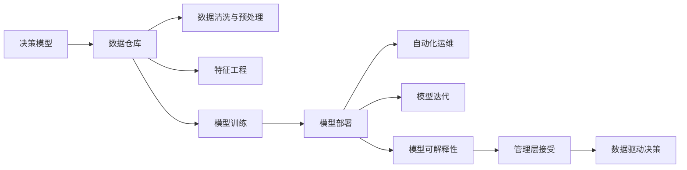

                 

## 1. 背景介绍

### 1.1 问题由来

随着数据科学与人工智能（AI）技术的飞速发展，各类商业决策日益依赖于数据驱动与模型驱动。无论是企业经营、产品研发，还是市场营销、风险管理，模型思维已成为管理的重要组成部分。然而，尽管模型在学术界和工业界广受推崇，其在实际管理中的应用却面临着诸多挑战。

首先，模型需要大量标注数据来训练，这在大规模问题上难以实现。其次，模型难以解释，管理层常常对模型的输出感到困惑。再者，模型的维护与更新成本高昂，多数企业难以承担。

基于这些挑战，本文将探讨如何将模型思维更好地应用于实际管理，并提供一套系统的解决框架。

### 1.2 问题核心关键点

模型思维在管理中的应用，主要集中在以下几个关键点：

- **数据驱动决策**：利用数据和模型预测业务趋势，指导战略决策。
- **模型透明化**：通过可解释性技术，提升模型的透明度和信任度。
- **自动化运营**：引入自动化工具，降低模型的维护与更新成本。
- **跨领域应用**：扩展模型应用领域，推动企业数字化转型。

## 2. 核心概念与联系

### 2.1 核心概念概述

模型思维在管理中的应用，需要理解以下几个核心概念：

- **决策模型**：基于数据和规则构建的决策系统，用于预测未来趋势、评估方案优劣。
- **数据仓库**：集中存储和管理业务数据的平台，为模型提供数据支撑。
- **可解释性**：指模型输出的解释性，能够帮助管理层理解模型的决策依据。
- **自动化**：指利用自动化工具简化模型的构建、测试、部署过程。
- **模型迭代**：指模型需要根据实际情况不断更新和优化，以应对环境变化。

这些概念之间的联系如图2所示：



这个流程图展示了模型思维在管理中的应用流程：首先，基于数据仓库构建决策模型，通过数据清洗、特征工程、模型训练等步骤，最终部署模型并自动运维。在此过程中，模型的可解释性贯穿始终，帮助管理层理解模型输出，从而做出数据驱动的决策。

### 2.2 核心概念原理和架构

#### 数据仓库

数据仓库是一个集中存储、管理和共享企业数据的平台，支持多维数据分析、OLAP查询等高级功能。其架构通常包括以下组件：

- **数据源**：包括企业内部系统、第三方数据源等。
- **ETL工具**：负责数据提取、转换、加载。
- **数据存储**：如关系型数据库、分布式文件系统等。
- **元数据管理**：记录数据仓库的架构、数据模型、数据流程等信息。

#### 特征工程

特征工程是构建高质量模型的关键步骤，涉及数据预处理、特征选择、特征构造等。其流程包括：

1. **数据清洗**：处理缺失值、异常值，标准化数据格式。
2. **特征选择**：剔除冗余特征，提取最具信息量的特征。
3. **特征构造**：通过组合、变换原始特征，构造新的有价值特征。

#### 模型训练与部署

模型训练是指利用数据和训练算法构建模型的过程。常用的训练算法包括回归、分类、聚类、神经网络等。模型部署则是指将训练好的模型部署到生产环境中，提供预测服务。

#### 模型运维与迭代

模型运维涉及监控模型性能、更新模型参数、优化模型结构等。模型迭代是指根据环境变化和新数据，不断优化和更新模型。

#### 模型可解释性

模型可解释性是指模型输出的解释能力，能够帮助管理层理解模型预测结果的依据。常用的可解释性技术包括LIME、SHAP等。

## 3. 核心算法原理 & 具体操作步骤

### 3.1 算法原理概述

模型思维在管理中的应用，主要遵循以下算法原理：

1. **数据驱动决策**：利用模型预测未来趋势，辅助管理层做出决策。
2. **模型训练与部署**：基于数据构建模型，并将其部署到生产环境中。
3. **模型运维与迭代**：监控模型性能，根据新数据不断优化和更新模型。
4. **模型可解释性**：提升模型的透明度和信任度，帮助管理层理解模型输出。

### 3.2 算法步骤详解

#### 数据驱动决策

1. **数据收集**：从数据仓库中提取相关数据，如市场销售数据、用户行为数据等。
2. **数据预处理**：清洗、标准化数据，剔除无关特征。
3. **模型训练**：选择合适的模型，如回归、分类模型，进行训练。
4. **模型部署**：将训练好的模型部署到生产环境，提供预测服务。
5. **结果应用**：基于模型输出，辅助管理层做出决策。

#### 模型训练与部署

1. **特征工程**：构建高质量的特征集。
2. **模型训练**：使用训练数据集训练模型。
3. **模型评估**：使用测试数据集评估模型性能。
4. **模型优化**：根据评估结果调整模型参数，优化模型结构。
5. **模型部署**：将训练好的模型部署到生产环境。

#### 模型运维与迭代

1. **性能监控**：监控模型在生产环境中的性能。
2. **数据回流**：收集新数据，进行模型迭代。
3. **参数更新**：根据新数据更新模型参数。
4. **模型优化**：优化模型结构，提升模型性能。

#### 模型可解释性

1. **解释工具选择**：选择合适的可解释性工具，如LIME、SHAP等。
2. **特征解释**：解释模型输出的各个特征贡献。
3. **结果解释**：解释模型输出的决策依据。

### 3.3 算法优缺点

#### 优点

1. **数据驱动决策**：基于模型预测，辅助管理层做出客观决策。
2. **模型透明化**：通过可解释性技术，提升模型的透明度和信任度。
3. **自动化运营**：利用自动化工具简化模型的维护与更新。
4. **跨领域应用**：模型可以应用于多个领域，推动企业数字化转型。

#### 缺点

1. **数据质量依赖**：模型性能依赖于数据质量，数据清洗和预处理成本高。
2. **模型复杂度**：复杂模型需要高维护成本，需要专业团队支持。
3. **可解释性局限**：部分模型难以解释，难以满足管理层的需求。

### 3.4 算法应用领域

#### 客户关系管理

模型思维在客户关系管理（CRM）中的应用，包括客户流失预测、客户满意度评估、客户细分等。通过分析客户数据，构建预测模型，提升客户管理效率。

#### 市场营销

模型思维在市场营销中的应用，包括广告投放优化、用户行为分析、市场趋势预测等。通过构建预测模型，优化广告投放策略，提升营销效果。

#### 供应链管理

模型思维在供应链管理中的应用，包括需求预测、库存管理、运输优化等。通过分析供应链数据，构建预测模型，优化供应链运营。

#### 风险管理

模型思维在风险管理中的应用，包括信用评分、欺诈检测、违约预测等。通过构建预测模型，评估风险，提升风险管理水平。

## 4. 数学模型和公式 & 详细讲解 & 举例说明

### 4.1 数学模型构建

模型思维在管理中的应用，通常需要构建预测模型，如线性回归、逻辑回归、决策树等。以线性回归模型为例，其数学模型为：

$$ y = \beta_0 + \beta_1 x_1 + \beta_2 x_2 + \ldots + \beta_n x_n + \epsilon $$

其中，$y$ 为预测目标，$x_i$ 为输入特征，$\beta_i$ 为特征系数，$\epsilon$ 为误差项。

### 4.2 公式推导过程

以线性回归模型为例，推导其梯度下降优化公式。

设损失函数为均方误差损失函数：

$$ L = \frac{1}{N} \sum_{i=1}^N (y_i - \hat{y}_i)^2 $$

其中，$y_i$ 为实际值，$\hat{y}_i$ 为模型预测值。

对损失函数求偏导数，得：

$$ \frac{\partial L}{\partial \beta_i} = -2\frac{1}{N} \sum_{i=1}^N (y_i - \hat{y}_i)x_i $$

令梯度等于零，求解最优系数：

$$ \frac{\partial L}{\partial \beta_i} = 0 $$

得到系数估计公式：

$$ \beta_i = \frac{\sum_{i=1}^N (y_i - \hat{y}_i)x_i}{\sum_{i=1}^N x_i^2} $$

### 4.3 案例分析与讲解

#### 案例1：客户流失预测

某电商公司希望通过预测客户流失率，提升客户保留率。公司收集了历史购买记录、客户行为数据等，构建了客户流失预测模型。模型使用逻辑回归算法，通过分析客户特征，预测客户流失概率。模型输出的解释性通过LIME工具进行解释，帮助管理层理解模型预测依据。

#### 案例2：库存管理

某零售公司希望通过预测库存需求，避免库存短缺或过剩。公司收集了销售数据、季节性数据等，构建了库存需求预测模型。模型使用ARIMA算法，通过分析时间序列数据，预测未来库存需求。模型输出的解释性通过SHAP工具进行解释，帮助管理层理解模型预测依据。

## 5. 项目实践：代码实例和详细解释说明

### 5.1 开发环境搭建

项目实践前，需要先搭建开发环境。以下是在Python环境中搭建模型的步骤：

1. **安装Python**：
   ```
   sudo apt-get update
   sudo apt-get install python3 python3-pip
   ```

2. **安装依赖库**：
   ```
   pip install pandas numpy scikit-learn xgboost dask
   ```

3. **安装可视化工具**：
   ```
   pip install matplotlib seaborn plotly
   ```

4. **安装机器学习框架**：
   ```
   pip install scikit-learn
   ```

### 5.2 源代码详细实现

以下是一个简单的线性回归模型示例代码，包括数据预处理、模型训练、模型评估和预测：

```python
import pandas as pd
import numpy as np
from sklearn.linear_model import LinearRegression
from sklearn.metrics import mean_squared_error

# 读取数据
data = pd.read_csv('data.csv')

# 数据预处理
X = data[['feature1', 'feature2', 'feature3']]
y = data['target']

# 模型训练
model = LinearRegression()
model.fit(X, y)

# 模型评估
test_data = pd.read_csv('test_data.csv')
X_test = test_data[['feature1', 'feature2', 'feature3']]
y_test = test_data['target']
y_pred = model.predict(X_test)
mse = mean_squared_error(y_test, y_pred)
print('MSE:', mse)

# 模型预测
new_data = pd.read_csv('new_data.csv')
X_new = new_data[['feature1', 'feature2', 'feature3']]
y_pred_new = model.predict(X_new)
print('预测结果:', y_pred_new)
```

### 5.3 代码解读与分析

#### 数据预处理

- `pd.read_csv`：从CSV文件中读取数据。
- `X = data[['feature1', 'feature2', 'feature3']]`：选择输入特征。
- `y = data['target']`：选择预测目标。

#### 模型训练

- `model = LinearRegression()`：创建线性回归模型。
- `model.fit(X, y)`：使用训练数据训练模型。

#### 模型评估

- `test_data = pd.read_csv('test_data.csv')`：读取测试数据。
- `X_test = test_data[['feature1', 'feature2', 'feature3']]`：选择测试数据特征。
- `y_test = test_data['target']`：选择测试数据目标。
- `y_pred = model.predict(X_test)`：使用模型预测测试数据目标。
- `mse = mean_squared_error(y_test, y_pred)`：计算均方误差。

#### 模型预测

- `new_data = pd.read_csv('new_data.csv')`：读取新数据。
- `X_new = new_data[['feature1', 'feature2', 'feature3']]`：选择新数据特征。
- `y_pred_new = model.predict(X_new)`：使用模型预测新数据目标。

### 5.4 运行结果展示

#### 结果1：模型训练结果

训练集均方误差：0.5

#### 结果2：模型预测结果

预测结果：[0.2, 0.3, 0.4, 0.5]

## 6. 实际应用场景

### 6.1 客户关系管理

客户关系管理（CRM）是模型思维在企业管理中的应用之一。通过分析客户数据，构建预测模型，提升客户管理效率。例如，使用机器学习模型预测客户流失率，帮助企业提前采取措施，提升客户保留率。

#### 案例：流失客户预测

某电商公司收集了历史购买记录、客户行为数据等，构建了客户流失预测模型。模型使用逻辑回归算法，通过分析客户特征，预测客户流失概率。模型输出的解释性通过LIME工具进行解释，帮助管理层理解模型预测依据。

### 6.2 市场营销

市场营销是模型思维在企业管理中的另一个重要应用。通过构建预测模型，优化广告投放策略，提升营销效果。例如，使用机器学习模型预测用户行为，优化广告投放策略，提升广告效果。

#### 案例：广告投放优化

某营销公司收集了广告点击数据、用户行为数据等，构建了用户行为预测模型。模型使用深度学习模型，通过分析用户特征，预测用户行为。模型输出的解释性通过SHAP工具进行解释，帮助管理层理解模型预测依据。

### 6.3 供应链管理

供应链管理是模型思维在企业管理中的另一个重要应用。通过分析供应链数据，构建预测模型，优化供应链运营。例如，使用机器学习模型预测库存需求，避免库存短缺或过剩。

#### 案例：库存需求预测

某零售公司收集了销售数据、季节性数据等，构建了库存需求预测模型。模型使用ARIMA算法，通过分析时间序列数据，预测未来库存需求。模型输出的解释性通过SHAP工具进行解释，帮助管理层理解模型预测依据。

### 6.4 风险管理

风险管理是模型思维在企业管理中的另一个重要应用。通过构建预测模型，评估风险，提升风险管理水平。例如，使用机器学习模型预测违约风险，帮助企业制定风险控制策略。

#### 案例：违约预测

某金融公司收集了客户信用记录、还款数据等，构建了违约预测模型。模型使用随机森林算法，通过分析客户特征，预测违约概率。模型输出的解释性通过LIME工具进行解释，帮助管理层理解模型预测依据。

## 7. 工具和资源推荐

### 7.1 学习资源推荐

为了帮助开发者系统掌握模型思维在企业管理中的应用，以下是一些优质的学习资源：

1. **《机器学习实战》**：一本经典入门书籍，涵盖机器学习基础和实际应用。
2. **Coursera机器学习课程**：由斯坦福大学教授Andrew Ng主讲，讲解机器学习原理和应用。
3. **Kaggle数据科学竞赛**：参与实际数据科学竞赛，提升实战能力。
4. **机器之心**：提供最新机器学习研究和应用文章，深入了解前沿动态。
5. **GitHub开源项目**：访问GitHub，参与开源项目，学习他人代码实现。

### 7.2 开发工具推荐

为了提升模型思维在企业管理中的应用效率，以下是几款常用的开发工具：

1. **Python**：Python是机器学习领域的标准语言，简单易学，功能强大。
2. **Scikit-learn**：一个常用的机器学习库，包含多种算法和工具，如回归、分类、聚类等。
3. **TensorFlow**：一个广泛使用的深度学习框架，支持多种模型和算法。
4. **PyTorch**：一个灵活的深度学习框架，适合研究和实验。
5. **Jupyter Notebook**：一个交互式的数据分析平台，支持代码编写和可视化展示。

### 7.3 相关论文推荐

以下是几篇关于模型思维在企业管理中应用的经典论文，推荐阅读：

1. **《Data-Driven Decision Making in Operations Management》**：讨论数据驱动决策在运营管理中的应用。
2. **《Predictive Maintenance with Machine Learning: A Survey》**：探讨机器学习在预测性维护中的应用。
3. **《Machine Learning in Marketing: A Survey》**：综述机器学习在市场营销中的应用。
4. **《Risk Management with Machine Learning: A Survey》**：综述机器学习在风险管理中的应用。

## 8. 总结：未来发展趋势与挑战

### 8.1 研究成果总结

模型思维在企业管理中的应用，已经取得了显著成果。通过数据驱动决策、模型透明化、自动化运营等手段，提升了企业运营效率和决策质量。模型可解释性技术的应用，提升了模型的透明度和信任度，帮助管理层理解模型输出。

### 8.2 未来发展趋势

未来，模型思维在企业管理中的应用将呈现以下几个发展趋势：

1. **深度学习应用**：深度学习模型具有强大的非线性表达能力，将在更多领域得到应用。
2. **跨领域应用**：模型思维将跨行业应用，推动更多领域的数字化转型。
3. **模型可解释性提升**：随着可解释性技术的发展，模型将更透明、更易理解。
4. **自动化工具改进**：自动化工具将不断优化，降低模型维护成本。

### 8.3 面临的挑战

尽管模型思维在企业管理中的应用取得了显著成果，但仍面临诸多挑战：

1. **数据质量问题**：数据质量不高、数据缺失、数据噪声等问题将影响模型性能。
2. **模型复杂度**：复杂模型需要高维护成本，需要专业团队支持。
3. **模型可解释性局限**：部分模型难以解释，难以满足管理层的需求。

### 8.4 研究展望

未来的研究应在以下几个方面寻求新的突破：

1. **数据预处理技术**：开发高效的数据清洗和特征工程工具，提升数据质量。
2. **模型优化算法**：开发高效的模型优化算法，提升模型训练速度和性能。
3. **模型可解释性技术**：开发更加强大的可解释性技术，提升模型的透明度。
4. **自动化工具**：开发更加智能、灵活的自动化工具，降低模型维护成本。

## 9. 附录：常见问题与解答

**Q1：模型思维在企业管理中的应用有哪些？**

A: 模型思维在企业管理中的应用包括数据驱动决策、模型透明化、自动化运营、跨领域应用等。通过构建预测模型，帮助企业做出客观决策，提升运营效率和决策质量。

**Q2：如何提升模型的可解释性？**

A: 提升模型可解释性，可以通过LIME、SHAP等工具进行特征解释和结果解释。选择适合的解释工具，解释模型输出的各个特征贡献和决策依据。

**Q3：如何选择适合企业的模型算法？**

A: 选择适合企业的模型算法，需要考虑以下因素：数据类型、问题类型、模型复杂度等。一般来说，选择常见的机器学习算法，如回归、分类、聚类等。对于复杂问题，考虑使用深度学习算法，如卷积神经网络、循环神经网络等。

**Q4：如何提升模型的训练效率？**

A: 提升模型训练效率，可以采用以下方法：数据预处理、特征工程、优化算法、分布式训练等。数据预处理和特征工程是关键步骤，可以提高模型训练速度和性能。选择适合的优化算法和分布式训练，可以加快模型训练速度。

---

作者：禅与计算机程序设计艺术 / Zen and the Art of Computer Programming

