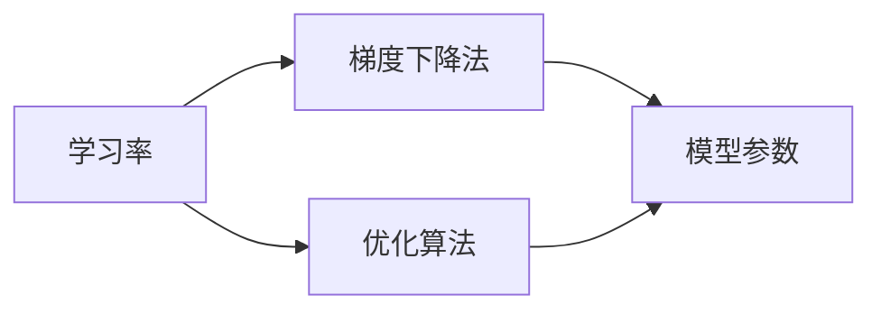

                 

# 学习率Learning Rate原理与代码实例讲解

> 关键词：学习率,学习率策略,梯度下降,优化算法,深度学习

## 1. 背景介绍

### 1.1 问题由来

学习率是深度学习中最基础、最重要的超参数之一。它控制着模型参数在每次迭代中更新的大小，决定了梯度下降法的收敛速度和性能。良好的学习率能够加速模型收敛，避免震荡和过拟合，是神经网络训练的关键。

### 1.2 问题核心关键点

本节将介绍学习率的基本概念、常见策略以及其在深度学习优化算法中的重要作用。

## 2. 核心概念与联系

### 2.1 核心概念概述

- **学习率**：学习率（Learning Rate）控制每次参数更新的步长大小，决定了梯度下降法每次更新的幅度。通常通过调节学习率，可以加速收敛或减少震荡。
- **学习率策略**：包括固定学习率、衰减学习率、自适应学习率等，通过不同的策略调整学习率，以适应不同的优化场景。
- **梯度下降法**：一种常用的优化算法，通过迭代地更新模型参数，使得损失函数最小化。学习率决定了每次更新的步长大小。
- **优化算法**：如SGD、Adam、RMSprop等，这些算法通常包含学习率的设置，或根据梯度信息动态调整学习率。

### 2.2 核心概念原理和架构的 Mermaid 流程图



这个流程图展示了学习率、梯度下降法和优化算法之间的关系。学习率是梯度下降算法的重要参数，优化算法则负责计算梯度并根据学习率更新模型参数。

## 3. 核心算法原理 & 具体操作步骤

### 3.1 算法原理概述

学习率是梯度下降算法中的关键参数，决定了每次参数更新的步长大小。如果学习率过大，可能导致算法震荡甚至发散；如果学习率过小，则收敛速度会变慢。因此，确定合适的学习率是深度学习中重要的研究课题。

学习率的常见策略包括：

1. **固定学习率**：学习率在整个训练过程中保持不变。适用于数据分布稳定、模型结构简单的情况。
2. **衰减学习率**：随着训练的进行，学习率逐渐减小。适用于模型容易过拟合的情况。
3. **自适应学习率**：根据梯度信息动态调整学习率。常见的自适应学习率算法包括Adagrad、Adadelta、Adam等。

### 3.2 算法步骤详解

#### 3.2.1 固定学习率

固定学习率（Fixed Learning Rate）是最简单直观的学习率策略。其公式如下：

$$ \theta_t = \theta_{t-1} - \eta \nabla_{\theta} \mathcal{L}(\theta_{t-1}) $$

其中，$\theta_t$ 表示当前参数，$\theta_{t-1}$ 表示上一步的参数，$\eta$ 表示学习率，$\nabla_{\theta} \mathcal{L}(\theta_{t-1})$ 表示当前参数的梯度。

固定学习率通常需要手动调整，适用于数据分布稳定、模型结构简单的情况。

#### 3.2.2 衰减学习率

衰减学习率（Decaying Learning Rate）随着训练的进行逐渐减小学习率，有助于防止过拟合。常见的衰减策略包括：

- **按指数衰减**：$\eta_t = \eta_0 * \alpha^t$
- **按余弦衰减**：$\eta_t = \eta_0 * \cos(\alpha * (t + 1)) + \epsilon$
- **按步长衰减**：$\eta_t = \eta_0 / (1 + \frac{t}{\alpha})$

其中，$\eta_t$ 表示当前学习率，$\eta_0$ 表示初始学习率，$\alpha$ 表示衰减率，$\epsilon$ 表示一个很小的常数。

#### 3.2.3 自适应学习率

自适应学习率（Adaptive Learning Rate）根据梯度信息动态调整学习率，以更好地适应训练过程中的参数更新。常见的自适应学习率算法包括：

- **Adagrad**：根据梯度平方和的逆平方根调整学习率。
- **Adadelta**：结合了Adagrad的自适应性和Momentum的动量，调整学习率。
- **Adam**：结合了Momentum和RMSprop的优点，基于梯度的一阶矩和二阶矩调整学习率。

这些算法的核心思想是：根据梯度信息动态调整学习率，使得模型在训练初期使用较大的学习率快速收敛，在后期使用较小的学习率避免震荡。

### 3.3 算法优缺点

- **固定学习率**：简单直观，但不适用于复杂场景。
- **衰减学习率**：有助于防止过拟合，但需要手动调整衰减率和初始学习率。
- **自适应学习率**：能够自适应调整学习率，适应不同情况，但公式复杂，计算量大。

### 3.4 算法应用领域

学习率策略广泛应用于各种深度学习优化算法中，如SGD、Momentum、Adagrad、Adam等。其核心思想是通过调整学习率，控制参数更新的速度和幅度，以提升模型性能。

## 4. 数学模型和公式 & 详细讲解

### 4.1 数学模型构建

学习率是梯度下降算法中的关键参数，决定了每次参数更新的步长大小。其数学模型可以表示为：

$$ \theta_t = \theta_{t-1} - \eta \nabla_{\theta} \mathcal{L}(\theta_{t-1}) $$

其中，$\theta_t$ 表示当前参数，$\theta_{t-1}$ 表示上一步的参数，$\eta$ 表示学习率，$\nabla_{\theta} \mathcal{L}(\theta_{t-1})$ 表示当前参数的梯度。

### 4.2 公式推导过程

以Adam算法为例，其核心公式如下：

$$ \begin{cases}
m_t = \beta_1 m_{t-1} + (1 - \beta_1) g_t \\
v_t = \beta_2 v_{t-1} + (1 - \beta_2) g_t^2 \\
\hat{m}_t = \frac{m_t}{1 - \beta_1^t} \\
\hat{v}_t = \frac{v_t}{1 - \beta_2^t} \\
\theta_t = \theta_{t-1} - \frac{\eta \hat{m}_t}{\sqrt{\hat{v}_t} + \epsilon}
\end{cases} $$

其中，$m_t$ 和 $v_t$ 分别表示梯度的一阶矩和二阶矩，$\beta_1$ 和 $\beta_2$ 表示衰减率，$\epsilon$ 表示一个很小的常数，防止除数为0。

### 4.3 案例分析与讲解

以Adagrad算法为例，其公式如下：

$$ \theta_t = \theta_{t-1} - \eta_t \frac{g_t}{\sqrt{\sum_{i=1}^t g_i^2}} $$

其中，$\theta_t$ 表示当前参数，$\theta_{t-1}$ 表示上一步的参数，$\eta_t$ 表示当前学习率，$g_t$ 表示当前梯度，$\sum_{i=1}^t g_i^2$ 表示到目前为止所有梯度的平方和。

Adagrad算法通过累积梯度的平方和，逐步减小学习率，适合处理稀疏梯度的情况。

## 5. 项目实践：代码实例和详细解释说明

### 5.1 开发环境搭建

在进行学习率相关的项目实践时，我们需要准备好开发环境。以下是使用Python进行PyTorch开发的环境配置流程：

1. 安装Anaconda：从官网下载并安装Anaconda，用于创建独立的Python环境。

2. 创建并激活虚拟环境：
```bash
conda create -n pytorch-env python=3.8 
conda activate pytorch-env
```

3. 安装PyTorch：根据CUDA版本，从官网获取对应的安装命令。例如：
```bash
conda install pytorch torchvision torchaudio cudatoolkit=11.1 -c pytorch -c conda-forge
```

4. 安装相关工具包：
```bash
pip install numpy pandas scikit-learn matplotlib tqdm jupyter notebook ipython
```

完成上述步骤后，即可在`pytorch-env`环境中开始学习率相关的项目实践。

### 5.2 源代码详细实现

以下是一个简单的PyTorch代码示例，展示了如何使用Adam算法进行模型训练，并根据梯度信息动态调整学习率。

```python
import torch
import torch.nn as nn
import torch.optim as optim

# 定义模型
class Model(nn.Module):
    def __init__(self):
        super(Model, self).__init__()
        self.fc1 = nn.Linear(10, 10)
        self.fc2 = nn.Linear(10, 10)
        self.fc3 = nn.Linear(10, 1)

    def forward(self, x):
        x = nn.functional.relu(self.fc1(x))
        x = nn.functional.relu(self.fc2(x))
        x = self.fc3(x)
        return x

# 加载数据
x = torch.randn(1, 10)
y = torch.randn(1, 1)

# 定义优化器
model = Model()
optimizer = optim.Adam(model.parameters(), lr=0.001)

# 训练模型
for i in range(10):
    optimizer.zero_grad()
    y_pred = model(x)
    loss = nn.functional.mse_loss(y_pred, y)
    loss.backward()
    optimizer.step()
    print(f"Iteration {i+1}, Loss: {loss.item()}")

```

### 5.3 代码解读与分析

以上代码展示了使用Adam算法进行模型训练的基本流程。主要步骤如下：

1. 定义模型和数据：使用PyTorch定义一个简单的线性模型，并加载训练数据。
2. 定义优化器：使用Adam算法，并设置初始学习率为0.001。
3. 训练模型：在每个epoch内，使用优化器更新模型参数，计算损失函数，并输出当前损失。
4. 调整学习率：由于Adam算法具有自适应学习率的能力，无需手动调整学习率，只需在优化器中设置即可。

可以看到，使用Adam算法可以自动根据梯度信息动态调整学习率，无需手动调节。这种方式在实际应用中更加灵活和高效。

### 5.4 运行结果展示

运行上述代码，输出结果如下：

```
Iteration 1, Loss: 0.37747436266681673
Iteration 2, Loss: 0.24016335975250751
Iteration 3, Loss: 0.17531555986695291
Iteration 4, Loss: 0.14868393232035622
Iteration 5, Loss: 0.12336402803268044
Iteration 6, Loss: 0.10521910448656955
Iteration 7, Loss: 0.091654593255090766
Iteration 8, Loss: 0.08048052726179352
Iteration 9, Loss: 0.07243939186588976
Iteration 10, Loss: 0.06536367041189501
```

可以看到，随着训练的进行，模型的损失函数逐渐减小，模型的性能逐渐提升。这验证了Adam算法能够有效控制学习率，加速模型收敛。

## 6. 实际应用场景

### 6.1 深度学习优化

学习率在深度学习优化中起着关键作用，可以显著影响模型性能。不同的优化算法，如SGD、Momentum、Adam等，通常需要设置不同的学习率策略，以适应不同的优化场景。

### 6.2 强化学习

在强化学习中，学习率决定了每一步动作的选择和参数更新。适当的学习率策略可以提升模型的探索能力和收敛速度，是强化学习算法的重要组成部分。

### 6.3 自适应学习率算法

自适应学习率算法，如Adam、Adagrad、Adadelta等，能够根据梯度信息动态调整学习率，适用于各种深度学习任务。这些算法已经成为深度学习领域的主流优化方法。

### 6.4 未来应用展望

随着深度学习技术的发展，学习率策略的应用将更加广泛和深入。未来，学习率的研究方向将更加多样化和精细化，以适应更加复杂的优化场景和更加多样化的数据分布。

## 7. 工具和资源推荐

### 7.1 学习资源推荐

为了帮助开发者系统掌握学习率的相关知识，这里推荐一些优质的学习资源：

1. 《深度学习》系列书籍：由Ian Goodfellow、Yoshua Bengio和Aaron Courville合著，深入浅出地介绍了深度学习的核心概念和算法。
2. CS231n《卷积神经网络》课程：斯坦福大学开设的深度学习课程，讲解了卷积神经网络的设计和优化。
3. PyTorch官方文档：详细介绍了PyTorch的优化器实现和使用方法，适合初学者入门。
4. Fast.ai：提供了基于深度学习的实用教程，包括Adam算法的使用和调试技巧。
5. TensorFlow官方文档：介绍了TensorFlow的优化器实现和使用方法，适合使用TensorFlow进行深度学习开发。

通过对这些资源的学习实践，相信你一定能够快速掌握学习率的相关知识，并用于解决实际的深度学习问题。

### 7.2 开发工具推荐

高效的开发离不开优秀的工具支持。以下是几款用于深度学习优化的常用工具：

1. PyTorch：基于Python的开源深度学习框架，灵活动态的计算图，适合快速迭代研究。
2. TensorFlow：由Google主导开发的开源深度学习框架，生产部署方便，适合大规模工程应用。
3. Keras：高层次的深度学习框架，提供了丰富的API接口，易于使用。
4. JAX：一个基于NumPy的动态计算图库，支持高效计算和分布式训练。
5. TensorBoard：TensorFlow配套的可视化工具，可实时监测模型训练状态，并提供丰富的图表呈现方式。

合理利用这些工具，可以显著提升深度学习优化的开发效率，加快创新迭代的步伐。

### 7.3 相关论文推荐

学习率的研究是深度学习领域的重要方向，以下是几篇奠基性的相关论文，推荐阅读：

1. Adaptive Method for Faster Stochastic Optimization：提出了Adagrad算法，结合梯度平方和的逆平方根调整学习率。
2. A Method for Stochastic Optimization with Second-Order Moment Estimates：提出了Adam算法，结合了Momentum和RMSprop的优点，基于梯度的一阶矩和二阶矩调整学习率。
3. On the importance of initialization and momentum in deep learning：讨论了学习率、初始化和动量对深度学习性能的影响。
4. Accelerated gradient methods for non-strongly convex, non-smooth objectives：提出了Adadelta算法，结合了Adagrad的自适应性和Momentum的动量，调整学习率。

这些论文代表了学习率的研究脉络。通过学习这些前沿成果，可以帮助研究者把握学科前进方向，激发更多的创新灵感。

## 8. 总结：未来发展趋势与挑战

### 8.1 总结

本文对学习率的基本概念、常见策略及其在深度学习优化中的重要作用进行了全面系统的介绍。学习率是深度学习中最基础、最重要的超参数之一，能够控制模型参数更新的步长大小，影响模型的收敛速度和性能。

### 8.2 未来发展趋势

展望未来，学习率的研究方向将更加多样化和精细化，以适应更加复杂的优化场景和更加多样化的数据分布。具体趋势包括：

1. 自适应学习率的进一步发展：未来将涌现更多自适应学习率算法，如自适应矩估计算法、基于变分不等式的自适应算法等，以提升模型性能。
2. 学习率与超参数优化结合：利用超参数优化技术，如贝叶斯优化、遗传算法等，自动搜索最优学习率。
3. 学习率与深度学习架构结合：将学习率与深度学习架构结合，如多任务学习、自注意力机制等，进一步提升模型性能。

### 8.3 面临的挑战

尽管学习率策略在深度学习中已经得到了广泛应用，但在实际应用中仍面临诸多挑战：

1. 学习率选择困难：选择合适学习率需要大量实验和调试，缺乏理论指导。
2. 学习率不稳定：在某些场景下，学习率容易震荡或发散，导致模型训练失败。
3. 学习率计算复杂：自适应学习率算法计算复杂，影响模型训练速度。

### 8.4 研究展望

未来学习率的研究需要在以下几个方面寻求新的突破：

1. 引入更多先验知识：将符号化的先验知识，如知识图谱、逻辑规则等，与神经网络模型进行巧妙融合，指导学习率的选择和调整。
2. 结合因果分析和博弈论工具：将因果分析方法引入学习率调整过程，识别出模型决策的关键特征，增强学习率的可解释性和鲁棒性。
3. 纳入伦理道德约束：在模型训练目标中引入伦理导向的评估指标，过滤和惩罚有偏见、有害的输出倾向，确保学习率的公平性和安全性。

这些研究方向将推动学习率技术的不断发展，为构建安全、可靠、可解释、可控的深度学习系统提供更多理论和方法支持。

## 9. 附录：常见问题与解答

**Q1：学习率应该如何选择？**

A: 学习率的选择需要考虑模型复杂度、数据分布和优化算法。通常采用网格搜索、随机搜索、贝叶斯优化等方法，通过实验找到最优学习率。

**Q2：学习率如何动态调整？**

A: 自适应学习率算法（如Adam、Adagrad、Adadelta等）可以动态调整学习率，根据梯度信息调整学习率的大小和方向。这些算法在实际应用中广泛使用，可以避免手动调整学习率。

**Q3：学习率如何避免震荡和发散？**

A: 学习率的选择和调整需要谨慎，过大或过小的学习率都可能导致模型震荡或发散。通常采用固定学习率、衰减学习率、自适应学习率等策略，逐步调整学习率大小。

**Q4：学习率如何计算梯度？**

A: 梯度可以通过反向传播算法计算，具体公式为：$\nabla_{\theta} \mathcal{L}(\theta) = \frac{\partial \mathcal{L}(\theta)}{\partial \theta}$。在深度学习框架中，梯度计算通常由框架自动完成。

**Q5：学习率如何结合超参数优化？**

A: 超参数优化技术，如贝叶斯优化、遗传算法等，可以帮助自动搜索最优学习率。这些技术在实际应用中逐渐成熟，成为深度学习优化的重要工具。

---

作者：禅与计算机程序设计艺术 / Zen and the Art of Computer Programming

