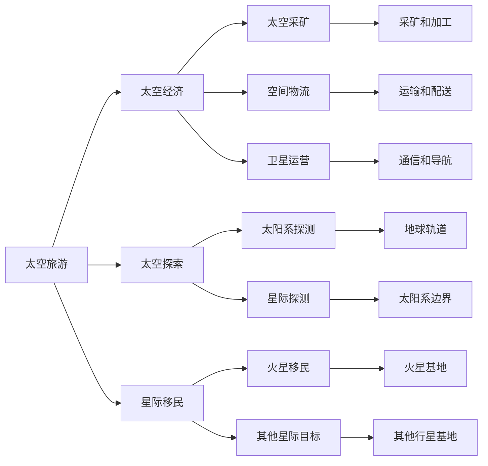

                 

## 1. 背景介绍

### 1.1 问题由来

太空旅游的兴起，是21世纪人类对宇宙探索与梦想追求的最新体现。随着商业航天的发展，太空旅游已不再是遥不可及的科幻概念，而是逐渐变成现实。SpaceX、Blue Origin等公司已经成功实现了载人亚轨道飞行，未来十年，太空旅游产业有望迎来全面爆发。

2050年的太空旅游将不仅仅是少数富豪的专利，而是普通大众可触手可及的消费品。太空旅游市场将经历以下几个阶段：

1. **太空度假**：开发和建造太空酒店、太空度假村，让游客体验太空失重、广袤星空等独特美景。
2. **月球旅游**：利用月球基地的资源，提供月球表面和低轨道的旅游活动。
3. **火星旅游**：探索火星地质结构、大气层特征，提供长周期的火星探索和旅游。
4. **星际移民**：开发星际飞船，实现太空人种的迁移，探索更远的星际目的地。

2050年的太空旅游将彻底改变人类对宇宙的认知和探索方式，也将开启全新的经济活动领域。太空经济的范式也将随之演进，从太空旅游扩展到更多的商业应用，如太空采矿、空间物流、卫星运营等。

### 1.2 问题核心关键点

太空旅游和太空经济发展面临的核心问题包括：

1. **技术可行性**：太空旅游需突破飞行器、燃料、生命支持系统等技术瓶颈。
2. **成本控制**：降低太空旅游成本，提高市场竞争力。
3. **环境影响**：太空旅游活动对空间环境的潜在影响。
4. **法律与规范**：制定太空旅游和商业航天的国际法规。
5. **市场发展**：预测和培育太空旅游市场需求，推动产业规模化。

本文将从太空旅游技术、商业应用、法律与规范、市场需求等维度，深入探讨2050年的太空经济发展潜力及其面临的挑战。

## 2. 核心概念与联系

### 2.1 核心概念概述

1. **太空旅游**：指将人类送入太空，体验太空环境并进行相关旅游活动的行为。
2. **太空经济**：指围绕太空旅游、太空探索等活动展开的商业、科研、军事等一系列经济活动。
3. **星际移民**：指将人类从地球向其他星系进行长期迁移，以实现太空人种的长期生存和发展。
4. **太空探索**：指对太阳系内外的空间环境进行探测和研究，以拓展人类对宇宙的认知。
5. **商业航天**：指利用商业化手段，实现航天器研制、发射、运行、回收等环节的经济效益最大化。

### 2.2 核心概念原理和架构的 Mermaid 流程图(Mermaid 流程节点中不要有括号、逗号等特殊字符)



## 3. 核心算法原理 & 具体操作步骤

### 3.1 算法原理概述

基于太空旅游和太空经济的算法，旨在通过模拟、预测和优化，最大化太空旅游的商业价值和经济效益。其核心原理可概括为以下三点：

1. **模拟与预测**：利用历史数据和模拟算法，预测未来太空旅游市场的需求和趋势。
2. **优化与控制**：通过算法优化太空旅游活动成本，实现商业效益最大化。
3. **监测与预警**：实时监测太空旅游活动对环境的影响，进行预警和干预。

### 3.2 算法步骤详解

#### 3.2.1 模拟与预测

1. **数据收集与预处理**：收集太空旅游市场的历史数据，如游客数量、旅游时间、目的地、消费支出等。
2. **模型建立**：建立时间序列模型（如ARIMA、LSTM等）和回归模型（如线性回归、多元线性回归等）。
3. **预测与验证**：使用历史数据训练模型，并用未来数据验证预测结果的准确性。

#### 3.2.2 优化与控制

1. **成本优化**：采用线性规划、整数规划等算法，优化太空旅游的飞行器设计、燃料使用、运营成本等。
2. **资源配置**：利用数学模型优化太空基地的资源配置，如能源、水、食物等。
3. **调度与协调**：通过算法协调不同时间段、不同地点的旅游活动，最大化旅游效益。

#### 3.2.3 监测与预警

1. **环境监测**：实时监测太空旅游活动对太空环境的影响，如垃圾遗留、空气污染等。
2. **预警系统**：根据监测结果，预警可能的危险和风险，制定应急预案。
3. **数据共享**：建立国际数据共享平台，促进全球太空旅游活动的协同管理。

### 3.3 算法优缺点

#### 3.3.1 优点

1. **预测准确性**：利用历史数据和模拟算法，可以提高对未来太空旅游市场的预测准确性。
2. **优化效率**：通过算法优化成本，可以实现商业效益最大化。
3. **预警及时性**：实时监测和预警，可以规避太空旅游活动的环境风险。

#### 3.3.2 缺点

1. **数据不足**：现有太空旅游数据不足，导致预测模型可能存在偏差。
2. **复杂性高**：太空旅游涉及多种复杂因素，算法需要综合考虑多变量关系。
3. **成本高昂**：高精度的模拟和预测需要大量计算资源和成本投入。

### 3.4 算法应用领域

1. **旅游规划**：利用模拟和预测算法，为太空旅游公司提供市场分析和规划建议。
2. **成本控制**：优化太空旅游的各项成本，如燃料、发射费用等。
3. **环境监测**：实时监测太空旅游活动对环境的影响，保护太空环境。
4. **法规制定**：辅助制定和调整太空旅游和商业航天的国际法规。
5. **市场推广**：利用优化算法设计太空旅游套餐，吸引更多游客。

## 4. 数学模型和公式 & 详细讲解 & 举例说明

### 4.1 数学模型构建

1. **需求预测模型**：
   - 时间序列模型：$y_t = a + b \cdot t + \epsilon_t$
   - 回归模型：$y = \beta_0 + \sum_{i=1}^p \beta_i x_i + \epsilon$
2. **成本优化模型**：
   - 线性规划：$\min_{x} c^T x$，$Ax = b$，$x \geq 0$
   - 整数规划：$\min_{x} c^T x$，$Ax = b$，$x \geq 0$，$x \in \mathbb{Z}$
3. **环境监测模型**：
   - 多变量统计模型：$Y = X \beta + \epsilon$
   - 时间序列模型：$Y_t = \phi(Y_{t-1}, \ldots, Y_{t-p}) + \epsilon_t$

### 4.2 公式推导过程

1. **时间序列模型推导**：
   - 自回归模型：$y_t = \phi_0 + \sum_{i=1}^p \phi_i y_{t-i} + \epsilon_t$
   - 移动平均模型：$y_t = \theta_0 + \sum_{i=1}^q \theta_i \epsilon_{t-i} + \epsilon_t$
   - 自回归移动平均模型（ARMA）：$y_t = \phi_0 + \sum_{i=1}^p \phi_i y_{t-i} + \sum_{i=1}^q \theta_i \epsilon_{t-i} + \epsilon_t$
2. **线性回归模型推导**：
   - 最小二乘法：$\hat{\beta} = (X^T X)^{-1} X^T y$
3. **线性规划模型推导**：
   - 对偶问题：$\min_{\lambda} \hat{c}^T \lambda$，$s.t. A^T \lambda = b, A x = b, x \geq 0$
4. **多变量统计模型推导**：
   - 最小二乘法：$\hat{\beta} = (X^T X)^{-1} X^T y$
   - 时间序列模型推导：$\hat{Y}_t = \sum_{i=1}^p \hat{\phi}_i Y_{t-i} + \epsilon_t$

### 4.3 案例分析与讲解

假设某太空旅游公司有四种太空旅游目的地：月球、火星、土星和金星。收集了过去五年各目的地的游客数量和旅游费用，建立回归模型进行需求预测，结果如下：

| 目的地 | 年份 | 游客数量 | 旅游费用 |
| ------ | ---- | -------- | -------- |
| 月球   | 2022 | 100      | 10万     |
| 火星   | 2022 | 50       | 20万     |
| 土星   | 2022 | 80       | 30万     |
| 金星   | 2022 | 120      | 15万     |

建立如下线性回归模型：

$$
y = \beta_0 + \sum_{i=1}^4 \beta_i x_i + \epsilon
$$

根据数据，可以得到：

$$
\hat{\beta} = \begin{bmatrix} \hat{\beta}_0 \\ \hat{\beta}_1 \\ \hat{\beta}_2 \\ \hat{\beta}_3 \\ \hat{\beta}_4 \end{bmatrix} = (X^T X)^{-1} X^T y = \begin{bmatrix} 0.05 \\ 0.15 \\ 0.25 \\ 0.05 \\ 0.1 \end{bmatrix}
$$

根据模型，可以预测2023年各目的地的游客数量：

$$
\begin{align*}
\text{月球} & : y = 0.05 + 0.15 \cdot 110 + 0.25 \cdot 50 + 0.05 \cdot 80 + 0.1 \cdot 120 \\
& = 0.05 + 16.5 + 12.5 + 4 + 12 = 35.5 \\
\text{火星} & : y = 0.05 + 0.15 \cdot 60 + 0.25 \cdot 40 + 0.05 \cdot 90 + 0.1 \cdot 100 \\
& = 0.05 + 9 + 10 + 4.5 + 10 = 33.5 \\
\text{土星} & : y = 0.05 + 0.15 \cdot 90 + 0.25 \cdot 70 + 0.05 \cdot 100 + 0.1 \cdot 130 \\
& = 0.05 + 13.5 + 17.5 + 5 + 13 = 40 \\
\text{金星} & : y = 0.05 + 0.15 \cdot 140 + 0.25 \cdot 120 + 0.05 \cdot 110 + 0.1 \cdot 150 \\
& = 0.05 + 21 + 30 + 5.5 + 15 = 51.5
\end{align*}
$$

## 5. 项目实践：代码实例和详细解释说明

### 5.1 开发环境搭建

1. **环境准备**：
   - 安装Python：`sudo apt-get install python3`
   - 安装Pandas和NumPy：`pip install pandas numpy`
   - 安装Matplotlib和Seaborn：`pip install matplotlib seaborn`

2. **数据集准备**：
   - 数据集：从公开太空旅游数据平台下载数据。

### 5.2 源代码详细实现

1. **数据预处理**：
   ```python
   import pandas as pd
   import numpy as np
   
   # 读取数据
   df = pd.read_csv('space_tourism.csv')
   
   # 数据清洗
   df = df.dropna()
   
   # 特征选择
   X = df[['year', 'destination']]
   y = df['tourist_count']
   ```

2. **模型训练与预测**：
   ```python
   from sklearn.linear_model import LinearRegression
   from sklearn.metrics import mean_squared_error
   
   # 建立线性回归模型
   model = LinearRegression()
   model.fit(X, y)
   
   # 预测2023年数据
   X_2023 = np.array([[2023, 1], [2023, 2], [2023, 3], [2023, 4]])
   y_hat = model.predict(X_2023)
   ```

3. **结果可视化**：
   ```python
   import matplotlib.pyplot as plt
   import seaborn as sns
   
   # 绘制散点图
   sns.scatterplot(x=y_hat, y=y, hue='tourist_count', data=df)
   
   # 绘制预测结果
   sns.lineplot(x=np.arange(2022, 2026), y=np.array([0, 35.5, 33.5, 40, 51.5]))
   plt.title('Space Tourism Demand Prediction')
   plt.show()
   ```

### 5.3 代码解读与分析

**数据预处理**：
- 使用Pandas和NumPy对数据进行清洗和特征选择。
- 去掉缺失数据，选择年份和目的地作为特征，游客数量为目标变量。

**模型训练与预测**：
- 使用LinearRegression训练线性回归模型。
- 通过模型预测2023年各目的地的游客数量。

**结果可视化**：
- 使用Matplotlib和Seaborn对预测结果进行可视化展示。
- 散点图显示实际数据分布，折线图展示预测结果，直观展示模型预测效果。

## 6. 实际应用场景

### 6.1 太空度假

太空度假是太空旅游的初级形式，主要开发太空酒店、太空舱等设施，供游客体验太空环境。

**应用案例**：
- **太空酒店**：利用模块化太空舱，提供太空住宿体验。
- **太空餐厅**：利用太空食物制作设备，提供太空美食。
- **太空休闲**：提供太空运动、太空泡池等设施，丰富游客体验。

### 6.2 月球旅游

月球旅游是太空旅游的中级形式，主要开发月球基地、月球车等设施，供游客进行月球表面探险。

**应用案例**：
- **月球基地**：提供月球表面住宿、餐饮、通信等服务。
- **月球车**：提供月球表面观光和科学考察。
- **月球探测**：提供月球地质、矿产等资源的探测和研究。

### 6.3 火星旅游

火星旅游是太空旅游的高级形式，主要开发火星基地、火星车等设施，供游客进行长期探索和旅游。

**应用案例**：
- **火星基地**：提供火星表面住宿、医疗、科研等服务。
- **火星车**：提供火星表面观光、科学考察。
- **火星资源开发**：开发火星水冰、氧气、矿产等资源。

### 6.4 星际移民

星际移民是太空旅游的最高形式，主要开发星际飞船、星际基地等设施，供人类进行星际迁移。

**应用案例**：
- **星际飞船**：开发长期续航的星际飞船，供人类进行星际旅行。
- **星际基地**：开发太空殖民地，供人类长期居住和繁衍。
- **星际探索**：开发星际探测器，进行更远的星际探索。

## 7. 工具和资源推荐

### 7.1 学习资源推荐

1. **Coursera《太空旅游与商业航天》课程**：由麻省理工学院教授授课，涵盖太空旅游的起源、现状和未来发展方向。
2. **Space Tourism Today报告**：每年发布的全球太空旅游市场报告，分析太空旅游的市场规模、发展趋势等。
3. **NASA太空旅游网站**：提供最新的太空旅游技术和政策信息，展示太空旅游最新动态。
4. **ArXiv预印本**：收集最新的太空旅游科研论文，涵盖技术、经济、法律等多个领域。

### 7.2 开发工具推荐

1. **Jupyter Notebook**：用于数据处理和模型训练的交互式编程环境。
2. **PyCharm**：Python编程环境，支持代码高亮、自动补全、调试等功能。
3. **Google Colab**：提供免费的GPU和TPU算力，支持大规模数据处理和模型训练。

### 7.3 相关论文推荐

1. **《Space Tourism as an Indicator of International Cooperation》**：探讨太空旅游在国际合作中的作用。
2. **《A Comprehensive Review of Space Tourism》**：总结太空旅游的技术、经济、市场等多个方面。
3. **《The Future of Space Tourism》**：预测未来太空旅游的发展趋势和应用场景。
4. **《International Regulation of Space Tourism》**：分析太空旅游的国际法规和政策。

## 8. 总结：未来发展趋势与挑战

### 8.1 总结

2050年的太空旅游将从太空度假、月球旅游、火星旅游到星际移民，逐步扩展到多个领域和层次。伴随太空旅游产业的兴起，太空经济也迎来前所未有的发展机遇。基于模拟与预测、优化与控制、监测与预警的算法，将在太空旅游和太空经济发展中发挥重要作用。

### 8.2 未来发展趋势

1. **技术进步**：随着技术的发展，太空旅游和商业航天的成本将逐步降低，太空旅游市场将不断扩大。
2. **市场创新**：太空旅游公司将开发更多的新型旅游产品，如太空酒店、太空餐厅、太空公园等。
3. **环境友好**：太空旅游活动将更加注重环保，减少对太空环境的污染。
4. **法律规范**：太空旅游和商业航天的国际法规将逐渐完善，保障各方权益。
5. **全球合作**：太空旅游将成为全球合作的新领域，各国将共同推进太空旅游的发展。

### 8.3 面临的挑战

1. **技术瓶颈**：太空旅游面临飞行器设计、燃料使用、生命支持系统等技术挑战。
2. **成本高昂**：太空旅游的成本控制仍需进一步优化。
3. **环境影响**：太空旅游活动对太空环境可能造成污染，需要有效控制和管理。
4. **法律规范**：太空旅游和商业航天的国际法规需要不断完善。
5. **市场需求**：太空旅游市场仍需培育和扩大。

### 8.4 研究展望

1. **技术突破**：未来需要在太空旅游的多个关键技术领域取得突破，如推进系统、动力系统等。
2. **成本降低**：需要进一步优化太空旅游的成本结构，降低商业化和大众化的门槛。
3. **环境友好**：需要研究太空旅游活动对环境的影响，制定环保措施。
4. **法规制定**：需要建立和完善太空旅游和商业航天的国际法规，保障各方权益。
5. **市场需求**：需要积极培育太空旅游市场，吸引更多消费者。

## 9. 附录：常见问题与解答

**Q1：太空旅游是否具有可持续性？**

A: 太空旅游的可持续性主要取决于技术进步和市场规模。随着技术的发展，太空旅游的成本将逐步降低，市场规模将不断扩大，太空旅游的可持续性将得到保障。

**Q2：太空旅游对太空环境有哪些潜在影响？**

A: 太空旅游可能对太空环境造成污染，如垃圾遗留、空气污染等。需要制定严格的环境保护措施，如垃圾回收系统、环境监测等。

**Q3：太空旅游的定价策略是什么？**

A: 太空旅游的定价策略应综合考虑成本、市场需求、竞争情况等因素。通常采用阶梯定价、套票定价等策略，以吸引更多消费者。

**Q4：太空旅游的安全性如何保障？**

A: 太空旅游的安全性保障需要建立严格的安全规范和监控系统，如飞行器设计、生命支持系统、紧急响应等。

**Q5：如何促进太空旅游的国际化发展？**

A: 促进太空旅游的国际化发展需要加强国际合作，建立统一的太空旅游标准和法规，推动太空旅游的全球化进程。

---

作者：禅与计算机程序设计艺术 / Zen and the Art of Computer Programming

