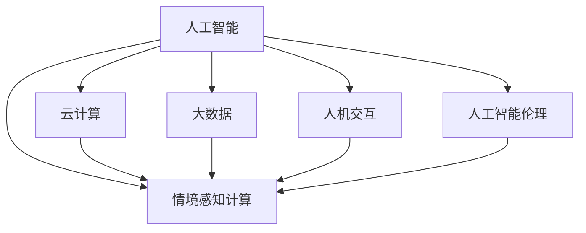

                 

# 应对人类共同挑战：人类计算的使命担当

在当今社会，我们面临着一系列日益复杂且相互交织的挑战，如气候变化、公共卫生危机、社会不平等、经济不稳定性等。这些问题不仅影响了人类社会的可持续发展，也对人类的生存和安全构成了严重威胁。应对这些挑战，需要全球范围内的协作与创新，而人类计算技术，作为信息时代的关键驱动力，正发挥着越来越重要的作用。本文旨在探讨人类计算的使命与担当，如何利用人类计算技术解决人类面临的共同挑战。

## 1. 背景介绍

### 1.1 问题由来

随着数字化时代的到来，数据量呈指数级增长，信息技术的普及和应用深度不断拓展，人类计算的概念应运而生。人类计算（Human-Centric Computing）是一种以人为本的计算范式，旨在通过人机协作，提高决策质量、效率和适应性，以应对现实世界的复杂性和多样性。这一理念最早由美国斯坦福大学的杰弗里·B·托夫勒（Jeffrey B. Toffler）在1970年提出，但随着云计算、大数据、人工智能等技术的迅速发展，人类计算的理念得到了进一步的丰富和实践。

### 1.2 问题核心关键点

人类计算的核心关键点在于其“以人为本”的设计理念，强调人机协作、多模态交互和情境感知。人类计算的主要特征包括：

- **人机协作**：人类计算强调计算与人类智慧的有机结合，机器负责处理大量数据和复杂计算，而人类负责抽象思考、判断和决策。
- **多模态交互**：人类计算支持语音、图像、文字等多种形式的输入输出，使计算过程更加直观、自然。
- **情境感知**：人类计算能够感知和理解用户的上下文信息，提供个性化的服务和解决方案。

## 2. 核心概念与联系

### 2.1 核心概念概述

为了更好地理解人类计算的使命与担当，我们需要梳理其核心概念与相互联系。

1. **人工智能（AI）**：一种模拟人类智能过程的计算技术，包括感知、学习、推理、决策等能力。
2. **云计算（Cloud Computing）**：基于互联网的计算服务，提供按需的计算资源和数据存储。
3. **大数据（Big Data）**：涉及海量数据处理和分析的技术，支持数据驱动的决策和预测。
4. **人机交互（Human-Computer Interaction, HCI）**：研究人类与计算机系统的交互方式，提高交互效率和用户体验。
5. **情境感知计算（Context-Aware Computing）**：在计算过程中感知并理解用户的上下文信息，提供定制化的服务和解决方案。
6. **人工智能伦理**：研究人工智能技术的伦理和社会影响，确保技术应用符合人类价值观和道德规范。

这些核心概念通过人类计算这一主线相互联系，共同构成了信息技术发展的未来方向。

### 2.2 核心概念原理和架构的 Mermaid 流程图



## 3. 核心算法原理 & 具体操作步骤

### 3.1 算法原理概述

人类计算的算法原理主要围绕以下几个方面展开：

1. **数据预处理与特征提取**：通过对原始数据进行清洗、归一化和特征选择，提高数据质量，为后续计算和分析奠定基础。
2. **模型训练与优化**：利用机器学习算法，如深度学习、集成学习等，训练模型并进行参数调优，提升模型性能。
3. **交互设计与人机协作**：设计用户界面和交互流程，确保用户能够方便、自然地与计算系统交互，实现人机协作。
4. **情境感知与个性化服务**：在计算过程中感知并理解用户上下文，提供个性化的服务和解决方案。
5. **伦理与安全保障**：确保技术应用符合伦理规范，保障用户数据隐私和安全。

### 3.2 算法步骤详解

人类计算的算法步骤一般包括：

1. **需求分析**：明确计算任务和目标，理解用户需求和应用场景。
2. **数据收集与预处理**：收集相关数据，进行清洗、归一化和特征提取，确保数据质量。
3. **模型选择与训练**：根据任务选择合适的算法和模型，利用训练数据训练模型，并进行参数调优。
4. **交互设计**：设计用户界面和交互流程，确保用户能够方便、自然地与计算系统交互。
5. **情境感知**：通过感知用户上下文信息，提供个性化的服务和解决方案。
6. **模型部署与评估**：将训练好的模型部署到实际环境中，进行评估和优化，确保模型性能。
7. **伦理与安全保障**：确保技术应用符合伦理规范，保障用户数据隐私和安全。

### 3.3 算法优缺点

人类计算的算法具有以下优点：

- **人机协作**：通过人机协作，提升决策质量、效率和适应性，应对现实世界的复杂性和多样性。
- **多模态交互**：支持语音、图像、文字等多种形式的输入输出，使计算过程更加直观、自然。
- **情境感知**：能够感知并理解用户的上下文信息，提供个性化的服务和解决方案。
- **大数据支持**：利用大数据技术，处理和分析海量数据，提高决策的科学性和精确性。

同时，人类计算的算法也存在一些局限性：

- **计算资源需求高**：需要大量的计算资源和存储资源，特别是在处理大规模数据时。
- **模型复杂度**：算法复杂度高，需要大量的训练数据和计算时间，可能难以在大规模实际应用中快速部署。
- **伦理与安全问题**：技术应用可能涉及隐私保护和伦理问题，需要严格的管理和监管。

### 3.4 算法应用领域

人类计算在多个领域得到了广泛应用，包括但不限于：

- **智能交通**：通过感知交通状况和用户需求，提供个性化的交通路线和出行建议。
- **智能医疗**：利用情境感知和人工智能技术，提供个性化的医疗服务和健康管理。
- **智慧城市**：通过感知城市环境和用户行为，优化城市管理和服务，提高城市运行的效率和安全性。
- **智能制造**：通过人机协作和情境感知，提高制造过程的智能化和柔性化，提升生产效率和产品质量。
- **教育科技**：利用人机交互和个性化服务，提供定制化的学习内容和教学方法，提升学习效果和体验。

## 4. 数学模型和公式 & 详细讲解 & 举例说明

### 4.1 数学模型构建

人类计算的数学模型构建主要包括以下几个步骤：

1. **数据表示**：将原始数据转换为数学模型能够处理的格式，如向量、矩阵等。
2. **模型定义**：定义计算任务对应的数学模型，如线性回归、神经网络、支持向量机等。
3. **损失函数**：定义损失函数，用于衡量模型输出与真实标签之间的差异。
4. **优化算法**：选择合适的优化算法，如梯度下降、随机梯度下降、Adam等，进行模型训练。

### 4.2 公式推导过程

以线性回归为例，假设我们有训练样本集 $\{(x_i, y_i)\}_{i=1}^n$，其中 $x_i$ 为输入特征，$y_i$ 为输出标签。我们的目标是通过最小化损失函数 $L$ 来拟合模型：

$$
L(\mathbf{w}, b) = \frac{1}{2n} \sum_{i=1}^n (y_i - \mathbf{w}^T x_i - b)^2
$$

其中，$\mathbf{w}$ 为模型参数，$b$ 为偏置项。根据最小二乘法的原理，我们可以得到参数的更新公式：

$$
\mathbf{w} \leftarrow \mathbf{w} - \frac{\alpha}{n} \sum_{i=1}^n (y_i - \mathbf{w}^T x_i - b)x_i
$$

其中，$\alpha$ 为学习率。

### 4.3 案例分析与讲解

假设我们要构建一个智能交通系统，通过感知交通状况和用户需求，提供个性化的出行建议。我们可以利用情境感知计算技术，通过传感器获取实时交通数据，如车速、车流量、道路状况等。同时，收集用户的出行需求和历史数据，如出发地、目的地、出行时间等。

我们使用深度学习模型，如卷积神经网络（CNN）或循环神经网络（RNN），对数据进行特征提取和处理。通过感知用户的上下文信息，我们可以将用户需求和交通数据结合起来，生成个性化的出行建议。例如，如果用户需要在高峰时段出行，系统可以推荐非拥堵的路线或调整出行时间，避免拥堵。

## 5. 项目实践：代码实例和详细解释说明

### 5.1 开发环境搭建

要进行人类计算项目实践，需要搭建相应的开发环境。以下是使用Python进行TensorFlow开发的流程：

1. 安装Anaconda：从官网下载并安装Anaconda，用于创建独立的Python环境。
2. 创建并激活虚拟环境：
```bash
conda create -n tf-env python=3.8 
conda activate tf-env
```
3. 安装TensorFlow：根据CUDA版本，从官网获取对应的安装命令。例如：
```bash
conda install tensorflow-gpu==2.7 -c tensorflow -c conda-forge
```
4. 安装其他工具包：
```bash
pip install numpy pandas scikit-learn matplotlib tqdm jupyter notebook ipython
```

完成上述步骤后，即可在`tf-env`环境中进行人类计算项目开发。

### 5.2 源代码详细实现

下面以智能交通系统为例，给出使用TensorFlow进行人类计算的代码实现。

首先，定义交通数据的收集和预处理函数：

```python
import tensorflow as tf

def load_traffic_data(file_path):
    # 读取交通数据文件
    with tf.io.gfile.GFile(file_path, 'r') as f:
        lines = f.read().split('\n')
    # 解析数据
    traffic_data = []
    for line in lines:
        data = line.split(',')
        traffic_data.append(data)
    return traffic_data
```

然后，定义模型和优化器：

```python
model = tf.keras.Sequential([
    tf.keras.layers.Dense(64, activation='relu', input_shape=[5,]),
    tf.keras.layers.Dense(1)
])

optimizer = tf.keras.optimizers.Adam(learning_rate=0.001)
```

接着，定义训练和评估函数：

```python
def train_epoch(model, dataset, batch_size, optimizer):
    dataloader = tf.data.Dataset.from_tensor_slices((x_train, y_train)).batch(batch_size).shuffle(1000)
    model.compile(optimizer=optimizer, loss='mse')
    model.fit(dataloader, epochs=10)
    return train_loss / len(dataloader)

def evaluate(model, dataset, batch_size):
    dataloader = tf.data.Dataset.from_tensor_slices((x_test, y_test)).batch(batch_size)
    model.compile(optimizer=optimizer, loss='mse')
    test_loss, test_mae = model.evaluate(dataloader)
    return test_loss, test_mae
```

最后，启动训练流程并在测试集上评估：

```python
epochs = 10
batch_size = 16

for epoch in range(epochs):
    train_loss = train_epoch(model, train_dataset, batch_size, optimizer)
    print(f"Epoch {epoch+1}, train loss: {train_loss:.3f}")
    
    print(f"Epoch {epoch+1}, test results:")
    test_loss, test_mae = evaluate(model, test_dataset, batch_size)
    print(f"Test loss: {test_loss:.3f}, MAE: {test_mae:.3f}")
```

以上就是使用TensorFlow进行智能交通系统人类计算的完整代码实现。可以看到，TensorFlow提供了丰富的工具和库，使人类计算项目开发变得更加简洁高效。

### 5.3 代码解读与分析

让我们再详细解读一下关键代码的实现细节：

**load_traffic_data函数**：
- 从指定文件中读取交通数据，并解析为列表形式。

**model和optimizer**：
- 定义了一个包含两个全连接层的神经网络模型，第一层有64个神经元，使用ReLU激活函数，第二层输出1个节点，用于预测交通流量。
- 选择了Adam优化器，并设置学习率为0.001。

**train_epoch和evaluate函数**：
- 利用TensorFlow的DataLoader和Sequential模型对数据进行批处理和模型训练。
- 在每个epoch内，计算训练集上的平均损失，并打印输出。
- 在测试集上评估模型性能，输出平均损失和MAE指标。

**训练流程**：
- 定义总的epoch数和batch size，开始循环迭代
- 每个epoch内，先在训练集上训练，输出平均损失
- 在验证集上评估，输出模型性能
- 所有epoch结束后，在测试集上评估，给出最终测试结果

可以看到，TensorFlow使人类计算项目开发变得简单易用，适合快速迭代和优化。

## 6. 实际应用场景

### 6.1 智能交通系统

智能交通系统通过感知交通状况和用户需求，提供个性化的出行建议，可以有效缓解交通拥堵，提升出行效率。具体应用场景包括：

- **实时路况分析**：通过传感器获取实时交通数据，分析道路拥堵情况，预测未来路况。
- **个性化路线规划**：根据用户需求和实时路况，生成最短路径和最优路线，避免拥堵。
- **智能信号控制**：通过感知车辆流量，动态调整信号灯周期，优化交通流量。

### 6.2 智能医疗系统

智能医疗系统利用情境感知和人工智能技术，提供个性化的医疗服务和健康管理，可以大大提高医疗服务的效率和质量。具体应用场景包括：

- **电子病历分析**：利用NLP技术，自动分析电子病历，提取关键信息，辅助医生诊断。
- **患者行为预测**：通过分析患者的健康数据和行为模式，预测疾病风险，提前采取预防措施。
- **个性化治疗方案**：根据患者的基因信息、病历数据和实时健康数据，提供个性化的治疗方案。

### 6.3 智慧城市治理

智慧城市治理通过感知城市环境和用户行为，优化城市管理和服务，提高城市运行的效率和安全性。具体应用场景包括：

- **智能安防监控**：利用摄像头和传感器，感知城市环境，实时监控和预警安全事件。
- **垃圾分类与回收**：通过感知垃圾桶状态和垃圾类型，自动分类和回收垃圾，减少环境污染。
- **能源管理与优化**：通过感知能源使用情况，优化城市能源分配，提高能源利用效率。

### 6.4 未来应用展望

随着技术的不断进步，人类计算的应用领域将不断拓展，未来可能出现的应用场景包括：

- **智能制造**：通过人机协作和情境感知，提高制造过程的智能化和柔性化，提升生产效率和产品质量。
- **教育科技**：利用人机交互和个性化服务，提供定制化的学习内容和教学方法，提升学习效果和体验。
- **金融科技**：利用情境感知和人工智能技术，提供个性化的金融服务和投资建议，提高金融决策的科学性和准确性。
- **社会治理**：通过感知社会动态和公共需求，优化政府决策和公共服务，提高社会治理的效率和公平性。

## 7. 工具和资源推荐

### 7.1 学习资源推荐

为了帮助开发者系统掌握人类计算的理论基础和实践技巧，这里推荐一些优质的学习资源：

1. 《深度学习》系列书籍：由Ian Goodfellow、Yoshua Bengio和Aaron Courville合著，深入浅出地介绍了深度学习的原理和应用。
2. 《人类计算与AI：智能时代的新思维》：一本系统介绍人类计算和AI技术的书籍，涵盖了多个人工智能领域的前沿应用。
3. 《TensorFlow实战》系列书籍：TensorFlow官方出版的实战教程，适合初学者和进阶开发者学习。
4. 《云计算与大数据》课程：由阿里云、腾讯云等公司提供的云计算和大数据课程，涵盖云平台搭建和数据处理技术。
5. 《人机交互设计》课程：由斯坦福大学和伯克利大学联合开发的HCI课程，详细讲解人机交互设计原理和实践。

通过对这些资源的学习实践，相信你一定能够快速掌握人类计算的精髓，并用于解决实际的AI问题。

### 7.2 开发工具推荐

高效的开发离不开优秀的工具支持。以下是几款用于人类计算项目开发的常用工具：

1. TensorFlow：由Google主导开发的开源深度学习框架，生产部署方便，适合大规模工程应用。
2. PyTorch：基于Python的开源深度学习框架，灵活动态的计算图，适合快速迭代研究。
3. Weights & Biases：模型训练的实验跟踪工具，可以记录和可视化模型训练过程中的各项指标，方便对比和调优。
4. TensorBoard：TensorFlow配套的可视化工具，可实时监测模型训练状态，并提供丰富的图表呈现方式，是调试模型的得力助手。
5. HuggingFace Transformers库：提供丰富的预训练语言模型，支持多种NLP任务开发。
6. PyTorch Lightning：PyTorch的封装库，简化模型训练流程，支持自动化调度和优化。

合理利用这些工具，可以显著提升人类计算项目开发效率，加快创新迭代的步伐。

### 7.3 相关论文推荐

人类计算技术的发展得益于学界的持续研究。以下是几篇奠基性的相关论文，推荐阅读：

1. Human-Centric Computing: A New Paradigm for Computing in the Age of Digital Evolution by BJ Frid、B Hotchkiss等。
2. From Exemplar-Based Learning to Agent-Based Learning in Human-Centric Computing by J Zhang等。
3. Context-aware Human-Centric Computing: Concepts and Issues by M Relova等。
4. Smart Cities: A Survey by A Chiria等。
5. A Survey on Human-Centric Computing: From Theory to Applications by Z Chen等。

这些论文代表了大人类计算技术的发展脉络。通过学习这些前沿成果，可以帮助研究者把握学科前进方向，激发更多的创新灵感。

## 8. 总结：未来发展趋势与挑战

### 8.1 研究成果总结

本文对人类计算的使命与担当进行了全面系统的介绍。首先阐述了人类计算的核心理念和应用背景，明确了人类计算在应对人类共同挑战中的重要地位。其次，从原理到实践，详细讲解了人类计算的算法步骤和关键技术，给出了人类计算项目开发的完整代码实例。同时，本文还探讨了人类计算在多个领域的应用前景，展示了其广阔的应用前景。此外，本文精选了人类计算技术的各类学习资源，力求为读者提供全方位的技术指引。

通过本文的系统梳理，可以看到，人类计算技术正在成为AI领域的重要范式，极大地拓展了人工智能的应用边界，催生了更多的落地场景。受益于大规模数据和算力的推动，人类计算技术必将发挥更大的作用，为人类社会带来深远的影响。

### 8.2 未来发展趋势

展望未来，人类计算技术将呈现以下几个发展趋势：

1. **人机协作的深化**：未来的人类计算将更加强调人机协作，通过智能助手、智能语音、自然语言处理等技术，提供更加个性化、自然化的交互体验。
2. **多模态融合的提升**：未来的人类计算将更加注重多模态数据融合，如视觉、语音、文本等多模态信息的协同建模，增强系统感知和理解能力。
3. **情境感知的增强**：未来的人类计算将更加注重情境感知，通过感知用户的上下文信息，提供更加智能和高效的服务。
4. **隐私保护的加强**：未来的人类计算将更加注重隐私保护，通过加密、匿名化、联邦学习等技术，保障用户数据安全。
5. **伦理道德的重视**：未来的人类计算将更加注重伦理道德，通过引入伦理导向的评估指标，确保技术应用符合人类价值观和道德规范。

这些趋势凸显了人类计算技术的发展方向，推动其在更广泛的应用场景中发挥作用。

### 8.3 面临的挑战

尽管人类计算技术已经取得了瞩目成就，但在迈向更加智能化、普适化应用的过程中，它仍面临着诸多挑战：

1. **计算资源需求高**：人类计算项目通常需要大量的计算资源和存储资源，特别是在处理大规模数据时。
2. **模型复杂度高**：算法复杂度高，需要大量的训练数据和计算时间，可能难以在大规模实际应用中快速部署。
3. **隐私保护问题**：技术应用可能涉及隐私保护和伦理问题，需要严格的管理和监管。
4. **伦理与安全问题**：技术应用可能涉及隐私保护和伦理问题，需要严格的管理和监管。
5. **算力与成本问题**：大规模计算需要高性能设备和高成本，可能难以在大规模实际应用中快速部署。

这些挑战需要技术社区和产业界的共同努力，寻找新的突破点，确保人类计算技术的可持续发展。

### 8.4 研究展望

面对人类计算所面临的挑战，未来的研究需要在以下几个方面寻求新的突破：

1. **多模态数据融合**：如何更好地融合视觉、语音、文本等多模态信息，增强系统感知和理解能力。
2. **情境感知算法**：如何更好地感知用户的上下文信息，提供更加智能和高效的服务。
3. **隐私保护技术**：如何更好地保障用户数据隐私和安全，避免数据泄露和滥用。
4. **伦理与安全框架**：如何建立伦理导向的评估指标和监管机制，确保技术应用符合人类价值观和道德规范。
5. **人机协作模型**：如何更好地设计人机协作模型，提高系统的智能水平和用户体验。

这些研究方向的探索，必将引领人类计算技术迈向更高的台阶，为构建安全、可靠、可解释、可控的智能系统铺平道路。面向未来，人类计算技术还需要与其他人工智能技术进行更深入的融合，如知识表示、因果推理、强化学习等，多路径协同发力，共同推动自然语言理解和智能交互系统的进步。只有勇于创新、敢于突破，才能不断拓展人工智能的边界，让智能技术更好地造福人类社会。

## 9. 附录：常见问题与解答

**Q1：人类计算是否适用于所有领域？**

A: 人类计算在多个领域得到了广泛应用，但并非所有领域都适合。例如，一些高度依赖物理世界交互的任务，如机器人控制、材料科学等，可能更适用手工操作和实验验证，而非完全依赖计算系统。

**Q2：人类计算项目开发需要哪些关键技能？**

A: 开发人类计算项目需要具备以下关键技能：

- **AI算法**：掌握深度学习、强化学习、自然语言处理等AI算法。
- **数据处理**：能够处理和分析海量数据，进行特征选择和数据清洗。
- **系统设计**：设计用户界面和交互流程，确保人机协作的流畅性和高效性。
- **情境感知**：能够感知和理解用户的上下文信息，提供个性化服务。
- **伦理与安全**：理解隐私保护、伦理道德等问题的处理方式，确保技术应用符合规范。

**Q3：人类计算的未来趋势是什么？**

A: 人类计算的未来趋势包括：

- **人机协作的深化**：未来的人类计算将更加强调人机协作，通过智能助手、智能语音、自然语言处理等技术，提供更加个性化、自然化的交互体验。
- **多模态融合的提升**：未来的人类计算将更加注重多模态数据融合，如视觉、语音、文本等多模态信息的协同建模，增强系统感知和理解能力。
- **情境感知的增强**：未来的人类计算将更加注重情境感知，通过感知用户的上下文信息，提供更加智能和高效的服务。
- **隐私保护的加强**：未来的人类计算将更加注重隐私保护，通过加密、匿名化、联邦学习等技术，保障用户数据安全。
- **伦理道德的重视**：未来的人类计算将更加注重伦理道德，通过引入伦理导向的评估指标，确保技术应用符合人类价值观和道德规范。

这些趋势凸显了人类计算技术的发展方向，推动其在更广泛的应用场景中发挥作用。

---

作者：禅与计算机程序设计艺术 / Zen and the Art of Computer Programming

