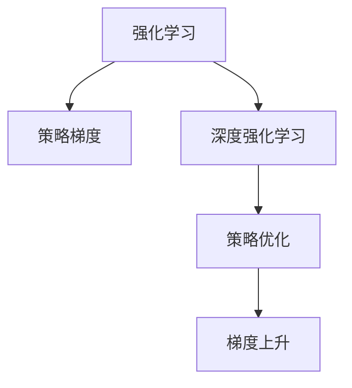

                 

# 强化学习Reinforcement Learning中的策略梯度方法详解

> 关键词：强化学习,策略梯度方法,深度强化学习,Reinforcement Learning,策略优化,梯度上升

## 1. 背景介绍

强化学习（Reinforcement Learning, RL）是机器学习领域的一个重要分支，其目标是使智能体（agent）在未知环境中通过与环境的交互，学习到最优的决策策略，以达到某个或某些预定的目标。传统的RL方法通常基于模型和价值估计，通过Q-learning、SARSA等算法寻找最优策略。但这些算法要求环境可模拟、奖励函数可表示，在实际应用中往往难以满足。

为了突破传统RL方法的局限性，策略梯度（Policy Gradient, PG）方法应运而生。策略梯度方法通过直接优化策略参数，绕过模型和价值函数，在无模型假设下也能学习到最优策略。在近年来深度强化学习的浪潮中，策略梯度方法因其高效性和普适性，成为RL研究的重要方向。本文将详细介绍策略梯度方法的原理、步骤和应用，并通过代码实例和案例分析，帮助大家更深入地理解和实践该方法。

## 2. 核心概念与联系

### 2.1 核心概念概述

为更好地理解策略梯度方法，本节将介绍几个密切相关的核心概念：

- 强化学习（Reinforcement Learning, RL）：一种通过智能体与环境交互，学习最优策略的机器学习方法。
- 策略梯度（Policy Gradient, PG）：一种直接优化策略参数的强化学习方法，通过计算策略的梯度，寻找最优策略。
- 深度强化学习（Deep Reinforcement Learning, DRL）：利用深度神经网络来逼近策略和价值函数，增强策略梯度方法的表达能力和鲁棒性。
- 策略优化（Policy Optimization）：策略梯度方法的另一种称呼，强调通过优化策略来提升决策性能。
- 梯度上升（Gradient Ascent）：通过计算梯度，不断优化参数，使目标函数值最大化的过程。

这些核心概念之间的逻辑关系可以通过以下Mermaid流程图来展示：



这个流程图展示了下文中各概念之间的相互关系：

1. 强化学习通过智能体与环境的交互，学习到最优策略。
2. 策略梯度方法通过直接优化策略参数，寻找最优策略。
3. 深度强化学习利用神经网络逼近策略和价值函数，提升表达能力。
4. 策略优化是策略梯度方法的另一种称呼，强调通过优化策略来提升性能。
5. 梯度上升是优化参数的通用方法，也是策略梯度方法的核心。

## 3. 核心算法原理 & 具体操作步骤
### 3.1 算法原理概述

策略梯度方法的核心思想是通过计算策略的梯度，直接优化策略参数。其核心原理可以总结如下：

- 定义策略：策略 $\pi(a|s)$ 表示在状态 $s$ 下，采取动作 $a$ 的概率分布。
- 定义奖励函数：奖励函数 $R(s,a)$ 表示在状态 $s$ 下采取动作 $a$ 后获得的即时奖励。
- 定义价值函数：价值函数 $V(s)$ 表示在状态 $s$ 下的期望累积奖励，通常使用蒙特卡洛方法或TD学习估计。
- 定义状态价值函数：状态价值函数 $Q(s,a)$ 表示在状态 $s$ 下采取动作 $a$ 后获得的期望累积奖励，通常使用Q-learning或SARSA估计。
- 定义策略梯度：策略梯度 $\nabla_\theta J(\theta)$ 表示策略 $\pi(a|s)$ 的梯度，其中 $J(\theta)$ 是目标函数，通常为策略价值函数。

通过定义上述几个核心函数，策略梯度方法可以推导出策略优化的一般公式：

$$
\nabla_\theta J(\theta) = \mathbb{E}_{s \sim P_{\pi}, a \sim \pi(\cdot|s)}[\nabla_\theta \log \pi(a|s) Q(s,a)]
$$

其中，$P_{\pi}$ 是智能体在策略 $\pi$ 下的状态分布，$Q(s,a)$ 是策略价值函数，$\log \pi(a|s)$ 是动作 $a$ 对策略 $\pi$ 的log-似然，$\nabla_\theta \log \pi(a|s)$ 是策略参数 $\theta$ 对动作 $a$ 的导数。该公式表明，最优策略的梯度可以通过对策略价值函数的期望值和策略对动作的导数进行计算。

### 3.2 算法步骤详解

策略梯度方法的算法步骤如下：

1. **定义策略**：选择一个适当的策略，如基于神经网络的策略，通过训练生成策略的参数。
2. **计算梯度**：通过蒙特卡洛方法或TD学习，计算策略价值函数 $Q(s,a)$ 的估计值，进而计算策略梯度 $\nabla_\theta J(\theta)$。
3. **更新策略参数**：使用策略梯度 $\nabla_\theta J(\theta)$ 更新策略参数 $\theta$，通常采用梯度上升方法，如随机梯度上升（SGD）。
4. **迭代优化**：重复上述步骤，直到策略收敛或达到预设的迭代次数。

### 3.3 算法优缺点

策略梯度方法的主要优点包括：

- 直接优化策略参数，避免模型和价值函数的构建，适用于更广泛的场景。
- 在无模型假设下，能学习到更复杂的策略，适用于非线性和高维状态空间。
- 利用深度神经网络逼近策略函数，表达能力更强。

其缺点包括：

- 计算策略梯度需要大量的经验数据，训练样本数要求较高。
- 计算梯度时通常采用蒙特卡洛方法或TD学习，计算复杂度较高，收敛速度较慢。
- 策略梯度方法可能受到采样数据的影响，存在不稳定的问题。

### 3.4 算法应用领域

策略梯度方法在强化学习领域有着广泛的应用，涵盖了多个典型的应用场景，例如：

- 游戏AI：在围棋、星际争霸等游戏中，策略梯度方法学习到最优的下棋策略，大幅提升AI的决策能力。
- 机器人控制：在机器人臂、无人机等系统中，策略梯度方法学习到最优的动作控制策略，实现复杂环境下的自主导航和操作。
- 自然语言处理：在对话系统、语言模型等任务中，策略梯度方法学习到最优的对话策略和语言生成策略，提升系统的交互和表达能力。
- 自动驾驶：在自动驾驶系统中，策略梯度方法学习到最优的路径规划和行为控制策略，提升行车安全和效率。
- 供应链管理：在物流、库存管理等场景中，策略梯度方法学习到最优的库存管理和调度策略，优化供应链效率。

除了上述这些经典应用外，策略梯度方法还被创新性地应用到更多领域，如金融风控、医疗诊断、智能推荐等，为各行各业带来了显著的效益。

## 4. 数学模型和公式 & 详细讲解 & 举例说明

### 4.1 数学模型构建

假设策略 $\pi(a|s)$ 是神经网络模型，其参数为 $\theta$。则策略梯度方法的数学模型可以表示为：

- 策略：$\pi(a|s) = \sigma(W^\top s + b)$，其中 $\sigma$ 是激活函数，$W$ 和 $b$ 是模型的权重和偏置。
- 奖励函数：$R(s,a)$ 为状态动作对下的即时奖励。
- 状态价值函数：$Q(s,a) = \sum_{t=0}^\infty \gamma^t R(s_t,a_t)$，其中 $\gamma$ 是折扣因子。
- 状态价值函数估计：$V(s) = \sum_{a} \pi(a|s) Q(s,a)$。

通过定义上述几个核心函数，我们可以推导出策略梯度的计算公式：

$$
\nabla_\theta J(\theta) = \mathbb{E}_{s \sim P_{\pi}, a \sim \pi(\cdot|s)}[\nabla_\theta \log \pi(a|s) Q(s,a)]
$$

### 4.2 公式推导过程

推导过程如下：

- 定义状态价值函数估计 $V(s)$：
$$
V(s) = \sum_{a} \pi(a|s) Q(s,a)
$$

- 对策略参数 $\theta$ 求偏导：
$$
\nabla_\theta V(s) = \sum_{a} \nabla_\theta \pi(a|s) Q(s,a)
$$

- 将策略对动作的导数替换为梯度：
$$
\nabla_\theta V(s) = \sum_{a} \nabla_\theta \log \pi(a|s) Q(s,a)
$$

- 根据目标函数 $J(\theta)$ 的定义，可得策略梯度公式：
$$
\nabla_\theta J(\theta) = \nabla_\theta V(s)
$$

因此，策略梯度的计算公式为：

$$
\nabla_\theta J(\theta) = \mathbb{E}_{s \sim P_{\pi}, a \sim \pi(\cdot|s)}[\nabla_\theta \log \pi(a|s) Q(s,a)]
$$

### 4.3 案例分析与讲解

以简单的Two-Arms Bandit问题为例，分析策略梯度方法的计算过程。

假设有两个赌注，每次投注后得到0.1或0.9的概率不同，分别设为0.3和0.7。智能体需要学习到最优的投注策略，使得期望收益最大。

- 定义策略 $\pi(a|s)$：
$$
\pi(a=1|s) = 0.3, \pi(a=2|s) = 0.7
$$

- 定义奖励函数 $R(s,a)$：
$$
R(s=1,a=1) = 0.9, R(s=1,a=2) = 0.1
$$
$$
R(s=2,a=1) = 0.1, R(s=2,a=2) = 0.9
$$

- 定义状态价值函数 $Q(s,a)$：
$$
Q(s=1,a=1) = 0.3 \times 0.9 = 0.27
$$
$$
Q(s=1,a=2) = 0.7 \times 0.1 = 0.07
$$
$$
Q(s=2,a=1) = 0.3 \times 0.1 = 0.03
$$
$$
Q(s=2,a=2) = 0.7 \times 0.9 = 0.63
$$

- 定义状态价值函数估计 $V(s)$：
$$
V(s=1) = 0.3 \times 0.27 + 0.7 \times 0.07 = 0.21
$$
$$
V(s=2) = 0.3 \times 0.03 + 0.7 \times 0.63 = 0.47
$$

- 计算策略梯度 $\nabla_\theta J(\theta)$：
$$
\nabla_\theta J(\theta) = \nabla_\theta V(s=1) \pi(a=1|s=1) + \nabla_\theta V(s=2) \pi(a=2|s=2)
$$

因此，智能体可以通过策略梯度方法，学习到最优的投注策略，最大化期望收益。

## 5. 项目实践：代码实例和详细解释说明
### 5.1 开发环境搭建

在进行策略梯度方法实践前，我们需要准备好开发环境。以下是使用PyTorch进行RL实验的环境配置流程：

1. 安装Anaconda：从官网下载并安装Anaconda，用于创建独立的Python环境。

2. 创建并激活虚拟环境：
```bash
conda create -n pytorch-env python=3.8 
conda activate pytorch-env
```

3. 安装PyTorch：根据CUDA版本，从官网获取对应的安装命令。例如：
```bash
conda install pytorch torchvision torchaudio cudatoolkit=11.1 -c pytorch -c conda-forge
```

4. 安装相关库：
```bash
pip install gym gymnasium stable-baselines3 stable-baselines3-contrib
```

完成上述步骤后，即可在`pytorch-env`环境中开始策略梯度实验。

### 5.2 源代码详细实现

下面我们以CartPole问题为例，给出使用Stable Baselines3库对策略梯度方法进行实现的PyTorch代码实现。

首先，导入必要的库和配置环境：

```python
from stable_baselines3 import A2C
from stable_baselines3.common.env_util import make_vec_env
import numpy as np
import torch

env = make_vec_env("CartPole-v1", n_envs=1)
```

然后，定义策略类：

```python
from stable_baselines3.a2c.policies import MlpPolicy
from stable_baselines3.a2c.utils import get_action_mean_std

class MyPolicy(MlpPolicy):
    def __init__(self, env.observation_space, env.action_space, net_arch=(256, 256), use_cnn=False, custom_net=None, custom_proba=True):
        super(MyPolicy, self).__init__(env.observation_space, env.action_space, net_arch, use_cnn, custom_net, custom_proba)
```

接着，定义训练和评估函数：

```python
from stable_baselines3.common.vec_env import SubprocVecEnv
from stable_baselines3.common.callbacks import CheckpointCallback

def train(model, env, max_episodes, log_dir):
    callbacks = [CheckpointCallback(log_dir=log_dir, verbose=True, save_freq=1)]
    model.fit(env, callbacks=callbacks, total_timesteps=3000)

def evaluate(model, env, episode_number=10):
    episode_rewards = []
    for i in range(episode_number):
        obs = env.reset()
        done = False
        total_reward = 0
        while not done:
            action, _ = model.predict(obs)
            obs, reward, done, _ = env.step(action)
            total_reward += reward
        episode_rewards.append(total_reward)
    return np.mean(episode_rewards)

env = SubprocVecEnv([lambda: gym.make("CartPole-v1")])
```

最后，启动训练流程并在测试集上评估：

```python
model = A2C(MyPolicy)
train(model, env, 1000, log_dir="./a2c")
eval_result = evaluate(model, env)
print(f"Evaluation result: {eval_result}")
```

以上就是使用PyTorch和Stable Baselines3库对策略梯度方法进行微调实验的完整代码实现。可以看到，利用现成的深度强化学习库，我们可以很方便地进行策略梯度实验。

### 5.3 代码解读与分析

让我们再详细解读一下关键代码的实现细节：

**MyPolicy类**：
- 继承自MLP网络，用于定义策略函数，其参数和输入输出与MLP网络一致。
- 在初始化函数中，可以通过修改net_arch和use_cnn参数，来定义不同的神经网络结构。

**train函数**：
- 使用CheckpointCallback来记录训练过程的日志，保存模型和状态。
- 在fit函数中，指定训练轮数和总时间步数。

**evaluate函数**：
- 定义测试集的大小，并在每个测试集中，对模型进行测试，返回平均得分。

**训练流程**：
- 创建A2C模型，指定策略函数和训练参数。
- 在train函数中，指定训练轮数、环境、日志路径等参数。
- 启动训练过程。

可以看到，策略梯度方法的代码实现相对简单，Stable Baselines3库提供了便捷的接口，使得快速实验成为可能。当然，在实际应用中，还需要对模型、算法、参数进行更加深入的调参和优化。

## 6. 实际应用场景
### 6.1 游戏AI

策略梯度方法在游戏AI中有着广泛的应用，如围棋、星际争霸、星际争霸2等。在这些游戏中，智能体需要学习到最优的下棋策略，实现高水平的AI对战。

以AlphaGo为例，策略梯度方法在AlphaGo的策略网络训练中起到了关键作用。AlphaGo的策略网络通过深度卷积神经网络（CNN）逼近价值函数，利用蒙特卡洛方法计算策略梯度，并通过策略梯度方法进行训练，学习到最优的博弈策略。

### 6.2 机器人控制

在机器人控制领域，策略梯度方法可以用于学习最优的路径规划和行为控制策略。例如，在无人机和自主车辆的导航中，策略梯度方法通过学习最优的控制策略，实现复杂环境下的自主导航和避障。

以Urban Drone为例，策略梯度方法学习到最优的飞行路径和障碍物避让策略，在城市环境中实现高效、安全的飞行任务。

### 6.3 自然语言处理

在自然语言处理领域，策略梯度方法可以用于学习最优的对话策略和语言生成策略。例如，在对话系统中，策略梯度方法通过学习最优的回复生成策略，提升系统的交互和表达能力。

以ChatterBot为例，策略梯度方法通过学习对话历史中的最优回复策略，生成自然流畅的对话内容，提升用户体验。

### 6.4 未来应用展望

随着策略梯度方法的不断发展，其应用前景也将更加广阔。未来，策略梯度方法有望在以下领域取得更大的突破：

- 自动驾驶：在自动驾驶系统中，策略梯度方法学习到最优的路径规划和行为控制策略，提升行车安全和效率。
- 金融风控：在金融领域，策略梯度方法学习到最优的交易策略和风险控制策略，提升投资回报和风险管理能力。
- 医疗诊断：在医疗领域，策略梯度方法学习到最优的诊断策略和治疗方案，提升诊断准确率和治疗效果。
- 供应链管理：在供应链领域，策略梯度方法学习到最优的库存管理和调度策略，优化供应链效率。

## 7. 工具和资源推荐
### 7.1 学习资源推荐

为了帮助开发者系统掌握策略梯度方法的原理和实践技巧，这里推荐一些优质的学习资源：

1. 《Reinforcement Learning: An Introduction》：由Sutton和Barto合著的经典教材，介绍了强化学习的理论基础和算法原理。

2. 《Deep Reinforcement Learning with PyTorch》：Rogers和Kirkpatrick合著的深度强化学习教程，介绍了如何使用PyTorch进行策略梯度方法的实现。

3. 《Reinforcement Learning from the Ground Up》：由Lillicrap和Romaniuk合著的强化学习入门教程，介绍了策略梯度方法的数学原理和实现细节。

4. OpenAI Gym：一个用于测试和开发强化学习算法的框架，提供了丰富的环境库和评估工具。

5. Stable Baselines3：一个深度强化学习框架，提供了多种预训练模型和训练算法，支持策略梯度方法等主流算法。

通过这些资源的学习实践，相信你一定能够快速掌握策略梯度方法的精髓，并用于解决实际的强化学习问题。

### 7.2 开发工具推荐

高效的开发离不开优秀的工具支持。以下是几款用于策略梯度方法开发的常用工具：

1. PyTorch：基于Python的开源深度学习框架，灵活动态的计算图，适合快速迭代研究。大部分预训练语言模型都有PyTorch版本的实现。

2. TensorFlow：由Google主导开发的开源深度学习框架，生产部署方便，适合大规模工程应用。同样有丰富的预训练语言模型资源。

3. Stable Baselines3：一个深度强化学习框架，提供了多种预训练模型和训练算法，支持策略梯度方法等主流算法。

4. PyBullet：一个用于机器人模拟的开源库，提供了丰富的物理模拟和交互功能，支持策略梯度方法的训练和评估。

5. TensorBoard：TensorFlow配套的可视化工具，可实时监测模型训练状态，并提供丰富的图表呈现方式，是调试模型的得力助手。

6. Weights & Biases：模型训练的实验跟踪工具，可以记录和可视化模型训练过程中的各项指标，方便对比和调优。

合理利用这些工具，可以显著提升策略梯度方法的开发效率，加快创新迭代的步伐。

### 7.3 相关论文推荐

策略梯度方法在强化学习领域的研究已经持续了数十年，以下是几篇奠基性的相关论文，推荐阅读：

1. Learning to play games via reinforcement learning：通过策略梯度方法，学习到围棋和星际争霸等游戏的最优策略。

2. Human-level control through deep reinforcement learning：利用策略梯度方法，学习到复杂物理系统的最优控制策略。

3. Asynchronous methods for deep reinforcement learning：介绍异步策略梯度方法，通过分布式计算提升训练效率。

4. Continuous control with deep reinforcement learning：利用策略梯度方法，学习到连续动作空间的最优控制策略。

5. Progressive Growing of World Models：提出渐进式构建世界模型的方法，提升策略梯度方法的泛化能力。

这些论文代表了大语言模型微调技术的发展脉络。通过学习这些前沿成果，可以帮助研究者把握学科前进方向，激发更多的创新灵感。

## 8. 总结：未来发展趋势与挑战

### 8.1 总结

本文对策略梯度方法进行了全面系统的介绍。首先阐述了策略梯度方法的背景和重要性，明确了其在强化学习中的核心地位。其次，从原理到实践，详细讲解了策略梯度方法的数学模型和算法步骤，并给出了微调任务开发的完整代码实例。同时，本文还广泛探讨了策略梯度方法在多个行业领域的应用前景，展示了其在复杂任务中的强大潜力。

通过本文的系统梳理，可以看到，策略梯度方法在强化学习领域具有广泛的应用前景和深远的意义。随着深度强化学习技术的不断发展，策略梯度方法将带来更多的创新和突破，为人工智能技术的发展注入新的动力。

### 8.2 未来发展趋势

展望未来，策略梯度方法将呈现以下几个发展趋势：

1. 深度强化学习与策略梯度方法的融合：通过深度神经网络逼近策略和价值函数，提升策略梯度方法的表达能力和鲁棒性。
2. 多任务强化学习：通过策略梯度方法，学习到多个任务的联合最优策略，提升资源利用效率。
3. 分布式强化学习：通过异步策略梯度方法，利用分布式计算提升训练效率，加速模型收敛。
4. 元强化学习：通过元学习算法，学习到最优的策略学习策略，提升策略梯度方法的泛化能力。
5. 因果推断与策略梯度方法的结合：通过因果推断方法，学习到最优的因果策略，提升决策性能。

这些趋势凸显了策略梯度方法在强化学习中的重要性，将进一步推动深度强化学习技术的发展。

### 8.3 面临的挑战

尽管策略梯度方法已经取得了显著的成果，但在迈向更加智能化、普适化应用的过程中，仍然面临诸多挑战：

1. 训练样本需求高：策略梯度方法需要大量的训练样本，在实际应用中，获取高质量训练数据成本较高。
2. 计算复杂度高：计算策略梯度需要大量的蒙特卡洛模拟和TD学习，计算复杂度较高，训练效率较低。
3. 策略收敛不稳定：策略梯度方法可能受到采样数据的影响，存在不稳定的问题。

### 8.4 研究展望

面对策略梯度方法面临的挑战，未来的研究需要在以下几个方面寻求新的突破：

1. 无监督和半监督学习：通过无监督和半监督学习，利用非结构化数据提升策略梯度方法的泛化能力。
2. 参数高效和计算高效的微调方法：开发更加参数高效和计算高效的微调方法，在固定大部分预训练参数的同时，只更新极少量的任务相关参数。
3. 融合因果推断和强化学习：通过因果推断方法，学习到最优的因果策略，提升决策性能。
4. 强化学习与深度学习、知识图谱等技术的结合：通过深度学习、知识图谱等技术，提升策略梯度方法的表达能力和鲁棒性。
5. 引入伦理和安全约束：在策略梯度方法的设计中，引入伦理和安全约束，确保模型的决策符合人类价值观和伦理道德。

这些研究方向将引领策略梯度方法走向更高的台阶，为构建安全、可靠、可解释、可控的智能系统铺平道路。

## 9. 附录：常见问题与解答

**Q1：策略梯度方法为什么需要大量的训练样本？**

A: 策略梯度方法需要大量的训练样本，是因为其计算策略梯度需要大量的蒙特卡洛模拟和TD学习，计算复杂度较高。大量的训练样本有助于减少采样数据的随机性，提高策略梯度估计的准确性和稳定性。

**Q2：如何优化策略梯度方法的训练过程？**

A: 优化策略梯度方法的训练过程，可以从以下几个方面入手：
1. 增加样本数量：通过增加训练样本数量，提高策略梯度估计的准确性。
2. 使用更高效的采样方法：如重要性采样、蒙特卡洛树搜索等，提高采样效率。
3. 引入正则化技术：如L2正则、Dropout等，防止模型过拟合。
4. 使用异步策略梯度方法：通过异步计算和优化，提高训练效率。
5. 采用分布式训练：利用分布式计算，加速模型训练。

**Q3：策略梯度方法在实际应用中存在哪些问题？**

A: 策略梯度方法在实际应用中存在以下问题：
1. 训练样本需求高：策略梯度方法需要大量的训练样本，在实际应用中，获取高质量训练数据成本较高。
2. 计算复杂度高：计算策略梯度需要大量的蒙特卡洛模拟和TD学习，计算复杂度较高，训练效率较低。
3. 策略收敛不稳定：策略梯度方法可能受到采样数据的影响，存在不稳定的问题。

通过以上问题的讨论和分析，可以看出策略梯度方法在实际应用中仍需进一步优化和改进。

