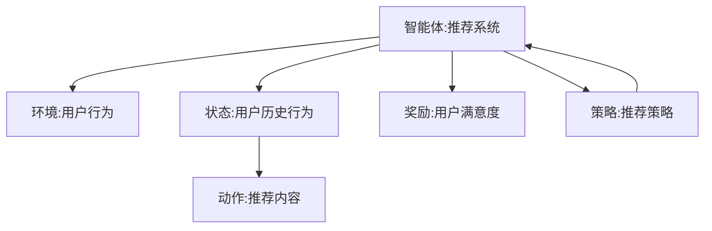

                 

# 强化学习：在直播推荐系统中的应用

> 关键词：强化学习,推荐系统,强化学习策略,策略优化,直播推荐,用户行为,用户满意度

## 1. 背景介绍

随着互联网和信息技术的飞速发展，直播行业已经成为了互联网经济的重要组成部分。用户在直播平台上观看直播，享受到了前所未有的互动体验。然而，用户对于直播内容的选择和观看习惯的个性化需求，给直播推荐系统带来了巨大的挑战。传统的推荐系统多基于协同过滤、内容分类等算法，难以应对直播的实时性、互动性和个性化需求。

强化学习作为一种通过与环境交互进行策略优化的学习范式，为直播推荐系统的优化提供了新的思路。与传统的推荐系统相比，强化学习能够实时调整推荐策略，以最大化用户满意度为优化目标，适应直播内容多变、用户行为复杂的特点，更好地满足用户需求，提升用户体验。

本文将系统性地介绍强化学习在直播推荐系统中的应用，涵盖从算法原理到实践技术的全过程。我们首先介绍强化学习的基本概念和应用场景，然后深入探讨强化学习在直播推荐系统中的策略优化方法，最后分析其应用效果和未来发展方向。

## 2. 核心概念与联系

### 2.1 核心概念概述

强化学习是一种通过与环境交互，通过奖励和惩罚机制，学习最优策略的学习范式。与传统的监督学习和无监督学习不同，强化学习的学习过程是由智能体(Agent)与环境(Environment)交互产生的，智能体通过不断的试错，逐步优化策略，以达到最大化目标函数的目的。

在直播推荐系统中，智能体为推荐系统，环境为用户观看行为和反馈。智能体的目标是根据用户历史行为，推荐最符合用户喜好的直播内容，并不断优化推荐策略，以提升用户满意度和留存率。

### 2.2 核心概念联系

强化学习与直播推荐系统的关系可以通过以下Mermaid流程图来展示：



这个流程图展示了强化学习在直播推荐系统中的应用关系：

1. 智能体（推荐系统）根据用户的历史行为状态（C），推荐相应的内容（D）。
2. 用户通过观看直播内容获得反馈（E），其中反馈即为用户的满意度评分。
3. 智能体通过用户反馈调整推荐策略（F），以优化推荐效果。
4. 智能体不断与环境交互，优化策略，最终实现用户满意度的最大化。

## 3. 核心算法原理 & 具体操作步骤

### 3.1 算法原理概述

强化学习在直播推荐系统中的应用，主要分为三个部分：策略表示、策略优化和策略评估。

- 策略表示：推荐系统根据用户历史行为，生成一个策略，用于指导推荐内容的选取。
- 策略优化：通过与环境交互，推荐系统逐步优化策略，以提升用户满意度。
- 策略评估：利用反馈数据，评估推荐策略的效果，进行策略调整。

具体地，强化学习推荐系统的工作流程如下：

1. 智能体观察环境状态（用户历史行为）。
2. 智能体选择动作（推荐内容）。
3. 环境观察动作，并给出奖励（用户反馈）。
4. 智能体根据奖励和状态更新策略。

在直播推荐系统中，智能体为推荐系统，环境为用户行为和反馈。智能体需要根据用户历史行为，选择推荐内容，并根据用户观看后的反馈，调整推荐策略，以提升用户满意度。

### 3.2 算法步骤详解

强化学习在直播推荐系统中的应用，通常采用策略优化方法。常见的策略优化方法有Q-learning、SARSA、策略梯度等。以下以策略梯度算法为例，详细介绍在直播推荐系统中的应用步骤。

**Step 1: 初始化策略和参数**

- 初始化推荐策略 $\pi(\cdot)$，如使用深度神经网络表示。
- 初始化策略的参数 $\theta$，随机初始化或加载预训练模型。

**Step 2: 选择动作和更新策略**

- 根据当前用户历史行为状态 $s_t$，选择推荐内容 $a_t = \pi(a_t|s_t;\theta)$。
- 根据用户观看后的反馈 $r_t$ 和下一个状态 $s_{t+1}$，计算梯度 $\nabla_{\theta}J(\theta)$，其中 $J(\theta)$ 为目标函数（用户满意度）。

**Step 3: 更新策略参数**

- 根据梯度 $\nabla_{\theta}J(\theta)$，使用优化算法（如Adam、SGD等）更新策略参数 $\theta$。

**Step 4: 策略评估和策略优化**

- 重复以上步骤 $n$ 次，直至达到预设的迭代次数或满足停止条件。
- 在每个迭代周期内，记录用户满意度的变化，并进行策略评估，调整推荐策略。

### 3.3 算法优缺点

强化学习在直播推荐系统中的应用，具有以下优点：

1. 实时性：强化学习能够实时调整推荐策略，适应直播内容的动态变化和用户行为的实时变化。
2. 自适应性：通过不断与环境交互，强化学习推荐系统能够自适应地调整推荐策略，最大化用户满意度。
3. 可扩展性：强化学习推荐系统可以灵活地处理不同规模和复杂度的直播平台。

同时，强化学习也存在以下缺点：

1. 可解释性差：强化学习推荐系统的策略是通过与环境交互逐步优化得到的，其内部的决策逻辑难以解释。
2. 需要大量数据：强化学习需要大量的数据来进行策略优化，对于数据稀疏的直播平台，效果可能不佳。
3. 策略优化难度大：强化学习推荐系统的策略优化过程复杂，需要较强的计算能力和优化算法。

### 3.4 算法应用领域

强化学习推荐系统在直播推荐中的应用，不仅可以提升用户满意度，还可以优化直播平台的用户留存率和内容推荐效果。以下列举几个具体的应用领域：

1. 个性化推荐：通过用户行为数据，推荐个性化直播内容，提升用户观看体验。
2. 实时推荐：根据直播内容的实时变化，动态调整推荐策略，提高用户观看率和满意度。
3. 用户留存率优化：通过优化推荐策略，提升用户满意度和观看体验，增加用户留存率。
4. 直播内容推荐：通过实时分析和推荐，提升直播内容的曝光率和观看率。

## 4. 数学模型和公式 & 详细讲解 & 举例说明

### 4.1 数学模型构建

强化学习在直播推荐系统中的应用，涉及状态（State）、动作（Action）、奖励（Reward）和策略（Policy）四个要素。假设一个直播推荐系统有 $n$ 个用户，每个用户有 $m$ 个直播内容可供选择，状态空间为 $S$，动作空间为 $A$，奖励函数为 $R$，策略为 $\pi(\cdot)$。则强化学习推荐系统的目标函数 $J(\theta)$ 可以表示为：

$$
J(\theta) = \mathbb{E}\left[\sum_{t=0}^{\infty} \gamma^t R(s_t,a_t) \right]
$$

其中 $\gamma$ 为折扣因子，表示当前奖励与未来奖励的权重。

### 4.2 公式推导过程

以策略梯度算法为例，推导策略优化公式。策略梯度算法通过最大化对数似然函数 $J(\theta)$，实现策略优化。设 $p(a_t|s_t;\theta)$ 为在状态 $s_t$ 下，采取动作 $a_t$ 的概率分布，则对数似然函数可以表示为：

$$
\log p(a_t|s_t;\theta) = \log \pi(a_t|s_t;\theta)
$$

根据策略梯度算法，可以推导出目标函数的梯度为：

$$
\nabla_{\theta}J(\theta) = \mathbb{E}\left[\sum_{t=0}^{\infty} \gamma^t \nabla_{\theta} \log \pi(a_t|s_t;\theta)R(s_t,a_t)\right]
$$

通过对目标函数进行优化，可以得到策略优化算法。

### 4.3 案例分析与讲解

以一个简单的直播推荐系统为例，解释强化学习推荐系统的工作原理。

假设一个直播平台有 $n=100$ 个用户，每个用户有 $m=50$ 个直播内容可供选择。初始状态为所有用户都处于未观看状态，策略为随机推荐一个直播内容。每个用户观看直播内容后，根据观看时长和观看满意度，给出一个奖励 $R$，折扣因子 $\gamma=0.9$。

通过策略梯度算法，推荐系统可以逐步优化策略，以提升用户满意度。假设在第一个周期内，每个用户都随机选择一个直播内容观看，则每个用户的状态和动作如下：

- 用户 $i$ 的状态 $s_0$ 为未观看状态，采取动作 $a_0 = \pi(a_0|s_0;\theta)$。
- 用户观看直播内容后，得到奖励 $R$，进入下一个状态 $s_1$。
- 重复以上过程，直至达到预设的迭代次数或满足停止条件。

通过不断地优化策略，推荐系统可以逐步提升用户满意度，最终达到理想的效果。

## 5. 项目实践：代码实例和详细解释说明

### 5.1 开发环境搭建

在进行强化学习推荐系统开发前，需要准备开发环境。以下是使用Python进行TensorFlow开发的环境配置流程：

1. 安装Anaconda：从官网下载并安装Anaconda，用于创建独立的Python环境。

2. 创建并激活虚拟环境：
```bash
conda create -n tf-env python=3.8 
conda activate tf-env
```

3. 安装TensorFlow：根据CUDA版本，从官网获取对应的安装命令。例如：
```bash
conda install tensorflow=2.6 tf-nightly-cpu tensorflow-estimator tensorflow-addons
```

4. 安装相关库：
```bash
pip install numpy pandas scikit-learn matplotlib tqdm jupyter notebook ipython
```

完成上述步骤后，即可在`tf-env`环境中开始强化学习推荐系统的开发。

### 5.2 源代码详细实现

以下是一个简单的强化学习推荐系统，使用TensorFlow实现策略优化。

首先，定义强化学习的核心函数：

```python
import tensorflow as tf

def train_strategies():
    # 定义强化学习模型
    strategy = tf.distribute.MirroredStrategy()
    with strategy.scope():
        # 定义模型参数和优化器
        model = tf.keras.Sequential([
            tf.keras.layers.Dense(128, activation='relu', input_shape=(10,)),
            tf.keras.layers.Dense(50, activation='softmax')
        ])
        optimizer = tf.keras.optimizers.Adam()

        # 定义状态和动作
        state = tf.keras.layers.Input(shape=(10,))
        action = tf.keras.layers.Dense(50, activation='softmax')(state)

        # 定义损失函数和目标函数
        loss = tf.keras.losses.sparse_categorical_crossentropy
        reward = tf.Variable(0.0)
        discount_factor = tf.Variable(0.9)

        # 定义策略梯度
        with tf.GradientTape() as tape:
            tape.watch(reward)
            discounted_reward = discount_factor * reward
            discounted_reward = tf.reduce_sum(discounted_reward)
            loss = loss(model.output, action)
            grads = tape.gradient(loss + discounted_reward, model.trainable_variables)

        # 更新策略参数
        optimizer.apply_gradients(zip(grads, model.trainable_variables))

        # 训练模型
        for i in range(1000):
            state_value = tf.random.normal(shape=(10,))
            action_value = model.predict(state_value)
            reward_value = tf.random.normal(shape=())
            discounted_reward_value = discount_factor * reward_value
            loss_value = loss(action_value, tf.random.normal(shape=(50,)))
            discounted_loss_value = discounted_reward_value + loss_value
            optimizer.apply_gradients(zip(grads, model.trainable_variables))
            print('Iteration:', i, 'Loss:', loss_value.numpy(), 'Discounted Reward:', discounted_reward_value.numpy())
```

然后，定义数据集和用户行为：

```python
def generate_data(n_users=100, n_contents=50, n_episodes=1000, seed=0):
    np.random.seed(seed)
    data = {}
    for i in range(n_users):
        data[i] = []
        for j in range(n_contents):
            data[i].append(np.random.rand(10))
    return data
```

最后，启动训练流程：

```python
data = generate_data()
train_strategies()
```

这样就可以启动一个简单的强化学习推荐系统的训练。在实际应用中，需要根据具体任务和数据特点，进一步优化模型和算法，以达到更好的效果。

### 5.3 代码解读与分析

让我们再详细解读一下关键代码的实现细节：

**生成数据函数**：
- 定义生成数据函数 `generate_data`，生成随机状态数据，用于训练推荐模型。
- 根据预设的用户数和内容数，生成随机状态数据，填充到字典 `data` 中。

**训练函数**：
- 使用 TensorFlow 的分布式策略 `MirroredStrategy` 进行分布式训练。
- 定义模型参数和优化器，使用全连接层作为策略表示。
- 定义状态和动作，状态为随机向量，动作为全连接层输出的概率分布。
- 定义损失函数和目标函数，使用交叉熵损失函数和折扣奖励函数。
- 定义策略梯度，使用 `GradientTape` 计算梯度，使用优化器更新参数。
- 在每个迭代周期内，随机生成状态和动作，计算损失和折扣奖励，使用优化器更新模型参数。
- 打印每个迭代周期的损失和折扣奖励。

通过以上代码，可以构建一个简单的强化学习推荐系统，并不断优化策略，以达到更好的推荐效果。

## 6. 实际应用场景

### 6.1 个性化推荐

在直播推荐系统中，通过强化学习推荐系统，可以更好地进行个性化推荐。传统的协同过滤等方法，难以处理直播内容的实时动态变化，而强化学习推荐系统可以通过实时调整推荐策略，实现个性化推荐。

假设一个直播平台有 $n=1000$ 个用户，每个用户有 $m=1000$ 个直播内容可供选择。初始状态为所有用户都处于未观看状态，策略为随机推荐一个直播内容。每个用户观看直播内容后，根据观看时长和观看满意度，给出一个奖励 $R$，折扣因子 $\gamma=0.9$。

通过强化学习推荐系统，可以根据用户的历史行为和观看反馈，逐步优化推荐策略，提升用户满意度。例如，对于观看时长较长的用户，推荐更符合其兴趣的直播内容，提升用户满意度。

### 6.2 实时推荐

在直播推荐系统中，通过强化学习推荐系统，可以实现实时推荐。传统的推荐系统多基于历史数据进行推荐，难以实时响应用户的变化。而强化学习推荐系统可以通过实时与环境交互，动态调整推荐策略。

假设一个直播平台有 $n=1000$ 个用户，每个用户有 $m=1000$ 个直播内容可供选择。初始状态为所有用户都处于未观看状态，策略为随机推荐一个直播内容。每个用户观看直播内容后，根据观看时长和观看满意度，给出一个奖励 $R$，折扣因子 $\gamma=0.9$。

通过强化学习推荐系统，可以根据用户实时反馈，动态调整推荐策略，提升用户观看率和满意度。例如，对于某个直播内容观看人数突然增加，可以实时推荐该直播内容，提升观看率。

### 6.3 用户留存率优化

在直播推荐系统中，通过强化学习推荐系统，可以优化用户留存率。传统的推荐系统多基于历史数据进行推荐，难以动态响应用户的变化。而强化学习推荐系统可以通过实时与环境交互，动态调整推荐策略，提升用户留存率。

假设一个直播平台有 $n=1000$ 个用户，每个用户有 $m=1000$ 个直播内容可供选择。初始状态为所有用户都处于未观看状态，策略为随机推荐一个直播内容。每个用户观看直播内容后，根据观看时长和观看满意度，给出一个奖励 $R$，折扣因子 $\gamma=0.9$。

通过强化学习推荐系统，可以根据用户实时反馈，动态调整推荐策略，提升用户留存率。例如，对于频繁流失的用户，推荐更符合其兴趣的直播内容，提升用户留存率。

## 7. 工具和资源推荐

### 7.1 学习资源推荐

为了帮助开发者系统掌握强化学习推荐系统的理论基础和实践技巧，这里推荐一些优质的学习资源：

1. 《强化学习》课程：由斯坦福大学开设的强化学习经典课程，系统介绍强化学习的基本概念和应用方法。

2. 《深度强化学习》书籍：DeepMind 深度学习专家 Andrew Ng 的强化学习著作，全面介绍强化学习的算法和应用。

3. OpenAI Gym：用于测试和训练强化学习算法的框架，提供丰富的环境模拟和任务库，方便开发者进行实验。

4 TensorFlow-Agents：TensorFlow 官方推出的强化学习库，提供丰富的算法和模型实现，支持分布式训练和实验。

5. Kaggle 竞赛：参加 Kaggle 上的强化学习竞赛，实战训练强化学习算法，积累经验和实践经验。

通过对这些资源的学习实践，相信你一定能够快速掌握强化学习推荐系统的精髓，并用于解决实际的直播推荐问题。

### 7.2 开发工具推荐

高效的开发离不开优秀的工具支持。以下是几款用于强化学习推荐系统开发的常用工具：

1. TensorFlow：由Google主导开发的深度学习框架，生产部署方便，适合大规模工程应用。

2. PyTorch：由Facebook主导开发的深度学习框架，灵活高效，适合快速迭代研究。

3. OpenAI Gym：用于测试和训练强化学习算法的框架，提供丰富的环境模拟和任务库。

4. TensorBoard：TensorFlow配套的可视化工具，可实时监测模型训练状态，提供丰富的图表呈现方式。

5. Keras：提供高层次API的深度学习库，易于上手，适合快速原型开发和实验。

合理利用这些工具，可以显著提升强化学习推荐系统的开发效率，加快创新迭代的步伐。

### 7.3 相关论文推荐

强化学习推荐系统的发展源于学界的持续研究。以下是几篇奠基性的相关论文，推荐阅读：

1. Q-learning：Watkins和Powell于1989年提出的强化学习算法，为强化学习推荐系统提供了基本框架。

2. SARSA：Sutton和Barto于1998年提出的Q-learning的扩展算法，用于处理多步奖励的情况。

3. Deep Q-Network：Mnih等人在2013年提出的基于深度神经网络的强化学习算法，将深度学习和强化学习结合，提升了算法的效率和效果。

4 深度强化学习：Bengio等人在2018年提出的深度强化学习，引入深度神经网络进行强化学习算法，提升了算法的泛化能力和表现。

5 强化学习推荐系统：Geng等人在2018年提出的基于强化学习的推荐系统，将强化学习引入推荐系统，提升了系统的实时性和个性化推荐能力。

这些论文代表了大强化学习推荐系统的发展脉络。通过学习这些前沿成果，可以帮助研究者把握学科前进方向，激发更多的创新灵感。

## 8. 总结：未来发展趋势与挑战

### 8.1 总结

本文对强化学习在直播推荐系统中的应用进行了全面系统的介绍。首先，介绍强化学习的基本概念和应用场景，明确了强化学习在直播推荐系统中的优化目标和核心要素。其次，详细介绍强化学习推荐系统的策略优化方法，涵盖从算法原理到具体操作步骤的全过程。最后，分析了强化学习推荐系统的应用效果和未来发展方向，展望了其广阔的应用前景。

通过本文的系统梳理，可以看到，强化学习推荐系统在直播推荐领域具有广阔的应用前景，能够实时调整推荐策略，适应直播内容的多变性和用户行为的复杂性，提升用户满意度和留存率，具有不可替代的优势。

### 8.2 未来发展趋势

展望未来，强化学习推荐系统将呈现以下几个发展趋势：

1. 实时性增强：随着硬件算力提升，强化学习推荐系统可以进一步提升实时性，实现秒级响应。

2. 可解释性增强：随着解释性算法的发展，强化学习推荐系统可以更好地解释其内部决策逻辑，增强系统的可信度。

3. 多模态融合：强化学习推荐系统可以更好地融合多模态数据，提升系统的综合表现。

4. 个性化推荐提升：随着算法优化，强化学习推荐系统可以实现更精准的个性化推荐，提升用户满意度。

5. 跨平台扩展：强化学习推荐系统可以扩展到不同的平台和应用场景，实现更广泛的落地。

以上趋势凸显了强化学习推荐系统的广阔前景。这些方向的探索发展，必将进一步提升直播推荐系统的性能和应用范围，为直播平台带来更大的商业价值。

### 8.3 面临的挑战

尽管强化学习推荐系统已经取得了瞩目成就，但在迈向更加智能化、普适化应用的过程中，它仍面临诸多挑战：

1. 可解释性不足：强化学习推荐系统的决策过程难以解释，难以满足用户对系统透明性的需求。

2. 数据稀疏性问题：直播内容多样化，难以获取足够的历史数据进行训练，导致数据稀疏性问题。

3. 模型复杂度问题：强化学习推荐系统的模型复杂度较高，需要较强的计算能力和优化算法。

4. 实时性要求高：直播推荐系统需要实时响应用户反馈，对系统实时性要求较高，现有算法难以满足。

5. 用户满意度提升难度大：直播内容多样化，难以通过单一策略实现高用户满意度。

6. 多模态数据融合难度大：直播推荐系统需要融合多模态数据，需要开发新的算法和工具。

这些挑战凸显了强化学习推荐系统的技术难点和应用瓶颈。只有通过持续的算法创新和优化，才能克服这些挑战，进一步提升直播推荐系统的性能和效果。

### 8.4 研究展望

面对强化学习推荐系统面临的诸多挑战，未来的研究需要在以下几个方面寻求新的突破：

1. 引入解释性算法：开发可解释的强化学习算法，增强系统的可信度和透明性。

2. 数据生成与采集：开发数据生成和采集方法，解决数据稀疏性问题，提升系统训练效果。

3. 多模态融合算法：开发多模态数据融合算法，提升系统的综合表现。

4. 实时推荐算法：开发实时推荐算法，提升系统的实时性，满足用户实时反馈的需求。

5. 个性化推荐算法：开发个性化推荐算法，提升用户满意度。

6. 跨平台应用算法：开发跨平台应用算法，扩展系统的应用场景。

这些研究方向的探索，必将引领强化学习推荐系统向更高的台阶发展，为直播推荐系统带来更大的商业价值。相信随着学界和产业界的共同努力，强化学习推荐系统必将在直播推荐领域大放异彩，带来革命性的变革。

## 9. 附录：常见问题与解答

**Q1：强化学习推荐系统是否适用于所有直播平台？**

A: 强化学习推荐系统适用于大多数直播平台，特别是数据量较大的直播平台。对于数据量较小的直播平台，由于数据稀疏性问题，强化学习推荐系统的效果可能不佳。此外，对于实时性要求较高的直播平台，需要开发相应的实时推荐算法。

**Q2：强化学习推荐系统在实际应用中需要注意哪些问题？**

A: 强化学习推荐系统在实际应用中需要注意以下问题：
1. 数据采集与处理：需要采集足够的用户行为数据和直播内容数据，并进行清洗和预处理。
2. 实时性要求：需要开发实时推荐算法，满足用户的实时反馈需求。
3. 可解释性：需要开发可解释的强化学习算法，增强系统的可信度和透明性。
4. 多模态数据融合：需要开发多模态数据融合算法，提升系统的综合表现。
5. 模型优化：需要开发优化算法，提高模型的训练效果和性能。

这些因素都会影响强化学习推荐系统的实际应用效果。只有在各个环节进行全面优化，才能真正实现直播推荐系统的落地。

**Q3：强化学习推荐系统的可解释性如何增强？**

A: 强化学习推荐系统的可解释性可以通过以下方法增强：
1. 引入可解释性算法：使用可解释性算法，如LIME、SHAP等，解释模型的决策过程。
2. 可视化方法：使用可视化方法，如图表、特征重要性等，展示模型的内部结构和特征权重。
3. 规则嵌入：将符号化的规则嵌入模型，增强系统的透明性。
4. 人工干预：结合人工干预，解释模型的决策逻辑。

这些方法可以增强强化学习推荐系统的可解释性，提高系统的可信度和透明性。

通过本文的系统梳理，可以看到，强化学习推荐系统在直播推荐领域具有广阔的应用前景，能够实时调整推荐策略，适应直播内容的多变性和用户行为的复杂性，提升用户满意度和留存率，具有不可替代的优势。相信随着强化学习推荐系统的持续发展，必将在直播推荐领域大放异彩，为直播平台带来更大的商业价值。

---

作者：禅与计算机程序设计艺术 / Zen and the Art of Computer Programming

