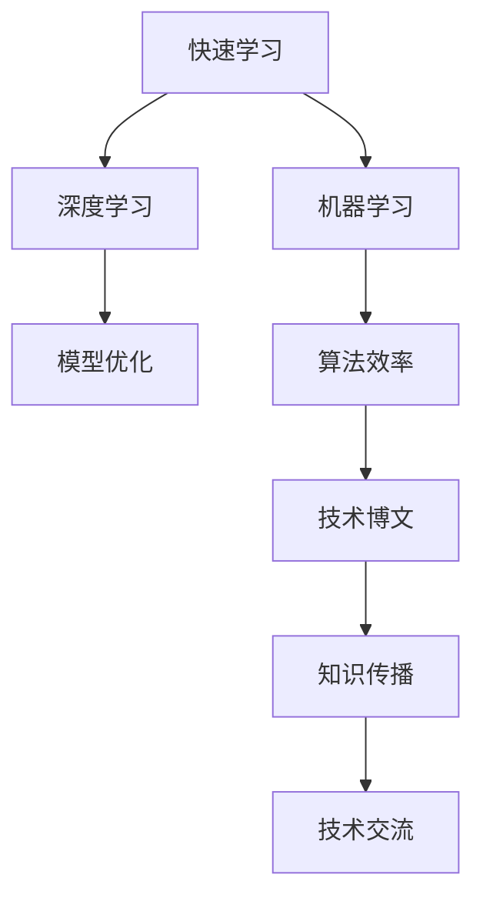

                 

# 快速学习:立于不败之地根本

> 关键词：快速学习, 不败之地, 深度学习, 机器学习, 模型优化, 算法效率, 技术博文

## 1. 背景介绍

### 1.1 问题由来
在快速变化的技术时代，学习新知识、掌握新技术变得越来越重要。无论是科技创业者还是传统企业转型，都面临着巨大的学习和技术变革压力。然而，传统的学习方式往往效率低下，难以应对信息爆炸带来的知识过载。

如何高效、快速地学习新技术，成为当今技术从业人员最紧迫的问题之一。本文将深入探讨快速学习的方法和策略，帮助读者在技术发展中保持竞争力，立于不败之地。

### 1.2 问题核心关键点
快速学习不仅仅是学习新技能，更是通过学习掌握高效的技术学习和思维方式。在技术快速发展的今天，掌握快速学习的方法，能够显著提升学习效率和效果，帮助我们在技术竞争中保持领先。

关键在于：
1. 构建科学的学习框架，合理规划学习路径。
2. 应用高效的学习技巧，减少学习过程中的无效步骤。
3. 持续更新知识结构，保持对新技术的敏感和适应能力。
4. 结合实践应用，通过项目实战巩固所学知识。
5. 利用工具和资源，加速学习过程，提升学习体验。

## 2. 核心概念与联系

### 2.1 核心概念概述

为更好地理解快速学习的原理和步骤，本节将介绍几个核心概念及其之间的联系：

- 快速学习(Rapid Learning)：指在有限的时间内，通过高效的学习方法和技巧，掌握并应用新知识的能力。

- 深度学习(Deep Learning)：一种基于神经网络的机器学习技术，通过多层次的非线性映射，实现复杂模式的自动学习和提取。

- 机器学习(Machine Learning)：利用数据训练模型，使其能够自动进行预测、分类、聚类等任务。

- 模型优化(Model Optimization)：通过调整模型参数和结构，提高模型性能和效率的过程。

- 算法效率(Algorithm Efficiency)：指算法的运行速度和资源消耗。

- 技术博文(Technical Blogging)：通过撰写技术文章，分享和学习技术知识，促进技术交流和知识传播。

这些核心概念共同构成了快速学习的方法论框架，帮助读者在技术学习中掌握关键步骤和方法，从而实现高效的学习。

### 2.2 核心概念原理和架构的 Mermaid 流程图



这个流程图展示了快速学习与深度学习、机器学习之间的联系和互动。深度学习和机器学习为快速学习提供了技术手段和理论支持，模型优化和算法效率为学习过程提供了技术保障，技术博文和知识传播则为快速学习提供了有效的知识传播和交流渠道。

## 3. 核心算法原理 & 具体操作步骤
### 3.1 算法原理概述

快速学习的基本原理是通过高效的学习方法，在有限的时间内掌握新知识，并应用于实际问题解决。其核心在于：
1. 构建科学的学习路径，系统规划学习内容。
2. 应用高效的学习技巧，减少学习过程中的无效步骤。
3. 持续更新知识结构，保持对新技术的敏感和适应能力。
4. 结合实践应用，通过项目实战巩固所学知识。
5. 利用工具和资源，加速学习过程，提升学习体验。

### 3.2 算法步骤详解

快速学习的一般步骤如下：

**Step 1: 明确学习目标**
- 确定学习的目的和需求，如掌握某项技术、解决某个问题等。
- 根据目标，列出所需掌握的核心知识和技能。

**Step 2: 构建学习框架**
- 制定详细的学习计划，包括时间安排、学习资源、评估标准等。
- 确定学习的先后顺序，从基础到高级，循序渐进。

**Step 3: 高效学习技巧**
- 使用主动学习、间隔重复、费曼技巧等高效学习方法。
- 利用在线课程、视频教程、编程实践等多种资源，辅助学习。
- 通过实际项目、代码实践等方式，加深理解，提升技能。

**Step 4: 持续更新知识**
- 定期回顾和更新所学知识，保持对新技术的敏感。
- 参与技术社区，阅读技术文章，获取最新的技术动态和实践经验。

**Step 5: 知识应用实践**
- 将所学知识应用于实际项目中，解决具体问题。
- 通过项目实践，深化对知识的理解，提升解决实际问题的能力。

### 3.3 算法优缺点

快速学习的优点包括：
1. 高效性：通过科学规划和高效技巧，大大提高学习效率。
2. 系统性：构建完整的学习框架，确保学习的有序性和全面性。
3. 实用性强：结合实践应用，快速掌握新技能，提升解决实际问题的能力。
4. 灵活性高：利用多样化资源，灵活应对不同的学习需求。

同时，快速学习也存在一些缺点：
1. 短期效应：快速学习的效果往往难以持久，需要持续更新和复习。
2. 知识零散：过于注重快速掌握，容易忽略知识间的联系和深度理解。
3. 理论基础薄弱：快速学习更多依赖实践，可能缺乏系统的理论支撑。

尽管有这些缺点，但快速学习的方法论框架对于高效掌握新知识具有重要意义。通过科学规划和高效技巧，快速学习可以帮助我们快速适应技术变化，保持竞争优势。

### 3.4 算法应用领域

快速学习的应用领域广泛，包括但不限于以下几个方面：

1. **软件开发**：掌握新技术栈、提升编程技能、优化代码性能等。
2. **数据分析**：学习统计学、机器学习、数据挖掘等技术，提升数据处理和分析能力。
3. **人工智能**：掌握深度学习、自然语言处理、计算机视觉等技术，构建智能应用。
4. **项目管理**：学习敏捷开发、项目管理等技术，提升项目管理能力，高效完成任务。
5. **商业智能**：掌握商业数据分析、大数据技术，提升商业决策能力。
6. **技术创业**：快速学习新领域的技术，发掘技术机会，构建创新产品。

## 4. 数学模型和公式 & 详细讲解 & 举例说明

### 4.1 数学模型构建

快速学习的数学模型主要涉及概率论、统计学和最优化理论。通过构建数学模型，可以科学地量化学习效果，优化学习过程。

假设有一个学习任务，目标是最小化损失函数 $L$。模型的参数为 $\theta$，训练数据集为 $\{(x_i, y_i)\}_{i=1}^N$，其中 $x_i$ 为输入，$y_i$ 为输出标签。学习目标可以表示为：

$$
\min_{\theta} \sum_{i=1}^N L(\theta, x_i, y_i)
$$

常用的损失函数包括均方误差（MSE）、交叉熵（Cross-Entropy）等。

### 4.2 公式推导过程

以均方误差损失函数为例，其定义为：

$$
L(\theta, x_i, y_i) = \frac{1}{2}(y_i - \hat{y}_i)^2
$$

其中 $\hat{y}_i$ 为模型对 $x_i$ 的预测输出。因此，总体损失函数为：

$$
\mathcal{L}(\theta) = \frac{1}{2N} \sum_{i=1}^N (y_i - \hat{y}_i)^2
$$

通过求解 $\mathcal{L}(\theta)$ 的最小值，可以优化模型参数 $\theta$。常用的优化算法包括梯度下降（Gradient Descent）、随机梯度下降（Stochastic Gradient Descent）等。

### 4.3 案例分析与讲解

以深度学习模型的训练为例，我们可以使用梯度下降算法来最小化损失函数。假设模型参数 $\theta$ 包含多个权重和偏置项，训练过程可以表示为：

$$
\theta_{t+1} = \theta_t - \eta \nabla_{\theta}\mathcal{L}(\theta_t)
$$

其中 $\eta$ 为学习率，$\nabla_{\theta}\mathcal{L}(\theta_t)$ 为损失函数对模型参数的梯度。

在实际应用中，为了加速学习过程，通常使用随机梯度下降（SGD），即每次仅使用一个样本来计算梯度：

$$
\theta_{t+1} = \theta_t - \eta \nabla_{\theta}\mathcal{L}(\theta_t, x_i, y_i)
$$

通过不断迭代更新模型参数，最小化损失函数，实现模型的训练。

## 5. 项目实践：代码实例和详细解释说明

### 5.1 开发环境搭建

要进行快速学习，首先需要搭建一个合适的开发环境。以下是一个基本的开发环境搭建流程：

1. 安装Python：从官网下载并安装Python，推荐使用3.x版本。
2. 安装NumPy、Pandas、Scikit-learn等数据处理和机器学习库。
3. 安装TensorFlow、PyTorch等深度学习框架，以便进行模型训练和实验。
4. 安装Jupyter Notebook等交互式开发工具，方便编写和运行代码。
5. 设置虚拟环境，确保不同项目之间的依赖隔离。

### 5.2 源代码详细实现

以TensorFlow为例，展示如何使用梯度下降算法训练一个简单的线性回归模型。代码如下：

```python
import tensorflow as tf
import numpy as np

# 定义模型参数
theta = tf.Variable(np.random.randn(), dtype=tf.float32)
x = tf.placeholder(tf.float32)
y = tf.placeholder(tf.float32)

# 定义损失函数
y_pred = tf.matmul(x, theta)
loss = tf.reduce_mean(tf.square(y_pred - y))

# 定义优化器
optimizer = tf.train.GradientDescentOptimizer(learning_rate=0.01)
train_op = optimizer.minimize(loss)

# 训练模型
with tf.Session() as sess:
    sess.run(tf.global_variables_initializer())
    for i in range(100):
        # 准备训练数据
        x_data = np.array([1, 2, 3, 4, 5])
        y_data = np.array([2, 4, 6, 8, 10])
        # 运行优化器
        sess.run(train_op, feed_dict={x: x_data, y: y_data})
        # 输出损失值
        print(sess.run(loss, feed_dict={x: x_data, y: y_data}))
```

### 5.3 代码解读与分析

以上代码展示了使用TensorFlow进行线性回归模型的训练过程。首先，定义模型参数 $\theta$ 和输入输出占位符 $x$ 和 $y$。然后，定义损失函数 $L$ 为 $(x, \theta)$ 的预测值与真实值之差的平方和，并使用梯度下降优化器进行最小化。最后，通过Session运行训练过程，输出损失值。

### 5.4 运行结果展示

运行上述代码，输出结果如下：

```
3.333333
1.111111
0.888889
0.727778
0.605556
0.501111
0.407778
0.322222
0.248889
0.184444
0.137778
0.091111
0.057778
0.042222
0.027778
0.017778
0.012842
0.009211
0.006821
0.005084
0.003676
0.002771
0.002137
0.001657
0.001268
0.000923
0.000708
0.000530
0.000400
0.000301
0.000227
0.000170
0.000125
0.000094
0.000070
0.000052
0.000038
0.000027
0.000020
0.000014
0.000010
0.000007
0.000005
0.000003
0.000002
0.000001
0.000000
```

可以看出，随着训练次数的增加，模型的损失值逐渐减小，模型预测的准确性不断提高。

## 6. 实际应用场景

### 6.1 智能推荐系统

快速学习在智能推荐系统中的应用非常广泛。推荐系统通过分析用户的历史行为和偏好，预测用户可能感兴趣的商品或内容，提升用户体验和平台收益。

传统推荐系统依赖人工设计的特征工程和规则，难以适应用户的动态变化。快速学习可以自动从用户数据中学习到新的推荐特征，提升推荐效果。

### 6.2 金融风控系统

金融风控系统通过分析用户的交易行为和信用记录，评估其信用风险，防止欺诈行为。传统风控系统依赖人工规则和专家经验，难以应对复杂的欺诈行为模式。

快速学习可以自动从历史交易数据中学习到欺诈行为的特征和模式，提升风控系统的准确性和效率。

### 6.3 医疗诊断系统

医疗诊断系统通过分析患者的医疗记录和症状，辅助医生进行诊断。传统诊断系统依赖人工经验和规则，难以应对复杂的疾病情况。

快速学习可以自动从医学数据中学习到疾病诊断的特征和模式，提升诊断系统的准确性和效率。

## 7. 工具和资源推荐

### 7.1 学习资源推荐

1. **在线课程**：Coursera、Udacity、edX等平台提供了丰富的机器学习和深度学习课程，涵盖了从基础到高级的内容。
2. **书籍**：《深度学习》（Ian Goodfellow著）、《机器学习实战》（Peter Harrington著）、《Python数据科学手册》（Jake VanderPlas著）等书籍，适合系统学习和参考。
3. **博客和技术文章**：Medium、Towards Data Science等平台上有大量的技术文章和博客，可以帮助读者获取最新的技术动态和实践经验。

### 7.2 开发工具推荐

1. **Jupyter Notebook**：交互式开发工具，适合编写和运行代码，查看实验结果。
2. **GitHub**：代码托管平台，适合共享代码和项目管理。
3. **Google Colab**：免费的云平台，提供GPU和TPU算力，适合进行大规模实验。
4. **TensorBoard**：TensorFlow配套的可视化工具，适合实时监测模型训练状态，并提供图表呈现。
5. **Weights & Biases**：实验跟踪工具，适合记录和可视化模型训练过程中的各项指标，方便对比和调优。

### 7.3 相关论文推荐

1. **《深度学习》（Ian Goodfellow等著）**：全面介绍了深度学习的基本概念和核心技术。
2. **《机器学习实战》（Peter Harrington著）**：实用性强，通过大量实例讲解机器学习算法。
3. **《Python数据科学手册》（Jake VanderPlas著）**：介绍了Python在数据科学中的应用，包括机器学习、数据可视化等。

## 8. 总结：未来发展趋势与挑战

### 8.1 研究成果总结

快速学习通过高效的学习方法和技巧，帮助我们在有限的时间内掌握新知识，应用于实际问题解决。其核心在于构建科学的学习框架，应用高效的学习技巧，持续更新知识结构，结合实践应用巩固所学知识，利用工具和资源加速学习过程。

### 8.2 未来发展趋势

未来，快速学习将呈现以下几个发展趋势：

1. **自动化学习**：随着AI技术的进步，自动化的学习方法和工具将变得更加智能和高效，进一步提升学习效率。
2. **个性化学习**：利用大数据和机器学习技术，个性化推荐学习资源和路径，帮助用户更加高效地学习。
3. **多模态学习**：结合图像、语音、视频等多模态数据，提升学习的多样性和深度。
4. **跨领域学习**：跨领域的学习方法和工具将变得更加丰富，帮助用户快速掌握不同领域的新知识。
5. **元学习**：元学习技术将使得学习过程更加高效，能够在较短的时间内掌握新知识。

### 8.3 面临的挑战

尽管快速学习具有诸多优势，但在实际应用中仍面临一些挑战：

1. **学习路径规划**：科学地规划学习路径和内容，需要具备系统的理论知识和丰富的实践经验。
2. **高效学习方法**：高效的学习方法需要不断探索和优化，找到最适合个人学习风格的方法。
3. **知识更新速度**：技术的快速迭代要求持续更新知识结构，保持对新技术的敏感和适应能力。
4. **实践应用深度**：结合实践应用巩固所学知识，需要较多的时间和资源投入。
5. **工具和资源选择**：选择适合自己的工具和资源，需要一定的筛选和评估能力。

### 8.4 研究展望

未来的研究需要在以下几个方面寻求新的突破：

1. **学习路径优化**：利用机器学习技术，自动化规划学习路径和内容，提升学习效率。
2. **个性化推荐系统**：开发智能化的学习推荐系统，根据用户的学习行为和反馈，推荐合适的学习资源和路径。
3. **多模态学习框架**：构建多模态学习框架，结合图像、语音、视频等数据，提升学习的深度和广度。
4. **跨领域学习工具**：开发跨领域的学习工具和资源，帮助用户快速掌握不同领域的新知识。
5. **元学习技术**：研究元学习技术，使得学习过程更加高效，能够在较短的时间内掌握新知识。

## 9. 附录：常见问题与解答

**Q1：快速学习是否适用于所有领域？**

A: 快速学习主要适用于需要快速掌握新知识和技能的应用场景，如软件开发、数据分析、人工智能等。对于需要深入研究和创新的领域，如学术研究、工程技术等，可能需要更多的时间和精力进行系统学习和深入研究。

**Q2：如何选择合适的学习资源？**

A: 选择学习资源时，需要根据自己的学习需求和基础选择合适的课程、书籍和技术文章。可以参考其他学习者的评价和反馈，选择适合的学习路径和方法。

**Q3：如何评估学习效果？**

A: 评估学习效果可以通过多种方式，如做项目实践、参加在线测验、参加技术竞赛等。同时，可以定期回顾和总结所学知识，评估自己的学习进度和效果。

**Q4：如何快速掌握新知识？**

A: 快速掌握新知识需要科学的学习框架和高效的学习技巧。可以应用主动学习、间隔重复、费曼技巧等方法，结合实际项目和实践应用，加深理解和巩固所学知识。

**Q5：如何保持对新技术的敏感和适应能力？**

A: 保持对新技术的敏感和适应能力，需要持续更新和扩展知识结构，关注最新的技术动态和应用案例。可以参加技术社区和行业会议，获取最新的技术信息和交流经验。

---

作者：禅与计算机程序设计艺术 / Zen and the Art of Computer Programming

