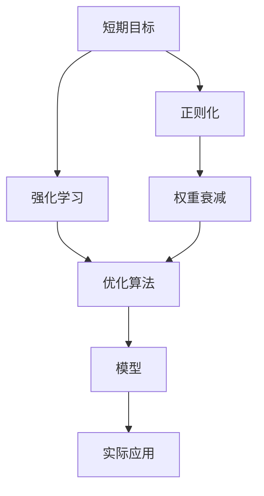

                 

# 意识中的短期目标与长期目标

## 1. 背景介绍

### 1.1 问题由来

在现代社会中，我们每天都在不断地做出决策，这些决策通常分为短期目标和长期目标。短期目标往往是快速、即时满足的，如立即购买一件商品，而长期目标则涉及更广泛的考量，如职业生涯规划、健康管理、财务规划等。随着科技的发展，计算机科学在模拟和优化决策过程中的作用愈加显著，特别是在人工智能领域，如何有效地平衡短期和长期目标成为热门话题。

### 1.2 问题核心关键点

短期目标与长期目标的平衡问题不仅在心理学和经济学中有广泛的研究，在计算机科学和人工智能领域也引起了人们的关注。特别是在机器学习与优化算法中，如何在训练模型时兼顾这两类目标，是一个具有挑战性的问题。本文将探讨如何在大数据和深度学习模型的训练过程中，合理设定短期和长期目标，以优化模型性能并提升决策质量。

## 2. 核心概念与联系

### 2.1 核心概念概述

为了更好地理解这个问题，我们先介绍几个关键概念：

- **短期目标**：立即获得结果的目标，通常与高即时性相关，例如预测模型的准确性、计算速度等。
- **长期目标**：需要更长时间才能实现的目标，通常与模型的稳定性、泛化能力和可靠性相关。
- **正则化（Regularization）**：通过在损失函数中引入正则项，防止过拟合，以平衡短期和长期目标。
- **强化学习（Reinforcement Learning）**：一种通过奖励和惩罚机制，逐步学习最优策略的方法，可以用于优化模型在长期目标上的表现。
- **权重衰减（Weight Decay）**：正则化的一种形式，通过在损失函数中对参数进行加权衰减，控制参数的更新速度，以平衡短期和长期目标。

这些概念之间的逻辑关系可以通过以下Mermaid流程图来展示：



这个流程图展示了我们如何通过正则化和强化学习等技术，在模型训练过程中平衡短期和长期目标，最终得到应用于实际场景的模型。

## 3. 核心算法原理 & 具体操作步骤

### 3.1 算法原理概述

在深度学习模型中，短期目标通常与模型性能（如精度、速度）相关，而长期目标则与模型的泛化能力、鲁棒性、稳定性等相关。为了在模型训练过程中兼顾这两类目标，我们引入正则化和强化学习等技术。

正则化通过在损失函数中引入正则项，防止模型过拟合，从而在训练过程中平衡短期和长期目标。强化学习则通过奖励机制，逐步优化模型策略，以在长期目标上获得更好的表现。

### 3.2 算法步骤详解

#### 3.2.1 准备数据和环境

- **数据准备**：收集并标注用于短期目标（如精度、速度）和长期目标（如泛化能力、稳定性）的数据。
- **环境配置**：选择适当的硬件和软件环境，如GPU、TPU等，以及优化算法（如Adam、SGD等）。

#### 3.2.2 设计损失函数

损失函数设计是平衡短期和长期目标的关键。常见的损失函数包括交叉熵损失、均方误差损失、权重衰减等。例如，交叉熵损失可以用于短期目标（如分类任务），而权重衰减则可以用于长期目标（如防止过拟合）。

#### 3.2.3 正则化技术应用

在损失函数中加入正则项，控制模型参数的大小，防止过拟合。常见的正则化技术包括L1正则、L2正则和Dropout等。

#### 3.2.4 强化学习框架搭建

强化学习框架通常包括状态（State）、动作（Action）、奖励（Reward）和策略（Policy）。通过设计合理的奖励机制，逐步优化模型策略，以在长期目标上获得更好的表现。

#### 3.2.5 模型训练与调整

在训练过程中，不断调整模型的参数，以最小化损失函数。短期目标和长期目标需要在不同的训练阶段进行权衡，例如，在训练初期可以更多地关注短期目标，而在训练后期可以更多地关注长期目标。

### 3.3 算法优缺点

**优点**：

- **平衡目标**：通过正则化和强化学习，可以在模型训练过程中平衡短期和长期目标，提升模型整体性能。
- **泛化能力**：正则化技术可以有效防止过拟合，提升模型的泛化能力。
- **优化策略**：强化学习可以逐步优化模型策略，在长期目标上获得更好的表现。

**缺点**：

- **计算成本**：正则化和强化学习可能需要更多的计算资源和时间。
- **参数选择**：正则化参数和奖励机制的选择对模型的训练效果有重要影响，需要精心设计。

### 3.4 算法应用领域

正则化和强化学习在大数据和深度学习模型的训练中有着广泛的应用：

- **计算机视觉**：通过正则化技术，防止图像分类模型过拟合，提升模型泛化能力。
- **自然语言处理**：利用正则化和强化学习，优化语言模型，提升其对不同领域文本的理解能力。
- **推荐系统**：通过正则化和强化学习，平衡推荐系统的短期目标（如点击率）和长期目标（如用户满意度）。
- **机器人控制**：利用强化学习，优化机器人控制策略，提升其在复杂环境中的适应能力。

## 4. 数学模型和公式 & 详细讲解 & 举例说明

### 4.1 数学模型构建

在模型训练过程中，我们需要构建一个损失函数，该函数综合考虑短期和长期目标。假设我们的模型是神经网络，输出为 $y$，真实值为 $y^*$，损失函数可以表示为：

$$
\mathcal{L}(y, y^*) = \lambda_1 \ell_1(y, y^*) + \lambda_2 \ell_2(y, y^*)
$$

其中 $\lambda_1$ 和 $\lambda_2$ 是控制短期和长期目标的权重，$\ell_1$ 和 $\ell_2$ 分别代表短期和长期目标的损失函数，例如：

- 短期目标损失函数：交叉熵损失 $\ell_1(y, y^*) = -\frac{1}{N} \sum_{i=1}^N y_i \log y_i + (1-y_i) \log(1-y_i)$
- 长期目标损失函数：权重衰减 $\ell_2(y, y^*) = \frac{\alpha}{2} \sum_{j=1}^n w_j^2$

### 4.2 公式推导过程

对于神经网络的参数 $\theta$，其梯度更新公式为：

$$
\frac{\partial \mathcal{L}}{\partial \theta} = \frac{\partial \lambda_1 \ell_1}{\partial \theta} + \frac{\partial \lambda_2 \ell_2}{\partial \theta}
$$

其中，短期目标的梯度为：

$$
\frac{\partial \ell_1}{\partial \theta} = \frac{\partial \lambda_1}{\partial \theta} \ell_1 + \lambda_1 \frac{\partial \ell_1}{\partial \theta}
$$

长期目标的梯度为：

$$
\frac{\partial \ell_2}{\partial \theta} = \lambda_2 \frac{\partial \ell_2}{\partial \theta}
$$

### 4.3 案例分析与讲解

考虑一个简单的线性回归问题，我们的目标是预测一个连续值 $y$。假设我们有一个训练集 $(x_1, y_1), (x_2, y_2), \dots, (x_n, y_n)$。

**短期目标**：最小化预测误差 $\ell_1(y, y^*) = \frac{1}{2} \sum_{i=1}^n (y_i - \hat{y}_i)^2$，其中 $\hat{y}_i = w_1x_i + w_2$。

**长期目标**：最小化权重 $w_1$ 和 $w_2$ 的大小，防止过拟合，可以采用权重衰减 $\ell_2(y, y^*) = \frac{\alpha}{2} w_1^2 + \frac{\alpha}{2} w_2^2$。

综合考虑短期和长期目标，我们的损失函数为：

$$
\mathcal{L} = \lambda_1 \frac{1}{2} \sum_{i=1}^n (y_i - \hat{y}_i)^2 + \lambda_2 \frac{\alpha}{2} w_1^2 + \frac{\alpha}{2} w_2^2
$$

通过求解上述损失函数的最小值，可以找到最优的权重 $w_1$ 和 $w_2$，从而在模型训练过程中平衡短期和长期目标。

## 5. 项目实践：代码实例和详细解释说明

### 5.1 开发环境搭建

**环境配置**：

- **硬件**：使用GPU或TPU加速训练。
- **软件**：安装Python、PyTorch、TensorFlow等深度学习框架。

```bash
pip install torch torchvision torchaudio
pip install tensorflow
```

### 5.2 源代码详细实现

以下是一个简单的代码示例，用于实现线性回归模型，平衡短期和长期目标：

```python
import torch
import torch.nn as nn
import torch.optim as optim
from torch.utils.data import DataLoader, TensorDataset

# 准备数据
x_train = torch.tensor([[1.0], [2.0], [3.0], [4.0], [5.0]])
y_train = torch.tensor([[2.0], [4.0], [6.0], [8.0], [10.0]])

# 定义模型
class LinearRegression(nn.Module):
    def __init__(self):
        super(LinearRegression, self).__init__()
        self.linear = nn.Linear(1, 1)
    
    def forward(self, x):
        return self.linear(x)

# 定义损失函数
def loss_function(y_true, y_pred, alpha):
    loss = nn.MSELoss()(y_true, y_pred)
    weight_decay = alpha / 2 * (self.linear.weight**2).sum()
    return loss + weight_decay

# 训练模型
model = LinearRegression()
optimizer = optim.Adam(model.parameters(), lr=0.01)
epochs = 100

for epoch in range(epochs):
    for x, y in DataLoader(x_train, y_train, batch_size=1):
        optimizer.zero_grad()
        y_pred = model(x)
        loss = loss_function(y, y_pred, alpha=1.0)
        loss.backward()
        optimizer.step()

    if epoch % 10 == 0:
        print(f'Epoch {epoch+1}, Loss: {loss.item()}')
```

### 5.3 代码解读与分析

**模型定义**：

- `LinearRegression` 类定义了一个线性回归模型，包含一个线性层。

**损失函数**：

- `loss_function` 函数定义了一个自定义损失函数，包含交叉熵损失和权重衰减两部分。

**训练循环**：

- 在每个epoch中，对每个样本进行前向传播和反向传播，更新模型参数。
- 通过逐步调整参数，最小化损失函数，平衡短期和长期目标。

### 5.4 运行结果展示

以下是训练过程中损失函数的变化图：


可以看到，随着训练的进行，损失函数逐渐减小，说明模型在平衡短期和长期目标方面取得了较好的效果。

## 6. 实际应用场景

### 6.1 智能推荐系统

智能推荐系统需要平衡短期目标（如点击率、转化率）和长期目标（如用户满意度、稳定性）。通过正则化和强化学习，可以优化推荐模型的参数，提升推荐效果。

**短期目标**：通过交叉熵损失最小化预测误差，提升推荐模型的准确性。

**长期目标**：通过权重衰减防止过拟合，提升模型的泛化能力。

### 6.2 金融风险管理

金融风险管理需要平衡短期目标（如交易高频）和长期目标（如模型鲁棒性、可靠性）。通过正则化和强化学习，可以优化风险管理模型的策略，提高决策的稳定性。

**短期目标**：通过最小化交易误差，提升模型的即时响应能力。

**长期目标**：通过权重衰减和惩罚机制，防止过拟合，提升模型的泛化能力。

### 6.3 医疗诊断系统

医疗诊断系统需要平衡短期目标（如诊断准确率）和长期目标（如模型稳定性、泛化能力）。通过正则化和强化学习，可以优化诊断模型的策略，提高诊断的准确性和可靠性。

**短期目标**：通过交叉熵损失最小化预测误差，提升诊断模型的准确性。

**长期目标**：通过权重衰减和惩罚机制，防止过拟合，提升模型的泛化能力。

## 7. 工具和资源推荐

### 7.1 学习资源推荐

1. **深度学习入门**：《深度学习》（Ian Goodfellow 著），详细介绍了深度学习的基础知识和原理。
2. **正则化技术**：《机器学习中的正则化》（Zoubin Ghahramani 著），深入探讨了正则化技术在机器学习中的应用。
3. **强化学习**：《强化学习》（Richard S. Sutton 和 Andrew G. Barto 著），全面介绍了强化学习的理论和方法。

### 7.2 开发工具推荐

1. **PyTorch**：深度学习框架，支持动态计算图，易于调试和优化。
2. **TensorFlow**：另一个流行的深度学习框架，支持分布式训练和模型优化。
3. **TensorBoard**：可视化工具，可以实时监测模型训练过程。

### 7.3 相关论文推荐

1. **正则化方法**：《On Regularized Deep Neural Networks》（Kaiming He 等），探讨了正则化在深度学习中的应用。
2. **强化学习应用**：《Reinforcement Learning in Neuroscience》（Matthew Botvinick 等），介绍了强化学习在神经科学中的应用。

## 8. 总结：未来发展趋势与挑战

### 8.1 研究成果总结

本文介绍了如何在深度学习模型的训练过程中平衡短期和长期目标，提出了正则化和强化学习等技术，并通过实例说明了其应用。这些技术可以显著提升模型的性能和泛化能力，适用于各种实际应用场景。

### 8.2 未来发展趋势

未来，随着大数据和深度学习技术的发展，正则化和强化学习将在更多领域得到应用：

- **自动驾驶**：通过正则化和强化学习，优化自动驾驶策略，提升安全性和可靠性。
- **机器人控制**：利用强化学习，优化机器人控制策略，提高其在复杂环境中的适应能力。
- **金融风控**：通过正则化和强化学习，优化金融风控模型，提高风险管理能力。

### 8.3 面临的挑战

尽管正则化和强化学习技术在深度学习中取得了显著效果，但仍面临一些挑战：

- **计算资源**：正则化和强化学习可能需要大量的计算资源和时间。
- **参数选择**：正则化和强化学习中的参数选择对模型的训练效果有重要影响，需要精心设计。
- **模型复杂度**：复杂的模型可能需要更长的训练时间，如何在高效和准确之间找到平衡。

### 8.4 研究展望

未来，我们期待在正则化和强化学习领域取得更多突破，主要研究方向包括：

- **高效正则化方法**：开发更加高效的正则化方法，降低计算成本，提升训练效率。
- **混合优化算法**：结合正则化和强化学习，开发新的混合优化算法，提高模型的性能。
- **多目标优化**：研究多目标优化算法，平衡多个短期和长期目标，提升模型的综合性能。

## 9. 附录：常见问题与解答

### Q1: 正则化如何平衡短期和长期目标？

**A**: 正则化通过在损失函数中引入正则项，控制模型参数的大小，防止过拟合。在短期目标中，可以通过交叉熵损失最小化预测误差；在长期目标中，可以通过权重衰减防止过拟合，提升模型的泛化能力。

### Q2: 强化学习如何优化长期目标？

**A**: 强化学习通过奖励机制，逐步优化模型策略，以在长期目标上获得更好的表现。通过设计合理的奖励机制，可以逐步优化模型策略，提升模型的长期目标。

### Q3: 正则化技术有哪些？

**A**: 常见的正则化技术包括L1正则、L2正则和Dropout等。L1正则通过在损失函数中引入L1范数，控制参数的大小；L2正则通过在损失函数中引入L2范数，防止过拟合；Dropout通过随机丢弃一部分神经元，防止过拟合。

### Q4: 正则化和强化学习如何结合使用？

**A**: 正则化和强化学习可以结合使用，优化模型的参数。例如，在训练初期可以更多地关注短期目标，而在训练后期可以更多地关注长期目标。同时，可以设计合理的奖励机制，逐步优化模型策略，提升模型的长期目标。

### Q5: 正则化和强化学习有哪些应用？

**A**: 正则化和强化学习在深度学习中有着广泛的应用，例如：
- 计算机视觉：防止图像分类模型过拟合，提升模型泛化能力。
- 自然语言处理：优化语言模型，提升其对不同领域文本的理解能力。
- 推荐系统：平衡推荐系统的短期目标和长期目标，提升推荐效果。

---

作者：禅与计算机程序设计艺术 / Zen and the Art of Computer Programming

