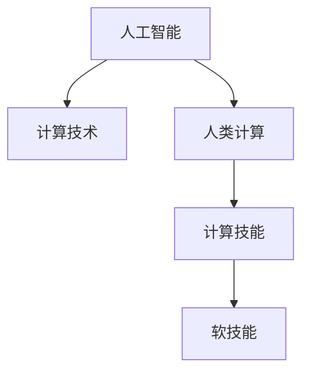

                 

# 技能提升：适应人类计算时代的新需求

> 关键词：人工智能,计算技术,人类计算,技能提升,未来发展趋势,技术挑战

## 1. 背景介绍

### 1.1 问题由来
随着计算机技术的迅猛发展，尤其是人工智能(AI)技术的突破性进展，人类计算的时代正在到来。无论是日常生活中的智能助手、在线教育、健康监测，还是科学研究、自动驾驶、工业自动化等领域，计算技术都开始全面融入人类生活和工作。这一趋势不仅改变了我们的生活方式，也对个体的技能需求提出了新的挑战。

### 1.2 问题核心关键点
人类计算时代要求个体具备更高的计算技能，特别是在理解和应用AI技术方面。这不仅包括编程、数据分析、机器学习等硬技能，还涵盖了科学思维、问题解决、跨领域协作等软技能。传统教育体系中，这些技能往往是分割和孤立的，难以形成综合性的素质。因此，如何适应这一时代的需求，提升个体的综合计算技能，成为当前教育和技术发展的关键问题。

### 1.3 问题研究意义
在人类计算时代，个体技能提升不仅有助于其在科技驱动的新经济中保持竞争力，更是推动社会整体进步的关键。通过提升个体的计算技能，可以加速技术普及，促进创新，提升社会整体效率和福祉。因此，研究适应人类计算时代的新需求，提升个体的计算技能，对于教育改革和技术创新具有重要意义。

## 2. 核心概念与联系

### 2.1 核心概念概述

为更好地理解人类计算时代技能提升的理论基础和实践方法，本节将介绍几个密切相关的核心概念：

- 人工智能(AI)：指利用算法和计算技术模拟人类智能能力的系统，包括感知、学习、推理等模块。
- 计算技术(Computing Technology)：指实现信息处理、存储和传输的各类技术手段，包括硬件和软件两个层面。
- 人类计算(Human Computing)：指利用计算机辅助人进行计算和决策的技术范式，包括计算机辅助设计、人工智能交互、大数据分析等。
- 计算技能(Computational Skills)：指个体应用计算技术解决问题的能力，包括编程、数据分析、算法设计等。
- 软技能(Soft Skills)：指个体在计算技能基础上，培养的综合素质，包括科学思维、问题解决、跨领域协作等。

这些核心概念之间的逻辑关系可以通过以下Mermaid流程图来展示：



这个流程图展示了个体技能提升的核心概念及其之间的关系：

1. 人工智能技术为计算技术提供了理论和实践基础。
2. 计算技术为人类计算提供了实现手段。
3. 人类计算提升了个体的计算技能。
4. 计算技能是软技能的基础，推动个体全面发展。

这些概念共同构成了人类计算时代技能提升的理论框架，使其能够适应日益增长的计算需求。

## 3. 核心算法原理 & 具体操作步骤
### 3.1 算法原理概述

人类计算时代技能提升的核心理念是“以计算技能为基石，以软技能为助力”，通过计算技术训练和应用，全面提升个体的综合能力。其主要思想包括：

1. **计算技能训练**：通过编程、数据分析、机器学习等计算技能的学习和应用，培养个体解决实际问题的能力。
2. **软技能培养**：通过科学思维、问题解决、跨领域协作等软技能的学习和实践，提升个体综合素质。
3. **实践应用**：通过参与实际项目、竞赛、创新创业等活动，将所学知识应用到实际问题中，实现技能转化。

### 3.2 算法步骤详解

基于上述理念，人类计算时代技能提升的基本流程可以分为以下几个步骤：

**Step 1: 确定技能提升目标**
- 根据个体的职业规划和发展方向，确定需要掌握的关键计算技能和软技能。
- 设定具体、可衡量、可实现的目标，如掌握Python编程语言、完成数据分析项目、解决实际问题等。

**Step 2: 选择合适的学习资源**
- 根据技能提升目标，选择适合的在线课程、书籍、工作坊、实践项目等学习资源。
- 确保资源的质量和适用性，选择来自知名教育机构或企业的数据库。

**Step 3: 制定学习计划**
- 制定详细的学习计划，包括学习时间、任务分配、评估标准等。
- 设定里程碑，定期评估学习进度和效果，进行必要的调整和优化。

**Step 4: 系统化学习**
- 采用系统化的学习方法，如MOOCs（大规模在线开放课程）、工作坊、实验室等方式，全面掌握相关知识。
- 结合理论学习和实践操作，加深对计算技能的理解和应用。

**Step 5: 实践应用**
- 参与实际项目或比赛，将所学知识应用到实际问题中。
- 从实践中发现问题、解决问题，不断迭代提升。

**Step 6: 持续学习**
- 持续关注领域内的最新发展和技术进展。
- 不断学习和应用新的计算技术和方法。

### 3.3 算法优缺点

人类计算时代技能提升方法具有以下优点：

1. **系统全面**：通过系统化的学习和实践，全面提升个体的计算技能和软技能。
2. **实践导向**：注重实际应用，将所学知识转化为解决问题的能力。
3. **灵活适应**：根据个体职业需求和学习进度灵活调整学习内容和方法。

同时，该方法也存在一定的局限性：

1. **学习成本高**：系统全面的学习和实践，需要投入大量时间和精力。
2. **学习路径不确定**：不同职业路径对计算技能和软技能的需求不同，个体难以制定统一的学习路径。
3. **学习动机不强**：缺乏实际应用场景的引导，个体在学习过程中可能缺乏内在动力。

尽管存在这些局限性，但就目前而言，基于人类计算时代的技能提升方法仍是大规模教育和技术培训的主流范式。未来相关研究的重点在于如何进一步降低学习成本，提高学习动机，同时兼顾软技能的培养和计算技能的应用。

### 3.4 算法应用领域

人类计算时代技能提升方法，在教育、培训、企业技术培训等多个领域已经得到了广泛的应用，具体包括：

- **教育领域**：通过计算机辅助教学和在线课程，全面提升学生的计算技能和软技能，培养适应未来科技发展的合格人才。
- **企业培训**：利用企业内部培训资源和外部在线平台，提升员工的技术能力和综合素质，提升企业竞争力。
- **职业资格认证**：通过系统的培训和认证，提升个体在特定领域的专业水平，增强职业发展潜力。
- **创新创业**：鼓励个体应用所学知识和技能，参与创新创业活动，推动科技成果的商业化应用。

除了上述这些领域外，人类计算时代技能提升方法也在不断扩展到更多场景中，如个人兴趣提升、职业转型、家庭教育等，为个体的全面发展提供了新的路径。

## 4. 数学模型和公式 & 详细讲解  
### 4.1 数学模型构建

在人类计算时代技能提升的理论框架中，我们可以使用数学语言对这一过程进行更加严格的刻画。

设个体在技能提升前后的计算技能分别为 $S_{\text{before}}$ 和 $S_{\text{after}}$，软技能分别为 $T_{\text{before}}$ 和 $T_{\text{after}}$。则技能提升的数学模型可以表示为：

$$
S_{\text{after}} = f(S_{\text{before}}, T_{\text{before}}, E)
$$
$$
T_{\text{after}} = g(S_{\text{before}}, T_{\text{before}}, E)
$$

其中，$f$ 和 $g$ 分别表示计算技能提升和软技能培养的函数，$E$ 表示个体的学习环境和资源。

### 4.2 公式推导过程

以编程技能为例，我们可以推导出计算技能提升的公式。假设个体掌握了基础的编程语言，但在实际项目中仍需通过学习算法和数据结构等计算技能来提升问题解决能力。其公式可以表示为：

$$
S_{\text{after}} = S_{\text{before}} + \sum_{k=1}^n w_k \Delta S_k
$$

其中，$S_{\text{after}}$ 表示提升后的编程技能，$S_{\text{before}}$ 表示初始编程技能，$w_k$ 表示第 $k$ 个技能点的权重，$\Delta S_k$ 表示掌握第 $k$ 个技能点后的提升量。

### 4.3 案例分析与讲解

假设某学生在初始编程技能为3分，通过学习算法和数据结构两个技能点，分别提升技能1分和2分。则提升后的编程技能为：

$$
S_{\text{after}} = 3 + 1 \times w_1 + 2 \times w_2
$$

其中，$w_1$ 和 $w_2$ 分别为算法和数据结构的技能权重。

在实际应用中，还需要根据不同领域的计算技能特点，选择合适的技能提升模型和方法。例如，数据分析技能提升可能更依赖于实际项目中的数据处理和分析能力，可以通过数据集项目来逐步提升。而机器学习技能提升则更依赖于模型调优和实验设计能力，需要通过完成多个模型调优任务来逐步提升。

## 5. 项目实践：代码实例和详细解释说明
### 5.1 开发环境搭建

在进行技能提升实践前，我们需要准备好开发环境。以下是使用Python进行技能提升实践的环境配置流程：

1. 安装Python：确保系统安装了Python 3.x版本，可以使用Miniconda、Anaconda等工具进行安装和管理。

2. 安装必要的库：
```bash
pip install numpy pandas matplotlib scikit-learn seaborn jupyter notebook
```

3. 设置学习资源：
```bash
mkdir resources
cd resources
git clone https://github.com/[课程或项目名称].git
```

4. 创建虚拟环境：
```bash
conda create -n [虚拟环境名] python=3.8
conda activate [虚拟环境名]
```

5. 运行学习工具：
```bash
jupyter notebook
```

6. 安装第三方库：
```bash
pip install [第三方库名称]
```

完成上述步骤后，即可在虚拟环境中进行技能提升的实践。

### 5.2 源代码详细实现

这里我们以Python编程技能提升为例，给出具体的代码实现。

首先，定义技能提升的数学模型：

```python
import numpy as np

def skill_upgrade(initial_skill, weight, upgrade_amount):
    """
    计算技能提升后的值
    :param initial_skill: 初始技能值
    :param weight: 技能点权重
    :param upgrade_amount: 技能点提升量
    :return: 提升后的技能值
    """
    return initial_skill + weight * upgrade_amount

# 初始编程技能
initial_skill = 3
# 算法和数据结构技能点的权重
weights = [1, 2]
# 技能点提升量
upgrade_amounts = [1, 2]

# 计算提升后的编程技能
updated_skill = skill_upgrade(initial_skill, weights, upgrade_amounts)
print(f"提升后的编程技能为：{updated_skill}")
```

然后，定义技能提升的学习计划：

```python
def learning_plan(initial_skill, weights, upgrade_amounts, num_periods):
    """
    定义学习计划
    :param initial_skill: 初始技能值
    :param weights: 技能点权重
    :param upgrade_amounts: 技能点提升量
    :param num_periods: 学习周期数
    :return: 提升后的技能值列表
    """
    updated_skills = [initial_skill]
    for k in range(num_periods):
        next_skill = skill_upgrade(updated_skills[-1], weights, upgrade_amounts)
        updated_skills.append(next_skill)
    return updated_skills

# 学习周期数
num_periods = 10
# 计算每个学习周期的编程技能
upgraded_skills = learning_plan(initial_skill, weights, upgrade_amounts, num_periods)
print(f"每个学习周期后的编程技能为：{upgraded_skills}")
```

最后，输出技能提升的结果：

```python
# 输出提升后的编程技能
print(f"提升后的编程技能为：{updated_skill}")

# 输出每个学习周期后的编程技能
print(f"每个学习周期后的编程技能为：{upgraded_skills}")
```

以上就是使用Python进行编程技能提升的完整代码实现。可以看到，通过数学模型和编程工具，我们可以将复杂的技能提升过程简单化和具体化，便于理解和实现。

### 5.3 代码解读与分析

让我们再详细解读一下关键代码的实现细节：

**skill_upgrade函数**：
- 计算单个技能点的提升量，并将提升后的值返回。

**learning_plan函数**：
- 定义一个学习周期内的技能提升计划，根据技能点权重和提升量，计算每个学习周期后的技能值。

**学习计划**：
- 通过不断调用skill_upgrade函数，逐步更新技能值，直到达到学习周期数。

可以看到，通过编程工具和数学模型，我们可以将复杂的技能提升过程具体化和可操作化，便于个体根据自己的实际情况进行规划和实践。

## 6. 实际应用场景
### 6.1 在线教育

在线教育平台可以通过技能提升的学习计划，帮助学生系统地掌握计算技能和软技能。例如，通过设定学习路径、提供互动式学习资源和实时反馈机制，帮助学生完成各阶段的课程任务，提升综合素质。

在技术实现上，平台可以通过数据分析技术，对学生的学习进度和效果进行监控和评估，及时调整学习计划和资源。同时，通过智能推荐系统，为学生推荐个性化的学习内容和项目，提升学习效率。

### 6.2 企业培训

企业可以通过技能提升方法，为员工提供系统的技术培训，提升其专业技能和综合素质。例如，通过设置技能提升目标、选择合适的学习资源、安排学习时间，帮助员工在短时间内掌握关键技能。

在实践中，企业还可以引入内部导师和外部专家，为员工提供个性化的指导和支持。同时，通过建立学习社区和知识共享平台，促进员工之间的交流和协作，加速知识传播和技能共享。

### 6.3 职业资格认证

职业资格认证机构可以通过技能提升方法，为考生提供系统化的培训和考核，帮助其通过专业认证。例如，通过设定考试大纲、提供标准化的培训课程和考核方式，帮助考生掌握必备的专业知识和技能。

在实践中，认证机构还可以通过在线考试系统，为考生提供灵活的考试时间和地点，降低考试难度。同时，通过建立职业发展指导机制，帮助考生规划职业路径，提升职业发展潜力。

### 6.4 创新创业

创新创业项目可以通过技能提升方法，为团队成员提供全面的技能培训和资源支持，提升其技术能力和综合素质。例如，通过设定项目目标、提供专项培训、安排导师指导，帮助团队成员掌握关键技术，完成项目任务。

在实践中，创业团队还可以通过参加创业竞赛、申请技术资助、寻找合作伙伴等途径，加速项目发展和成果转化。同时，通过建立技术创新生态，促进技术交流和合作，提升项目的市场竞争力和影响力。

## 7. 工具和资源推荐
### 7.1 学习资源推荐

为了帮助个体系统掌握计算技能和软技能，这里推荐一些优质的学习资源：

1. Coursera：提供系统化的大规模在线开放课程，涵盖编程、数据分析、机器学习等多个领域。

2. edX：提供全球顶尖大学和机构的在线课程，包括计算机科学、商业管理、艺术设计等多个专业。

3. Udacity：提供实战导向的在线项目课程，帮助学员通过完成实际项目，提升技术能力和实践经验。

4. Codecademy：提供互动式的编程学习平台，通过编写代码进行实践练习，掌握编程技能。

5. Khan Academy：提供免费的在线课程和习题库，涵盖数学、科学、历史等多个领域，帮助学生全面发展。

6. Coursera、edX、Udacity的官方文档和支持社区：提供详细的课程介绍、技术支持和学习交流平台，帮助学员深入学习。

通过对这些资源的学习实践，相信你一定能够快速掌握计算技能和软技能，并用于解决实际的计算问题。

### 7.2 开发工具推荐

高效的开发离不开优秀的工具支持。以下是几款用于技能提升开发的常用工具：

1. Jupyter Notebook：提供互动式的编程环境，支持Python、R等多种编程语言，方便学习和实践。

2. Google Colab：提供免费的GPU/TPU算力，方便开发和测试大规模计算任务。

3. Visual Studio Code：提供轻量级的代码编辑器，支持代码高亮、智能提示、调试等功能，提升开发效率。

4. Anaconda：提供Python环境和依赖管理工具，方便管理和安装第三方库。

5. Git：提供版本控制和协作工具，方便团队协作和代码管理。

合理利用这些工具，可以显著提升技能提升的开发效率，加快创新迭代的步伐。

### 7.3 相关论文推荐

计算技能和软技能的提升研究涉及多个学科领域，以下是几篇奠基性的相关论文，推荐阅读：

1. "Learning How to Learn" by Barbara Oakley：探讨学习科学的原理和技巧，帮助个体提高学习效率。

2. "The Practice of Numerical Analysis" by Richard L. Burden and J. Douglas Faires：详细介绍数值分析的原理和方法，培养个体在科学计算方面的能力。

3. "Creativity, Inc." by Ed Catmull：介绍皮克斯动画工作室的创新管理实践，培养个体在艺术和技术融合方面的创造力。

4. "Design Patterns" by Erich Gamma et al.：详细介绍设计模式的原理和应用，培养个体在软件设计和架构方面的能力。

5. "The Art of Artificial Intelligence" by Benjamin Bressler：介绍人工智能领域的核心技术和应用，培养个体在人工智能和计算思维方面的能力。

这些论文代表了大规模计算技能和软技能提升的研究进展，通过学习这些前沿成果，可以帮助个体全面掌握计算技能，提升综合素质。

## 8. 总结：未来发展趋势与挑战
### 8.1 总结

本文对人类计算时代技能提升的理论基础和实践方法进行了全面系统的介绍。首先阐述了计算技能和软技能提升的研究背景和意义，明确了技能提升在适应科技发展新需求方面的独特价值。其次，从原理到实践，详细讲解了技能提升的数学模型和操作步骤，给出了技能提升任务开发的完整代码实例。同时，本文还广泛探讨了技能提升方法在在线教育、企业培训、职业资格认证等多个行业领域的应用前景，展示了技能提升范式的巨大潜力。此外，本文精选了技能提升技术的各类学习资源，力求为个体提供全方位的技术指引。

通过本文的系统梳理，可以看到，人类计算时代技能提升方法正在成为大规模教育和技术培训的主流范式，极大地提升了个体的计算能力和综合素质。未来，伴随计算技术和AI技术的不断进步，基于技能提升的方法还将不断扩展和深化，推动个体技能提升和职业发展的不断进步。

### 8.2 未来发展趋势

展望未来，人类计算时代技能提升方法将呈现以下几个发展趋势：

1. **个性化学习**：根据个体的学习习惯和职业需求，提供个性化的学习计划和资源，提升学习效率和效果。

2. **跨领域协作**：通过跨领域协作平台，促进不同领域之间的知识共享和技能融合，培养复合型人才。

3. **技术前沿动态**：紧密跟踪最新的计算技术和AI技术，及时更新学习内容和资源，保持技能的前沿性。

4. **社会化学习**：通过社会化平台和社区，促进个体之间的交流和协作，加速知识传播和技能共享。

5. **全球化视野**：通过国际化的学习资源和项目，提升个体的全球视野和跨文化交流能力。

以上趋势凸显了技能提升方法的广阔前景。这些方向的探索发展，必将进一步提升个体在科技驱动的新经济中的竞争力，推动社会整体进步。

### 8.3 面临的挑战

尽管技能提升方法已经取得了显著成效，但在迈向更加智能化、全球化的技能提升过程中，仍面临诸多挑战：

1. **学习资源稀缺**：高质量的学习资源仍然相对稀缺，如何扩大资源的覆盖面和多样性，满足不同个体的需求。

2. **技术门槛高**：计算技能和软技能的掌握需要较高的技术门槛，如何降低入门门槛，提升学习者的兴趣和动力。

3. **知识更新快**：计算技术和AI技术发展迅速，如何跟上技术前沿，及时更新学习内容和方法。

4. **全球差异大**：不同地区教育水平和技术发展不均衡，如何实现全球范围内的技能均衡提升。

5. **伦理和安全**：技能提升过程中，如何确保学习内容的安全和伦理，避免有害信息的传播。

6. **文化和认知差异**：不同文化背景的个体对计算技能和软技能的理解和接受度不同，如何实现多元化的技能提升。

以上挑战凸显了技能提升方法在发展过程中需要解决的多重问题，需要通过多方协作和持续创新来克服。

### 8.4 研究展望

面向未来，技能提升方法需要在以下几个方面进行突破：

1. **多模态学习**：将计算技能和软技能的学习扩展到多模态（如视觉、听觉、触觉等），提升学习的多样性和实效性。

2. **认知科学**：结合认知科学的研究成果，深入理解学习机制，优化学习过程和方法。

3. **情感智能**：引入情感智能的培养，提升个体在复杂情境下的情绪调节和人际交往能力。

4. **智能辅助**：利用AI技术提供智能辅助，帮助个体更好地掌握技能和应用。

5. **跨学科整合**：将计算技能和软技能的学习与各个学科领域进行整合，培养跨学科的综合素质。

这些研究方向将引领技能提升方法迈向更高的层次，为个体全面发展提供更广阔的空间。总之，技能提升需要多方协同努力，通过技术、教育、社会等多方面的综合提升，才能真正实现个体在人类计算时代中的全面发展。

## 9. 附录：常见问题与解答

**Q1：人类计算时代对计算技能和软技能的需求有何变化？**

A: 人类计算时代对计算技能和软技能的需求发生了显著变化：

- **计算技能**：从传统的编程、数据分析等硬技能，扩展到机器学习、深度学习、大数据处理等技术前沿。
- **软技能**：从沟通能力、协作能力等传统软技能，扩展到科学思维、问题解决、跨领域协作等更加全面和复杂的综合素质。

这些变化要求个体不仅掌握技术工具和方法，还要具备更为广泛的知识和能力。

**Q2：如何选择合适的学习资源？**

A: 选择学习资源时，应考虑以下几个方面：

- **资源质量**：选择来自知名教育机构或机构的资源，确保其质量和实用性。
- **资源适配性**：根据自身的职业需求和学习进度，选择适合自己的学习资源。
- **资源多样性**：选择多样化的资源，如课程、书籍、项目、工作坊等，全面提升技能。

**Q3：如何进行有效的技能提升？**

A: 进行有效的技能提升需要以下步骤：

- **明确目标**：设定清晰的技能提升目标，如掌握Python编程、完成数据分析项目等。
- **系统学习**：选择系统化的学习资源和路径，如MOOCs、工作坊、实验室等，全面掌握相关知识。
- **实践应用**：通过参与实际项目或比赛，将所学知识应用到实际问题中，实现技能转化。
- **持续学习**：持续关注领域内的最新发展和技术进展，保持技能的前沿性。

**Q4：如何提升软技能？**

A: 提升软技能需要以下方法：

- **科学思维**：通过系统化的学习和实践，培养科学思考和问题解决的能力。
- **跨领域协作**：通过跨学科的项目和活动，提升团队合作和沟通能力。
- **自我管理**：通过时间管理、情绪调节等方法，提升自我管理和情绪调节能力。

**Q5：技能提升过程中如何平衡学习与工作？**

A: 平衡学习与工作需要以下策略：

- **时间管理**：制定合理的学习计划，将学习时间融入日常工作和生活。
- **资源整合**：利用在线课程、视频资源、学习社区等，最大化利用碎片化时间进行学习。
- **团队协作**：与同事或团队成员共同学习和项目，互相激励和支持，提升学习效果。

这些策略可以帮助个体更好地平衡学习与工作，实现技能提升和职业发展的双赢。

---

作者：禅与计算机程序设计艺术 / Zen and the Art of Computer Programming

