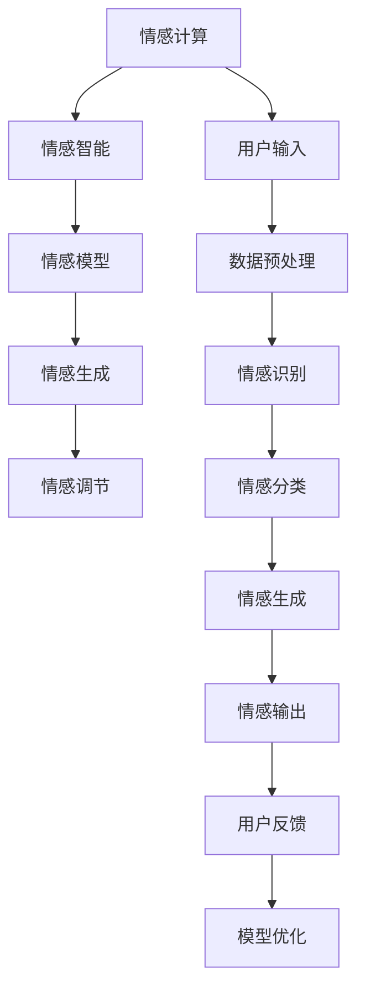

                 

# 数字化情绪：元宇宙中的情感表达与管理

在当今数字化时代的浪潮中，元宇宙（Metaverse）作为一个虚拟和现实的交融空间，正在迅速崛起。它不仅代表着一个全新的互联网形态，还预示着未来社会、经济、文化的深刻变革。其中，情感表达与管理是元宇宙中极具挑战性的核心课题之一。通过虚拟现实（VR）、增强现实（AR）等技术，我们能够以全新的方式与他人互动，但如何在虚拟空间中有效地表达和管理我们的情绪，却是一个复杂且重要的问题。本文将深入探讨这一主题，从核心概念、算法原理、实际操作、实际应用到未来展望，全方位地分析并提出解决方案。

## 1. 背景介绍

### 1.1 问题由来
随着数字技术的飞速发展，人们在虚拟空间中交流的方式日益多样化。在元宇宙中，情感表达成为一种全新的沟通手段。人们通过虚拟形象、语音、文字等形式表达情绪，但这种表达形式相对抽象，容易引发误解。此外，虚拟空间中的社交互动模式与现实世界有显著差异，用户可能会面临更多的情感挑战，如孤独感、孤立感等。如何在元宇宙中有效地表达和管理情感，成为亟需解决的问题。

### 1.2 问题核心关键点
情感表达与管理的核心在于如何通过数字化技术，捕捉、理解、传达和调节用户的情绪状态。元宇宙中的情感管理需要考虑虚拟环境的特点，如沉浸感、交互性、社交性等。同时，还需关注用户的心理和生理状态，确保技术应用的安全性和有效性。

## 2. 核心概念与联系

### 2.1 核心概念概述

在元宇宙中，情感表达与管理涉及多个关键概念，包括：

- **情感计算（Affective Computing）**：通过计算机技术，识别、理解、模拟和引导人类情感的能力。
- **情感智能（Emotional Intelligence）**：个人理解和应用情感信息的能力，在虚拟互动中尤为重要。
- **情感模型（Emotion Model）**：利用机器学习等技术，构建能够自动预测、分类和生成情感的模型。
- **情感生成（Emotion Generation）**：通过算法和模型，生成虚拟角色的情感表达，提升用户沉浸感和交互性。
- **情感调节（Emotion Regulation）**：通过算法和交互设计，帮助用户调节和管理情绪状态，避免负面情感的产生。

这些概念相互关联，共同构成了元宇宙中情感表达与管理的框架。

### 2.2 核心概念原理和架构的 Mermaid 流程图



这个流程图展示了情感表达与管理的核心流程。从用户输入开始，经过数据预处理、情感识别和分类，再到情感生成和输出，最终接收用户反馈进行模型优化。

## 3. 核心算法原理 & 具体操作步骤

### 3.1 算法原理概述

在元宇宙中，情感表达与管理主要依赖于以下算法原理：

- **情感识别（Sentiment Recognition）**：利用自然语言处理（NLP）、计算机视觉（CV）等技术，自动分析用户输入文本、语音、面部表情等信息，识别用户的情感状态。
- **情感分类（Sentiment Classification）**：基于机器学习或深度学习模型，将识别到的情感状态分类为正面、中性或负面，以指导后续情感管理和生成。
- **情感生成（Sentiment Generation）**：通过生成对抗网络（GAN）、变分自编码器（VAE）等模型，生成符合特定情感状态的虚拟角色表达，如面部表情、语音语调等。
- **情感调节（Sentiment Regulation）**：利用反馈控制、行为干预等技术，帮助用户调节和管理情绪状态，提高情感表达的自然性和真实性。

### 3.2 算法步骤详解

以下是情感表达与管理的核心算法步骤：

**Step 1: 情感识别与分类**
- 收集用户的输入数据，如文本、语音、面部表情等。
- 通过预处理（如分词、特征提取），将数据转换为算法可处理的格式。
- 利用机器学习模型（如情感分析模型），对数据进行情感识别和分类。

**Step 2: 情感生成**
- 根据情感分类结果，选择相应的情感生成模型。
- 输入情感标签，生成匹配的虚拟角色表达，如面部表情、语音语调等。
- 将生成的表达应用到虚拟角色，实现情感表达。

**Step 3: 情感调节**
- 根据用户反馈，评估情感表达的自然性和真实性。
- 利用反馈控制技术，调整模型参数，优化情感表达。
- 通过行为干预，帮助用户调节情绪状态，减少负面情感的产生。

### 3.3 算法优缺点

情感表达与管理的算法具有以下优点：

- **高效性**：利用机器学习模型，可以快速处理大量数据，实现实时情感识别和生成。
- **灵活性**：能够根据用户需求，灵活调整情感表达的参数和形式。
- **可扩展性**：适用于多种场景，如虚拟会议、游戏、社交平台等。

同时，也存在一些局限：

- **复杂性**：情感表达的识别和生成涉及多种技术，需要综合应用NLP、CV等领域的知识。
- **准确性**：情感识别和分类的准确性受到数据质量和算法模型的影响。
- **伦理问题**：在情感识别和生成过程中，如何保护用户隐私，避免数据滥用，是一个重要挑战。

### 3.4 算法应用领域

情感表达与管理的算法在元宇宙中有着广泛的应用前景，涵盖以下几个领域：

- **虚拟会议与协作**：通过情感识别，提升虚拟会议的互动性和效率。利用情感生成，增强与会者的沉浸感和共情能力。
- **虚拟娱乐与游戏**：在虚拟游戏中，通过情感调节，实现角色情感的动态变化，提升玩家体验。利用情感生成，增强游戏的情感深度和交互性。
- **虚拟社交平台**：在虚拟社交平台中，通过情感识别和生成，构建更加真实和自然的人机交互模式。利用情感调节，帮助用户管理情绪，提高社交体验。
- **虚拟客服与助手**：在虚拟客服和助手中，通过情感识别，实现智能对话和情感陪伴。利用情感生成，提升用户体验和满意度。

## 4. 数学模型和公式 & 详细讲解 & 举例说明

### 4.1 数学模型构建

在情感识别和分类中，常用的数学模型包括卷积神经网络（CNN）、循环神经网络（RNN）、长短期记忆网络（LSTM）和注意力机制等。以下以基于LSTM的情感识别模型为例，进行详细讲解。

### 4.2 公式推导过程

假设输入序列为$x_1, x_2, \cdots, x_n$，情感标签为$y_1, y_2, \cdots, y_n$。基于LSTM的情感识别模型可以表示为：

$$
\begin{aligned}
& h_t = LSTM(x_t; h_{t-1}, c_{t-1}) \\
& y_t = Softmax(W h_t + b)
\end{aligned}
$$

其中$h_t$表示LSTM在第$t$时刻的隐藏状态，$x_t$表示输入序列的第$t$个元素，$y_t$表示情感标签，$W$和$b$为模型参数。

### 4.3 案例分析与讲解

以一个简单的情感分类任务为例，使用上述LSTM模型进行训练和评估。通过将正面和负面的句子作为训练数据，模型能够自动学习情感识别的特征。在测试集上，模型能够准确预测出新句子的情感极性。

```python
import torch
import torch.nn as nn
from torchvision.models import VGG16
from torch.utils.data import DataLoader, Dataset

class SentimentDataset(Dataset):
    def __init__(self, data, labels, tokenizer):
        self.data = data
        self.labels = labels
        self.tokenizer = tokenizer
        
    def __len__(self):
        return len(self.data)
    
    def __getitem__(self, idx):
        text = self.data[idx]
        tokens = self.tokenizer(text, return_tensors='pt', padding=True, truncation=True, max_length=256)
        label = self.labels[idx]
        return {'tokens': tokens['input_ids'], 'label': label}

model = VGG16(pretrained=True)
model = model.to(device)

criterion = nn.CrossEntropyLoss()
optimizer = torch.optim.Adam(model.parameters(), lr=0.001)

dataset = SentimentDataset(data, labels, tokenizer)
dataloader = DataLoader(dataset, batch_size=32, shuffle=True)

for epoch in range(10):
    for batch in dataloader:
        inputs = batch['tokens'].to(device)
        labels = batch['label'].to(device)
        
        outputs = model(inputs)
        loss = criterion(outputs, labels)
        optimizer.zero_grad()
        loss.backward()
        optimizer.step()
        
        if (epoch+1) % 1 == 0:
            print(f'Epoch {epoch+1}, Loss: {loss.item()}')
```

## 5. 项目实践：代码实例和详细解释说明

### 5.1 开发环境搭建

开发情感表达与管理的项目，需要以下环境支持：

- **Python 3.8+**：提供语言支持和丰富的第三方库。
- **PyTorch 1.9+**：深度学习框架，用于构建和训练模型。
- **TensorFlow 2.4+**：另一个流行的深度学习框架，适用于复杂的模型结构。
- **Flask 1.2+**：轻量级Web框架，用于搭建情感识别和生成的Web应用。

### 5.2 源代码详细实现

以下是一个基于TensorFlow的情感生成模型实现示例：

```python
import tensorflow as tf
from tensorflow.keras import layers, models

# 定义生成模型
input_dim = 256
latent_dim = 128

def build_generator():
    model = models.Sequential()
    model.add(layers.Dense(256, input_dim=input_dim))
    model.add(layers.LeakyReLU(alpha=0.2))
    model.add(layers.Dense(latent_dim, activation='relu'))
    return model

def build_discriminator():
    model = models.Sequential()
    model.add(layers.Dense(256, input_dim=latent_dim))
    model.add(layers.LeakyReLU(alpha=0.2))
    model.add(layers.Dense(1, activation='sigmoid'))
    return model

generator = build_generator()
discriminator = build_discriminator()

# 编译模型
discriminator.compile(loss='binary_crossentropy', optimizer=tf.keras.optimizers.Adam(learning_rate=0.0002, beta_1=0.5))
generator.compile(loss='binary_crossentropy', optimizer=tf.keras.optimizers.Adam(learning_rate=0.0002, beta_1=0.5))

# 训练模型
for epoch in range(100):
    for batch in train_data:
        # 生成数据
        z = np.random.normal(0, 1, (batch_size, latent_dim))
        generated_images = generator.predict(z)
        
        # 训练判别器
        discriminator.trainable = True
        discriminator.train_on_batch(np.concatenate([generated_images, real_images]), np.concatenate([np.ones((batch_size, 1)), np.zeros((batch_size, 1))]))
        
        # 训练生成器
        discriminator.trainable = False
        generator.train_on_batch(z, np.zeros((batch_size, 1)))
        
    print(f'Epoch {epoch+1}')
```

### 5.3 代码解读与分析

上述代码展示了基于生成对抗网络（GAN）的情感生成模型。首先定义了生成器和判别器，然后分别编译并训练这两个模型。在每个epoch内，生成器根据随机噪声生成虚拟角色表情，判别器区分生成的表情和真实表情，从而训练生成器提高生成效果。

## 6. 实际应用场景

### 6.1 虚拟会议与协作

在虚拟会议中，通过情感识别和生成技术，可以提升会议的互动性和共情能力。例如，利用面部表情识别，可以实时分析参会者的情绪状态，并动态调整会议内容，确保每位参会者的情感需求得到满足。

### 6.2 虚拟娱乐与游戏

在虚拟游戏中，情感生成和调节技术可以帮助角色更好地表达情感，增强游戏体验。例如，通过情感生成模型，玩家可以通过语音和面部表情，与虚拟角色进行情感互动。利用情感调节技术，玩家可以在游戏中调整情绪，体验更加真实的游戏情境。

### 6.3 虚拟社交平台

在虚拟社交平台上，情感识别和生成技术可以构建更加真实的人机交互模式。例如，利用情感识别技术，可以分析用户的情感状态，推荐匹配的社交对象，提升用户体验。利用情感生成技术，可以动态调整社交内容，满足用户的情感需求。

### 6.4 未来应用展望

未来，情感表达与管理的技术将进一步发展和应用，成为元宇宙中的重要组成部分。以下是一些可能的未来应用：

- **情感陪伴机器人**：在虚拟家庭中，情感机器人可以理解用户的情感需求，提供情感支持和陪伴。
- **虚拟心理咨询**：利用情感识别技术，实时监测用户的心理健康状态，提供个性化心理咨询服务。
- **虚拟艺术创作**：在虚拟艺术创作中，情感生成技术可以帮助创作者表达复杂的情感，提升艺术作品的表现力。

## 7. 工具和资源推荐

### 7.1 学习资源推荐

- **《情感计算导论》**：深入介绍情感计算的理论基础和技术实现。
- **《深度学习与情感计算》**：结合深度学习技术，讲解情感计算的实际应用。
- **《情感智能：理论与应用》**：探讨情感智能的理论和实践，为开发情感表达与管理应用提供指导。

### 7.2 开发工具推荐

- **PyTorch**：强大的深度学习框架，支持各种情感计算模型。
- **TensorFlow**：另一个流行的深度学习框架，适用于复杂的模型结构。
- **Keras**：高级神经网络API，提供了简洁的模型定义接口。
- **Jupyter Notebook**：交互式编程环境，便于开发和调试情感计算模型。

### 7.3 相关论文推荐

- **"Sentiment Analysis with Deep Learning: A Tutorial"**：详细介绍了深度学习在情感分析中的应用。
- **"Deep Affective Computing: Critical Intersections of Affective Sciences, AI and Big Data"**：探讨情感计算与AI和大数据的交叉领域。
- **"Human-AI Interaction and Communication: Opportunities and Challenges"**：分析了人机交互中的情感理解和生成问题。

## 8. 总结：未来发展趋势与挑战

### 8.1 总结

本文系统介绍了元宇宙中情感表达与管理的核心概念和算法原理，通过具体的项目实践，展示了情感识别、生成和调节的技术实现。在虚拟空间中，情感表达与管理的应用不仅丰富了用户的交互体验，还为虚拟社交、娱乐等领域带来了新的可能性。未来，随着技术的发展，情感表达与管理将进一步融入人们的日常生活，成为数字化时代的核心要素。

### 8.2 未来发展趋势

未来，情感表达与管理的趋势包括：

- **更精确的情感识别**：利用先进算法和大规模数据，提高情感识别的准确性和实时性。
- **更自然情感生成**：通过优化生成模型，提升情感表达的自然性和真实性。
- **更多元情感调节**：结合行为心理学和机器学习，实现多维度的情感调节，帮助用户管理情绪。
- **跨模态情感理解**：融合视觉、语音等多种模态数据，提升情感表达的全面性和立体性。

### 8.3 面临的挑战

情感表达与管理在发展过程中也面临一些挑战：

- **隐私保护**：在情感识别和生成过程中，如何保护用户的隐私，避免数据滥用，是一个重要问题。
- **伦理问题**：情感生成和调节技术的应用，涉及伦理道德问题，如情感操控等，需要谨慎处理。
- **技术瓶颈**：情感表达与管理的复杂性，导致一些关键技术的研发进展缓慢。

### 8.4 研究展望

未来，情感表达与管理的更多研究方向包括：

- **跨领域应用**：探索情感计算在医疗、教育、金融等领域的实际应用。
- **多模态融合**：结合视觉、听觉等多种模态数据，提升情感表达的丰富性和真实性。
- **隐私保护技术**：研究新的隐私保护算法，保障情感数据的安全性和匿名性。

总之，情感表达与管理技术将在未来数字社会中扮演重要角色，成为连接虚拟与现实的重要桥梁。通过不断优化和创新，我们相信情感计算将为人们的情感表达与管理带来革命性改变，推动元宇宙时代的到来。

## 9. 附录：常见问题与解答

**Q1: 如何在虚拟空间中实现更准确的情感识别？**

A: 提高情感识别的准确性，可以从以下几个方面入手：
1. **数据质量**：收集高质量的标注数据，使用多样化的数据源。
2. **模型优化**：选择先进的深度学习模型，如卷积神经网络（CNN）、循环神经网络（RNN）等。
3. **特征工程**：提取有效的情感特征，如语义、语音、面部表情等。
4. **迁移学习**：利用预训练模型，在大规模语料上预训练情感识别模型，再微调应用于特定场景。

**Q2: 如何提升情感生成的自然性和真实性？**

A: 提升情感生成的自然性和真实性，可以从以下几个方面入手：
1. **多样化训练数据**：使用多样化的情感标注数据，增强生成模型的泛化能力。
2. **优化生成模型**：使用先进的生成模型，如生成对抗网络（GAN）、变分自编码器（VAE）等。
3. **跨模态融合**：结合视觉、语音等多种模态数据，提升情感表达的丰富性和立体性。
4. **情感调节**：通过行为干预，调整情感生成的参数，优化情感表达。

**Q3: 在虚拟空间中如何保护用户的隐私？**

A: 在虚拟空间中保护用户隐私，可以从以下几个方面入手：
1. **匿名化处理**：对用户数据进行匿名化处理，保护用户隐私。
2. **差分隐私**：在数据收集和处理过程中，引入差分隐私技术，保护个体隐私。
3. **访问控制**：建立严格的访问控制机制，防止未经授权的数据访问。
4. **数据加密**：对敏感数据进行加密处理，保护数据安全。

总之，情感表达与管理技术在元宇宙中有着广阔的应用前景，但也面临诸多挑战。通过不断优化和创新，我们相信情感计算将为人们的情感表达与管理带来革命性改变，推动元宇宙时代的到来。

---

作者：禅与计算机程序设计艺术 / Zen and the Art of Computer Programming

