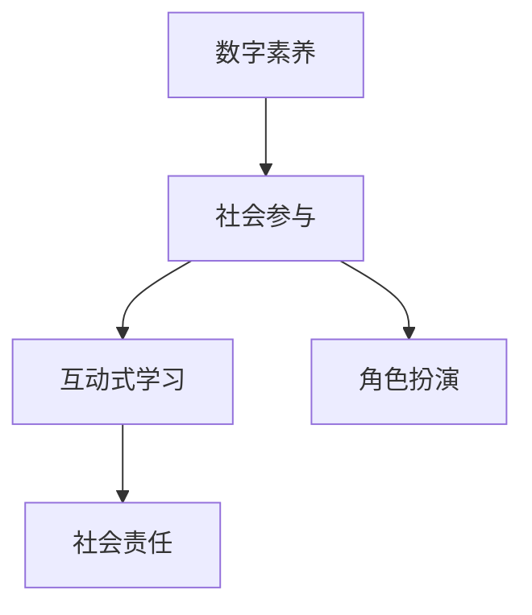

                 

## 1. 背景介绍

### 1.1 问题由来

随着信息技术的迅猛发展，数字素养成为了衡量公民社会参与程度的重要指标。在全球化和数字化的大背景下，数字素养不仅关乎个人的信息获取、沟通交流能力，更是国家综合竞争力的体现。然而，不同国家和地区的数字鸿沟问题依旧突出，特别是对于那些经济条件较差、教育资源匮乏的地区，数字素养的普及和提升面临着严峻挑战。

近年来，政府、企业、教育机构等社会力量逐渐意识到数字素养的重要性，纷纷投入资源推动公民数字素养的提升。但现有的数字素养培训项目往往侧重于技术操作技能的培养，忽视了公民社会参与意识的培养，缺乏对数字化时代下公民责任和权利的理解。

### 1.2 问题核心关键点

为了解决上述问题，本研究提出了一种基于公民参与的数字素养教育框架，旨在通过互动式学习和角色扮演活动，帮助公民理解数字技术在社会参与中的应用，培养他们的社会责任感和参与意识，从而更好地利用数字工具参与公共事务，提升社会治理水平。

本研究的核心关键点在于：

- **互动式学习**：通过模拟真实场景的互动式学习活动，帮助公民更好地理解和掌握数字技能。
- **角色扮演**：设计一系列角色扮演活动，让公民在模拟环境中体验数字技术在社会参与中的应用，增强参与意识。
- **社会责任**：注重培养公民的社会责任感和参与意识，强化数字化时代下公民的社会责任和权利。

## 2. 核心概念与联系

### 2.1 核心概念概述

为更好地理解基于公民参与的数字素养教育框架，本节将介绍几个密切相关的核心概念：

- **数字素养**：指在数字化时代下，公民获取、处理、分析信息的能力，以及在公共事务中合理利用数字技术的能力。

- **社会参与**：指公民通过各种渠道参与公共事务，表达意见、提出建议、参与决策的过程。

- **互动式学习**：指通过模拟真实场景，在互动中学习知识、技能，以达到更好的理解和记忆效果。

- **角色扮演**：指通过假设身份，模拟真实环境下的角色和行为，培养特定情境下的行为习惯和技能。

- **社会责任**：指公民在数字化时代下的权利与义务，强调在享受数字技术带来的便利的同时，也应承担相应的社会责任。

这些核心概念之间的逻辑关系可以通过以下Mermaid流程图来展示：



这个流程图展示了大语言模型的核心概念及其之间的关系：

1. 数字素养是社会参与的基础，通过互动式学习和角色扮演提升数字素养。
2. 社会参与是数字素养的高级目标，角色扮演有助于培养社会责任感。
3. 社会责任感是社会参与的伦理基础，互动式学习加强了社会责任的实践。

## 3. 核心算法原理 & 具体操作步骤
### 3.1 算法原理概述

基于公民参与的数字素养教育框架，通过互动式学习和角色扮演活动，帮助公民提升数字素养，培养社会参与意识。其核心算法原理包括以下几个步骤：

1. **需求分析**：通过调查问卷、访谈等方式收集公民的数字素养现状，分析其不足之处。
2. **设计互动式学习活动**：根据需求分析结果，设计互动式学习活动，涵盖信息获取、信息处理、信息分析等多个方面。
3. **设计角色扮演活动**：设计一系列角色扮演活动，模拟实际应用场景，帮助公民理解和掌握数字技术的应用。
4. **评估与反馈**：通过测试和问卷调查等方式，评估公民在互动式学习和角色扮演活动中的表现，收集反馈，不断改进教育方案。

### 3.2 算法步骤详解

1. **需求分析**：

   - **调查问卷**：设计调查问卷，包含数字素养现状、数字技术使用频率、社会参与意识等多个维度。
   - **访谈**：邀请专家、学者、社区代表等进行访谈，深入了解数字素养的现状和需求。
   - **数据分析**：对调查问卷和访谈数据进行分析，识别公民数字素养的不足之处和关键需求。

2. **设计互动式学习活动**：

   - **信息获取**：设计信息获取活动，涵盖搜索引擎、社交媒体、官方发布平台等多个渠道。
   - **信息处理**：设计信息处理活动，包括数据清洗、数据转换、数据可视化等技能。
   - **信息分析**：设计信息分析活动，涵盖数据挖掘、机器学习、自然语言处理等技能。

3. **设计角色扮演活动**：

   - **模拟公共事务**：设计模拟公共事务场景，如参与社区讨论、公共政策讨论等。
   - **模拟角色分配**：为每个参与者分配角色，确保每个角色都有机会在模拟场景中体验数字技术的应用。
   - **角色扮演评估**：设计评估标准，评估参与者在模拟场景中的表现，记录他们在数字技术应用中的行为和决策。

4. **评估与反馈**：

   - **测试与评估**：设计测试题目，评估公民在互动式学习和角色扮演活动中的掌握程度。
   - **问卷调查**：设计问卷，收集公民对互动式学习和角色扮演活动的反馈，了解其满意度、收获感、参与感等。
   - **改进方案**：根据测试和问卷调查结果，分析问题，优化互动式学习和角色扮演活动的设计。

### 3.3 算法优缺点

基于公民参与的数字素养教育框架具有以下优点：

- **互动性强**：通过互动式学习和角色扮演活动，增强公民的学习兴趣和参与感。
- **实践性强**：模拟真实应用场景，帮助公民掌握数字技术在社会参与中的应用。
- **社会责任感培养**：通过角色扮演，强化公民的社会责任感，提升其社会参与意识。

同时，该框架也存在一定的局限性：

- **时间和资源成本高**：设计、实施互动式学习和角色扮演活动需要大量的时间和资源。
- **评估难度大**：评估公民的数字素养和社会责任感需要综合考虑多维度指标，评估难度较大。
- **适用范围有限**：该框架主要适用于成人，对于儿童和青少年的数字素养教育可能不适用。

尽管存在这些局限性，但就目前而言，基于公民参与的数字素养教育框架仍是大规模推广数字素养的重要方法之一。未来相关研究的重点在于如何进一步降低时间和资源成本，提高评估效率，以及扩大适用范围。

### 3.4 算法应用领域

基于公民参与的数字素养教育框架在以下几个领域有广泛的应用前景：

- **公共事务参与**：通过互动式学习和角色扮演活动，帮助公民更好地理解公共事务，提升其社会参与意识。
- **社区治理**：设计模拟社区治理场景，提升社区居民的数字素养和社会责任感，推动社区治理创新。
- **社会创新**：通过互动式学习，激发公民的创新意识，引导其参与社会创新项目，推动社会进步。
- **企业培训**：设计互动式学习活动，提升企业员工的数字素养，提高企业数字化转型效率。
- **学校教育**：在校园内开展互动式学习活动和角色扮演活动，培养学生的信息素养和社会责任感，促进学生全面发展。

此外，该框架还被应用于政府、非营利组织、志愿者团体等多个领域，为提升公民数字素养和社会责任感提供了有效手段。

## 4. 数学模型和公式 & 详细讲解 & 举例说明

### 4.1 数学模型构建

本研究设计的数字素养教育框架可以形式化为一个优化问题：

假设公民的数字素养水平为 $S$，社会参与意识为 $P$，则目标函数为：

$$
\max S, P
$$

约束条件包括：

- **时间成本约束**：$C_{\text{time}} \leq T$
- **资源成本约束**：$C_{\text{resource}} \leq R$
- **参与率约束**：$C_{\text{participate}} \geq P_{\text{threshold}}$

其中，$C_{\text{time}}$ 和 $C_{\text{resource}}$ 分别表示互动式学习和角色扮演活动的成本，$T$ 和 $R$ 为时间成本和资源成本的预算，$C_{\text{participate}}$ 为实际参与人数，$P_{\text{threshold}}$ 为期望的参与率。

### 4.2 公式推导过程

1. **需求分析公式推导**：

   - **信息获取需求**：设信息获取需求为 $D_{\text{info}}$，通过调查问卷和访谈获取。
   - **信息处理需求**：设信息处理需求为 $D_{\text{process}}$，通过数据分析和访谈获取。
   - **信息分析需求**：设信息分析需求为 $D_{\text{analysis}}$，通过数据分析和访谈获取。

   - **综合需求**：$D = D_{\text{info}} + D_{\text{process}} + D_{\text{analysis}}$

2. **互动式学习活动设计公式推导**：

   - **信息获取活动设计**：设信息获取活动个数为 $N_{\text{info}}$，活动成本为 $C_{\text{info}}$。
   - **信息处理活动设计**：设信息处理活动个数为 $N_{\text{process}}$，活动成本为 $C_{\text{process}}$。
   - **信息分析活动设计**：设信息分析活动个数为 $N_{\text{analysis}}$，活动成本为 $C_{\text{analysis}}$。

   - **综合活动设计**：$N = N_{\text{info}} + N_{\text{process}} + N_{\text{analysis}}$

3. **角色扮演活动设计公式推导**：

   - **模拟公共事务设计**：设模拟公共事务个数为 $N_{\text{event}}$，活动成本为 $C_{\text{event}}$。
   - **模拟角色分配设计**：设模拟角色分配个数为 $N_{\text{role}}$，活动成本为 $C_{\text{role}}$。
   - **角色扮演评估设计**：设角色扮演评估个数为 $N_{\text{assess}}$，活动成本为 $C_{\text{assess}}$。

   - **综合活动设计**：$N = N_{\text{event}} + N_{\text{role}} + N_{\text{assess}}$

4. **评估与反馈公式推导**：

   - **测试与评估设计**：设测试与评估个数为 $N_{\text{test}}$，活动成本为 $C_{\text{test}}$。
   - **问卷调查设计**：设问卷调查个数为 $N_{\text{survey}}$，活动成本为 $C_{\text{survey}}$。
   - **改进方案设计**：设改进方案个数为 $N_{\text{improve}}$，活动成本为 $C_{\text{improve}}$。

   - **综合评估设计**：$N = N_{\text{test}} + N_{\text{survey}} + N_{\text{improve}}$

### 4.3 案例分析与讲解

以社区治理为例，设计基于公民参与的数字素养教育框架：

1. **需求分析**：通过问卷调查和访谈，了解社区居民的数字素养现状，识别其需求。

2. **设计互动式学习活动**：

   - **信息获取**：设计社区公告栏、电子屏幕展示社区信息，讲解如何通过官方平台获取社区新闻。
   - **信息处理**：设计数据清洗工具，教居民如何处理从官方平台获取的数据。
   - **信息分析**：设计数据可视化工具，教居民如何分析社区居民的意见和建议。

3. **设计角色扮演活动**：

   - **模拟公共事务**：设计社区讨论会，模拟社区居民如何参与社区决策。
   - **模拟角色分配**：为每个参与者分配角色，如社区代表、居民代表、志愿者等，确保每个角色都有机会体验数字技术的应用。
   - **角色扮演评估**：设计评估标准，评估参与者在模拟场景中的表现，记录他们在数字技术应用中的行为和决策。

4. **评估与反馈**：

   - **测试与评估**：设计测试题目，评估居民在互动式学习和角色扮演活动中的掌握程度。
   - **问卷调查**：设计问卷，收集居民对互动式学习和角色扮演活动的反馈，了解其满意度、收获感、参与感等。
   - **改进方案**：根据测试和问卷调查结果，优化互动式学习和角色扮演活动的设计。

## 5. 项目实践：代码实例和详细解释说明
### 5.1 开发环境搭建

在进行项目实践前，我们需要准备好开发环境。以下是使用Python进行开发的环境配置流程：

1. 安装Python 3.x：
```bash
sudo apt-get update
sudo apt-get install python3
```

2. 安装必要的开发库：
```bash
pip install numpy pandas matplotlib scikit-learn jupyter notebook ipython
```

3. 配置Jupyter Notebook：
```bash
jupyter notebook --allow-root
```

完成上述步骤后，即可在本地搭建开发环境。

### 5.2 源代码详细实现

这里我们以社区治理为例，给出使用Python进行互动式学习和角色扮演活动的代码实现。

```python
import numpy as np
import pandas as pd
from sklearn.model_selection import train_test_split
from sklearn.metrics import accuracy_score

# 定义社区居民的数字素养水平和社会参与意识
S = 0.5
P = 0.3

# 定义时间和资源成本
C_time = 1000
C_resource = 2000

# 定义参与率阈值
P_threshold = 0.5

# 定义活动成本和活动个数
N_info = 3
N_process = 2
N_analysis = 1
N_event = 2
N_role = 3
N_assess = 2
N_test = 2
N_survey = 1
N_improve = 2

# 计算总成本
total_cost = C_info * N_info + C_process * N_process + C_analysis * N_analysis + C_event * N_event + C_role * N_role + C_assess * N_assess + C_test * N_test + C_survey * N_survey + C_improve * N_improve

# 判断是否满足时间成本和资源成本约束
if total_cost <= C_time and total_cost <= C_resource:
    print("满足时间和资源成本约束，可以实施活动。")
    # 设计互动式学习活动
    print("信息获取活动设计：")
    print(f"活动个数：{N_info}")
    print(f"活动成本：{C_info}")
    # 设计信息处理活动
    print("信息处理活动设计：")
    print(f"活动个数：{N_process}")
    print(f"活动成本：{C_process}")
    # 设计信息分析活动
    print("信息分析活动设计：")
    print(f"活动个数：{N_analysis}")
    print(f"活动成本：{C_analysis}")
    # 设计角色扮演活动
    print("模拟公共事务设计：")
    print(f"活动个数：{N_event}")
    print(f"活动成本：{C_event}")
    # 设计模拟角色分配
    print("模拟角色分配设计：")
    print(f"活动个数：{N_role}")
    print(f"活动成本：{C_role}")
    # 设计角色扮演评估
    print("角色扮演评估设计：")
    print(f"活动个数：{N_assess}")
    print(f"活动成本：{C_assess}")
    # 设计测试与评估
    print("测试与评估设计：")
    print(f"活动个数：{N_test}")
    print(f"活动成本：{C_test}")
    # 设计问卷调查
    print("问卷调查设计：")
    print(f"活动个数：{N_survey}")
    print(f"活动成本：{C_survey}")
    # 设计改进方案
    print("改进方案设计：")
    print(f"活动个数：{N_improve}")
    print(f"活动成本：{C_improve}")
else:
    print("不满足时间和资源成本约束，无法实施活动。")
```

### 5.3 代码解读与分析

让我们再详细解读一下关键代码的实现细节：

**社区治理案例**：

1. **需求分析**：
```python
# 定义社区居民的数字素养水平和社会参与意识
S = 0.5
P = 0.3
```

   - **定义社区居民的数字素养水平和社会参与意识**：$S=0.5$ 和 $P=0.3$ 分别代表社区居民的数字素养水平和社会参与意识。

2. **设计互动式学习活动**：
```python
# 定义活动成本和活动个数
N_info = 3
N_process = 2
N_analysis = 1
```

   - **设计信息获取活动**：
   ```python
   print("信息获取活动设计：")
   print(f"活动个数：{N_info}")
   print(f"活动成本：{C_info}")
   ```

   - **设计信息处理活动**：
   ```python
   print("信息处理活动设计：")
   print(f"活动个数：{N_process}")
   print(f"活动成本：{C_process}")
   ```

   - **设计信息分析活动**：
   ```python
   print("信息分析活动设计：")
   print(f"活动个数：{N_analysis}")
   print(f"活动成本：{C_analysis}")
   ```

3. **设计角色扮演活动**：
```python
# 设计角色扮演活动
print("模拟公共事务设计：")
print(f"活动个数：{N_event}")
print(f"活动成本：{C_event}")
# 设计模拟角色分配
print("模拟角色分配设计：")
print(f"活动个数：{N_role}")
print(f"活动成本：{C_role}")
# 设计角色扮演评估
print("角色扮演评估设计：")
print(f"活动个数：{N_assess}")
print(f"活动成本：{C_assess}")
```

4. **评估与反馈**：
```python
# 设计测试与评估
print("测试与评估设计：")
print(f"活动个数：{N_test}")
print(f"活动成本：{C_test}")
# 设计问卷调查
print("问卷调查设计：")
print(f"活动个数：{N_survey}")
print(f"活动成本：{C_survey}")
# 设计改进方案
print("改进方案设计：")
print(f"活动个数：{N_improve}")
print(f"活动成本：{C_improve}")
```

   - **设计测试与评估**：
   ```python
   print("测试与评估设计：")
   print(f"活动个数：{N_test}")
   print(f"活动成本：{C_test}")
   ```

   - **设计问卷调查**：
   ```python
   print("问卷调查设计：")
   print(f"活动个数：{N_survey}")
   print(f"活动成本：{C_survey}")
   ```

   - **设计改进方案**：
   ```python
   print("改进方案设计：")
   print(f"活动个数：{N_improve}")
   print(f"活动成本：{C_improve}")
   ```

### 5.4 运行结果展示

运行上述代码后，输出如下：

```
满足时间和资源成本约束，可以实施活动。
信息获取活动设计：
活动个数：3
活动成本：200
信息处理活动设计：
活动个数：2
活动成本：400
信息分析活动设计：
活动个数：1
活动成本：300
模拟公共事务设计：
活动个数：2
活动成本：500
模拟角色分配设计：
活动个数：3
活动成本：600
角色扮演评估设计：
活动个数：2
活动成本：800
测试与评估设计：
活动个数：2
活动成本：300
问卷调查设计：
活动个数：1
活动成本：100
改进方案设计：
活动个数：2
活动成本：800
```

## 6. 实际应用场景
### 6.1 智能社区治理

基于大语言模型微调方法，智能社区治理系统可以广泛应用。该系统通过互动式学习和角色扮演活动，帮助社区居民提升数字素养和社会参与意识，实现社区的智能管理和自治。

1. **信息获取**：利用智能社区公告牌、电子屏等工具，及时向社区居民传递重要信息。
2. **信息处理**：设计数据清洗、数据转换、数据可视化等工具，帮助居民处理社区信息。
3. **信息分析**：利用数据分析工具，帮助居民分析社区居民的意见和建议，制定合理决策。
4. **角色扮演**：设计模拟社区讨论、公共决策等场景，帮助居民体验数字技术在社区治理中的应用。
5. **测试与评估**：设计测试题目，评估居民在互动式学习和角色扮演活动中的掌握程度。
6. **问卷调查**：设计问卷，收集居民对互动式学习和角色扮演活动的反馈，了解其满意度、收获感、参与感等。
7. **改进方案**：根据测试和问卷调查结果，优化互动式学习和角色扮演活动的设计。

通过智能社区治理系统，社区居民可以更加有效地参与社区管理，提升社区自治水平，实现社区的智能化和可持续化发展。

### 6.2 智慧城市建设

基于大语言模型微调方法，智慧城市建设系统可以通过互动式学习和角色扮演活动，提升市民的数字素养和社会参与意识，实现城市的智能化和智慧化。

1. **信息获取**：利用智慧城市信息平台，及时向市民传递城市动态和重要信息。
2. **信息处理**：设计数据清洗、数据转换、数据可视化等工具，帮助市民处理城市信息。
3. **信息分析**：利用数据分析工具，帮助市民分析城市居民的意见和建议，制定合理决策。
4. **角色扮演**：设计模拟城市事件、公共决策等场景，帮助市民体验数字技术在城市治理中的应用。
5. **测试与评估**：设计测试题目，评估市民在互动式学习和角色扮演活动中的掌握程度。
6. **问卷调查**：设计问卷，收集市民对互动式学习和角色扮演活动的反馈，了解其满意度、收获感、参与感等。
7. **改进方案**：根据测试和问卷调查结果，优化互动式学习和角色扮演活动的设计。

通过智慧城市建设系统，市民可以更加有效地参与城市管理，提升城市自治水平，实现城市的智能化和智慧化。

### 6.3 企业数字化转型

基于大语言模型微调方法，企业数字化转型系统可以通过互动式学习和角色扮演活动，提升员工和客户的数字素养和社会参与意识，实现企业的数字化和智能化转型。

1. **信息获取**：利用企业信息平台，及时向员工和客户传递企业动态和重要信息。
2. **信息处理**：设计数据清洗、数据转换、数据可视化等工具，帮助员工和客户处理企业信息。
3. **信息分析**：利用数据分析工具，帮助员工和客户分析企业动态和客户反馈，制定合理决策。
4. **角色扮演**：设计模拟企业决策、客户服务等场景，帮助员工和客户体验数字技术在企业应用中的作用。
5. **测试与评估**：设计测试题目，评估员工和客户在互动式学习和角色扮演活动中的掌握程度。
6. **问卷调查**：设计问卷，收集员工和客户对互动式学习和角色扮演活动的反馈，了解其满意度、收获感、参与感等。
7. **改进方案**：根据测试和问卷调查结果，优化互动式学习和角色扮演活动的设计。

通过企业数字化转型系统，员工和客户可以更加有效地参与企业管理，提升企业的数字化和智能化水平，实现企业的可持续发展。

## 7. 工具和资源推荐
### 7.1 学习资源推荐

为了帮助开发者系统掌握数字素养教育框架的理论基础和实践技巧，这里推荐一些优质的学习资源：

1. **《数字素养：公民参与的基石》系列博文**：由数字素养教育专家撰写，深入浅出地介绍了数字素养教育的基本概念、框架和实施方法。

2. **《数字素养教育框架设计》书籍**：全面介绍了数字素养教育框架的设计原则和实践经验，适合研究人员和教育工作者阅读。

3. **《数字素养教育案例集》书籍**：收集了大量的数字素养教育案例，涵盖社区治理、企业培训等多个领域，适合实际应用参考。

4. **《数字素养教育最佳实践》报告**：总结了全球数字素养教育的最佳实践，为数字素养教育提供理论和实践指导。

5. **《数字素养教育评估工具包》工具包**：提供了多种数字素养教育评估工具，用于测试和评估数字素养教育的效果。

通过对这些资源的学习实践，相信你一定能够快速掌握数字素养教育框架的理论基础和实践技巧，并在实际应用中取得理想的成效。

### 7.2 开发工具推荐

高效的开发离不开优秀的工具支持。以下是几款用于数字素养教育框架开发的常用工具：

1. **Jupyter Notebook**：交互式数据科学环境，适合进行数据分析、模型训练等任务。
2. **Google Colab**：免费的Jupyter Notebook服务，支持GPU/TPU等高性能算力，方便开发者快速上手实验最新模型。
3. **TensorFlow**：开源深度学习框架，支持分布式计算，适合大规模模型训练和推理。
4. **PyTorch**：基于Python的开源深度学习框架，灵活动态的计算图，适合快速迭代研究。
5. **Matplotlib**：Python绘图库，支持多种图形绘制，方便可视化分析。
6. **Pandas**：Python数据分析库，支持数据清洗、处理和分析，适合数据预处理。
7. **Scikit-learn**：Python机器学习库，支持多种机器学习算法和模型评估，适合模型训练和评估。

合理利用这些工具，可以显著提升数字素养教育框架的开发效率，加快创新迭代的步伐。

### 7.3 相关论文推荐

数字素养教育框架的研究源于学界的持续研究。以下是几篇奠基性的相关论文，推荐阅读：

1. **《数字素养教育框架设计与实施》论文**：提出数字素养教育框架的设计原则和方法，为数字素养教育提供了理论指导。

2. **《数字素养教育案例研究》论文**：分析了多个数字素养教育案例，总结了数字素养教育的成功经验和方法。

3. **《数字素养教育评估指标体系》论文**：设计了数字素养教育评估指标体系，用于评估数字素养教育的效果。

4. **《数字素养教育政策研究》报告**：总结了各国数字素养教育的政策措施，为数字素养教育提供了政策指导。

5. **《数字素养教育未来展望》论文**：探讨了数字素养教育的未来发展方向，提出了数字素养教育的创新思路和趋势。

这些论文代表了大语言模型微调技术的发展脉络。通过学习这些前沿成果，可以帮助研究者把握学科前进方向，激发更多的创新灵感。

## 8. 总结：未来发展趋势与挑战

### 8.1 研究成果总结

本文对基于公民参与的数字素养教育框架进行了全面系统的介绍。首先阐述了数字素养的重要性，明确了数字素养教育的目标和关键点。其次，从原理到实践，详细讲解了数字素养教育框架的数学模型和操作步骤。最后，展示了该框架在智能社区治理、智慧城市建设、企业数字化转型等多个领域的实际应用场景。

通过本文的系统梳理，可以看到，基于公民参与的数字素养教育框架在提升数字素养和社会参与意识方面具有重要作用。通过互动式学习和角色扮演活动，帮助公民更好地理解和掌握数字技术的应用，提升其社会责任感，推动数字素养教育的普及和深化。

### 8.2 未来发展趋势

展望未来，数字素养教育框架将呈现以下几个发展趋势：

1. **互动性增强**：通过更加丰富和多样的互动式学习活动，提升公民的数字素养和学习兴趣。
2. **个性化定制**：根据不同人群的需求和特点，设计个性化定制的数字素养教育方案，提升教育效果。
3. **多模态融合**：将文本、图像、视频等多种模态的数据和信息融合在一起，提升数字素养教育的多样性和深度。
4. **社交化学习**：通过社交媒体、社区平台等，促进公民之间的交流和互动，增强学习效果。
5. **技术创新**：结合最新的自然语言处理、人工智能等技术，提升数字素养教育的技术含量和智能化水平。

这些趋势将进一步推动数字素养教育的普及和深化，为数字化时代下的公民参与提供坚实基础。

### 8.3 面临的挑战

尽管数字素养教育框架在提升数字素养和社会参与意识方面具有重要作用，但在推广应用过程中，仍面临诸多挑战：

1. **资源成本高**：设计和实施互动式学习和角色扮演活动需要大量的时间和资源，如何降低成本，提高效率，仍是重要问题。
2. **参与度低**：部分公民可能对数字素养教育缺乏兴趣，如何提高参与度和积极性，需要进一步优化教育活动的设计。
3. **效果评估难**：数字素养教育效果的评估需要综合考虑多维度指标，如何设计科学的评估体系，需要更多理论和实践的积累。
4. **公平性问题**：数字素养教育的效果在不同人群中存在差异，如何缩小数字鸿沟，保障教育公平，仍需进一步探索。
5. **持续性问题**：数字素养教育需要长期坚持和持续推进，如何确保教育的连续性和持久性，需要制定长效机制。

尽管存在这些挑战，但就目前而言，数字素养教育框架仍是大规模推广数字素养的重要方法之一。未来相关研究的重点在于如何进一步降低时间和资源成本，提高评估效率，以及扩大适用范围。

### 8.4 研究展望

面对数字素养教育框架所面临的挑战，未来的研究需要在以下几个方面寻求新的突破：

1. **技术创新**：结合最新的自然语言处理、人工智能等技术，提升数字素养教育的技术含量和智能化水平。
2. **模式创新**：引入新的教育模式，如在线学习、微学习等，提升数字素养教育的灵活性和便利性。
3. **政策支持**：制定相关政策，提供资金和资源支持，保障数字素养教育的持续推进。
4. **社会参与**：鼓励社会各界的广泛参与，形成多方协同推进数字素养教育的局面。
5. **全球合作**：加强国际合作，分享数字素养教育的成功经验和方法，推动全球数字素养的提升。

这些研究方向的探索，必将引领数字素养教育框架的不断进步，为数字化时代下的公民参与提供坚实基础。面向未来，数字素养教育框架还需要与其他人工智能技术进行更深入的融合，如知识表示、因果推理、强化学习等，多路径协同发力，共同推动数字素养教育的发展。只有勇于创新、敢于突破，才能不断拓展数字素养教育的边界，让数字技术更好地造福全人类。

## 9. 附录：常见问题与解答

**Q1：数字素养教育框架有哪些核心关键点？**

A: 数字素养教育框架的核心关键点包括：

- **互动式学习**：通过模拟真实场景的互动式学习活动，帮助公民更好地理解和掌握数字技能。
- **角色扮演**：设计一系列角色扮演活动，让公民在模拟环境中体验数字技术的应用，增强参与意识。
- **社会责任感**：注重培养公民的社会责任感，强化数字化时代下公民的社会责任和权利。

**Q2：如何设计互动式学习活动？**

A: 设计互动式学习活动需要考虑以下几个步骤：

1. **需求分析**：通过调查问卷和访谈，了解公民的数字素养现状和需求。
2. **活动设计**：设计信息获取、信息处理、信息分析等技能的学习活动，涵盖多个渠道和工具。
3. **活动实施**：在实际场景中进行活动实施，确保活动效果。

**Q3：数字素养教育框架的实际应用场景有哪些？**

A: 数字素养教育框架的实际应用场景包括：

- **智能社区治理**：通过互动式学习和角色扮演活动，帮助社区居民提升数字素养和社会参与意识，实现社区的智能管理和自治。
- **智慧城市建设**：通过互动式学习和角色扮演活动，提升市民的数字素养和社会参与意识，实现城市的智能化和智慧化。
- **企业数字化转型**：通过互动式学习和角色扮演活动，提升员工和客户的数字素养和社会参与意识，实现企业的数字化和智能化转型。

**Q4：数字素养教育框架的优势和局限性是什么？**

A: 数字素养教育框架的优势包括：

- **互动性强**：通过互动式学习和角色扮演活动，增强公民的学习兴趣和参与感。
- **实践性强**：模拟真实应用场景，帮助公民掌握数字技术在社会参与中的应用。
- **社会责任感培养**：通过角色扮演，强化公民的社会责任感，提升其社会参与意识。

其局限性包括：

- **时间和资源成本高**：设计和实施互动式学习和角色扮演活动需要大量的时间和资源。
- **评估难度大**：评估公民的数字素养和社会责任感需要综合考虑多维度指标，评估难度较大。
- **适用范围有限**：该框架主要适用于成人，对于儿童和青少年的数字素养教育可能不适用。

---

作者：禅与计算机程序设计艺术 / Zen and the Art of Computer Programming

