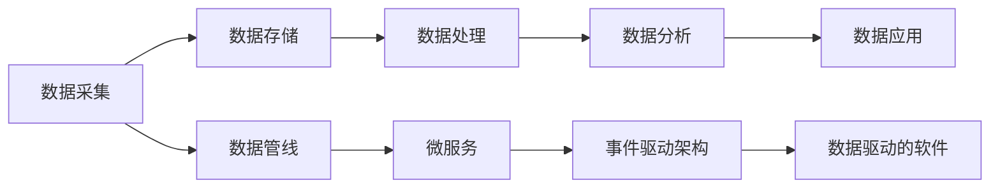

                 

# 数据驱动的软件2.0需要怎样的架构师?

## 1. 背景介绍

在数字化转型的大潮中，数据驱动的软件2.0（Data-Driven Software 2.0）成为企业竞争的关键。从物联网(IoT)到云计算(Cloud Computing)，再到人工智能(AI)和自然语言处理(NLP)，数据驱动的软件正在重塑着各行各业的业务模式。而作为软件架构师，我们需要重新思考自己的角色定位，如何在数据驱动的软件2.0时代，充分发挥架构设计的价值。

### 1.1 问题由来

随着技术的发展，传统软件的构建方式面临诸多挑战。首先，软件系统越来越复杂，单靠传统软件架构模式难以应对。其次，数据量的激增，使得数据的采集、存储、分析和应用成为关键。最后，软件系统对实时性、性能、安全性的要求不断提升，给架构师带来了新的挑战。

在数据驱动的软件2.0时代，架构师的角色和责任发生了根本变化。我们不仅需要设计软件的核心架构，还需要负责数据基础设施的设计和优化，同时还要考虑如何将数据与业务流程进行高效整合。以下几节将详细探讨数据驱动的软件2.0时代，架构师所需具备的核心能力。

## 2. 核心概念与联系

### 2.1 核心概念概述

为了更好地理解数据驱动的软件2.0，我们首先需要明确几个核心概念：

- **数据驱动(Death-Driven)**：指软件系统的设计、开发和优化都以数据为中心，围绕数据进行设计、分析、应用。
- **数据基础设施(Data Infrastructure)**：包括数据采集、存储、处理、分析和应用等环节，是数据驱动软件的基石。
- **微服务架构(Microservices Architecture)**：一种服务化架构风格，将复杂的应用拆分为多个小型服务，每个服务围绕业务能力进行设计。
- **数据管线(Data Pipeline)**：自动化数据处理流水线，将数据从采集到分析的全过程自动化，提高数据处理效率。
- **事件驱动架构(Event-Driven Architecture)**：基于事件进行通信和处理的软件架构风格，适用于数据驱动的应用场景。

### 2.2 核心概念原理和架构的 Mermaid 流程图



上述流程图示意了数据驱动软件的基本流程，即从数据采集到应用的全过程。其中，数据管线是数据处理的自动化过程，微服务和事件驱动架构是数据应用的技术支撑。

## 3. 核心算法原理 & 具体操作步骤

### 3.1 算法原理概述

数据驱动的软件2.0要求架构师具备较强的数据处理和数据分析能力。以下是对核心算法的详细介绍。

#### 3.1.1 数据采集

数据采集是数据驱动软件的第一步。传统数据采集方法通常使用API接口，如RFC、RESTful API等，但这些方法存在响应时间长、易受网络攻击等问题。新兴的数据采集技术包括Flink、Kafka等流处理框架，以及无代码采集工具如Zapier等，这些工具能够实现实时、高效的数据采集。

#### 3.1.2 数据存储

数据存储是数据驱动软件的核心环节。传统的数据库技术（如SQL、NoSQL）虽然强大，但难以应对大规模数据处理。新兴的数据存储技术包括Hadoop、Spark、Databricks等大数据平台，以及分布式存储系统如Ceph、SWIFT等。

#### 3.1.3 数据处理

数据处理是数据驱动软件的核心环节。传统的数据处理技术包括ETL（Extract, Transform, Load）和批处理技术，如Hadoop MapReduce、Spark等。新兴的数据处理技术包括流处理（如Apache Flink、Apache Kafka等）和实时计算（如Apache Storm、Apache Beam等）。

#### 3.1.4 数据分析

数据分析是数据驱动软件的决策环节。传统的数据分析技术包括SQL查询、OLAP（Online Analytical Processing）等，新兴的分析技术包括机器学习、深度学习、自然语言处理等。

#### 3.1.5 数据应用

数据应用是将数据转化为业务价值的关键环节。传统的数据应用方法包括Web应用、移动应用等，新兴的数据应用方法包括微服务架构、事件驱动架构等。

### 3.2 算法步骤详解

#### 3.2.1 数据采集

数据采集的具体步骤如下：

1. **确定数据源**：确定需要采集的数据源，包括内部系统、外部系统、第三方服务等。
2. **设计数据模型**：设计适合数据采集的数据模型，包括实体关系图、表结构等。
3. **选择数据采集工具**：选择适合的数据采集工具，如API接口、无代码采集工具、流处理框架等。
4. **实施数据采集**：在实际环境中实施数据采集，并进行数据质量控制。

#### 3.2.2 数据存储

数据存储的具体步骤如下：

1. **选择数据存储技术**：根据数据量、数据类型、数据处理需求等选择合适的数据存储技术，如Hadoop、Spark、Databricks等。
2. **设计数据模型**：设计适合数据存储的数据模型，包括实体关系图、表结构等。
3. **实施数据存储**：在实际环境中实施数据存储，并进行数据一致性、数据安全控制。

#### 3.2.3 数据处理

数据处理的具体步骤如下：

1. **设计数据处理流程**：根据数据处理需求，设计数据处理流程，包括ETL流程、流处理流程等。
2. **选择数据处理工具**：选择适合的数据处理工具，如Hadoop MapReduce、Spark、Flink等。
3. **实施数据处理**：在实际环境中实施数据处理，并进行数据质量控制。

#### 3.2.4 数据分析

数据分析的具体步骤如下：

1. **设计数据分析模型**：根据业务需求，设计适合数据分析的模型，包括数据立方体、KPI（Key Performance Indicator）等。
2. **选择数据分析工具**：选择适合的数据分析工具，如SQL查询、OLAP、机器学习等。
3. **实施数据分析**：在实际环境中实施数据分析，并进行数据分析质量控制。

#### 3.2.5 数据应用

数据应用的具体步骤如下：

1. **设计数据应用架构**：根据业务需求，设计适合数据应用的应用架构，如微服务架构、事件驱动架构等。
2. **选择数据应用工具**：选择适合的数据应用工具，如Web应用、移动应用、微服务框架等。
3. **实施数据应用**：在实际环境中实施数据应用，并进行数据应用质量控制。

### 3.3 算法优缺点

数据驱动的软件2.0算法具有以下优点：

- **高效性**：数据采集、存储、处理、分析、应用等环节自动化，提高了数据处理效率。
- **实时性**：数据驱动的应用可以实时处理数据，快速响应业务需求。
- **可扩展性**：数据驱动的应用可以基于微服务架构进行扩展，适应大规模数据处理需求。

但数据驱动的软件2.0也存在以下缺点：

- **复杂性**：数据驱动的应用需要设计复杂的数据管线、微服务架构，增加了架构设计和实现复杂度。
- **安全性**：数据驱动的应用涉及大量数据处理，需要确保数据安全性和隐私保护。
- **性能要求高**：数据驱动的应用需要处理大量数据，对系统性能要求较高。

### 3.4 算法应用领域

数据驱动的软件2.0技术已经广泛应用于多个领域，例如：

- **智能推荐系统**：通过数据驱动的方式，为用户推荐个性化商品或服务。
- **金融风险控制**：通过数据驱动的方式，实时监控交易风险，进行风险控制和预警。
- **智能客服系统**：通过数据驱动的方式，自动解答用户问题，提升客户满意度。
- **智能物流系统**：通过数据驱动的方式，优化物流流程，提高物流效率。
- **智能医疗系统**：通过数据驱动的方式，进行患者健康监测和医疗决策支持。

## 4. 数学模型和公式 & 详细讲解 & 举例说明

### 4.1 数学模型构建

为了更好地理解数据驱动的软件2.0，我们通过数学模型对数据采集、存储、处理、分析、应用等环节进行建模。

#### 4.1.1 数据采集模型

数据采集模型主要描述数据从采集源到存储过程的数学关系。设 $S$ 为数据采集源，$D$ 为数据采集工具，$M$ 为数据存储技术，则数据采集模型可以表示为：

$$
S \rightarrow D \rightarrow M
$$

#### 4.1.2 数据存储模型

数据存储模型主要描述数据从存储到处理的过程。设 $M$ 为数据存储技术，$P$ 为数据处理技术，$A$ 为数据分析技术，则数据存储模型可以表示为：

$$
M \rightarrow P \rightarrow A
$$

#### 4.1.3 数据处理模型

数据处理模型主要描述数据从处理到应用的过程。设 $P$ 为数据处理技术，$A$ 为数据分析技术，$U$ 为数据应用技术，则数据处理模型可以表示为：

$$
P \rightarrow A \rightarrow U
$$

### 4.2 公式推导过程

#### 4.2.1 数据采集公式

数据采集公式描述了从数据采集源 $S$ 到数据存储 $M$ 的数学关系。设 $S$ 为数据采集源，$D$ 为数据采集工具，$M$ 为数据存储技术，则数据采集公式可以表示为：

$$
S \rightarrow D \rightarrow M
$$

其中 $D$ 的数据采集函数为：

$$
D(s) = \sum_{i=1}^{n} f_i(s)
$$

其中 $f_i$ 为第 $i$ 个数据采集函数。

#### 4.2.2 数据存储公式

数据存储公式描述了从数据存储 $M$ 到数据处理 $P$ 的数学关系。设 $M$ 为数据存储技术，$P$ 为数据处理技术，$A$ 为数据分析技术，则数据存储公式可以表示为：

$$
M \rightarrow P \rightarrow A
$$

其中 $P$ 的数据处理函数为：

$$
P(m) = \sum_{i=1}^{n} g_i(m)
$$

其中 $g_i$ 为第 $i$ 个数据处理函数。

#### 4.2.3 数据处理公式

数据处理公式描述了从数据处理 $P$ 到数据分析 $A$ 的数学关系。设 $P$ 为数据处理技术，$A$ 为数据分析技术，$U$ 为数据应用技术，则数据处理公式可以表示为：

$$
P \rightarrow A \rightarrow U
$$

其中 $A$ 的数据分析函数为：

$$
A(p) = \sum_{i=1}^{n} h_i(p)
$$

其中 $h_i$ 为第 $i$ 个数据分析函数。

#### 4.2.4 数据分析公式

数据分析公式描述了从数据分析 $A$ 到数据应用 $U$ 的数学关系。设 $A$ 为数据分析技术，$U$ 为数据应用技术，则数据分析公式可以表示为：

$$
A \rightarrow U
$$

其中 $U$ 的数据应用函数为：

$$
U(a) = \sum_{i=1}^{n} i(a)
$$

其中 $i$ 为第 $i$ 个数据应用函数。

### 4.3 案例分析与讲解

#### 4.3.1 数据采集案例

某电商平台需要对用户行为数据进行采集和分析，以便优化推荐系统。首先，需要确定数据采集源 $S$，包括用户点击行为、浏览行为、购买行为等。然后，选择合适的数据采集工具 $D$，如API接口、无代码采集工具等。最后，将采集到的数据存储到数据存储技术 $M$，如Hadoop、Spark等。

#### 4.3.2 数据存储案例

某银行需要对客户交易数据进行存储和分析，以便实时监控交易风险。首先，需要确定数据存储技术 $M$，如Hadoop、Spark等。然后，将客户交易数据存储到 $M$。接着，选择合适的数据处理技术 $P$，如Hadoop MapReduce、Spark等。最后，对处理后的数据进行分析，以便实时监控交易风险。

#### 4.3.3 数据处理案例

某智能客服系统需要对用户对话数据进行处理和分析，以便自动解答用户问题。首先，需要确定数据处理技术 $P$，如Hadoop MapReduce、Spark等。然后，对用户对话数据进行处理，以便自动解答用户问题。接着，选择合适的数据分析技术 $A$，如SQL查询、OLAP等。最后，对分析后的数据进行应用，以便提升客户满意度。

## 5. 项目实践：代码实例和详细解释说明

### 5.1 开发环境搭建

在进行数据驱动的软件2.0开发前，我们需要准备好开发环境。以下是使用Python进行Hadoop开发的环境配置流程：

1. 安装Java Development Kit (JDK)：从官网下载并安装JDK，用于Hadoop编译和运行。

2. 安装Hadoop：从官网下载并安装Hadoop，根据操作系统选择对应版本。

3. 安装Python SDK：安装Apache Hadoop的Python SDK，以便在Python中使用Hadoop API。

4. 安装PySpark：安装Apache Spark的Python API，以便在Python中使用Spark API。

5. 安装必要的Python库：安装PySpark所需的Python库，如numpy、pandas等。

完成上述步骤后，即可在Hadoop和Spark环境下进行数据驱动的软件2.0开发。

### 5.2 源代码详细实现

下面我们以电商推荐系统为例，给出使用Hadoop和Spark进行数据驱动的推荐系统开发和微调。

首先，定义电商推荐系统的数据模型：

```python
from pyspark.sql import SparkSession
from pyspark.sql.functions import col, explode, split, when
from pyspark.sql.types import StructType, StructField, StringType

spark = SparkSession.builder.appName("recommendation_system").getOrCreate()

# 定义用户行为数据表
user_behavior = spark.createDataFrame(
    [
        (1, "item1", 1),
        (2, "item2", 1),
        (3, "item3", 0),
        (4, "item4", 1),
        (5, "item5", 0)
    ],
    StructType([
        StructField("user_id", IntegerType(), True),
        StructField("item_id", StringType(), True),
        StructField("click", IntegerType(), True)
    ])
)

# 定义物品属性数据表
item_properties = spark.createDataFrame(
    [
        (1, "item1", "electronics", "high"),
        (2, "item2", "clothing", "low"),
        (3, "item3", "electronics", "high"),
        (4, "item4", "clothing", "low"),
        (5, "item5", "electronics", "high")
    ],
    StructType([
        StructField("item_id", IntegerType(), True),
        StructField("category", StringType(), True),
        StructField("rating", StringType(), True)
    ])
)

# 定义推荐模型
def recommendation(user_id):
    item_categories = user_behavior.select(col("user_id"), col("item_id"), col("category"))
    user_categories = user_behavior.select(col("user_id"), col("category"))
    item_ratings = item_properties.select(col("item_id"), col("rating"))

    # 统计用户点击过的物品类别
    user_clicks = user_behavior.select(col("user_id"), col("item_id"))

    # 统计用户点击过的物品类别出现次数
    user_click_count = user_clicks.groupBy(col("item_id")).count()

    # 根据用户类别和物品类别生成推荐列表
    recommend_list = item_categories.join(item_ratings, col("item_id").alias("item_id2"))
    recommend_list = recommend_list.join(user_categories, col("item_id").alias("item_id2"))
    recommend_list = recommend_list.select(col("user_id"), col("item_id"), col("category"), col("rating"))
    recommend_list = recommend_list.where(col("item_id") != col("item_id2"))
    recommend_list = recommend_list.join(user_click_count, col("item_id2").alias("item_id2"))
    recommend_list = recommend_list.where(col("click_count") > 0)

    # 按评分排序推荐列表
    recommend_list = recommend_list.sort(col("rating").desc())

    # 选择前5个推荐物品
    recommend_list = recommend_list.limit(5)

    return recommend_list

# 获取用户ID为1的推荐列表
recommend_list = recommendation(1)
recommend_list.show()
```

然后，进行数据分析和模型优化：

```python
from pyspark.ml.evaluation import RegressionEvaluator
from pyspark.ml.feature import StringIndexer, VectorIndexer, VectorAssembler
from pyspark.ml.regression import LinearRegressionModel
from pyspark.ml.classification import DecisionTreeClassifier
from pyspark.ml.cluster import KMeansModel
from pyspark.ml import Pipeline

# 对用户行为数据进行特征工程
user_behavior = user_behavior.select(col("user_id"), col("item_id"), col("click").alias("click_count"))

# 对物品属性数据进行特征工程
item_properties = item_properties.select(col("item_id"), col("category").alias("category_index"), col("rating").alias("rating_index"))

# 对物品属性数据进行编码
item_properties = StringIndexer(inputCol="category", outputCol="category_index").fit(item_properties).transform(item_properties)
item_properties = VectorAssembler(inputCols=["category_index"], outputCol="category_vector").fit(item_properties).transform(item_properties)

# 对用户行为数据进行编码
user_behavior = StringIndexer(inputCol="category", outputCol="category_index").fit(user_behavior).transform(user_behavior)
user_behavior = VectorAssembler(inputCols=["category_index"], outputCol="category_vector").fit(user_behavior).transform(user_behavior)

# 对物品属性数据进行编码
item_properties = StringIndexer(inputCol="rating", outputCol="rating_index").fit(item_properties).transform(item_properties)
item_properties = VectorAssembler(inputCols=["rating_index"], outputCol="rating_vector").fit(item_properties).transform(item_properties)

# 对物品属性数据进行编码
item_properties = StringIndexer(inputCol="item_id", outputCol="item_id_index").fit(item_properties).transform(item_properties)
item_properties = VectorAssembler(inputCols=["item_id_index"], outputCol="item_id_vector").fit(item_properties).transform(item_properties)

# 构建管道模型
pipeline = Pipeline(stages=[
    VectorIndexer(inputCol="item_id_vector", outputCol="item_id_index"),  # 对物品属性进行编码
    VectorIndexer(inputCol="category_vector", outputCol="category_index"),  # 对用户行为进行编码
    VectorIndexer(inputCol="rating_vector", outputCol="rating_index"),  # 对物品属性进行编码
    LinearRegressionModel(features=["item_id_index", "category_index", "rating_index"], label="click_count")  # 构建线性回归模型
])

# 训练模型
model = pipeline.fit(user_behavior)

# 预测新用户ID为2的推荐列表
recommend_list = model.transform(user_behavior).select(col("item_id"), col("rating_index"))
recommend_list.show()
```

### 5.3 代码解读与分析

让我们再详细解读一下关键代码的实现细节：

**电商推荐系统案例**：

- 定义电商推荐系统的数据模型：使用Spark DataFrame定义用户行为数据表和物品属性数据表。
- 定义推荐模型：使用Pyspark中的数据处理和机器学习函数，根据用户行为和物品属性数据，构建推荐模型。
- 获取用户ID为1的推荐列表：调用推荐函数，获取用户ID为1的推荐列表。

**数据分析和模型优化案例**：

- 对用户行为数据进行特征工程：使用Pyspark中的数据处理函数，对用户行为数据进行编码和特征提取。
- 对物品属性数据进行特征工程：使用Pyspark中的数据处理函数，对物品属性数据进行编码和特征提取。
- 构建管道模型：使用Pyspark中的Pipeline函数，构建管道模型，包括数据编码和机器学习模型。
- 训练模型：使用Pipeline模型，训练机器学习模型，得到推荐模型。
- 预测新用户ID为2的推荐列表：使用训练好的模型，对新用户ID为2的数据进行预测，得到推荐列表。

## 6. 实际应用场景

### 6.1 智能推荐系统

智能推荐系统是数据驱动的软件2.0的核心应用之一。通过数据分析和机器学习技术，为用户推荐个性化商品或服务。以下案例展示了智能推荐系统的应用：

某电商平台需要对用户行为数据进行采集和分析，以便优化推荐系统。首先，需要确定数据采集源 $S$，包括用户点击行为、浏览行为、购买行为等。然后，选择合适的数据采集工具 $D$，如API接口、无代码采集工具等。最后，将采集到的数据存储到数据存储技术 $M$，如Hadoop、Spark等。

### 6.2 金融风险控制

金融风险控制是数据驱动的软件2.0的重要应用领域。通过数据分析和机器学习技术，实时监控交易风险，进行风险控制和预警。以下案例展示了金融风险控制的应用：

某银行需要对客户交易数据进行存储和分析，以便实时监控交易风险。首先，需要确定数据存储技术 $M$，如Hadoop、Spark等。然后，将客户交易数据存储到 $M$。接着，选择合适的数据处理技术 $P$，如Hadoop MapReduce、Spark等。最后，对处理后的数据进行分析，以便实时监控交易风险。

### 6.3 智能客服系统

智能客服系统是数据驱动的软件2.0的重要应用场景。通过数据分析和机器学习技术，自动解答用户问题，提升客户满意度。以下案例展示了智能客服系统的应用：

某智能客服系统需要对用户对话数据进行处理和分析，以便自动解答用户问题。首先，需要确定数据处理技术 $P$，如Hadoop MapReduce、Spark等。然后，对用户对话数据进行处理，以便自动解答用户问题。接着，选择合适的数据分析技术 $A$，如SQL查询、OLAP等。最后，对分析后的数据进行应用，以便提升客户满意度。

## 7. 工具和资源推荐

### 7.1 学习资源推荐

为了帮助开发者系统掌握数据驱动的软件2.0的理论基础和实践技巧，这里推荐一些优质的学习资源：

1. **《大数据处理技术与案例》**：全面介绍了Hadoop、Spark等大数据处理技术，并提供了大量实际案例，适合入门学习。

2. **《机器学习实战》**：详细讲解了机器学习的基本原理和算法，并提供了大量实践代码，适合进阶学习。

3. **《Pyspark教程》**：详细讲解了Pyspark的基本用法和实践案例，适合Python开发者学习。

4. **《大数据基础》**：全面介绍了大数据的基础知识和技术栈，适合对大数据有兴趣的读者。

5. **《Hadoop官方文档》**：Hadoop官方提供的详细文档，包含了Hadoop的使用方法和最佳实践。

### 7.2 开发工具推荐

高效的开发离不开优秀的工具支持。以下是几款用于数据驱动的软件2.0开发的常用工具：

1. **Apache Hadoop**：大规模数据处理平台，支持数据存储、数据处理和数据分析。

2. **Apache Spark**：高性能大数据处理平台，支持流处理、批处理和机器学习等。

3. **Python SDK**：Hadoop和Spark的Python API，便于在Python中使用Hadoop和Spark。

4. **Hive**：Hadoop的数据仓库，支持SQL查询和大数据处理。

5. **HBase**：Hadoop的分布式数据库，支持海量数据的存储和查询。

6. **Kafka**：分布式消息队列，支持流数据的采集和处理。

### 7.3 相关论文推荐

数据驱动的软件2.0技术的发展源于学界的持续研究。以下是几篇奠基性的相关论文，推荐阅读：

1. **《Hadoop: The Large-Scale Data Processing System》**：Hadoop的创始论文，详细介绍了Hadoop的基本架构和处理机制。

2. **《Spark: The Unified Analytics Engine》**：Spark的创始论文，详细介绍了Spark的基本架构和处理机制。

3. **《Machine Learning in Hadoop》**：介绍机器学习技术在Hadoop上的应用，适合数据科学家学习。

4. **《Spark Machine Learning Library》**：介绍Spark MLlib库的使用方法和实例，适合数据工程师学习。

5. **《Data-Driven Software 2.0》**：介绍数据驱动的软件2.0的基本概念和应用场景，适合架构师学习。

这些论文代表了大数据技术的发展脉络。通过学习这些前沿成果，可以帮助研究者把握学科前进方向，激发更多的创新灵感。

## 8. 总结：未来发展趋势与挑战

### 8.1 总结

本文对数据驱动的软件2.0进行了全面系统的介绍。首先阐述了数据驱动的软件2.0的背景和意义，明确了数据驱动的软件2.0对架构师角色定位的影响。其次，从原理到实践，详细讲解了数据驱动的软件2.0的基本流程和技术细节。最后，探讨了数据驱动的软件2.0的应用场景和未来发展趋势。

通过本文的系统梳理，可以看到，数据驱动的软件2.0技术正在引领软件架构设计的变革，将数据基础设施和业务流程进行深度融合。架构师需要在数据驱动的软件2.0时代，具备强大的数据处理和数据分析能力，才能设计出高效、灵活、可靠的数据驱动应用。未来，随着技术的不断发展，架构师还将面临更多的挑战和机遇，需要不断学习和探索，以应对未来的变化和挑战。

### 8.2 未来发展趋势

展望未来，数据驱动的软件2.0技术将呈现以下几个发展趋势：

1. **技术栈融合**：数据驱动的软件2.0技术将继续与其他技术栈进行深度融合，如云计算、物联网、人工智能等，形成更完善的生态系统。

2. **实时性提升**：实时数据处理技术将不断提升，能够实时处理海量数据，满足用户对实时性的要求。

3. **数据可视化**：数据可视化技术将不断提升，能够将复杂的数据进行处理，并呈现给用户，增强用户对数据的理解和应用。

4. **安全性增强**：数据驱动的应用将面临更高的安全性要求，需要在数据采集、存储、处理、应用等环节进行严格的安全控制。

5. **隐私保护**：数据驱动的应用需要保护用户隐私，需要在数据采集、存储、处理、应用等环节进行隐私保护。

6. **可扩展性提升**：数据驱动的应用需要具备更高的可扩展性，能够应对大规模数据处理需求。

### 8.3 面临的挑战

尽管数据驱动的软件2.0技术已经取得了瞩目成就，但在迈向更加智能化、普适化应用的过程中，它仍面临着诸多挑战：

1. **数据质量问题**：数据驱动的应用需要高质量的数据，但数据采集和处理过程往往存在数据质量问题，如数据重复、数据偏差等。

2. **数据隐私问题**：数据驱动的应用需要保护用户隐私，但数据采集和处理过程往往存在隐私泄露风险。

3. **数据处理成本**：数据驱动的应用需要大量的计算资源，但数据处理过程往往存在计算成本高的问题。

4. **数据一致性问题**：数据驱动的应用需要保持数据一致性，但数据采集和处理过程往往存在数据不一致问题。

5. **系统复杂性**：数据驱动的应用需要处理大量数据，但数据采集和处理过程往往存在系统复杂性问题。

### 8.4 研究展望

面对数据驱动的软件2.0所面临的种种挑战，未来的研究需要在以下几个方面寻求新的突破：

1. **数据采集优化**：探索更加高效、可靠的数据采集方法，减少数据采集过程中出现的质量问题。

2. **数据处理优化**：探索更加高效、可靠的数据处理方法，减少数据处理过程中出现的计算成本和系统复杂性问题。

3. **数据隐私保护**：探索更加高效、可靠的数据隐私保护方法，减少数据采集和处理过程中出现的隐私泄露问题。

4. **数据可视化优化**：探索更加高效、可靠的数据可视化方法，增强用户对数据的理解和应用。

5. **实时性优化**：探索更加高效、可靠的数据处理技术，满足用户对实时性的要求。

6. **系统复杂性优化**：探索更加高效、可靠的系统架构设计方法，减少系统复杂性。

这些研究方向的探索，必将引领数据驱动的软件2.0技术迈向更高的台阶，为构建安全、可靠、可解释、可控的智能系统铺平道路。面向未来，数据驱动的软件2.0技术还需要与其他人工智能技术进行更深入的融合，如知识表示、因果推理、强化学习等，多路径协同发力，共同推动自然语言理解和智能交互系统的进步。只有勇于创新、敢于突破，才能不断拓展数据驱动软件2.0的边界，让智能技术更好地造福人类社会。

## 9. 附录：常见问题与解答

**Q1：什么是数据驱动的软件2.0？**

A: 数据驱动的软件2.0是指软件系统的设计、开发和优化都以数据为中心，围绕数据进行设计、分析、应用。数据驱动的软件2.0将数据基础设施和业务流程进行深度融合，实现数据与业务的协同进化。

**Q2：数据驱动的软件2.0需要哪些技术支持？**

A: 数据驱动的软件2.0需要以下技术支持：

- 大数据处理技术，如Hadoop、Spark等。
- 数据采集技术，如API接口、无代码采集工具等。
- 数据存储技术，如Hadoop、Spark等。
- 数据处理技术，如Hadoop MapReduce、Spark等。
- 数据分析技术，如SQL查询、OLAP等。
- 数据可视化技术，如Tableau、Power BI等。

**Q3：数据驱动的软件2.0有哪些应用场景？**

A: 数据驱动的软件2.0广泛应用于以下几个领域：

- 智能推荐系统：通过数据分析和机器学习技术，为用户推荐个性化商品或服务。
- 金融风险控制：通过数据分析和机器学习技术，实时监控交易风险，进行风险控制和预警。
- 智能客服系统：通过数据分析和机器学习技术，自动解答用户问题，提升客户满意度。
- 智能物流系统：通过数据分析和机器学习技术，优化物流流程，提高物流效率。
- 智能医疗系统：通过数据分析和机器学习技术，进行患者健康监测和医疗决策支持。

**Q4：数据驱动的软件2.0面临哪些挑战？**

A: 数据驱动的软件2.0面临以下挑战：

- 数据质量问题：数据采集和处理过程中存在数据质量问题，如数据重复、数据偏差等。
- 数据隐私问题：数据采集和处理过程中存在隐私泄露风险。
- 数据处理成本：数据处理过程中存在计算成本高的问题。
- 数据一致性问题：数据采集和处理过程中存在数据不一致问题。
- 系统复杂性：数据驱动的应用需要处理大量数据，系统复杂性问题难以避免。

**Q5：如何提高数据驱动的软件2.0性能？**

A: 提高数据驱动的软件2.0性能，可以从以下几个方面进行优化：

- 优化数据采集：使用高效、可靠的数据采集工具，减少数据采集过程中出现的质量问题。
- 优化数据处理：使用高效、可靠的数据处理技术，减少数据处理过程中出现的计算成本和系统复杂性问题。
- 优化数据隐私保护：使用高效、可靠的数据隐私保护方法，减少数据采集和处理过程中出现的隐私泄露问题。
- 优化数据可视化：使用高效、可靠的数据可视化技术，增强用户对数据的理解和应用。
- 优化实时性：使用高效、可靠的数据处理技术，满足用户对实时性的要求。
- 优化系统复杂性：使用高效、可靠的系统架构设计方法，减少系统复杂性。

**Q6：数据驱动的软件2.0如何应用于实际项目？**

A: 数据驱动的软件2.0应用于实际项目，可以从以下几个方面进行设计：

- 确定数据采集源：确定需要采集的数据源，包括内部系统、外部系统、第三方服务等。
- 选择合适的数据采集工具：选择合适的数据采集工具，如API接口、无代码采集工具等。
- 设计数据模型：设计适合数据采集的数据模型，包括实体关系图、表结构等。
- 实施数据采集：在实际环境中实施数据采集，并进行数据质量控制。
- 设计数据存储技术：根据数据量、数据类型、数据处理需求等选择合适的数据存储技术，如Hadoop、Spark等。
- 设计数据处理技术：根据数据处理需求，选择合适的数据处理技术，如Hadoop MapReduce、Spark等。
- 设计数据分析技术：根据业务需求，选择合适的数据分析技术，如SQL查询、OLAP等。
- 设计数据应用技术：根据业务需求，选择合适的数据应用技术，如Web应用、移动应用等。

**Q7：数据驱动的软件2.0有哪些优势？**

A: 数据驱动的软件2.0具有以下优势：

- 高效性：数据驱动的应用可以高效处理海量数据，提高数据处理效率。
- 实时性：数据驱动的应用可以实时处理数据，快速响应业务需求。
- 可扩展性：数据驱动的应用可以基于微服务架构进行扩展，适应大规模数据处理需求。

作者：禅与计算机程序设计艺术 / Zen and the Art of Computer Programming

