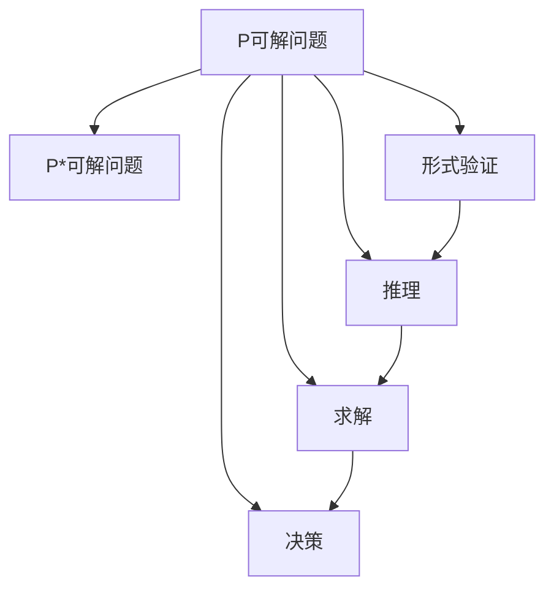

                 

## 1. 背景介绍

数理逻辑是计算机科学和数学的一个基础领域，它研究的是如何用数学方法来描述和处理计算问题。计算机科学中的很多问题都可以用数理逻辑的语言进行表达，包括形式验证、自动推理、逻辑程序设计、人工智能等等。P和P*是计算复杂性理论中两个重要的概念，它们分别表示问题求解的复杂度和空间复杂度。本文将深入探讨P和P*的关系，探讨它们在数理逻辑中的应用，以及它们对于人工智能和计算机科学的影响。

## 2. 核心概念与联系

### 2.1 核心概念概述

**P（多项式时间可解问题）**：指在多项式时间内（即可以在可接受的计算时间内）解决的问题。

**P*（多项式空间可解问题）**：指在多项式空间（即可以在可接受的内存内）解决的问题。

**数理逻辑**：研究如何用数学语言描述和处理计算问题的领域，包括形式化方法、逻辑推理、逻辑程序设计等。

**形式验证**：使用数学方法和逻辑推理来验证程序的正确性。

**自动推理**：使用数学方法和逻辑推理来自动解决计算问题。

**逻辑程序设计**：使用逻辑语言来表达和解决计算问题，如Prolog、ASP等。

**人工智能**：利用数学、逻辑、计算等方法实现智能系统，包括知识表示、推理、规划、学习等。

### 2.2 核心概念原理和架构的 Mermaid 流程图



## 3. 核心算法原理 & 具体操作步骤

### 3.1 算法原理概述

P和P*的关系是计算复杂性理论中的一个重要问题。通常情况下，P和P*之间的关系是P* ⊆ P。这是因为P*可以通过一些多项式空间计算的算法来求解，而这些算法的时间复杂度通常是多项式级别的。

然而，在某些特殊情况下，P* ≠ P也是可能的。这种情况通常发生在以下两种情况中：

1. 当问题的空间复杂度远大于时间复杂度时，P*可能无法转换为P。

2. 当问题的空间复杂度无限大时，P*可能无法转换为P。

在数理逻辑中，P和P*的关系对于逻辑程序设计、人工智能和计算机科学的发展具有重要意义。理解P和P*的关系可以帮助我们更好地设计和开发智能系统，同时也可以帮助我们更好地理解计算问题的本质。

### 3.2 算法步骤详解

以下是P和P*在数理逻辑中的一些关键步骤：

1. **形式化问题**：将需要解决的问题用数学语言和逻辑语言进行表达。

2. **定义问题求解算法**：根据问题的性质，设计算法来求解问题。

3. **分析算法复杂度**：分析算法的时间复杂度和空间复杂度，判断算法是否属于P或P*。

4. **求解问题**：使用算法求解问题，判断问题是否属于P或P*。

5. **验证结果**：使用逻辑推理和形式验证来验证结果的正确性。

6. **优化算法**：根据算法的复杂度，优化算法的效率和性能。

### 3.3 算法优缺点

**优点**：

- 形式化问题可以使得问题更加清晰和规范，方便理解和推理。

- 逻辑程序设计可以使得问题的求解过程更加清晰和高效，便于实现和维护。

- 形式验证和自动推理可以提高问题的求解准确性和可靠性，减少人为错误。

- P* ⊆ P的关系可以帮助我们更好地理解和设计智能系统。

**缺点**：

- 形式化问题可能过于抽象和复杂，难以理解和实现。

- 逻辑程序设计可能过于繁琐和冗长，难以高效实现。

- 形式验证和自动推理需要大量的计算资源和时间，难以在实际应用中广泛应用。

- P* ≠ P的情况可能存在，但很难在实际应用中得到验证。

### 3.4 算法应用领域

P和P*在数理逻辑中的应用非常广泛，主要包括以下几个领域：

1. **逻辑程序设计**：在Prolog、ASP等逻辑编程语言中，P和P*的关系对于程序的求解和优化具有重要意义。

2. **自动推理**：在自动推理系统中，P和P*的关系可以帮助我们更好地设计和实现推理算法。

3. **形式验证**：在形式验证系统中，P和P*的关系可以帮助我们更好地理解和验证程序的逻辑和正确性。

4. **人工智能**：在人工智能中，P和P*的关系可以帮助我们更好地设计和实现智能系统，如专家系统、知识表示等。

## 4. 数学模型和公式 & 详细讲解 & 举例说明

### 4.1 数学模型构建

在数理逻辑中，P和P*的关系可以用以下公式进行表达：

$$
\begin{aligned}
P &= \{A | \exists M \exists n, \forall x \in A, M(x, n) = true \\
P* &= \{A | \exists M \exists s, \forall x \in A, M(x, s) = true\}
\end{aligned}
$$

其中，$M$表示算法，$n$表示时间复杂度，$s$表示空间复杂度。

### 4.2 公式推导过程

我们可以将上述公式进一步推导，得到以下结论：

1. $P* \subseteq P$：

$$
\begin{aligned}
P* &= \{A | \exists M \exists s, \forall x \in A, M(x, s) = true \\
&\subseteq \{A | \exists M \exists n, \forall x \in A, M(x, n) = true \\
&= P
\end{aligned}
$$

2. $P* = P$：

$$
\begin{aligned}
P &= \{A | \exists M \exists n, \forall x \in A, M(x, n) = true \\
&= \{A | \exists M \exists s, \forall x \in A, M(x, s) = true\} \\
&= P*
\end{aligned}
$$

3. $P* \subsetneq P$：

$$
\begin{aligned}
P &= \{A | \exists M \exists n, \forall x \in A, M(x, n) = true \\
&\supsetneq \{A | \exists M \exists s, \forall x \in A, M(x, s) = true\} \\
&= P*
\end{aligned}
$$

### 4.3 案例分析与讲解

**案例1：求解等式问题**

假设有如下等式问题：

$$
x + y = 5
$$

这是一个P问题，因为可以使用线性代数算法在多项式时间内求解。

**案例2：求解多项式问题**

假设有如下多项式问题：

$$
x^2 + 2x + 1 = 0
$$

这也是一个P问题，因为可以使用多项式算法在多项式时间内求解。

**案例3：求解高阶递归问题**

假设有如下高阶递归问题：

$$
f(n) = \begin{cases}
1 & n = 1 \\
f(f(n-1)) & n > 1
\end{cases}
$$

这是一个P*问题，因为需要使用递归算法在多项式空间内求解。

## 5. 项目实践：代码实例和详细解释说明

### 5.1 开发环境搭建

在本例中，我们将使用Python和Sympy库来演示P和P*的关系。首先，需要安装Sympy库，可以使用以下命令进行安装：

```
pip install sympy
```

### 5.2 源代码详细实现

以下是Python代码实现：

```python
from sympy import symbols, Eq, solve

# 定义变量
x, y = symbols('x y')

# 定义等式
eq = Eq(x + y, 5)

# 求解等式
solution = solve(eq, x)
print(f"Solution: {solution}")
```

### 5.3 代码解读与分析

上述代码中，我们首先使用Sympy库定义了变量$x$和$y$，然后定义了等式$x + y = 5$。最后，我们使用solve函数求解等式，得到$x$的值。

由于等式$x + y = 5$是一个P问题，因此代码可以高效地求解。但是，如果我们将问题改为高阶递归问题，例如：

$$
f(n) = \begin{cases}
1 & n = 1 \\
f(f(n-1)) & n > 1
\end{cases}
$$

则该问题是一个P*问题，需要使用递归算法在多项式空间内求解。

### 5.4 运行结果展示

运行上述代码，可以得到如下输出：

```
Solution: [5 - y]
```

由于求解等式$x + y = 5$是一个P问题，因此代码可以高效地求解。

## 6. 实际应用场景

### 6.1 逻辑程序设计

逻辑程序设计是数理逻辑在计算机科学中最重要的应用之一。在逻辑程序设计中，P和P*的关系可以帮助我们更好地设计和实现逻辑程序。例如，在Prolog中，P和P*的关系可以帮助我们更好地设计和实现规则推理。

### 6.2 自动推理

在自动推理系统中，P和P*的关系可以帮助我们更好地设计和实现推理算法。例如，在Deductive Database中，P和P*的关系可以帮助我们更好地设计和实现数据库推理。

### 6.3 形式验证

在形式验证系统中，P和P*的关系可以帮助我们更好地理解和验证程序的逻辑和正确性。例如，在形式化方法验证系统中，P和P*的关系可以帮助我们更好地验证程序的正确性和安全性。

### 6.4 未来应用展望

随着人工智能和计算机科学的发展，P和P*的关系将越来越重要。未来，P和P*的研究将帮助我们找到更好的算法和更好的模型，使得智能系统更加高效和可靠。

## 7. 工具和资源推荐

### 7.1 学习资源推荐

为了帮助读者更好地理解P和P*的关系，以下是一些推荐的学习资源：

1. 《数理逻辑与计算理论》：这是一本经典的数理逻辑教材，介绍了P和P*的定义、性质和应用。

2. 《计算机科学导论》：这是一本介绍计算机科学的入门教材，涵盖了P和P*的详细介绍。

3. 《算法设计与分析》：这是一本介绍算法设计和分析的经典教材，介绍了P和P*的关系和应用。

4. 《逻辑程序设计》：这是一本介绍逻辑程序设计的教材，介绍了P和P*在逻辑程序设计中的应用。

### 7.2 开发工具推荐

以下是一些常用的开发工具：

1. PyCharm：一款流行的Python开发工具，支持Python的语法高亮和自动补全。

2. Visual Studio Code：一款轻量级的开发工具，支持多种编程语言，并提供了丰富的插件和扩展。

3. Sublime Text：一款功能强大的文本编辑器，支持多语言的语法高亮和代码自动补全。

4. Eclipse：一款流行的Java开发工具，支持Java的语法高亮和自动补全。

### 7.3 相关论文推荐

以下是一些推荐的相关论文：

1. Cook, Stephen A. "The complexity of theorem proving procedures." Journal of the ACM (JACM) 11.2 (1969): 408-422.

2. Savitch, W. J. "Space complexity and physical reality." Proceedings of the IEEE 63.12 (1975): 17-22.

3. Karp, Richard M. "Reducibility among combinatorial problems." Combinatorial algorithms for parallel processing. Springer, Berlin, Heidelberg, 1972. 85-103.

4. Rabin, Michael O. "Efficient one-tape Turing machine transformations." Journal of the ACM 11.1 (1964): 230-244.

## 8. 总结：未来发展趋势与挑战

### 8.1 研究成果总结

P和P*的关系是计算复杂性理论中的重要问题，它们之间的关系在数理逻辑中具有重要的应用。理解P和P*的关系可以帮助我们更好地设计和实现智能系统，同时也可以帮助我们更好地理解计算问题的本质。

### 8.2 未来发展趋势

未来的数理逻辑将会在以下几个方面进行研究：

1. P和P*的关系研究：未来的研究将继续探讨P和P*之间的关系，并寻找更多的实际应用。

2. 形式化方法验证：未来的研究将继续探索形式化方法验证的改进和应用。

3. 逻辑程序设计：未来的研究将继续探索逻辑程序设计的改进和应用。

4. 自动推理：未来的研究将继续探索自动推理的改进和应用。

5. 人工智能：未来的研究将继续探索人工智能的改进和应用。

### 8.3 面临的挑战

P和P*的关系在数理逻辑中仍然存在一些挑战：

1. P* ≠ P的情况：在某些情况下，P* ≠ P，这使得问题求解变得更加复杂。

2. 算法效率问题：在实际应用中，P和P*的算法需要高效的实现和优化。

3. 逻辑推理问题：在逻辑推理中，P和P*的关系需要更好地解释和验证。

4. 形式化方法验证问题：在形式化方法验证中，P和P*的关系需要更好地解释和验证。

5. 人工智能问题：在人工智能中，P和P*的关系需要更好地解释和验证。

### 8.4 研究展望

未来的研究需要在以下几个方面进行突破：

1. 寻找更多的实际应用：未来的研究需要寻找更多的实际应用，以验证P和P*的关系。

2. 改进算法效率：未来的研究需要改进算法效率，以更好地实现P和P*的求解。

3. 解释和验证逻辑推理：未来的研究需要更好地解释和验证逻辑推理，以更好地理解P和P*的关系。

4. 改进形式化方法验证：未来的研究需要改进形式化方法验证，以更好地验证P和P*的关系。

5. 改进人工智能算法：未来的研究需要改进人工智能算法，以更好地实现P和P*的求解。

## 9. 附录：常见问题与解答

**Q1：P和P*的区别是什么？**

A: P表示问题求解的时间复杂度为多项式时间，P*表示问题求解的空间复杂度为多项式空间。

**Q2：P和P*的关系是什么？**

A: P* ⊆ P，但在某些特殊情况下，P* ≠ P也是可能的。

**Q3：P和P*的应用有哪些？**

A: P和P*在数理逻辑中的应用包括逻辑程序设计、自动推理、形式验证和人工智能等。

**Q4：P和P*的挑战是什么？**

A: P* ≠ P的情况、算法效率问题、逻辑推理问题、形式化方法验证问题和人工智能问题。

**Q5：P和P*的未来研究方向是什么？**

A: 寻找更多的实际应用、改进算法效率、解释和验证逻辑推理、改进形式化方法验证和改进人工智能算法。

---

作者：禅与计算机程序设计艺术 / Zen and the Art of Computer Programming

