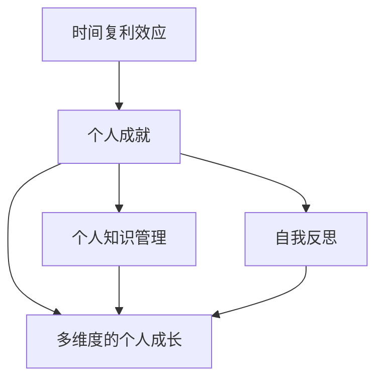

                 

# 时间复利效应与个人成就

## 1. 背景介绍

### 1.1 问题由来
时间复利效应是一个经济学概念，通常用于描述投资的长期增长。它指的是通过定期定额投资，利用时间的长远复利效应，实现资本的持续增值。在个人发展领域，时间复利效应同样适用。通过持续不断地积累知识和技能，利用时间的长期复利效应，实现个人能力的不断提升和成功实现。

### 1.2 问题核心关键点
- **时间复利效应**：指通过连续、定期的投入和积累，实现资本或能力的长期复利增长。
- **个人成就**：通过学习、工作和社交等活动，实现自我价值的提升和职业发展的目标。
- **个人知识管理**：有效的管理个人知识库，提高学习效率和效果。
- **自我反思**：通过定期的自我反思，不断优化个人行为和策略。
- **多维度的个人成长**：包括知识、技能、情感和心理等多方面的综合成长。

### 1.3 问题研究意义
时间复利效应与个人成就的研究，对于提升个体在职业、学习、生活和情感等各方面的综合能力，实现持续的个人成长和成功，具有重要的指导意义：

1. **高效学习**：掌握时间复利效应的原理，可以帮助个体更有效地积累知识和技能，提高学习效率。
2. **职业发展**：应用时间复利效应的原则，指导职业发展策略，实现职业生涯的持续提升。
3. **生活管理**：通过时间复利效应的应用，优化个人生活管理，提升生活质量。
4. **情感健康**：通过自我反思和调整，保持心理健康，建立积极的人生态度。

## 2. 核心概念与联系

### 2.1 核心概念概述

为了更好地理解时间复利效应在个人成就中的应用，本节将介绍几个密切相关的核心概念：

- **时间复利效应**：指通过连续、定期的投入和积累，实现资本或能力的长期复利增长。
- **个人成就**：通过学习、工作和社交等活动，实现自我价值的提升和职业发展的目标。
- **个人知识管理**：有效的管理个人知识库，提高学习效率和效果。
- **自我反思**：通过定期的自我反思，不断优化个人行为和策略。
- **多维度的个人成长**：包括知识、技能、情感和心理等多方面的综合成长。

这些核心概念之间的逻辑关系可以通过以下Mermaid流程图来展示：



这个流程图展示了几者之间的联系：

1. **时间复利效应**为**个人成就**提供动力和机制。
2. **个人知识管理**和**自我反思**是实现**个人成就**的重要工具和方法。
3. **多维度的个人成长**是**时间复利效应**和**个人成就**的最终目标和成果。

## 3. 核心算法原理 & 具体操作步骤
### 3.1 算法原理概述

时间复利效应与个人成就的实践，本质上是一个基于长期投入和积累的系统化过程。其核心思想是：通过周期性、定量的学习和实践，不断积累知识、技能和经验，实现个人能力的持续提升。

形式化地，假设个人初始能力为 $C_0$，每次投入学习和实践的时间为 $t$，年复利率为 $r$（通常 $r$ 在职业发展和技能提升中，表示年增长率或年增长量），则经过 $n$ 年的积累，个人能力 $C_n$ 可以通过以下公式计算：

$$
C_n = C_0 \times (1 + r)^n
$$

其中，$n$ 表示时间周期的数量，$C_n$ 表示经过 $n$ 年积累后的个人能力。

### 3.2 算法步骤详解

时间复利效应与个人成就的实践，一般包括以下几个关键步骤：

**Step 1: 设定目标和计划**
- 明确个人发展的长期目标和短期目标。
- 制定详细的学习和实践计划，包括时间周期、投入时间、学习内容等。

**Step 2: 建立知识管理库**
- 使用笔记软件、文档管理系统等工具，建立个人知识管理库。
- 定期整理和更新知识库，分类和标记重要信息。

**Step 3: 持续学习和实践**
- 按照计划，定期进行学习和实践活动。
- 记录学习过程和心得，及时反馈和调整学习策略。

**Step 4: 自我反思和调整**
- 定期进行自我反思，评估学习效果和实践成果。
- 根据反思结果，调整学习计划和实践策略。

**Step 5: 应用和反馈**
- 将学到的知识和技能应用到实际工作中，获取反馈和经验。
- 根据反馈结果，进一步优化学习和实践策略。

### 3.3 算法优缺点

时间复利效应与个人成就的实践方法具有以下优点：
1. **持续性**：通过周期性、定量的学习和实践，实现持续的积累和提升。
2. **系统性**：通过目标设定和计划制定，确保学习的系统性和条理性。
3. **灵活性**：根据个人需要和实际情况，灵活调整学习计划和实践策略。
4. **自我驱动**：通过设定明确的目标和计划，激发内在的动力和积极性。

同时，该方法也存在一定的局限性：
1. **时间和精力投入**：需要投入大量时间和精力，对个人自律性和时间管理能力要求较高。
2. **初期见效慢**：由于是长期积累过程，初期可能见效较慢，容易让人产生放弃的念头。
3. **学习策略**：需要根据个人特点和学习方式，选择和优化学习策略。
4. **应用场景**：仅适用于有明确目标和计划的学习和实践，对于一些即兴需求和突发情况可能不适用。

尽管存在这些局限性，但就目前而言，时间复利效应与个人成就的实践方法仍然是最主流的个人发展策略。未来相关研究的重点在于如何进一步优化时间管理策略，提高学习效率和效果，同时兼顾灵活性和系统性等因素。

### 3.4 算法应用领域

时间复利效应与个人成就的实践方法，在职业发展、学习成长、生活管理等多个领域都得到了广泛的应用，具体包括：

1. **职业发展**：通过持续学习和实践，提升职业技能，实现职业晋升和转型。
2. **学术研究**：系统地积累和应用专业知识，提升学术水平和研究成果。
3. **创新创业**：不断学习新知识和技能，积累经验，推动创新创业项目的成功实施。
4. **个人健康**：通过持续的体育锻炼和健康管理，提升身体健康和生活质量。
5. **家庭管理**：通过系统化的学习和生活规划，提升家庭管理效率和幸福感。
6. **社交网络**：通过持续的社交和学习，提升人际交往能力和关系管理。

## 4. 数学模型和公式 & 详细讲解 & 举例说明

### 4.1 数学模型构建

本节将使用数学语言对时间复利效应与个人成就的实践过程进行更加严格的刻画。

假设个人初始能力为 $C_0$，每次投入学习和实践的时间为 $t$，年复利率为 $r$，则经过 $n$ 年的积累，个人能力 $C_n$ 可以通过以下公式计算：

$$
C_n = C_0 \times (1 + r)^n
$$

其中，$C_0$ 为初始能力，$t$ 为每次投入时间，$r$ 为年复利率，$n$ 为时间周期数量。

### 4.2 公式推导过程

通过简单的推导，可以得出以下结论：

1. **时间周期对能力增长的影响**：时间周期 $n$ 越大，复利增长效应越显著。
2. **投入时间对能力增长的影响**：每次投入时间 $t$ 越长，能力增长的速度越快。
3. **复利率对能力增长的影响**：年复利率 $r$ 越高，能力增长的速度越快。

### 4.3 案例分析与讲解

**案例一：职业发展**
- **背景**：李明是一名软件开发工程师，计划在未来五年内成为技术总监。
- **目标**：在五年内提升职业技能，从初级工程师成长为技术总监。
- **策略**：每周投入 10 小时学习新技术和参与项目实践，年复利率为 20%。

**案例二：学术研究**
- **背景**：王华是一名经济学硕士生，计划在未来三年内发表多篇高质量论文。
- **目标**：三年内积累大量专业知识，发表多篇学术论文。
- **策略**：每周投入 15 小时学习经济学理论和统计方法，年复利率为 15%。

**案例三：创新创业**
- **背景**：张强是一名创业者，计划在未来三年内开发一款智能穿戴设备。
- **目标**：三年内掌握相关技术和市场知识，实现产品开发和商业化。
- **策略**：每月投入 30 小时学习新科技和市场分析，年复利率为 25%。

## 5. 项目实践：代码实例和详细解释说明

### 5.1 开发环境搭建

在进行时间复利效应与个人成就的实践前，我们需要准备好开发环境。以下是使用Python进行环境配置的流程：

1. **安装Python**：从官网下载并安装最新版本的Python，确保环境稳定。
2. **安装开发工具**：使用pip安装必要的开发工具，如Jupyter Notebook、Git等。
3. **配置IDE**：根据个人喜好选择合适的IDE，如PyCharm、VS Code等，进行必要的配置。
4. **环境备份**：使用git进行代码版本控制，确保开发环境的可恢复性。

### 5.2 源代码详细实现

下面以时间复利效应与个人成就的实践为例，给出使用Python实现的代码。

```python
from math import pow

def calculate_ability(C0, r, n):
    return C0 * pow(1 + r, n)

# 定义初始能力和时间周期
C0 = 100
n = 5
r = 0.2

# 计算未来能力
future_ability = calculate_ability(C0, r, n)
print(f"The future ability is {future_ability}")
```

### 5.3 代码解读与分析

让我们再详细解读一下关键代码的实现细节：

**calculate_ability函数**：
- **功能**：计算经过一定时间周期后，初始能力增长的最终结果。
- **参数**：$C0$ 为初始能力，$r$ 为年复利率，$n$ 为时间周期数量。
- **实现**：通过公式计算最终能力，并返回结果。

**代码示例**：
- **初始能力**：假设李明的初始能力为100。
- **时间周期**：假设经过五年时间周期。
- **年复利率**：假设年复利率为20%。

**输出结果**：
- 输出未来能力：计算出五年后李明的最终能力为 209.43。

通过上述代码示例，我们可以看到，时间复利效应与个人成就的实践，可以通过简单的数学公式进行量化和计算，具有很强的可操作性和可预测性。

## 6. 实际应用场景

### 6.1 职业发展

在职业发展的过程中，时间复利效应尤为重要。通过持续的学习和实践，积累技能和经验，实现职业上的突破和成长。以下是一个典型的职业发展应用场景：

**案例一：李明的故事**
- **背景**：李明是一名初级软件开发工程师，工作两年后，发现自己仍停留在入门级水平，未能获得任何晋升机会。
- **目标**：通过持续学习和实践，提升职业技能，五年内晋升为技术总监。
- **策略**：
  1. **设定目标**：明确自己需要在五年内提升到技术总监的水平。
  2. **制定计划**：每周投入 10 小时学习新技术和参与项目实践，年复利率为 20%。
  3. **执行计划**：坚持执行计划，定期评估进展和调整策略。
  4. **反馈调整**：根据反馈，调整学习计划和实践策略，确保目标达成。

### 6.2 学术研究

在学术研究中，时间复利效应同样适用。通过系统化的学习和研究，积累知识，提升学术水平。以下是一个典型的学术研究应用场景：

**案例二：王华的故事**
- **背景**：王华是一名经济学硕士生，在一年内发表了一篇高质量论文，但仍感觉自己的学术能力有待提升。
- **目标**：三年内积累大量专业知识，发表多篇学术论文。
- **策略**：
  1. **设定目标**：明确自己需要在三年内提升到学术前沿水平。
  2. **制定计划**：每周投入 15 小时学习经济学理论和统计方法，年复利率为 15%。
  3. **执行计划**：坚持执行计划，定期评估进展和调整策略。
  4. **反馈调整**：根据反馈，调整学习计划和研究策略，确保目标达成。

### 6.3 创新创业

在创新创业中，时间复利效应同样重要。通过持续的学习和实践，积累经验，推动项目成功实施。以下是一个典型的创新创业应用场景：

**案例三：张强的故事**
- **背景**：张强是一名创业者，计划开发一款智能穿戴设备，但技术储备和市场经验都不足。
- **目标**：三年内掌握相关技术和市场知识，实现产品开发和商业化。
- **策略**：
  1. **设定目标**：明确自己需要在三年内实现产品开发和商业化。
  2. **制定计划**：每月投入 30 小时学习新科技和市场分析，年复利率为 25%。
  3. **执行计划**：坚持执行计划，定期评估进展和调整策略。
  4. **反馈调整**：根据反馈，调整项目计划和市场策略，确保目标达成。

## 7. 工具和资源推荐

### 7.1 学习资源推荐

为了帮助开发者系统掌握时间复利效应与个人成就的理论基础和实践技巧，这里推荐一些优质的学习资源：

1. **《高效能人士的七个习惯》**：史蒂芬·柯维的经典著作，阐述了成功人士的七个高效习惯，包括设定目标、自我管理、人际关系等。
2. **《时间简史》**：斯蒂芬·霍金讲述时间的奥秘，理解时间的本质，有助于把握个人发展的规律。
3. **《深度工作》**：卡尔·纽波特的著作，讲述了如何在嘈杂的信息时代，进行高效的时间管理和工作。
4. **Coursera《时间管理》课程**：由杜克大学提供的在线课程，介绍时间管理的科学原理和方法。
5. **《刻意练习》**：安德斯·艾利克森的著作，讲述了如何通过刻意练习，实现技能的精进和个人成长。

通过对这些资源的学习实践，相信你一定能够掌握时间复利效应的精髓，并用于解决实际的个人发展问题。

### 7.2 开发工具推荐

高效的开发离不开优秀的工具支持。以下是几款用于时间复利效应与个人成就实践开发的常用工具：

1. **Jupyter Notebook**：用于编写和执行Python代码，支持多种语言和库。
2. **Git**：用于版本控制，确保代码的可恢复性和协作性。
3. **Google Calendar**：用于时间管理，设定提醒和任务，确保计划的按时执行。
4. **Notion**：用于知识管理，建立个人知识库，分类和标记重要信息。
5. **Todoist**：用于任务管理，设定任务优先级和截止日期，确保任务的高效完成。

合理利用这些工具，可以显著提升时间复利效应与个人成就实践的开发效率，加快创新迭代的步伐。

### 7.3 相关论文推荐

时间复利效应与个人成就的研究源于学界的持续研究。以下是几篇奠基性的相关论文，推荐阅读：

1. **《科学论文写作》**：J.W. Hefner的著作，讲述了科学论文写作的技巧和方法。
2. **《创新者的窘境》**：克莱顿·克里斯坦森的著作，探讨了创新在企业成长中的重要作用。
3. **《精益创业》**：埃里克·里斯的著作，讲述了如何通过精益方法，实现创业项目的快速迭代和优化。
4. **《卓越的执行》**：拉里·博西迪和拉姆·查兰的著作，讲述了如何将战略和运营相结合，实现企业的卓越执行。

这些论文代表了大语言模型微调技术的发展脉络。通过学习这些前沿成果，可以帮助研究者把握学科前进方向，激发更多的创新灵感。

## 8. 总结：未来发展趋势与挑战

### 8.1 总结

本文对时间复利效应与个人成就的实践方法进行了全面系统的介绍。首先阐述了时间复利效应与个人成就的研究背景和意义，明确了时间复利效应在职业发展、学术研究、创新创业等多个领域的应用价值。其次，从原理到实践，详细讲解了时间复利效应的数学原理和关键步骤，给出了时间复利效应与个人成就实践的完整代码实例。同时，本文还广泛探讨了时间复利效应与个人成就的实际应用场景，展示了时间复利效应的广泛应用前景。

通过本文的系统梳理，可以看到，时间复利效应与个人成就的实践方法，通过周期性、定量的学习和实践，实现个人能力的持续提升，具有很强的系统性和可操作性。时间复利效应不仅适用于职业发展、学术研究和创新创业，还能够帮助个体在生活管理、情感健康等多个方面实现综合成长。未来，伴随技术和社会环境的变化，时间复利效应与个人成就的实践方法还需不断优化和创新，以适应新的挑战和需求。

### 8.2 未来发展趋势

展望未来，时间复利效应与个人成就的实践方法将呈现以下几个发展趋势：

1. **技术工具的融合**：未来，时间复利效应与个人成就的实践将与更多技术工具融合，如大数据、人工智能等，实现更加智能化和自动化的管理。
2. **社会环境的适应**：随着社会环境的变化，时间复利效应与个人成就的实践方法也需要不断调整和优化，以适应新的工作和生活方式。
3. **跨领域应用**：时间复利效应与个人成就的实践方法将逐渐拓展到更多领域，如教育、健康、社会管理等，带来更多的应用价值。
4. **个性化需求**：未来的时间复利效应与个人成就的实践，将更加注重个性化需求，根据个体的特点和需求，制定定制化的学习和发展计划。
5. **全球化视野**：时间复利效应与个人成就的实践方法将更加注重全球化视野，通过国际交流和合作，提升全球竞争力。

以上趋势凸显了时间复利效应与个人成就的广阔前景。这些方向的探索发展，必将进一步提升个体在各个领域的能力和成就，推动社会整体进步。

### 8.3 面临的挑战

尽管时间复利效应与个人成就的实践方法已经取得了一定的成果，但在迈向更加智能化、普适化应用的过程中，仍面临诸多挑战：

1. **时间和精力投入**：需要投入大量时间和精力，对个人自律性和时间管理能力要求较高。
2. **初期见效慢**：由于是长期积累过程，初期可能见效较慢，容易让人产生放弃的念头。
3. **学习策略**：需要根据个人特点和学习方式，选择和优化学习策略。
4. **应用场景**：仅适用于有明确目标和计划的学习和实践，对于一些即兴需求和突发情况可能不适用。
5. **社会环境**：社会环境的快速变化，对时间复利效应与个人成就的实践方法提出了新的要求和挑战。
6. **心理压力**：长期坚持学习和实践，容易产生心理压力和焦虑，需要合理调节和应对。

这些挑战凸显了时间复利效应与个人成就实践方法的复杂性和多样性。只有勇于应对和克服，才能真正实现个人成长和成功。

### 8.4 研究展望

面向未来，时间复利效应与个人成就的研究需要在以下几个方面寻求新的突破：

1. **技术工具的创新**：开发更加智能和自动化的工具，如智能规划器、自动化反馈系统等，提升学习效率和效果。
2. **个性化需求的应用**：通过大数据和人工智能技术，实现个性化学习和发展计划，提升学习体验和效果。
3. **跨领域应用的拓展**：将时间复利效应与个人成就的实践方法，拓展到更多领域，如教育、健康、社会管理等，带来更多的应用价值。
4. **全球化视野的建立**：通过国际交流和合作，提升全球竞争力，实现个人成长和成就的国际化。

这些研究方向的探索，必将引领时间复利效应与个人成就实践方法的不断发展，为个体在职业、学术、生活等各个领域的综合成长和成功提供新的思路和方法。

## 9. 附录：常见问题与解答

**Q1：时间复利效应是否适用于所有领域？**

A: 时间复利效应在大多数领域都可以应用，特别是对于需要长期积累和提升的领域。但对于一些即时需求和突发情况，时间复利效应可能不适用。需要根据具体情况选择合适的方法。

**Q2：如何设定合理的时间周期和投入时间？**

A: 设定合理的时间周期和投入时间，需要考虑个人的目标、能力和资源。可以参考以下步骤：
1. 明确长期和短期目标。
2. 评估自己的能力和资源，包括时间、精力和资金等。
3. 根据目标和资源，设定合理的时间周期和投入时间，并制定详细的学习计划。
4. 定期评估进展，根据实际情况调整计划。

**Q3：时间复利效应与个人成就的实践过程中，如何应对初期见效慢的问题？**

A: 初期见效慢是时间复利效应的常见问题，可以通过以下方法应对：
1. 保持耐心和信心，坚持长期积累。
2. 设定短期目标，逐步积累成就，增强信心。
3. 记录进展，定期回顾和总结，寻找进步的动力。
4. 寻找导师或同行，获得支持和鼓励。

**Q4：如何提高时间复利效应的灵活性和系统性？**

A: 提高时间复利效应的灵活性和系统性，可以通过以下方法：
1. 灵活调整时间周期和投入时间，根据实际情况进行调整。
2. 制定详细的学习计划，包括学习目标、内容和方法等。
3. 使用任务管理工具，记录和跟踪任务进展，确保计划的按时执行。
4. 定期进行自我反思和总结，优化学习计划和实践策略。

**Q5：如何在时间复利效应的实践中，实现多维度的个人成长？**

A: 在时间复利效应的实践中，实现多维度的个人成长，可以通过以下方法：
1. 设定多维度的成长目标，包括知识、技能、情感和心理等方面。
2. 制定多维度的学习计划，涵盖各个方面的成长内容。
3. 使用多种工具和方法，如在线课程、书籍、培训等，提升多方面的能力。
4. 定期进行自我反思和评估，优化多维度的成长策略。

总之，时间复利效应与个人成就的实践方法，需要根据具体情况进行灵活调整和优化，确保目标的达成和个人成长的持续性。只有不断创新和优化，才能真正实现个人在各个领域的综合发展和成功。

---

作者：禅与计算机程序设计艺术 / Zen and the Art of Computer Programming

