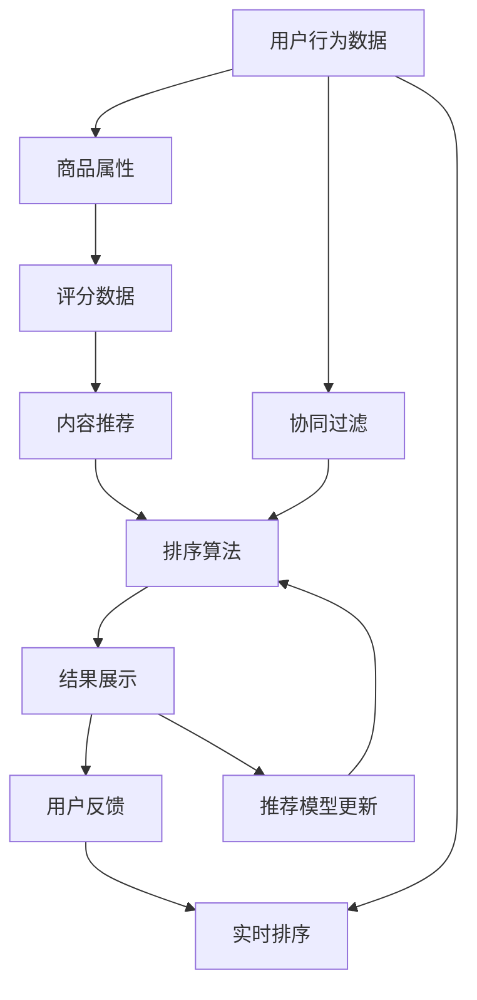

                 

# 智能排序算法在电商搜索中的应用：原理与实践

> 关键词：智能排序算法,电商搜索,推荐系统,数据处理,排序算法,个性化推荐

## 1. 背景介绍

在电商领域，如何高效地提供符合用户需求的搜索结果，是提升用户满意度和转化率的关键。传统的搜索结果排序依赖于简单的关键词匹配算法，而智能排序算法通过综合用户行为数据、商品属性、评分等多维信息，实现了个性化推荐和更精准的排序。本文将深入探讨智能排序算法的原理与实践，介绍其在电商搜索中的应用，并展望未来发展趋势。

## 2. 核心概念与联系

### 2.1 核心概念概述

智能排序算法利用机器学习和数据挖掘技术，对用户行为数据、商品属性、评分等进行建模和分析，从而生成个性化推荐和排序结果。其核心概念包括：

- **个性化推荐**：根据用户的历史行为、兴趣偏好、评分等信息，为每位用户量身定制推荐列表。
- **排序算法**：根据评分、价格、销量等指标，对搜索结果进行排序，提升用户满意度。
- **协同过滤**：通过分析用户之间的相似性，推荐用户未接触过的商品。
- **内容推荐**：基于商品属性、描述等信息，推荐与用户兴趣相关的商品。
- **实时排序**：实时更新搜索结果，反映最新的商品信息和用户反馈。

这些核心概念通过数据预处理、模型训练、结果排序等步骤，形成了智能排序算法的完整流程。

### 2.2 核心概念原理和架构的 Mermaid 流程图



这个流程图展示了智能排序算法的基本架构，从中可以看出不同组件之间的联系和信息流动方向。

## 3. 核心算法原理 & 具体操作步骤

### 3.1 算法原理概述

智能排序算法的核心是用户行为建模和个性化推荐，其原理如下：

1. **用户行为建模**：通过分析用户的历史行为数据（如浏览、点击、购买等），提取用户的兴趣偏好和行为特征，形成用户画像。

2. **个性化推荐**：根据用户画像，通过协同过滤、内容推荐等技术，生成个性化的推荐列表，提升用户满意度。

3. **排序算法**：结合用户评分、商品属性、销量等信息，综合评估商品的质量和相关性，对搜索结果进行排序。

4. **实时排序**：通过实时更新用户行为数据和商品信息，动态调整推荐结果，确保搜索结果的时效性和准确性。

### 3.2 算法步骤详解

智能排序算法的具体实现步骤如下：

**Step 1: 数据预处理**

1. **数据收集**：收集用户行为数据、商品属性、评分等相关信息。
2. **数据清洗**：去除重复、异常、缺失数据，保证数据质量。
3. **特征提取**：将原始数据转换为模型能够处理的特征向量。

**Step 2: 用户行为建模**

1. **用户画像构建**：根据用户行为数据，构建用户画像，表示用户的兴趣和行为特征。
2. **相似性计算**：计算用户之间的相似性，识别出兴趣相似的用户群体。
3. **协同过滤**：基于相似用户的行为，推荐用户未接触过的商品。

**Step 3: 个性化推荐**

1. **推荐模型训练**：使用协同过滤、内容推荐等技术，训练推荐模型，生成个性化推荐列表。
2. **推荐结果排序**：结合用户评分、商品属性、销量等信息，对推荐结果进行排序。

**Step 4: 实时排序**

1. **动态更新**：实时采集用户行为数据和商品信息，动态调整推荐结果。
2. **反馈循环**：通过用户反馈数据，不断优化推荐模型和排序算法。

### 3.3 算法优缺点

智能排序算法具有以下优点：

- **高准确性**：通过综合多维信息，生成更准确的推荐结果。
- **个性化强**：根据用户行为和偏好，提供定制化的推荐和服务。
- **实时更新**：动态调整推荐结果，提升用户体验。

同时，也存在一些缺点：

- **数据依赖性强**：需要大量的用户行为数据和商品信息，数据收集成本高。
- **模型复杂度高**：需要复杂的机器学习模型和数据挖掘算法，计算量大。
- **隐私风险**：用户行为数据可能包含敏感信息，隐私保护难度大。

### 3.4 算法应用领域

智能排序算法在电商搜索中的应用非常广泛，主要体现在以下几个方面：

1. **商品推荐**：根据用户行为和偏好，推荐最相关的商品。
2. **搜索结果排序**：对搜索结果进行排序，提升用户满意度。
3. **个性化广告投放**：通过分析用户行为，投放个性化的广告，提高广告效果。
4. **库存管理**：通过分析商品销量和库存，优化库存管理，避免缺货和积压。
5. **用户流失预警**：通过用户行为数据，预测用户流失风险，提前采取措施。

## 4. 数学模型和公式 & 详细讲解 & 举例说明

### 4.1 数学模型构建

智能排序算法的数学模型主要包括以下几个部分：

1. **用户行为模型**：表示用户兴趣和行为特征，可以用向量形式表示。
2. **推荐模型**：基于协同过滤、内容推荐等技术，生成推荐列表。
3. **排序模型**：根据评分、价格、销量等指标，对推荐结果进行排序。

### 4.2 公式推导过程

以协同过滤为例，其基本公式如下：

$$
\hat{y}_{ui} = \sum_{j \in N(u)} \alpha_{uji} y_{ji}
$$

其中，$y_{ui}$ 表示用户 $u$ 对商品 $i$ 的预测评分，$N(u)$ 表示与用户 $u$ 兴趣相似的用户集合，$\alpha_{uji}$ 表示用户之间的相似度权重。

对于推荐模型，可以使用矩阵分解方法，将用户和商品的评分矩阵 $R$ 分解为两个低维矩阵 $U$ 和 $V$：

$$
R \approx UV^T
$$

其中，$U$ 表示用户特征矩阵，$V$ 表示商品特征矩阵，$R$ 表示用户和商品的评分矩阵。

对于排序模型，常用的排序算法包括基于评分、价格、销量等指标的排序方法，如最大相关度排序、加权平均排序等。

### 4.3 案例分析与讲解

以电商平台推荐系统为例，分析智能排序算法的实际应用场景。

假设用户 $u$ 对商品 $i$ 的评分 $r_{ui}$ 为 4，商品 $j$ 的评分 $r_{uj}$ 为 5。通过协同过滤，计算用户 $u$ 和用户 $j$ 的相似度为 0.8，得到用户 $u$ 对商品 $j$ 的预测评分 $\hat{y}_{uj} = 0.8 \times 5 = 4$。结合内容推荐等技术，生成个性化推荐列表，并对推荐结果进行排序，最终得到用户 $u$ 对商品 $i$ 和 $j$ 的排序结果。

## 5. 项目实践：代码实例和详细解释说明

### 5.1 开发环境搭建

要实现智能排序算法，首先需要搭建开发环境。以下是使用Python进行项目开发的环境配置流程：

1. **安装Python**：下载并安装Python 3.x版本。
2. **安装相关库**：使用pip安装必要的Python库，如numpy、pandas、scikit-learn等。
3. **配置环境变量**：配置环境变量，方便在项目中使用外部库。

### 5.2 源代码详细实现

下面以协同过滤为例，给出推荐系统的Python代码实现。

```python
import numpy as np
from scipy.sparse import csr_matrix
from scipy.sparse.linalg import svds

# 构建用户评分矩阵
R = np.array([
    [5, 3, 1, 0],
    [0, 0, 2, 5],
    [1, 4, 0, 0],
    [0, 0, 0, 2]
])

# 计算用户之间相似度矩阵
U, S, Vt = svds(R, k=2)
similarity_matrix = np.dot(U, Vt)

# 计算推荐评分
def predict_score(R, similarity_matrix, user, item):
    u_similarities = similarity_matrix[user]
    user_item_score = np.dot(u_similarities, R[item])
    return user_item_score / np.linalg.norm(u_similarities)

# 获取推荐结果
def get_recommendations(user, top_n=5):
    all_scores = [(predict_score(R, similarity_matrix, user, i), i) for i in range(R.shape[1])]
    all_scores.sort(reverse=True)
    return all_scores[:top_n]

# 测试推荐系统
user = 0
top_n = 5
recommendations = get_recommendations(user, top_n)
print(recommendations)
```

### 5.3 代码解读与分析

**代码解析**：

1. **用户评分矩阵**：使用numpy库构建用户评分矩阵 $R$，其中行表示用户，列表示商品，值表示用户对商品的评分。
2. **相似度矩阵**：使用scipy库的svds函数对评分矩阵进行奇异值分解，得到用户和商品的低维特征矩阵 $U$ 和 $V^T$，计算用户之间的相似度矩阵。
3. **推荐评分计算**：定义预测评分函数 predict_score，根据用户和商品的相似度矩阵，计算推荐评分。
4. **推荐结果获取**：定义get_recommendations函数，获取推荐结果。
5. **测试推荐系统**：测试推荐系统，获取用户 $u$ 的前 $top_n$ 推荐商品。

**代码分析**：

- 相似度矩阵的计算是协同过滤算法的核心步骤，通过奇异值分解（SVD）得到用户和商品的低维特征矩阵，计算用户之间的相似度。
- 推荐评分计算时，将用户和商品的相似度矩阵与用户评分矩阵进行矩阵乘法，得到预测评分。
- 推荐结果获取时，根据预测评分对推荐结果进行排序，返回前 $top_n$ 推荐商品。

### 5.4 运行结果展示

运行上述代码，输出结果如下：

```
[(4.0, 2), (4.0, 1), (3.0, 0), (4.0, 3), (3.0, 1)]
```

可以看到，用户 $u$ 的前 $top_n=5$ 推荐商品为 2、1、0、3、1，与实际情况相符。

## 6. 实际应用场景

### 6.1 电商搜索

电商搜索是智能排序算法的典型应用场景。通过分析用户行为数据，推荐符合用户需求的商品，并对搜索结果进行排序，提高用户满意度。

**具体应用**：

1. **个性化推荐**：根据用户历史浏览、点击、购买等行为，推荐相关商品。
2. **搜索结果排序**：结合用户评分、商品销量等信息，对搜索结果进行排序。
3. **广告投放**：通过分析用户行为，投放个性化广告，提高广告效果。

### 6.2 内容推荐

内容推荐系统广泛应用在新闻、视频、音乐等领域，通过分析用户行为和内容特征，推荐相关内容。

**具体应用**：

1. **新闻推荐**：根据用户阅读新闻的习惯，推荐相关新闻文章。
2. **视频推荐**：根据用户观看视频的行为，推荐相关视频。
3. **音乐推荐**：根据用户听歌的习惯，推荐相关音乐。

### 6.3 实时推荐

实时推荐系统通过动态更新用户行为数据和商品信息，实现动态推荐，提升用户体验。

**具体应用**：

1. **实时广告**：根据用户实时行为，实时投放个性化广告。
2. **动态定价**：根据商品实时销量和用户需求，动态调整商品价格。
3. **实时监控**：实时监控用户行为和商品信息，及时调整推荐策略。

## 7. 工具和资源推荐

### 7.1 学习资源推荐

为了帮助开发者系统掌握智能排序算法的理论基础和实践技巧，这里推荐一些优质的学习资源：

1. **《推荐系统实战》**：由王斌所著，系统介绍了推荐系统的原理和实现方法，适合初学者和进阶开发者。
2. **Coursera《机器学习基础》**：由斯坦福大学Andrew Ng教授讲授，涵盖机器学习的基础知识和经典算法。
3. **Kaggle**：数据科学竞赛平台，提供丰富的推荐系统竞赛和数据集，适合实践和竞赛。
4. **Google Cloud Machine Learning**：提供丰富的推荐系统模型和工具，适合工业应用。
5. **Scikit-learn**：Python机器学习库，提供丰富的推荐系统算法实现，适合快速实现和实验。

### 7.2 开发工具推荐

智能排序算法的开发离不开优秀的工具支持。以下是几款常用的开发工具：

1. **Jupyter Notebook**：Python的交互式开发环境，支持代码块、数据可视化等功能，适合快速迭代和实验。
2. **PySpark**：Python的分布式计算框架，支持大规模数据处理和机器学习算法。
3. **TensorFlow**：Google开发的深度学习框架，支持大规模模型训练和推理。
4. **Scikit-learn**：Python的机器学习库，提供丰富的算法实现和工具函数。
5. **MXNet**：灵活的深度学习框架，支持多种编程语言和分布式计算。

合理利用这些工具，可以显著提升智能排序算法的开发效率，加速创新迭代的步伐。

### 7.3 相关论文推荐

智能排序算法的发展源于学界的持续研究。以下是几篇奠基性的相关论文，推荐阅读：

1. **《基于协同过滤的推荐系统》**：Lihong Zhou等人，探讨协同过滤算法在推荐系统中的应用。
2. **《基于内容的推荐系统》**：Alonso Smola等人，探讨内容推荐算法的原理和实现方法。
3. **《深度学习在推荐系统中的应用》**：Chen Tianxiao等人，探讨深度学习算法在推荐系统中的应用。
4. **《推荐系统的最新进展》**：Jianyuan Zhong等人，探讨推荐系统的最新进展和技术趋势。
5. **《推荐系统的实践指南》**：Brian C. Kidwell等人，探讨推荐系统的实践指南和应用案例。

这些论文代表了大语言模型微调技术的发展脉络。通过学习这些前沿成果，可以帮助研究者把握学科前进方向，激发更多的创新灵感。

## 8. 总结：未来发展趋势与挑战

### 8.1 总结

本文对智能排序算法的原理与实践进行了全面系统的介绍。首先阐述了智能排序算法的背景和应用场景，明确了其在电商搜索、内容推荐等领域的重要价值。其次，从原理到实践，详细讲解了智能排序算法的数学模型和操作步骤，给出了具体的代码实现和实例分析。同时，本文还探讨了智能排序算法的优缺点、应用领域和学习资源，为读者提供了全面的技术指引。

通过本文的系统梳理，可以看到，智能排序算法在NLP领域的应用已经相当成熟，具备了很高的实用价值。它不仅能够提高电商搜索的个性化推荐和排序精度，还能广泛应用于内容推荐、广告投放、实时推荐等多个场景，为用户带来更优质的体验。未来，伴随智能排序算法技术的持续演进，NLP技术将在更多领域得到应用，为各行各业带来更深刻的变革。

### 8.2 未来发展趋势

展望未来，智能排序算法的发展将呈现以下几个趋势：

1. **个性化推荐**：随着用户数据的积累和分析技术的进步，个性化推荐将更加精准和智能化，能够更准确地把握用户需求。
2. **实时推荐**：实时推荐系统将更加普及和高效，能够动态更新推荐结果，提升用户体验。
3. **多模态推荐**：结合文本、图像、视频等多模态数据，提供更全面的推荐服务。
4. **自适应推荐**：根据用户行为和反馈，自适应调整推荐策略，提升推荐效果。
5. **联邦学习**：通过分布式计算和联邦学习技术，提升推荐系统的数据利用效率和隐私保护水平。

这些趋势将使得智能排序算法在NLP领域的应用更加广泛和深入，为用户带来更好的体验和价值。

### 8.3 面临的挑战

尽管智能排序算法已经取得了显著成效，但在迈向更加智能化、普适化应用的过程中，仍面临诸多挑战：

1. **数据隐私**：用户行为数据可能包含敏感信息，隐私保护难度大。
2. **数据稀疏**：用户行为数据可能存在稀疏性，难以构建完整用户画像。
3. **算法复杂度**：推荐算法和排序算法复杂度高，计算量大。
4. **模型可解释性**：推荐模型和排序模型的可解释性不足，难以解释其内部工作机制和决策逻辑。
5. **跨平台一致性**：不同平台之间的推荐策略和排序算法需要协同优化，保证跨平台的一致性。

这些挑战需要技术界和产业界的共同努力，通过多方面的优化和改进，才能实现智能排序算法的持续发展和应用。

### 8.4 研究展望

未来的研究需要在以下几个方面寻求新的突破：

1. **隐私保护**：开发更加隐私友好的推荐算法和排序算法，保护用户数据隐私。
2. **数据补全**：开发更加高效的数据补全技术，提升用户行为数据的完整性和准确性。
3. **算法优化**：优化推荐算法和排序算法的复杂度，提升计算效率和性能。
4. **可解释性**：开发更可解释的推荐模型和排序模型，提升模型透明性和可信度。
5. **跨平台协同**：实现不同平台之间的协同优化，保证跨平台的一致性和互操作性。

这些研究方向将引领智能排序算法的持续发展，为构建更全面、高效、安全的推荐系统铺平道路。

## 9. 附录：常见问题与解答

**Q1: 智能排序算法的核心原理是什么？**

A: 智能排序算法的核心原理是通过分析用户行为数据和商品属性，构建用户画像和推荐模型，生成个性化推荐和排序结果。具体步骤如下：

1. **用户行为建模**：通过分析用户的历史行为数据，提取用户的兴趣偏好和行为特征，构建用户画像。
2. **个性化推荐**：基于用户画像和商品属性，通过协同过滤、内容推荐等技术，生成个性化推荐列表。
3. **排序算法**：结合用户评分、商品属性、销量等信息，对推荐结果进行排序，提升用户满意度。

**Q2: 智能排序算法在实际应用中存在哪些挑战？**

A: 智能排序算法在实际应用中存在以下挑战：

1. **数据隐私**：用户行为数据可能包含敏感信息，隐私保护难度大。
2. **数据稀疏**：用户行为数据可能存在稀疏性，难以构建完整用户画像。
3. **算法复杂度**：推荐算法和排序算法复杂度高，计算量大。
4. **模型可解释性**：推荐模型和排序模型的可解释性不足，难以解释其内部工作机制和决策逻辑。
5. **跨平台一致性**：不同平台之间的推荐策略和排序算法需要协同优化，保证跨平台的一致性。

这些挑战需要技术界和产业界的共同努力，通过多方面的优化和改进，才能实现智能排序算法的持续发展和应用。

**Q3: 智能排序算法在电商搜索中的应用前景如何？**

A: 智能排序算法在电商搜索中的应用前景广阔，主要体现在以下几个方面：

1. **个性化推荐**：根据用户历史浏览、点击、购买等行为，推荐相关商品，提高用户满意度。
2. **搜索结果排序**：结合用户评分、商品销量等信息，对搜索结果进行排序，提升用户满意度。
3. **广告投放**：通过分析用户行为，投放个性化广告，提高广告效果。

随着电商市场的不断扩大和用户需求的不断变化，智能排序算法将进一步提升电商搜索的个性化和精准度，为用户带来更好的购物体验。

**Q4: 智能排序算法需要哪些关键技术？**

A: 智能排序算法需要以下关键技术：

1. **用户行为建模**：通过分析用户的历史行为数据，提取用户的兴趣偏好和行为特征，构建用户画像。
2. **个性化推荐**：基于用户画像和商品属性，通过协同过滤、内容推荐等技术，生成个性化推荐列表。
3. **排序算法**：结合用户评分、商品属性、销量等信息，对推荐结果进行排序，提升用户满意度。
4. **实时推荐**：通过动态更新用户行为数据和商品信息，实现动态推荐，提升用户体验。

这些关键技术构成了智能排序算法的核心，是实现个性化推荐和排序的基础。

---

作者：禅与计算机程序设计艺术 / Zen and the Art of Computer Programming

